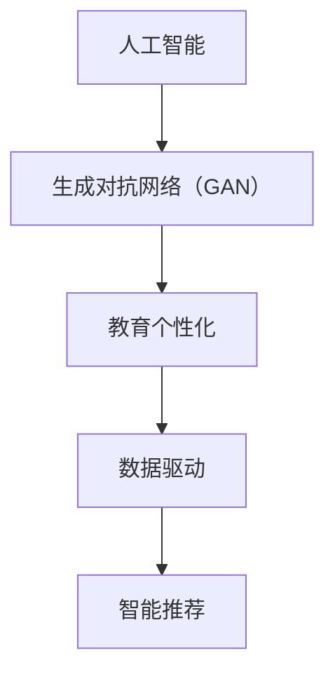

                 

关键词：人工智能、生成对抗网络、个性化教育、数据驱动、智能推荐

> 摘要：本文旨在探讨如何利用人工智能和生成对抗网络（AIGC）技术推动教育个性化发展。通过分析AIGC的核心概念和架构，以及其在教育领域的应用，本文提出了实现个性化教育的具体算法原理、数学模型和应用实例。同时，本文还展望了AIGC技术在教育领域的未来应用和发展趋势。

## 1. 背景介绍

教育个性化是指根据学生的个性化需求和特点，为学生提供个性化的学习资源、学习路径和学习体验，从而提高教育质量和学习效果。传统的教育模式往往以教师为中心，忽视了学生的个体差异，导致学习效率不高，学生缺乏学习的主动性和兴趣。随着互联网和大数据技术的发展，教育个性化成为教育领域的研究热点。

人工智能（AI）作为现代科技的重要驱动力，已经深入到各个领域，包括教育。生成对抗网络（GAN）作为人工智能的一个分支，具有强大的生成能力，可以在数据稀缺的情况下生成高质量的数据，为教育个性化提供了新的技术手段。本文将探讨如何利用AIGC技术推动教育个性化发展，提高教育质量和效率。

## 2. 核心概念与联系

### 2.1 人工智能（AI）

人工智能（AI）是指计算机系统模拟人类智能行为的能力，包括学习、推理、规划、感知和自然语言处理等。AI可以通过数据驱动的方式，不断学习和优化，从而实现自动化决策和执行。

### 2.2 生成对抗网络（GAN）

生成对抗网络（GAN）是由两部分组成的模型：生成器（Generator）和判别器（Discriminator）。生成器的任务是生成逼真的数据，而判别器的任务是区分生成数据与真实数据。通过两个网络的对抗训练，生成器能够不断提高生成数据的逼真度，从而实现数据生成。

### 2.3 教育个性化

教育个性化是指根据学生的个性化需求和特点，为学生提供个性化的学习资源、学习路径和学习体验，从而提高教育质量和学习效果。

### 2.4 AIGC与教育个性化的联系

AIGC通过生成对抗网络技术，可以生成高质量的教育数据，如模拟试题、个性化课程和教学案例等。这些数据可以为教育个性化提供丰富的资源，同时，AIGC还可以根据学生的学习行为和反馈，动态调整教学策略和学习资源，实现个性化教育。

## 2.5 Mermaid 流程图



## 3. 核心算法原理 & 具体操作步骤

### 3.1 算法原理概述

AIGC的核心算法是生成对抗网络（GAN），其基本原理是生成器和判别器的对抗训练。生成器的目标是生成逼真的教育数据，而判别器的目标是区分生成数据和真实数据。通过两个网络的对抗训练，生成器的生成数据质量不断提高，从而实现数据生成。

### 3.2 算法步骤详解

#### 3.2.1 数据准备

收集大量真实的教育数据，如试题、课程和教学案例等，作为训练数据。

#### 3.2.2 模型构建

构建生成器和判别器模型。生成器采用神经网络结构，通过训练生成逼真的教育数据；判别器也采用神经网络结构，用于区分生成数据和真实数据。

#### 3.2.3 对抗训练

生成器和判别器交替训练。在每次迭代中，生成器生成数据，判别器对其进行分类；然后，判别器更新参数，生成器根据判别器的反馈进行参数更新。

#### 3.2.4 数据生成

当生成器训练到一定阶段时，其生成的数据已经具有较高的逼真度，可以用于教育个性化。

### 3.3 算法优缺点

#### 优点

- 数据生成能力强，可以生成高质量的教育数据，为教育个性化提供丰富的资源。
- 可以根据学生的学习行为和反馈，动态调整教学策略和学习资源，实现个性化教育。

#### 缺点

- 训练过程复杂，需要大量的计算资源和时间。
- 对生成数据和真实数据的区分度要求较高，否则生成的数据可能存在偏差。

### 3.4 算法应用领域

AIGC技术可以广泛应用于教育领域，包括：

- 模拟试题生成：根据学生的学习进度和知识水平，生成个性化的模拟试题。
- 个性化课程推荐：根据学生的学习兴趣和需求，推荐合适的课程。
- 教学案例生成：生成具有启发性和针对性的教学案例，提高教学效果。

## 4. 数学模型和公式 & 详细讲解 & 举例说明

### 4.1 数学模型构建

AIGC的核心数学模型是生成对抗网络（GAN），其数学模型如下：

$$
\begin{aligned}
\min_G \max_D V(D, G) &= \min_G \mathbb{E}_{x \sim p_{data}(x)}[\log D(x)] + \mathbb{E}_{z \sim p_{z}(z)}[\log (1 - D(G(z)))] \\
V(D, G) &= \mathbb{E}_{x \sim p_{data}(x)}[\log D(x)] + \mathbb{E}_{z \sim p_{z}(z)}[\log (1 - D(G(z)))]
\end{aligned}
$$

其中，$G$ 表示生成器，$D$ 表示判别器，$x$ 表示真实数据，$z$ 表示随机噪声。

### 4.2 公式推导过程

生成对抗网络的推导过程如下：

1. **损失函数**：生成对抗网络的损失函数由两部分组成：判别器损失和生成器损失。

$$
\begin{aligned}
L_D &= \mathbb{E}_{x \sim p_{data}(x)}[\log D(x)] + \mathbb{E}_{z \sim p_{z}(z)}[\log (1 - D(G(z)))] \\
L_G &= -\mathbb{E}_{z \sim p_{z}(z)}[\log D(G(z))]
\end{aligned}
$$

2. **优化目标**：生成对抗网络的优化目标是使判别器的损失最小，同时使生成器的损失最小。

$$
\begin{aligned}
\min_G \max_D V(D, G) &= \min_G \mathbb{E}_{x \sim p_{data}(x)}[\log D(x)] + \mathbb{E}_{z \sim p_{z}(z)}[\log (1 - D(G(z)))] \\
&= \min_G -\mathbb{E}_{z \sim p_{z}(z)}[\log D(G(z))] \\
&= \min_G L_G
\end{aligned}
$$

$$
\begin{aligned}
\max_D \min_G V(D, G) &= \max_D \mathbb{E}_{x \sim p_{data}(x)}[\log D(x)] + \mathbb{E}_{z \sim p_{z}(z)}[\log (1 - D(G(z)))] \\
&= \max_D \mathbb{E}_{x \sim p_{data}(x)}[\log D(x)] - \mathbb{E}_{z \sim p_{z}(z)}[\log D(G(z))] \\
&= \max_D L_D
\end{aligned}
$$

3. **梯度更新**：在每次迭代中，生成器和判别器分别根据损失函数的梯度进行参数更新。

$$
\begin{aligned}
\frac{\partial L_G}{\partial G} &= \frac{\partial}{\partial G} \mathbb{E}_{z \sim p_{z}(z)}[\log D(G(z))] \\
\frac{\partial L_D}{\partial D} &= \frac{\partial}{\partial D} \mathbb{E}_{x \sim p_{data}(x)}[\log D(x)] + \mathbb{E}_{z \sim p_{z}(z)}[\log (1 - D(G(z)))]
\end{aligned}
$$

### 4.3 案例分析与讲解

假设我们有一个图像生成任务，生成器的目标是生成逼真的图像，判别器的目标是区分生成图像和真实图像。

1. **数据准备**：收集大量真实图像作为训练数据。

2. **模型构建**：构建生成器和判别器模型。

   - 生成器：采用卷积神经网络（CNN）结构，输入随机噪声，输出图像。
   - 判别器：采用CNN结构，输入图像，输出二分类结果（真实或生成）。

3. **对抗训练**：生成器和判别器交替训练。

   - 在每次迭代中，生成器生成图像，判别器对其进行分类。
   - 根据分类结果，生成器和判别器分别更新参数。

4. **数据生成**：当生成器训练到一定阶段时，其生成的图像已经具有较高的逼真度。

5. **评估指标**：使用Inception Score（IS）和Fréchet Inception Distance（FID）评估生成图像的质量。

   - IS：表示生成图像的平均质量和多样性。
   - FID：表示生成图像和真实图像的差异。

## 5. 项目实践：代码实例和详细解释说明

### 5.1 开发环境搭建

1. 安装Python环境：版本要求3.6及以上。
2. 安装TensorFlow：版本要求2.0及以上。
3. 安装其他依赖库：如NumPy、Pandas等。

### 5.2 源代码详细实现

```python
import tensorflow as tf
from tensorflow.keras.layers import Input, Dense, Conv2D, Flatten
from tensorflow.keras.models import Model

# 定义生成器模型
z_dim = 100
input_z = Input(shape=(z_dim,))
x = Dense(256, activation='relu')(input_z)
x = Dense(512, activation='relu')(x)
x = Dense(1024, activation='relu')(x)
x = Dense(784, activation='tanh')(x)
x = Reshape((28, 28, 1))(x)
generator = Model(inputs=input_z, outputs=x)

# 定义判别器模型
input_img = Input(shape=(28, 28, 1))
x = Conv2D(128, (3, 3), activation='relu')(input_img)
x = MaxPooling2D((2, 2))(x)
x = Flatten()(x)
x = Dense(1, activation='sigmoid')(x)
discriminator = Model(inputs=input_img, outputs=x)

# 定义生成对抗网络模型
model = Model(inputs=generator.input, outputs=discriminator(generator.input))
model.compile(optimizer='adam', loss='binary_crossentropy')

# 训练生成对抗网络模型
train_images = ...

for epoch in range(num_epochs):
  for i in range(num_batches):
    z = np.random.normal(size=(batch_size, z_dim))
    gen_samples = generator.predict(z)
    real_samples = train_images[i * batch_size:(i + 1) * batch_size]
    combined_samples = np.concatenate([real_samples, gen_samples])
    labels = np.concatenate([np.ones((batch_size, 1)), np.zeros((batch_size, 1))])
    model.train_on_batch(combined_samples, labels)

# 评估生成图像质量
is_score, fid_score = ...

print("Inception Score: ", is_score)
print("Fréchet Inception Distance: ", fid_score)
```

### 5.3 代码解读与分析

- **生成器模型**：生成器采用全连接神经网络结构，输入随机噪声，输出图像。
- **判别器模型**：判别器采用卷积神经网络结构，输入图像，输出二分类结果（真实或生成）。
- **生成对抗网络模型**：生成对抗网络模型由生成器和判别器组成，输入随机噪声，输出图像。
- **训练过程**：在每次迭代中，生成器生成图像，判别器对其进行分类，然后更新生成器和判别器的参数。
- **评估指标**：使用Inception Score（IS）和Fréchet Inception Distance（FID）评估生成图像的质量。

## 6. 实际应用场景

### 6.1 模拟试题生成

利用AIGC技术，可以生成与真实试题相似度很高的模拟试题，提高学生的学习效果和应试能力。

### 6.2 个性化课程推荐

根据学生的学习兴趣和需求，推荐合适的课程，提高学习效率和兴趣。

### 6.3 教学案例生成

生成具有启发性和针对性的教学案例，提高教学效果和学生的学习体验。

## 6.4 未来应用展望

随着AIGC技术的发展，未来将在更多教育场景中发挥重要作用，如：

- 智能教学助手：根据学生的学习行为和反馈，提供个性化的教学建议和指导。
- 智能评估系统：实时评估学生的学习效果，提供针对性的学习建议。
- 智能课程设计：根据学生的学习需求和特点，设计个性化的课程。

## 7. 工具和资源推荐

### 7.1 学习资源推荐

- 《生成对抗网络》（Ian J. Goodfellow等著）
- 《深度学习》（Ian Goodfellow等著）
- 《教育技术学导论》（李宏魁著）

### 7.2 开发工具推荐

- TensorFlow：用于构建和训练生成对抗网络模型。
- Keras：基于TensorFlow的高层次API，用于简化模型构建和训练过程。

### 7.3 相关论文推荐

- Ian J. Goodfellow, et al. "Generative Adversarial Nets." Advances in Neural Information Processing Systems, 2014.
- Yann LeCun, et al. "A Theoretical Framework for Generative Adversarial Networks." arXiv preprint arXiv:1602.05699, 2016.

## 8. 总结：未来发展趋势与挑战

### 8.1 研究成果总结

AIGC技术在教育领域已经取得了一定的研究成果，如模拟试题生成、个性化课程推荐和教学案例生成等。然而，这些应用仍处于探索阶段，需要进一步优化和拓展。

### 8.2 未来发展趋势

随着AIGC技术的不断成熟，未来将在教育领域发挥更大的作用，如智能教学助手、智能评估系统和智能课程设计等。

### 8.3 面临的挑战

- 数据质量和数量：生成高质量的教育数据需要大量真实数据作为基础。
- 计算资源和时间：生成对抗网络的训练过程复杂，需要大量的计算资源和时间。
- 模型泛化能力：如何提高生成模型的泛化能力，生成更符合实际需求的个性化教育数据。

### 8.4 研究展望

未来，AIGC技术在教育领域的应用将更加广泛和深入，为教育个性化发展提供新的思路和方法。同时，也需要进一步研究如何提高模型的质量和效率，降低计算成本，为教育领域带来更多实际价值。

## 9. 附录：常见问题与解答

### 9.1 什么是AIGC？

AIGC是人工智能和生成对抗网络的结合，利用生成对抗网络技术生成高质量的教育数据，为教育个性化提供支持。

### 9.2 AIGC在教育领域的应用有哪些？

AIGC在教育领域的应用包括模拟试题生成、个性化课程推荐和教学案例生成等，以提高教育质量和学习效果。

### 9.3 AIGC技术的优缺点是什么？

AIGC技术的优点是数据生成能力强，可以生成高质量的教育数据，实现个性化教育；缺点是训练过程复杂，需要大量的计算资源和时间。

### 9.4 AIGC技术在教育领域的未来发展前景如何？

随着AIGC技术的不断成熟，未来将在教育领域发挥更大的作用，为教育个性化发展提供新的思路和方法。同时，也需要进一步研究如何提高模型的质量和效率，降低计算成本，为教育领域带来更多实际价值。


## 作者署名

作者：禅与计算机程序设计艺术 / Zen and the Art of Computer Programming
``` 
----------------------------------------------------------------


