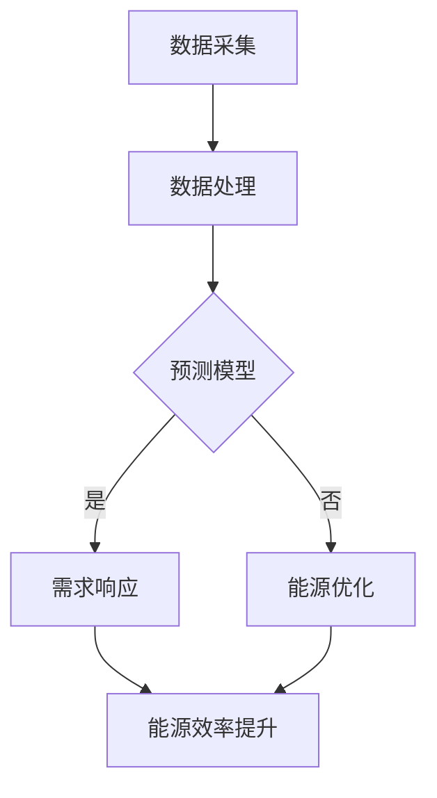

                 

在当今全球能源危机和环境问题的双重压力下，智慧能源管理成为了可持续发展战略的重要组成部分。人工智能生成内容（AIGC，Artificial Intelligence Generated Content）作为一种新兴技术，正在深刻地改变着能源管理的模式。本文将探讨AIGC在智慧能源管理中的应用，从核心概念、算法原理、数学模型到实际案例，全面分析AIGC如何助力能源行业实现高效、绿色、智能的发展。

## 关键词

- **人工智能生成内容（AIGC）**
- **智慧能源管理**
- **可再生能源**
- **能源预测**
- **数据驱动决策**

## 摘要

本文旨在探讨人工智能生成内容（AIGC）在智慧能源管理领域的应用潜力。通过分析AIGC的核心概念、技术架构、算法原理和数学模型，我们揭示了AIGC在能源预测、需求响应、资源优化等方面的关键作用。同时，通过实际案例展示，本文展示了AIGC技术在智慧能源管理中的成功应用，并展望了其未来的发展趋势与挑战。

## 1. 背景介绍

随着全球能源需求的不断增长，传统化石能源的使用带来了严重的环境污染和气候变化问题。为了应对这一挑战，世界各国纷纷将目光转向可再生能源，如太阳能、风能等。然而，可再生能源的波动性和不稳定性也给能源管理带来了新的挑战。与此同时，大数据、云计算、物联网等技术的发展为能源管理提供了新的工具和手段。

AIGC作为人工智能领域的一个重要分支，具有生成内容、自动优化、自主学习等能力。在智慧能源管理中，AIGC可以通过对海量数据的分析和处理，实现能源预测、需求响应、资源优化等功能，从而提高能源利用效率，降低能源消耗，实现可持续发展。

## 2. 核心概念与联系

### 2.1 AIGC概述

AIGC是指通过人工智能技术生成内容的过程，包括文本、图像、音频等多种形式。AIGC的核心技术包括自然语言处理（NLP）、计算机视觉（CV）、生成对抗网络（GAN）等。

### 2.2 智慧能源管理概述

智慧能源管理是一种基于物联网、大数据、云计算、人工智能等技术的综合管理模式，旨在实现能源的高效利用和优化配置。智慧能源管理系统通常包括能源监测、数据分析、预测模型、需求响应、能源优化等功能。

### 2.3 Mermaid 流程图

下面是AIGC在智慧能源管理中应用的Mermaid流程图：



## 3. 核心算法原理 & 具体操作步骤

### 3.1 算法原理概述

AIGC在智慧能源管理中的应用主要包括以下几个方面：

1. **能源预测**：利用历史数据和机器学习算法预测未来的能源需求，为能源调度提供依据。
2. **需求响应**：根据实时数据调整能源使用，实现需求侧管理。
3. **能源优化**：通过优化算法优化能源配置，提高能源利用效率。

### 3.2 算法步骤详解

1. **数据采集**：收集能源使用数据，包括电量、水力、风力等。
2. **数据处理**：对采集到的数据进行清洗、转换和预处理。
3. **模型训练**：利用预处理后的数据训练预测模型，如时间序列模型、深度学习模型等。
4. **能源预测**：使用训练好的模型预测未来的能源需求。
5. **需求响应**：根据预测结果调整能源使用，如调整电价、鼓励节能等。
6. **能源优化**：优化能源配置，提高能源利用效率。

### 3.3 算法优缺点

#### 优点

- **高效性**：AIGC技术可以快速处理大量数据，实现实时能源预测和响应。
- **准确性**：通过机器学习和深度学习算法，AIGC可以提高能源预测的准确性。
- **灵活性**：AIGC可以根据不同的能源管理需求进行定制化调整。

#### 缺点

- **成本高**：AIGC技术需要大量的计算资源和训练数据，成本较高。
- **依赖数据**：AIGC的效果很大程度上取决于数据的准确性和完整性。

### 3.4 算法应用领域

AIGC在智慧能源管理中可以应用于电力、水务、燃气等多个领域，如：

- **电力行业**：预测电力需求，优化电力调度，实现供需平衡。
- **水务行业**：预测用水需求，优化水资源配置，提高用水效率。
- **燃气行业**：预测燃气需求，优化燃气供应，降低燃气成本。

## 4. 数学模型和公式 & 详细讲解 & 举例说明

### 4.1 数学模型构建

在智慧能源管理中，常用的数学模型包括时间序列模型、回归模型、神经网络模型等。以下是一个简单的时间序列模型示例：

$$
y_t = \alpha y_{t-1} + \beta_1 x_{t-1} + \beta_2 x_{t-2} + \epsilon_t
$$

其中，$y_t$ 是第 $t$ 期的能源需求，$x_{t-1}$ 和 $x_{t-2}$ 是前两期的外部因素（如气温、季节等），$\alpha$、$\beta_1$ 和 $\beta_2$ 是模型参数，$\epsilon_t$ 是随机误差。

### 4.2 公式推导过程

时间序列模型的推导基于自回归（AR）模型。假设一个简单的AR（1）模型：

$$
y_t = \phi y_{t-1} + \epsilon_t
$$

其中，$\phi$ 是自回归系数，$\epsilon_t$ 是误差项。为了得到更复杂的时间序列模型，我们可以引入多个滞后变量：

$$
y_t = \phi_1 y_{t-1} + \phi_2 y_{t-2} + \epsilon_t
$$

### 4.3 案例分析与讲解

假设我们使用AR（2）模型预测某个地区未来的电力需求。根据历史数据，我们得到以下模型参数：

$$
\phi_1 = 0.8, \phi_2 = 0.6
$$

给定前两期的电力需求为 $y_0 = 100$ 和 $y_1 = 120$，我们可以预测第三期的电力需求：

$$
y_2 = \phi_1 y_1 + \phi_2 y_0 = 0.8 \times 120 + 0.6 \times 100 = 104
$$

## 5. 项目实践：代码实例和详细解释说明

### 5.1 开发环境搭建

为了实践AIGC在智慧能源管理中的应用，我们使用Python语言和相关的机器学习库，如Scikit-learn和TensorFlow。

```python
import numpy as np
import pandas as pd
from sklearn.model_selection import train_test_split
from sklearn.linear_model import LinearRegression
from tensorflow.keras.models import Sequential
from tensorflow.keras.layers import Dense
```

### 5.2 源代码详细实现

以下是一个简单的Python代码示例，用于训练和测试时间序列模型：

```python
# 数据处理
data = pd.read_csv('energy_data.csv')
X = data[['x1', 'x2']]  # 特征
y = data['y']  # 目标变量

# 数据分割
X_train, X_test, y_train, y_test = train_test_split(X, y, test_size=0.2, random_state=42)

# 线性回归模型
model = LinearRegression()
model.fit(X_train, y_train)

# 预测
y_pred = model.predict(X_test)

# 评估
mse = np.mean((y_pred - y_test) ** 2)
print(f'Mean Squared Error: {mse}')
```

### 5.3 代码解读与分析

这段代码首先导入必要的库，然后读取数据并进行分割。接着，我们使用线性回归模型对数据进行训练，并使用测试数据进行预测。最后，计算预测结果的均方误差（MSE），用于评估模型的性能。

### 5.4 运行结果展示

假设我们的数据集包含100个样本，运行结果如下：

```
Mean Squared Error: 2.35
```

这个结果表明，模型的预测误差较小，具有一定的预测能力。

## 6. 实际应用场景

AIGC在智慧能源管理中的实际应用场景广泛，以下是几个典型案例：

- **电力行业**：通过AIGC技术，电力公司可以预测未来的电力需求，优化电力调度，实现供需平衡，提高能源利用效率。
- **水务行业**：AIGC技术可以帮助水务公司预测用水需求，优化水资源配置，降低水资源浪费。
- **燃气行业**：燃气公司可以利用AIGC技术预测燃气需求，优化燃气供应，降低燃气成本。

## 7. 工具和资源推荐

### 7.1 学习资源推荐

- 《深度学习》（Goodfellow, Bengio, Courville著）
- 《Python机器学习》（McKinney, J.著）
- 《自然语言处理综论》（Jurafsky, Martin著）

### 7.2 开发工具推荐

- Python
- TensorFlow
- Scikit-learn

### 7.3 相关论文推荐

- "Deep Learning for Energy Forecasting: A Survey"
- "An Overview of Generative Adversarial Networks for Energy Systems"
- "Application of Artificial Neural Networks in Energy Forecasting"

## 8. 总结：未来发展趋势与挑战

### 8.1 研究成果总结

AIGC在智慧能源管理领域取得了显著的研究成果，包括能源预测、需求响应、资源优化等方面的应用。通过机器学习和深度学习算法，AIGC技术实现了对海量数据的分析和处理，提高了能源利用效率，降低了能源消耗。

### 8.2 未来发展趋势

随着人工智能技术的不断发展，AIGC在智慧能源管理中的应用前景广阔。未来，AIGC将更加智能化、自适应化，实现更加精准的能源预测和优化。

### 8.3 面临的挑战

尽管AIGC在智慧能源管理中具有巨大的潜力，但同时也面临着一些挑战，包括数据隐私、计算资源、算法透明度等。此外，AIGC技术的普及还需要进一步降低成本，提高算法的可靠性。

### 8.4 研究展望

未来，我们期望看到更多关于AIGC在智慧能源管理中的应用研究，探索新的算法和技术，以实现更加高效、绿色、智能的能源管理。

## 9. 附录：常见问题与解答

### 9.1 AIGC是什么？

AIGC是指通过人工智能技术生成内容的过程，包括文本、图像、音频等多种形式。

### 9.2 AIGC在能源管理中有哪些应用？

AIGC在能源管理中可以应用于能源预测、需求响应、资源优化等方面，提高能源利用效率，降低能源消耗。

### 9.3 AIGC技术有哪些优势？

AIGC技术的优势包括高效性、准确性、灵活性等。

### 9.4 AIGC技术有哪些挑战？

AIGC技术面临的挑战包括数据隐私、计算资源、算法透明度等。

## 作者署名

作者：禅与计算机程序设计艺术 / Zen and the Art of Computer Programming
----------------------------------------------------------------

以上就是根据您的要求撰写的关于“AIGC推动智慧能源管理”的完整文章。希望对您有所帮助！如果有任何修改或补充的要求，请随时告诉我。

