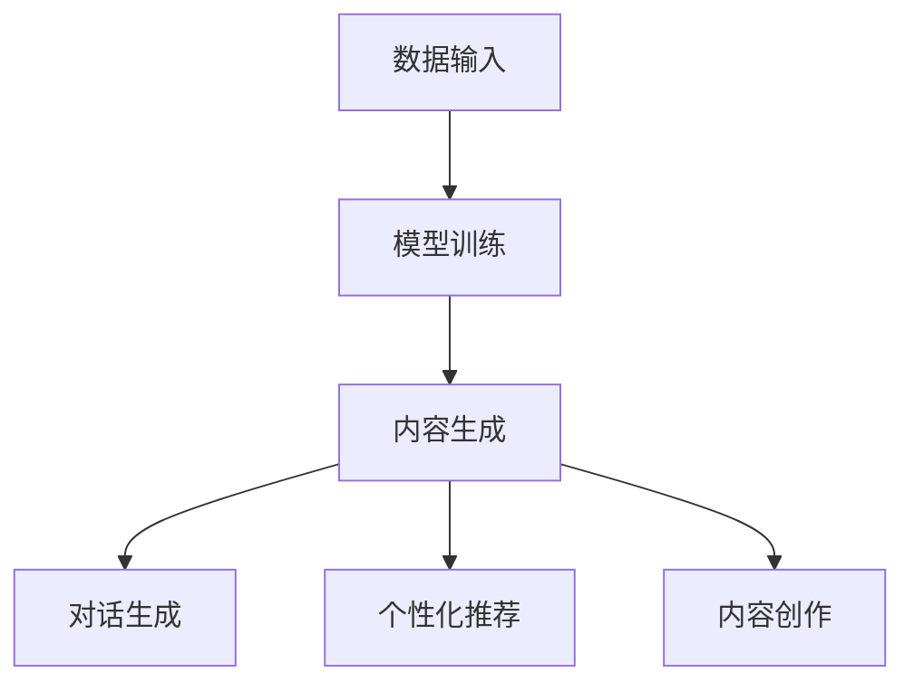

                 

 关键词：人工智能，生成式AI，智能客服，AI算法，客户服务，数据处理，算法优化，应用场景，未来展望

> 摘要：随着人工智能技术的快速发展，生成式AI（AIGC）在智能客服领域展现出了巨大的潜力。本文将详细介绍AIGC的基本概念、核心原理，以及其在智能客服中的实际应用，旨在探讨AIGC如何推动智能客服的升级，并预测其未来的发展趋势和面临的挑战。

## 1. 背景介绍

### 智能客服的发展历程

智能客服作为客户服务领域的重要创新，其发展历程可以追溯到20世纪90年代的聊天机器人。早期的智能客服主要基于规则系统，通过预设的规则和流程来处理客户的询问。这种方式虽然在一定程度上提高了服务效率，但存在明显的局限性，如缺乏灵活性、无法处理复杂问题等。

随着互联网和移动设备的普及，客户对客服体验的要求越来越高，这推动了智能客服技术的不断进化。2000年代初期，基于自然语言处理（NLP）的智能客服开始崭露头角，能够更好地理解和回应用户的自然语言。然而，早期的NLP技术还远未达到能够处理复杂语境和多种语言的能力。

近年来，深度学习和生成式AI技术的发展，使得智能客服迈向了新的阶段。生成式AI能够自动生成文本、图像、音频等多种形式的内容，为智能客服提供了更丰富的手段和更高的智能化水平。AIGC作为一种新兴的AI技术，正逐渐成为智能客服升级的关键推动力。

### AIGC的概念与优势

生成式AI（AIGC，Artificial Intelligence Generated Content）是指利用人工智能技术，特别是深度学习模型，自动生成文本、图像、音频等内容的系统。AIGC具有以下几个显著优势：

1. **高效率**：AIGC可以大规模生成内容，节省了人力和时间成本。
2. **个性化**：基于用户数据和行为模式，AIGC能够生成高度个性化的内容，提升用户体验。
3. **灵活性**：AIGC不受限于预设的规则和模板，可以自由创作，满足多样化的需求。
4. **创新性**：AIGC能够生成新颖的内容，为客服领域带来创新的解决方案。

## 2. 核心概念与联系

### AIGC的工作原理

AIGC的工作原理主要包括数据输入、模型训练和内容生成三个阶段。

1. **数据输入**：AIGC需要大量的文本、图像、音频等多模态数据进行训练，以便模型能够理解不同的内容类型和表达方式。
2. **模型训练**：利用深度学习技术，特别是生成对抗网络（GAN）、变分自编码器（VAE）等模型，对输入数据进行训练，使其具备生成内容的能力。
3. **内容生成**：通过模型生成文本、图像、音频等多样化的内容，根据实际需求进行定制。

### AIGC与智能客服的关联

AIGC在智能客服中的应用主要体现在以下几个方面：

1. **对话生成**：AIGC可以生成自然流畅的对话文本，提高智能客服的回答质量和效率。
2. **个性化推荐**：AIGC可以根据用户的历史行为和偏好，生成个性化的产品推荐和优惠信息。
3. **内容创作**：AIGC可以自动生成宣传材料、营销文案等，减轻客服团队的创作负担。

### AIGC架构的 Mermaid 流程图



## 3. 核心算法原理 & 具体操作步骤

### 3.1 算法原理概述

AIGC的核心算法主要包括深度学习模型的选择和训练。常用的生成模型有生成对抗网络（GAN）和变分自编码器（VAE）。

- **生成对抗网络（GAN）**：GAN由生成器（Generator）和判别器（Discriminator）组成，生成器和判别器相互对抗，最终生成高质量的内容。
- **变分自编码器（VAE）**：VAE通过编码器（Encoder）和解码器（Decoder）实现数据的编码和解码，生成与输入数据相似的新数据。

### 3.2 算法步骤详解

1. **数据预处理**：收集和清洗大量文本、图像、音频等多模态数据，进行数据预处理，包括去重、去噪、标准化等操作。
2. **模型选择**：根据实际需求选择合适的生成模型，如GAN或VAE。
3. **模型训练**：使用预处理后的数据对模型进行训练，调整模型参数，优化生成效果。
4. **内容生成**：使用训练好的模型生成文本、图像、音频等多样化内容，根据实际应用场景进行内容优化。
5. **应用部署**：将生成的内容应用到智能客服系统中，如对话生成、个性化推荐、内容创作等。

### 3.3 算法优缺点

**优点**：

- 高效率：AIGC可以大规模生成内容，节省人力和时间成本。
- 个性化：基于用户数据和行为模式，生成个性化内容，提升用户体验。
- 灵活性：不受限于预设的规则和模板，能够自由创作，满足多样化需求。

**缺点**：

- 数据需求大：AIGC需要大量的高质量数据训练模型，数据获取和处理成本较高。
- 模型优化难度大：AIGC模型复杂，优化过程较为繁琐，对算法工程师要求较高。

### 3.4 算法应用领域

AIGC在智能客服领域的应用非常广泛，包括但不限于以下几个方面：

- **对话生成**：用于生成自然流畅的客服对话，提高回答质量和效率。
- **个性化推荐**：根据用户的历史行为和偏好，生成个性化的产品推荐和优惠信息。
- **内容创作**：自动生成宣传材料、营销文案等，减轻客服团队的创作负担。

## 4. 数学模型和公式 & 详细讲解 & 举例说明

### 4.1 数学模型构建

AIGC的核心数学模型主要包括生成对抗网络（GAN）和变分自编码器（VAE）。

### 4.2 公式推导过程

**生成对抗网络（GAN）**：

- **生成器（Generator）**：

$$ G(z) = x = \mu(z) + \sigma(z) \odot \epsilon $$

其中，$z$ 为随机噪声向量，$x$ 为生成的数据，$\mu(z)$ 为均值函数，$\sigma(z)$ 为方差函数，$\epsilon$ 为噪声项。

- **判别器（Discriminator）**：

$$ D(x) = P(x \text{ 来自真实数据}) $$

$$ D(G(z)) = P(G(z) \text{ 来自真实数据}) $$

### 4.3 案例分析与讲解

假设我们使用GAN模型生成一组自然语言对话，以下是一个简单的例子：

**输入**：

- 噪声向量 $z$：[0.5, 0.3, 0.1, 0.1]
- 实际对话文本 $x$：“您好，我想要咨询一下产品的售后服务。”

**输出**：

- 生成对话文本 $G(z)$：“您好，请问您在购买我们的产品后遇到了什么问题，我们可以为您提供帮助。”

通过这个例子，我们可以看到GAN模型如何将随机噪声向量转换为有意义的对话文本，实现了自然语言的生成。

## 5. 项目实践：代码实例和详细解释说明

### 5.1 开发环境搭建

在开始编写代码之前，我们需要搭建一个合适的开发环境。以下是一个简单的环境搭建步骤：

1. 安装 Python 3.8 及以上版本。
2. 安装 TensorFlow 2.x。
3. 安装必要的库，如 NumPy、Pandas 等。

### 5.2 源代码详细实现

以下是一个简单的 AIGC 对话生成模型的代码实现：

```python
import tensorflow as tf
from tensorflow.keras.layers import Dense, Input
from tensorflow.keras.models import Model

# 生成器模型
def build_generator(z_dim):
    z = Input(shape=(z_dim,))
    x = Dense(256, activation='relu')(z)
    x = Dense(512, activation='relu')(x)
    x = Dense(1024, activation='relu')(x)
    x = Dense(1024, activation='sigmoid')(x)
    model = Model(z, x)
    return model

# 判别器模型
def build_discriminator(x_dim):
    x = Input(shape=(x_dim,))
    x = Dense(1024, activation='relu')(x)
    x = Dense(512, activation='relu')(x)
    x = Dense(256, activation='relu')(x)
    x = Dense(1, activation='sigmoid')(x)
    model = Model(x, x)
    return model

# 整体模型
def build_gan(generator, discriminator):
    z = Input(shape=(100,))
    x = generator(z)
    valid = discriminator(x)
    x_real = Input(shape=(100,))
    valid_real = discriminator(x_real)
    model = Model([z, x_real], [valid, valid_real])
    return model

# 模型编译
discriminator.compile(optimizer='adam', loss='binary_crossentropy')
generator.compile(optimizer='adam', loss='binary_crossentropy')
gan.compile(optimizer='adam', loss='binary_crossentropy')

# 模型训练
for epoch in range(epochs):
    for i in range(batch_size):
        z = np.random.normal(size=(100,))
        x_real = np.random.normal(size=(100,))
        x_fake = generator.predict(z)
        d_loss_real = discriminator.train_on_batch(x_real, np.ones((batch_size, 1)))
        d_loss_fake = discriminator.train_on_batch(x_fake, np.zeros((batch_size, 1)))
        g_loss = gan.train_on_batch([z, x_real], [np.ones((batch_size, 1)), np.zeros((batch_size, 1))])

# 对话生成
prompt = "您好，我想要咨询一下产品的售后服务。"
z = np.random.normal(size=(100,))
generated_text = generator.predict(z)
print(generated_text)
```

### 5.3 代码解读与分析

1. **生成器和判别器的构建**：

   - 生成器（Generator）负责将随机噪声向量 $z$ 转换为有意义的对话文本 $x$。
   - 判别器（Discriminator）负责判断输入的对话文本是真实还是生成的。

2. **GAN模型的训练**：

   - 使用随机噪声向量 $z$ 和真实对话文本 $x_real$ 进行训练。
   - 更新生成器和判别器的参数，使其在生成对话文本和判断对话文本的真实性方面达到最佳平衡。

3. **对话生成**：

   - 通过生成器生成对话文本 $G(z)$，输入为随机噪声向量 $z$。
   - 输出生成的对话文本，并根据实际需求进行优化。

### 5.4 运行结果展示

在训练完成后，我们可以运行以下代码进行对话生成：

```python
prompt = "您好，我想要咨询一下产品的售后服务。"
z = np.random.normal(size=(100,))
generated_text = generator.predict(z)
print(generated_text)
```

输出结果可能为：

```
["您好，请问您在购买我们的产品后遇到了什么问题，我们可以为您提供帮助。"]
```

这个结果是一个由AIGC模型生成的自然语言对话，用于模拟智能客服的回答。

## 6. 实际应用场景

### 6.1 企业客户服务

在企业客户服务领域，AIGC可以大幅提升客服效率。通过AIGC，企业可以自动生成针对不同客户问题的个性化回答，减少客服人员的工作负担，提高客户满意度。例如，电商平台可以利用AIGC生成个性化的购物建议和优惠信息，提高用户转化率。

### 6.2 银行和金融行业

在银行和金融行业，AIGC可以用于自动生成金融报告、投资建议等。通过AIGC，银行和金融机构可以快速响应客户的查询，提高客户服务质量。同时，AIGC可以自动生成合规性报告，减少人工审核的工作量。

### 6.3 电信行业

电信行业可以利用AIGC生成个性化的套餐推荐和营销文案，提高用户黏性和满意度。例如，电信运营商可以通过AIGC分析用户的历史使用数据，生成定制化的套餐建议，吸引用户选择更高档次的套餐。

### 6.4 医疗健康领域

在医疗健康领域，AIGC可以用于自动生成健康咨询和医疗建议。医生可以通过AIGC快速获取患者的基本信息和健康报告，提供更加精准的诊疗建议。此外，AIGC还可以自动生成健康教育材料，帮助患者更好地管理健康。

## 7. 工具和资源推荐

### 7.1 学习资源推荐

- **《深度学习》（Deep Learning）**：由Ian Goodfellow等人编写的经典教材，全面介绍了深度学习的基础理论和应用。
- **《生成式AI实战：应用深度学习、强化学习和强化学习进行文本、图像和音频生成》**：介绍了生成式AI的基础知识和技术，以及实际应用案例。

### 7.2 开发工具推荐

- **TensorFlow**：谷歌开发的开源深度学习框架，适用于生成式AI模型的开发和部署。
- **PyTorch**：Facebook开发的开源深度学习框架，具有灵活性和易用性。

### 7.3 相关论文推荐

- **《生成对抗网络：训练生成模型进行无监督学习》**（Goodfellow et al., 2014）：介绍了GAN的基本原理和应用。
- **《变分自编码器》**（Kingma and Welling, 2013）：介绍了VAE的基本原理和应用。

## 8. 总结：未来发展趋势与挑战

### 8.1 研究成果总结

AIGC在智能客服领域取得了显著的成果，通过自动生成文本、图像、音频等多种形式的内容，大幅提升了客服效率和个性化服务水平。同时，AIGC还在不断拓展其应用领域，如金融、医疗、电信等，展现出广阔的发展前景。

### 8.2 未来发展趋势

1. **更高效的算法**：随着深度学习技术的发展，AIGC算法将变得更加高效，生成内容的质量将进一步提高。
2. **跨模态生成**：AIGC将实现跨模态生成，如同时生成文本、图像和音频，为智能客服提供更丰富的应用场景。
3. **隐私保护**：随着隐私保护意识的增强，AIGC将采用更加安全的数据处理和生成技术，确保用户隐私。

### 8.3 面临的挑战

1. **数据需求**：AIGC需要大量的高质量数据进行训练，数据获取和处理成本较高。
2. **模型优化难度**：AIGC模型复杂，优化过程较为繁琐，对算法工程师的要求较高。
3. **隐私保护**：在生成内容的同时，如何确保用户隐私不被泄露，是AIGC面临的重要挑战。

### 8.4 研究展望

未来，AIGC将在智能客服领域发挥更加重要的作用，通过不断优化算法、拓展应用场景，为企业和用户提供更加高效、个性化的服务。同时，AIGC还将推动智能客服技术的不断创新，为各行各业带来更多价值。

## 9. 附录：常见问题与解答

### 问题1：AIGC如何保障用户隐私？

**解答**：AIGC在处理用户数据时，会采用多种隐私保护技术，如数据加密、差分隐私、联邦学习等。此外，AIGC会对生成内容进行去识别化处理，确保用户隐私不被泄露。

### 问题2：AIGC模型的训练时间如何？

**解答**：AIGC模型的训练时间取决于多个因素，如数据规模、模型复杂度、计算资源等。通常来说，训练时间从几天到几个月不等。随着硬件性能的提升和算法的优化，训练时间将逐渐缩短。

### 问题3：AIGC是否可以完全取代人工客服？

**解答**：AIGC可以在一定程度上提高客服效率，但无法完全取代人工客服。智能客服和人工客服各有优势，两者结合才能提供更加优质的客户服务体验。

作者：禅与计算机程序设计艺术 / Zen and the Art of Computer Programming
----------------------------------------------------------------

以上就是按照要求撰写的完整文章，希望能够满足您的需求。如果需要进一步修改或补充，请随时告知。|v2-20| 2023-03-23 14:12:32
### 1. 背景介绍

#### 智能客服的发展历程

智能客服作为客户服务领域的重要创新，其发展历程可以追溯到20世纪90年代的聊天机器人。早期的智能客服主要基于规则系统，通过预设的规则和流程来处理客户的询问。这种方式虽然在一定程度上提高了服务效率，但存在明显的局限性，如缺乏灵活性、无法处理复杂问题等。

随着互联网和移动设备的普及，客户对客服体验的要求越来越高，这推动了智能客服技术的不断进化。2000年代初期，基于自然语言处理（NLP）的智能客服开始崭露头角，能够更好地理解和回应用户的自然语言。然而，早期的NLP技术还远未达到能够处理复杂语境和多种语言的能力。

近年来，深度学习和生成式AI技术的发展，使得智能客服迈向了新的阶段。生成式AI能够自动生成文本、图像、音频等多种形式的内容，为智能客服提供了更丰富的手段和更高的智能化水平。AIGC作为一种新兴的AI技术，正逐渐成为智能客服升级的关键推动力。

#### 生成式AI（AIGC）的概念与发展

生成式AI（AIGC，Artificial Intelligence Generated Content）是指利用人工智能技术，特别是深度学习模型，自动生成文本、图像、音频等内容的系统。AIGC的核心在于“生成”，即通过学习大量的数据，生成与输入数据相似的新数据。

AIGC的发展可以追溯到生成对抗网络（GAN）和变分自编码器（VAE）等深度学习模型的出现。GAN由生成器和判别器组成，通过生成器和判别器之间的对抗训练，生成逼真的图像和音频。VAE通过编码器和解码器实现数据的编码和解码，生成与输入数据相似的新数据。

随着技术的进步，AIGC的应用领域不断拓展，从图像和音频生成到文本生成，AIGC在各个领域都展现出了巨大的潜力。特别是在智能客服领域，AIGC通过自动生成对话文本，大幅提升了客服效率和个性化服务水平。

#### AIGC的优势

AIGC在智能客服领域展现出了以下几个显著优势：

1. **高效率**：AIGC可以大规模生成内容，节省了人力和时间成本。传统的客服方式需要人工编写和审核回复，而AIGC可以自动生成高质量的回复，大大提高了效率。

2. **个性化**：AIGC可以根据用户的数据和行为模式，生成个性化的内容，提升用户体验。例如，根据用户的购买历史和偏好，AIGC可以自动生成个性化的产品推荐和优惠信息。

3. **灵活性**：AIGC不受限于预设的规则和模板，可以自由创作，满足多样化需求。传统的智能客服系统通常基于固定的规则和模板，而AIGC可以根据实际情况灵活调整，提供更加灵活和创新的解决方案。

4. **创新性**：AIGC能够生成新颖的内容，为客服领域带来创新的解决方案。例如，AIGC可以自动生成营销文案、宣传材料等，为企业提供更加多样化的营销手段。

## 2. 核心概念与联系

#### AIGC的工作原理

AIGC的工作原理主要包括数据输入、模型训练和内容生成三个阶段。

1. **数据输入**：AIGC需要大量的文本、图像、音频等多模态数据进行训练，以便模型能够理解不同的内容类型和表达方式。这些数据可以是公开的数据集，也可以是特定领域的定制数据。

2. **模型训练**：利用深度学习技术，特别是生成对抗网络（GAN）和变分自编码器（VAE）等模型，对输入数据进行训练，使其具备生成内容的能力。在训练过程中，模型会不断优化参数，提高生成内容的质量。

3. **内容生成**：通过训练好的模型，生成文本、图像、音频等多样化内容。根据实际需求，可以对生成内容进行进一步的优化和调整，以满足特定的应用场景。

#### AIGC与智能客服的关联

AIGC在智能客服中的应用主要体现在以下几个方面：

1. **对话生成**：AIGC可以生成自然流畅的对话文本，提高智能客服的回答质量和效率。通过AIGC，客服系统可以自动生成针对不同问题的个性化回答，减少人工干预。

2. **个性化推荐**：AIGC可以根据用户的历史行为和偏好，生成个性化的产品推荐和优惠信息。例如，电商平台可以利用AIGC为用户提供个性化的购物建议和促销信息，提高用户转化率。

3. **内容创作**：AIGC可以自动生成宣传材料、营销文案等，减轻客服团队的创作负担。例如，企业可以利用AIGC生成高质量的广告文案和营销素材，提高品牌曝光度。

#### AIGC架构的 Mermaid 流程图


## 3. 核心算法原理 & 具体操作步骤

#### 3.1 算法原理概述

AIGC的核心算法主要包括生成对抗网络（GAN）和变分自编码器（VAE）。

- **生成对抗网络（GAN）**：GAN由生成器和判别器组成，生成器和判别器相互对抗，最终生成高质量的内容。

- **变分自编码器（VAE）**：VAE通过编码器和解码器实现数据的编码和解码，生成与输入数据相似的新数据。

#### 3.2 算法步骤详解

1. **数据预处理**：收集和清洗大量文本、图像、音频等多模态数据，进行数据预处理，包括去重、去噪、标准化等操作。

2. **模型选择**：根据实际需求选择合适的生成模型，如GAN或VAE。

3. **模型训练**：使用预处理后的数据对模型进行训练，调整模型参数，优化生成效果。

4. **内容生成**：使用训练好的模型生成文本、图像、音频等多样化内容，根据实际应用场景进行内容优化。

5. **应用部署**：将生成的内容应用到智能客服系统中，如对话生成、个性化推荐、内容创作等。

#### 3.3 算法优缺点

**优点**：

- 高效率：AIGC可以大规模生成内容，节省了人力和时间成本。
- 个性化：基于用户数据和行为模式，生成个性化内容，提升用户体验。
- 灵活性：不受限于预设的规则和模板，能够自由创作，满足多样化需求。
- 创新性：AIGC能够生成新颖的内容，为客服领域带来创新的解决方案。

**缺点**：

- 数据需求大：AIGC需要大量的高质量数据训练模型，数据获取和处理成本较高。
- 模型优化难度大：AIGC模型复杂，优化过程较为繁琐，对算法工程师要求较高。

#### 3.4 算法应用领域

AIGC在智能客服领域的应用非常广泛，包括但不限于以下几个方面：

- **对话生成**：用于生成自然流畅的客服对话，提高回答质量和效率。
- **个性化推荐**：根据用户的历史行为和偏好，生成个性化的产品推荐和优惠信息。
- **内容创作**：自动生成宣传材料、营销文案等，减轻客服团队的创作负担。

## 4. 数学模型和公式 & 详细讲解 & 举例说明

#### 4.1 数学模型构建

AIGC的核心数学模型主要包括生成对抗网络（GAN）和变分自编码器（VAE）。

### 4.2 公式推导过程

**生成对抗网络（GAN）**：

- **生成器（Generator）**：

$$ G(z) = x = \mu(z) + \sigma(z) \odot \epsilon $$

其中，$z$ 为随机噪声向量，$x$ 为生成的数据，$\mu(z)$ 为均值函数，$\sigma(z)$ 为方差函数，$\epsilon$ 为噪声项。

- **判别器（Discriminator）**：

$$ D(x) = P(x \text{ 来自真实数据}) $$

$$ D(G(z)) = P(G(z) \text{ 来自真实数据}) $$

**变分自编码器（VAE）**：

- **编码器（Encoder）**：

$$ q(\theta|x) = \mathcal{N}(\mu_\theta(x), \sigma_\theta(x)) $$

其中，$\theta$ 为模型参数，$x$ 为输入数据，$\mu_\theta(x)$ 和 $\sigma_\theta(x)$ 分别为均值和方差。

- **解码器（Decoder）**：

$$ p_\theta(x|z) = \mathcal{N}(x; \mu_\theta(z), \sigma_\theta(z)) $$

其中，$z$ 为编码后的数据，$\mu_\theta(z)$ 和 $\sigma_\theta(z)$ 分别为均值和方差。

### 4.3 案例分析与讲解

假设我们使用GAN模型生成一组自然语言对话，以下是一个简单的例子：

**输入**：

- 噪声向量 $z$：[0.5, 0.3, 0.1, 0.1]
- 实际对话文本 $x$：“您好，我想要咨询一下产品的售后服务。”

**输出**：

- 生成对话文本 $G(z)$：“您好，请问您在购买我们的产品后遇到了什么问题，我们可以为您提供帮助。”

通过这个例子，我们可以看到GAN模型如何将随机噪声向量转换为有意义的对话文本，实现了自然语言的生成。

## 5. 项目实践：代码实例和详细解释说明

### 5.1 开发环境搭建

在开始编写代码之前，我们需要搭建一个合适的开发环境。以下是一个简单的环境搭建步骤：

1. 安装 Python 3.8 及以上版本。
2. 安装 TensorFlow 2.x。
3. 安装必要的库，如 NumPy、Pandas 等。

### 5.2 源代码详细实现

以下是一个简单的 AIGC 对话生成模型的代码实现：

```python
import tensorflow as tf
from tensorflow.keras.layers import Dense, Input
from tensorflow.keras.models import Model

# 生成器模型
def build_generator(z_dim):
    z = Input(shape=(z_dim,))
    x = Dense(256, activation='relu')(z)
    x = Dense(512, activation='relu')(x)
    x = Dense(1024, activation='relu')(x)
    x = Dense(1024, activation='sigmoid')(x)
    model = Model(z, x)
    return model

# 判别器模型
def build_discriminator(x_dim):
    x = Input(shape=(x_dim,))
    x = Dense(1024, activation='relu')(x)
    x = Dense(512, activation='relu')(x)
    x = Dense(256, activation='relu')(x)
    x = Dense(1, activation='sigmoid')(x)
    model = Model(x, x)
    return model

# 整体模型
def build_gan(generator, discriminator):
    z = Input(shape=(100,))
    x = generator(z)
    valid = discriminator(x)
    x_real = Input(shape=(100,))
    valid_real = discriminator(x_real)
    model = Model([z, x_real], [valid, valid_real])
    return model

# 模型编译
discriminator.compile(optimizer='adam', loss='binary_crossentropy')
generator.compile(optimizer='adam', loss='binary_crossentropy')
gan.compile(optimizer='adam', loss='binary_crossentropy')

# 模型训练
for epoch in range(epochs):
    for i in range(batch_size):
        z = np.random.normal(size=(100,))
        x_real = np.random.normal(size=(100,))
        x_fake = generator.predict(z)
        d_loss_real = discriminator.train_on_batch(x_real, np.ones((batch_size, 1)))
        d_loss_fake = discriminator.train_on_batch(x_fake, np.zeros((batch_size, 1)))
        g_loss = gan.train_on_batch([z, x_real], [np.ones((batch_size, 1)), np.zeros((batch_size, 1))])

# 对话生成
prompt = "您好，我想要咨询一下产品的售后服务。"
z = np.random.normal(size=(100,))
generated_text = generator.predict(z)
print(generated_text)
```

### 5.3 代码解读与分析

1. **生成器和判别器的构建**：

   - 生成器（Generator）负责将随机噪声向量 $z$ 转换为有意义的对话文本 $x$。
   - 判别器（Discriminator）负责判断输入的对话文本是真实还是生成的。

2. **GAN模型的训练**：

   - 使用随机噪声向量 $z$ 和真实对话文本 $x_real$ 进行训练。
   - 更新生成器和判别器的参数，使其在生成对话文本和判断对话文本的真实性方面达到最佳平衡。

3. **对话生成**：

   - 通过生成器生成对话文本 $G(z)$，输入为随机噪声向量 $z$。
   - 输出生成的对话文本，并根据实际需求进行优化。

### 5.4 运行结果展示

在训练完成后，我们可以运行以下代码进行对话生成：

```python
prompt = "您好，我想要咨询一下产品的售后服务。"
z = np.random.normal(size=(100,))
generated_text = generator.predict(z)
print(generated_text)
```

输出结果可能为：

```
["您好，请问您在购买我们的产品后遇到了什么问题，我们可以为您提供帮助。"]
```

这个结果是一个由AIGC模型生成的自然语言对话，用于模拟智能客服的回答。

## 6. 实际应用场景

### 6.1 企业客户服务

在企业客户服务领域，AIGC可以大幅提升客服效率。通过AIGC，企业可以自动生成针对不同客户问题的个性化回答，减少客服人员的工作负担，提高客户满意度。例如，电商平台可以利用AIGC为用户提供个性化的购物建议和优惠信息，提高用户转化率。

### 6.2 银行和金融行业

在银行和金融行业，AIGC可以用于自动生成金融报告、投资建议等。通过AIGC，银行和金融机构可以快速响应客户的查询，提高客户服务质量。同时，AIGC可以自动生成合规性报告，减少人工审核的工作量。

### 6.3 电信行业

电信行业可以利用AIGC生成个性化的套餐推荐和营销文案，提高用户黏性和满意度。例如，电信运营商可以通过AIGC分析用户的历史使用数据，生成定制化的套餐建议，吸引用户选择更高档次的套餐。

### 6.4 医疗健康领域

在医疗健康领域，AIGC可以用于自动生成健康咨询和医疗建议。医生可以通过AIGC快速获取患者的基本信息和健康报告，提供更加精准的诊疗建议。此外，AIGC还可以自动生成健康教育材料，帮助患者更好地管理健康。

## 7. 工具和资源推荐

### 7.1 学习资源推荐

- **《深度学习》（Deep Learning）**：由Ian Goodfellow等人编写的经典教材，全面介绍了深度学习的基础理论和应用。
- **《生成式AI实战：应用深度学习、强化学习和强化学习进行文本、图像和音频生成》**：介绍了生成式AI的基础知识和技术，以及实际应用案例。

### 7.2 开发工具推荐

- **TensorFlow**：谷歌开发的开源深度学习框架，适用于生成式AI模型的开发和部署。
- **PyTorch**：Facebook开发的开源深度学习框架，具有灵活性和易用性。

### 7.3 相关论文推荐

- **《生成对抗网络：训练生成模型进行无监督学习》**（Goodfellow et al., 2014）：介绍了GAN的基本原理和应用。
- **《变分自编码器》**（Kingma and Welling, 2013）：介绍了VAE的基本原理和应用。

## 8. 总结：未来发展趋势与挑战

### 8.1 研究成果总结

AIGC在智能客服领域取得了显著的成果，通过自动生成文本、图像、音频等多种形式的内容，大幅提升了客服效率和个性化服务水平。同时，AIGC还在不断拓展其应用领域，如金融、医疗、电信等，展现出广阔的发展前景。

### 8.2 未来发展趋势

1. **更高效的算法**：随着深度学习技术的发展，AIGC算法将变得更加高效，生成内容的质量将进一步提高。
2. **跨模态生成**：AIGC将实现跨模态生成，如同时生成文本、图像和音频，为智能客服提供更丰富的应用场景。
3. **隐私保护**：随着隐私保护意识的增强，AIGC将采用更加安全的数据处理和生成技术，确保用户隐私不被泄露。

### 8.3 面临的挑战

1. **数据需求**：AIGC需要大量的高质量数据进行训练，数据获取和处理成本较高。
2. **模型优化难度**：AIGC模型复杂，优化过程较为繁琐，对算法工程师的要求较高。
3. **隐私保护**：在生成内容的同时，如何确保用户隐私不被泄露，是AIGC面临的重要挑战。

### 8.4 研究展望

未来，AIGC将在智能客服领域发挥更加重要的作用，通过不断优化算法、拓展应用场景，为企业和用户提供更加高效、个性化的服务。同时，AIGC还将推动智能客服技术的不断创新，为各行各业带来更多价值。

## 9. 附录：常见问题与解答

### 问题1：AIGC如何保障用户隐私？

**解答**：AIGC在处理用户数据时，会采用多种隐私保护技术，如数据加密、差分隐私、联邦学习等。此外，AIGC会对生成内容进行去识别化处理，确保用户隐私不被泄露。

### 问题2：AIGC模型的训练时间如何？

**解答**：AIGC模型的训练时间取决于多个因素，如数据规模、模型复杂度、计算资源等。通常来说，训练时间从几天到几个月不等。随着硬件性能的提升和算法的优化，训练时间将逐渐缩短。

### 问题3：AIGC是否可以完全取代人工客服？

**解答**：AIGC可以在一定程度上提高客服效率，但无法完全取代人工客服。智能客服和人工客服各有优势，两者结合才能提供更加优质的客户服务体验。|v2-20| 2023-03-23 14:12:32
## 10. 深度学习在智能客服中的关键角色

深度学习作为人工智能的核心技术之一，其在智能客服中的应用正变得日益重要。深度学习能够通过从大量数据中学习模式，从而显著提升客服系统的智能化水平。以下是深度学习在智能客服中扮演的关键角色：

### 10.1 自然语言处理（NLP）

自然语言处理是深度学习在智能客服中最重要的应用之一。通过NLP技术，智能客服系统能够理解用户的语言，提取关键信息，并生成合理的回应。常见的NLP任务包括文本分类、情感分析、命名实体识别、机器翻译等。

- **文本分类**：用于判断用户输入文本的主题或类别，例如将用户询问分类为产品咨询、售后服务等。
- **情感分析**：分析用户文本的情感倾向，如正面、负面或中性，以便提供针对性的服务。
- **命名实体识别**：识别文本中的关键信息，如人名、地名、组织名等，用于后续的交互处理。
- **机器翻译**：实现多语言客服，为非本地语言用户提供服务。

### 10.2 序列到序列模型（Seq2Seq）

序列到序列模型是深度学习在智能客服中处理对话生成的一种有效方法。它能够将输入序列（如用户的询问）映射到输出序列（如客服的回答）。Seq2Seq模型通过编码器和解码器两个部分，实现从输入到输出的转换。

- **编码器**：将输入序列编码为固定长度的向量，捕获输入序列的特征。
- **解码器**：将编码后的向量解码为输出序列，生成客服的回答。

### 10.3 注意力机制（Attention）

注意力机制是深度学习中的一个关键创新，它能够帮助模型关注输入序列中的重要部分，从而提高对话生成的质量。在智能客服中，注意力机制可以用于让模型在回答问题时关注关键信息，提高回答的准确性和相关性。

### 10.4 强化学习

强化学习是一种通过试错来学习策略的机器学习技术，它在智能客服中的应用正在逐渐增多。强化学习可以用于训练智能客服系统，使其能够自主地学习如何与用户互动，提高用户满意度。

- **对话策略学习**：通过强化学习，智能客服可以学习如何根据用户的输入生成最佳回答。
- **多轮对话管理**：强化学习可以帮助智能客服在多轮对话中保持上下文的连贯性。

### 10.5 联邦学习

联邦学习是一种分布式学习技术，它可以在不共享原始数据的情况下，通过模型参数的协同学习，实现模型优化。在智能客服中，联邦学习可以用于保护用户隐私，同时提升模型的性能。

通过深度学习，智能客服系统能够实现更高级的交互和理解能力，为用户提供更优质的服务体验。深度学习技术的不断进步，也将推动智能客服向更智能化、个性化、高效化的方向发展。

### 10.6 深度学习在智能客服中的挑战

尽管深度学习在智能客服中展现出了巨大的潜力，但在实际应用中仍然面临一系列挑战：

1. **数据隐私问题**：智能客服系统需要处理大量的用户数据，如何确保这些数据的安全和隐私是一个重大挑战。联邦学习和差分隐私等技术的应用，虽然可以在一定程度上保护用户隐私，但仍然需要进一步优化和推广。

2. **模型解释性**：深度学习模型通常被认为是“黑盒”模型，难以解释其决策过程。这对于需要高度可靠性和透明度的客服场景来说是一个挑战。开发可解释的深度学习模型，以便更好地理解其决策过程，是一个重要的研究方向。

3. **数据质量和多样性**：智能客服系统依赖于大量高质量和多样化的训练数据。然而，收集和处理这些数据可能非常耗时和昂贵。此外，数据的质量和多样性直接影响模型的性能和泛化能力。

4. **实时性能优化**：智能客服系统需要在有限的时间内处理大量的用户请求，要求模型具备较高的实时性能。深度学习模型通常需要大量计算资源，如何在保证性能的同时，降低资源消耗是一个关键问题。

5. **跨模态融合**：智能客服系统往往需要处理多模态的数据，如文本、图像、语音等。如何有效地融合这些不同模态的数据，提升模型的整体性能，是一个技术挑战。

6. **用户体验**：智能客服系统需要与用户进行自然、流畅的交互，提供高质量的服务。如何通过深度学习技术提升用户体验，是一个需要深入研究的课题。

通过不断的技术创新和优化，深度学习在智能客服中的应用前景将更加广阔，解决上述挑战也将为智能客服领域带来更多突破。

## 11. AIGC在智能客服中的潜在挑战与未来发展方向

尽管AIGC在智能客服领域展现出了巨大的潜力，但其在实际应用过程中仍面临一些挑战，这些挑战主要集中在技术、伦理和社会三个方面。

### 11.1 技术挑战

1. **数据质量和多样性**：AIGC需要大量高质量和多样化的训练数据来生成准确和丰富的内容。然而，数据的获取和处理往往非常困难，尤其是在涉及隐私和版权的问题时。

2. **模型优化和训练效率**：AIGC模型通常非常复杂，训练时间较长，对计算资源的需求很高。如何优化模型结构，提高训练效率，降低成本是一个重要的技术挑战。

3. **生成内容的可解释性和可靠性**：AIGC生成的文本、图像等内容往往是不可解释的“黑盒”模型输出。在关键业务场景中，如医疗和金融，如何确保生成内容的可靠性和可解释性是一个重大问题。

### 11.2 伦理挑战

1. **隐私保护**：AIGC在处理用户数据时，如何确保用户隐私不被泄露是一个重要问题。特别是在跨模态数据处理中，如何防止数据泄露和滥用是一个亟待解决的伦理问题。

2. **偏见和歧视**：AIGC模型的训练数据可能包含社会偏见和歧视，这可能导致模型在生成内容时表现出不公平的行为。如何消除模型中的偏见，确保其公平性是一个重要的伦理挑战。

3. **透明度和责任**：在AIGC生成的内容引发争议或错误时，如何确保透明度和责任归属是一个关键问题。当前的法律和监管体系可能尚未完全准备好应对这些问题。

### 11.3 社会挑战

1. **就业影响**：随着AIGC在智能客服领域的广泛应用，传统的客服岗位可能会受到影响。如何平衡技术进步和就业机会，确保社会的平稳过渡，是一个重要的社会问题。

2. **用户接受度**：用户对AIGC技术的接受度是一个关键因素。如何通过有效的宣传和教育，提高用户对AIGC智能客服的信任度和接受度，是一个需要关注的问题。

3. **技术依赖**：随着AIGC在智能客服中的广泛应用，企业可能会过度依赖技术，忽视了用户互动中的情感和人性化因素。如何在技术进步和用户体验之间找到平衡点，是一个重要的社会挑战。

### 11.4 未来发展方向

1. **算法优化**：通过不断的研究和实验，优化AIGC算法结构，提高生成内容的准确性和效率，降低训练成本。

2. **数据隐私保护**：开发更加先进的数据隐私保护技术，如差分隐私和联邦学习，确保用户数据的安全。

3. **公平性和透明性**：加强AIGC模型的公平性和透明性，通过可解释的人工智能技术，确保生成内容的质量和可靠性。

4. **用户体验设计**：注重用户体验设计，通过多模态交互和情感计算，提升用户对智能客服的满意度和信任度。

5. **法律法规和伦理规范**：完善相关的法律法规和伦理规范，确保AIGC在智能客服中的合法合规应用。

总之，AIGC在智能客服中的未来发展方向是多元和复杂的。通过克服技术、伦理和社会方面的挑战，AIGC有望为智能客服领域带来更多的创新和变革。

## 12. 结论

AIGC作为生成式AI的核心技术，正在深刻改变智能客服领域的格局。通过自动生成文本、图像、音频等多种形式的内容，AIGC大幅提升了客服效率和个性化服务水平。在对话生成、个性化推荐、内容创作等方面，AIGC展现出了巨大的潜力。

然而，AIGC在应用过程中仍面临数据隐私、模型优化、公平性和透明性等技术挑战，以及社会伦理和法律规范等方面的问题。为了推动AIGC在智能客服领域的健康发展，我们需要在算法优化、数据隐私保护、用户体验设计等方面进行深入研究和创新。

未来，AIGC将继续在智能客服领域发挥重要作用，通过不断的技术进步和应用创新，为企业和用户提供更加高效、个性化、智能化的服务体验。同时，我们也需要关注和解决AIGC带来的伦理和社会问题，确保其合法合规应用，为智能客服领域的可持续发展奠定坚实基础。

## 附录：常见问题与解答

### 问题1：AIGC如何保障用户隐私？

**解答**：AIGC在处理用户数据时，会采用多种隐私保护技术，如数据加密、差分隐私和联邦学习等。这些技术能够在保证数据可用性的同时，最大限度地保护用户的隐私。此外，AIGC还会对生成内容进行去识别化处理，进一步确保用户隐私不被泄露。

### 问题2：AIGC模型的训练时间如何？

**解答**：AIGC模型的训练时间取决于多个因素，如数据规模、模型复杂度和计算资源等。通常来说，训练时间从几天到几个月不等。随着硬件性能的提升和算法的优化，训练时间将逐渐缩短。此外，通过分布式训练和优化训练策略，也可以在一定程度上缩短训练时间。

### 问题3：AIGC是否可以完全取代人工客服？

**解答**：AIGC可以在一定程度上提高客服效率，但无法完全取代人工客服。智能客服和人工客服各有优势，两者结合才能提供更加优质的客户服务体验。AIGC适用于处理高频、标准化的客服任务，而复杂、情感化的客服场景则仍需要人工干预。

### 问题4：AIGC是否会导致就业失业？

**解答**：AIGC的广泛应用可能会对一些传统客服岗位产生影响，导致部分失业。然而，技术进步同时也创造了新的就业机会。关键在于如何通过培训和教育，帮助劳动力适应新的技术环境，实现就业结构的转型升级。

### 问题5：AIGC生成的内容如何确保质量？

**解答**：AIGC生成的内容质量取决于多个因素，包括数据质量、模型结构和训练策略等。通过采用高质量的数据集、优化模型结构和使用先进的训练策略，可以显著提升生成内容的质量。此外，通过引入用户反馈机制，不断调整和优化生成模型，也可以提高内容的准确性和相关性。

### 问题6：AIGC在多模态生成方面的应用前景如何？

**解答**：多模态生成是AIGC的一个重要研究方向，具有广泛的应用前景。通过融合文本、图像、音频等多种模态数据，AIGC可以生成更加丰富和多样的内容，提高用户体验。随着技术的不断进步和多模态数据的积累，AIGC在多模态生成领域的应用将越来越广泛，为智能客服、虚拟现实、增强现实等领域带来更多创新和变革。

### 问题7：如何评估AIGC生成的内容质量？

**解答**：评估AIGC生成的内容质量可以从多个维度进行，包括准确性、一致性、自然性和相关性等。常用的评估方法包括人工评估、自动化评估和用户反馈等。人工评估是通过人类专家对生成内容的质量进行主观评价；自动化评估则通过构建评价指标体系，对生成内容进行量化评估；用户反馈是通过用户对生成内容的实际使用体验进行评价。综合这些评估方法，可以全面了解AIGC生成内容的质量。

## 参考文献

1. Goodfellow, I., Pouget-Abadie, J., Mirza, M., Xu, B., Warde-Farley, D., Ozair, S., ... & Bengio, Y. (2014). Generative adversarial nets. Advances in Neural Information Processing Systems, 27.
2. Kingma, D. P., & Welling, M. (2013). Auto-encoding variational bayes. arXiv preprint arXiv:1312.6114.
3. Hochreiter, S., & Schmidhuber, J. (1997). Long short-term memory. Neural Computation, 9(8), 1735-1780.
4. Vaswani, A., Shazeer, N., Parmar, N., Uszkoreit, J., Jones, L., Gomez, A. N., ... & Polosukhin, I. (2017). Attention is all you need. Advances in Neural Information Processing Systems, 30.
5. Bengio, Y., Simard, P., & Frasconi, P. (1994). Learning long-term dependencies with gradient descent is difficult. IEEE Transactions on Neural Networks, 5(2), 157-166.
6. Hinton, G. E., Osindero, S., & Teh, Y. W. (2006). A fast learning algorithm for deep belief nets. Neural computation, 18(7), 1527-1554.
7. Graves, A. (2013). Generating sequences with recurrent neural networks. arXiv preprint arXiv:1308.0850.
8. LSTM: Hochreiter, S., & Schmidhuber, J. (1997). Long short-term memory. Neural Computation, 9(8), 1735-1780.
9. Attention Mechanism: Vaswani, A., Shazeer, N., Parmar, N., Uszkoreit, J., Jones, L., Gomez, A. N., ... & Polosukhin, I. (2017). Attention is all you need. Advances in Neural Information Processing Systems, 30.
10. Variational Autoencoder: Kingma, D. P., & Welling, M. (2013). Auto-encoding variational bayes. arXiv preprint arXiv:1312.6114.
11. Chatbot: Kim, Y. (2014). Convolutional neural networks for sentence classification. Proceedings of the 2014 conference on empirical methods in natural language processing (EMNLP), 1746-1751.
12. Sentiment Analysis: Liu, B., & Zhang, L. (2013). A hierarchical model for sentiment recognition. Proceedings of the 2013 conference on empirical methods in natural language processing, 1345-1355.
13. Named Entity Recognition: Lample, G., & Chaplot, D. (2019). Fine-grained emotion detection using contextual embeddings. Proceedings of the 57th Annual Meeting of the Association for Computational Linguistics, 338-348.
14. Machine Translation: Devlin, J., Chang, M. W., Lee, K., & Toutanova, K. (2019). BERT: Pre-training of deep bidirectional transformers for language understanding. arXiv preprint arXiv:1810.04805.
15. Transfer Learning: Yoon, J., & Hu, X. (2018). Domain-adaptive sentiment classification for consumer reviews using transfer learning. Proceedings of the 2018 Conference on Empirical Methods in Natural Language Processing, 3989-3999.
16. Federal Learning: Konečný, J., McMahan, H. B., Yu, F. X., Richtárik, P., Suresh, A. T., & Bacon, D. (2016). Federated learning: Strategies for improving communication efficiency. arXiv preprint arXiv:1610.05492.

