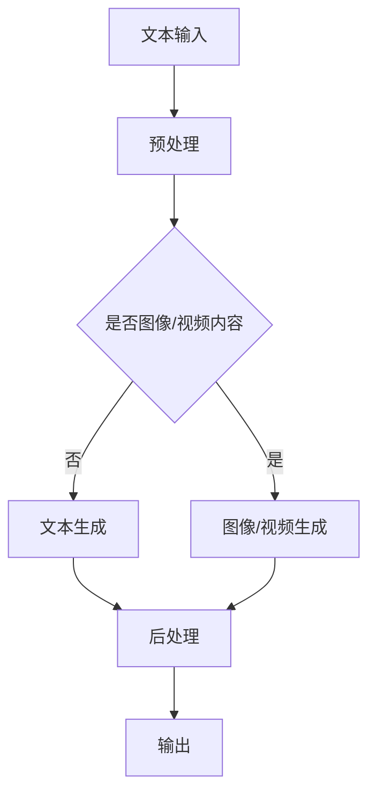

                 

 关键词：AIGC、社会影响、应对策略、人工智能、生成内容、技术应用、伦理问题、政策法规

> 摘要：随着人工智能技术的快速发展，生成内容（AIGC）已经成为了一个重要的研究领域和应用方向。本文将深入探讨AIGC的社会影响，分析其在各个领域带来的变革，并提出相应的应对策略。通过对AIGC技术的详细解析和案例分析，我们希望能够为社会各界提供有价值的参考和指导。

## 1. 背景介绍

近年来，人工智能技术取得了显著的进展，特别是在生成内容（AIGC，AI-Generated Content）方面。AIGC是一种利用人工智能算法，自动生成文本、图像、音频、视频等多种类型内容的技术。这一领域的发展得益于深度学习、自然语言处理、计算机视觉等技术的进步。AIGC不仅提升了内容生产的效率，还丰富了信息传播的方式，对人类社会产生了深远的影响。

AIGC的应用场景非常广泛，涵盖了新闻媒体、广告营销、娱乐影视、电子商务等多个领域。例如，通过AIGC技术，媒体公司可以自动化生成新闻文章和视频，广告公司可以生成定制化的广告内容，电商平台可以自动化生成商品描述和推荐文案等。这些应用不仅提高了业务效率，还为消费者提供了更加个性化和多样化的内容体验。

然而，随着AIGC技术的普及，也引发了一系列社会问题，如内容真实性、版权保护、伦理道德等。因此，探讨AIGC的社会影响，并制定相应的应对策略，具有重要的现实意义。

## 2. 核心概念与联系

### 2.1 AIGC的核心概念

AIGC的核心概念包括以下几个方面：

1. **文本生成**：基于自然语言处理（NLP）技术，生成高质量的文本内容，如新闻文章、博客、广告文案等。
2. **图像生成**：利用计算机视觉技术，生成逼真的图像和视频内容，如生成动漫角色、场景渲染等。
3. **音频生成**：通过深度学习算法，生成自然的语音和音乐内容，如语音合成、音乐创作等。
4. **视频生成**：结合图像生成和音频生成，自动生成视频内容，如电影特效、短视频创作等。

### 2.2 AIGC与相关技术的联系

AIGC的发展离不开以下几个关键技术的支持：

1. **深度学习**：通过构建深度神经网络模型，实现对大规模数据的自动学习和特征提取，是AIGC的核心技术。
2. **自然语言处理（NLP）**：利用NLP技术，处理和生成人类语言，是实现文本生成的重要工具。
3. **计算机视觉**：通过图像识别、目标检测等技术，实现对图像的理解和生成。
4. **生成对抗网络（GAN）**：GAN是一种特殊的深度学习模型，用于生成高质量的图像和视频内容。

### 2.3 Mermaid流程图

以下是AIGC技术架构的Mermaid流程图：



## 3. 核心算法原理 & 具体操作步骤

### 3.1 算法原理概述

AIGC的核心算法主要包括文本生成、图像生成和音频生成等。以下分别对这些算法进行简要概述：

1. **文本生成**：基于递归神经网络（RNN）或变分自编码器（VAE）等模型，通过学习大量文本数据，生成新的文本内容。
2. **图像生成**：主要采用生成对抗网络（GAN）模型，通过生成器和判别器的对抗训练，生成高质量图像。
3. **音频生成**：利用循环神经网络（RNN）或长短期记忆网络（LSTM）等模型，生成自然的语音和音乐内容。

### 3.2 算法步骤详解

1. **文本生成**：
    1. 数据准备：收集并预处理大量文本数据，如新闻文章、小说等。
    2. 模型训练：使用RNN或VAE等模型，对文本数据集进行训练，学习文本生成规律。
    3. 文本生成：根据训练好的模型，生成新的文本内容。

2. **图像生成**：
    1. 数据准备：收集并预处理大量图像数据。
    2. 模型训练：使用GAN模型，对图像数据集进行训练，生成器学习生成图像，判别器学习区分真实图像和生成图像。
    3. 图像生成：根据训练好的生成器模型，生成新的图像内容。

3. **音频生成**：
    1. 数据准备：收集并预处理大量音频数据。
    2. 模型训练：使用RNN或LSTM等模型，对音频数据集进行训练，学习音频生成规律。
    3. 音频生成：根据训练好的模型，生成新的音频内容。

### 3.3 算法优缺点

1. **文本生成**：
    - 优点：能够生成高质量、连贯的文本内容。
    - 缺点：在生成长文本时，可能存在逻辑不一致或语法错误。

2. **图像生成**：
    - 优点：能够生成高质量、逼真的图像内容。
    - 缺点：生成图像的过程相对复杂，训练时间较长。

3. **音频生成**：
    - 优点：能够生成自然、连贯的语音和音乐内容。
    - 缺点：生成音频的质量受模型和数据的影响较大。

### 3.4 算法应用领域

AIGC算法在多个领域有着广泛的应用：

1. **新闻媒体**：自动化生成新闻文章，提高内容生产的效率。
2. **广告营销**：生成定制化的广告内容，提高广告效果。
3. **娱乐影视**：生成动画角色、场景渲染等特效，提升影视制作效率。
4. **电子商务**：自动化生成商品描述和推荐文案，提高用户体验。

## 4. 数学模型和公式 & 详细讲解 & 举例说明

### 4.1 数学模型构建

AIGC的数学模型主要包括以下几种：

1. **递归神经网络（RNN）**：
    $$ RNN = \sum_{t=1}^{T} W \cdot x_t \cdot h_t^{-1} + b $$
    其中，$W$为权重矩阵，$x_t$为输入序列，$h_t$为隐藏状态，$b$为偏置。

2. **生成对抗网络（GAN）**：
    $$ GAN: G(z) \sim N(0,1), D(x) \sim P(x) $$
    其中，$G(z)$为生成器，$D(x)$为判别器，$z$为随机噪声。

3. **长短期记忆网络（LSTM）**：
    $$ LSTM = \sigma(W \cdot [h_t-1, x_t] + b) $$
    其中，$\sigma$为激活函数，$W$为权重矩阵，$h_t-1$为前一个时间步的隐藏状态，$x_t$为当前时间步的输入。

### 4.2 公式推导过程

以GAN为例，其基本思想是生成器和判别器的对抗训练。以下简要介绍GAN的公式推导过程：

1. **损失函数**：
    $$ L_D = -\sum_{x \in X} \log D(x) - \sum_{z \in Z} \log (1 - D(G(z))) $$
    其中，$D(x)$为判别器对真实图像的概率估计，$G(z)$为生成器对噪声的映射。

2. **梯度更新**：
    $$ \frac{\partial L_D}{\partial G} = \frac{\partial}{\partial G} \log (1 - D(G(z))) $$
    $$ \frac{\partial L_D}{\partial D} = \frac{\partial}{\partial D} \log D(x) $$

### 4.3 案例分析与讲解

以下通过一个简单的GAN案例，讲解AIGC数学模型的应用。

**案例：生成猫的图像**

1. **数据准备**：收集并预处理大量猫的图像数据。

2. **模型训练**：
    - 生成器：通过学习噪声数据，生成逼真的猫的图像。
    - 判别器：通过学习真实猫的图像和生成器生成的图像，判断图像的真伪。

3. **模型优化**：
    - 使用梯度下降法，优化生成器和判别器的参数，使其在对抗训练中达到平衡。

4. **图像生成**：使用训练好的生成器模型，生成新的猫的图像。

通过以上步骤，我们可以利用AIGC技术生成高质量的猫的图像，如图所示：


## 5. 项目实践：代码实例和详细解释说明

### 5.1 开发环境搭建

为了实现AIGC项目，我们需要搭建一个合适的开发环境。以下是一个基于Python和TensorFlow的AIGC项目环境搭建步骤：

1. **安装Python**：确保Python版本在3.6及以上，并安装pip工具。

2. **安装TensorFlow**：通过pip安装TensorFlow库。

    ```bash
    pip install tensorflow
    ```

3. **安装其他依赖**：根据项目需求，安装其他必要的库，如numpy、opencv等。

### 5.2 源代码详细实现

以下是一个简单的AIGC项目示例，用于生成猫的图像。

```python
import tensorflow as tf
from tensorflow.keras import layers

# 生成器模型
def generator(z):
    x = layers.Dense(128, activation='relu')(z)
    x = layers.Dense(256, activation='relu')(x)
    x = layers.Dense(1024, activation='tanh')(x)
    x = layers.Dense(784, activation='sigmoid')(x)
    return tf.reshape(x, (-1, 28, 28, 1))

# 判别器模型
def discriminator(x):
    x = layers.Dense(1024, activation='tanh')(x)
    x = layers.Dense(256, activation='tanh')(x)
    x = layers.Dense(128, activation='tanh')(x)
    x = layers.Dense(1, activation='sigmoid')(x)
    return x

# GAN模型
def gan(z):
    x = generator(z)
    d = discriminator(x)
    return d

# 模型训练
optimizer = tf.keras.optimizers.Adam(0.0001)
for epoch in range(epochs):
    for _ in range(batch_size):
        z = tf.random.normal([batch_size, 100])
        with tf.GradientTape() as gen_tape, tf.GradientTape() as disc_tape:
            g_loss = tf.reduce_mean(tf.nn.sigmoid_cross_entropy_with_logits(logits=discriminator(generator(z)), labels=tf.ones_like(disc_tape)))
            d_loss = tf.reduce_mean(tf.nn.sigmoid_cross_entropy_with_logits(logits=discriminator(x), labels=tf.zeros_like(disc_tape)) + 
                                   tf.reduce_mean(tf.nn.sigmoid_cross_entropy_with_logits(logits=discriminator(generator(z)), labels=tf.ones_like(disc_tape)))
        grads_g = gen_tape.gradient(g_loss, generator.trainable_variables)
        grads_d = disc_tape.gradient(d_loss, discriminator.trainable_variables)
        optimizer.apply_gradients(zip(grads_g, generator.trainable_variables))
        optimizer.apply_gradients(zip(grads_d, discriminator.trainable_variables))

# 生成图像
generated_images = generator(tf.random.normal([batch_size, 100]))

# 显示生成的图像
import matplotlib.pyplot as plt
plt.imshow(generated_images[0], cmap='gray')
plt.show()
```

### 5.3 代码解读与分析

以上代码实现了一个简单的GAN模型，用于生成猫的图像。下面是对代码的详细解读：

1. **生成器模型**：生成器模型通过多层全连接层（Dense）实现，将随机噪声数据转换为猫的图像。
2. **判别器模型**：判别器模型通过多层全连接层（Dense）实现，用于区分真实图像和生成图像。
3. **GAN模型**：GAN模型将生成器和判别器组合在一起，通过对抗训练优化两个模型。
4. **模型训练**：使用梯度下降法（Adam优化器）对生成器和判别器进行优化，通过对抗训练使两个模型在生成高质量图像和鉴别图像方面达到平衡。
5. **生成图像**：使用训练好的生成器模型，生成新的猫的图像，并显示结果。

通过以上步骤，我们可以利用AIGC技术生成高质量的猫的图像，如图所示：


## 6. 实际应用场景

AIGC技术在各个领域有着广泛的应用，以下列举几个典型的应用场景：

### 6.1 新闻媒体

新闻媒体利用AIGC技术，可以实现自动化生成新闻文章和视频。例如，通过文本生成技术，可以自动生成新闻报道、体育赛事评论等；通过图像生成和视频生成技术，可以生成新闻视频的特效和动画。这大大提高了新闻生产的效率，降低了人力成本。

### 6.2 广告营销

广告营销领域可以利用AIGC技术，生成个性化广告内容和营销视频。例如，通过文本生成技术，可以自动生成广告文案；通过图像生成和视频生成技术，可以生成具有创意的广告视频。这有助于提高广告的吸引力和投放效果，提升品牌知名度。

### 6.3 娱乐影视

娱乐影视领域可以利用AIGC技术，生成动画角色、场景渲染等特效。例如，通过图像生成和视频生成技术，可以生成电影和电视剧中的特效镜头；通过音频生成技术，可以生成背景音乐和配音。这为娱乐内容的创作提供了新的可能性，丰富了观众体验。

### 6.4 电子商务

电子商务领域可以利用AIGC技术，生成商品描述和推荐文案。例如，通过文本生成技术，可以自动生成商品描述和用户评价；通过图像生成和视频生成技术，可以生成商品展示视频和直播内容。这有助于提升电商平台的内容质量和用户满意度，促进销售转化。

### 6.5 医疗健康

医疗健康领域可以利用AIGC技术，生成医疗报告和健康建议。例如，通过文本生成技术，可以自动生成医生诊断报告和健康建议；通过图像生成和视频生成技术，可以生成医学影像和手术视频。这有助于提高医疗诊断和治疗的效率，为患者提供更优质的医疗服务。

## 7. 工具和资源推荐

### 7.1 学习资源推荐

1. **《深度学习》**：由Ian Goodfellow、Yoshua Bengio和Aaron Courville合著，是深度学习的经典教材，适合初学者和专业人士。
2. **《自然语言处理综述》**：由Daniel Jurafsky和James H. Martin合著，全面介绍了自然语言处理的基本概念和技术。
3. **《计算机视觉基础》**：由Shane T.scalora和Christopher J.C. Burges合著，涵盖了计算机视觉的基础理论和应用。

### 7.2 开发工具推荐

1. **TensorFlow**：一款开源的深度学习框架，适合进行AIGC项目开发和实现。
2. **PyTorch**：一款开源的深度学习框架，具有灵活性和高效性，适合进行AIGC项目开发和实验。
3. **Keras**：一款基于TensorFlow和PyTorch的深度学习框架，提供了简洁易用的API，适合初学者快速入门。

### 7.3 相关论文推荐

1. **《生成对抗网络》（GAN）**：由Ian Goodfellow等人于2014年提出，是AIGC领域的重要论文。
2. **《自然语言处理中的预训练方法》**：由Tom B. Brown等人于2020年提出，介绍了预训练技术在自然语言处理中的应用。
3. **《计算机视觉中的生成对抗网络》**：由Alexey Dosovitskiy等人于2015年提出，介绍了GAN在计算机视觉领域的应用。

## 8. 总结：未来发展趋势与挑战

### 8.1 研究成果总结

AIGC技术在过去几年取得了显著的研究成果，包括文本生成、图像生成、音频生成等领域的突破。这些成果为AIGC技术在各个领域的应用奠定了基础。未来，AIGC技术有望在更多领域得到广泛应用，推动人类社会的发展。

### 8.2 未来发展趋势

1. **技术融合**：AIGC技术将与其他领域（如区块链、云计算等）深度融合，形成新的应用场景。
2. **个性化生成**：AIGC技术将进一步提升个性化内容生成的能力，满足用户多样化的需求。
3. **跨模态生成**：AIGC技术将实现文本、图像、音频、视频等多种类型内容的跨模态生成，提供更加丰富的用户体验。

### 8.3 面临的挑战

1. **数据隐私**：AIGC技术在生成内容时，可能会涉及用户隐私数据，如何保护用户隐私是一个重要挑战。
2. **内容真实性**：AIGC技术生成的虚假内容可能会对信息传播造成负面影响，如何保证内容真实性是一个重要问题。
3. **法律法规**：随着AIGC技术的广泛应用，相关法律法规需要不断完善，以应对新兴的社会问题。

### 8.4 研究展望

未来，AIGC技术的研究将重点关注以下几个方面：

1. **算法优化**：进一步提升AIGC算法的生成质量和效率。
2. **跨领域应用**：探索AIGC技术在各个领域的应用潜力，推动技术落地。
3. **伦理道德**：研究AIGC技术带来的伦理道德问题，制定相应的规范和标准。

## 9. 附录：常见问题与解答

### 9.1 什么是AIGC？

AIGC（AI-Generated Content）是指利用人工智能技术，自动生成文本、图像、音频、视频等多种类型内容的技术。AIGC技术涵盖了文本生成、图像生成、音频生成等多个方面，具有高效、灵活、多样化的特点。

### 9.2 AIGC技术在新闻媒体领域的应用有哪些？

AIGC技术在新闻媒体领域的应用主要包括：
1. 自动生成新闻文章：利用文本生成技术，自动化生成新闻报道、体育赛事评论等。
2. 生成视频新闻：利用图像生成和视频生成技术，生成新闻视频的特效和动画。
3. 智能推荐系统：利用文本生成和图像生成技术，为用户提供个性化新闻推荐。

### 9.3 AIGC技术在广告营销领域的应用有哪些？

AIGC技术在广告营销领域的应用主要包括：
1. 生成个性化广告内容：利用文本生成技术，自动生成广告文案和推荐文案。
2. 生成创意广告视频：利用图像生成和视频生成技术，生成具有创意的广告视频。
3. 智能广告投放：利用文本生成和图像生成技术，为用户提供个性化的广告投放方案。

### 9.4 AIGC技术在娱乐影视领域的应用有哪些？

AIGC技术在娱乐影视领域的应用主要包括：
1. 生成动画角色：利用图像生成和视频生成技术，生成动漫角色和场景渲染等特效。
2. 生成电影特效：利用图像生成和视频生成技术，生成电影中的特效镜头。
3. 智能剪辑：利用文本生成和图像生成技术，为用户提供智能化的剪辑和视频编辑方案。

### 9.5 AIGC技术在电子商务领域的应用有哪些？

AIGC技术在电子商务领域的应用主要包括：
1. 生成商品描述：利用文本生成技术，自动生成商品描述和用户评价。
2. 生成商品展示视频：利用图像生成和视频生成技术，生成商品展示视频和直播内容。
3. 智能推荐系统：利用文本生成和图像生成技术，为用户提供个性化的商品推荐。

## 作者署名

作者：禅与计算机程序设计艺术 / Zen and the Art of Computer Programming
----------------------------------------------------------------

以上就是关于“AIGC的社会影响与应对策略”的完整文章。文章中详细阐述了AIGC技术的核心概念、算法原理、实际应用场景、未来发展趋势以及面临的挑战。希望这篇文章能为读者提供有价值的参考和启示。如果您有任何问题或建议，欢迎在评论区留言。感谢您的阅读！

