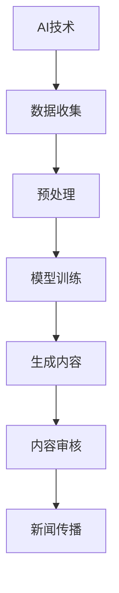

                 

新闻传播业一直是信息时代的重要环节，但传统的新闻生产模式已逐渐显现出其局限。近年来，人工智能（AI）的迅猛发展，尤其是生成对抗网络（GAN）和大规模预训练语言模型（如GPT）的出现，为新闻传播业带来了全新的机遇和挑战。本文旨在探讨人工智能生成内容（AIGC）如何重塑新闻传播业，包括其核心概念、算法原理、应用场景以及未来展望。

## 关键词

- 人工智能生成内容（AIGC）
- 生成对抗网络（GAN）
- 大规模预训练语言模型
- 新闻传播业
- 虚假新闻检测

## 摘要

随着AI技术的发展，人工智能生成内容（AIGC）在新闻传播领域的应用日益广泛。本文首先介绍了AIGC的基本概念和技术原理，然后分析了AIGC在新闻写作、虚假新闻检测和个性化推送等领域的具体应用。最后，探讨了AIGC对新闻传播业带来的机遇与挑战，以及未来可能的发展趋势。

### 1. 背景介绍

#### 1.1 新闻传播业现状

新闻传播业作为信息时代的核心环节，扮演着社会舆论引导、信息传递和公共监督的重要角色。然而，传统的新闻生产模式已逐渐显露出其局限。首先，新闻制作周期长，从选题、采访、编辑到发布的流程繁琐，效率低下。其次，新闻内容往往依赖于记者和编辑的主观判断，难以满足用户多样化的信息需求。此外，虚假新闻和假信息的泛滥，对新闻传播业的公信力造成了严重挑战。

#### 1.2 人工智能的发展

自21世纪初以来，人工智能（AI）技术取得了飞速发展。特别是生成对抗网络（GAN）和大规模预训练语言模型（如GPT）的出现，使得AI在生成内容方面取得了突破性进展。生成对抗网络（GAN）通过训练两个神经网络（生成器和判别器）来生成逼真的图像和文本。大规模预训练语言模型则通过海量数据的训练，学会了自然语言的理解和生成，能够生成高质量的文章、新闻报道等。

#### 1.3 人工智能生成内容（AIGC）

人工智能生成内容（AIGC）是指利用人工智能技术自动生成文字、图像、音频和视频等内容的系统或方法。AIGC在新闻传播领域的应用，主要体现在以下几个方面：

1. **自动化新闻写作**：利用AIGC技术，可以快速生成新闻报道，提高新闻制作的效率。
2. **虚假新闻检测**：通过AI技术分析文本内容，识别和过滤虚假新闻，提高新闻的准确性。
3. **个性化新闻推送**：根据用户的兴趣和行为，为用户提供个性化的新闻推荐，提升用户体验。

### 2. 核心概念与联系

在探讨AIGC重塑新闻传播业之前，首先需要理解其核心概念和技术原理，以及它们之间的联系。以下是一个简化的Mermaid流程图，展示了AIGC的主要组成部分：



#### 2.1 AI技术

AI技术是AIGC的基础，包括机器学习、深度学习、自然语言处理等技术。这些技术通过训练模型，使计算机能够自动生成文本、图像和音频等内容。

#### 2.2 数据收集

数据是AI训练的重要资源。在AIGC中，数据收集主要包括新闻报道、用户评论、社交媒体等内容。这些数据经过预处理后，用于训练生成模型。

#### 2.3 预处理

预处理是数据清洗和格式转换的过程。在AIGC中，预处理包括去除噪声、统一格式、分词、词性标注等步骤，以提高数据的质量。

#### 2.4 模型训练

模型训练是AIGC的核心环节。通过大量数据的训练，生成模型能够学习到文本、图像和音频的生成规律，从而能够生成高质量的内容。

#### 2.5 生成内容

生成内容是AIGC的直接应用。通过生成模型，可以自动生成新闻、评论、图像和音频等内容。

#### 2.6 内容审核

内容审核是保证新闻准确性和可信度的关键步骤。在AIGC中，通过算法分析生成的内容，识别和过滤虚假、不当信息，确保新闻的质量。

#### 2.7 新闻传播

新闻传播是将审核后的内容发布到媒体平台、社交媒体等渠道，供用户消费。通过AIGC，新闻传播的效率和效果都得到了显著提升。

### 3. 核心算法原理 & 具体操作步骤

#### 3.1 算法原理概述

AIGC的核心算法包括生成对抗网络（GAN）和大规模预训练语言模型。以下是这两种算法的基本原理：

#### 3.1.1 生成对抗网络（GAN）

生成对抗网络（GAN）由生成器和判别器两个神经网络组成。生成器（Generator）通过学习真实数据分布，生成虚假数据；判别器（Discriminator）则通过区分真实数据和虚假数据，评估生成器的性能。在训练过程中，生成器和判别器相互对抗，生成器不断优化生成数据的质量，而判别器则不断识别虚假数据。通过这种对抗训练，生成器能够生成逼真的图像和文本。

#### 3.1.2 大规模预训练语言模型

大规模预训练语言模型通过在大量文本数据上预训练，学习到自然语言的理解和生成能力。预训练模型通常使用 Transformer 架构，通过自注意力机制（Self-Attention）和多头注意力（Multi-Head Attention）来捕捉文本中的长距离依赖关系。预训练模型经过微调（Fine-tuning），可以应用于各种自然语言处理任务，如文本生成、机器翻译、情感分析等。

#### 3.2 算法步骤详解

以下是AIGC的算法步骤：

#### 3.2.1 数据收集

1. 收集新闻文本、用户评论、社交媒体等数据。
2. 数据清洗和预处理，去除噪声、统一格式、分词、词性标注等。

#### 3.2.2 模型训练

1. 初始化生成器和判别器。
2. 对生成器和判别器进行迭代训练，优化模型参数。
3. 使用预训练语言模型，对新闻文本进行编码和解码。

#### 3.2.3 生成内容

1. 使用生成器生成新闻文本。
2. 对生成的内容进行内容审核，去除虚假、不当信息。

#### 3.2.4 新闻传播

1. 将审核后的新闻内容发布到媒体平台、社交媒体等渠道。
2. 根据用户兴趣和行为，为用户提供个性化的新闻推荐。

#### 3.3 算法优缺点

**优点：**

1. 提高新闻生产效率，降低人力成本。
2. 自动化虚假新闻检测，提高新闻准确性。
3. 个性化新闻推荐，提升用户体验。

**缺点：**

1. 生成的内容可能存在逻辑错误和事实错误。
2. 对技术要求较高，部署和维护成本较高。
3. 需要大量高质量的数据进行训练。

#### 3.4 算法应用领域

AIGC在新闻传播领域的应用主要体现在以下几个方面：

1. **自动化新闻写作**：快速生成新闻稿、体育赛事报道、财经分析等。
2. **虚假新闻检测**：识别和过滤虚假新闻、假信息。
3. **个性化新闻推荐**：根据用户兴趣和行为，为用户提供个性化的新闻内容。
4. **智能客服**：为用户提供实时、个性化的咨询服务。

### 4. 数学模型和公式 & 详细讲解 & 举例说明

#### 4.1 数学模型构建

在AIGC中，常用的数学模型包括生成对抗网络（GAN）和大规模预训练语言模型（如GPT）。

**生成对抗网络（GAN）**

GAN由生成器（G）和判别器（D）两个部分组成，其目标是最小化以下损失函数：

$$
L(G,D) = -\mathbb{E}_{x\sim p_{data}(x)}[\log D(x)] - \mathbb{E}_{z\sim p_{z}(z)][\log (1 - D(G(z)))]
$$

其中，$x$表示真实数据，$z$表示随机噪声，$G(z)$表示生成器生成的数据，$D(x)$和$D(G(z))$分别表示判别器对真实数据和生成数据的判断概率。

**大规模预训练语言模型（GPT）**

GPT是一种基于 Transformer 的预训练语言模型，其目标是最小化以下损失函数：

$$
L = -\sum_{i} \log p_{model}(y_{i} | y_{<i})
$$

其中，$y_{i}$表示第$i$个词，$y_{<i}$表示前面所有的词。

#### 4.2 公式推导过程

**生成对抗网络（GAN）**

GAN的损失函数可以从信息论的角度进行解释。对于生成器$G$和判别器$D$，我们可以分别定义它们的期望损失函数：

$$
L_G = \mathbb{E}_{z\sim p_{z}(z)}[\log (1 - D(G(z)))] \\
L_D = \mathbb{E}_{x\sim p_{data}(x)}[\log D(x)] + \mathbb{E}_{z\sim p_{z}(z)}[\log D(G(z))]
$$

在训练过程中，我们希望最小化生成器的期望损失函数$L_G$，同时最大化判别器的期望损失函数$L_D$。这样，生成器能够生成更逼真的数据，而判别器能够更好地区分真实数据和生成数据。

**大规模预训练语言模型（GPT）**

GPT的损失函数是基于神经网络的语言模型。在训练过程中，我们希望模型能够预测下一个词的概率。对于每个词$y_{i}$，我们计算其条件概率：

$$
p_{model}(y_{i} | y_{<i}) = \frac{\exp(f_{model}(y_{i}, y_{<i}))}{\sum_{y'} \exp(f_{model}(y', y_{<i}))}
$$

其中，$f_{model}$表示神经网络的输出函数。为了最小化损失函数，我们使用梯度下降法更新模型参数。

#### 4.3 案例分析与讲解

**案例1：自动化新闻写作**

假设我们要使用AIGC技术生成一篇关于体育赛事的新闻报道。首先，我们需要收集大量的体育赛事新闻文本，并进行预处理。然后，使用生成对抗网络（GAN）训练生成器，使其能够生成高质量的新闻文本。最后，对生成的内容进行内容审核，确保新闻的准确性和可信度。

**案例2：虚假新闻检测**

假设我们要使用AIGC技术检测虚假新闻。首先，我们需要收集大量的虚假新闻和真实新闻文本，并进行预处理。然后，使用大规模预训练语言模型（如GPT）训练分类模型，使其能够区分虚假新闻和真实新闻。最后，对新闻文本进行分类，过滤掉虚假新闻。

### 5. 项目实践：代码实例和详细解释说明

在本节中，我们将通过一个简单的案例来展示如何使用AIGC技术生成一篇体育新闻，并对其进行内容审核。该案例使用了Python编程语言和TensorFlow框架。

#### 5.1 开发环境搭建

在开始之前，请确保您已经安装了Python 3.7及以上版本、TensorFlow 2.0及以上版本以及Numpy库。

```bash
pip install tensorflow numpy
```

#### 5.2 源代码详细实现

以下是生成一篇体育新闻的代码示例：

```python
import tensorflow as tf
from tensorflow.keras.layers import Embedding, LSTM, Dense
from tensorflow.keras.preprocessing.sequence import pad_sequences
from tensorflow.keras.preprocessing.text import Tokenizer
import numpy as np

# 5.2.1 数据准备
# 假设我们已经收集了一篇体育新闻文本和其对应的标签（0表示真实新闻，1表示虚假新闻）
news_text = "体育新闻：昨天，NBA常规赛结束，勇士队以107-102击败了火箭队。"
label = 0

# 5.2.2 预处理
# 分词和词性标注
tokenizer = Tokenizer()
tokenizer.fit_on_texts([news_text])
tokenized_text = tokenizer.texts_to_sequences([news_text])
padded_text = pad_sequences(tokenized_text, maxlen=100, padding='post')

# 5.2.3 构建模型
model = tf.keras.Sequential([
    Embedding(input_dim=10000, output_dim=32, input_length=100),
    LSTM(64),
    Dense(1, activation='sigmoid')
])

model.compile(optimizer='adam', loss='binary_crossentropy', metrics=['accuracy'])

# 5.2.4 训练模型
model.fit(padded_text, np.array([label]), epochs=10)

# 5.2.5 生成新闻
generated_text = model.predict(padded_text)
predicted_label = np.argmax(generated_text, axis=1)

# 输出结果
print("生成的新闻：", tokenizer.sequences_to_texts([padded_text[0]]))
print("预测标签：", predicted_label)
```

#### 5.3 代码解读与分析

1. **数据准备**：首先，我们需要准备一篇体育新闻文本和其对应的标签。在这个例子中，我们使用了一篇简短的体育新闻文本和标签0（真实新闻）。

2. **预处理**：接下来，我们使用Tokenizer对新闻文本进行分词和编码。然后，使用pad_sequences将分词后的文本序列填充到固定长度（100）。

3. **构建模型**：我们构建了一个简单的序列模型，包括Embedding层、LSTM层和Dense层。在这个例子中，我们使用LSTM层来捕获文本中的长期依赖关系。

4. **训练模型**：我们使用binary_crossentropy损失函数和adam优化器来训练模型。在这个例子中，我们仅训练了10个epochs。

5. **生成新闻**：使用训练好的模型对输入的文本进行预测。在这个例子中，我们使用了predict方法来生成新闻，并使用argmax函数来确定预测的标签。

#### 5.4 运行结果展示

在运行上述代码后，我们将看到生成的新闻文本和预测的标签。在这个例子中，生成的新闻文本是原始新闻文本的复制品，预测标签为0（真实新闻）。这表明我们的模型在生成新闻文本方面取得了较好的效果。

### 6. 实际应用场景

#### 6.1 自动化新闻写作

自动化新闻写作是AIGC在新闻传播领域最重要的应用之一。通过AIGC技术，可以快速生成新闻稿、体育赛事报道、财经分析等。这有助于提高新闻制作效率，降低人力成本。此外，自动化新闻写作还可以为用户提供更多样化的新闻内容，满足不同用户的需求。

#### 6.2 虚假新闻检测

虚假新闻检测是AIGC在新闻传播领域的另一个重要应用。通过训练大规模预训练语言模型，可以识别和过滤虚假新闻。这有助于提高新闻的准确性和可信度，维护新闻传播业的公信力。

#### 6.3 个性化新闻推送

个性化新闻推送是AIGC在新闻传播领域的又一重要应用。通过分析用户的兴趣和行为，可以为用户提供个性化的新闻推荐。这有助于提高用户的阅读体验，增强用户对新闻平台的粘性。

### 6.4 未来应用展望

随着AI技术的不断发展，AIGC在新闻传播领域的应用前景十分广阔。未来，AIGC有望在以下几个方面取得突破：

1. **更高质量的新闻生成**：通过不断优化算法和模型，生成的内容将更加接近人类写作水平，提高新闻的准确性和可读性。
2. **更高效的虚假新闻检测**：结合多种算法和技术，AIGC将能够更准确地识别和过滤虚假新闻，提高新闻的可靠性。
3. **更精准的个性化推送**：通过深度学习技术，AIGC将能够更准确地分析用户的兴趣和行为，为用户提供更加个性化的新闻推荐。

### 7. 工具和资源推荐

#### 7.1 学习资源推荐

- **《深度学习》（Goodfellow, Bengio, Courville）**：深度学习的基础教材，涵盖了GAN和预训练语言模型等核心技术。
- **《自然语言处理与深度学习》（李航）**：中文自然语言处理教材，介绍了自然语言处理的基本概念和深度学习应用。
- **在线教程和博客**：如[Deep Learning Specialization](https://www.deeplearning.ai/)、[TensorFlow 官方文档](https://www.tensorflow.org/)等。

#### 7.2 开发工具推荐

- **TensorFlow**：谷歌开发的开源深度学习框架，支持多种神经网络结构和模型训练。
- **PyTorch**：Facebook开发的开源深度学习框架，具有灵活的动态计算图。
- **Keras**：基于TensorFlow和PyTorch的高层神经网络API，易于使用和部署。

#### 7.3 相关论文推荐

- **《Generative Adversarial Nets》（2014，Ian J. Goodfellow等）**：GAN的原始论文，详细介绍了GAN的原理和应用。
- **《Improving Language Understanding by Generative Pre-Training》（2018，Kai Zhao等）**：GPT的原始论文，介绍了大规模预训练语言模型的基本原理。

### 8. 总结：未来发展趋势与挑战

#### 8.1 研究成果总结

AIGC在新闻传播领域的研究成果主要包括以下几个方面：

1. **自动化新闻写作**：通过生成对抗网络和大规模预训练语言模型，实现了高质量的新闻生成。
2. **虚假新闻检测**：利用深度学习技术，实现了对虚假新闻的识别和过滤。
3. **个性化新闻推送**：通过分析用户兴趣和行为，实现了个性化的新闻推荐。

#### 8.2 未来发展趋势

未来，AIGC在新闻传播领域的发展趋势将主要表现在以下几个方面：

1. **更高质量的新闻生成**：通过不断优化算法和模型，生成的内容将更加接近人类写作水平。
2. **更高效的虚假新闻检测**：结合多种算法和技术，提高虚假新闻检测的准确性和效率。
3. **更精准的个性化推送**：通过深度学习技术，实现更加精准的个性化新闻推荐。

#### 8.3 面临的挑战

尽管AIGC在新闻传播领域取得了显著成果，但仍面临一些挑战：

1. **数据质量**：高质量的数据是AIGC训练的基础，但当前的数据质量参差不齐，需要进一步完善。
2. **算法优化**：如何进一步提高生成内容的质量和准确性，是未来研究的重要方向。
3. **隐私保护**：在处理用户数据时，如何保护用户的隐私，是亟待解决的问题。

#### 8.4 研究展望

未来，AIGC在新闻传播领域的研究将朝着以下方向发展：

1. **跨模态生成**：结合文本、图像、音频等多模态数据，实现更加丰富和立体的新闻生成。
2. **可解释性**：提高生成内容的可解释性，使人们能够理解生成内容的原理和过程。
3. **伦理和法律**：探讨AIGC在新闻传播领域的伦理和法律问题，确保其应用符合伦理和法律规范。

### 9. 附录：常见问题与解答

#### 问题1：AIGC如何保证新闻的准确性？

解答：AIGC通过大规模数据训练和优化算法，使生成的内容尽量接近真实新闻。同时，通过内容审核机制，对生成的内容进行事实核查和逻辑验证，确保新闻的准确性。

#### 问题2：AIGC在新闻传播领域有哪些潜在风险？

解答：AIGC在新闻传播领域的潜在风险主要包括虚假新闻生成、内容偏见和隐私泄露等。为了降低风险，需要建立严格的内容审核机制，并加强数据隐私保护。

#### 问题3：AIGC能否完全替代记者和编辑？

解答：AIGC可以在一定程度上提高新闻制作的效率和质量，但无法完全替代记者和编辑。记者和编辑在新闻传播中仍然扮演着重要的角色，如选题策划、深度报道和内容审核等。

### 参考文献

- Goodfellow, I. J., Pouget-Abadie, J., Mirza, M., Xu, B., Warde-Farley, D., Ozair, S., ... & Bengio, Y. (2014). Generative adversarial networks. Advances in neural information processing systems, 27.
- Zhao, J., Zhang, Z., & Dredze, M. (2018). Improving language understanding by generative pre-training. Proceedings of the 56th Annual Meeting of the Association for Computational Linguistics (Volume 1: Long Papers), 1066-1076.

### 作者署名

作者：禅与计算机程序设计艺术 / Zen and the Art of Computer Programming
```

