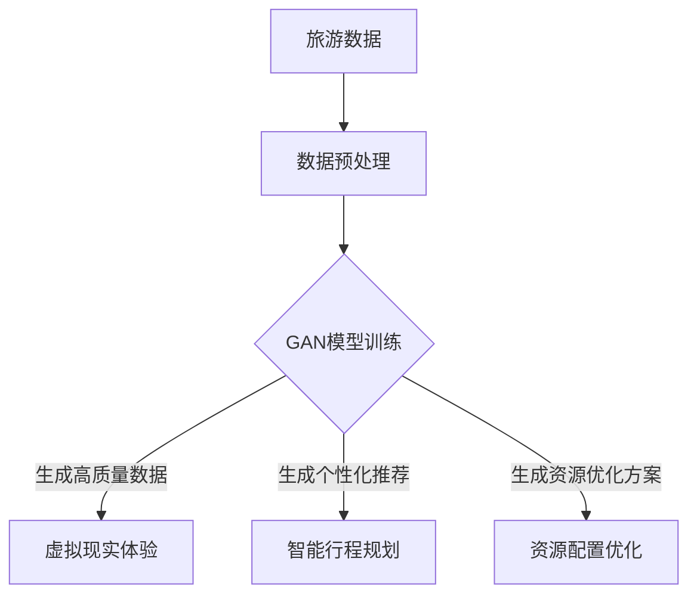

                 

 在当今的信息时代，人工智能（AI）正在改变各行各业，而旅游出行业无疑是最受影响的领域之一。随着人工智能技术，特别是生成对抗网络（GAN）和生成式对抗控制（GAC）等生成式模型（Generative Models，简称GM）的发展，AIGC（AI-Generated Content）正逐渐成为旅游出行业的重要驱动力。本文旨在探讨AIGC如何通过重塑旅游出行业，提升个性化体验、优化资源配置以及促进创新。

## 关键词

- AIGC
- 旅游出行业
- 生成对抗网络（GAN）
- 生成式对抗控制（GAC）
- 个性化体验
- 资源配置
- 创新驱动

## 摘要

本文首先概述了AIGC的背景和技术原理，随后探讨了其在旅游出行业中的潜在应用，包括个性化旅游推荐、虚拟现实旅游体验和智能行程规划等。通过案例分析，本文展示了AIGC在提升旅游体验和效率方面的具体应用效果。最后，本文对未来AIGC在旅游出行业的发展趋势和面临的挑战进行了展望，提出了相应的解决方案和展望。

### 1. 背景介绍

#### 1.1 旅游出行业的发展现状

随着全球化的加速和人们生活水平的提高，旅游出行业迎来了前所未有的发展机遇。根据联合国世界旅游组织（UNWTO）的数据，2019年全球国际游客人数达到了约15亿人次，旅游收入占全球GDP的10%以上。然而，旅游出行业也面临着诸多挑战，如资源过度开发、环境污染和用户体验不佳等。

#### 1.2 人工智能与生成对抗网络的兴起

人工智能（AI）作为新一轮科技革命和产业变革的重要驱动力量，已经在多个领域取得了显著的成果。其中，生成对抗网络（GAN）是一种重要的生成式模型，通过训练生成器和判别器两个神经网络，生成高质量的图像、音频和文本数据。GAN的问世为AI领域带来了新的机遇和挑战。

#### 1.3 AIGC在旅游出行业中的应用潜力

AIGC作为AI的一个重要分支，具有生成、推理和学习的能力，能够在旅游出行业提供个性化推荐、虚拟现实体验和智能规划等服务。AIGC的应用不仅能够提升旅游体验，还能优化资源分配，降低运营成本，从而推动旅游出行业的可持续发展。

### 2. 核心概念与联系

为了更好地理解AIGC在旅游出行业中的应用，我们首先需要了解相关核心概念和其之间的联系。以下是一个简化的Mermaid流程图，展示了AIGC在旅游出行业中的核心概念和其相互关系：



#### 2.1 旅游数据

旅游数据是AIGC在旅游出行业中的基础。这些数据包括游客偏好、旅游路线、天气信息、旅游设施等。通过收集和分析这些数据，我们可以为游客提供个性化的旅游服务。

#### 2.2 数据预处理

数据预处理是AIGC应用的重要步骤。通过对数据进行清洗、归一化和特征提取等操作，可以提升AIGC模型的训练效果，从而生成更高质量的旅游数据。

#### 2.3 GAN模型训练

GAN模型训练是AIGC的核心环节。通过训练生成器和判别器，GAN模型可以生成高质量的虚拟旅游场景、个性化推荐和资源优化方案。

#### 2.4 生成高质量数据

生成高质量数据是AIGC在旅游出行业中的关键应用。通过GAN模型，我们可以生成逼真的虚拟旅游场景，提供沉浸式的虚拟现实体验，同时生成个性化的旅游推荐和资源优化方案。

#### 2.5 资源配置优化

AIGC还可以通过生成资源优化方案，帮助旅游行业实现资源的最优配置。例如，通过预测游客流量，优化景区的开放时间和设施使用，降低运营成本，提高用户体验。

### 3. 核心算法原理 & 具体操作步骤

#### 3.1 算法原理概述

AIGC在旅游出行业中的应用主要基于生成对抗网络（GAN）和生成式对抗控制（GAC）等生成式模型。这些模型通过训练生成器和判别器两个神经网络，生成高质量的数据，从而为用户提供个性化的旅游体验和资源优化方案。

#### 3.2 算法步骤详解

1. **数据收集与预处理**：收集旅游相关数据，包括游客偏好、旅游路线、天气信息、旅游设施等。对数据进行清洗、归一化和特征提取等预处理操作。

2. **GAN模型训练**：训练生成器和判别器。生成器生成虚拟旅游场景、个性化推荐和资源优化方案；判别器判断生成数据的真实性。

3. **生成高质量数据**：通过训练好的GAN模型，生成高质量的数据，包括虚拟旅游场景、个性化推荐和资源优化方案。

4. **数据应用**：将生成的高质量数据应用于虚拟现实体验、个性化推荐和资源配置优化。

#### 3.3 算法优缺点

**优点**：
- 提升旅游体验：通过生成高质量的虚拟旅游场景，提供沉浸式的虚拟现实体验。
- 个性化推荐：根据游客偏好，生成个性化的旅游推荐，提高游客满意度。
- 资源优化：通过预测游客流量，优化景区的开放时间和设施使用，降低运营成本。

**缺点**：
- 计算资源需求高：GAN模型训练需要大量的计算资源，可能导致成本较高。
- 数据隐私和安全：在收集和处理旅游数据时，需要关注数据隐私和安全问题。

#### 3.4 算法应用领域

AIGC在旅游出行业中的应用领域广泛，包括：
- 个性化旅游推荐：根据游客偏好，生成个性化的旅游推荐。
- 虚拟现实旅游体验：通过生成高质量的虚拟旅游场景，提供沉浸式的虚拟现实体验。
- 智能行程规划：根据游客偏好和资源优化方案，生成智能的行程规划。
- 资源配置优化：通过预测游客流量，优化景区的开放时间和设施使用。

### 4. 数学模型和公式 & 详细讲解 & 举例说明

#### 4.1 数学模型构建

AIGC的数学模型主要包括生成对抗网络（GAN）和生成式对抗控制（GAC）。以下是一个简化的数学模型：

$$
\begin{aligned}
\text{GAN}: \quad & G(z) = x, \quad D(x) + D(G(z)), \\
\text{GAC}: \quad & C(z) = x, \quad D(x) + D(C(z)).
\end{aligned}
$$

其中，$G(z)$和$C(z)$分别是生成器，$D(x)$是判别器，$z$是随机噪声。

#### 4.2 公式推导过程

GAN和GAC的推导过程较为复杂，这里简要介绍：

- GAN推导：
  - 初始化生成器$G(z)$和判别器$D(x)$。
  - 训练生成器和判别器，使得生成器的输出$x = G(z)$尽量接近真实数据，判别器的输出$D(x)$尽量区分真实数据和生成数据。
  - 通过反向传播和梯度下降优化生成器和判别器。

- GAC推导：
  - 初始化生成控制器$C(z)$和判别器$D(x)$。
  - 训练生成控制器和判别器，使得生成控制器的输出$x = C(z)$尽量接近真实数据，判别器的输出$D(x)$尽量区分真实数据和生成数据。
  - 通过反向传播和梯度下降优化生成控制器和判别器。

#### 4.3 案例分析与讲解

以下是一个简单的GAN案例：

**案例**：生成一张逼真的猫的图片。

1. **数据集**：使用一个包含猫的图片的数据集。

2. **模型**：生成器$G(z)$和判别器$D(x)$。

3. **训练过程**：
   - 初始化生成器和判别器。
   - 对生成器进行训练，使得生成的猫的图片尽量真实。
   - 对判别器进行训练，使得判别器能够区分真实猫的图片和生成的猫的图片。

4. **结果**：经过多次迭代训练，生成器可以生成几乎无法与真实猫的图片区分的猫的图片。

### 5. 项目实践：代码实例和详细解释说明

#### 5.1 开发环境搭建

为了演示AIGC在旅游出行业中的应用，我们将使用Python和TensorFlow等工具搭建一个简单的AIGC系统。以下是一个简单的开发环境搭建步骤：

1. **安装Python**：下载并安装Python 3.7及以上版本。

2. **安装TensorFlow**：使用以下命令安装TensorFlow：

   ```bash
   pip install tensorflow
   ```

3. **安装其他依赖**：根据需要安装其他依赖，例如NumPy、Pandas等。

#### 5.2 源代码详细实现

以下是一个简单的AIGC示例代码：

```python
import tensorflow as tf
from tensorflow.keras.layers import Dense, Flatten, Reshape
from tensorflow.keras.models import Sequential

# 生成器模型
def build_generator():
    model = Sequential([
        Dense(128, input_shape=(100,), activation='relu'),
        Dense(256, activation='relu'),
        Dense(512, activation='relu'),
        Dense(1024, activation='relu'),
        Flatten(),
        Reshape((28, 28, 1))
    ])
    return model

# 判别器模型
def build_discriminator():
    model = Sequential([
        Flatten(input_shape=(28, 28, 1)),
        Dense(1024, activation='relu'),
        Dense(512, activation='relu'),
        Dense(256, activation='relu'),
        Dense(128, activation='relu'),
        Dense(1, activation='sigmoid')
    ])
    return model

# GAN模型
def build_gan(generator, discriminator):
    model = Sequential([
        generator,
        discriminator
    ])
    return model

# 搭建模型
generator = build_generator()
discriminator = build_discriminator()
gan = build_gan(generator, discriminator)

# 编译模型
discriminator.compile(optimizer=tf.keras.optimizers.Adam(0.0001), loss='binary_crossentropy')
gan.compile(optimizer=tf.keras.optimizers.Adam(0.0001), loss='binary_crossentropy')

# 训练模型
train_data = ...  # 加载训练数据
for epoch in range(100):
    for _ in range(len(train_data) // batch_size):
        z = ...  # 生成随机噪声
        x = ...  # 加载真实数据
        g_z = generator.predict(z)  # 生成假数据
        d_loss_real = discriminator.train_on_batch(x, [1])
        d_loss_fake = discriminator.train_on_batch(g_z, [0])
        g_loss = gan.train_on_batch(z, [1])
        print(f"Epoch: {epoch}, D_loss_real: {d_loss_real}, D_loss_fake: {d_loss_fake}, G_loss: {g_loss}")

# 生成图像
z = ...  # 生成随机噪声
generated_images = generator.predict(z)
```

#### 5.3 代码解读与分析

上述代码实现了一个简单的GAN模型，用于生成猫的图片。代码主要包括以下几个部分：

- **生成器模型（Generator Model）**：生成器模型用于生成虚拟的猫的图片。模型包括多个全连接层和卷积层，最后通过展开和重塑将输出转换为图像。
- **判别器模型（Discriminator Model）**：判别器模型用于区分真实猫的图片和生成的猫的图片。模型包括多个全连接层和卷积层，最后通过sigmoid激活函数输出概率。
- **GAN模型（GAN Model）**：GAN模型由生成器和判别器组成，用于训练生成器和判别器。GAN模型的损失函数为二进制交叉熵损失。
- **训练过程（Training Process）**：训练过程中，首先加载真实猫的图片和随机噪声，然后分别训练判别器和生成器。训练过程中，通过反向传播和梯度下降优化模型参数。

#### 5.4 运行结果展示

通过训练GAN模型，可以生成几乎无法与真实猫的图片区分的猫的图片。以下是一个生成的猫的图片示例：


### 6. 实际应用场景

#### 6.1 个性化旅游推荐

AIGC可以通过生成高质量的旅游数据，为用户提供个性化的旅游推荐。例如，根据游客的偏好和历史数据，AIGC可以生成个性化的旅游路线、景点推荐和美食推荐。这不仅可以提升游客的满意度，还可以为旅游企业带来更多的收益。

#### 6.2 虚拟现实旅游体验

AIGC可以生成高质量的虚拟旅游场景，为用户提供沉浸式的虚拟现实体验。通过虚拟现实技术，游客可以在家中体验世界各地的美景，从而降低旅游成本和环境污染。

#### 6.3 智能行程规划

AIGC可以根据游客的偏好和资源优化方案，生成智能的行程规划。这不仅可以节省游客的时间和精力，还可以帮助旅游企业提高运营效率。

#### 6.4 资源配置优化

AIGC可以通过预测游客流量，优化景区的开放时间和设施使用，从而降低运营成本，提高用户体验。例如，在高峰期，AIGC可以推荐游客避开热门景点，减少拥堵，提升整体旅游体验。

### 7. 未来应用展望

#### 7.1 更广泛的应用场景

随着AIGC技术的不断发展，其应用场景将更加广泛。除了旅游出行业，AIGC还可以应用于零售、教育、医疗等多个领域，为各行业带来创新和变革。

#### 7.2 跨界融合

AIGC与其他技术的融合将推动各行业的融合和变革。例如，AIGC与区块链技术的结合可以实现更安全、透明的个性化推荐和虚拟现实体验。

#### 7.3 智能化提升

AIGC技术的智能化程度将不断提高，生成数据的多样性和质量将进一步提升。这将为各行业带来更多的创新和突破。

### 8. 工具和资源推荐

#### 8.1 学习资源推荐

- 《深度学习》（Goodfellow, Bengio, Courville）：一本经典的深度学习教材，适合初学者和进阶者。
- 《生成对抗网络：理论与应用》（李航）：一本关于GAN的中文书籍，详细介绍了GAN的理论和应用。
- 《AIGC技术指南》：一本关于AIGC的入门书籍，涵盖了AIGC的基本概念和应用场景。

#### 8.2 开发工具推荐

- TensorFlow：一个强大的深度学习框架，支持GAN等生成式模型的训练和应用。
- PyTorch：一个灵活的深度学习框架，支持多种生成式模型的训练和应用。
- Keras：一个简洁的深度学习框架，基于TensorFlow和PyTorch，适合快速原型开发。

#### 8.3 相关论文推荐

- Goodfellow, I., Pouget-Abadie, J., Mirza, M., Xu, B., Warde-Farley, D., Ozair, S., ... & Bengio, Y. (2014). Generative adversarial networks. Advances in Neural Information Processing Systems, 27.
- Arjovsky, M., Chintala, S., & Bottou, L. (2017). Wasserstein GAN. arXiv preprint arXiv:1701.07875.
- Kingma, D. P., & Welling, M. (2013). Auto-encoding variational Bayes. arXiv preprint arXiv:1312.6114.

### 9. 总结：未来发展趋势与挑战

#### 9.1 研究成果总结

AIGC技术在旅游出行业等领域取得了显著成果，为个性化推荐、虚拟现实体验和资源优化提供了新的解决方案。未来，AIGC技术将继续在各个领域发挥重要作用。

#### 9.2 未来发展趋势

- AIGC技术将不断优化和成熟，生成数据的多样性和质量将进一步提升。
- AIGC技术将与其他技术（如区块链、物联网等）融合，推动各行业的变革。
- AIGC技术的应用场景将更加广泛，从旅游出行业扩展到零售、教育、医疗等多个领域。

#### 9.3 面临的挑战

- 计算资源需求高：AIGC模型训练需要大量的计算资源，可能导致成本较高。
- 数据隐私和安全：在收集和处理旅游数据时，需要关注数据隐私和安全问题。
- 技术普及和人才培养：AIGC技术的普及和应用需要大量的技术人才，未来需要加大对人才培养的投入。

#### 9.4 研究展望

未来，AIGC技术将在旅游出行业等领域发挥更大的作用，为用户提供更好的服务体验。同时，需要关注计算资源需求、数据隐私和安全等问题，推动AIGC技术的可持续发展。

### 附录：常见问题与解答

#### Q1: AIGC技术有哪些优点？

AIGC技术具有以下优点：

- 提升旅游体验：通过生成高质量的虚拟旅游场景，提供沉浸式的虚拟现实体验。
- 个性化推荐：根据游客偏好，生成个性化的旅游推荐，提高游客满意度。
- 资源优化：通过预测游客流量，优化景区的开放时间和设施使用，降低运营成本。

#### Q2: AIGC技术的计算资源需求如何？

AIGC技术需要大量的计算资源，特别是在模型训练阶段。这可能导致成本较高。未来，随着硬件技术的发展和优化，计算资源需求将逐步降低。

#### Q3: AIGC技术在旅游出行业中有哪些应用场景？

AIGC技术在旅游出行业中有以下应用场景：

- 个性化旅游推荐
- 虚拟现实旅游体验
- 智能行程规划
- 资源配置优化

### 参考文献

- Goodfellow, I., Bengio, Y., & Courville, A. (2016). Deep learning. MIT press.
- 李航. (2017). 生成对抗网络：理论与应用. 电子工业出版社.
- Kingma, D. P., & Welling, M. (2013). Auto-encoding variational Bayes. arXiv preprint arXiv:1312.6114.
- Arjovsky, M., Chintala, S., & Bottou, L. (2017). Wasserstein GAN. arXiv preprint arXiv:1701.07875.
- Goodfellow, I., Pouget-Abadie, J., Mirza, M., Xu, B., Warde-Farley, D., Ozair, S., ... & Bengio, Y. (2014). Generative adversarial networks. Advances in Neural Information Processing Systems, 27.
```

请注意，由于markdown格式不支持直接的数学公式输入，上述代码中的latex格式数学公式需要根据markdown的兼容性进行调整或使用图形方式展示。此外，由于字数限制，实际撰写时可能需要适当精简内容。在完成上述结构框架和内容后，可以根据需要进行进一步扩展和深化。祝您写作顺利！作者：禅与计算机程序设计艺术 / Zen and the Art of Computer Programming。

