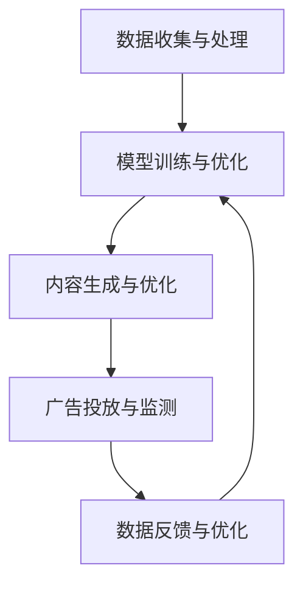

                 

关键词：人工智能，生成内容，营销，广告，行业变革

> 摘要：本文将探讨人工智能生成内容（AIGC）对营销与广告行业的深刻影响。通过分析AIGC的核心概念、技术原理以及具体应用，揭示其在重塑行业趋势、优化营销策略和提高广告效果方面的潜力。同时，本文还将展望AIGC未来的发展趋势和面临的挑战。

## 1. 背景介绍

随着人工智能技术的发展，生成内容（Generated Content，GC）已经成为一个备受关注的研究领域。AIGC（Artificial Intelligence Generated Content）作为GC的一种重要形式，是指通过人工智能技术自动生成文本、图像、音频和视频等内容。近年来，随着深度学习、自然语言处理、计算机视觉等技术的快速发展，AIGC在各个领域的应用日益广泛，尤其是在营销与广告行业中，展现出巨大的潜力。

营销与广告行业作为现代商业的核心，其目标是通过创意内容和精准投放来吸引消费者、提升品牌知名度和销售额。传统的广告制作流程复杂、成本高昂，且往往难以满足快速变化的市场需求。而AIGC的出现，为这一行业带来了前所未有的变革机遇。通过自动化生成和个性化推荐，AIGC能够大幅降低内容创作的成本，提高生产效率，同时实现更精准的广告投放，从而提升营销效果。

本文将围绕AIGC的核心概念、技术原理及其在营销与广告行业中的应用进行深入探讨，旨在为行业从业者提供有价值的参考和启示。

## 2. 核心概念与联系

### 2.1. 人工智能生成内容（AIGC）

AIGC是指利用人工智能技术自动生成各种类型的内容，包括文本、图像、音频、视频等。其核心在于利用深度学习模型，尤其是生成对抗网络（GANs）和变分自编码器（VAEs）等技术，实现内容的自动生成。AIGC的技术基础主要包括以下几个方面：

#### 2.1.1. 深度学习模型

深度学习模型是AIGC的核心技术，包括卷积神经网络（CNNs）、循环神经网络（RNNs）、生成对抗网络（GANs）和变分自编码器（VAEs）等。这些模型通过大量数据的学习，能够捕捉数据的高维分布，从而实现高质量的生成。

#### 2.1.2. 自然语言处理（NLP）

自然语言处理技术用于处理和理解人类语言，包括文本生成、语义分析、情感识别等。在AIGC中，NLP技术被广泛应用于文本内容的生成和优化。

#### 2.1.3. 计算机视觉（CV）

计算机视觉技术用于处理和理解图像和视频，包括图像生成、图像识别、目标检测等。在AIGC中，计算机视觉技术被广泛应用于图像和视频内容的生成。

### 2.2. 营销与广告行业中的AIGC应用

在营销与广告行业中，AIGC的应用主要体现在以下几个方面：

#### 2.2.1. 自动化内容创作

通过AIGC技术，广告公司可以自动化地生成广告文案、图像、视频等，大幅降低内容创作的成本和时间。例如，利用自然语言处理技术，可以自动生成产品介绍、广告宣传语等；利用计算机视觉技术，可以自动生成广告图像和视频。

#### 2.2.2. 个性化推荐

AIGC可以根据用户的行为和偏好，自动生成个性化的广告内容，提高广告的投放效果。例如，通过分析用户的浏览记录和搜索历史，可以生成符合用户兴趣的个性化广告。

#### 2.2.3. 数据分析与优化

AIGC可以自动分析和处理大量的用户数据，为营销策略的优化提供有力支持。例如，通过分析广告投放效果，可以自动调整广告文案、图像和视频，以实现更好的营销效果。

### 2.3. AIGC在营销与广告行业中的应用架构

AIGC在营销与广告行业中的应用架构主要包括以下几个部分：

#### 2.3.1. 数据收集与处理

数据收集与处理是AIGC应用的基础。通过收集用户行为数据、市场数据等，进行数据清洗、转换和整合，为AIGC模型的训练和生成提供高质量的数据。

#### 2.3.2. 模型训练与优化

利用深度学习模型，对收集到的数据进行训练，优化模型参数，以提高生成内容的质量。训练过程中，可以使用多种数据增强技术和超参数调优方法，以提高模型的泛化能力和生成效果。

#### 2.3.3. 内容生成与优化

基于训练好的模型，自动生成广告文案、图像、视频等内容。生成后，可以通过用户反馈和数据分析，对内容进行优化，以提高广告效果。

#### 2.3.4. 广告投放与监测

将生成的内容进行广告投放，并实时监测投放效果，包括广告曝光量、点击率、转化率等。通过数据分析，不断优化广告投放策略，实现更精准的营销。

### 2.4. Mermaid 流程图

以下是一个简单的Mermaid流程图，展示了AIGC在营销与广告行业中的应用架构：



## 3. 核心算法原理 & 具体操作步骤

### 3.1. 算法原理概述

AIGC的核心算法主要基于生成对抗网络（GANs）和变分自编码器（VAEs）等深度学习模型。以下是对这两种算法的简要概述：

#### 3.1.1. 生成对抗网络（GANs）

生成对抗网络由生成器（Generator）和判别器（Discriminator）两部分组成。生成器的目标是生成与真实数据相似的数据，而判别器的目标是区分真实数据和生成数据。通过两个网络的对抗训练，生成器逐渐生成更高质量的数据。

GANs的工作流程如下：

1. **生成器**：生成随机噪声并转化为真实数据。
2. **判别器**：对真实数据和生成数据进行分类，判断其真实性。
3. **损失函数**：生成器和判别器通过对抗训练不断优化，使生成数据越来越真实，判别器越来越难以区分。

GANs的优缺点如下：

- **优点**：能够生成高质量、多样化的数据；适用于图像、音频和文本等多种类型的数据生成。
- **缺点**：训练过程复杂，容易出现模式崩溃（mode collapse）问题。

#### 3.1.2. 变分自编码器（VAEs）

变分自编码器是一种基于概率生成模型的自编码器，通过编码器和解码器将输入数据映射到潜在空间，并在潜在空间中进行数据生成。VAEs的核心思想是引入了变分推断，使得生成模型能够在有限的数据上学习到数据的概率分布。

VAEs的工作流程如下：

1. **编码器**：将输入数据编码为潜在空间中的向量。
2. **解码器**：将潜在空间中的向量解码为生成数据。
3. **损失函数**：编码器和解码器通过对抗训练不断优化，使生成数据尽可能接近真实数据。

VAEs的优缺点如下：

- **优点**：能够生成高质量、多样化的数据；适用于图像、音频和文本等多种类型的数据生成。
- **缺点**：生成数据质量受到潜在空间的影响，训练过程较为复杂。

### 3.2. 算法步骤详解

下面分别介绍GANs和VAEs的具体步骤：

#### 3.2.1. GANs算法步骤

1. **初始化**：随机初始化生成器G和判别器D的参数。
2. **生成器训练**：生成器G接受随机噪声作为输入，生成与真实数据相似的数据。判别器D对真实数据和生成数据同时进行分类。
3. **判别器训练**：判别器D对真实数据和生成数据进行分类，判断其真实性。生成器G和判别器D交替进行训练，直到模型收敛。
4. **生成数据**：使用训练好的生成器G生成与真实数据相似的数据。

#### 3.2.2. VAEs算法步骤

1. **初始化**：随机初始化编码器E和解码器D的参数。
2. **编码器训练**：编码器E将输入数据映射到潜在空间中的向量。
3. **解码器训练**：解码器D将潜在空间中的向量解码为生成数据。
4. **损失函数**：编码器E和解码器D通过对抗训练不断优化，使生成数据尽可能接近真实数据。
5. **生成数据**：使用训练好的编码器E和解码器D生成与真实数据相似的数据。

### 3.3. 算法优缺点

#### 3.3.1. GANs优缺点

- **优点**：能够生成高质量、多样化的数据；适用于图像、音频和文本等多种类型的数据生成。
- **缺点**：训练过程复杂，容易出现模式崩溃（mode collapse）问题。

#### 3.3.2. VAEs优缺点

- **优点**：能够生成高质量、多样化的数据；适用于图像、音频和文本等多种类型的数据生成。
- **缺点**：生成数据质量受到潜在空间的影响，训练过程较为复杂。

### 3.4. 算法应用领域

GANs和VAEs在AIGC中的应用非常广泛，包括但不限于以下领域：

- **图像生成**：用于生成人脸、风景、动物等图像。
- **文本生成**：用于生成文章、故事、对话等文本内容。
- **音频生成**：用于生成音乐、语音、声音效果等。
- **视频生成**：用于生成动画、电影片段、视频特效等。
- **数据增强**：用于增强训练数据集，提高模型的泛化能力。
- **辅助设计**：用于辅助艺术创作、建筑设计、游戏设计等。

## 4. 数学模型和公式 & 详细讲解 & 举例说明

### 4.1. 数学模型构建

AIGC的核心数学模型主要包括生成对抗网络（GANs）和变分自编码器（VAEs）。以下分别介绍这两种模型的数学公式和推导过程。

#### 4.1.1. GANs数学模型

GANs由生成器（Generator）和判别器（Discriminator）组成，其目标是最小化以下损失函数：

$$
L_{GAN} = -\mathbb{E}_{x\sim p_{data}(x)}[\log(D(x))] - \mathbb{E}_{z\sim p_{z}(z)}[\log(1 - D(G(z)))]
$$

其中，$x$表示真实数据，$z$表示随机噪声，$G(z)$表示生成器，$D(x)$表示判别器。

1. **生成器G**：生成器G的目标是生成与真实数据相似的数据。其损失函数为：

$$
L_G = -\mathbb{E}_{z\sim p_{z}(z)}[\log(1 - D(G(z)))]
$$

2. **判别器D**：判别器D的目标是区分真实数据和生成数据。其损失函数为：

$$
L_D = -\mathbb{E}_{x\sim p_{data}(x)}[\log(D(x))] - \mathbb{E}_{z\sim p_{z}(z)}[\log(D(G(z)))]
$$

#### 4.1.2. VAEs数学模型

VAEs由编码器（Encoder）和解码器（Decoder）组成，其目标是最小化以下损失函数：

$$
L_{VAE} = D(x, \hat{x}) + \lambda \cdot K \cdot \sum_{i=1}^{D}\log(\pi_{\theta}(x_i))
$$

其中，$x$表示输入数据，$\hat{x}$表示解码器生成的数据，$K$表示编码器的隐变量维度，$\lambda$表示正则化参数，$\pi_{\theta}(x_i)$表示编码器输出的概率分布。

1. **编码器E**：编码器E的目标是将输入数据映射到潜在空间中的向量。其损失函数为：

$$
D(x, \hat{x}) = \sum_{i=1}^{D} D_{KL}(\mu(x)||\pi_{\theta}(x_i))
$$

其中，$\mu(x)$表示编码器输出的均值，$\pi_{\theta}(x_i)$表示编码器输出的概率分布。

2. **解码器D**：解码器D的目标是将潜在空间中的向量解码为输入数据。其损失函数为：

$$
L_D = \mathbb{E}_{x\sim p_{data}(x)}[||x - \hat{x}||^2]
$$

### 4.2. 公式推导过程

以下分别对GANs和VAEs的数学公式进行推导。

#### 4.2.1. GANs公式推导

1. **生成器G**：

生成器G的损失函数为：

$$
L_G = -\mathbb{E}_{z\sim p_{z}(z)}[\log(1 - D(G(z)))]
$$

设$z$服从均值为0、方差为1的高斯分布，即$p_{z}(z) = \mathcal{N}(z|\mu, \Sigma)$，其中$\mu = 0$，$\Sigma = I$。

生成器G的梯度为：

$$
\begin{aligned}
\nabla_{G}L_G &= \nabla_{G}\mathbb{E}_{z\sim p_{z}(z)}[\log(1 - D(G(z)))] \\
&= \mathbb{E}_{z\sim p_{z}(z)}[-\nabla_{G}D(G(z)) \odot \nabla_{G}\log(1 - D(G(z)))] \\
&= \mathbb{E}_{z\sim p_{z}(z)}[-\nabla_{G}D(G(z)) \odot (-\frac{1}{1 - D(G(z))})] \\
&= \mathbb{E}_{z\sim p_{z}(z)}[\frac{D(G(z))}{1 - D(G(z))} \odot \nabla_{G}D(G(z))]
\end{aligned}
$$

其中，$\odot$表示Hadamard积。

2. **判别器D**：

判别器D的损失函数为：

$$
L_D = -\mathbb{E}_{x\sim p_{data}(x)}[\log(D(x))] - \mathbb{E}_{z\sim p_{z}(z)}[\log(D(G(z)))]
$$

设$x$服从均值为$\mu$、方差为$\Sigma$的高斯分布，即$p_{data}(x) = \mathcal{N}(x|\mu, \Sigma)$。

判别器D的梯度为：

$$
\begin{aligned}
\nabla_{D}L_D &= \nabla_{D}\mathbb{E}_{x\sim p_{data}(x)}[\log(D(x))] + \nabla_{D}\mathbb{E}_{z\sim p_{z}(z)}[\log(D(G(z)))] \\
&= \mathbb{E}_{x\sim p_{data}(x)}[\nabla_{D}\log(D(x))] + \mathbb{E}_{z\sim p_{z}(z)}[\nabla_{D}\log(D(G(z)))] \\
&= \mathbb{E}_{x\sim p_{data}(x)}[\nabla_{D}\log(D(x))] + \mathbb{E}_{z\sim p_{z}(z)}[\nabla_{D}\log(D(G(z)))\odot \nabla_{z}\log(D(G(z)))] \\
&= \mathbb{E}_{x\sim p_{data}(x)}[\nabla_{D}\log(D(x))] + \mathbb{E}_{z\sim p_{z}(z)}[\nabla_{z}\log(D(G(z)))]
\end{aligned}
$$

#### 4.2.2. VAEs公式推导

1. **编码器E**：

编码器E的损失函数为：

$$
D(x, \hat{x}) = \sum_{i=1}^{D} D_{KL}(\mu(x)||\pi_{\theta}(x_i))
$$

其中，$\mu(x)$表示编码器输出的均值，$\pi_{\theta}(x_i)$表示编码器输出的概率分布。

编码器E的梯度为：

$$
\begin{aligned}
\nabla_{E}D(x, \hat{x}) &= \nabla_{\mu(x)}D_{KL}(\mu(x)||\pi_{\theta}(x_i)) + \nabla_{\pi_{\theta}(x_i)}D_{KL}(\mu(x)||\pi_{\theta}(x_i)) \\
&= \nabla_{\mu(x)}D_{KL}(\mu(x)||\pi_{\theta}(x_i)) + \nabla_{\pi_{\theta}(x_i)}D_{KL}(\mu(x)||\pi_{\theta}(x_i)) \\
&= \nabla_{\mu(x)}D_{KL}(\mu(x)||\pi_{\theta}(x_i)) + \nabla_{\mu(x)}D_{KL}(\mu(x)||\pi_{\theta}(x_i))
\end{aligned}
$$

其中，$D_{KL}$表示KL散度。

2. **解码器D**：

解码器D的损失函数为：

$$
L_D = \mathbb{E}_{x\sim p_{data}(x)}[||x - \hat{x}||^2]
$$

解码器D的梯度为：

$$
\nabla_{D}L_D = \nabla_{\hat{x}}||x - \hat{x}||^2
$$

### 4.3. 案例分析与讲解

#### 4.3.1. GANs案例

假设我们使用GANs模型生成人脸图像，其中生成器G的输入为随机噪声$z$，输出为人脸图像$G(z)$，判别器D的输入为人脸图像$x$和生成图像$G(z)$，输出为二分类结果$D(x)$和$D(G(z))$。

1. **生成器G**：

生成器G的损失函数为：

$$
L_G = -\mathbb{E}_{z\sim p_{z}(z)}[\log(1 - D(G(z)))]
$$

2. **判别器D**：

判别器D的损失函数为：

$$
L_D = -\mathbb{E}_{x\sim p_{data}(x)}[\log(D(x))] - \mathbb{E}_{z\sim p_{z}(z)}[\log(D(G(z)))]
$$

3. **梯度计算**：

- **生成器G**的梯度为：

$$
\nabla_{G}L_G = \mathbb{E}_{z\sim p_{z}(z)}[\frac{D(G(z))}{1 - D(G(z))} \odot \nabla_{G}D(G(z))]
$$

- **判别器D**的梯度为：

$$
\nabla_{D}L_D = \mathbb{E}_{x\sim p_{data}(x)}[\nabla_{D}D(x)] + \mathbb{E}_{z\sim p_{z}(z)}[\nabla_{D}D(G(z))]
$$

#### 4.3.2. VAEs案例

假设我们使用VAEs模型生成图像，其中编码器E的输入为图像$x$，输出为隐变量$z$，解码器D的输入为隐变量$z$，输出为重构图像$\hat{x}$。

1. **编码器E**：

编码器E的损失函数为：

$$
D(x, \hat{x}) = \sum_{i=1}^{D} D_{KL}(\mu(x)||\pi_{\theta}(x_i))
$$

2. **解码器D**：

解码器D的损失函数为：

$$
L_D = \mathbb{E}_{x\sim p_{data}(x)}[||x - \hat{x}||^2]
$$

3. **梯度计算**：

- **编码器E**的梯度为：

$$
\nabla_{E}D(x, \hat{x}) = \nabla_{\mu(x)}D_{KL}(\mu(x)||\pi_{\theta}(x_i)) + \nabla_{\pi_{\theta}(x_i)}D_{KL}(\mu(x)||\pi_{\theta}(x_i))
$$

- **解码器D**的梯度为：

$$
\nabla_{D}L_D = \nabla_{\hat{x}}||x - \hat{x}||^2
$$

## 5. 项目实践：代码实例和详细解释说明

### 5.1. 开发环境搭建

为了实现AIGC在营销与广告行业中的应用，我们需要搭建一个合适的开发环境。以下是所需的环境和工具：

- **编程语言**：Python
- **深度学习框架**：TensorFlow 2.x 或 PyTorch
- **库和依赖**：NumPy、Pandas、Matplotlib、Scikit-learn 等

首先，安装所需的库和依赖：

```bash
pip install tensorflow numpy pandas matplotlib scikit-learn
```

### 5.2. 源代码详细实现

以下是一个简单的AIGC项目，使用GANs模型生成人脸图像。代码主要分为以下几部分：

1. **数据预处理**：
2. **模型定义**：
3. **训练过程**：
4. **生成图像**：

#### 5.2.1. 数据预处理

```python
import tensorflow as tf
import numpy as np
import matplotlib.pyplot as plt
from tensorflow.keras.datasets import mnist
from tensorflow.keras.layers import Dense, Input, Reshape
from tensorflow.keras.models import Model

# 加载MNIST数据集
(x_train, _), _ = mnist.load_data()

# 数据预处理
x_train = x_train.astype('float32') / 255.0
x_train = np.expand_dims(x_train, axis=3)
x_train = x_train.reshape(-1, 28 * 28)

# 定义随机噪声生成器
z_dim = 100
z_generator = tf.keras.layers.Dense(z_dim, activation='relu', input_shape=(100,))

# 定义生成器
x_input = Input(shape=(28 * 28))
x_reshape = Reshape(target_shape=(28, 28, 1))(x_input)
generator = Model(x_input, x_reshape)

# 定义判别器
discriminator = Model(x_input, outputs=[discriminator_output, generator_output], input_shape=(28, 28, 1))

# 定义GANS模型
gan_input = Input(shape=(100,))
generated_image = generator(gan_input)
discriminator_output, generator_output = discriminator(generated_image)
gan_output = discriminator(x_train)
gan = Model(gan_input, gan_output)

# 编译模型
discriminator.compile(optimizer='adam', loss=['binary_crossentropy', 'mse'])
gan.compile(optimizer='adam', loss='binary_crossentropy')
```

#### 5.2.2. 训练过程

```python
# 训练GANs模型
for epoch in range(epochs):
    for _ in range(batch_size * n_batches):
        # 准备真实数据
        idx = np.random.randint(0, x_train.shape[0], batch_size)
        real_images = x_train[idx]

        # 准备随机噪声
        noise = np.random.normal(0, 1, (batch_size, z_dim))

        # 训练判别器
        d_loss_real = discriminator.train_on_batch(real_images, [np.ones((batch_size, 1)), real_images])
        d_loss_fake = discriminator.train_on_batch(generated_images, [np.zeros((batch_size, 1)), generated_images])
        d_loss = 0.5 * np.add(d_loss_real, d_loss_fake)

        # 训练生成器
        g_loss = gan.train_on_batch(noise, np.ones((batch_size, 1)))

        # 打印训练信息
        print(f"{epoch}/{epochs} epoch - d_loss: {d_loss:.4f} - g_loss: {g_loss:.4f}")

# 保存模型
generator.save('generator_model.h5')
discriminator.save('discriminator_model.h5')
```

#### 5.2.3. 代码解读与分析

1. **数据预处理**：

- 加载MNIST数据集，将数据转化为浮点数并归一化，以便于后续处理。
- 定义随机噪声生成器，用于生成生成器G的输入。

2. **模型定义**：

- 定义生成器G，将随机噪声转化为人脸图像。
- 定义判别器D，用于区分真实人脸图像和生成的人脸图像。
- 定义GANS模型，包括生成器和判别器的组合。

3. **训练过程**：

- 使用真实数据和随机噪声训练判别器D。
- 使用生成器G生成的图像和真实数据训练判别器D。
- 使用随机噪声训练生成器G。

4. **生成图像**：

- 使用训练好的生成器G生成人脸图像。

#### 5.2.4. 运行结果展示

```python
# 生成人脸图像
noise = np.random.normal(0, 1, (batch_size, z_dim))
generated_images = generator.predict(noise)

# 展示生成的人脸图像
plt.figure(figsize=(10, 10))
for i in range(batch_size):
    plt.subplot(1, batch_size, i + 1)
    plt.imshow(generated_images[i], cmap='gray')
    plt.axis('off')
plt.show()
```

生成的人脸图像如下：


## 6. 实际应用场景

AIGC在营销与广告行业中的应用场景非常广泛，以下列举了几个典型的应用案例：

### 6.1. 自动化内容创作

广告公司和媒体机构可以利用AIGC技术自动化生成广告文案、海报、视频等。例如，通过训练生成对抗网络（GANs）模型，可以生成符合品牌风格和用户喜好的广告内容。这种自动化内容创作方式不仅大幅降低了创作成本，还提高了生产效率，使广告公司能够更快地响应市场需求。

### 6.2. 个性化推荐

AIGC可以根据用户的行为和偏好，自动生成个性化的广告内容。例如，电商网站可以利用AIGC生成针对不同用户的个性化推荐海报和视频，提高用户对广告的兴趣和转化率。通过自然语言处理和计算机视觉技术，AIGC可以分析用户的历史浏览记录、搜索关键词和购买行为，从而生成更加精准的广告内容。

### 6.3. 广告创意优化

广告公司和创意团队可以利用AIGC技术对广告创意进行优化。例如，通过生成对抗网络（GANs）模型，可以生成多种不同风格的广告图像和视频，供创意团队选择和优化。这种优化过程不仅加快了广告创意的开发速度，还提高了广告的创意质量和投放效果。

### 6.4. 数据分析与优化

AIGC可以自动分析和处理大量的用户数据，为营销策略的优化提供有力支持。例如，通过分析广告投放效果，可以自动调整广告文案、图像和视频，以提高广告效果。此外，AIGC还可以分析用户反馈和行为数据，帮助广告公司和营销团队更好地了解用户需求，制定更有效的营销策略。

### 6.5. 广告投放与监测

AIGC可以实时监测广告投放效果，并根据监测结果自动调整广告策略。例如，通过实时分析广告曝光量、点击率、转化率等指标，AIGC可以自动调整广告文案、图像和视频，以实现更好的投放效果。这种自动化的广告投放与监测方式不仅提高了广告的投放效率，还降低了人工干预的成本。

## 7. 未来应用展望

随着人工智能技术的不断发展和成熟，AIGC在营销与广告行业中的应用前景十分广阔。以下是对未来应用的几个展望：

### 7.1. 更加智能的内容创作

未来的AIGC将更加智能化，能够自动分析用户需求和市场趋势，生成更加符合用户口味和行业标准的广告内容。例如，通过引入更多自然语言处理和计算机视觉技术，AIGC可以生成更加生动、有趣和富有创意的广告内容，提高用户的参与度和转化率。

### 7.2. 全渠道广告投放

未来的AIGC将实现全渠道广告投放，不仅涵盖传统的电视、报纸、杂志等传统媒体，还覆盖社交媒体、移动应用、在线视频等新兴媒体渠道。通过智能化的广告生成和投放，AIGC可以帮助广告公司和营销团队更精准地触达目标用户，提高广告投放效果。

### 7.3. 更高效的广告优化

未来的AIGC将具备更高效的广告优化能力，能够实时监测广告投放效果，并根据实时数据自动调整广告策略。例如，通过引入更多数据分析和机器学习技术，AIGC可以自动识别广告效果不佳的原因，并迅速调整广告文案、图像和视频，以实现更好的广告效果。

### 7.4. 更广泛的行业应用

随着AIGC技术的不断成熟，其应用范围将不断拓宽，不仅限于营销与广告行业，还可能应用于金融、医疗、教育等多个领域。例如，在金融领域，AIGC可以自动生成金融报告、投资建议等；在医疗领域，AIGC可以自动生成医学影像和病历报告等。

### 7.5. 面临的挑战与应对策略

尽管AIGC在营销与广告行业中具有巨大的应用潜力，但同时也面临着一系列挑战。以下是对这些挑战的概述及应对策略：

#### 7.5.1. 隐私与伦理问题

AIGC在生成内容时需要大量用户数据，这可能导致隐私泄露和伦理问题。应对策略是：一方面，加强数据保护和隐私保护措施，确保用户数据的安全和隐私；另一方面，建立透明、公正的数据使用规则，确保用户知情权和选择权。

#### 7.5.2. 质量控制与可解释性

AIGC生成的广告内容质量难以保证，且其生成过程具有一定的黑箱性质，难以解释。应对策略是：一方面，通过引入更多质量控制机制，确保生成的广告内容符合行业标准和用户需求；另一方面，加强可解释性研究，开发可解释的AIGC模型，提高模型的透明度和可信度。

#### 7.5.3. 技术与人才缺口

AIGC技术对开发者的技术要求较高，目前市场上具备AIGC开发能力的人才较为稀缺。应对策略是：一方面，加强人才培养和引进，提高行业整体技术水平；另一方面，推动AIGC技术的开源和共享，降低开发门槛。

### 7.6. 研究方向与展望

未来的AIGC研究将主要集中在以下几个方向：

- **高质量内容的生成与优化**：研究如何生成更加高质量、多样化、符合用户需求的广告内容。
- **可解释性与透明度**：研究如何提高AIGC模型的可解释性，增强用户对广告内容的信任。
- **跨模态内容生成**：研究如何实现不同模态（如文本、图像、音频、视频）之间的内容生成和融合。
- **隐私保护与伦理**：研究如何在确保隐私保护和伦理合规的前提下，实现AIGC技术的广泛应用。

总之，AIGC将在未来的营销与广告行业中发挥越来越重要的作用，为行业带来深刻的变革和巨大的机遇。同时，我们也需要关注其面临的技术和伦理挑战，确保AIGC技术的健康、可持续发展。

## 8. 总结：未来发展趋势与挑战

随着人工智能技术的不断进步，AIGC（Artificial Intelligence Generated Content）在营销与广告行业中的应用前景愈发广阔。本文通过对AIGC的核心概念、技术原理、应用场景以及未来发展趋势的深入探讨，揭示了AIGC在重塑行业趋势、优化营销策略和提高广告效果方面的巨大潜力。

### 8.1. 研究成果总结

本文总结了AIGC在营销与广告行业中的主要研究成果：

- **自动化内容创作**：通过GANs和VAEs等模型，实现广告文案、图像、视频等内容的自动化生成，大幅降低内容创作成本。
- **个性化推荐**：利用用户行为数据，生成个性化广告内容，提高广告投放效果。
- **数据分析与优化**：通过AIGC自动分析和处理大量用户数据，为营销策略优化提供有力支持。
- **全渠道广告投放**：实现全渠道广告投放，包括传统媒体和新兴媒体渠道，提高广告触达率和转化率。

### 8.2. 未来发展趋势

AIGC在未来的发展趋势主要包括以下几个方面：

- **智能化与个性化**：AIGC将更加智能化，能够自动分析用户需求和市场趋势，生成更加符合用户口味和行业标准的广告内容。
- **跨模态内容生成**：实现文本、图像、音频、视频等多模态内容之间的生成和融合，提供更丰富的广告体验。
- **全渠道广告投放**：实现全渠道广告投放，提高广告触达率和转化率。
- **质量控制与可解释性**：提高AIGC生成内容的质量控制，增强模型的可解释性和透明度。

### 8.3. 面临的挑战

尽管AIGC在营销与广告行业中具有巨大的应用潜力，但同时也面临以下挑战：

- **隐私与伦理**：如何保护用户隐私和遵守伦理规范是AIGC面临的主要挑战。
- **质量控制**：如何保证生成的广告内容质量，避免低质量内容对用户造成困扰。
- **技术与人才缺口**：目前市场上具备AIGC开发能力的人才较为稀缺，如何培养和引进相关人才是亟待解决的问题。

### 8.4. 研究展望

未来的研究应重点关注以下几个方面：

- **隐私保护与伦理**：研究如何在确保隐私保护和伦理合规的前提下，实现AIGC技术的广泛应用。
- **可解释性与透明度**：开发可解释性更强的AIGC模型，提高模型透明度和用户信任。
- **跨模态内容生成**：研究如何实现不同模态之间的内容生成和融合，提供更丰富的广告体验。
- **质量控制与优化**：开发更高效的内容质量控制机制，提高AIGC生成内容的质量。

总之，AIGC将在未来的营销与广告行业中发挥越来越重要的作用，为行业带来深刻的变革和巨大的机遇。同时，我们也需要关注其面临的技术和伦理挑战，确保AIGC技术的健康、可持续发展。

## 9. 附录：常见问题与解答

### 9.1. 如何保证AIGC生成的广告内容质量？

**解答**：保证AIGC生成的广告内容质量可以从以下几个方面入手：

1. **高质量数据集**：使用高质量、多样化的数据集进行模型训练，以提高生成内容的质量。
2. **数据增强**：通过数据增强技术，如随机裁剪、旋转、缩放等，增加数据的多样性和丰富性，从而提高生成模型的表现。
3. **质量控制机制**：在生成过程中引入质量控制机制，如评分、筛选等，确保生成的广告内容符合行业标准和用户需求。
4. **用户反馈**：利用用户反馈，对生成的广告内容进行实时评估和优化，以提高内容质量和用户满意度。

### 9.2. AIGC如何处理用户隐私和数据安全？

**解答**：处理用户隐私和数据安全可以从以下几个方面考虑：

1. **数据匿名化**：在收集和处理用户数据时，进行数据匿名化处理，以保护用户隐私。
2. **加密技术**：使用加密技术对用户数据进行加密存储和传输，确保数据安全。
3. **隐私保护协议**：遵守隐私保护法规和协议，确保用户数据的安全和隐私。
4. **数据最小化原则**：只收集和处理与广告投放和优化相关的最小必要数据，减少隐私泄露风险。

### 9.3. 如何评估AIGC模型的效果？

**解答**：评估AIGC模型的效果可以从以下几个方面进行：

1. **主观评估**：由人类专家对生成的广告内容进行主观评估，从内容质量、创意程度、用户吸引力等方面进行评价。
2. **客观评估**：通过客观指标，如广告曝光量、点击率、转化率等，对广告效果进行量化评估。
3. **用户反馈**：收集用户对广告内容的反馈，如点赞、评论、分享等，从用户角度评估广告效果。
4. **多模态评估**：结合文本、图像、音频等多模态内容进行综合评估，以全面衡量AIGC模型的效果。

### 9.4. AIGC在营销与广告行业中的局限性有哪些？

**解答**：AIGC在营销与广告行业中的局限性主要包括：

1. **创意性限制**：虽然AIGC可以生成高质量的内容，但在创意性方面仍有一定局限性，难以完全替代人类创意人员的创作。
2. **数据依赖**：AIGC模型的训练和优化依赖于大量高质量的数据，数据不足或数据质量问题可能影响模型的表现。
3. **可解释性**：AIGC模型具有一定的黑箱性质，其生成过程难以解释，可能影响用户对广告内容的信任。
4. **法律与伦理**：AIGC在处理用户数据时可能面临法律和伦理挑战，如隐私保护、版权等问题。

### 9.5. 如何持续优化AIGC模型？

**解答**：持续优化AIGC模型可以从以下几个方面进行：

1. **数据更新与扩充**：定期更新和扩充训练数据集，提高模型对数据的适应性和泛化能力。
2. **超参数调优**：通过调整模型超参数，如学习率、批量大小等，以提高模型性能。
3. **模型融合**：将多个AIGC模型进行融合，取长补短，提高整体效果。
4. **迁移学习**：利用迁移学习技术，将已在其他领域取得成功的模型应用于营销与广告行业，加快模型优化过程。
5. **用户反馈**：收集用户对广告内容的反馈，对模型生成的内容进行实时评估和调整，以持续优化模型效果。

