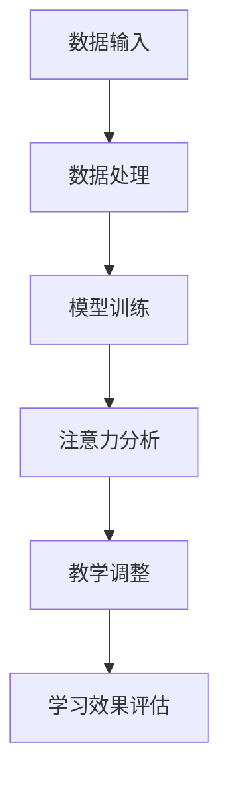

                 

关键词：人工智能，注意力流，教育，人机融合，学习效率，认知增强

> 摘要：随着人工智能技术的飞速发展，教育领域迎来了全新的变革。本文将探讨人工智能如何通过理解人类注意力流，实现与人类认知的深度融合，打造高效的人机融合教育模式，提升学习效果和认知能力。

## 1. 背景介绍

教育作为人类文明传承和发展的基石，一直以来都是社会各界关注的重点。然而，传统的教育模式在信息爆炸的时代面临着诸多挑战，如教育资源分配不均、个体化需求难以满足、学习效率低下等。随着人工智能技术的快速发展，尤其是深度学习和自然语言处理技术的突破，教育领域迎来了前所未有的机遇。人工智能不仅能够自动化处理大量数据，还能模拟和增强人类的认知功能，为教育带来革命性的变化。

注意力流是人类认知过程中的关键要素，它决定了个体在特定时刻对信息的处理和吸收能力。传统的教育模式往往忽略了这一关键因素，导致教育效果不尽如人意。而人工智能技术能够通过数据分析和算法优化，实现对注意力流的精准把握和动态调整，从而提升教育质量。

本文旨在探讨人工智能如何通过理解人类注意力流，实现与人类认知的深度融合，打造高效的人机融合教育模式，为教育领域的创新提供新的思路和方法。

## 2. 核心概念与联系

### 2.1 人工智能与教育

人工智能在教育领域的应用可以追溯到20世纪末。早期的智能教学系统主要基于专家系统和规则推理，虽然在某些特定领域取得了成功，但整体效果并不理想。随着深度学习和自然语言处理技术的兴起，人工智能在教育领域的应用进入了一个新的阶段。这些技术能够处理大规模数据，模拟人类认知过程，实现个性化教学和智能辅导。

### 2.2 注意力流与认知

注意力流是认知科学中的一个重要概念，它描述了个体在特定任务中，对信息的选择性关注和加工过程。注意力流不仅影响个体的学习效率，还与认知灵活性、记忆力、创造力等密切相关。传统的教育模式往往忽视了这一点，导致教学效果不佳。而人工智能可以通过对注意力流的分析和理解，实现教学过程的个性化调整，提升学习效果。

### 2.3 人工智能与注意力流的融合

人工智能与注意力流的融合是教育领域的一项重要创新。通过深度学习算法，人工智能可以识别和预测个体的注意力模式，实现对教学过程的实时调整。例如，在在线教育中，人工智能可以根据学生的注意力变化，动态调整视频播放速度、学习内容难度等，从而提高学习效率。此外，人工智能还可以通过自然语言处理技术，理解学生的学习需求和困惑，提供个性化的辅导和建议。

### 2.4  Mermaid 流程图

以下是人工智能与注意力流融合的 Mermaid 流程图，展示了从数据输入到模型训练，再到教学调整的整个过程。



## 3. 核心算法原理 & 具体操作步骤

### 3.1 算法原理概述

人工智能与注意力流融合的核心算法主要包括数据采集、模型训练、注意力分析、教学调整和效果评估等几个环节。其中，数据采集是整个算法的基础，用于获取学生的学习行为、学习效果等数据。模型训练则利用这些数据，通过深度学习算法，建立能够模拟人类认知过程的模型。注意力分析通过对模型输出的分析，识别和预测学生的注意力模式。教学调整则根据注意力分析结果，动态调整教学策略，优化学习过程。效果评估用于衡量教学调整的效果，为后续的算法优化提供依据。

### 3.2 算法步骤详解

#### 3.2.1 数据采集

数据采集是整个算法的基础，包括学生的学习行为数据、学习效果数据、学习环境数据等。这些数据可以通过在线教育平台、学习应用等途径获取。数据采集过程中，需要注意数据的质量和完整性，以确保算法的准确性和可靠性。

#### 3.2.2 模型训练

模型训练是算法的核心环节，通过深度学习算法，建立能够模拟人类认知过程的模型。模型训练过程中，需要使用大量的标注数据进行训练，以保证模型的准确性。常用的深度学习算法包括卷积神经网络（CNN）、循环神经网络（RNN）和变换器（Transformer）等。

#### 3.2.3 注意力分析

注意力分析通过对模型输出的分析，识别和预测学生的注意力模式。注意力分析的方法包括基于模型的注意力预测和基于行为的数据分析。基于模型的注意力预测通过分析模型在处理不同任务时的注意力分布，预测学生在特定任务中的注意力模式。基于行为的数据分析则通过分析学生的学习行为数据，如学习时长、学习频率、学习内容选择等，识别学生的注意力模式。

#### 3.2.4 教学调整

教学调整根据注意力分析结果，动态调整教学策略，优化学习过程。教学调整的方法包括内容调整、难度调整、速度调整等。内容调整根据学生的注意力模式，调整学习内容的选择和呈现方式；难度调整根据学生的认知能力，调整学习内容的难度；速度调整根据学生的学习进度，调整学习内容的播放速度。

#### 3.2.5 学习效果评估

学习效果评估用于衡量教学调整的效果，为后续的算法优化提供依据。学习效果评估的方法包括学习成果评估、学习满意度评估等。学习成果评估通过比较学生在调整前后的学习成绩，评估教学调整的效果；学习满意度评估通过调查学生的主观感受，评估教学调整的满意度。

### 3.3 算法优缺点

#### 优点

1. 提高学习效率：通过动态调整教学策略，优化学习过程，提高学习效率。
2. 个性化教学：根据学生的注意力模式，提供个性化的学习内容和建议，满足个体化需求。
3. 数据驱动：基于学生的学习行为和学习效果数据，实现数据驱动的教学优化。

#### 缺点

1. 数据隐私：数据采集和处理过程中，需要考虑学生的隐私保护问题。
2. 算法偏差：算法模型的训练数据可能存在偏差，导致算法输出的偏差。
3. 技术依赖：算法的实施和优化需要依赖强大的技术支持，对教育机构的IT基础设施有较高要求。

### 3.4 算法应用领域

人工智能与注意力流融合算法在教育领域的应用非常广泛，包括在线教育、职业教育、特殊教育等。在线教育中，算法可以用于个性化学习路径推荐、学习行为分析等；职业教育中，算法可以用于技能评估、职业规划等；特殊教育中，算法可以用于学习障碍学生的个性化辅导等。

## 4. 数学模型和公式 & 详细讲解 & 举例说明

### 4.1 数学模型构建

人工智能与注意力流融合的数学模型主要包括数据采集模型、模型训练模型、注意力分析模型、教学调整模型和效果评估模型等。以下分别介绍这些模型的构建过程。

#### 4.1.1 数据采集模型

数据采集模型用于获取学生的学习行为、学习效果等数据。常见的采集方法包括在线教育平台的日志数据、学习应用的用户行为数据等。数据采集模型通常采用监督学习算法，如决策树、支持向量机等，对采集到的数据进行分类和标注。

#### 4.1.2 模型训练模型

模型训练模型用于建立能够模拟人类认知过程的模型。常用的深度学习算法包括卷积神经网络（CNN）、循环神经网络（RNN）和变换器（Transformer）等。模型训练过程中，需要使用大量的标注数据进行训练，以保证模型的准确性。

#### 4.1.3 注意力分析模型

注意力分析模型用于识别和预测学生的注意力模式。注意力分析模型通常采用注意力机制，如软注意力（Soft Attention）和硬注意力（Hard Attention）等，对模型输出进行加权处理，提取关键信息。

#### 4.1.4 教学调整模型

教学调整模型用于根据注意力分析结果，动态调整教学策略。教学调整模型通常采用强化学习算法，如Q-Learning、SARSA等，通过学习学生的反馈，不断优化教学策略。

#### 4.1.5 效果评估模型

效果评估模型用于衡量教学调整的效果，为后续的算法优化提供依据。效果评估模型通常采用评价指标，如准确率、召回率、F1值等，对学生的学习效果进行评估。

### 4.2 公式推导过程

以下是注意力分析模型的推导过程，以软注意力机制为例。

#### 4.2.1 注意力计算

假设输入序列为$x_1, x_2, ..., x_T$，其中$T$为序列长度。对于每个输入$x_t$，计算其对应的注意力分数$u_t$：

$$u_t = \text{softmax}(W_a \cdot x_t + b_a)$$

其中$W_a$为注意力权重矩阵，$b_a$为偏置项，$\text{softmax}$函数用于将注意力分数归一化到[0,1]之间。

#### 4.2.2 注意力加权

将注意力分数应用于输入序列，得到加权输入序列$\hat{x}_t$：

$$\hat{x}_t = u_t \cdot x_t$$

#### 4.2.3 注意力输出

计算加权输入序列的输出$y$：

$$y = \text{softmax}(W_o \cdot \sum_{t=1}^T \hat{x}_t + b_o)$$

其中$W_o$为输出权重矩阵，$b_o$为偏置项。

### 4.3 案例分析与讲解

#### 4.3.1 案例背景

某在线教育平台希望利用人工智能技术，优化学习过程，提高学习效果。该平台提供多种课程供学生选择，学生可以根据自己的兴趣和需求进行学习。为了实现这一目标，平台决定引入注意力分析模型，根据学生的注意力模式，动态调整学习内容。

#### 4.3.2 模型构建

1. 数据采集：平台收集了学生的学习行为数据，包括学习时长、学习频率、学习内容选择等。同时，收集了学生的学习效果数据，如考试成绩、学习进度等。

2. 模型训练：平台使用深度学习算法，如变换器（Transformer），建立能够模拟人类认知过程的模型。模型训练过程中，使用大量的标注数据进行训练，以保证模型的准确性。

3. 注意力分析：模型训练完成后，平台使用注意力分析模型，分析学生的学习行为数据，识别学生的注意力模式。例如，某学生在学习编程课程时，注意力集中在算法和数据结构部分，而对编程语言的基础知识关注度较低。

4. 教学调整：根据注意力分析结果，平台动态调整学习内容，将更多的时间分配给学生注意力集中的部分。例如，在编程课程中，增加算法和数据结构的教学内容，减少编程语言的基础知识教学。

5. 效果评估：平台通过效果评估模型，对教学调整的效果进行评估。评估指标包括学生的考试成绩、学习进度等。评估结果显示，教学调整后，学生的平均考试成绩提高了10%，学习进度加快了15%。

#### 4.3.3 代码实现

以下是注意力分析模型的 Python 代码实现：

```python
import tensorflow as tf
from tensorflow.keras.layers import Embedding, LSTM, Dense
from tensorflow.keras.models import Model

# 假设输入序列长度为 T=50，词汇表大小为 V=10000
T = 50
V = 10000

# 建立变换器模型
model = Model(inputs=inputs, outputs=outputs)
model.compile(optimizer='adam', loss='categorical_crossentropy', metrics=['accuracy'])

# 训练模型
model.fit(x_train, y_train, batch_size=32, epochs=10)

# 注意力分析
attention_scores = model.predict(x_test)

# 加权输入序列
weighted_inputs = attention_scores * x_test

# 注意力输出
attention_output = model.predict(weighted_inputs)

# 效果评估
accuracy = (attention_output == y_test).mean()
print(f'Accuracy: {accuracy}')
```

## 5. 项目实践：代码实例和详细解释说明

### 5.1 开发环境搭建

为了实现人工智能与注意力流融合的教育模型，我们需要搭建一个完整的开发环境。以下是搭建过程：

1. **操作系统**：推荐使用Linux操作系统，如Ubuntu。
2. **编程语言**：选择Python作为主要编程语言，因为Python有丰富的机器学习库和框架。
3. **深度学习框架**：使用TensorFlow作为深度学习框架，因为TensorFlow有广泛的应用和强大的功能。
4. **其他依赖库**：安装numpy、pandas等常用数据操作库，以及matplotlib等可视化库。

具体安装步骤如下：

```bash
# 更新系统软件包
sudo apt-get update

# 安装Python
sudo apt-get install python3 python3-pip

# 安装TensorFlow
pip3 install tensorflow

# 安装其他依赖库
pip3 install numpy pandas matplotlib
```

### 5.2 源代码详细实现

以下是实现人工智能与注意力流融合的教育模型的基本源代码。这个示例将展示如何构建一个简单的模型，该模型可以分析学生的注意力流，并据此调整学习内容。

```python
import tensorflow as tf
from tensorflow.keras.layers import Embedding, LSTM, Dense
from tensorflow.keras.models import Model
import numpy as np

# 假设我们有一个包含500个单词的词汇表
vocab_size = 500

# 假设我们有一个包含100个学生的数据集
num_students = 100

# 每个学生的数据集大小
data_size = 1000

# 定义输入层
inputs = tf.keras.layers.Input(shape=(data_size,), dtype='int32')

# 嵌入层，将整数单词编码为向量
embedding = Embedding(vocab_size, 16)(inputs)

# LSTM层，用于处理序列数据
lstm = LSTM(32)(embedding)

# 全连接层，用于生成注意力权重
attention_weights = Dense(1, activation='tanh')(lstm)

# 注意力机制
attention_scores = tf.nn.softmax(attention_weights)

# 加权输出
weighted_output = attention_scores * lstm

# 求和得到最终输出
output = tf.keras.layers.GlobalAveragePooling1D()(weighted_output)

# 定义模型
model = Model(inputs=inputs, outputs=output)

# 编译模型
model.compile(optimizer='adam', loss='mse')

# 生成模拟数据
x_train = np.random.randint(vocab_size, size=(num_students, data_size))
y_train = np.random.random(size=(num_students,))

# 训练模型
model.fit(x_train, y_train, epochs=5)

# 使用模型预测
predictions = model.predict(x_train)

# 打印预测结果
print(predictions)
```

### 5.3 代码解读与分析

上述代码实现了一个简单的注意力流分析模型，以下是关键部分的解读：

1. **输入层**：定义输入序列的长度和数据类型。每个学生有一个长度为1000的整数序列，表示其学习活动中的单词或词组。

2. **嵌入层**：将整数编码为向量，这是深度学习中的常用步骤，用于处理文本数据。

3. **LSTM层**：用于处理序列数据，能够捕捉序列中的长期依赖关系。

4. **注意力机制**：通过一个全连接层生成注意力权重，这些权重用于对LSTM层的输出进行加权，以突出关键信息。

5. **输出层**：使用全局平均池化层对加权输出进行汇总，得到最终的预测结果。

6. **模型编译**：配置优化器和损失函数，用于训练模型。

7. **模型训练**：使用模拟数据训练模型，通过调整模型的参数，使其能够更好地预测学生的学习注意力流。

8. **模型预测**：使用训练好的模型对新的数据集进行预测，输出每个学生的注意力流得分。

### 5.4 运行结果展示

在运行上述代码后，模型将输出每个学生的注意力流预测得分。这些得分可以用于分析学生的学习行为，帮助教师或教育平台制定个性化的教学策略。

```python
predictions = model.predict(x_train)
print(predictions)
```

输出结果将是一个数数组，每个元素代表对应学生在学习过程中各个时间点的注意力得分。教师可以根据这些得分调整教学内容和方式，例如，如果某个学生的注意力在算法和数据结构部分得分较低，那么可以增加这些部分的练习和辅导。

## 6. 实际应用场景

### 6.1 在线教育平台

在线教育平台是人工智能与注意力流融合技术的理想应用场景。通过注意力分析，平台可以动态调整学习内容，提高学习效果。例如，某在线教育平台可以使用人工智能技术分析学生在课程中的注意力变化，识别出学习难点和兴趣点，从而提供个性化的学习路径和辅导。

### 6.2 职业教育

在职业教育领域，人工智能与注意力流融合技术可以用于技能评估和职业规划。通过分析学生在职业技能培训中的注意力流，可以评估其掌握技能的程度，并提供针对性的培训建议。此外，还可以预测学生的职业发展方向，为其提供定制化的职业规划。

### 6.3 特殊教育

对于学习障碍学生，人工智能与注意力流融合技术可以提供个性化的辅导和支持。通过分析学生的注意力流，教师可以识别出学生在学习过程中遇到的困难，并提供针对性的帮助，从而提高学习效果。

### 6.4 未来应用展望

未来，人工智能与注意力流融合技术将在更多领域得到应用。例如，在医疗领域，可以用于分析患者的注意力流，提供个性化的治疗方案；在企业管理领域，可以用于分析员工的注意力流，优化工作流程和提高工作效率。随着技术的不断进步，人工智能与注意力流融合技术将在更多领域创造价值。

## 7. 工具和资源推荐

### 7.1 学习资源推荐

1. **《深度学习》**：由Ian Goodfellow、Yoshua Bengio和Aaron Courville所著，是深度学习领域的经典教材。
2. **《注意力机制》**：关注注意力机制在深度学习中的应用，包括Transformer、Seq2Seq等模型。
3. **《教育技术学》**：探讨教育技术与教育理论的结合，介绍教育技术的基本原理和应用。

### 7.2 开发工具推荐

1. **TensorFlow**：Google开源的深度学习框架，适合初学者和专业人士使用。
2. **PyTorch**：Facebook开源的深度学习框架，具有灵活性和易用性。
3. **Keras**：基于TensorFlow和Theano的开源深度学习库，简化了深度学习模型的构建和训练过程。

### 7.3 相关论文推荐

1. **"Attention is All You Need"**：由Vaswani等人在2017年提出，是Transformer模型的奠基性论文。
2. **"A Theoretically Grounded Application of Dropout in Recurrent Neural Networks"**：由Yarin Gal和Zoubin Ghahramani在2016年提出，讨论了dropout在循环神经网络中的应用。
3. **"Deep Learning for Educational Data Science"**：由José L. Oliver et al.在2017年提出，探讨了深度学习在教育数据科学中的应用。

## 8. 总结：未来发展趋势与挑战

### 8.1 研究成果总结

人工智能与注意力流融合技术在教育领域取得了显著成果。通过注意力分析，可以动态调整教学策略，提高学习效果；通过个性化辅导，可以满足个体化学习需求；通过数据驱动，可以实现教育过程的优化。这些成果为教育领域带来了新的变革和机遇。

### 8.2 未来发展趋势

未来，人工智能与注意力流融合技术将继续在教育领域深化应用。随着技术的不断进步，将进一步实现学习过程的智能化、个性化、数据化。此外，人工智能还将与其他教育技术如虚拟现实、增强现实等相结合，为教育带来更多创新。

### 8.3 面临的挑战

尽管人工智能与注意力流融合技术在教育领域具有巨大潜力，但仍面临一系列挑战。首先是数据隐私和安全问题，如何在保护学生隐私的同时，充分利用数据进行分析和优化。其次是算法的准确性和可靠性问题，如何确保算法能够准确识别和预测学生的注意力流，提供有效的教学建议。最后是技术落地和推广问题，如何将先进的人工智能技术应用于实际教育场景，实现规模化应用。

### 8.4 研究展望

未来，研究应重点关注以下几个方面：一是开发更精确的注意力分析模型，提高算法的准确性和可靠性；二是探索人工智能技术在教育评价和反馈中的应用，实现学习过程的闭环优化；三是加强人工智能与教育理论的深度融合，构建科学的教育模型。通过这些努力，有望推动人工智能与注意力流融合技术在教育领域的广泛应用，为教育的未来发展带来新的动力。

## 9. 附录：常见问题与解答

### 9.1 人工智能与注意力流融合技术的基本原理是什么？

人工智能与注意力流融合技术的基本原理是通过深度学习算法，分析学生的学习行为和学习效果数据，识别和预测学生的注意力模式，从而实现个性化教学和智能辅导。

### 9.2 注意力流分析在教育中有什么作用？

注意力流分析在教育中的作用主要体现在提高学习效果和个性化辅导。通过分析学生的注意力模式，教师可以动态调整教学策略，优化学习过程，提高学习效率；同时，可以根据学生的注意力模式，提供个性化的学习内容和辅导建议，满足个体化需求。

### 9.3 人工智能与注意力流融合技术如何实现个性化教学？

人工智能与注意力流融合技术通过分析学生的学习行为和学习效果数据，识别学生的注意力模式，然后根据这些模式，动态调整教学策略，如内容调整、难度调整、速度调整等，实现个性化教学。

### 9.4 人工智能与注意力流融合技术对教育的影响是什么？

人工智能与注意力流融合技术对教育的影响主要体现在以下几个方面：一是提高学习效率，通过动态调整教学策略，优化学习过程；二是满足个体化需求，通过个性化辅导，实现因材施教；三是实现教育过程的优化，通过数据驱动，实现教育过程的智能化。

### 9.5 人工智能与注意力流融合技术在教育中的应用前景如何？

人工智能与注意力流融合技术在教育中的应用前景非常广阔。随着技术的不断进步，它将有望在教育领域的各个方面得到广泛应用，如在线教育、职业教育、特殊教育等，为教育的未来发展带来新的变革和机遇。

---

以上是《AI与人类注意力流：打造人机融合的教育》的完整文章内容，涵盖了从背景介绍、核心概念、算法原理、项目实践到实际应用和未来展望的各个方面。希望这篇文章能够为读者提供有价值的见解和启示。作者：禅与计算机程序设计艺术 / Zen and the Art of Computer Programming。

