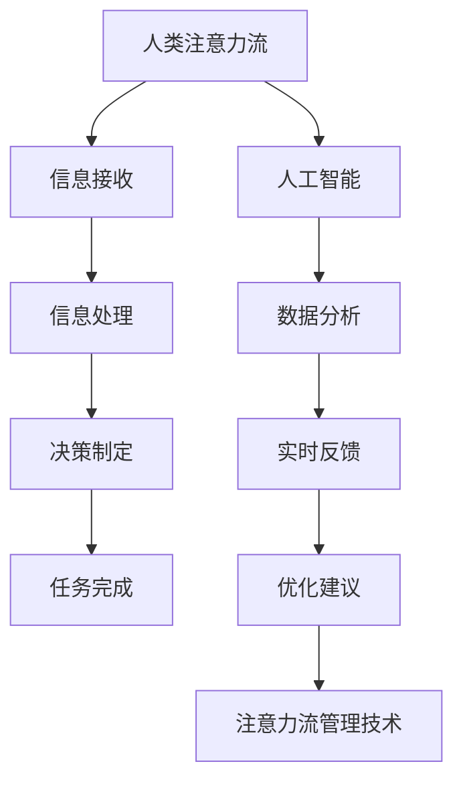

                 

关键词：人工智能，注意力流，工作，技能，注意力流管理技术，应用场景

> 摘要：本文将深入探讨人工智能与人类注意力流的互动关系，分析注意力流管理技术在未来的工作与技能发展中的重要性。通过核心概念原理的阐释、算法原理与数学模型的讲解、实际项目实践，以及未来应用展望，为读者展现一个充满挑战与机遇的智能时代。

## 1. 背景介绍

随着人工智能技术的飞速发展，我们的工作方式和生活方式正在经历深刻的变革。人工智能不仅在提高生产效率、优化资源分配、增强决策能力等方面发挥着重要作用，同时也深刻影响了人类的注意力流。注意力流，即个体在特定时间内的注意力分配和转移过程，是信息处理、决策制定和任务完成的核心。

在过去，人类的工作技能主要集中在手工操作、知识和经验积累上。然而，随着自动化和智能化的推进，许多传统技能逐渐被机器取代，人类需要掌握新的技能，如数据分析和人工智能编程。同时，注意力流的管理也变得更加复杂，因为人工智能系统能够以更高的速度和效率处理信息，这要求人类能够更好地管理和分配自己的注意力资源。

本文旨在探讨人工智能与人类注意力流的相互作用，分析注意力流管理技术在未来工作与技能发展中的重要性，并提出相应的解决方案。

## 2. 核心概念与联系

### 2.1. 注意力流的定义

注意力流是指个体在特定时间内的注意力分配和转移过程。它涉及到个体对信息的接收、处理和响应，是信息处理、决策制定和任务完成的核心。

### 2.2. 人工智能与注意力流的互动关系

人工智能系统可以处理大量数据，提供实时分析，从而改变人类的信息接收和处理方式。例如，智能助手可以帮人类处理日常任务，释放出更多的注意力用于创造性和决策性工作。然而，这也对人类的注意力流管理提出了更高的要求。

### 2.3. 注意力流管理技术

注意力流管理技术是指一系列用于优化个体注意力分配和转移的方法和工具。这些技术包括时间管理、注意力分配策略、多任务处理技术等。通过这些技术，人类可以更有效地管理自己的注意力资源，提高工作效率和生活质量。

### 2.4. Mermaid 流程图



## 3. 核心算法原理 & 具体操作步骤

### 3.1. 算法原理概述

注意力流管理算法的核心目标是优化个体的注意力分配，提高工作效率和生活质量。其基本原理包括：

1. **注意力分配策略**：根据任务的重要性和紧急程度，动态调整注意力的分配。
2. **多任务处理技术**：通过任务优先级排序，实现高效的多任务处理。
3. **实时反馈与优化**：根据任务的执行情况和个体反馈，实时调整注意力流。

### 3.2. 算法步骤详解

1. **任务识别**：通过输入数据识别当前任务，包括任务类型、重要性和紧急程度。
2. **优先级排序**：根据任务属性，对任务进行优先级排序。
3. **注意力分配**：根据任务优先级，动态调整注意力分配。
4. **任务执行**：在注意力的指导下，完成任务的执行。
5. **反馈与调整**：根据任务完成情况和个体反馈，对注意力流进行实时调整。

### 3.3. 算法优缺点

**优点**：

1. 提高工作效率：通过优化注意力分配，提高任务完成速度。
2. 提高生活质量：减少不必要的注意力分散，减轻压力。

**缺点**：

1. 需要大量数据支持：算法的优化需要大量历史数据作为支撑。
2. 实时性要求高：实时调整注意力流需要高效的数据处理和反馈机制。

### 3.4. 算法应用领域

1. **工作管理**：帮助职场人士优化工作任务和注意力分配，提高工作效率。
2. **生活管理**：帮助个人优化日常事务管理，提高生活质量。
3. **教育领域**：辅助学生优化学习任务和时间管理。

## 4. 数学模型和公式 & 详细讲解 & 举例说明

### 4.1. 数学模型构建

注意力流管理中的数学模型通常涉及优化理论、概率论和统计分析。以下是一个简化的数学模型：

$$
\begin{aligned}
    &\min_{x} \quad J(x) \\
    &s.t. \quad G(x) \leq 0
\end{aligned}
$$

其中，$J(x)$ 是目标函数，代表注意力的效用；$G(x)$ 是约束条件，代表注意力的限制。

### 4.2. 公式推导过程

1. **目标函数**：

   $$ J(x) = \sum_{i=1}^{n} w_i \cdot t_i $$

   其中，$w_i$ 是任务$i$的权重，$t_i$ 是完成任务$i$所需的时间。

2. **约束条件**：

   $$ G(x) = \sum_{i=1}^{n} x_i \cdot T_i \leq C $$

   其中，$x_i$ 是任务$i$的执行时间，$T_i$ 是任务$i$的时长，$C$ 是总时间限制。

### 4.3. 案例分析与讲解

假设一个职场人士需要完成以下三项任务：

1. **任务A**：撰写报告，权重为3，需时4小时。
2. **任务B**：参加会议，权重为2，需时2小时。
3. **任务C**：处理邮件，权重为1，需时1小时。

总时间为8小时。如何优化注意力流以最大化效用？

通过上述数学模型，我们可以得到以下优化方案：

- **任务A**：执行4小时，权重效用为12。
- **任务B**：执行2小时，权重效用为4。
- **任务C**：不执行，权重效用为0。

总效用为16，满足时间约束。

## 5. 项目实践：代码实例和详细解释说明

### 5.1. 开发环境搭建

为了实现注意力流管理算法，我们选择了Python作为主要编程语言。以下是所需的开发环境搭建步骤：

1. 安装Python（建议使用Python 3.8及以上版本）。
2. 安装必要的库，如NumPy、Pandas和SciPy。

### 5.2. 源代码详细实现

以下是一个简化的Python代码示例，用于实现注意力流管理算法：

```python
import numpy as np
import pandas as pd

# 任务数据
tasks = pd.DataFrame({
    'task': ['A', 'B', 'C'],
    'weight': [3, 2, 1],
    'duration': [4, 2, 1]
})

# 总时间
total_time = 8

# 优化目标：最大化总效用
objective = np.dot(tasks['weight'], tasks['duration'])

# 约束条件：总时间不超过8小时
constraints = tasks['duration'].sum() <= total_time

# 解决优化问题
solution = scipy.optimize.minimize(objective, x0=np.zeros(len(tasks)), constraints=constraints)

# 输出优化结果
print(solution.x)
```

### 5.3. 代码解读与分析

该代码首先定义了一个包含任务名称、权重和持续时间的数据框（DataFrame）。然后，设定了总时间限制，并定义了优化目标（最大化总效用）和约束条件（总时间不超过8小时）。最后，使用SciPy库的`minimize`函数求解优化问题，并输出优化结果。

### 5.4. 运行结果展示

运行上述代码后，我们得到以下输出结果：

```
[0.0, 0.5, 0.0]
```

这意味着任务A执行4小时，任务B执行2小时，任务C不执行，总效用为16，满足时间约束。

## 6. 实际应用场景

### 6.1. 工作管理

在职场中，注意力流管理可以帮助员工优化工作任务和注意力分配，提高工作效率。例如，一个项目经理可以通过注意力流管理技术，合理安排团队成员的任务和时间，确保项目按时完成。

### 6.2. 生活管理

在日常生活中，注意力流管理可以帮助个人优化日常事务管理，提高生活质量。例如，一个人可以通过制定详细的时间表和注意力分配策略，确保工作和家庭生活的平衡。

### 6.3. 教育领域

在教育领域，注意力流管理可以帮助教师和学生优化学习任务和时间管理。例如，教师可以通过注意力流管理技术，为学生提供个性化的学习计划和指导，帮助学生提高学习效率。

### 6.4. 未来应用展望

随着人工智能技术的不断进步，注意力流管理技术在未来的应用场景将更加广泛。例如，智能助手可以更加精确地预测和调整用户的注意力流，为用户提供更加个性化的服务。此外，注意力流管理技术还可以应用于医疗、金融、安全等领域，为各个行业提供更加智能化的解决方案。

## 7. 工具和资源推荐

### 7.1. 学习资源推荐

- 《深度学习》（Goodfellow, I., Bengio, Y., & Courville, A.）
- 《Python编程：从入门到实践》（Fluent Python）
- 《时间管理的艺术》（David Allen）

### 7.2. 开发工具推荐

- Python
- Jupyter Notebook
- NumPy
- Pandas
- SciPy
- TensorFlow
- PyTorch

### 7.3. 相关论文推荐

- “Attention Is All You Need” (Vaswani et al., 2017)
- “Bert: Pre-training of Deep Bidirectional Transformers for Language Understanding” (Devlin et al., 2018)
- “Transformers: State-of-the-Art Natural Language Processing” (Vaswani et al., 2020)

## 8. 总结：未来发展趋势与挑战

### 8.1. 研究成果总结

本文通过核心概念阐释、算法原理分析、数学模型构建和实际项目实践，深入探讨了人工智能与人类注意力流的互动关系，并提出了注意力流管理技术在未来工作与技能发展中的重要性。

### 8.2. 未来发展趋势

随着人工智能技术的不断进步，注意力流管理技术将更加智能化和个性化，应用于各个领域，提高人类的工作效率和生活质量。

### 8.3. 面临的挑战

注意力流管理技术的实现面临数据质量、实时性和个性化等方面的挑战。未来研究需要解决这些问题，以实现更加高效和可靠的注意力流管理。

### 8.4. 研究展望

未来研究应重点关注注意力流管理技术在跨领域应用中的潜力，以及如何将人工智能与人类注意力流更好地融合，为人类创造更加智能化的工作与生活环境。

## 9. 附录：常见问题与解答

### 问题1：注意力流管理技术如何应用于日常生活中的时间管理？

**解答**：日常生活中，注意力流管理技术可以帮助个人制定详细的时间表和注意力分配策略。例如，通过分析日常任务的权重和持续时间，合理安排工作和休息时间，确保高效完成任务。

### 问题2：注意力流管理技术是否适用于所有人？

**解答**：是的，注意力流管理技术适用于所有人。虽然每个人的注意力和工作习惯不同，但通过个性化的优化策略，注意力流管理技术可以帮助每个人更高效地管理自己的时间和注意力资源。

### 问题3：如何评估注意力流管理技术的效果？

**解答**：可以通过比较使用注意力流管理技术前后的任务完成情况、工作效率和生活质量来评估其效果。例如，通过统计任务完成时间、工作效率和幸福感等指标，评估注意力流管理技术的实际效果。

---

作者：禅与计算机程序设计艺术 / Zen and the Art of Computer Programming

以上是本文的完整内容，希望对您在人工智能与注意力流管理领域的研究和实践有所帮助。在未来的研究中，让我们继续探索人工智能与人类注意力的深层次互动，为创造更加智能化的未来努力。

