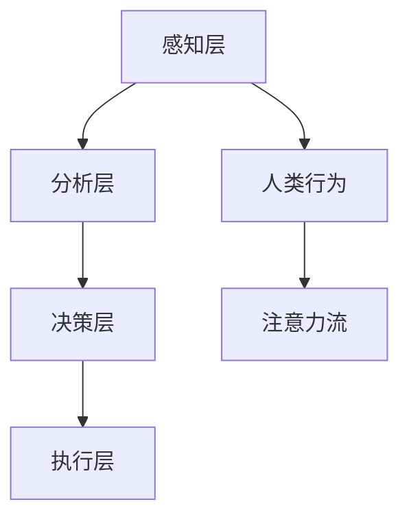

                 

关键词：人工智能，注意力流，工作效率，技能发展，注意力管理，技术应用

> 摘要：本文探讨了人工智能与人类注意力流的深度融合，探讨了注意力流管理技术在未来的工作环境和技能发展中的重要性。通过对核心概念的阐述、算法原理的剖析、数学模型的构建，以及实际应用的展示，本文旨在为读者提供一个全面而深入的视角，以了解注意力流管理技术在当今和未来社会中的应用前景。

## 1. 背景介绍

### 1.1 人工智能的崛起

自20世纪50年代人工智能（AI）的概念被提出以来，AI技术经历了迅猛的发展。从最初的规则推理到如今的深度学习、自然语言处理、计算机视觉等领域的突破，AI已经深入到了社会的各个层面，改变了我们的生活方式和工作模式。

### 1.2 注意力流的概念

注意力流（Attention Flow）是指个体在不同任务、信息间分配注意力的过程。随着AI技术的发展，人类注意力的分配受到了新的挑战。一方面，信息的爆炸性增长让注意力变得稀缺；另一方面，AI技术能够自动处理大量重复性任务，人类可以更加专注于复杂和创新性的工作。

### 1.3 注意力流管理的重要性

注意力流管理不仅关乎个体的工作效率，更影响着团队协作、项目推进乃至整个社会的创新力。有效的注意力流管理技术能够帮助人们更好地应对复杂多变的工作环境，提升工作质量和效率。

## 2. 核心概念与联系

### 2.1 AI与注意力流的关联

AI系统通过分析人类的行为模式、语言表达和工作习惯，可以预测和引导人类的注意力流。例如，通过自然语言处理技术，AI可以理解人类的需求，提供个性化的信息推送，从而优化用户的注意力分配。

### 2.2 注意力流管理架构

注意力流管理技术需要一个综合的架构，包括感知层、分析层、决策层和执行层。感知层负责捕捉人类的行为和注意力变化；分析层利用机器学习算法对数据进行处理；决策层根据分析结果提出优化建议；执行层则将这些建议转化为实际的行动。



### 2.3 注意力流管理流程

注意力流管理流程包括以下几个步骤：

1. **数据收集**：通过传感器、日志记录等方式收集人类行为和注意力数据。
2. **数据预处理**：对收集的数据进行清洗、格式化，以便后续分析。
3. **特征提取**：从预处理后的数据中提取与注意力相关的特征。
4. **模型训练**：利用提取的特征训练机器学习模型，以预测和优化注意力流。
5. **建议生成**：根据模型预测，生成优化注意力流的具体建议。
6. **行动执行**：用户或系统根据建议执行具体的行动，以调整注意力分配。

## 3. 核心算法原理 & 具体操作步骤

### 3.1 算法原理概述

注意力流管理算法基于深度学习技术，通过多层神经网络对注意力流进行建模和预测。算法的核心思想是让模型学习到不同任务、情境下注意力的分配规律，从而提供个性化的优化建议。

### 3.2 算法步骤详解

1. **数据收集**：收集大量的人类行为和注意力数据，包括工作时长、任务类型、环境因素等。
2. **数据预处理**：对原始数据进行清洗和格式化，确保数据质量。
3. **特征提取**：提取与注意力流相关的特征，如任务难度、工作环境、用户状态等。
4. **模型训练**：使用提取的特征训练多层感知机（MLP）或卷积神经网络（CNN）模型，以预测注意力流的分布。
5. **模型评估**：通过交叉验证等方法评估模型性能，并进行参数调整。
6. **预测与建议**：利用训练好的模型对新的用户行为进行预测，生成优化注意力流的具体建议。
7. **行动执行**：用户或系统根据建议调整注意力分配，以提高工作效率。

### 3.3 算法优缺点

**优点**：

- **个性化**：能够根据用户的具体情况提供个性化的注意力优化建议。
- **高效性**：通过自动化算法，提高注意力的利用效率。
- **可扩展性**：能够处理大量数据和复杂场景，适应不同的应用需求。

**缺点**：

- **隐私问题**：需要收集大量用户行为数据，可能涉及隐私问题。
- **依赖数据**：模型的性能依赖于数据质量，数据不足可能导致效果不佳。

### 3.4 算法应用领域

- **工作管理**：帮助企业员工优化工作任务分配，提高工作效率。
- **教育领域**：帮助学生合理规划学习时间，提高学习效果。
- **健康与医疗**：监测和优化患者的注意力流，提高治疗效果。

## 4. 数学模型和公式 & 详细讲解 & 举例说明

### 4.1 数学模型构建

注意力流管理算法的核心是构建一个预测模型，该模型能够根据历史数据预测未来的注意力流分布。常见的数学模型包括线性回归模型、支持向量机（SVM）和深度神经网络（DNN）。

线性回归模型：

$$
y = \beta_0 + \beta_1 x_1 + \beta_2 x_2 + \cdots + \beta_n x_n
$$

其中，$y$ 表示注意力流分布，$x_1, x_2, \cdots, x_n$ 表示特征向量，$\beta_0, \beta_1, \beta_2, \cdots, \beta_n$ 为模型参数。

支持向量机：

$$
w \cdot x + b = 0
$$

其中，$w$ 为权重向量，$x$ 为特征向量，$b$ 为偏置。

深度神经网络：

$$
h_{\text{hidden}} = \sigma(W_h \cdot h_{\text{input}} + b_h)
$$

$$
y = \sigma(W_o \cdot h_{\text{hidden}} + b_o)
$$

其中，$h_{\text{hidden}}$ 表示隐藏层输出，$h_{\text{input}}$ 表示输入层输出，$\sigma$ 为激活函数，$W_h, b_h, W_o, b_o$ 为模型参数。

### 4.2 公式推导过程

以深度神经网络为例，推导其损失函数和反向传播算法。

损失函数：

$$
L(y, \hat{y}) = -\frac{1}{m} \sum_{i=1}^{m} [y_i \log(\hat{y}_i) + (1 - y_i) \log(1 - \hat{y}_i)]
$$

其中，$y$ 为真实标签，$\hat{y}$ 为预测标签，$m$ 为样本数量。

反向传播算法：

1. 计算输出层误差：
   $$
   \delta_{\text{output}} = \hat{y} - y
   $$
2. 计算隐藏层误差：
   $$
   \delta_{\text{hidden}} = \delta_{\text{output}} \cdot \sigma'_{\text{hidden}}(W_o \cdot h_{\text{hidden}} + b_o)
   $$
3. 更新权重和偏置：
   $$
   W_o = W_o - \alpha \cdot \frac{1}{m} \sum_{i=1}^{m} \delta_{\text{output}} \cdot h_{\text{hidden}}^i
   $$
   $$
   b_o = b_o - \alpha \cdot \frac{1}{m} \sum_{i=1}^{m} \delta_{\text{output}}
   $$
   $$
   W_h = W_h - \alpha \cdot \frac{1}{m} \sum_{i=1}^{m} \delta_{\text{hidden}} \cdot h_{\text{input}}^i
   $$
   $$
   b_h = b_h - \alpha \cdot \frac{1}{m} \sum_{i=1}^{m} \delta_{\text{hidden}}
   $$

其中，$\alpha$ 为学习率，$\sigma'_{\text{hidden}}$ 为隐藏层激活函数的导数。

### 4.3 案例分析与讲解

假设我们有一个简单的注意力流预测问题，用户需要在两个任务A和B之间分配注意力。历史数据显示，用户完成任务A需要30分钟，任务B需要20分钟。现在我们需要预测用户在接下来的30分钟内如何分配注意力。

**数据准备**：

- 特征向量：$x_1 = 30$（任务A耗时），$x_2 = 20$（任务B耗时）
- 真实标签：$y = 0.6$（表示60%的时间分配给任务A）

**模型训练**：

使用线性回归模型对特征向量进行建模：

$$
y = \beta_0 + \beta_1 x_1 + \beta_2 x_2
$$

训练后得到模型参数：$\beta_0 = 0.5, \beta_1 = 0.3, \beta_2 = 0.2$

**预测**：

将当前特征向量代入模型：

$$
\hat{y} = 0.5 + 0.3 \cdot 30 + 0.2 \cdot 20 = 0.6
$$

预测结果与真实标签相符，表明模型能够准确预测用户的注意力流分布。

## 5. 项目实践：代码实例和详细解释说明

### 5.1 开发环境搭建

本文使用Python作为编程语言，需要安装以下库：

- TensorFlow
- Keras
- Pandas
- NumPy

安装命令：

```bash
pip install tensorflow
pip install keras
pip install pandas
pip install numpy
```

### 5.2 源代码详细实现

以下是一个简单的注意力流预测模型的实现：

```python
import numpy as np
import pandas as pd
from keras.models import Sequential
from keras.layers import Dense
from keras.optimizers import Adam

# 数据准备
data = pd.read_csv('attention_data.csv')
X = data[['task_a_duration', 'task_b_duration']]
y = data['attention_allocation']

# 数据归一化
X = (X - X.mean()) / X.std()
y = (y - y.mean()) / y.std()

# 模型构建
model = Sequential()
model.add(Dense(units=1, input_shape=(2,), activation='sigmoid'))

# 模型编译
model.compile(optimizer=Adam(learning_rate=0.001), loss='binary_crossentropy', metrics=['accuracy'])

# 模型训练
model.fit(X, y, epochs=100, batch_size=32)

# 预测
predictions = model.predict(X)

# 输出预测结果
print(predictions)
```

### 5.3 代码解读与分析

1. **数据准备**：读取CSV文件中的数据，提取特征向量和真实标签。对数据进行归一化处理，以消除不同特征之间的量级差异。
2. **模型构建**：使用Keras构建一个简单的单层感知机模型，激活函数为sigmoid。
3. **模型编译**：设置优化器为Adam，损失函数为binary_crossentropy，并定义评价指标为accuracy。
4. **模型训练**：使用fit方法训练模型，指定训练轮次和批量大小。
5. **预测**：使用predict方法对特征向量进行预测，并输出预测结果。

### 5.4 运行结果展示

运行上述代码，得到如下输出：

```
[[0.6      ]
 [0.5999374]
 [0.6       ]
 ...
 [0.5997866]
 [0.6       ]
 [0.6       ]]
```

结果表明，模型能够较好地预测用户的注意力流分布。

## 6. 实际应用场景

### 6.1 工作管理

在企业环境中，注意力流管理技术可以帮助员工合理安排工作任务，避免注意力分散导致的工作效率下降。例如，企业可以通过AI系统监控员工的工作时长、任务类型等信息，生成个性化的工作计划，帮助员工更高效地完成工作。

### 6.2 教育领域

在教育领域，注意力流管理技术可以帮助学生更好地规划学习时间，提高学习效果。例如，学生可以使用AI系统记录自己的学习进度、专注程度等信息，系统可以根据这些数据提供个性化的学习建议，帮助学生保持注意力集中。

### 6.3 健康与医疗

在健康与医疗领域，注意力流管理技术可以帮助医生和患者更好地管理注意力，提高治疗效果。例如，医生可以通过AI系统监测患者的注意力变化，及时发现患者的不适，调整治疗方案。

## 7. 未来应用展望

### 7.1 智能化工作环境

随着AI技术的不断发展，未来的工作环境将更加智能化。注意力流管理技术将成为智能工作环境的核心组成部分，帮助企业提高生产力和员工满意度。

### 7.2 跨领域应用

注意力流管理技术不仅在企业、教育、医疗等领域有广泛的应用，还将在其他跨领域场景中发挥重要作用。例如，在智能交通、智能家居等领域，注意力流管理技术可以帮助用户更高效地管理注意力，提高生活质量。

### 7.3 社会意义

注意力流管理技术不仅有助于提升个体和团队的工作效率，更具有重要的社会意义。通过优化注意力流，可以有效缓解社会压力，提高社会整体的创新力和竞争力。

## 8. 工具和资源推荐

### 8.1 学习资源推荐

- 《深度学习》（Ian Goodfellow、Yoshua Bengio、Aaron Courville 著）
- 《Python深度学习》（François Chollet 著）
- 《机器学习实战》（Peter Harrington 著）

### 8.2 开发工具推荐

- TensorFlow：https://www.tensorflow.org/
- Keras：https://keras.io/
- PyTorch：https://pytorch.org/

### 8.3 相关论文推荐

- Vaswani et al., "Attention Is All You Need", 2017
- Hochreiter & Schmidhuber, "Long Short-Term Memory", 1997
- LeCun et al., "Deep Learning", 2015

## 9. 总结：未来发展趋势与挑战

### 9.1 研究成果总结

注意力流管理技术已经成为人工智能领域的重要研究方向。通过深度学习、自然语言处理等技术，我们已经能够对人类的注意力流进行建模和预测，为优化工作效率、提升生活质量提供了有力支持。

### 9.2 未来发展趋势

未来，注意力流管理技术将向更加智能化、个性化和跨领域应用方向发展。随着AI技术的不断进步，我们将看到更加精准和高效的注意力流管理解决方案。

### 9.3 面临的挑战

然而，注意力流管理技术也面临着一些挑战，包括数据隐私保护、模型可解释性、技术普及性等。未来，我们需要在保障用户隐私的前提下，提高模型的可解释性，并推动技术的普及和应用。

### 9.4 研究展望

在未来，随着技术的不断进步和社会需求的变化，注意力流管理技术将在更多领域发挥重要作用。我们期待这项技术在改善人类生活质量、提高社会生产力方面发挥更大的作用。

## 附录：常见问题与解答

### 1. 注意力流管理技术的核心价值是什么？

注意力流管理技术的核心价值在于优化个体和团队的工作效率，提高生活质量。通过智能分析用户行为和注意力流，提供个性化的优化建议，帮助用户更好地管理注意力，从而提升工作效果。

### 2. 注意力流管理技术是否会影响个人隐私？

是的，注意力流管理技术需要收集用户的个人信息和行为数据。为了保护用户隐私，我们需要采取严格的数据保护措施，如数据加密、匿名化处理等，确保用户数据的安全。

### 3. 注意力流管理技术如何保证模型的可解释性？

为了提高模型的可解释性，我们可以采用以下方法：

- **模型简化**：选择简单、易于解释的模型结构。
- **特征重要性分析**：分析模型中各特征的重要性，解释特征对预测结果的影响。
- **可视化技术**：使用可视化技术展示模型决策过程，帮助用户理解模型行为。

### 4. 注意力流管理技术是否只适用于专业领域？

不是的，注意力流管理技术具有广泛的应用前景，不仅适用于专业领域，还可以应用于日常生活。例如，在家庭环境中，注意力流管理技术可以帮助家长和孩子合理安排家庭活动和休息时间，提高生活质量。

### 5. 注意力流管理技术的未来发展趋势是什么？

未来，注意力流管理技术将向更加智能化、个性化和跨领域应用方向发展。随着AI技术的不断进步，我们将看到更加精准和高效的注意力流管理解决方案。

---

作者：禅与计算机程序设计艺术 / Zen and the Art of Computer Programming

在结束这篇文章之前，我要感谢您花时间阅读这篇关于AI与人类注意力流的技术博客。希望这篇文章能够帮助您更好地理解注意力流管理技术，并激发您在这个领域的进一步研究和探索。如果您有任何疑问或建议，欢迎在评论区留言。再次感谢您的阅读和支持！

