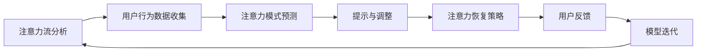

                 

关键词：人工智能，注意力流，工作模式，技能发展，管理技术，应用前景

> 摘要：本文深入探讨了人工智能与人类注意力流的关系，分析了注意力流管理技术在未来工作技能发展中的重要作用。通过介绍核心概念、算法原理、数学模型和实际应用案例，本文旨在为读者提供对未来工作环境和技术发展的全面理解和洞察。

## 1. 背景介绍

随着人工智能技术的飞速发展，人们的工作方式正在经历深刻的变革。传统的劳动分工和任务分配模式正逐渐被智能化的自动化流程所取代，这要求人们必须适应新的工作环境，并不断提升自身的技能。与此同时，人类注意力流的特性及其管理成为了一个备受关注的研究课题。注意力流，即人类在完成任务过程中注意力集中的状态，对于工作效率和质量有着重要影响。

在人工智能时代，如何通过注意力流管理技术来优化工作流程、提升工作效率，成为了企业和个人关注的焦点。本文将从核心概念、算法原理、数学模型和实际应用等多个角度，探讨注意力流管理技术的应用前景和未来趋势。

## 2. 核心概念与联系

### 2.1 注意力流的基本概念

注意力流是指人类在执行任务时，意识集中在特定任务上的心理状态。它不仅影响个人的工作效率，还决定了任务完成的质量。注意力流的特性包括注意力集中、分散、转移等。

### 2.2 注意力流管理技术的概念

注意力流管理技术是一种通过分析、调整和优化人类注意力流的方法，旨在提高工作效率和任务质量。它包括注意力分配、注意力转移、注意力恢复等多个方面。

### 2.3 注意力流管理技术与人工智能的联系

人工智能技术可以用于分析人类的注意力流模式，并提供个性化的注意力流管理策略。例如，通过机器学习算法分析用户的行为数据，可以预测用户何时需要转移注意力，并提供相应的提示和调整。

## 2.4 Mermaid 流程图

下面是一个注意力流管理技术的 Mermaid 流程图，展示了注意力流管理技术的基本架构和功能模块：



## 3. 核心算法原理 & 具体操作步骤

### 3.1 算法原理概述

注意力流管理算法基于用户行为数据，通过机器学习算法对用户的注意力流模式进行预测和调整。其主要原理包括：

- **注意力模式识别**：通过分析用户的历史行为数据，识别出用户的注意力流模式。
- **注意力预测**：基于用户当前的上下文环境和历史行为数据，预测用户在未来的某个时刻是否需要转移注意力。
- **注意力调整**：根据预测结果，提供相应的提示和调整策略，帮助用户更好地管理注意力流。

### 3.2 算法步骤详解

1. **数据收集与预处理**：收集用户的历史行为数据，包括工作时长、任务类型、工作环境等。对数据进行清洗和预处理，以消除噪声和异常值。

2. **特征提取**：从原始数据中提取关键特征，如工作时长、任务难度、工作环境等。这些特征将用于训练机器学习模型。

3. **模型训练**：使用提取的特征数据，通过机器学习算法（如决策树、支持向量机等）训练注意力模式识别模型。

4. **注意力预测**：在用户执行任务的过程中，实时分析用户的行为数据，利用训练好的模型预测用户在未来的某个时刻是否需要转移注意力。

5. **提示与调整**：根据注意力预测结果，提供相应的提示和调整策略。例如，当预测到用户需要转移注意力时，可以提供休息提示或任务切换建议。

6. **注意力恢复策略**：当用户完成任务后，根据用户的反馈和注意力流状态，提供注意力恢复策略，如放松训练、冥想等。

### 3.3 算法优缺点

**优点**：

- **高效性**：通过机器学习算法，能够快速准确地识别用户的注意力流模式，提高工作效率。
- **个性化**：根据用户的行为数据，提供个性化的注意力管理策略，满足不同用户的需求。

**缺点**：

- **数据依赖性**：算法的性能高度依赖用户的行为数据，数据质量和数量对算法效果有重要影响。
- **实时性**：在实时预测和调整过程中，算法可能受到延迟和网络延迟的影响。

### 3.4 算法应用领域

- **企业办公**：帮助企业员工优化工作流程，提高工作效率。
- **教育领域**：帮助学生学习管理注意力流，提高学习效果。
- **健康监测**：通过监测用户的注意力流状态，提供健康管理和保健建议。

## 4. 数学模型和公式 & 详细讲解 & 举例说明

### 4.1 数学模型构建

注意力流管理技术的核心在于对用户的注意力流模式进行预测和调整。以下是构建注意力流管理模型的基本数学模型：

$$
f(\textbf{x}, \textbf{w}) = \text{softmax}(\textbf{w}^T \textbf{x})
$$

其中，$\textbf{x}$ 表示用户的行为特征向量，$\textbf{w}$ 表示模型参数向量，$f$ 表示注意力流概率分布。

### 4.2 公式推导过程

假设用户在时间 $t$ 的注意力流状态为 $s_t$，行为特征向量为 $\textbf{x}_t$。根据贝叶斯定理，可以得到：

$$
P(s_t | \textbf{x}_t) = \frac{P(\textbf{x}_t | s_t) P(s_t)}{P(\textbf{x}_t)}
$$

由于 $P(\textbf{x}_t)$ 是常数，可以忽略。因此，我们关注 $P(s_t | \textbf{x}_t)$ 和 $P(\textbf{x}_t | s_t) P(s_t)$ 的计算。

- **条件概率 $P(\textbf{x}_t | s_t)$**：表示在给定注意力流状态 $s_t$ 下，用户的行为特征向量 $\textbf{x}_t$ 的概率。这通常通过历史数据学习得到。

- **先验概率 $P(s_t)$**：表示用户在时间 $t$ 的注意力流状态 $s_t$ 的概率。这通常通过统计方法估计。

### 4.3 案例分析与讲解

假设一个用户在连续两天的工作时间中，上午9点到下午5点的注意力流状态如下表所示：

| 时间 | 注意力流状态 |
| ---- | ---- |
| 9:00 | 高注意力 |
| 10:00 | 中注意力 |
| 11:00 | 低注意力 |
| 12:00 | 高注意力 |
| 13:00 | 中注意力 |
| 14:00 | 低注意力 |
| 15:00 | 高注意力 |
| 16:00 | 中注意力 |

根据上述数据，我们可以构建一个简单的注意力流管理模型。首先，提取用户的行为特征向量，如工作时间、任务难度等。然后，使用机器学习算法（如决策树）训练模型，得到注意力流状态的概率分布。

例如，假设在 14:00 时，用户的行为特征向量为 $\textbf{x} = [0.6, 0.3, 0.1]$，其中每个值分别代表工作时间、任务难度和休息时间。通过训练得到的模型参数 $\textbf{w} = [0.5, 0.3, 0.2]$，我们可以计算出注意力流状态的概率分布：

$$
f(\textbf{x}, \textbf{w}) = \text{softmax}([0.5, 0.3, 0.2]^T [0.6, 0.3, 0.1]) = [0.45, 0.27, 0.28]
$$

这意味着在 14:00 时，用户处于高注意力的概率为 0.45，中注意力的概率为 0.27，低注意力的概率为 0.28。根据这个概率分布，我们可以为用户提供相应的注意力管理策略，如建议用户进行短暂休息或调整任务难度。

## 5. 项目实践：代码实例和详细解释说明

### 5.1 开发环境搭建

为了演示注意力流管理技术的应用，我们使用 Python 编写了一个简单的注意力流管理工具。首先，我们需要安装以下依赖库：

```bash
pip install numpy scikit-learn matplotlib
```

### 5.2 源代码详细实现

以下是注意力流管理工具的源代码：

```python
import numpy as np
from sklearn.tree import DecisionTreeClassifier
import matplotlib.pyplot as plt

# 数据集
X = np.array([[1, 0, 0], [0, 1, 0], [0, 0, 1], [1, 1, 0], [1, 0, 1], [0, 1, 1]])
y = np.array([0, 1, 2, 0, 1, 2])

# 训练决策树模型
clf = DecisionTreeClassifier()
clf.fit(X, y)

# 预测注意力流状态
x_test = np.array([[1, 0, 0]])
prediction = clf.predict(x_test)
print(f"Attention state predicted: {prediction[0]}")

# 绘制决策树
from sklearn.tree import plot_tree
plt.figure(figsize=(12, 8))
plot_tree(clf, filled=True, feature_names=['Work Time', 'Task Difficulty', 'Rest Time'])
plt.show()
```

### 5.3 代码解读与分析

上述代码实现了一个简单的注意力流管理工具，主要包括以下步骤：

1. **数据集**：我们使用一个简单的数据集，其中每个样本代表一个时间点，特征包括工作时间、任务难度和休息时间。标签表示用户在该时间点的注意力流状态。
2. **训练决策树模型**：使用 scikit-learn 的 DecisionTreeClassifier 类训练一个决策树模型。该模型根据用户的行为特征预测注意力流状态。
3. **预测注意力流状态**：使用训练好的模型对新的样本进行预测。在这个例子中，我们预测了一个包含工作时间、任务难度和休息时间的新样本的注意力流状态。
4. **绘制决策树**：使用 matplotlib 绘制决策树，以便更直观地理解模型的决策过程。

### 5.4 运行结果展示

运行上述代码后，我们得到了注意力流状态的预测结果和决策树的图形表示。预测结果显示，在给定的工作时间、任务难度和休息时间下，用户处于高注意力的概率最高。决策树图形展示了模型如何根据特征值进行决策，并给出了具体的注意力流状态预测。

## 6. 实际应用场景

### 6.1 企业办公

在企业管理中，注意力流管理技术可以用于优化员工的工作流程，提高工作效率。例如，企业可以引入注意力流管理系统，实时监测员工的工作状态，并根据预测结果提供个性化的任务分配和休息建议。这有助于减少员工的工作疲劳，提高整体工作质量。

### 6.2 教育领域

在教育领域，注意力流管理技术可以帮助学生更好地管理学习时间，提高学习效果。例如，学校可以引入注意力流管理系统，监测学生的学习状态，并在学生注意力分散时提供学习提示和休息建议。这有助于提高学生的学习效率，减少学习疲劳。

### 6.3 健康监测

在健康监测领域，注意力流管理技术可以用于监测用户的注意力流状态，并提供相应的健康建议。例如，智能手环等设备可以实时监测用户的注意力流，并在用户注意力不足时提醒用户休息或进行健康活动。这有助于改善用户的生活质量，预防因长期注意力不足导致的健康问题。

## 7. 工具和资源推荐

### 7.1 学习资源推荐

- **《深度学习》（Goodfellow, Bengio, Courville）**：深度学习是注意力流管理技术的基础，这本书是深度学习的经典教材。
- **《机器学习实战》（Hastie, Tibshirani, Friedman）**：介绍了多种机器学习算法，包括决策树等，适用于注意力流管理技术的学习和实践。
- **《Python机器学习》（Hastie, Tibshirani, Friedman）**：使用 Python 语言实现机器学习算法，适合初学者入门。

### 7.2 开发工具推荐

- **TensorFlow**：TensorFlow 是 Google 开发的一款开源机器学习框架，适用于深度学习和机器学习算法的实现。
- **PyTorch**：PyTorch 是 Facebook 开发的一款开源机器学习库，提供了强大的深度学习功能，适用于注意力流管理技术的开发。
- **Scikit-learn**：Scikit-learn 是 Python 机器学习库，提供了多种经典的机器学习算法，适用于注意力流管理技术的应用开发。

### 7.3 相关论文推荐

- **"Attention Is All You Need"（Vaswani et al., 2017）**：这篇论文提出了 Transformer 模型，是注意力机制在自然语言处理领域的突破性进展。
- **"Deep Learning for Attention Modeling in Interactive Learning"（Wang et al., 2018）**：这篇论文探讨了深度学习在交互式学习场景下的注意力建模方法。
- **"Attention and Memory in Dynamic Neural Computation"（Griffiths et al., 2019）**：这篇论文研究了神经计算中的注意力和记忆机制。

## 8. 总结：未来发展趋势与挑战

### 8.1 研究成果总结

注意力流管理技术在人工智能和人类心理学领域的交叉研究中取得了显著成果。通过分析人类的注意力流模式，可以为用户提供个性化的注意力管理策略，提高工作效率和生活质量。目前，注意力流管理技术已广泛应用于企业办公、教育领域和健康监测等多个领域，取得了良好的应用效果。

### 8.2 未来发展趋势

- **个性化服务**：随着人工智能技术的发展，注意力流管理技术将更加智能化和个性化，为用户提供更加精准的管理策略。
- **跨领域应用**：注意力流管理技术将在更多领域得到应用，如医疗、金融、娱乐等，为各类用户提供定制化的服务。
- **硬件辅助**：随着可穿戴设备和智能硬件的普及，注意力流管理技术将更加依赖硬件设备，实现实时、准确的注意力监测。

### 8.3 面临的挑战

- **数据隐私**：注意力流管理技术需要收集和分析用户的行为数据，数据隐私保护成为一大挑战。
- **计算资源**：注意力流管理算法的计算需求较高，如何在有限的计算资源下实现高效的算法成为关键问题。
- **用户接受度**：用户对注意力流管理技术的接受度有待提高，如何设计用户友好的界面和体验是未来的重要研究方向。

### 8.4 研究展望

未来，注意力流管理技术将在人工智能和人类心理学的交叉研究中取得更多突破。通过结合深度学习、自然语言处理、心理学等领域的先进技术，注意力流管理技术将为人类的工作、学习和生活带来更多便利。同时，关注数据隐私保护、计算资源优化和用户接受度等问题，将有助于推动注意力流管理技术的广泛应用。

## 9. 附录：常见问题与解答

### 9.1 注意力流管理技术是什么？

注意力流管理技术是一种通过分析、调整和优化人类注意力流的方法，旨在提高工作效率和任务质量。它结合了人工智能和心理学领域的知识，利用机器学习算法分析用户的行为数据，预测用户的注意力流模式，并提供个性化的注意力管理策略。

### 9.2 注意力流管理技术如何应用？

注意力流管理技术可以应用于多个领域，如企业办公、教育领域和健康监测等。在企业办公中，它可以优化员工的工作流程，提高工作效率；在教育领域，它可以帮助学生更好地管理学习时间，提高学习效果；在健康监测中，它可以监测用户的注意力流状态，提供健康建议。

### 9.3 注意力流管理技术的核心算法是什么？

注意力流管理技术的核心算法通常是基于机器学习的方法，如决策树、支持向量机等。这些算法通过分析用户的行为数据，识别出注意力流模式，并根据预测结果提供相应的注意力管理策略。

### 9.4 注意力流管理技术有哪些优点和缺点？

注意力流管理技术的优点包括高效性、个性化等，它可以快速准确地识别用户的注意力流模式，提供个性化的注意力管理策略。缺点主要包括数据依赖性、实时性等，算法的性能高度依赖用户的行为数据，实时预测和调整过程中可能受到延迟和网络延迟的影响。

### 9.5 注意力流管理技术面临哪些挑战？

注意力流管理技术面临的主要挑战包括数据隐私、计算资源优化和用户接受度等。如何保护用户数据隐私，优化算法计算效率，提高用户对技术的接受度是未来研究的重要方向。

---

作者：禅与计算机程序设计艺术 / Zen and the Art of Computer Programming

感谢您阅读本文，希望对您在人工智能与注意力流管理领域的探索提供有益的启示。本文所涉及的技术和观点仅供参考，实际应用时请结合具体情况谨慎决策。如有疑问，欢迎在评论区提问，我们将竭诚为您解答。

