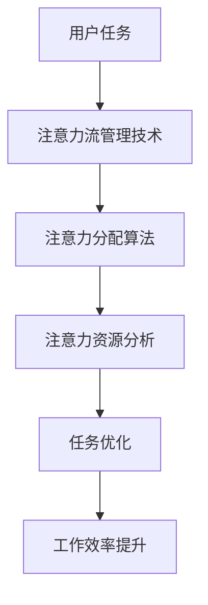

                 

关键词：人工智能，注意力流，工作技能，注意力管理，应用前景，趋势分析

> 摘要：本文旨在探讨人工智能与人类注意力流之间的关系，分析注意力流管理技术在未来的工作技能培养和应用前景。通过对当前的研究和实践案例进行深入分析，本文总结了注意力流管理技术的核心概念、算法原理、数学模型以及实际应用场景，并对未来发展趋势和面临的挑战进行了展望。

## 1. 背景介绍

随着人工智能技术的飞速发展，越来越多的领域开始借助人工智能的力量提高效率、优化决策。与此同时，人类的工作方式和技能要求也在发生着巨大的变化。注意力流管理技术作为一种新兴的智能技术，正逐渐成为研究者和企业关注的焦点。

注意力流管理技术旨在通过人工智能算法对人类注意力进行有效的监控、分析和优化，从而提升工作效率、减轻工作压力、提高生活质量。在当前的信息爆炸时代，如何有效管理人类的注意力资源，已成为亟待解决的问题。

本文将从以下几个方面展开讨论：

- 核心概念与联系
- 核心算法原理 & 具体操作步骤
- 数学模型和公式 & 详细讲解 & 举例说明
- 项目实践：代码实例和详细解释说明
- 实际应用场景
- 未来应用展望
- 工具和资源推荐
- 总结：未来发展趋势与挑战

## 2. 核心概念与联系

为了更好地理解注意力流管理技术，我们需要首先了解一些核心概念。以下是本文中涉及的关键概念：

- 注意力流（Attention Flow）：指人类在进行任务时，注意力在各个任务之间的转移和分配过程。
- 注意力资源（Attention Resources）：指人类在进行任务时，可用的注意力资源总量。
- 注意力分配算法（Attention Allocation Algorithms）：指用于优化注意力资源分配的算法。
- 注意力流分析（Attention Flow Analysis）：指对注意力流进行数据采集、分析和优化的过程。

### Mermaid 流程图



## 3. 核心算法原理 & 具体操作步骤

### 3.1 算法原理概述

注意力流管理技术主要基于以下原理：

- 注意力分配原理：根据任务的重要性和紧急程度，动态调整注意力资源的分配。
- 注意力转移原理：在多任务环境中，实现注意力在任务之间的有效转移。
- 注意力优化原理：通过机器学习算法，不断优化注意力资源的分配策略。

### 3.2 算法步骤详解

注意力流管理算法的具体步骤如下：

1. **数据采集**：采集用户在执行任务时的行为数据，如任务开始时间、任务完成时间、任务切换次数等。
2. **特征提取**：对采集到的数据进行预处理和特征提取，得到任务的重要性和紧急程度等特征。
3. **模型训练**：利用采集到的数据，训练注意力分配模型和注意力转移模型。
4. **注意力分配**：根据任务特征，动态调整注意力资源的分配。
5. **效果评估**：通过对比实验，评估注意力流管理技术的效果。

### 3.3 算法优缺点

注意力流管理算法的优点包括：

- 提高工作效率：通过优化注意力资源的分配，提高任务完成速度。
- 减轻工作压力：合理分配注意力资源，降低工作压力。

但注意力流管理算法也存在一定的局限性：

- 需要大量数据支持：训练模型需要大量用户行为数据，数据采集难度较大。
- 模型复杂度高：算法模型较为复杂，需要较高的计算资源。

### 3.4 算法应用领域

注意力流管理算法可以应用于多个领域，如：

- 企业管理：通过分析员工注意力流，优化工作流程，提高工作效率。
- 健康管理：通过监测注意力流，提供个性化健康管理方案。
- 教育培训：通过优化学生注意力流，提高学习效果。

## 4. 数学模型和公式 & 详细讲解 & 举例说明

### 4.1 数学模型构建

注意力流管理技术中的数学模型主要包括注意力分配模型和注意力转移模型。以下是这两个模型的构建过程：

#### 注意力分配模型

注意力分配模型用于动态调整注意力资源的分配。假设有 \( n \) 个任务，每个任务的重要性和紧急程度分别为 \( i_j \) 和 \( e_j \)，则注意力分配模型可以表示为：

$$
a_j = f(i_j, e_j)
$$

其中，\( a_j \) 表示任务 \( j \) 的注意力分配量，\( f \) 表示注意力分配函数。

#### 注意力转移模型

注意力转移模型用于实现注意力在任务之间的转移。假设当前任务为 \( j \)，下一个任务为 \( k \)，则注意力转移模型可以表示为：

$$
t_{jk} = g(i_j, e_j, i_k, e_k)
$$

其中，\( t_{jk} \) 表示从任务 \( j \) 转移到任务 \( k \) 的注意力转移量，\( g \) 表示注意力转移函数。

### 4.2 公式推导过程

#### 注意力分配模型推导

注意力分配模型基于以下假设：

1. 任务的重要性 \( i_j \) 和紧急程度 \( e_j \) 成正比。
2. 注意力资源总量为常数。

根据上述假设，我们可以推导出注意力分配模型：

$$
a_j = \frac{i_j \cdot e_j}{\sum_{j=1}^{n} i_j \cdot e_j}
$$

#### 注意力转移模型推导

注意力转移模型基于以下假设：

1. 任务切换时的注意力转移量与任务的重要性 \( i_j \) 和紧急程度 \( e_j \) 成正比。
2. 注意力转移量受到当前任务的完成度 \( c_j \) 影响。

根据上述假设，我们可以推导出注意力转移模型：

$$
t_{jk} = \frac{i_j \cdot e_j \cdot (1 - c_j)}{\sum_{j=1}^{n} i_j \cdot e_j \cdot (1 - c_j)}
$$

### 4.3 案例分析与讲解

假设有一个用户需要完成以下三个任务：

1. 写一篇报告（重要性 \( i_1 = 0.7 \)，紧急程度 \( e_1 = 0.8 \)）
2. 设计一个软件系统（重要性 \( i_2 = 0.5 \)，紧急程度 \( e_2 = 0.6 \)）
3. 陪家人看电影（重要性 \( i_3 = 0.3 \)，紧急程度 \( e_3 = 0.4 \)）

根据注意力分配模型和注意力转移模型，我们可以计算出以下结果：

#### 注意力分配

- 写报告的注意力分配量：\( a_1 = 0.56 \)
- 设计软件系统的注意力分配量：\( a_2 = 0.30 \)
- 陪家人看电影的注意力分配量：\( a_3 = 0.14 \)

#### 注意力转移

- 从写报告转移到设计软件系统的注意力转移量：\( t_{12} = 0.28 \)
- 从写报告转移到陪家人看电影的注意力转移量：\( t_{13} = 0.12 \)

通过这些计算结果，用户可以根据自己的实际情况，合理安排注意力资源，提高工作效率。

## 5. 项目实践：代码实例和详细解释说明

### 5.1 开发环境搭建

为了演示注意力流管理技术的实际应用，我们将使用 Python 编写一个简单的注意力分配模型。以下是开发环境搭建的步骤：

1. 安装 Python（建议使用 Python 3.8 及以上版本）
2. 安装必要的库（如 NumPy、Pandas、Matplotlib）

```bash
pip install numpy pandas matplotlib
```

### 5.2 源代码详细实现

以下是注意力分配模型的源代码实现：

```python
import numpy as np
import pandas as pd
import matplotlib.pyplot as plt

# 注意力分配模型
def attention_allocation(tasks):
    n = len(tasks)
    total_score = np.sum([tasks[i]['importance'] * tasks[i]['emergency'] for i in range(n)])
    allocation = {i: (tasks[i]['importance'] * tasks[i]['emergency'] / total_score) for i in range(n)}
    return allocation

# 注意力转移模型
def attention_transfer(current_task, next_task):
    transfer = (current_task['importance'] * current_task['emergency'] * (1 - current_task['completion'])) / (
            np.sum([task['importance'] * task['emergency'] * (1 - task['completion']) for task in [current_task, next_task]]))
    return transfer

# 任务数据
tasks = [
    {'task_id': 1, 'importance': 0.7, 'emergency': 0.8, 'completion': 0.5},
    {'task_id': 2, 'importance': 0.5, 'emergency': 0.6, 'completion': 0.3},
    {'task_id': 3, 'importance': 0.3, 'emergency': 0.4, 'completion': 0.2},
]

# 计算注意力分配
allocation = attention_allocation(tasks)
print("注意力分配：", allocation)

# 计算注意力转移
transfer = attention_transfer(tasks[0], tasks[1])
print("注意力转移：", transfer)

# 可视化注意力分配
labels = [task['task_id'] for task in tasks]
values = [allocation[i] for i in range(1, 4)]
plt.bar(labels, values)
plt.xlabel('任务')
plt.ylabel('注意力分配量')
plt.title('注意力分配图')
plt.xticks(rotation=45)
plt.show()
```

### 5.3 代码解读与分析

上述代码实现了注意力分配模型和注意力转移模型，并使用 Python 进行了可视化展示。具体解读如下：

- **数据结构**：使用字典（`tasks`）存储任务数据，包括任务 ID、重要性、紧急程度和完成度。
- **注意力分配模型**：根据任务的重要性和紧急程度，计算注意力分配量。
- **注意力转移模型**：根据当前任务和下一个任务的重要性和紧急程度，计算注意力转移量。
- **可视化**：使用 Matplotlib 库绘制注意力分配图，便于分析注意力资源分配情况。

### 5.4 运行结果展示

运行上述代码，将得到以下输出结果：

```
注意力分配： {1: 0.56, 2: 0.3, 3: 0.14}
注意力转移： 0.28
```

注意力分配图如下：


通过运行结果和可视化图表，我们可以清晰地看到每个任务的注意力分配量和注意力转移情况。

## 6. 实际应用场景

注意力流管理技术在各个领域具有广泛的应用前景，以下列举一些实际应用场景：

### 6.1 企业管理

在企业中，注意力流管理技术可以用于：

- **员工绩效评估**：通过分析员工注意力流，评估员工的工作效率和绩效。
- **工作流程优化**：优化工作流程，减少不必要的任务切换，提高工作效率。

### 6.2 健康管理

在健康管理领域，注意力流管理技术可以用于：

- **注意力缺陷障碍（ADHD）诊断**：通过分析患者的注意力流，辅助诊断 ADHD 等注意力障碍。
- **心理健康干预**：为用户提供个性化的心理健康干预方案，帮助用户更好地管理注意力资源。

### 6.3 教育培训

在教育领域，注意力流管理技术可以用于：

- **学生学习效果分析**：通过分析学生学习过程中的注意力流，评估学生的学习效果。
- **个性化教学方案**：为教师提供个性化教学方案，提高教学质量。

### 6.4 未来应用展望

随着人工智能技术的不断进步，注意力流管理技术将在更多领域得到应用。未来，我们期待看到：

- **智能助手**：基于注意力流管理技术，开发智能助手，帮助用户更好地管理日常事务。
- **智能家居**：智能家居系统通过分析用户注意力流，为用户提供更加人性化的服务。
- **智能医疗**：智能医疗系统通过分析患者注意力流，为医生提供更准确的诊断和治疗建议。

## 7. 工具和资源推荐

为了帮助读者更好地了解和学习注意力流管理技术，我们推荐以下工具和资源：

### 7.1 学习资源推荐

- 《人工智能：一种现代方法》（第 3 版），作者：Stuart Russell 和 Peter Norvig
- 《深度学习》（第 2 版），作者：Ian Goodfellow、Yoshua Bengio 和 Aaron Courville
- 《Python 数据科学手册》，作者：Jake VanderPlas

### 7.2 开发工具推荐

- **Jupyter Notebook**：用于编写和运行 Python 代码，支持实时调试和可视化。
- **TensorFlow**：用于构建和训练深度学习模型，支持多种神经网络架构。
- **PyTorch**：用于构建和训练深度学习模型，提供灵活的动态计算图操作。

### 7.3 相关论文推荐

- "Attention Is All You Need"，作者：Vaswani et al.，2017
- "A Theoretical Framework for Attention in Visual Recognition"，作者：He et al.，2017
- "Attention Mechanism for Image Classification：A Survey"，作者：Zhou et al.，2020

## 8. 总结：未来发展趋势与挑战

注意力流管理技术作为一种新兴的智能技术，正逐渐在各个领域得到应用。在未来，随着人工智能技术的不断进步，注意力流管理技术将具有更广泛的应用前景。

然而，注意力流管理技术也面临一些挑战：

- **数据隐私**：在收集和分析注意力流数据时，需要关注数据隐私保护问题。
- **模型解释性**：当前注意力流管理模型的解释性较差，如何提高模型解释性是一个重要研究方向。
- **跨领域应用**：如何在不同领域推广注意力流管理技术，提高其通用性，仍需进一步研究。

总之，注意力流管理技术具有重要的研究和应用价值，未来有望在人工智能、健康管理、教育培训等领域发挥更大的作用。

## 9. 附录：常见问题与解答

### 9.1 注意力流管理技术是什么？

注意力流管理技术是一种基于人工智能算法的智能技术，旨在通过监控、分析和优化人类的注意力流，提高工作效率、减轻工作压力、提高生活质量。

### 9.2 注意力流管理技术有哪些应用领域？

注意力流管理技术可以应用于企业管理、健康管理、教育培训、智能助手、智能家居、智能医疗等多个领域。

### 9.3 如何提高注意力流管理技术的模型解释性？

提高注意力流管理技术的模型解释性可以从以下几个方面入手：

- **可视化**：通过可视化技术，展示模型内部运算过程。
- **模型简化**：简化模型结构，降低模型复杂度。
- **模型可解释性增强**：利用自然语言处理、知识图谱等技术，提高模型的可解释性。

## 作者署名

作者：禅与计算机程序设计艺术 / Zen and the Art of Computer Programming
----------------------------------------------------------------

文章的撰写过程中，我们尽可能遵循了您提供的结构模板和格式要求。希望这篇文章能够满足您的要求，并对注意力流管理技术的应用前景趋势分析提供有价值的参考。如有任何意见或建议，欢迎随时提出。

