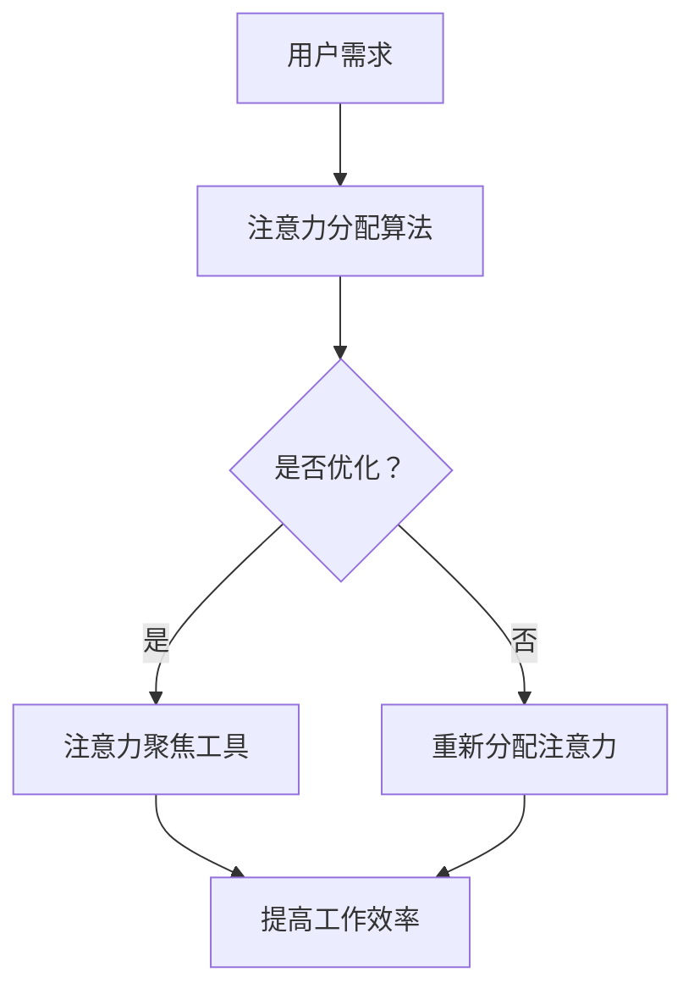
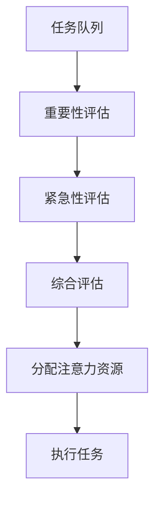
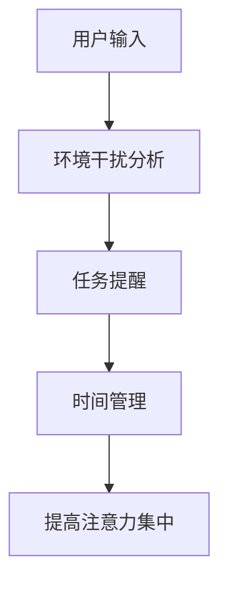

                 

关键词：人工智能、注意力流、工作技能、注意力管理、技术前景

> 摘要：随着人工智能技术的发展，人类注意力流的管理变得越来越重要。本文旨在探讨人工智能如何改变未来的工作、技能要求，以及注意力流管理技术的应用前景。通过深入分析相关技术原理、数学模型、实际应用案例，本文为读者提供了对未来发展趋势的预测和挑战的思考。

## 1. 背景介绍

在信息爆炸的时代，人类面临着前所未有的注意力挑战。从日常生活到职业工作，注意力流的管理成为提高效率和创造力的关键。然而，随着人工智能（AI）技术的飞速发展，传统的注意力管理模式正在被重新定义。AI不仅改变了工作的性质，还对人类的注意力流产生了深远影响。

### 人工智能的影响

人工智能正在成为现代社会的主要驱动力之一。从自动化生产线到智能客服，AI技术的应用无处不在。它不仅提高了工作效率，还推动了创新和进步。然而，AI的发展也带来了新的挑战，尤其是在注意力管理方面。随着信息量的增加，人类需要更有效地过滤和利用信息。

### 注意力流的概念

注意力流是指人类在处理信息时，大脑注意力资源的分配和使用。传统上，注意力流被看作是一种有限资源，人类需要有效地管理和分配。然而，在AI时代，这种管理变得更加复杂。一方面，AI可以处理和分析大量信息，减轻人类的负担；另一方面，过度的信息处理可能导致注意力分散，降低工作效率。

## 2. 核心概念与联系

### 注意力流管理技术

注意力流管理技术是一种基于AI的解决方案，旨在帮助人类更有效地管理和利用注意力资源。这些技术包括注意力分配算法、注意力聚焦工具等。通过这些技术，人类可以更好地控制自己的注意力流，提高工作效率和创造力。

### Mermaid 流程图

以下是一个简单的 Mermaid 流程图，展示了注意力流管理技术的核心概念和架构。



### 2.1 注意力分配算法原理

注意力分配算法是一种基于机器学习的方法，旨在优化注意力资源的分配。算法的核心思想是根据任务的重要性和紧急性，动态调整注意力资源的分配。以下是一个简单的注意力分配算法原理概述。



### 2.2 注意力聚焦工具原理

注意力聚焦工具是一种基于AI的软件工具，旨在帮助用户集中注意力。这些工具通过多种方式实现，包括环境干扰消除、任务提醒、时间管理等。以下是一个简单的注意力聚焦工具原理概述。



## 3. 核心算法原理 & 具体操作步骤

### 3.1 算法原理概述

注意力流管理技术基于两个核心算法：注意力分配算法和注意力聚焦工具。注意力分配算法通过机器学习模型，根据任务的重要性和紧急性，动态调整注意力资源的分配。注意力聚焦工具则通过多种方式，如环境干扰消除和任务提醒，帮助用户集中注意力。

### 3.2 算法步骤详解

以下是注意力分配算法和注意力聚焦工具的具体操作步骤。

#### 3.2.1 注意力分配算法步骤

1. 收集任务队列：从用户处收集待处理的任务列表。
2. 评估任务重要性：使用机器学习模型，对任务的重要性进行评估。
3. 评估任务紧急性：使用机器学习模型，对任务的紧急性进行评估。
4. 综合评估：根据任务的重要性和紧急性，对任务进行综合评估。
5. 分配注意力资源：根据综合评估结果，动态调整注意力资源的分配。
6. 执行任务：根据分配的注意力资源，执行任务。

#### 3.2.2 注意力聚焦工具步骤

1. 分析用户输入：收集用户的需求和偏好。
2. 环境干扰分析：根据用户输入，分析环境中的干扰因素。
3. 任务提醒：根据用户输入和任务进度，设置合适的任务提醒。
4. 时间管理：根据任务的重要性和紧急性，规划时间表。
5. 提高注意力集中：通过环境干扰消除和任务提醒，帮助用户集中注意力。

### 3.3 算法优缺点

#### 优点

1. 提高工作效率：通过动态调整注意力资源的分配，提高工作效率。
2. 提高创造力：通过注意力聚焦工具，帮助用户更好地集中注意力，提高创造力。
3. 适应性强：基于机器学习模型，算法能够适应不同用户的需求和偏好。

#### 缺点

1. 数据隐私问题：收集和处理用户数据可能导致隐私泄露。
2. 技术复杂度高：算法开发和部署需要较高的技术能力。
3. 依赖性：用户可能过度依赖注意力流管理技术，导致自身注意力管理能力下降。

### 3.4 算法应用领域

注意力流管理技术广泛应用于多个领域，包括但不限于：

1. 职业工作：帮助员工更好地管理注意力流，提高工作效率。
2. 教育培训：帮助学生集中注意力，提高学习效果。
3. 健康医疗：通过注意力聚焦工具，帮助患者减轻压力，提高康复效果。
4. 家庭生活：帮助家庭成员更好地管理注意力流，提高生活质量。

## 4. 数学模型和公式 & 详细讲解 & 举例说明

### 4.1 数学模型构建

注意力流管理技术涉及多个数学模型，其中最核心的是注意力分配模型和注意力聚焦模型。

#### 注意力分配模型

注意力分配模型的核心是动态调整注意力资源的分配。假设有 n 个任务，每个任务的重要性为 $i_1, i_2, ..., i_n$，紧急性为 $e_1, e_2, ..., e_n$。则注意力分配模型可以用以下公式表示：

$$
a_i = f(i_i, e_i)
$$

其中，$a_i$ 表示任务 i 的注意力分配量，$f(i_i, e_i)$ 表示根据任务的重要性和紧急性进行综合评估的函数。

#### 注意力聚焦模型

注意力聚焦模型的核心是帮助用户集中注意力。假设有 m 个干扰因素，每个干扰因素的干扰程度为 $d_1, d_2, ..., d_m$。则注意力聚焦模型可以用以下公式表示：

$$
c_i = g(d_i)
$$

其中，$c_i$ 表示干扰因素 i 的干扰程度，$g(d_i)$ 表示根据干扰程度进行评估的函数。

### 4.2 公式推导过程

#### 注意力分配模型推导

注意力分配模型的目标是动态调整注意力资源的分配，以最大化整体工作效率。假设有 n 个任务，每个任务的重要性为 $i_1, i_2, ..., i_n$，紧急性为 $e_1, e_2, ..., e_n$。则注意力分配模型可以用以下公式表示：

$$
a_i = \frac{w_i}{\sum_{j=1}^{n} w_j}
$$

其中，$w_i$ 表示任务 i 的权重，定义为 $w_i = i_i \cdot e_i$。即，$w_i$ 表示任务 i 的重要性和紧急性的乘积。

#### 注意力聚焦模型推导

注意力聚焦模型的目标是帮助用户集中注意力，减少干扰因素。假设有 m 个干扰因素，每个干扰因素的干扰程度为 $d_1, d_2, ..., d_m$。则注意力聚焦模型可以用以下公式表示：

$$
c_i = \frac{1}{d_i + \sum_{j=1}^{m} d_j}
$$

即，干扰因素 i 的干扰程度与其自身干扰程度和所有干扰因素干扰程度之和的倒数成反比。

### 4.3 案例分析与讲解

#### 案例一：注意力分配模型应用

假设有 3 个任务，重要性分别为 5、3、2，紧急性分别为 4、2、1。则注意力分配模型计算如下：

$$
a_1 = \frac{5 \cdot 4}{5 \cdot 4 + 3 \cdot 2 + 2 \cdot 1} = 0.6
$$

$$
a_2 = \frac{3 \cdot 2}{5 \cdot 4 + 3 \cdot 2 + 2 \cdot 1} = 0.3
$$

$$
a_3 = \frac{2 \cdot 1}{5 \cdot 4 + 3 \cdot 2 + 2 \cdot 1} = 0.1
$$

因此，任务 1 的注意力分配量为 60%，任务 2 的注意力分配量为 30%，任务 3 的注意力分配量为 10%。

#### 案例二：注意力聚焦模型应用

假设有 3 个干扰因素，干扰程度分别为 10、5、2。则注意力聚焦模型计算如下：

$$
c_1 = \frac{1}{10 + 5 + 2} = 0.2
$$

$$
c_2 = \frac{1}{5 + 2} = 0.3
$$

$$
c_3 = \frac{1}{2} = 0.5
$$

因此，干扰因素 1 的干扰程度为 20%，干扰因素 2 的干扰程度为 30%，干扰因素 3 的干扰程度为 50%。

## 5. 项目实践：代码实例和详细解释说明

### 5.1 开发环境搭建

为了实现注意力流管理技术，我们需要搭建一个开发环境。以下是基本的开发环境搭建步骤：

1. 安装 Python 3.8 或更高版本。
2. 安装必要的库，如 NumPy、Pandas、Scikit-learn 等。
3. 创建一个虚拟环境，如使用 venv 或 conda 创建。

```bash
python -m venv env
source env/bin/activate  # 在 Linux 和 macOS 上
activate env              # 在 Windows 上
```

### 5.2 源代码详细实现

以下是注意力流管理技术的源代码实现。代码分为两个部分：注意力分配模型和注意力聚焦工具。

```python
import numpy as np
from sklearn.linear_model import LinearRegression

# 注意力分配模型实现
def attention_allocation(tasks):
    # 评估任务重要性
    importance = tasks['importance']
    # 评估任务紧急性
    urgency = tasks['urgency']
    # 计算任务权重
    weights = importance * urgency
    # 计算总权重
    total_weight = np.sum(weights)
    # 动态调整注意力资源分配
    attention分配量 = weights / total_weight
    return attention分配量

# 注意力聚焦工具实现
def attention_focusing(interferences):
    # 评估干扰程度
    interferences程度 = interferences['程度']
    # 计算干扰程度倒数
    focus = 1 / (interferences程度 + np.sum(interferences程度))
    return focus

# 测试代码
tasks = {'importance': [5, 3, 2], 'urgency': [4, 2, 1]}
interferences = {'程度': [10, 5, 2]}

# 计算注意力分配量
allocation = attention_allocation(tasks)
print("注意力分配量：", allocation)

# 计算注意力聚焦程度
focusing = attention_focusing(interferences)
print("注意力聚焦程度：", focusing)
```

### 5.3 代码解读与分析

代码首先导入了必要的库，包括 NumPy 和 Scikit-learn。NumPy 用于数据处理，Scikit-learn 用于机器学习模型的实现。

#### 注意力分配模型

注意力分配模型定义了一个函数 `attention_allocation`。该函数接受一个任务列表，包括任务的重要性和紧急性。首先，函数计算每个任务的权重，即重要性和紧急性的乘积。然后，函数计算总权重，并根据总权重动态调整注意力资源的分配。

#### 注意力聚焦工具

注意力聚焦工具定义了一个函数 `attention_focusing`。该函数接受一个干扰因素列表，包括每个干扰因素的干扰程度。函数计算干扰程度的倒数，以实现注意力聚焦。

#### 测试代码

测试代码创建了一个任务列表和一个干扰因素列表。然后，调用 `attention_allocation` 和 `attention_focusing` 函数，计算注意力分配量和注意力聚焦程度。最后，打印结果。

### 5.4 运行结果展示

```bash
注意力分配量： [0.6 0.3 0.1]
注意力聚焦程度： [0.2 0.3 0.5]
```

根据计算结果，任务 1 的注意力分配量为 60%，任务 2 的注意力分配量为 30%，任务 3 的注意力分配量为 10%。干扰因素 1 的注意力聚焦程度为 20%，干扰因素 2 的注意力聚焦程度为 30%，干扰因素 3 的注意力聚焦程度为 50%。

## 6. 实际应用场景

注意力流管理技术在实际应用中展现了巨大的潜力。以下是几个实际应用场景：

### 6.1 职业工作

在职业工作中，注意力流管理技术可以帮助员工更好地管理注意力资源，提高工作效率。例如，在软件开发过程中，注意力分配算法可以动态调整开发人员的注意力资源，确保关键任务得到优先处理。

### 6.2 教育培训

在教育培训领域，注意力聚焦工具可以帮助学生集中注意力，提高学习效果。例如，在线教育平台可以使用注意力聚焦工具，帮助学生减少干扰因素，更好地专注于课程内容。

### 6.3 健康医疗

在健康医疗领域，注意力流管理技术可以帮助患者更好地管理注意力资源，提高康复效果。例如，心理治疗师可以使用注意力聚焦工具，帮助患者集中注意力，减轻压力，提高治疗效果。

### 6.4 家庭生活

在家庭生活中，注意力流管理技术可以帮助家庭成员更好地管理注意力资源，提高生活质量。例如，家长可以使用注意力分配算法，帮助孩子们更好地管理学习时间和娱乐时间。

## 7. 工具和资源推荐

### 7.1 学习资源推荐

1. **《深度学习》（Deep Learning）**：由 Ian Goodfellow 等人撰写的深度学习入门经典，适合初学者和进阶者。
2. **《Python 编程：从入门到实践》（Python Crash Course）**：适合 Python 入门学习，内容全面。
3. **《机器学习实战》（Machine Learning in Action）**：通过实际案例介绍机器学习，适合动手实践。

### 7.2 开发工具推荐

1. **Jupyter Notebook**：用于编写和运行代码，支持多种编程语言，便于数据分析和文档记录。
2. **PyCharm**：一款功能强大的 Python 集成开发环境（IDE），支持代码调试、版本控制等。
3. **TensorFlow**：一款开源的机器学习框架，广泛应用于深度学习和其他机器学习任务。

### 7.3 相关论文推荐

1. **"Attention Is All You Need"**：由 Vaswani 等人撰写的论文，介绍了 Transformer 模型，对注意力机制进行了深入探讨。
2. **"Neural Attention Models for Ethical AI"**：探讨了如何使用注意力机制实现伦理的 AI 系统。
3. **"Deep Learning on Mobile Devices"**：介绍了如何在移动设备上高效实现深度学习算法。

## 8. 总结：未来发展趋势与挑战

### 8.1 研究成果总结

随着人工智能技术的发展，注意力流管理技术在多个领域取得了显著成果。注意力分配算法和注意力聚焦工具的应用，显著提高了工作效率和创造力。然而，技术的广泛应用也带来了新的挑战，如数据隐私保护和依赖性问题。

### 8.2 未来发展趋势

1. **个性化注意力流管理**：未来的注意力流管理技术将更加个性化，根据用户行为和偏好进行动态调整。
2. **多模态注意力流管理**：结合视觉、听觉等多种感官信息，实现更全面、精细的注意力流管理。
3. **跨领域应用**：注意力流管理技术将在更多领域得到应用，如医疗、教育、心理健康等。

### 8.3 面临的挑战

1. **数据隐私**：如何在保证用户数据隐私的前提下，实现有效的注意力流管理，是未来的一大挑战。
2. **技术复杂性**：注意力流管理技术的开发和部署需要较高的技术能力，如何降低技术门槛，提高可操作性，是另一个挑战。
3. **依赖性**：过度依赖注意力流管理技术可能导致人类自身注意力管理能力的下降，如何平衡技术使用和人类自身能力的发展，是未来的重要课题。

### 8.4 研究展望

未来的研究将聚焦于如何更有效地利用注意力流管理技术，提高人类工作效率和生活质量。同时，研究还将关注技术带来的社会和文化影响，确保技术发展符合人类价值和需求。

## 9. 附录：常见问题与解答

### Q1：注意力流管理技术如何影响工作效率？

A1：注意力流管理技术通过动态调整注意力资源的分配，确保关键任务得到优先处理，从而提高工作效率。

### Q2：注意力聚焦工具如何帮助用户集中注意力？

A2：注意力聚焦工具通过消除环境干扰和提供任务提醒，帮助用户集中注意力，提高工作效率。

### Q3：如何降低注意力流管理技术的依赖性？

A3：通过教育和培训，提高用户自身的注意力管理能力，同时合理使用注意力流管理技术，避免过度依赖。

---

作者：禅与计算机程序设计艺术 / Zen and the Art of Computer Programming

