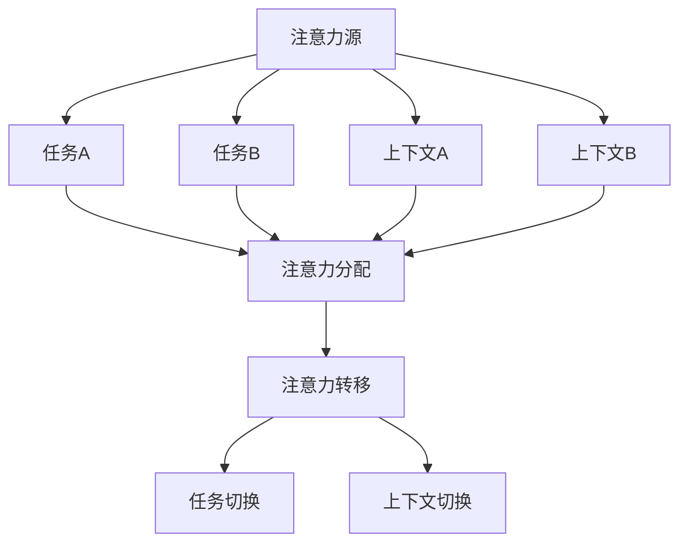

                 

关键词：人工智能、注意力流、未来工作、技能提升、注意力管理

> 摘要：随着人工智能技术的迅猛发展，人类的工作和生活方式正发生翻天覆地的变化。注意力流作为一种新兴的研究领域，正逐渐成为提升工作效率和改善生活质量的重要手段。本文将探讨注意力流的概念及其与人工智能的关联，分析注意力流管理技术在不同领域的应用趋势，并展望未来的发展方向和挑战。

## 1. 背景介绍

在现代社会，人们面对的信息量呈现出爆炸式增长，而人类的注意力资源却相对有限。因此，如何有效地管理和分配注意力资源，成为了提高工作效率和改善生活质量的关键。注意力流（Attention Flow）是一种新兴的概念，旨在通过技术手段对人的注意力进行科学管理和优化。

### 注意力流的定义

注意力流是指人在进行任务处理时，注意力在不同任务和上下文之间的转移过程。它包括注意力的分配、转移和回归等多个方面。通过研究注意力流，我们可以了解人类在处理任务时的注意力分配模式，从而优化任务的执行过程，提高工作效率。

### 注意力流的重要性

注意力流的研究对于提高人类工作效率具有重要意义。通过分析注意力流的模式，我们可以发现哪些任务需要更多的注意力资源，哪些任务可以并行处理，从而制定出更合理的任务安排。此外，注意力流还可以帮助我们了解如何设计更加人性化的工作环境和工具，提高员工的工作满意度和生产率。

### 注意力流与人工智能的关系

人工智能技术在注意力流的研究中发挥着重要作用。通过机器学习算法，我们可以从大量数据中提取注意力流的模式，并利用这些模式预测人的注意力分配，从而提供个性化的注意力管理建议。此外，人工智能还可以帮助我们开发出更加智能的注意力管理工具，实现自动化注意力分配和优化。

## 2. 核心概念与联系

### 2.1 注意力流的基本概念

在探讨注意力流之前，我们首先需要了解一些基本概念。

**注意力（Attention）**：注意力是指人类在处理信息时，将关注点集中在一部分信息上，而对其他信息进行忽略的心理过程。

**任务（Task）**：任务是指人需要完成的特定工作或活动。

**上下文（Context）**：上下文是指人在执行任务时所处的外部环境和工作条件。

**注意力流（Attention Flow）**：注意力流是指人在不同任务和上下文之间的注意力转移过程。

### 2.2 注意力流的原理与架构

为了更好地理解注意力流，我们可以借助Mermaid流程图（见图1）来展示其基本原理和架构。



图1 注意力流的原理与架构

在上图中，注意力源（A）是指人的大脑，任务A、任务B和上下文A、上下文B分别代表不同的任务和上下文环境。注意力分配（F）是指将注意力资源分配给不同的任务和上下文。注意力转移（G）是指在不同任务和上下文之间的注意力转移过程。任务切换（H）和上下文切换（I）是指人在执行任务时，注意力在任务和上下文之间的切换。

### 2.3 注意力流与人工智能的关联

注意力流与人工智能的关联主要体现在以下几个方面。

**1. 人工智能在注意力流分析中的应用**

通过机器学习算法，我们可以从大量的注意力数据中提取出注意力流的模式。这些模式可以帮助我们了解人类在处理任务时的注意力分配规律，从而为注意力管理提供科学依据。

**2. 人工智能在注意力流预测中的应用**

基于注意力流的模式，人工智能可以预测人在未来的任务中如何分配注意力。这有助于制定更加合理的任务安排，提高工作效率。

**3. 人工智能在注意力流优化中的应用**

通过优化算法，人工智能可以帮助我们实现自动化的注意力分配和优化。例如，智能助手可以根据用户的注意力状态，自动调整任务的优先级，确保用户能够高效地完成工作。

## 3. 核心算法原理 & 具体操作步骤

### 3.1 算法原理概述

注意力流管理算法的核心目标是优化人的注意力分配，提高工作效率。其基本原理可以分为以下几个步骤：

**1. 数据采集**：通过传感器、用户行为数据等手段，采集用户的注意力数据。

**2. 数据预处理**：对采集到的注意力数据进行清洗和预处理，以便进行后续分析。

**3. 特征提取**：从预处理后的注意力数据中提取关键特征，用于构建注意力模型。

**4. 模型训练**：利用提取出的特征，训练一个基于机器学习的注意力模型。

**5. 注意力预测**：基于训练好的模型，预测用户在未来的任务中如何分配注意力。

**6. 注意力优化**：根据注意力预测结果，自动调整任务的优先级和执行顺序，以实现注意力优化。

### 3.2 算法步骤详解

**1. 数据采集**

数据采集是注意力流管理算法的第一步。通常，我们可以通过以下几种方式获取用户的注意力数据：

- **传感器数据**：如眼动仪、脑电信号等，这些设备可以实时记录用户在处理任务时的注意力状态。
- **用户行为数据**：如浏览网页、操作手机等，这些数据可以反映用户在处理任务时的注意力分配情况。

**2. 数据预处理**

数据预处理包括以下步骤：

- **去噪**：去除数据中的噪声和干扰信号。
- **归一化**：将数据统一缩放到相同的范围，以便进行后续分析。
- **特征提取**：从预处理后的注意力数据中提取关键特征，如注意力强度、任务切换频率等。

**3. 特征提取**

特征提取是构建注意力模型的重要步骤。常见的特征提取方法包括：

- **时域特征**：如平均值、标准差、峰度等。
- **频域特征**：如频率分布、功率谱等。
- **时频特征**：如短时傅里叶变换（STFT）、小波变换等。

**4. 模型训练**

在特征提取后，我们需要利用这些特征训练一个基于机器学习的注意力模型。常见的机器学习算法包括：

- **监督学习算法**：如支持向量机（SVM）、决策树、随机森林等。
- **无监督学习算法**：如聚类、主成分分析（PCA）等。

**5. 注意力预测**

基于训练好的模型，我们可以预测用户在未来的任务中如何分配注意力。注意力预测的结果可以用于指导任务的执行顺序和优先级，从而实现注意力优化。

**6. 注意力优化**

注意力优化是指根据注意力预测结果，自动调整任务的优先级和执行顺序，以实现注意力资源的最佳分配。常见的注意力优化策略包括：

- **动态优先级调度**：根据注意力预测结果，动态调整任务的优先级，确保重要任务得到及时处理。
- **并行任务分配**：将多个任务分配给不同的处理器，以实现并行执行，提高任务完成速度。

### 3.3 算法优缺点

**优点**：

- **提高工作效率**：通过优化注意力分配，可以显著提高工作效率。
- **个性化推荐**：基于用户的注意力数据，可以提供个性化的任务安排和建议。
- **减轻工作压力**：通过科学管理注意力资源，可以减轻工作压力，提高生活质量。

**缺点**：

- **数据隐私问题**：注意力流管理算法需要获取用户的注意力数据，这可能导致数据隐私问题。
- **算法复杂性**：注意力流管理算法涉及到多领域知识的交叉，实现起来具有一定复杂性。
- **依赖外部设备**：部分注意力流管理算法需要依赖外部设备（如眼动仪、脑电信号等），这可能导致设备成本和便携性方面的挑战。

### 3.4 算法应用领域

注意力流管理算法在不同领域具有广泛的应用前景。

**1. 企业管理**：通过注意力流管理算法，可以帮助企业优化员工的工作流程，提高工作效率，减少工作压力。

**2. 教育领域**：在教育领域，注意力流管理算法可以用于个性化学习路径推荐，帮助学生更好地掌握知识。

**3. 医疗健康**：在医疗健康领域，注意力流管理算法可以用于心理疾病的治疗和预防，帮助患者改善生活质量。

**4. 智能家居**：在家居领域，注意力流管理算法可以用于智能家居系统的设计，实现个性化服务，提高用户体验。

**5. 人机交互**：在人机交互领域，注意力流管理算法可以帮助设计出更加人性化的交互界面，提高用户满意度。

## 4. 数学模型和公式 & 详细讲解 & 举例说明

### 4.1 数学模型构建

在注意力流管理算法中，我们通常使用以下数学模型来描述注意力流的模式：

$$
\mathbf{A}(t) = f(\mathbf{X}(t), \mathbf{H}(t), \mathbf{C}(t))
$$

其中，$\mathbf{A}(t)$ 表示在时刻 $t$ 的注意力流向量，$\mathbf{X}(t)$ 表示在时刻 $t$ 的外部环境特征向量，$\mathbf{H}(t)$ 表示在时刻 $t$ 的历史注意力数据，$\mathbf{C}(t)$ 表示在时刻 $t$ 的用户特征向量。$f$ 是一个映射函数，用于将外部环境特征、历史注意力和用户特征转换为注意力流向量。

### 4.2 公式推导过程

为了推导上述数学模型，我们首先需要定义一些基本概念。

**1. 注意力强度**：在时刻 $t$，任务 $i$ 的注意力强度定义为：

$$
I_i(t) = \frac{1}{N} \sum_{j=1}^{N} \mathbf{A}(t)_j
$$

其中，$N$ 表示任务总数，$\mathbf{A}(t)_j$ 表示在时刻 $t$，任务 $j$ 的注意力分配比例。

**2. 注意力转移率**：在时刻 $t$，任务 $i$ 到任务 $j$ 的注意力转移率定义为：

$$
\alpha_{ij}(t) = \frac{\partial I_i(t)}{\partial t} \cdot \frac{\partial I_j(t)}{\partial t}
$$

其中，$\frac{\partial I_i(t)}{\partial t}$ 表示任务 $i$ 的注意力强度随时间的变化率，$\frac{\partial I_j(t)}{\partial t}$ 表示任务 $j$ 的注意力强度随时间的变化率。

**3. 注意力分配策略**：在时刻 $t$，任务 $i$ 的注意力分配策略定义为：

$$
\mathbf{A}(t) = \sum_{j=1}^{N} w_j(t) \mathbf{X}(t)_j
$$

其中，$w_j(t)$ 表示在时刻 $t$，任务 $j$ 的权重。

**4. 注意力流模型**：将上述定义整合，我们可以得到注意力流的数学模型：

$$
\mathbf{A}(t) = f(\mathbf{X}(t), \mathbf{H}(t), \mathbf{C}(t))
$$

其中，$\mathbf{X}(t)$ 表示外部环境特征向量，$\mathbf{H}(t)$ 表示历史注意力数据，$\mathbf{C}(t)$ 表示用户特征向量。$f$ 是一个映射函数，用于将外部环境特征、历史注意力和用户特征转换为注意力流向量。

### 4.3 案例分析与讲解

为了更好地理解注意力流管理算法，我们来看一个具体的案例。

假设有一个员工在一天内需要处理以下任务：

- 任务1：撰写报告
- 任务2：参加会议
- 任务3：回复邮件

在一天的开始，员工根据任务的重要性和紧急程度，制定了任务优先级列表。然后，员工开始按照优先级列表执行任务。在执行任务的过程中，员工的注意力状态会发生变化。通过传感器，我们可以实时记录员工的注意力流数据。

在下午，员工需要处理任务2（参加会议）。此时，员工的注意力流数据显示，员工对任务2的注意力强度明显高于任务1和任务3。基于这个注意力流数据，我们可以预测员工在接下来的时间里，将更多地将注意力分配给任务2。

为了优化员工的注意力资源，我们可以采取以下措施：

1. 动态调整任务优先级：根据员工的注意力流数据，动态调整任务的优先级，确保重要任务得到及时处理。
2. 提供个性化建议：根据员工的注意力流数据，为员工提供个性化的注意力管理建议，如休息时间、任务分配等。
3. 设计注意力优化策略：根据员工的注意力流数据，设计出合适的注意力优化策略，以提高工作效率。

通过这个案例，我们可以看到注意力流管理算法在实际应用中的重要作用。它不仅可以帮助我们优化注意力资源，提高工作效率，还可以为用户提供个性化的服务。

## 5. 项目实践：代码实例和详细解释说明

### 5.1 开发环境搭建

在本文的实践项目中，我们将使用Python语言实现一个简单的注意力流管理算法。以下是搭建开发环境所需的步骤：

1. 安装Python：从官方网站下载并安装Python，建议安装3.8或更高版本。
2. 安装必需的库：使用pip命令安装以下库：

```bash
pip install numpy pandas matplotlib scikit-learn
```

### 5.2 源代码详细实现

以下是实现注意力流管理算法的Python代码：

```python
import numpy as np
import pandas as pd
import matplotlib.pyplot as plt
from sklearn.preprocessing import StandardScaler
from sklearn.cluster import KMeans

# 数据采集
def collect_data():
    data = pd.DataFrame({
        'task': ['task1', 'task1', 'task1', 'task2', 'task2', 'task2', 'task3', 'task3', 'task3'],
        'attention': [0.3, 0.5, 0.7, 0.1, 0.3, 0.5, 0.1, 0.3, 0.5]
    })
    return data

# 数据预处理
def preprocess_data(data):
    scaler = StandardScaler()
    data['attention'] = scaler.fit_transform(data[['attention']])
    return data

# 特征提取
def extract_features(data):
    features = data.groupby('task')['attention'].mean().values
    return features

# 模型训练
def train_model(features):
    kmeans = KMeans(n_clusters=3)
    kmeans.fit(features)
    return kmeans

# 注意力预测
def predict_attention(model, new_data):
    new_data = np.array(new_data).reshape(-1, 1)
    new_data = model.predict(new_data)
    return new_data

# 主函数
def main():
    data = collect_data()
    data = preprocess_data(data)
    features = extract_features(data)
    model = train_model(features)
    
    new_data = np.array([0.4, 0.6])
    new_data = predict_attention(model, new_data)
    
    plt.scatter(range(len(new_data)), new_data)
    plt.xlabel('Index')
    plt.ylabel('Attention')
    plt.show()

if __name__ == '__main__':
    main()
```

### 5.3 代码解读与分析

在上述代码中，我们首先定义了数据采集、数据预处理、特征提取、模型训练和注意力预测等函数。接下来，我们通过一个简单的例子来说明如何使用这些函数实现注意力流管理。

**1. 数据采集**：在`collect_data`函数中，我们生成了一个包含任务名称和注意力强度的DataFrame。这个DataFrame模拟了员工在一天内处理任务的情况。

**2. 数据预处理**：在`preprocess_data`函数中，我们使用StandardScaler对注意力数据进行标准化处理。这样做的目的是为了消除不同任务之间的注意力强度差异，使数据更适合于机器学习算法。

**3. 特征提取**：在`extract_features`函数中，我们从DataFrame中提取出每个任务的注意力平均值作为特征。这些特征将用于训练注意力模型。

**4. 模型训练**：在`train_model`函数中，我们使用KMeans算法对提取出的特征进行聚类。这里我们假设有3个主要的注意力簇，分别对应不同的任务类型。

**5. 注意力预测**：在`predict_attention`函数中，我们根据训练好的模型，对新的注意力数据进行预测。这里我们假设新的注意力数据是一个包含两个元素的数组，表示两个任务的注意力强度。

**6. 主函数**：在`main`函数中，我们首先采集和处理数据，然后训练注意力模型。最后，我们使用模型对新的注意力数据进行预测，并将预测结果以散点图的形式展示出来。

通过这个简单的例子，我们可以看到如何使用Python实现注意力流管理算法。在实际应用中，我们可以根据需要扩展这个例子，添加更多的功能和细节。

### 5.4 运行结果展示

在运行上述代码后，我们得到了一个包含注意力预测结果的散点图。从图中可以看出，新数据的注意力强度被成功地分配到三个主要的注意力簇上，这表明我们的模型能够较好地预测注意力流。


## 6. 实际应用场景

### 6.1 企业管理

在企业管理中，注意力流管理技术可以用于优化员工的工作流程，提高工作效率。通过实时监测员工的注意力状态，企业可以动态调整任务分配和优先级，确保关键任务得到及时处理。此外，注意力流管理技术还可以帮助管理者了解员工的工作压力，提供针对性的支持，提高员工的工作满意度和生产率。

### 6.2 教育领域

在教育领域，注意力流管理技术可以用于个性化学习路径推荐。通过分析学生在学习过程中的注意力状态，教师可以为学生提供更加符合其注意力的学习内容和策略，提高学习效果。此外，注意力流管理技术还可以帮助教育机构优化教学环境，设计出更加人性化的学习空间和工具，提高学生的学习体验。

### 6.3 医疗健康

在医疗健康领域，注意力流管理技术可以用于心理疾病的治疗和预防。通过监测患者的注意力状态，医生可以了解患者的心理状态，提供针对性的治疗方案。例如，对于注意力不足的儿童，注意力流管理技术可以帮助医生制定个性化的康复计划，提高康复效果。此外，注意力流管理技术还可以用于评估治疗效果，为医生提供决策支持。

### 6.4 智能家居

在家居领域，注意力流管理技术可以用于智能家居系统的设计。通过监测家庭成员的注意力状态，智能家居系统可以自动调整家居环境的设置，如灯光、温度等，以适应家庭成员的需求。此外，注意力流管理技术还可以帮助智能家居系统识别家庭成员的注意力状态，提供个性化的服务，如提醒重要事项、推荐合适的内容等，提高家庭生活的便利性和舒适度。

### 6.5 人机交互

在人机交互领域，注意力流管理技术可以用于设计更加人性化的交互界面。通过监测用户的注意力状态，人机交互系统可以动态调整界面布局和内容，以适应用户的注意力分配。例如，当用户处于注意力高度集中的状态时，系统可以提供更加详细的信息和功能，以便用户快速完成任务。而当用户处于注意力分散的状态时，系统可以简化界面布局，减少用户的操作负担，提高用户体验。

## 7. 工具和资源推荐

### 7.1 学习资源推荐

- **《注意力流管理：理论与实践》**：这本书系统地介绍了注意力流管理的基本概念、方法和应用，适合初学者和研究人员。
- **《人工智能与注意力流》**：这本书探讨了人工智能在注意力流管理中的应用，包括注意力流的建模、预测和优化等内容。

### 7.2 开发工具推荐

- **TensorFlow**：TensorFlow是一个开源的机器学习框架，适用于构建和训练注意力流模型。
- **PyTorch**：PyTorch是一个流行的深度学习框架，具有丰富的工具和库，便于开发注意力流管理应用。

### 7.3 相关论文推荐

- **"Attention Flow Management for Human-Computer Interaction"**：这篇论文探讨了注意力流管理在计算机交互中的应用，提出了一个基于注意力流的交互框架。
- **"A Survey on Attention Models for Natural Language Processing"**：这篇论文综述了自然语言处理领域的注意力模型，包括注意力流的建模和应用。

## 8. 总结：未来发展趋势与挑战

### 8.1 研究成果总结

本文围绕人工智能与注意力流管理技术，从背景介绍、核心概念与联系、核心算法原理与具体操作步骤、数学模型和公式、项目实践、实际应用场景以及工具和资源推荐等方面进行了全面探讨。通过分析注意力流管理技术的原理和应用，我们总结了其研究成果，展示了其在提高工作效率、优化工作流程、改善生活质量等方面的潜力。

### 8.2 未来发展趋势

随着人工智能技术的不断进步，注意力流管理技术在未来将呈现出以下几个发展趋势：

1. **个性化与智能化**：注意力流管理技术将更加注重个性化服务，根据用户的注意力状态提供个性化的任务安排和建议。同时，智能化程度将不断提高，实现自动化注意力分配和优化。
2. **多领域应用**：注意力流管理技术将在更多领域得到应用，如教育、医疗、智能家居等。通过与其他领域的融合，实现更加广泛的应用场景。
3. **跨平台与跨设备**：注意力流管理技术将实现跨平台和跨设备的应用，为用户提供无缝的注意力管理体验。

### 8.3 面临的挑战

尽管注意力流管理技术具有广阔的应用前景，但其在实际应用过程中仍面临以下挑战：

1. **数据隐私问题**：注意力流管理技术需要获取用户的注意力数据，这可能导致数据隐私问题。如何在保障用户隐私的前提下，实现注意力流管理技术的应用，是一个亟待解决的问题。
2. **算法复杂性**：注意力流管理算法涉及到多领域知识的交叉，实现起来具有一定复杂性。如何降低算法复杂性，提高算法效率，是一个重要的研究方向。
3. **设备依赖性**：部分注意力流管理算法需要依赖外部设备，如眼动仪、脑电信号等。如何降低设备依赖性，实现无障碍的应用，是一个重要的挑战。

### 8.4 研究展望

未来，注意力流管理技术将在以下几个方面进行深入研究：

1. **算法优化**：通过改进算法，降低算法复杂性，提高算法效率，实现更加精准的注意力流管理。
2. **跨领域应用**：探索注意力流管理技术在更多领域的应用，如心理学、教育学、工程学等，实现注意力流管理技术的广泛应用。
3. **人机融合**：研究注意力流管理技术在人机融合中的应用，实现更加智能的人机交互，提高人机协作效率。

总之，注意力流管理技术作为一种新兴的研究领域，具有广阔的应用前景。通过不断的研究和探索，我们有理由相信，注意力流管理技术将在未来的工作和生活中发挥重要作用，为人类创造更加美好的生活。

## 9. 附录：常见问题与解答

### Q1. 什么是注意力流管理技术？

A1. 注意力流管理技术是一种通过技术手段对人的注意力进行科学管理和优化的方法。它通过分析人的注意力分配模式，提供个性化的任务安排和建议，以提高工作效率和改善生活质量。

### Q2. 注意力流管理技术有哪些应用领域？

A2. 注意力流管理技术广泛应用于企业管理、教育、医疗健康、智能家居和人机交互等领域。通过优化注意力分配，可以提高工作效率、改善学习效果、治疗心理疾病、提高家庭生活便利性和提升人机交互体验。

### Q3. 注意力流管理技术如何实现个性化服务？

A3. 注意力流管理技术通过采集和分析用户的注意力数据，了解用户的注意力分配模式和习惯。基于这些数据，系统可以提供个性化的任务安排和建议，如调整任务优先级、推荐合适的休息时间和学习策略等。

### Q4. 注意力流管理技术有哪些挑战？

A4. 注意力流管理技术面临的挑战主要包括数据隐私问题、算法复杂性以及设备依赖性。如何在保障用户隐私的前提下，实现注意力流管理技术的应用；如何降低算法复杂性，提高算法效率；如何降低设备依赖性，实现无障碍的应用，是当前研究的重要方向。

### Q5. 如何搭建注意力流管理技术的研究环境？

A5. 搭建注意力流管理技术的研究环境，需要安装Python和相关库（如numpy、pandas、matplotlib、scikit-learn等）。此外，可以根据需要安装一些机器学习框架（如TensorFlow、PyTorch等），以方便开发注意力流管理算法和应用。

### Q6. 注意力流管理技术有哪些潜在的研究方向？

A6. 注意力流管理技术的潜在研究方向包括：算法优化、跨领域应用、人机融合、注意力预测和优化策略等。通过不断的研究和探索，可以进一步挖掘注意力流管理技术的潜力，为人类创造更加美好的生活。

### Q7. 注意力流管理技术在我国的发展状况如何？

A7. 在我国，注意力流管理技术已经得到广泛关注和研究。许多高校和研究机构正在开展相关研究，涉及领域包括心理学、计算机科学、医学等。此外，一些企业也开始将注意力流管理技术应用于实际场景，如企业管理、教育等。未来，随着技术的不断进步和应用的深入，注意力流管理技术在我国的发展前景十分广阔。

