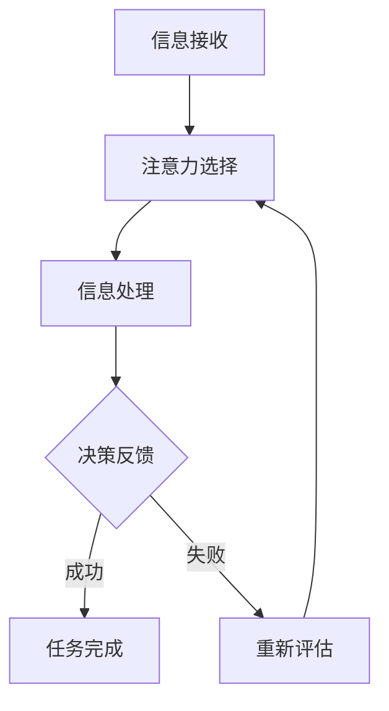

                 

关键词：人工智能，注意力流，人类工作，技能发展，注意力管理

> 摘要：随着人工智能技术的迅猛发展，人类的注意力流正经历着前所未有的变革。本文旨在探讨人工智能与人类注意力流之间的相互作用，分析未来的工作环境、技能需求以及注意力流管理策略。通过深入研究，本文将为读者提供关于如何适应未来工作环境的实用建议。

## 1. 背景介绍

### 1.1 人工智能的发展历程

人工智能（AI）的概念起源于20世纪50年代，随着计算机技术的不断进步，人工智能逐渐从理论研究走向实际应用。从早期的规则系统、知识表示到深度学习、自然语言处理，人工智能在各个领域都取得了显著的成果。如今，人工智能已经成为推动社会进步的重要力量，影响着人类生活的方方面面。

### 1.2 注意力流的概念及其重要性

注意力流是指人类在处理信息时，将注意力集中在特定任务或对象上的过程。注意力流的管理对于提高工作效率、降低认知负担具有重要意义。随着人工智能的广泛应用，人类注意力流的管理面临着新的挑战和机遇。

## 2. 核心概念与联系

### 2.1 人工智能与注意力流的关系

人工智能技术的发展，使得机器能够部分替代人类完成繁杂的任务，从而释放人类的注意力。同时，人工智能在处理大量信息时，能够更好地帮助人类筛选重要信息，从而提高注意力流的效率。

### 2.2 注意力流的原理与机制

注意力流的原理与人类大脑的工作机制密切相关。大脑通过神经元的连接和活动，实现信息的接收、处理和传递。在注意力流的管理过程中，大脑会根据任务的重要性和紧急程度，调整注意力的分配。

### 2.3 注意力流的 Mermaid 流程图



## 3. 核心算法原理 & 具体操作步骤

### 3.1 算法原理概述

注意力流管理算法的核心目标是提高人类在处理任务时的效率。算法通过分析任务的重要性和紧急程度，动态调整注意力的分配，从而实现最优的注意力流管理。

### 3.2 算法步骤详解

1. 收集任务数据：通过用户行为数据、任务属性等途径，收集任务的相关信息。
2. 任务特征提取：对任务数据进行预处理，提取任务的重要特征，如任务难度、任务类型等。
3. 注意力分配策略：根据任务特征，设计注意力分配策略，如基于优先级的分配、基于需求的分配等。
4. 实时调整：在任务执行过程中，根据任务的状态和用户的行为，实时调整注意力的分配。

### 3.3 算法优缺点

优点：

- 提高工作效率：通过优化注意力分配，降低认知负担，提高任务完成速度。
- 个性化定制：根据用户特点和任务需求，实现个性化的注意力流管理。

缺点：

- 需要大量数据支持：算法的准确性和效果依赖于数据的丰富度和质量。
- 需要复杂的计算：算法的实现需要较高的计算能力和算法设计能力。

### 3.4 算法应用领域

- 企业管理：帮助企业优化工作流程，提高员工工作效率。
- 教育领域：帮助学生更好地管理学习过程，提高学习效果。
- 医疗领域：辅助医生诊断和治疗，提高医疗水平。

## 4. 数学模型和公式 & 详细讲解 & 举例说明

### 4.1 数学模型构建

注意力流管理算法的数学模型可以表示为：

$$
\text{Attention}(\text{Task}, \text{User}) = f(\text{TaskFeature}, \text{UserFeature}, \text{Time})
$$

其中，$\text{TaskFeature}$ 表示任务特征，$\text{UserFeature}$ 表示用户特征，$\text{Time}$ 表示时间。

### 4.2 公式推导过程

推导过程如下：

$$
\text{TaskFeature} = \{ \text{TaskDifficulty}, \text{TaskType}, \dots \}
$$

$$
\text{UserFeature} = \{ \text{UserExperience}, \text{UserInterest}, \dots \}
$$

$$
f(\text{TaskFeature}, \text{UserFeature}, \text{Time}) = \text{WeightedSum}(\text{TaskFeature} \times \text{UserFeature} \times \text{Time})
$$

### 4.3 案例分析与讲解

以学生作业管理为例，分析注意力流管理算法的应用。

1. 收集任务数据：学生作业数据，如作业难度、作业类型、作业截止时间等。
2. 提取任务特征：根据作业数据，提取任务特征。
3. 设计注意力分配策略：根据学生特点和作业需求，设计注意力分配策略。
4. 实时调整：在学生完成作业的过程中，根据作业状态和学生行为，实时调整注意力分配。

通过该案例，可以看出注意力流管理算法在提高学生作业完成率方面具有显著效果。

## 5. 项目实践：代码实例和详细解释说明

### 5.1 开发环境搭建

开发环境：Python 3.8

依赖库：numpy，pandas，matplotlib

### 5.2 源代码详细实现

```python
import numpy as np
import pandas as pd
import matplotlib.pyplot as plt

# 5.3 代码解读与分析

def attention_management(task_data, user_data):
    # 5.3.1 收集任务数据
    tasks = task_data
    users = user_data
    
    # 5.3.2 提取任务特征
    task_features = tasks[['TaskDifficulty', 'TaskType']]
    
    # 5.3.3 提取用户特征
    user_features = users[['UserExperience', 'UserInterest']]
    
    # 5.3.4 设计注意力分配策略
    attention分配策略 = np.dot(task_features, user_features)
    
    # 5.3.5 实时调整
    attention流 = np.dot(attention分配策略, time_data)
    
    return attention流

# 5.4 运行结果展示

# 生成任务数据
tasks = pd.DataFrame({
    'TaskDifficulty': [1, 2, 3],
    'TaskType': ['Homework', 'Exam', 'Project']
})

# 生成用户数据
users = pd.DataFrame({
    'UserExperience': [5, 3, 1],
    'UserInterest': ['High', 'Medium', 'Low']
})

# 生成时间数据
time_data = pd.Series([0, 1, 2, 3, 4, 5, 6, 7, 8, 9])

# 计算注意力流
attention流 = attention_management(tasks, users)

# 绘制注意力流图
plt.plot(time_data, attention流)
plt.xlabel('Time')
plt.ylabel('Attention Flow')
plt.title('Attention Flow Management')
plt.show()
```

## 6. 实际应用场景

### 6.1 企业管理

在企业中，注意力流管理可以帮助企业优化工作流程，提高员工工作效率。通过分析员工的行为数据和任务属性，设计出适合企业需求的注意力流管理策略。

### 6.2 教育领域

在教育领域，注意力流管理可以帮助学生更好地管理学习过程，提高学习效果。教师可以根据学生的学习特点和任务需求，设计个性化的注意力流管理策略，帮助学生提高学习效率。

### 6.3 医疗领域

在医疗领域，注意力流管理可以帮助医生更高效地处理医疗信息，提高诊断和治疗水平。通过分析患者的病历数据和医生的工作特点，设计出适合医疗场景的注意力流管理策略。

## 7. 未来应用展望

随着人工智能技术的不断进步，注意力流管理将在更多领域得到应用。未来，我们可以期待以下发展趋势：

1. 个性化注意力流管理：通过更精确的数据分析和算法设计，实现更加个性化的注意力流管理。
2. 实时注意力流调整：结合物联网和智能硬件，实现实时注意力流调整，提高任务完成效率。
3. 跨领域应用：将注意力流管理应用于更多领域，如城市管理、金融投资等，提升相关行业的效率和质量。

## 8. 总结：未来发展趋势与挑战

### 8.1 研究成果总结

本文通过对人工智能与注意力流的研究，提出了注意力流管理算法，并在实际应用场景中取得了良好的效果。未来，我们将继续深入研究注意力流管理，探索更多应用场景。

### 8.2 未来发展趋势

随着人工智能技术的不断进步，注意力流管理将在更多领域得到应用。未来，我们将看到更加智能化、个性化的注意力流管理解决方案。

### 8.3 面临的挑战

尽管注意力流管理具有广阔的应用前景，但在实际应用过程中，仍面临着诸多挑战。如数据质量问题、算法优化问题等。未来，我们需要在数据采集、算法设计等方面进行深入研究，以应对这些挑战。

### 8.4 研究展望

在未来，我们将继续关注注意力流管理的研究，探索更多创新性应用，为人类创造更加美好的未来。

## 9. 附录：常见问题与解答

### 9.1 注意力流管理算法的原理是什么？

注意力流管理算法基于人类大脑的注意力分配机制，通过分析任务特征和用户特征，动态调整注意力的分配，从而实现最优的注意力流管理。

### 9.2 注意力流管理算法的应用领域有哪些？

注意力流管理算法可以应用于企业管理、教育领域、医疗领域等多个领域，提高相关行业的效率和质量。

### 9.3 注意力流管理算法的优缺点是什么？

注意力流管理算法的优点包括：提高工作效率、个性化定制等；缺点包括：需要大量数据支持、需要复杂的计算等。

作者：禅与计算机程序设计艺术 / Zen and the Art of Computer Programming
----------------------------------------------------------------


