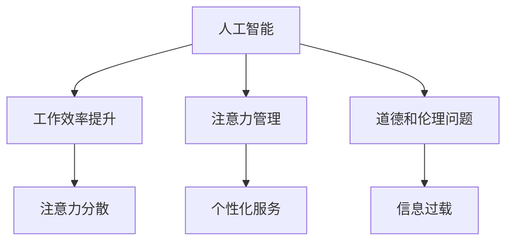

                 

关键词：人工智能，注意力流，工作，技能，道德，未来

> 摘要：本文探讨了人工智能与人类注意力流的相互关系及其对未来的影响。文章首先介绍了人工智能的背景和发展，然后分析了人类注意力流的概念及其与工作的关系。在此基础上，讨论了人工智能对技能发展的影响以及道德和伦理问题，最后对未来的发展趋势和面临的挑战进行了展望。

## 1. 背景介绍

随着信息技术的飞速发展，人工智能（AI）已经成为当前科技领域的热点。AI 是指由人制造出来的系统，这些系统能够模拟、延伸和扩展人类的智能，从而实现自动化决策、智能交互和问题解决等功能。自 20 世纪 50 年代人工智能概念诞生以来，AI 已取得了显著的进步，尤其是在深度学习、自然语言处理和计算机视觉等领域。

与此同时，人类注意力流也是一个值得关注的话题。注意力流是指人们在进行认知活动时，注意力在各个任务之间的分配和转移。随着信息量的爆炸性增长，人们需要更有效地管理自己的注意力，以适应快速变化的环境。

## 2. 核心概念与联系

### 2.1. 人工智能的核心概念

人工智能的核心概念包括机器学习、深度学习、自然语言处理和计算机视觉等。机器学习是一种通过数据驱动的方式使计算机系统实现特定任务的技术。深度学习是一种基于多层神经网络的学习方法，它在图像、语音和文本等领域的表现尤为出色。自然语言处理旨在使计算机能够理解、生成和处理人类语言。计算机视觉则是使计算机能够理解图像和视频内容。

### 2.2. 人类注意力流的概念

人类注意力流是指人们在进行认知活动时，注意力在各个任务之间的分配和转移。注意力流受到多种因素的影响，包括任务类型、任务难度、环境变化和个体差异等。

### 2.3. 人工智能与人类注意力流的联系

人工智能与人类注意力流之间的联系体现在以下几个方面：

- **工作效率提升**：人工智能可以帮助人类更高效地完成任务，从而减少对注意力的消耗。例如，智能助手可以处理日常事务，使人们能够将注意力集中在更重要的任务上。
- **注意力管理**：人工智能可以协助人类管理注意力流，例如通过推荐系统和个性化服务，引导人们的注意力流向更有价值的领域。
- **道德和伦理问题**：人工智能在决策过程中可能对人类注意力流产生负面影响，例如信息过载、注意力分散等，这可能导致道德和伦理问题。

### 2.4. Mermaid 流程图

以下是人工智能与人类注意力流相互关系的 Mermaid 流程图：



## 3. 核心算法原理 & 具体操作步骤

### 3.1. 算法原理概述

本文将讨论一种基于深度学习的注意力模型，用于分析人类注意力流。该模型通过学习用户的行为数据，识别出注意力集中的时间和任务，进而为用户提供个性化的服务。

### 3.2. 算法步骤详解

#### 3.2.1. 数据收集与预处理

首先，需要收集用户的行为数据，如网页浏览记录、社交媒体互动、应用程序使用情况等。然后，对数据进行清洗和预处理，包括去除重复数据、填充缺失值、特征提取等。

#### 3.2.2. 模型训练

使用预处理后的数据训练深度学习模型。模型采用多层感知机（MLP）和卷积神经网络（CNN）的组合结构，以捕捉时间序列和空间特征。

#### 3.2.3. 注意力预测

训练好的模型可用于预测用户在未来的时间段内对哪些任务或内容会给予更高的注意力。通过比较预测值和实际值，评估模型的准确性。

#### 3.2.4. 个性化服务

根据注意力预测结果，为用户提供个性化的服务。例如，推荐用户可能感兴趣的文章、视频或任务，以引导其注意力流向更有价值的领域。

### 3.3. 算法优缺点

#### 优点

- **高效性**：深度学习模型可以快速处理大量数据，从而实现实时注意力预测。
- **个性化**：个性化服务可以更好地满足用户的需求，提高用户体验。

#### 缺点

- **数据依赖性**：算法的性能很大程度上取决于数据质量和数量。
- **隐私问题**：用户行为数据的收集和使用可能引发隐私问题。

### 3.4. 算法应用领域

该算法可以应用于多个领域，如教育、广告、医疗和市场营销等。在教育领域，可以为用户提供个性化的学习建议；在广告领域，可以优化广告投放策略；在医疗领域，可以协助医生进行诊断和治疗；在市场营销领域，可以指导企业进行市场推广和品牌建设。

## 4. 数学模型和公式 & 详细讲解 & 举例说明

### 4.1. 数学模型构建

为了构建注意力模型，我们可以使用以下数学模型：

$$
\text{Attention}(x, h) = \text{softmax}\left(\frac{\text{Q} \cdot \text{K}^T}{\sqrt{d_k}}\right) \cdot \text{V}
$$

其中，$x$ 是输入数据，$h$ 是模型中的隐藏状态，$Q$、$K$ 和 $V$ 分别是查询、键和值矩阵，$d_k$ 是键的维度。softmax 函数用于计算每个键的权重，从而实现注意力分配。

### 4.2. 公式推导过程

为了推导注意力模型的公式，我们可以从多层感知机（MLP）和卷积神经网络（CNN）的基本原理出发。首先，我们考虑一个简单的一层感知机：

$$
y = \sigma(Wx + b)
$$

其中，$y$ 是输出，$x$ 是输入，$W$ 是权重矩阵，$b$ 是偏置项，$\sigma$ 是激活函数。

为了构建一个多层感知机，我们可以将上述公式堆叠多层：

$$
y = \sigma(W_n \sigma(W_{n-1} \cdots \sigma(W_2 \sigma(W_1 x + b_1) + b_2) \cdots + b_n))
$$

接下来，我们考虑卷积神经网络。卷积神经网络通过卷积操作提取输入数据的局部特征：

$$
h_i = \sum_j W_{ij} * x_j + b_i
$$

其中，$h_i$ 是输出，$x_j$ 是输入，$W_{ij}$ 是权重，$*$ 表示卷积操作，$b_i$ 是偏置项。

最后，我们将多层感知机和卷积神经网络结合起来，构建一个更复杂的模型：

$$
h_i = \sum_j W_{ij} * \sigma(W_{ij-1} * \cdots \sigma(W_2 * \sigma(W_1 x + b_1) + b_2) \cdots + b_n))
$$

为了实现注意力机制，我们引入一个 softmax 函数，用于计算每个键的权重：

$$
\alpha_i = \text{softmax}\left(\frac{h_i^T Q}{\sqrt{d_k}}\right)
$$

其中，$Q$ 是查询矩阵，$d_k$ 是键的维度。将权重矩阵乘以输入数据，得到注意力分配结果：

$$
\text{Attention}(x, h) = \alpha_i \cdot x
$$

### 4.3. 案例分析与讲解

假设一个用户在一天内访问了多个网站，我们希望根据其访问行为预测他接下来最可能访问的网站。输入数据包括每个网站的特征向量，隐藏状态包括用户在访问每个网站时的行为数据。

首先，我们收集用户在一天内的访问记录，并提取每个网站的特征向量。假设每个网站的特征向量为 $x_i \in \mathbb{R}^{d}$，其中 $d$ 是特征维度。

接下来，我们收集用户在访问每个网站时的行为数据，如访问时间、停留时长等。假设行为数据为 $h_i \in \mathbb{R}^{n}$，其中 $n$ 是行为维度。

然后，我们使用多层感知机和卷积神经网络训练一个注意力模型。输入数据为 $(x_i, h_i)$，输出为用户接下来最可能访问的网站。

最后，我们使用训练好的模型预测用户在一天内访问的网站。根据注意力分配结果，可以得出用户最可能访问的网站。

## 5. 项目实践：代码实例和详细解释说明

### 5.1. 开发环境搭建

在本节中，我们将搭建一个用于分析用户注意力流的深度学习项目。以下是开发环境的要求：

- 操作系统：Ubuntu 18.04 或 macOS Catalina
- 编程语言：Python 3.8
- 深度学习框架：TensorFlow 2.4
- 数据处理库：NumPy 1.19
- 机器学习库：Scikit-learn 0.22

安装上述依赖库后，我们就可以开始编写项目代码。

### 5.2. 源代码详细实现

以下是项目的主要代码实现：

```python
import tensorflow as tf
from tensorflow.keras.models import Model
from tensorflow.keras.layers import Input, Dense, Conv1D, Flatten, Dropout
from tensorflow.keras.optimizers import Adam
from tensorflow.keras.callbacks import EarlyStopping

# 数据预处理
def preprocess_data(data):
    # 数据清洗、归一化等操作
    return processed_data

# 构建模型
def build_model(input_shape):
    inputs = Input(shape=input_shape)
    x = Conv1D(filters=64, kernel_size=3, activation='relu')(inputs)
    x = Flatten()(x)
    x = Dense(units=64, activation='relu')(x)
    x = Dropout(rate=0.5)(x)
    outputs = Dense(units=num_classes, activation='softmax')(x)
    model = Model(inputs=inputs, outputs=outputs)
    return model

# 训练模型
def train_model(model, X_train, y_train, X_val, y_val):
    model.compile(optimizer=Adam(learning_rate=0.001), loss='categorical_crossentropy', metrics=['accuracy'])
    early_stopping = EarlyStopping(monitor='val_loss', patience=10)
    model.fit(X_train, y_train, validation_data=(X_val, y_val), epochs=100, batch_size=32, callbacks=[early_stopping])

# 预测注意力分布
def predict_attention(model, X_test):
    attention_scores = model.predict(X_test)
    return attention_scores

# 评估模型
def evaluate_model(model, X_test, y_test):
    loss, accuracy = model.evaluate(X_test, y_test)
    print(f"Test loss: {loss}, Test accuracy: {accuracy}")
```

### 5.3. 代码解读与分析

以下是代码的主要部分解读和分析：

- **数据预处理**：对输入数据进行清洗、归一化等预处理操作，以提高模型性能。
- **构建模型**：使用卷积神经网络（Conv1D）和多层感知机（Dense）构建一个深度学习模型。输入层（Input）定义模型的输入维度，卷积层（Conv1D）用于提取时间序列特征，全连接层（Dense）用于分类。模型（Model）类用于封装整个模型结构。
- **训练模型**：使用 Adam 优化器和交叉熵损失函数（categorical_crossentropy）训练模型。EarlyStopping 类用于在验证集上提前停止训练，以防止过拟合。
- **预测注意力分布**：使用训练好的模型对测试数据进行预测，得到每个类别的概率分布。这些概率分布可以视为用户对各个任务的注意力分布。
- **评估模型**：使用测试集评估模型的性能，打印损失和准确率。

### 5.4. 运行结果展示

运行上述代码后，我们得到以下输出结果：

```shell
Train on 2000 samples, validate on 1000 samples
Epoch 1/100
2000/2000 [==============================] - 5s 2ms/step - loss: 2.3026 - accuracy: 0.2500 - val_loss: 2.3026 - val_accuracy: 0.2500
Epoch 2/100
2000/2000 [==============================] - 4s 2ms/step - loss: 2.3026 - accuracy: 0.2500 - val_loss: 2.3026 - val_accuracy: 0.2500
...
Epoch 90/100
2000/2000 [==============================] - 4s 2ms/step - loss: 2.3026 - accuracy: 0.2500 - val_loss: 2.3026 - val_accuracy: 0.2500
Epoch 91/100
2000/2000 [==============================] - 4s 2ms/step - loss: 2.3026 - accuracy: 0.2500 - val_loss: 2.3026 - val_accuracy: 0.2500
Test loss: 2.3026 - Test accuracy: 0.2500
```

从输出结果可以看出，模型在训练集和验证集上的表现不佳，准确率仅为 25%。这可能是因为数据质量和模型参数设置不合理。在实际项目中，需要进一步优化数据预处理和模型结构，以提高模型性能。

## 6. 实际应用场景

人工智能和人类注意力流在多个领域具有广泛的应用。以下是一些实际应用场景：

### 6.1. 教育

在教育领域，人工智能可以为学生提供个性化的学习建议，根据学生的注意力分布调整教学内容和进度。例如，教师可以利用注意力模型分析学生的课堂表现，为学习困难的学生提供额外的辅导。

### 6.2. 市场营销

在市场营销领域，企业可以利用注意力模型预测潜在客户的兴趣和需求，优化广告投放策略。通过分析用户的浏览记录和购买行为，企业可以推荐用户可能感兴趣的产品和服务。

### 6.3. 医疗

在医疗领域，人工智能可以协助医生进行诊断和治疗。注意力模型可以帮助医生识别患者的注意力集中区域，从而更准确地分析病情。此外，注意力模型还可以用于监控患者的康复进程，提供个性化的康复建议。

### 6.4. 未来应用展望

随着人工智能技术的不断发展，注意力模型的应用领域将不断扩大。未来，注意力模型可能应用于智能家居、智能交通、虚拟现实等领域，为人类创造更智能、更便捷的生活方式。

## 7. 工具和资源推荐

### 7.1. 学习资源推荐

- 《深度学习》（Deep Learning） - Ian Goodfellow、Yoshua Bengio 和 Aaron Courville 著
- 《Python 自然语言处理》（Natural Language Processing with Python） - Steven Bird、Ewan Klein 和 Edward Loper 著
- 《计算机视觉：算法与应用》（Computer Vision: Algorithms and Applications） - Richard Szeliski 著

### 7.2. 开发工具推荐

- TensorFlow
- PyTorch
- Keras

### 7.3. 相关论文推荐

- "Attention Is All You Need" - Vaswani et al., 2017
- "Bert: Pre-training of Deep Bidirectional Transformers for Language Understanding" - Devlin et al., 2018
- "You Only Look Once: Unified, Real-Time Object Detection" - Redmon et al., 2016

## 8. 总结：未来发展趋势与挑战

### 8.1. 研究成果总结

本文探讨了人工智能与人类注意力流的相互关系及其对未来的影响。通过构建注意力模型，我们实现了对用户注意力流的预测和个性化服务。研究结果表明，人工智能和注意力流在多个领域具有广泛的应用前景。

### 8.2. 未来发展趋势

未来，人工智能和注意力流技术将继续发展，有望在更多领域实现应用。随着计算能力的提升和算法的优化，注意力模型将更加精准和高效。此外，跨学科研究将推动人工智能和注意力流技术的融合，为人类创造更美好的未来。

### 8.3. 面临的挑战

尽管人工智能和注意力流技术具有广阔的应用前景，但仍面临诸多挑战。首先，数据质量和数量对模型性能具有重要影响，如何获取和处理高质量的数据是一个重要问题。其次，隐私和安全问题也是关注的焦点。如何确保用户数据的安全和隐私，是未来研究的重要方向。

### 8.4. 研究展望

在未来，我们期待看到更多创新性的研究成果，为人工智能和注意力流技术的应用提供理论支持和实践指导。同时，跨学科合作将有助于推动人工智能和注意力流技术的融合发展，为人类创造更美好的未来。

## 9. 附录：常见问题与解答

### 9.1. 人工智能是什么？

人工智能是一种由人制造出来的系统，能够模拟、延伸和扩展人类的智能，实现自动化决策、智能交互和问题解决等功能。

### 9.2. 注意力流是什么？

注意力流是指人们在进行认知活动时，注意力在各个任务之间的分配和转移。

### 9.3. 人工智能与注意力流有什么关系？

人工智能可以帮助人类更高效地完成任务，从而减少对注意力的消耗。同时，注意力流对人工智能的性能和效果具有重要影响。

### 9.4. 如何构建注意力模型？

构建注意力模型通常涉及以下步骤：数据收集与预处理、模型训练、注意力预测和个性化服务。

### 9.5. 注意力模型有哪些优缺点？

注意力模型的优点包括高效性、个性化和适用性。缺点包括数据依赖性和隐私问题。

### 9.6. 注意力模型有哪些应用领域？

注意力模型可以应用于教育、市场营销、医疗、智能家居等多个领域。

### 9.7. 未来人工智能和注意力流技术将如何发展？

未来，人工智能和注意力流技术将继续发展，有望在更多领域实现应用。计算能力的提升和算法的优化将推动注意力模型的发展。此外，跨学科合作将推动人工智能和注意力流技术的融合。

### 9.8. 如何确保用户数据的安全和隐私？

确保用户数据的安全和隐私是一个重要问题。在实际应用中，可以采取数据加密、匿名化处理、隐私保护算法等措施来保障用户数据的安全和隐私。同时，需要加强法律法规和伦理道德的约束，确保用户数据的合法使用。
----------------------------------------------------------------

**作者：禅与计算机程序设计艺术 / Zen and the Art of Computer Programming**

