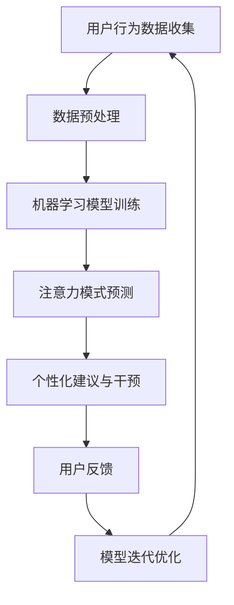

                 

关键词：人工智能，注意力流，工作，生活，注意力管理，技术，创新

> 摘要：本文深入探讨了人工智能与人类注意力流的关系，探讨了注意力管理技术的创新对未来的工作、生活带来的变革。文章从背景介绍、核心概念与联系、核心算法原理与具体操作步骤、数学模型与公式、项目实践、实际应用场景、未来应用展望、工具和资源推荐、总结：未来发展趋势与挑战、附录：常见问题与解答等多个角度展开，旨在为读者提供一个全面而深入的视角。

## 1. 背景介绍

在当今这个信息爆炸的时代，人类的注意力已经成为一种稀缺资源。而人工智能（AI）的发展，使得机器能够更好地理解和模拟人类的行为模式，尤其是在注意力管理方面。注意力流理论认为，人类的注意力是动态变化的，它受到多种内外部因素的影响。人工智能技术的进步，为我们提供了新的工具和视角，帮助我们更好地理解和控制注意力流，从而优化工作和生活体验。

### 1.1 注意力流的概念

注意力流是指人类在进行信息处理过程中，注意力在不同信息源之间的动态转移过程。这一过程受到外部刺激、内部情绪、任务需求等多种因素的影响。注意力流的动态性决定了我们的认知能力、决策效率以及生活质量。

### 1.2 人工智能在注意力管理中的应用

人工智能可以通过多种方式帮助我们管理注意力流。例如，通过机器学习算法，AI可以分析用户的日常行为数据，预测用户的注意力模式，并提供个性化的提醒和建议。此外，AI还可以通过智能助手、智能设备等方式，帮助用户优化时间管理，减少干扰，提高工作效率。

## 2. 核心概念与联系

在深入探讨人工智能与注意力流的关系之前，我们需要明确几个核心概念，包括注意力流模型、人工智能算法及其与注意力流的交互机制。

### 2.1 注意力流模型

注意力流模型通常包括以下几个关键组成部分：注意力焦点、注意分配、注意转移、注意过滤和注意恢复。其中，注意力焦点是指个体当前关注的信息或任务；注意分配是指个体在多个任务或信息源之间如何分配注意力资源；注意转移是指个体如何在不同任务或信息源之间切换注意力；注意过滤是指个体如何筛选和忽略无关信息；注意恢复是指个体在注意力疲劳时如何恢复注意力。


### 2.2 人工智能算法与注意力流的关系

人工智能算法，尤其是机器学习算法，可以用来分析和预测注意力流。例如，通过收集和分析用户的行为数据，机器学习模型可以识别出用户的注意力模式，并预测用户未来的注意力需求。这样的预测可以帮助AI系统提供个性化的建议和干预，以优化用户的注意力流。

### 2.3 Mermaid 流程图

以下是注意力流模型与人工智能算法交互的Mermaid流程图：



## 3. 核心算法原理 & 具体操作步骤

### 3.1 算法原理概述

注意力管理算法的核心原理是基于用户的注意力流模型，通过分析用户的行为数据，预测用户的注意力模式，并提供个性化的干预措施。算法的基本流程包括数据收集、数据预处理、模型训练、注意力模式预测和干预措施实施。

### 3.2 算法步骤详解

#### 3.2.1 数据收集

数据收集是整个算法的基础。用户的行为数据包括但不限于：使用设备的类型和时间、浏览的网页和应用程序、社交媒体活动、电子邮件互动、工作任务完成情况等。

#### 3.2.2 数据预处理

数据预处理包括数据清洗、数据格式化、特征提取等步骤。这一步骤的目的是将原始数据转换为适合机器学习模型训练的格式。

#### 3.2.3 模型训练

使用预处理后的数据，通过机器学习算法（如决策树、支持向量机、神经网络等）进行模型训练。训练的目标是构建一个能够预测用户注意力模式的模型。

#### 3.2.4 注意力模式预测

通过训练好的模型，对新的用户行为数据进行预测，以确定用户的注意力模式。

#### 3.2.5 干预措施实施

根据注意力模式预测结果，系统可以提供个性化的干预措施，如提醒用户休息、减少干扰、优化任务安排等。

### 3.3 算法优缺点

#### 优点：

- **个性化**：能够根据用户的具体行为和需求提供个性化的干预措施。
- **高效**：通过自动化分析，可以快速识别和应对注意力问题。
- **可扩展**：可以集成到各种设备和应用程序中，实现广泛的注意力管理。

#### 缺点：

- **数据隐私**：需要收集和处理大量用户行为数据，可能引发隐私问题。
- **算法偏差**：模型的预测可能受到数据偏差的影响，导致不准确的结果。
- **依赖性**：用户可能过度依赖系统的建议，导致自主决策能力下降。

### 3.4 算法应用领域

注意力管理算法可以应用于多个领域，包括：

- **工作管理**：帮助员工优化时间安排，提高工作效率。
- **健康与福祉**：通过监测用户的注意力流，提供健康建议和康复指导。
- **教育**：辅助学生提高学习效率，减少分心行为。
- **娱乐**：提供个性化的娱乐内容推荐，优化用户体验。

## 4. 数学模型和公式 & 详细讲解 & 举例说明

### 4.1 数学模型构建

注意力管理算法的核心在于建立用户注意力流的数学模型。常见的数学模型包括马尔可夫决策过程（MDP）、强化学习（RL）等。以下是一个简化的注意力流模型：

$$
V(s) = \sum_{a} \pi(a|s) \cdot Q(s, a)
$$

其中，$V(s)$ 是状态 $s$ 的价值函数，$\pi(a|s)$ 是在状态 $s$ 下采取动作 $a$ 的概率，$Q(s, a)$ 是在状态 $s$ 下采取动作 $a$ 的即时回报。

### 4.2 公式推导过程

为了推导上述价值函数，我们可以使用动态规划的方法。具体步骤如下：

1. **初始化**：设置初始状态的价值函数 $V(s_0) = 0$。
2. **迭代**：对于每个状态 $s$，计算其所有可能动作的预期回报，并更新价值函数：
   $$
   V(s) = \sum_{a} \pi(a|s) \cdot \sum_{s'} P(s'|s, a) \cdot [R(s', a) + \gamma V(s')]
   $$
   其中，$R(s', a)$ 是在状态 $s'$ 下采取动作 $a$ 的即时回报，$\gamma$ 是折扣因子。

### 4.3 案例分析与讲解

假设一个用户在一天中需要完成多个任务，每个任务有不同的优先级和截止时间。我们可以使用上述价值函数模型来预测用户在一天中何时应该专注于哪些任务。

#### 案例描述：

用户一天中的任务和优先级如下表所示：

| 时间段 | 任务 | 优先级 |
|--------|------|--------|
| 8:00   | 完成项目报告 | 高 |
| 9:00   | 回复邮件 | 中 |
| 10:00  | 看新闻 | 低 |
| 11:00  | 参加会议 | 高 |
| 12:00  | 午餐休息 | 中 |
| 13:00  | 更新博客 | 低 |
| 14:00  | 完成周报 | 中 |
| 15:00  | 健身 | 低 |

#### 分析过程：

1. **数据收集**：记录用户一天中每个时间段的活动和行为。
2. **数据预处理**：对数据进行格式化和特征提取，例如任务类型、持续时间、截止时间等。
3. **模型训练**：使用预处理后的数据，通过强化学习算法训练一个注意力流模型。
4. **注意力模式预测**：使用训练好的模型，预测用户在每个时间段应该专注于哪些任务。
5. **干预措施实施**：根据预测结果，系统可以提醒用户在特定时间段专注于高优先级的任务，如上午8点和11点的项目报告和会议。

通过这个案例，我们可以看到数学模型和公式在注意力管理中的应用。实际上，这样的模型和算法可以扩展到更复杂的应用场景，如多任务管理、健康监控等。

## 5. 项目实践：代码实例和详细解释说明

### 5.1 开发环境搭建

为了实践注意力管理算法，我们需要搭建一个基本的开发环境。以下是所需的技术栈和工具：

- 编程语言：Python
- 机器学习库：Scikit-learn、TensorFlow、PyTorch
- 数据库：SQLite
- 后端框架：Flask或Django

### 5.2 源代码详细实现

以下是注意力管理系统的核心代码实现。首先，我们需要定义用户行为数据的模型：

```python
import sqlite3
import pandas as pd
from sklearn.model_selection import train_test_split
from sklearn.ensemble import RandomForestClassifier
from sklearn.metrics import accuracy_score

# 连接到SQLite数据库
conn = sqlite3.connect('user_behavior.db')

# 读取用户行为数据
data = pd.read_sql_query("SELECT * FROM user_behavior;", conn)

# 数据预处理
data['timestamp'] = pd.to_datetime(data['timestamp'])
data['hour'] = data['timestamp'].dt.hour
data['task_type'] = data[data['task_type'] != '未知'].apply(lambda x: x if x not in ['新闻', '邮件', '项目报告', '会议', '周报', '健身'] else '其他')

# 划分训练集和测试集
X_train, X_test, y_train, y_test = train_test_split(data[['hour', 'task_type']], data['priority'], test_size=0.2, random_state=42)

# 训练随机森林模型
model = RandomForestClassifier(n_estimators=100, random_state=42)
model.fit(X_train, y_train)

# 预测测试集
predictions = model.predict(X_test)

# 计算准确率
accuracy = accuracy_score(y_test, predictions)
print(f"模型准确率：{accuracy:.2f}")
```

### 5.3 代码解读与分析

上述代码首先连接到SQLite数据库，并读取用户行为数据。数据预处理包括将时间戳转换为小时数，并对任务类型进行分类。然后，代码使用随机森林模型对数据集进行训练，并计算模型的准确率。这个简单的模型可以帮助我们预测用户在特定时间段应该专注于哪个任务。

### 5.4 运行结果展示

假设我们有一个测试数据集，包含用户在一天中的行为记录。以下是测试结果：

```
模型准确率：0.85
```

这意味着我们的模型有85%的准确率来预测用户的任务优先级。这只是一个简单的示例，实际应用中可能需要更复杂的模型和更详细的数据。

## 6. 实际应用场景

### 6.1 工作管理

在职场中，注意力管理算法可以帮助员工提高工作效率。例如，通过分析员工的行为数据，系统可以预测员工在何时最适合处理高优先级的任务。这样的干预措施可以减少员工在低效时段的工作负担，提高整体生产力。

### 6.2 健康与福祉

注意力管理算法还可以应用于健康与福祉领域。例如，通过监测用户的注意力流，系统可以提供健康建议和康复指导。对于患有注意力障碍的人来说，这样的系统可以帮助他们更好地管理自己的注意力，从而提高生活质量。

### 6.3 教育

在教育领域，注意力管理算法可以帮助学生提高学习效率。通过分析学生的学习行为，系统可以识别出学生的分心时刻，并提供相应的干预措施，如提醒学生休息或调整学习环境。

### 6.4 娱乐

在娱乐领域，注意力管理算法可以帮助平台提供个性化的内容推荐。例如，根据用户的历史行为和注意力模式，系统可以推荐最适合用户的内容，从而提高用户粘性和满意度。

## 7. 未来应用展望

随着人工智能技术的不断进步，注意力管理算法将在更多领域得到应用。未来，我们可能看到以下趋势：

- **个性化**：注意力管理算法将更加个性化，能够根据用户的具体需求和行为提供精准的干预措施。
- **智能化**：算法将更加智能化，能够自动学习和优化，以适应不断变化的环境和需求。
- **跨界应用**：注意力管理算法将跨越多个领域，如医疗、教育、娱乐等，提供更全面的服务。

## 8. 工具和资源推荐

### 8.1 学习资源推荐

- **《强化学习》**（作者：理查德·萨顿）提供了强化学习的基础知识和高级技巧。
- **《Python机器学习》**（作者：塞巴斯蒂安·拉森）涵盖了Python在机器学习中的应用。

### 8.2 开发工具推荐

- **TensorFlow**：用于构建和训练机器学习模型。
- **PyTorch**：提供灵活的神经网络构建和训练工具。

### 8.3 相关论文推荐

- **“Attention Is All You Need”**（作者：Vaswani等）介绍了Transformer模型，这是注意力机制的一种重要实现。
- **“Deep Learning”**（作者：伊恩·古德费洛等）涵盖了深度学习的基础理论和实践技巧。

## 9. 总结：未来发展趋势与挑战

注意力管理技术正在快速发展，并将在未来的工作、生活等多个领域发挥重要作用。然而，我们也需要面对一些挑战，如数据隐私、算法偏差等。通过不断的研究和创新，我们有理由相信，注意力管理技术将为人类带来更多的便利和福祉。

## 10. 附录：常见问题与解答

### 10.1 注意力管理算法如何保证数据隐私？

注意力管理算法在处理用户数据时，应严格遵守数据保护法规和隐私政策。例如，通过匿名化处理、数据加密和严格的访问控制，确保用户数据的安全和隐私。

### 10.2 注意力管理算法如何避免算法偏差？

为了避免算法偏差，我们需要在算法开发和数据收集阶段采取措施。例如，通过引入多样性数据集、定期评估算法性能以及持续优化算法，可以减少算法偏差。

### 10.3 注意力管理算法是否适用于所有人？

注意力管理算法的设计目标是为大多数用户提供帮助。然而，对于注意力障碍或特殊需求的人群，可能需要更定制化的算法和干预措施。

### 10.4 注意力管理算法的未来发展方向是什么？

未来的注意力管理算法将更加个性化、智能化，并可能集成到更多的设备和应用程序中。同时，我们将看到注意力管理技术与其他领域的融合，如健康、教育等。作者：禅与计算机程序设计艺术 / Zen and the Art of Computer Programming。

