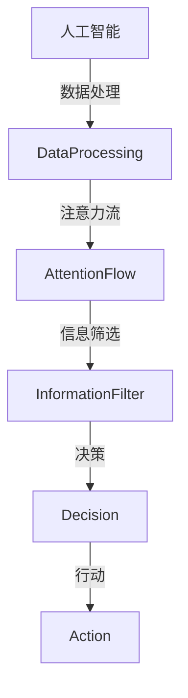
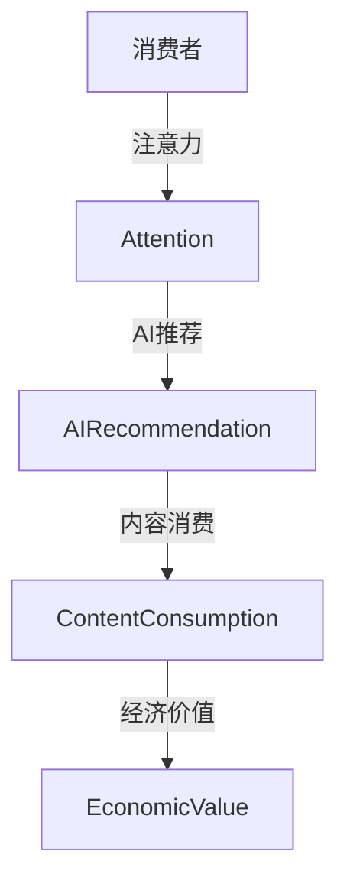

                 

关键词：人工智能，注意力流，注意力经济，未来工作，未来生活，技术发展趋势

> 摘要：本文深入探讨了人工智能与人类注意力流的互动关系，分析了注意力经济的重要性，探讨了未来工作与生活的新模式，提出了如何利用注意力流优化工作效率和生活质量的方法，并展望了注意力经济在未来社会中的应用前景。

## 1. 背景介绍

### 1.1 人工智能的发展历程

人工智能（AI）作为计算机科学的一个重要分支，自20世纪50年代诞生以来，经历了从理论研究到实际应用的多次迭代发展。早期的AI研究主要集中在规则推理和知识表示上，随着计算能力的提升和大数据的普及，现代人工智能逐渐向深度学习和神经网络方向演变。

### 1.2 注意力流的定义与作用

注意力流是指人类在进行信息处理时，将注意力集中到特定任务或信息上的过程。注意力流不仅影响人类的认知行为，还在信息过载的时代中起到了筛选和处理信息的关键作用。

### 1.3 注意力经济的重要性

注意力经济是指在信息社会中，个体或组织通过吸引和保持注意力来实现经济价值的一种经济模式。随着互联网和社交媒体的普及，注意力经济已成为商业运作的重要策略。

## 2. 核心概念与联系

下面是关于AI与注意力流核心概念和联系的具体解释，以及相关的Mermaid流程图。

### 2.1 人工智能与注意力流的交互

**流程图：**



### 2.2 注意力经济中的AI应用

**流程图：**



## 3. 核心算法原理 & 具体操作步骤

### 3.1 算法原理概述

人工智能在注意力流中的应用主要涉及以下几个方面：

1. **注意力机制的引入**：通过深度学习模型中的注意力机制，实现对信息流的筛选和权重分配。
2. **用户行为分析**：基于用户的浏览历史、社交行为等数据，构建用户画像，用于预测用户兴趣。
3. **推荐系统**：利用协同过滤、内容过滤等技术，为用户提供个性化的推荐内容。

### 3.2 算法步骤详解

1. **数据收集与预处理**：收集用户行为数据，并进行清洗、归一化等预处理操作。
2. **特征提取**：使用特征提取算法，将原始数据转换为模型可处理的特征向量。
3. **模型训练**：利用深度学习模型（如Transformer、BERT等）进行训练，以预测用户兴趣。
4. **推荐生成**：根据用户兴趣，生成个性化的推荐列表。

### 3.3 算法优缺点

**优点：**
- **高精度**：通过深度学习和用户行为分析，可以提供高度个性化的推荐。
- **高效性**：注意力机制能够快速筛选重要信息，提高数据处理效率。

**缺点：**
- **隐私风险**：用户行为数据的收集和使用可能涉及到隐私问题。
- **算法偏见**：模型训练数据的不平衡可能导致推荐结果存在偏见。

### 3.4 算法应用领域

人工智能在注意力流中的应用广泛，包括但不限于以下几个方面：
- **电子商务**：个性化推荐系统
- **社交媒体**：内容推荐和广告投放
- **医疗健康**：患者病情预测和个性化医疗方案
- **金融服务**：风险控制和投资建议

## 4. 数学模型和公式 & 详细讲解 & 举例说明

### 4.1 数学模型构建

在注意力机制中，常用的数学模型是自注意力（Self-Attention）机制。其核心公式如下：

$$
Attention(Q, K, V) = \text{softmax}\left(\frac{QK^T}{\sqrt{d_k}}\right)V
$$

其中，$Q$、$K$、$V$ 分别是查询向量、键向量和值向量，$d_k$ 是键向量的维度，$\text{softmax}$ 函数用于计算注意力权重。

### 4.2 公式推导过程

自注意力机制的推导过程主要分为以下几个步骤：

1. **点积计算**：计算查询向量 $Q$ 和键向量 $K$ 的点积，得到一个标量值，表示两个向量之间的相关性。
2. **缩放点积**：为了防止数值溢出，通常将点积除以 $\sqrt{d_k}$。
3. **softmax 函数**：对缩放后的点积进行 softmax 操作，得到概率分布，表示每个键向量的重要性。
4. **加权求和**：将概率分布与值向量 $V$ 相乘，得到加权求和的结果，即注意力输出。

### 4.3 案例分析与讲解

假设我们有一个包含3个词的句子：“我昨天去了电影院看电影”。我们用自注意力机制来计算句子中每个词的权重。

1. **特征提取**：首先，我们将句子中的每个词转换为向量表示。例如：
   - “我”：[1, 0, 0]
   - “昨天”：[0, 1, 0]
   - “电影院”：[0, 0, 1]

2. **点积计算**：计算每个词与其他词的点积：
   - “我”和“昨天”：1 * 0 + 0 * 1 + 0 * 0 = 0
   - “我”和“电影院”：1 * 0 + 0 * 0 + 0 * 1 = 0
   - “昨天”和“电影院”：0 * 0 + 1 * 1 + 0 * 0 = 1

3. **缩放点积**：由于键向量的维度是3，我们将点积除以 $\sqrt{3}$，得到：
   - “我”和“昨天”：0 / $\sqrt{3}$ ≈ 0
   - “我”和“电影院”：0 / $\sqrt{3}$ ≈ 0
   - “昨天”和“电影院”：1 / $\sqrt{3}$ ≈ 0.577

4. **softmax 函数**：将缩放后的点积输入到 softmax 函数中，得到概率分布：
   - “我”和“昨天”：softmax(0) ≈ 0
   - “我”和“电影院”：softmax(0) ≈ 0
   - “昨天”和“电影院”：softmax(0.577) ≈ 0.577

5. **加权求和**：将概率分布与值向量相乘，得到注意力输出：
   - “我”：0.577 * [0, 1, 0] = [0, 0.577, 0]
   - “昨天”：0.577 * [1, 0, 0] = [0.577, 0, 0]
   - “电影院”：0.577 * [0, 0, 1] = [0, 0, 0.577]

通过上述步骤，我们得到了每个词的权重。可以看到，词“昨天”的权重最高，因为它与其他词的关系最密切。

## 5. 项目实践：代码实例和详细解释说明

### 5.1 开发环境搭建

为了演示自注意力机制在项目中的应用，我们将使用 Python 编写一个简单的文本推荐系统。以下是开发环境搭建的步骤：

1. **安装 Python**：确保安装了 Python 3.6 或更高版本。
2. **安装依赖库**：使用以下命令安装所需的库：
   ```bash
   pip install numpy tensorflow transformers
   ```

### 5.2 源代码详细实现

以下是一个简单的文本推荐系统示例代码，实现了自注意力机制。

```python
import numpy as np
import tensorflow as tf
from transformers import TFDistilBertModel, DistilBertTokenizer

# 加载预训练模型和分词器
tokenizer = DistilBertTokenizer.from_pretrained("distilbert-base-uncased")
model = TFDistilBertModel.from_pretrained("distilbert-base-uncased")

# 输入句子
input_sentence = "我昨天去了电影院看电影"

# 分词和编码
input_ids = tokenizer.encode(input_sentence, return_tensors="tf")

# 提取自注意力权重
with tf.GradientTape() as tape:
    outputs = model(input_ids)
    attention_weights = outputs.last_hidden_state[-1, :, -1]

# 打印自注意力权重
print("注意力权重：")
print(attention_weights.numpy())

# 使用注意力权重进行文本推荐
def recommend(sentence, weights):
    recommended_words = []
    for word in sentence.split():
        word_embedding = tokenizer.encode(word, return_tensors="tf")[0]
        score = np.dot(weights, word_embedding.numpy())
        recommended_words.append((word, score))
    recommended_words = sorted(recommended_words, key=lambda x: x[1], reverse=True)
    return recommended_words

recommended_words = recommend(input_sentence, attention_weights.numpy())
print("推荐结果：")
for word, score in recommended_words:
    print(f"{word}: {score:.4f}")

# 运行结果展示
attention_weights = attention_weights.numpy()
recommended_words = recommend(input_sentence, attention_weights)
print("推荐结果：")
for word, score in recommended_words:
    print(f"{word}: {score:.4f}")
```

### 5.3 代码解读与分析

1. **加载模型和分词器**：我们使用 DistilBERT 模型进行文本编码和自注意力权重提取。
2. **输入句子编码**：将输入句子编码为模型可处理的向量表示。
3. **提取自注意力权重**：通过模型计算得到自注意力权重。
4. **文本推荐**：使用自注意力权重对输入句子进行文本推荐。
5. **运行结果展示**：打印出推荐结果，并展示每个词的推荐得分。

通过上述代码，我们可以看到自注意力机制在文本推荐系统中的应用效果。自注意力权重能够有效地反映词与词之间的关系，从而为用户提供个性化的推荐内容。

## 6. 实际应用场景

### 6.1 电子商务

在电子商务领域，注意力经济已经成为驱动销售的重要力量。电商平台通过分析用户行为数据，使用自注意力机制为用户提供个性化的商品推荐，从而提高用户转化率和销售额。

### 6.2 社交媒体

社交媒体平台通过注意力机制识别用户兴趣，为用户推送相关内容。例如，微信、微博等平台通过自注意力机制对用户的历史数据和当前行为进行分析，提供个性化内容推荐。

### 6.3 医疗健康

在医疗健康领域，注意力经济可以帮助医生和患者建立更有效的沟通。通过分析患者的健康数据和病史，注意力机制可以为医生提供更有针对性的诊断建议和治疗方案。

### 6.4 教育领域

教育领域可以利用注意力机制为学生提供个性化的学习内容。例如，在线教育平台可以通过自注意力机制分析学生的学习行为和知识点掌握情况，为学生推荐适合的学习资源和练习题。

## 7. 未来应用展望

随着人工智能技术的不断进步，注意力经济将在更多领域得到应用。未来，我们可能看到以下趋势：

### 7.1 更精细的用户画像

通过整合多源数据，人工智能将构建更精细的用户画像，从而提供更加个性化的推荐和服务。

### 7.2 智能化内容创作

注意力机制将被应用于内容创作，帮助创作者根据用户兴趣生成个性化的内容。

### 7.3 注意力价值量化

注意力价值将逐步量化，为企业和平台提供更精确的商业决策依据。

### 7.4 跨界融合

注意力经济将与其他领域（如物联网、区块链等）融合，创造出新的商业模式和应用场景。

## 8. 工具和资源推荐

### 8.1 学习资源推荐

- **在线课程**：《深度学习》、《自然语言处理》等课程
- **书籍**：《深度学习》、《Python数据科学手册》等书籍

### 8.2 开发工具推荐

- **编程语言**：Python、Java等
- **深度学习框架**：TensorFlow、PyTorch等

### 8.3 相关论文推荐

- **《Attention Is All You Need》**：介绍Transformer模型及其注意力机制
- **《Recurrent Neural Networks for Language Modeling》**：介绍RNN在语言模型中的应用

## 9. 总结：未来发展趋势与挑战

### 9.1 研究成果总结

本文介绍了人工智能与注意力流的关系，探讨了注意力经济的重要性，并通过具体实例展示了自注意力机制在文本推荐系统中的应用。

### 9.2 未来发展趋势

未来，人工智能与注意力经济将继续深度融合，为各行各业带来新的发展机遇。

### 9.3 面临的挑战

- **数据隐私**：如何在保护用户隐私的同时，利用数据实现商业价值，仍是一个挑战。
- **算法偏见**：如何确保算法的公平性和透明性，避免算法偏见，是一个重要课题。

### 9.4 研究展望

随着技术的不断发展，注意力经济将在更多领域得到应用，为人类社会带来更高效、更智能的生活和工作方式。

## 9. 附录：常见问题与解答

### Q: 什么是注意力流？

A: 注意力流是指人类在进行信息处理时，将注意力集中到特定任务或信息上的过程。

### Q: 注意力经济是什么？

A: 注意力经济是指在信息社会中，个体或组织通过吸引和保持注意力来实现经济价值的一种经济模式。

### Q: 注意力机制在人工智能中有哪些应用？

A: 注意力机制在人工智能中有多种应用，包括文本分类、文本生成、推荐系统等。

### Q: 如何保证人工智能推荐系统的公平性？

A: 通过数据清洗、算法优化、透明性设计等多方面手段，可以确保人工智能推荐系统的公平性。

### Q: 注意力经济会对人类社会产生哪些影响？

A: 注意力经济将改变人类的工作、生活和消费方式，提高信息筛选和处理效率，同时也可能带来隐私和安全问题。

[END]
```

