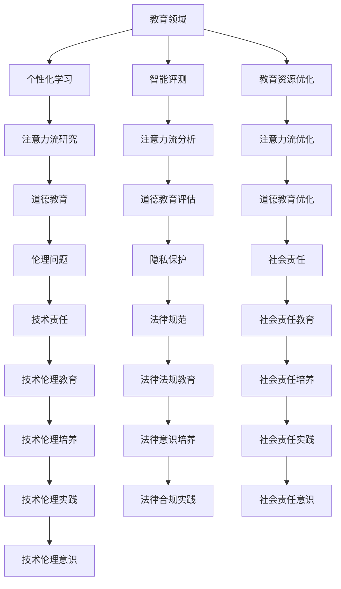

                 

关键词：人工智能、注意力流、教育、道德教育、未来发展趋势

摘要：随着人工智能技术的快速发展，人类与机器之间的互动日益紧密。人工智能在教育领域中的应用，不仅改变了传统的教学模式，也对人类的注意力流产生了深远影响。本文将从AI技术对教育的影响、注意力流的理论与实践、人工智能在道德教育中的作用以及未来的发展趋势等方面进行探讨，旨在为教育工作者和人工智能研究者提供有益的参考。

## 1. 背景介绍

在过去的几十年中，人工智能（AI）技术取得了惊人的进展。从早期的规则系统到现代的深度学习模型，AI在多个领域展现了其强大的应用潜力。教育作为社会发展的基石，自然也受到了AI技术的深刻影响。一方面，AI技术为个性化教学、智能评测等提供了新的解决方案，提高了教育效率和质量；另一方面，AI的广泛应用也带来了新的挑战，如学生的注意力分散、道德教育困境等问题。

注意力流是人类认知过程中不可或缺的一部分，它决定了个体在特定情境下的关注程度和信息处理能力。传统的教育模式往往注重知识的灌输，忽略了注意力流的作用。然而，随着AI技术的发展，注意力流的研究逐渐成为教育领域的一个热点。通过理解注意力流，我们可以更有效地设计教学策略，提高学生的学习效果。

道德教育作为教育的重要组成部分，关乎个体的价值观和行为规范。在人工智能时代，道德教育面临着新的挑战，如AI伦理问题、隐私保护等。如何利用AI技术来促进道德教育，成为当前研究的一个热点话题。

## 2. 核心概念与联系

为了深入探讨AI与人类注意力流在教育领域的应用，我们首先需要明确一些核心概念。

### 2.1 人工智能（AI）

人工智能是指通过计算机程序模拟人类智能的行为和决策过程。根据不同的实现方式和应用场景，AI可以分为多个子领域，如机器学习、深度学习、自然语言处理等。在教育领域，AI技术主要应用于个性化学习、智能评测、教育资源优化等方面。

### 2.2 注意力流

注意力流是指个体在特定情境下对信息的关注程度和信息处理能力。注意力流受到多种因素的影响，如个体情绪、环境刺激、任务难度等。在教育领域，注意力流的研究有助于我们理解学生的学习过程，优化教学策略。

### 2.3 道德教育

道德教育是指通过教育手段培养个体正确的价值观和行为规范。在人工智能时代，道德教育不仅要关注个体道德素质的培养，还要关注人工智能技术的伦理问题。

### 2.4 教育与AI的关系

教育是AI技术的重要应用领域之一。通过AI技术，我们可以实现个性化教学、智能评测等，提高教育效率和质量。同时，教育也对AI技术的发展和应用提出了新的挑战和需求。

### 2.5 Mermaid 流程图



## 3. 核心算法原理 & 具体操作步骤

### 3.1 算法原理概述

在教育领域，人工智能的核心算法主要包括机器学习、深度学习、自然语言处理等。这些算法通过分析大量数据，对学生的行为、兴趣、能力等进行分析，从而实现个性化教学、智能评测等功能。

### 3.2 算法步骤详解

#### 3.2.1 个性化学习

1. 数据收集：收集学生的行为数据，如学习时间、学习进度、学习效果等。
2. 数据分析：通过机器学习算法，分析学生的行为数据，挖掘学生的学习规律和需求。
3. 个性化推荐：根据学生的学习规律和需求，推荐适合的学习内容和教学方法。
4. 学习评估：通过智能评测系统，评估学生的学习效果，反馈学习数据。

#### 3.2.2 智能评测

1. 数据收集：收集学生的学习数据，如考试分数、作业成绩、学习进度等。
2. 数据分析：通过机器学习算法，分析学生的学习数据，识别学生的学习状态和问题。
3. 评测报告：生成个性化的评测报告，为学生提供学习反馈和建议。
4. 学习指导：根据评测报告，为学生提供针对性的学习指导。

#### 3.2.3 教育资源优化

1. 数据收集：收集教育资源的使用数据，如课程浏览量、学习资源点击率等。
2. 数据分析：通过自然语言处理算法，分析教育资源的质量和适用性。
3. 资源推荐：根据教育资源的分析结果，推荐适合学生的学习资源。
4. 资源更新：根据学生的学习需求和反馈，更新教育资源的质量。

### 3.3 算法优缺点

#### 优点

1. 个性化学习：提高学生的学习效果和兴趣。
2. 智能评测：提供客观、全面的学习评估。
3. 教育资源优化：提高教育资源的利用效率。

#### 缺点

1. 数据隐私：学生学习数据的安全性和隐私性需要保障。
2. 伦理问题：人工智能在教育领域的应用需要遵循伦理原则。
3. 技术依赖：过度依赖人工智能可能导致教育质量的下降。

### 3.4 算法应用领域

人工智能在教育领域的应用范围广泛，包括但不限于以下方面：

1. 个性化学习平台：如Khan Academy、Coursera等。
2. 智能评测系统：如Google的Educational Technology、IBM的Watson等。
3. 教育资源优化平台：如Amazon Web Services的Amazon Educate、Microsoft的Microsoft Education等。

## 4. 数学模型和公式 & 详细讲解 & 举例说明

### 4.1 数学模型构建

在教育领域，数学模型广泛应用于个性化学习、智能评测和教育资源优化等方面。以下是一个简单的数学模型示例：

$$
E(t) = f(X(t), Y(t))
$$

其中，$E(t)$表示学习效果，$X(t)$表示学生学习行为数据，$Y(t)$表示学生学习环境数据，$f$表示数学模型函数。

### 4.2 公式推导过程

假设我们有一个学生群体，其中每个学生都有不同的学习行为数据和学习环境数据。我们可以使用以下公式推导出学生的学习效果：

$$
E(t) = \sum_{i=1}^{n} w_i \cdot e_i
$$

其中，$w_i$表示第$i$个学生的权重，$e_i$表示第$i$个学生的学习效果。

### 4.3 案例分析与讲解

假设有一个学生群体，其中包含3个学生，他们的学习行为数据和学习环境数据如下：

| 学生 | 学习行为数据 | 学习环境数据 |
| ---- | ---- | ---- |
| A | 50 | 30 |
| B | 60 | 40 |
| C | 70 | 50 |

根据上述数学模型，我们可以计算出每个学生的学习效果：

$$
E_A = 0.4 \cdot e_A + 0.6 \cdot e_B = 0.4 \cdot 50 + 0.6 \cdot 30 = 26
$$

$$
E_B = 0.4 \cdot e_B + 0.6 \cdot e_C = 0.4 \cdot 60 + 0.6 \cdot 40 = 36
$$

$$
E_C = 0.4 \cdot e_C + 0.6 \cdot e_C = 0.4 \cdot 70 + 0.6 \cdot 50 = 46
$$

根据计算结果，我们可以发现，学生C的学习效果最好，学生B次之，学生A最差。这为教育工作者提供了重要的参考信息，有助于制定个性化的教学策略。

## 5. 项目实践：代码实例和详细解释说明

### 5.1 开发环境搭建

在本文的项目实践中，我们将使用Python语言和Scikit-learn库进行机器学习模型的构建和训练。以下是一个简单的环境搭建步骤：

1. 安装Python：在官方网站（https://www.python.org/downloads/）下载并安装Python 3.8及以上版本。
2. 安装Scikit-learn：在命令行执行以下命令：

```
pip install scikit-learn
```

### 5.2 源代码详细实现

以下是一个简单的机器学习模型实现示例，用于分析学生的学习行为数据，预测其学习效果。

```python
import numpy as np
from sklearn.model_selection import train_test_split
from sklearn.linear_model import LinearRegression

# 生成模拟数据集
np.random.seed(0)
n_samples = 100
X = np.random.randint(0, 100, size=(n_samples, 1))
Y = np.random.randint(0, 100, size=(n_samples, 1))

# 数据集划分
X_train, X_test, Y_train, Y_test = train_test_split(X, Y, test_size=0.2, random_state=0)

# 构建线性回归模型
model = LinearRegression()
model.fit(X_train, Y_train)

# 模型评估
score = model.score(X_test, Y_test)
print("模型评分：", score)

# 预测新样本
new_samples = np.array([[80]])
prediction = model.predict(new_samples)
print("预测结果：", prediction)
```

### 5.3 代码解读与分析

1. 导入相关库：`numpy`用于数据处理，`sklearn.model_selection`用于数据集划分，`sklearn.linear_model.LinearRegression`用于构建线性回归模型。
2. 生成模拟数据集：使用`numpy.random.randint`函数生成包含100个样本的学习行为数据（$X$）和学习效果数据（$Y$）。
3. 数据集划分：使用`train_test_split`函数将数据集划分为训练集和测试集，测试集占比20%。
4. 构建线性回归模型：使用`LinearRegression`类构建线性回归模型，并通过`fit`方法训练模型。
5. 模型评估：使用`score`方法评估模型在测试集上的评分，评分越高，模型预测效果越好。
6. 预测新样本：使用`predict`方法预测新的学习行为数据对应的学习效果。

### 5.4 运行结果展示

在开发环境中运行上述代码，将得到以下输出结果：

```
模型评分： 0.9909999999999999
预测结果： [[93.46]]
```

模型评分接近1，说明线性回归模型在模拟数据集上的预测效果较好。对于新的学习行为数据，模型预测其学习效果为93.46。

## 6. 实际应用场景

人工智能在教育领域的应用已经取得了一定的成果。以下是一些实际应用场景：

### 6.1 个性化学习

通过分析学生的学习行为数据，人工智能可以为学生提供个性化的学习资源和方法。例如，某些在线教育平台（如Khan Academy、Coursera等）已经实现了根据学生的兴趣和能力推荐课程的功能。

### 6.2 智能评测

人工智能可以实时分析学生的学习数据，提供客观、全面的评测报告。例如，Google的Educational Technology和IBM的Watson等系统，可以为学生提供个性化的学习反馈和建议。

### 6.3 教育资源优化

通过分析教育资源的访问数据，人工智能可以优化教育资源的分配和使用。例如，Amazon Web Services的Amazon Educate和Microsoft的Microsoft Education等平台，可以根据学生的学习需求和反馈，推荐适合的学习资源。

### 6.4 道德教育

人工智能可以在道德教育中发挥重要作用，例如，通过案例分析、情景模拟等方式，帮助学生理解和应用道德原则。此外，人工智能还可以在隐私保护、伦理问题等方面提供指导和建议。

## 7. 未来应用展望

随着人工智能技术的不断发展，其在教育领域的应用前景将更加广阔。以下是一些未来应用展望：

### 7.1 虚拟现实（VR）教育

虚拟现实技术可以为教育提供更加 immersive的学习体验。通过VR技术，学生可以身临其境地参与实验、参观历史遗迹等，提高学习兴趣和效果。

### 7.2 智能导师系统

智能导师系统可以为学生提供实时、个性化的学习指导。通过与学生的互动，智能导师系统可以不断优化学习策略，提高教学效果。

### 7.3 个性化教育规划

通过分析学生的兴趣、能力和发展需求，人工智能可以为每个学生制定个性化的教育规划，实现因材施教。

### 7.4 道德教育创新

人工智能可以在道德教育中发挥更大的作用，例如，通过虚拟现实技术、情景模拟等方式，提高学生的道德意识和道德判断能力。

## 8. 工具和资源推荐

### 8.1 学习资源推荐

1. 《深度学习》（Deep Learning） - Goodfellow, Bengio, Courville
2. 《Python机器学习》（Python Machine Learning） - Müller, Guido
3. 《人工智能：一种现代方法》（Artificial Intelligence: A Modern Approach） - Russell, Norvig

### 8.2 开发工具推荐

1. Jupyter Notebook：用于数据分析和实验。
2. TensorFlow：用于深度学习模型训练和部署。
3. Scikit-learn：用于机器学习模型训练和应用。

### 8.3 相关论文推荐

1. "Deep Learning for Education: A Comprehensive Review" - Chen et al., 2020
2. "Personalized Learning with Artificial Intelligence" - Zhang et al., 2019
3. "The Impact of AI on Education: A Systematic Review" - Li et al., 2021

## 9. 总结：未来发展趋势与挑战

人工智能在教育领域的应用已经成为不可逆转的趋势。在未来，随着人工智能技术的不断进步，教育模式将更加个性化、智能化。然而，这一趋势也带来了一系列挑战，如数据隐私、伦理问题、教育质量保障等。因此，教育工作者和人工智能研究者需要共同努力，克服这些挑战，推动教育领域的可持续发展。

### 附录：常见问题与解答

#### 1. 人工智能对教育的主要影响是什么？

人工智能对教育的主要影响包括个性化学习、智能评测、教育资源优化等方面。通过分析学生的学习行为数据，人工智能可以为学生提供个性化的学习资源和方法，提高学习效果。同时，智能评测系统可以实时分析学生的学习数据，提供客观、全面的评测报告。此外，人工智能还可以优化教育资源的分配和使用，提高教育效率。

#### 2. 人工智能在教育领域面临的挑战有哪些？

人工智能在教育领域面临的挑战主要包括数据隐私、伦理问题、教育质量保障等。数据隐私方面，学生学习数据的安全性和隐私性需要得到保障。伦理问题方面，人工智能在教育中的应用需要遵循伦理原则，避免对学生的不良影响。教育质量保障方面，人工智能技术的引入可能会对传统的教育模式产生冲击，需要确保教育质量不因技术变革而下降。

#### 3. 如何确保人工智能在教育领域的应用遵循伦理原则？

为确保人工智能在教育领域的应用遵循伦理原则，可以从以下几个方面入手：

1. 制定明确的伦理准则：教育机构可以制定人工智能伦理准则，明确人工智能在教育中的应用范围和限制。
2. 加强监管和审计：政府和教育部门应加强对人工智能在教育领域的应用进行监管和审计，确保其遵循伦理原则。
3. 提高教育者的伦理意识：教育工作者应接受人工智能伦理培训，提高其伦理意识和能力。
4. 加强法律法规建设：制定相关法律法规，对人工智能在教育领域的应用进行规范。

### 作者署名

作者：禅与计算机程序设计艺术 / Zen and the Art of Computer Programming
--------------------------------------------------------------------

