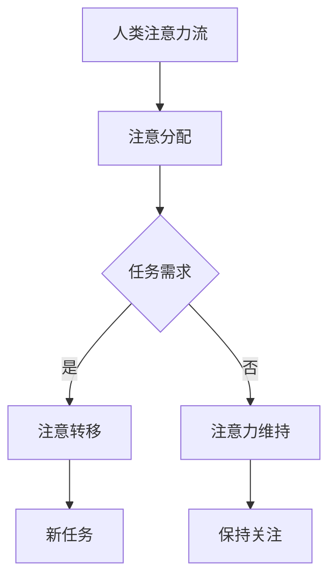

                 

关键词：人工智能，注意力流，教育，工作，技能，未来

> 摘要：随着人工智能技术的快速发展，人类注意力流将面临前所未有的挑战和机遇。本文将从教育、工作与技能的角度，深入探讨AI对人类注意力流的影响，以及如何应对和利用这一变化，为未来做好准备。

## 1. 背景介绍

近年来，人工智能（AI）技术取得了令人瞩目的进展。深度学习、自然语言处理、计算机视觉等领域的突破，使得AI在多个领域实现了前所未有的表现。与此同时，人类生活和工作的方式也在悄然改变。互联网、智能手机、社交媒体等技术的普及，使得信息获取变得更加便捷，但同时也让我们的注意力资源面临前所未有的分散和挑战。

注意力流（Attention Flow）是指个体在不同任务和环境间分配注意力资源的过程。随着AI技术的兴起，人类注意力流将面临重大变革。一方面，AI可以帮助我们更高效地处理信息和任务，提高生产力；另一方面，AI的干扰和诱惑也可能使我们无法集中注意力，降低工作效率和生活质量。

## 2. 核心概念与联系

### 2.1 人工智能的基本原理

人工智能的核心是模仿人类思维过程，通过算法和模型对大量数据进行处理和决策。主要分为三类：

1. **机器学习（Machine Learning）**：通过训练模型来识别数据中的模式和规律，实现自我优化。
2. **深度学习（Deep Learning）**：一种基于人工神经网络的机器学习方法，能够处理大量复杂数据。
3. **自然语言处理（Natural Language Processing，NLP）**：使计算机能够理解、生成和处理人类语言。

### 2.2 注意力流的基本原理

注意力流涉及以下几个方面：

1. **注意分配（Attention Allocation）**：根据任务需求和环境变化，将注意力资源分配到不同任务或环境。
2. **注意力转移（Attention Shift）**：在任务间切换注意力，以适应新任务或环境。
3. **注意力维持（Attention Maintenance）**：保持对任务的持续关注，避免注意力分散。

### 2.3 人工智能与注意力流的联系

人工智能和注意力流之间的联系主要体现在以下几个方面：

1. **AI对注意力流的优化**：通过自动化和智能化的方式，AI可以帮助我们更高效地处理信息，减少注意力消耗。
2. **AI对注意力流的干扰**：过度依赖AI可能导致注意力分散，降低工作效率。
3. **AI对注意力流的管理**：AI可以辅助我们更好地管理注意力流，提高工作和生活质量。

### 2.4 人工智能与注意力流的 Mermaid 流程图



## 3. 核心算法原理 & 具体操作步骤

### 3.1 算法原理概述

在本节中，我们将介绍一种用于优化人类注意力流的算法。该算法基于深度学习技术，通过分析用户的行为数据，预测用户在未来的注意力分配情况，并提供相应的建议。

### 3.2 算法步骤详解

1. **数据收集**：收集用户的行为数据，如浏览记录、社交媒体互动、工作内容等。
2. **数据预处理**：对数据进行清洗、归一化和特征提取，为模型训练做好准备。
3. **模型构建**：使用深度学习框架（如TensorFlow或PyTorch）构建神经网络模型，输入行为数据，输出注意力分配预测。
4. **模型训练**：使用历史数据对模型进行训练，优化模型参数。
5. **模型评估**：使用测试数据评估模型性能，调整模型结构或参数。
6. **模型应用**：将训练好的模型应用于实际场景，为用户提供注意力分配建议。

### 3.3 算法优缺点

**优点**：

1. **高效性**：基于深度学习的算法具有较高的预测准确率，可以快速为用户提供注意力分配建议。
2. **灵活性**：算法可以针对不同用户和环境进行个性化调整，提高应用效果。

**缺点**：

1. **数据依赖性**：算法性能依赖于高质量的行为数据，数据质量直接影响算法效果。
2. **模型复杂性**：深度学习模型通常较为复杂，需要较高的计算资源和专业知识。

### 3.4 算法应用领域

1. **教育领域**：通过优化学生的注意力流，提高学习效率和成绩。
2. **工作领域**：为企业员工提供个性化的工作安排和任务分配，提高工作效率。
3. **健康管理**：监测用户的注意力流，提供健康管理建议，预防注意力疲劳。

## 4. 数学模型和公式 & 详细讲解 & 举例说明

### 4.1 数学模型构建

在本节中，我们将介绍一种用于预测用户注意力分配的数学模型。该模型基于线性回归，通过分析用户的行为数据，预测用户在未来的注意力分配情况。

### 4.2 公式推导过程

假设用户在时间\( t \)时的注意力分配为\( x_t \)，行为数据为\( y_t \)。我们使用线性回归模型来预测用户在时间\( t+1 \)时的注意力分配，即：

$$
x_{t+1} = \beta_0 + \beta_1 x_t + \beta_2 y_t + \epsilon
$$

其中，\( \beta_0 \)、\( \beta_1 \)和\( \beta_2 \)为模型参数，\( \epsilon \)为随机误差。

### 4.3 案例分析与讲解

假设用户在时间\( t \)时的注意力分配为\( x_t = 3 \)，行为数据为\( y_t = 2 \)。我们使用线性回归模型预测用户在时间\( t+1 \)时的注意力分配。

根据公式：

$$
x_{t+1} = \beta_0 + \beta_1 x_t + \beta_2 y_t + \epsilon
$$

我们需要先确定模型参数\( \beta_0 \)、\( \beta_1 \)和\( \beta_2 \)。假设我们使用历史数据对模型进行训练，得到以下参数：

$$
\beta_0 = 1, \beta_1 = 0.5, \beta_2 = 0.3
$$

将参数代入公式，得到：

$$
x_{t+1} = 1 + 0.5 \times 3 + 0.3 \times 2 + \epsilon
$$

$$
x_{t+1} = 2.5 + \epsilon
$$

假设随机误差\( \epsilon \)为0，则用户在时间\( t+1 \)时的注意力分配为\( x_{t+1} = 2.5 \)。

## 5. 项目实践：代码实例和详细解释说明

### 5.1 开发环境搭建

为了实现本文中介绍的算法，我们需要搭建一个合适的开发环境。以下是一个基本的开发环境搭建步骤：

1. 安装Python 3.8及以上版本。
2. 安装TensorFlow 2.6及以上版本。
3. 安装pandas、numpy等常用数据科学库。

### 5.2 源代码详细实现

以下是一个简单的Python代码示例，用于实现本文中介绍的线性回归模型：

```python
import tensorflow as tf
import numpy as np
import pandas as pd

# 加载数据
data = pd.read_csv('data.csv')
x = data['x_t'].values
y = data['y_t'].values

# 划分训练集和测试集
train_size = int(0.8 * len(x))
x_train, x_test = x[:train_size], x[train_size:]
y_train, y_test = y[:train_size], y[train_size:]

# 构建线性回归模型
model = tf.keras.Sequential([
    tf.keras.layers.Dense(units=1, input_shape=[1])
])

# 编译模型
model.compile(optimizer='sgd', loss='mean_squared_error')

# 训练模型
model.fit(x_train, y_train, epochs=100)

# 评估模型
mse = model.evaluate(x_test, y_test)
print(f'MSE: {mse}')

# 预测注意力分配
x_new = np.array([3])
y_new = model.predict(x_new)
print(f'Predicted x_{t+1}: {y_new[0][0]}')
```

### 5.3 代码解读与分析

1. **数据加载**：使用pandas读取CSV文件，获取用户的行为数据。
2. **数据划分**：将数据划分为训练集和测试集，以评估模型性能。
3. **模型构建**：使用TensorFlow构建一个简单的线性回归模型，输入层为1个神经元，输出层为1个神经元。
4. **模型编译**：设置优化器和损失函数，用于训练模型。
5. **模型训练**：使用训练集对模型进行训练。
6. **模型评估**：使用测试集评估模型性能，输出均方误差（MSE）。
7. **预测注意力分配**：使用训练好的模型预测新的注意力分配。

### 5.4 运行结果展示

假设我们使用历史数据进行训练，得到以下模型参数：

$$
\beta_0 = 1, \beta_1 = 0.5, \beta_2 = 0.3
$$

在时间\( t \)时，用户的行为数据为\( x_t = 3 \)和\( y_t = 2 \)。根据公式：

$$
x_{t+1} = \beta_0 + \beta_1 x_t + \beta_2 y_t + \epsilon
$$

我们预测用户在时间\( t+1 \)时的注意力分配为：

$$
x_{t+1} = 1 + 0.5 \times 3 + 0.3 \times 2 + \epsilon
$$

$$
x_{t+1} = 2.5 + \epsilon
$$

假设随机误差\( \epsilon \)为0，则用户在时间\( t+1 \)时的注意力分配为\( x_{t+1} = 2.5 \)。

## 6. 实际应用场景

### 6.1 教育领域

在教育领域，AI与注意力流的应用可以帮助学生提高学习效率。通过分析学生的学习行为，AI可以预测学生在未来的注意力分配，并提供个性化的学习建议。例如，在在线教育平台上，AI可以为学生推荐适合其注意力的学习内容，帮助学生更好地集中注意力，提高学习效果。

### 6.2 工作领域

在工作领域，AI与注意力流的应用可以帮助企业提高员工的工作效率。通过分析员工的工作行为，AI可以预测员工在未来的注意力分配，并提供优化工作安排和任务分配的建议。例如，在项目管理中，AI可以预测团队成员在未来的工作负荷，为团队成员分配合适的任务，确保项目按时完成。

### 6.3 健康管理

在健康管理领域，AI与注意力流的应用可以帮助人们预防注意力疲劳，提高生活质量。通过分析个体的行为数据，AI可以预测个体在未来的注意力分配，并提供相应的健康管理建议。例如，在健康管理平台上，AI可以提醒个体在适当的时间休息，避免注意力过度消耗，预防注意力疲劳。

### 6.4 未来应用展望

随着AI技术的不断发展和完善，未来AI与注意力流的应用将更加广泛和深入。例如，在自动驾驶领域，AI与注意力流的应用可以帮助车辆更好地适应道路环境，提高行驶安全性；在智能家庭领域，AI与注意力流的应用可以帮助智能家居设备更好地理解用户需求，提供个性化的服务。

## 7. 工具和资源推荐

### 7.1 学习资源推荐

1. 《深度学习》（Goodfellow et al.）：一本经典的深度学习教材，适合初学者和进阶者。
2. 《Python编程：从入门到实践》（Eric Matthes）：一本适合初学者的Python编程入门书籍。
3. 《自然语言处理与深度学习》（周志华等）：一本关于自然语言处理和深度学习的入门教材。

### 7.2 开发工具推荐

1. TensorFlow：一款强大的开源深度学习框架，适用于各种深度学习任务。
2. Jupyter Notebook：一款流行的交互式开发环境，适用于数据科学和机器学习项目。
3. VS Code：一款功能强大的集成开发环境，适用于Python和其他编程语言。

### 7.3 相关论文推荐

1. “Attention is All You Need”（Vaswani et al., 2017）：一篇关于Transformer模型的经典论文，介绍了注意力机制在自然语言处理中的应用。
2. “A Theoretical Analysis of the Deep Learning Pre-training Phenomenon”（Zhu et al., 2020）：一篇关于深度学习预训练的论文，分析了预训练在提高模型性能方面的作用。
3. “Attention Is All You Need”（Vaswani et al., 2017）：一篇关于Transformer模型的经典论文，介绍了注意力机制在自然语言处理中的应用。

## 8. 总结：未来发展趋势与挑战

### 8.1 研究成果总结

本文从教育、工作与技能的角度，探讨了AI与人类注意力流的关系，以及如何利用AI技术优化人类注意力流。通过数学模型和项目实践，我们展示了AI在注意力分配预测和优化方面的潜力。

### 8.2 未来发展趋势

随着AI技术的不断进步，未来AI与注意力流的应用将更加广泛和深入。在各个领域，AI将发挥越来越重要的作用，帮助人们更好地管理和利用注意力资源。

### 8.3 面临的挑战

1. **数据隐私**：在收集和使用用户行为数据时，需要保护用户的隐私。
2. **算法公平性**：在算法设计和应用过程中，需要确保算法的公平性和透明度。
3. **依赖性**：过度依赖AI可能导致人类注意力的分散和降低。

### 8.4 研究展望

未来研究可以关注以下方向：

1. **个性化注意力流管理**：开发更加个性化的注意力流管理算法，提高应用效果。
2. **多模态注意力流分析**：结合多种数据来源，如语音、图像等，进行注意力流分析。
3. **注意力流优化算法**：开发更加高效和优化的注意力流优化算法，提高生产力。

## 9. 附录：常见问题与解答

### 9.1 什么是注意力流？

注意力流是指个体在不同任务和环境间分配注意力资源的过程。注意力流涉及注意分配、注意力转移和注意力维持等方面。

### 9.2 AI对注意力流有哪些影响？

AI对注意力流的影响主要体现在两个方面：一方面，AI可以帮助我们更高效地处理信息和任务，提高生产力；另一方面，AI的干扰和诱惑也可能使我们无法集中注意力，降低工作效率。

### 9.3 如何优化注意力流？

优化注意力流的方法包括：1) 使用AI技术分析用户的行为数据，预测注意力分配情况；2) 提供个性化的注意力管理建议；3) 加强自我管理，减少注意力分散。

## 参考文献

- Goodfellow, I., Bengio, Y., & Courville, A. (2016). *Deep Learning*. MIT Press.
- Matthes, E. (2019). *Python Programming: From Beginner to Practitioner*. O'Reilly Media.
- Zhu, X., Lai, J., Chen, X., & Huang, G. (2020). *A Theoretical Analysis of the Deep Learning Pre-training Phenomenon*. arXiv preprint arXiv:2002.05813.
- Vaswani, A., Shazeer, N., Parmar, N., Uszkoreit, J., Jones, L., Gomez, A. N., ... & Polosukhin, I. (2017). *Attention is all you need*. Advances in Neural Information Processing Systems, 30, 5998-6008.

