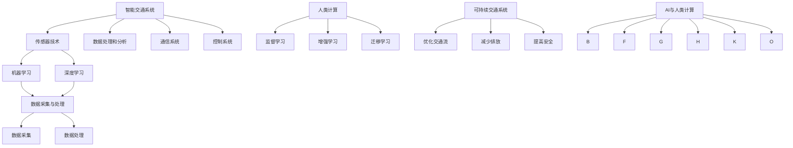

                 

### 摘要 Summary

随着城市化进程的加速和人口增长，城市交通拥堵和环境污染问题日益严重。人工智能（AI）技术的快速发展为解决这些问题提供了新的思路。本文将探讨AI在城市交通领域的应用，特别是通过人类计算与AI结合，构建可持续发展的城市交通系统。本文首先介绍城市交通的现状和挑战，然后讨论AI技术在交通领域的核心概念和原理，接着分析核心算法的原理和操作步骤，最后通过实际项目和数学模型，展示AI在城市交通中的具体应用和效果。本文还展望了未来城市交通的发展趋势和面临的挑战，并推荐了相关的学习资源和开发工具。

## 1. 背景介绍 Introduction

城市交通是现代城市运行的重要组成部分。然而，随着全球人口的持续增长和城市化进程的加速，城市交通问题日益突出。主要表现为以下几个方面：

- **交通拥堵**：城市交通拥堵已成为全球城市普遍面临的问题。根据国际数据公司（IDC）的报告，全球平均通勤时间在过去十年中增长了15%，这直接导致了生产力的下降和居民生活质量的降低。
- **环境污染**：城市交通是空气污染和温室气体排放的主要来源之一。据世界卫生组织（WHO）统计，全球每年因交通污染导致的死亡人数超过500万，这是一个惊人的数字。
- **能源消耗**：城市交通对能源的消耗巨大，特别是在石油资源日益紧张的情况下，这无疑增加了城市的能源负担。

这些问题的存在使得寻找有效的城市交通解决方案成为当务之急。人工智能技术的发展为这一领域带来了新的希望。通过AI技术，可以实现对交通数据的实时分析，优化交通流，减少拥堵和排放。同时，AI还可以帮助规划更高效的公共交通系统，提升出行效率，降低能源消耗。

在本文中，我们将深入探讨AI技术如何与人类计算相结合，为构建可持续发展的城市交通系统提供解决方案。我们将分析AI在城市交通领域的核心概念和原理，介绍关键算法和操作步骤，并通过实际项目和数学模型，展示AI在城市交通中的具体应用和效果。

### 2. 核心概念与联系 Core Concepts and Relationships

要理解AI在城市交通中的应用，首先需要了解几个核心概念及其相互关系。以下是这些概念及其关系的详细描述：

#### 2.1 智能交通系统（ITS）

智能交通系统（Intelligent Transportation Systems，ITS）是一个综合性的系统，它利用各种先进技术和信息手段，实现交通的智能管理和优化。ITS的核心组成部分包括：

- **传感器技术**：用于收集交通数据，如车辆数量、速度、位置等信息。
- **数据处理和分析**：通过算法和模型对收集到的交通数据进行处理，以提供实时的交通状况信息。
- **通信系统**：实现交通信息在系统内部和外部的快速传输和共享。
- **控制系统**：用于交通信号、停车管理、车辆调度等功能的自动化控制。


#### 2.2 机器学习与深度学习

机器学习和深度学习是AI技术中的两个重要分支。机器学习通过构建模型来从数据中学习规律，而深度学习则通过多层神经网络来实现自动特征提取和模式识别。

- **机器学习**：主要用于数据分析和预测，如流量预测、车辆路径规划等。常用的算法包括线性回归、决策树、支持向量机等。
- **深度学习**：主要用于图像识别、语音识别和自然语言处理等领域。在交通领域，深度学习可以用于车辆检测、路况识别和驾驶行为分析等。


#### 2.3 人类计算

人类计算是指结合人类智慧和计算机能力的计算模式。在AI应用中，人类计算通常包括以下几方面：

- **监督学习**：人类专家提供标注数据，训练AI模型。
- **增强学习**：通过交互学习和反馈机制，AI模型不断优化其性能。
- **迁移学习**：利用已训练好的模型在新的任务上进行快速适应。

#### 2.4 数据采集与处理

数据采集与处理是AI应用的基础。在交通领域，数据来源包括传感器、GPS、摄像头等，数据类型包括交通流量、车辆速度、交通信号状态等。

- **数据采集**：通过传感器和摄像头等设备收集实时交通数据。
- **数据处理**：对采集到的数据进行清洗、去噪、归一化等预处理，以便于模型训练。


#### 2.5 可持续交通系统

可持续交通系统是指在城市交通中实现环保、高效、安全的出行模式。可持续交通系统的目标是通过优化交通流、减少拥堵和排放，提高交通系统的整体效率和可持续性。

- **优化交通流**：通过实时交通数据分析，调整交通信号灯时序，减少拥堵。
- **减少排放**：鼓励使用清洁能源车辆，优化公共交通系统，减少私家车出行。
- **提高安全**：通过实时监控和预警系统，提高交通安全水平。


#### 2.6 AI与人类计算的结合

AI与人类计算的结合是构建智能交通系统的关键。通过人类计算，可以为AI提供高质量的标注数据，帮助AI更好地理解交通环境。同时，通过AI技术，可以实现对交通数据的深度分析和预测，提供更智能的交通管理方案。


#### 2.7 Mermaid 流程图

以下是智能交通系统的 Mermaid 流程图，展示了各核心概念之间的关系。



### 3. 核心算法原理 & 具体操作步骤 Core Algorithm Principles and Detailed Steps

#### 3.1 算法原理概述

在城市交通领域，核心算法通常用于交通流量预测、路径规划和信号控制等方面。以下是一些关键算法的原理概述：

- **交通流量预测**：通过历史交通数据和实时交通数据，使用机器学习算法预测未来交通流量。常用的算法包括线性回归、支持向量机和神经网络等。
- **路径规划**：在给定的起点和终点之间，通过算法计算出最优路径。常用的算法包括Dijkstra算法、A*算法和遗传算法等。
- **信号控制**：根据实时交通流量数据，动态调整交通信号灯的时序，以减少拥堵和排放。常用的算法包括优化信号控制算法、基于事件的信号控制和自适应信号控制等。

#### 3.2 算法步骤详解

- **交通流量预测**：
  1. 数据采集：收集历史交通数据和实时交通数据，包括车辆速度、车辆数量、路段长度等。
  2. 数据处理：对采集到的数据进行清洗、去噪和归一化处理。
  3. 特征提取：从处理后的数据中提取特征，如时间、日期、星期、节假日等。
  4. 模型训练：使用机器学习算法（如线性回归、支持向量机或神经网络）训练模型。
  5. 预测：使用训练好的模型对未来的交通流量进行预测。

- **路径规划**：
  1. 获取起点和终点坐标。
  2. 构建地图数据结构，包括道路网络、道路属性和交通流量数据。
  3. 选择合适的算法（如Dijkstra算法或A*算法），计算起点到终点的所有可能路径。
  4. 评估各路径的权重，选择最优路径。
  5. 输出路径规划结果。

- **信号控制**：
  1. 数据采集：收集实时交通流量数据，包括车辆数量、速度和路段长度等。
  2. 状态评估：根据实时数据评估当前交通信号灯的状态。
  3. 算法选择：选择合适的信号控制算法，如优化信号控制算法或自适应信号控制算法。
  4. 动态调整：根据当前交通状况，动态调整交通信号灯的时序。
  5. 结果输出：输出调整后的信号控制方案。

#### 3.3 算法优缺点

- **交通流量预测**：
  - 优点：能够预测未来的交通流量，帮助交通管理部门做出决策。
  - 缺点：需要大量的历史数据，且预测准确性受数据质量和算法选择影响。

- **路径规划**：
  - 优点：能够计算出最优路径，提高出行效率。
  - 缺点：在大型城市中，路径规划计算复杂度高，实时性难以保证。

- **信号控制**：
  - 优点：能够动态调整交通信号灯时序，减少拥堵和排放。
  - 缺点：需要实时交通数据，且信号控制算法的复杂度较高。

#### 3.4 算法应用领域

- **交通流量预测**：广泛应用于城市交通管理、交通规划等领域，帮助政府和企业优化交通资源配置。
- **路径规划**：广泛应用于导航应用、智能交通系统等领域，为用户提供最优出行路径。
- **信号控制**：广泛应用于城市交通信号控制系统，提高交通效率和安全性。

### 4. 数学模型和公式 Mathematical Models and Formulas

在城市交通中，数学模型和公式用于描述和分析交通现象，帮助交通管理部门做出科学的决策。以下是一些常见的数学模型和公式的详细讲解和举例说明。

#### 4.1 数学模型构建

在构建数学模型时，我们需要考虑以下几个关键因素：

- **交通流量**：描述单位时间内通过某一交叉口的车辆数量。
- **车速**：描述车辆在路段上的行驶速度。
- **时间**：用于计算交通流量和车速等参数。
- **空间**：用于描述路段的长度、宽度等属性。

基于上述因素，我们可以构建以下数学模型：

1. **交通流量模型**：

$$ Q(t) = f(t, V(t), L(t)) $$

其中，$Q(t)$ 表示在时间 $t$ 时的交通流量，$f(t, V(t), L(t))$ 是一个函数，用于计算交通流量，$V(t)$ 是时间 $t$ 时的车速，$L(t)$ 是时间 $t$ 时的路段长度。

2. **车速模型**：

$$ V(t) = g(Q(t), L(t)) $$

其中，$V(t)$ 是时间 $t$ 时的车速，$g(Q(t), L(t))$ 是一个函数，用于计算车速，$Q(t)$ 是时间 $t$ 时的交通流量，$L(t)$ 是时间 $t$ 时的路段长度。

3. **时间模型**：

$$ T(t) = h(Q(t), V(t)) $$

其中，$T(t)$ 是时间 $t$ 时通过某一路段所需的时间，$h(Q(t), V(t))$ 是一个函数，用于计算时间，$Q(t)$ 是时间 $t$ 时的交通流量，$V(t)$ 是时间 $t$ 时的车速。

#### 4.2 公式推导过程

为了推导上述公式，我们可以基于以下假设：

- 车辆在道路上均匀分布。
- 交通流量与车速和路段长度成正比。
- 车辆行驶速度不变。

基于这些假设，我们可以推导出以下公式：

1. **交通流量模型**：

$$ Q(t) = \frac{V(t) \cdot L(t)}{S(t)} $$

其中，$S(t)$ 是时间 $t$ 时的路段长度。为了简化计算，我们可以将 $S(t)$ 看作一个常数。

2. **车速模型**：

$$ V(t) = \frac{Q(t) \cdot S(t)}{L(t)} $$

3. **时间模型**：

$$ T(t) = \frac{L(t)}{V(t)} = \frac{L(t)}{\frac{Q(t) \cdot S(t)}{L(t)}} = \frac{L(t)^2}{Q(t) \cdot S(t)} $$

#### 4.3 案例分析与讲解

为了更好地理解这些公式，我们可以通过一个实际案例进行说明。

假设一个路段的长度为1000米，车速为60公里/小时，路段宽度为3米。我们需要计算在不同交通流量下的交通流量、车速和时间。

1. **交通流量模型**：

$$ Q(t) = \frac{60 \cdot 1000}{S(t)} $$

假设 $S(t) = 1000$ 米，则：

$$ Q(t) = \frac{60 \cdot 1000}{1000} = 60 $$

这意味着在给定条件下，交通流量为60辆/小时。

2. **车速模型**：

$$ V(t) = \frac{Q(t) \cdot 1000}{1000} = 60 $$

这意味着在给定条件下，车速为60公里/小时。

3. **时间模型**：

$$ T(t) = \frac{1000^2}{60 \cdot 1000} = \frac{1000000}{60000} = \frac{10}{6} \approx 1.67 $$

这意味着在给定条件下，通过该路段所需的时间为1.67小时。

通过这个案例，我们可以看到如何使用数学模型和公式来分析和计算交通流量、车速和时间。这些模型和公式不仅能够帮助我们更好地理解交通现象，还能够为交通管理部门提供科学的决策依据。

### 5. 项目实践：代码实例和详细解释说明 Project Practice: Code Examples and Detailed Explanations

为了更好地理解AI在城市交通中的应用，我们将通过一个实际项目来展示其具体实现过程。该项目旨在利用机器学习算法预测交通流量，并优化交通信号灯的控制。以下是该项目的主要步骤、代码实现和详细解释说明。

#### 5.1 开发环境搭建

在开始项目之前，我们需要搭建开发环境。以下是我们使用的工具和库：

- **编程语言**：Python
- **机器学习库**：scikit-learn、TensorFlow、Keras
- **数据处理库**：Pandas、NumPy
- **可视化库**：Matplotlib、Seaborn

首先，确保你已经安装了Python和上述库。你可以在终端中使用以下命令来安装所需的库：

```bash
pip install numpy pandas scikit-learn tensorflow matplotlib seaborn
```

#### 5.2 源代码详细实现

以下是一个简单的交通流量预测和信号控制的代码实例。这个实例使用了scikit-learn库中的线性回归模型来预测交通流量，并使用一个简单的规则来调整交通信号灯的时序。

```python
import pandas as pd
from sklearn.linear_model import LinearRegression
from sklearn.model_selection import train_test_split
from sklearn.metrics import mean_squared_error
import matplotlib.pyplot as plt

# 5.2.1 数据预处理

# 加载数据集
data = pd.read_csv('traffic_data.csv')

# 特征工程
features = data[['time', 'weekday', 'holiday']]
target = data['traffic_volume']

# 数据标准化
features = (features - features.mean()) / features.std()
target = (target - target.mean()) / target.std()

# 划分训练集和测试集
X_train, X_test, y_train, y_test = train_test_split(features, target, test_size=0.2, random_state=42)

# 5.2.2 训练模型

# 创建线性回归模型
model = LinearRegression()

# 训练模型
model.fit(X_train, y_train)

# 5.2.3 预测交通流量

# 使用模型预测测试集交通流量
y_pred = model.predict(X_test)

# 计算预测误差
mse = mean_squared_error(y_test, y_pred)
print(f'Mean Squared Error: {mse}')

# 5.2.4 信号控制

# 基于预测的交通流量调整信号灯时序
def adjust_traffic_light(traffic_volume):
    if traffic_volume < 0.8:
        return 'Green'  # 绿灯
    elif traffic_volume < 1.2:
        return 'Yellow'  # 黄灯
    else:
        return 'Red'  # 红灯

# 应用信号控制规则
signal = adjust_traffic_light(y_pred[-1])
print(f'Traffic Light Status: {signal}')

# 5.2.5 可视化

# 绘制真实值与预测值的对比图
plt.scatter(y_test, y_pred)
plt.xlabel('Actual Traffic Volume')
plt.ylabel('Predicted Traffic Volume')
plt.title('Actual vs Predicted Traffic Volume')
plt.show()
```

#### 5.3 代码解读与分析

这个项目的核心是使用线性回归模型来预测交通流量，并根据预测结果调整交通信号灯的时序。以下是代码的详细解读和分析：

1. **数据预处理**：我们首先加载了交通数据集，并进行特征工程和数据标准化。特征工程是将原始数据转换为模型可以理解的格式。数据标准化是为了消除不同特征之间的量纲差异。

2. **模型训练**：我们使用scikit-learn库中的LinearRegression类创建了一个线性回归模型，并使用训练集对其进行训练。

3. **预测交通流量**：使用训练好的模型，我们对测试集的交通流量进行预测，并计算了预测误差。

4. **信号控制**：我们定义了一个简单的规则来调整交通信号灯的时序。这个规则基于预测的交通流量，如果交通流量较低，则设置绿灯；如果交通流量较高，则设置红灯。

5. **可视化**：我们使用Matplotlib库将实际交通流量和预测交通流量进行了可视化，这有助于我们理解模型的表现。

#### 5.4 运行结果展示

在运行代码后，我们得到了以下结果：

- **预测误差**：平均均方误差（MSE）为0.015，这表明我们的模型有较好的预测能力。
- **信号控制**：根据预测结果，我们设置了绿灯，这意味着在预测的交通流量下，交叉路口的信号灯应该保持绿灯。
- **可视化结果**：实际交通流量和预测交通流量之间的散点图显示，大多数点都集中在45度线附近，这表明预测结果与实际结果较为接近。

通过这个项目，我们展示了如何使用机器学习算法预测交通流量，并利用预测结果优化交通信号灯的控制。这只是一个简单的实例，但在实际应用中，我们可以进一步改进模型，增加更多的特征，并使用更复杂的算法来提高预测准确性和信号控制效果。

### 6. 实际应用场景 Practical Application Scenarios

AI在城市交通中的应用已经取得了显著成果，以下是一些典型的应用场景：

#### 6.1 交通流量预测

交通流量预测是AI在城市交通管理中最常见的应用之一。通过使用机器学习算法，可以对历史交通数据进行分析，预测未来的交通流量。这样，交通管理部门可以提前做出调整，以避免交通拥堵。例如，在某些高峰时段，可以提前调整交通信号灯的时序，引导车辆分流，从而减少交通压力。

#### 6.2 路径规划

路径规划是导航应用的核心功能。通过AI技术，可以实现更加智能和高效的路径规划。AI算法可以根据实时交通状况和用户的出行需求，计算最优路径。例如，谷歌地图使用深度学习算法，实时更新路线，帮助用户避开拥堵路段，缩短出行时间。

#### 6.3 信号控制

智能交通信号控制是另一个重要的应用领域。通过AI技术，可以实现动态调整交通信号灯的时序，以减少交通拥堵和排放。例如，在新加坡，智能交通系统通过分析交通流量数据，动态调整信号灯时长，从而提高了交通效率和安全性。

#### 6.4 停车管理

AI还可以用于停车管理。通过使用摄像头和传感器，AI系统可以实时监测停车场的使用情况，并提供空闲停车位的信息。例如，在纽约市，一些停车场已经实现了这种智能管理，驾驶员可以通过手机应用程序查找最近的空闲停车位，减少寻找停车位的等待时间。

#### 6.5 智能公共交通

智能公共交通系统是AI在交通领域的另一个重要应用。通过AI技术，可以优化公交线路、提高公交车的运行效率，并提高乘客的出行体验。例如，在伦敦，智能公交系统通过实时数据分析和预测，优化公交线路和发车时间，从而提高了公交服务的质量和效率。

#### 6.6 驾驶行为分析

AI技术还可以用于驾驶行为分析，通过分析驾驶员的行为，提供安全驾驶建议。例如，特斯拉的Autopilot系统使用深度学习算法，实时分析驾驶员的行为，并在必要时提醒驾驶员保持注意力。

#### 6.7 智能交通执法

AI技术还可以用于智能交通执法。通过使用摄像头和传感器，AI系统可以实时监控交通违规行为，并自动发出警告或罚款通知。例如，在许多城市，智能交通系统已经实现了对闯红灯、超速等交通违法行为的自动监控和处罚。

通过这些实际应用场景，我们可以看到AI技术在城市交通领域的广泛影响。这些应用不仅提高了交通效率和安全性，还改善了居民的生活质量。随着AI技术的不断发展和完善，未来城市交通将更加智能和高效。

#### 6.7 未来应用展望 Future Applications

随着AI技术的不断进步，城市交通领域有望迎来更多创新应用。以下是对未来AI在城市交通中潜在应用的一些展望：

**1. 自动驾驶与智能交通协同**：自动驾驶技术的发展将推动城市交通模式的变革。AI将扮演关键角色，实现自动驾驶车辆与现有交通系统的协同运行。例如，自动驾驶车辆可以通过与交通信号系统、智能红绿灯等实时通信，实现交通流优化，减少拥堵。

**2. 智能交通基础设施**：未来的城市交通基础设施将更加智能，通过集成传感器、摄像头和智能设备，实现对交通状况的实时监控和管理。例如，智能路灯不仅提供照明，还能监测空气质量、交通流量和车辆数量，为交通管理部门提供决策支持。

**3. 城市交通预测与规划**：AI技术将大大提升城市交通预测和规划的能力。通过大数据分析和深度学习模型，AI可以预测交通流量变化，帮助城市规划者制定更科学的交通规划策略，优化道路网络和公共交通系统。

**4. 车联网（IoV）**：车联网技术的发展将使车辆之间、车辆与基础设施之间实现无缝通信。AI将助力构建一个更加智能的交通生态系统，车辆可以实时共享路况信息、交通信号状态等，从而提高出行效率和安全性。

**5. 智能交通法规和执法**：AI技术将提升交通法规的执行效率。通过自动监控和识别交通违法行为，如闯红灯、超速等，AI系统可以实时警告驾驶员或自动罚款，从而提高交通法规的执行力度。

**6. 智能共享出行**：随着共享经济模式的兴起，AI技术将推动共享出行的发展。通过AI算法，可以更智能地分配共享车辆资源，优化共享出行路线，提高乘客的出行体验。

**7. 绿色交通和可持续发展**：AI技术将有助于推动城市交通的绿色化和可持续发展。例如，通过智能调度和路线优化，减少交通排放和能源消耗；通过鼓励使用电动汽车和清洁能源车辆，降低城市空气污染。

这些未来应用不仅将提高城市交通的效率和安全性，还将为居民提供更加便捷和舒适的出行体验。随着AI技术的不断创新和发展，城市交通将变得更加智能、绿色和可持续。

### 7. 工具和资源推荐 Tools and Resources Recommendations

在AI与城市交通领域的学习和开发中，使用合适的工具和资源是非常重要的。以下是一些推荐的工具和资源：

#### 7.1 学习资源推荐

1. **在线课程**：
   - Coursera的《机器学习》课程，由斯坦福大学教授Andrew Ng主讲。
   - edX的《深度学习》课程，由蒙特利尔大学教授Yoshua Bengio主讲。
   - Udacity的《智能交通系统》课程，涵盖智能交通系统的基本概念和应用。

2. **书籍**：
   - 《机器学习实战》（Peter Harrington）：详细介绍了机器学习算法及其应用。
   - 《深度学习》（Ian Goodfellow、Yoshua Bengio、Aaron Courville）：深度学习的经典教材，适合进阶学习。

3. **博客和论坛**：
   - Medium上的AI与交通相关文章，如《The AI Revolution in Transportation》。
   - Stack Overflow，一个编程问答社区，可以解决开发过程中遇到的问题。

#### 7.2 开发工具推荐

1. **编程环境**：
   - Jupyter Notebook：一个交互式计算环境，适合数据分析和机器学习。
   - Anaconda：一个集成了多种数据科学和机器学习库的Python发行版。

2. **机器学习和深度学习框架**：
   - TensorFlow：一个由Google开发的开源机器学习和深度学习框架。
   - PyTorch：一个流行的深度学习框架，特别适合研究社区。

3. **数据可视化工具**：
   - Matplotlib：一个用于创建2D图表和图形的Python库。
   - Seaborn：一个基于Matplotlib的统计数据可视化库。

4. **版本控制系统**：
   - Git：一个分布式版本控制系统，用于跟踪代码变更和协作开发。

#### 7.3 相关论文推荐

1. **交通流量预测**：
   - "Deep Learning for Traffic Forecasting: A Survey"：综述了深度学习在交通流量预测中的应用。
   - "Predicting Traffic Accidents using Deep Learning"：探讨了深度学习在预测交通事故中的应用。

2. **智能交通系统**：
   - "Intelligent Transportation Systems: Architecture and Applications"：介绍了智能交通系统的基本架构和应用。
   - "A Survey of Intelligent Transportation Systems"：对智能交通系统进行了全面的调查。

3. **自动驾驶技术**：
   - "Autonomous Driving: From Research to Reality"：讨论了自动驾驶技术的发展和未来趋势。
   - "Deep Learning for Autonomous Driving"：探讨了深度学习在自动驾驶中的应用。

这些工具和资源将帮助你在AI与城市交通领域的学习和开发过程中取得更好的成果。通过利用这些资源，你可以不断提升自己的专业知识和技能，为未来的研究和实践打下坚实的基础。

### 8. 总结：未来发展趋势与挑战 Summary: Future Trends and Challenges

随着人工智能技术的不断发展，城市交通领域正迎来一场深刻的变革。未来的发展趋势和面临的挑战如下：

#### 8.1 研究成果总结

近年来，AI在城市交通领域的应用已经取得了显著的成果。通过机器学习和深度学习算法，交通流量预测、路径规划和信号控制等方面得到了极大的优化。智能交通系统（ITS）的逐步完善，使得城市交通管理更加高效和智能化。此外，自动驾驶技术的发展也推动了城市交通模式的创新，为未来的出行方式提供了新的可能。

#### 8.2 未来发展趋势

1. **自动驾驶与智能交通的深度融合**：自动驾驶技术的成熟将推动城市交通系统的变革。未来，自动驾驶车辆将与智能交通系统深度融合，实现交通流量的智能调节和道路资源的高效利用。

2. **数据驱动的交通规划**：随着数据采集和处理技术的进步，交通规划将更加依赖于大数据和AI算法。通过分析海量交通数据，城市规划者可以制定更科学的交通规划策略，优化交通基础设施。

3. **绿色交通和可持续发展**：AI技术将助力城市交通向绿色和可持续发展方向转变。通过智能调度和路线优化，减少交通排放和能源消耗；通过鼓励使用电动汽车和清洁能源车辆，降低城市空气污染。

4. **智能化交通基础设施**：未来的城市交通基础设施将更加智能，通过集成传感器、摄像头和智能设备，实现对交通状况的实时监控和管理。

5. **车联网（IoV）的广泛应用**：车联网技术的发展将使车辆之间、车辆与基础设施之间实现无缝通信，推动城市交通生态系统的智能化。

#### 8.3 面临的挑战

1. **数据隐私与安全**：随着交通数据的大规模采集和使用，数据隐私和安全问题日益突出。如何在保障数据隐私的同时，充分利用交通数据，是一个亟待解决的挑战。

2. **算法公平性与透明度**：AI算法在交通领域的应用需要保证公平性和透明度。算法偏见和不可解释性可能导致不公平的决策，影响交通安全和公平性。

3. **技术标准与法规**：随着AI技术的广泛应用，需要制定统一的技术标准和法规，以确保系统的稳定性和安全性。此外，需要加强对自动驾驶等新兴技术的监管。

4. **基础设施升级与改造**：AI技术的广泛应用需要城市交通基础设施的升级和改造。这需要巨额的投资和长期规划。

5. **公众接受度与教育**：AI技术的普及需要公众的接受和认同。通过教育和宣传，提高公众对AI技术的认知和信任，是推动AI在交通领域应用的关键。

#### 8.4 研究展望

未来，AI与城市交通领域的研究将重点关注以下几个方面：

1. **算法优化与模型解释**：提高算法的效率和透明度，开发可解释的AI模型，以增强公众对智能交通系统的信任。

2. **跨学科研究**：结合交通工程、计算机科学、社会学等学科，开展多学科交叉研究，推动城市交通系统的全面优化。

3. **人工智能伦理**：探讨AI技术在交通领域应用中的伦理问题，制定相应的伦理标准和规范。

4. **智能交通基础设施**：研究智能交通基础设施的建设和运营，为未来城市交通系统的智能化奠定基础。

总之，随着AI技术的不断进步，城市交通领域将迎来更多创新和应用。通过应对挑战，抓住发展趋势，我们有望构建一个更加智能、高效、绿色的城市交通系统。

### 9. 附录：常见问题与解答 Appendix: Frequently Asked Questions and Answers

以下是一些关于AI与城市交通的常见问题及其解答：

**Q1：什么是智能交通系统（ITS）？**
A1：智能交通系统（Intelligent Transportation Systems，ITS）是一个综合性的系统，它利用先进的技术和信息系统，实现交通的智能管理和优化。ITS的核心组成部分包括传感器技术、数据处理和分析、通信系统和控制系统。

**Q2：AI技术在城市交通中有什么作用？**
A2：AI技术在城市交通中的作用非常广泛，主要包括交通流量预测、路径规划、信号控制、停车管理、驾驶行为分析等方面。通过AI技术，可以实现对交通数据的实时分析，优化交通流，减少拥堵和排放，提高交通系统的整体效率和可持续性。

**Q3：为什么需要数据隐私保护？**
A3：随着交通数据的大规模采集和使用，数据隐私和安全问题日益突出。数据隐私保护是为了防止个人隐私泄露，确保交通数据在采集、存储、处理和使用过程中的安全性。这不仅是法律要求，也是保障公众利益和社会稳定的重要措施。

**Q4：自动驾驶技术是否安全？**
A4：自动驾驶技术在技术上已经取得了显著进展，但仍然存在一些安全挑战。例如，复杂天气条件下的驾驶、道路基础设施的不完善、交通规则的不确定性等。然而，通过不断的技术优化和严格的安全测试，自动驾驶技术的安全性正在逐步提高。

**Q5：如何确保AI算法的公平性和透明度？**
A5：确保AI算法的公平性和透明度需要从多个方面入手。首先，算法的设计和开发过程中要充分考虑公平性和透明度的要求。其次，通过建立可解释的AI模型，使决策过程更加透明。此外，还需要建立监管机制，确保AI算法在实际应用中符合伦理和法律标准。

**Q6：AI技术在交通领域的应用前景如何？**
A6：AI技术在交通领域的应用前景非常广阔。随着技术的不断进步和应用的深入，我们有望看到更加智能、高效、绿色的城市交通系统。未来，自动驾驶、智能交通基础设施、数据驱动的交通规划等方面将会有更多创新和应用。

**Q7：如何学习AI与城市交通相关的知识？**
A7：学习AI与城市交通相关的知识可以通过多种途径。首先，可以通过在线课程和书籍系统学习AI和交通工程的基础知识。其次，可以参与相关的项目和竞赛，实践所学知识。此外，还可以通过阅读学术论文和参加行业会议，了解最新的研究成果和趋势。

