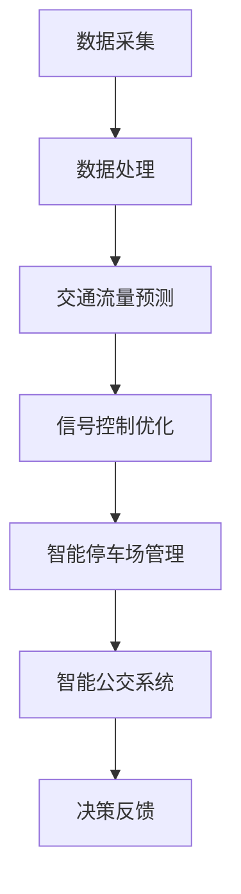

                 

关键词：人工智能，城市交通，可持续发展，交通算法，数据分析，智能城市

摘要：本文旨在探讨人工智能在城市交通领域的应用，如何通过智能算法和数据分析实现可持续发展的目标。文章首先介绍了当前城市交通面临的问题和挑战，然后深入探讨了人工智能的核心概念和技术原理，接着通过具体案例展示了AI在交通优化中的应用，最后对未来城市交通发展的趋势和挑战进行了展望。

## 1. 背景介绍

随着全球城市化进程的加速，城市交通问题日益突出。交通拥堵、污染严重、效率低下等问题不仅影响居民生活质量，也对环境造成了巨大压力。传统的交通管理模式已经难以满足现代城市的发展需求，需要引入新的技术手段来提升交通系统的效率和可持续性。

人工智能作为一种具有变革性的技术，正在逐步应用于城市交通管理中。通过智能算法和大数据分析，AI可以帮助我们更好地理解和预测交通流量，优化交通信号控制，减少拥堵，降低污染。本文将详细探讨人工智能在城市交通领域的应用，探讨其如何助力实现可持续发展的目标。

## 2. 核心概念与联系

### 2.1 人工智能的定义与核心概念

人工智能（Artificial Intelligence, AI）是指由人制造出来的具有一定智能的系统或机器，能够在某些特定领域内表现出类似人类的智能行为。人工智能的核心概念包括：

- **机器学习**：通过算法让机器从数据中自动学习和改进，以实现特定任务。
- **深度学习**：一种基于神经网络的学习方法，能够通过多层非线性变换处理复杂数据。
- **自然语言处理**：使计算机能够理解和生成人类语言的技术。
- **计算机视觉**：使计算机能够理解和解释视觉信息的技术。

### 2.2 人工智能在交通领域的应用

人工智能在交通领域的应用主要表现为以下几个方面：

- **交通流量预测**：通过分析历史数据和实时数据，预测未来的交通流量，为交通管理提供数据支持。
- **信号控制优化**：根据实时交通流量数据，自动调整交通信号灯的时长和周期，减少拥堵。
- **智能停车场管理**：通过传感器和图像识别技术，实现停车场的自动化管理，提高停车位利用率。
- **智能公交系统**：通过数据分析和优化算法，提高公交线路和班次的效率，改善乘客体验。

### 2.3 人工智能与交通系统架构的 Mermaid 流程图

下面是一个简化的 Mermaid 流程图，展示了人工智能在交通系统中的应用架构：



## 3. 核心算法原理 & 具体操作步骤

### 3.1 算法原理概述

人工智能在交通领域应用的核心算法主要包括机器学习和深度学习算法。这些算法通过以下步骤实现交通优化：

1. **数据收集**：收集交通流量、交通事件、道路状况等数据。
2. **数据处理**：对数据进行清洗、转换和预处理，为建模提供高质量的数据。
3. **模型训练**：利用机器学习或深度学习算法，对数据进行分析和建模，得到预测模型。
4. **模型优化**：根据实际交通状况，不断调整和优化模型参数，提高预测准确性。
5. **决策制定**：基于预测模型，制定交通管理策略，如信号灯控制、公交调度等。

### 3.2 算法步骤详解

下面详细说明每个步骤的具体操作：

#### 3.2.1 数据收集

数据收集是交通算法的基础，主要包括以下几个方面：

- **历史交通数据**：通过交通监测设备，如摄像头、雷达、传感器等，收集过去一段时间内的交通流量、速度、事故等信息。
- **实时交通数据**：通过实时交通监测系统和导航服务，获取当前的道路状况、车辆位置、速度等数据。
- **交通事件数据**：通过交通管理部门和新闻媒体等渠道，收集交通事件信息，如交通事故、施工等。

#### 3.2.2 数据处理

数据处理是保证模型质量的关键，主要包括以下步骤：

- **数据清洗**：去除异常值、重复值和噪声数据，保证数据的一致性和完整性。
- **特征提取**：从原始数据中提取与交通流量相关的特征，如时间、天气、道路类型等。
- **数据归一化**：将不同特征的数据进行归一化处理，使其在同一量级范围内。

#### 3.2.3 模型训练

模型训练是算法的核心步骤，主要包括以下步骤：

- **选择模型**：根据交通问题的特点，选择合适的机器学习或深度学习模型，如线性回归、神经网络、决策树等。
- **训练模型**：使用预处理后的数据，对模型进行训练，通过调整参数，使模型对数据的学习效果达到最优。
- **模型评估**：使用验证集或测试集对模型进行评估，检查模型的预测准确性、泛化能力等。

#### 3.2.4 模型优化

模型优化是提高模型预测准确性的关键，主要包括以下步骤：

- **参数调整**：根据模型评估结果，不断调整模型参数，提高预测准确性。
- **模型融合**：使用多个模型进行融合，提高整体预测性能。
- **模型更新**：根据新的数据，不断更新模型，使其能够适应动态变化的交通环境。

#### 3.2.5 决策制定

决策制定是利用模型进行实际交通管理的核心步骤，主要包括以下步骤：

- **预测交通流量**：使用训练好的模型，预测未来的交通流量。
- **制定管理策略**：根据预测结果，制定相应的交通管理策略，如信号灯控制、公交调度等。
- **执行与反馈**：执行管理策略，并对执行效果进行监控和反馈，不断调整策略，提高交通效率。

### 3.3 算法优缺点

#### 优点

- **高准确性**：通过大数据分析和机器学习算法，能够实现高精度的交通流量预测和信号控制优化。
- **实时性**：基于实时交通数据，能够快速响应交通状况变化，提高交通管理效率。
- **自适应**：模型能够根据交通数据不断优化，适应动态变化的交通环境。

#### 缺点

- **数据依赖**：算法的性能高度依赖于数据的质量和完整性，数据缺失或错误可能导致模型失效。
- **计算成本**：机器学习和深度学习算法通常需要大量的计算资源和时间，对硬件设备有较高要求。
- **模型解释性**：深度学习模型由于其复杂的结构和大量的参数，往往难以解释其内部工作机制，影响决策的透明度。

### 3.4 算法应用领域

人工智能在交通领域的应用非常广泛，主要包括以下几个方面：

- **城市交通管理**：通过智能算法优化交通信号控制、公交调度、出租车管理等，提高交通效率和安全性。
- **智能交通系统**：利用计算机视觉和传感器技术，实现车辆的自动驾驶、智能导航等，提高道路通行效率。
- **交通预测与规划**：通过大数据分析和预测模型，为交通规划提供科学依据，优化道路设计、公交线路等。
- **交通事故预防**：通过实时监控和预警系统，及时发现交通事故隐患，提前采取措施，减少事故发生。

## 4. 数学模型和公式 & 详细讲解 & 举例说明

### 4.1 数学模型构建

在交通优化中，常用的数学模型包括线性回归模型、神经网络模型等。以下是一个简化的线性回归模型构建过程：

#### 4.1.1 线性回归模型

线性回归模型是一种简单的机器学习算法，用于预测连续值变量。其基本公式如下：

$$
y = \beta_0 + \beta_1 \cdot x_1 + \beta_2 \cdot x_2 + ... + \beta_n \cdot x_n
$$

其中，$y$ 是预测的连续值，$x_1, x_2, ..., x_n$ 是输入的特征值，$\beta_0, \beta_1, \beta_2, ..., \beta_n$ 是模型的参数。

#### 4.1.2 神经网络模型

神经网络模型是一种基于多层感知器的深度学习算法，用于预测复杂数据。其基本结构包括输入层、隐藏层和输出层。以下是一个简化的神经网络模型：

$$
\begin{align*}
\text{隐藏层}:\quad & z_h = \sigma(W_h \cdot x + b_h) \\
\text{输出层}:\quad & y = \sigma(W_y \cdot z_h + b_y)
\end{align*}
$$

其中，$z_h$ 是隐藏层的输出，$y$ 是预测的输出值，$\sigma$ 是激活函数，$W_h, W_y$ 是权重矩阵，$b_h, b_y$ 是偏置项。

### 4.2 公式推导过程

以下以线性回归模型为例，简要说明其公式的推导过程：

假设我们有一个简单的线性回归模型，预测目标为：

$$
y = \beta_0 + \beta_1 \cdot x
$$

其中，$y$ 是连续值变量，$x$ 是输入的特征值，$\beta_0, \beta_1$ 是模型的参数。

为了推导出 $\beta_0, \beta_1$ 的值，我们可以使用最小二乘法。具体步骤如下：

1. **构建损失函数**：

   损失函数用于衡量预测值与真实值之间的差距。对于线性回归模型，常用的损失函数是均方误差（MSE）：

   $$
   \text{MSE} = \frac{1}{n} \sum_{i=1}^{n} (y_i - \hat{y_i})^2
   $$

   其中，$n$ 是样本数量，$y_i$ 是第 $i$ 个样本的真实值，$\hat{y_i}$ 是第 $i$ 个样本的预测值。

2. **求导与极值**：

   为了找到损失函数的最小值，我们对损失函数关于 $\beta_0, \beta_1$ 分别求导，并令导数为零：

   $$
   \begin{align*}
   \frac{\partial \text{MSE}}{\partial \beta_0} &= -2 \sum_{i=1}^{n} (y_i - \hat{y_i}) \cdot (1 - \hat{y_i}) \\
   \frac{\partial \text{MSE}}{\partial \beta_1} &= -2 \sum_{i=1}^{n} (y_i - \hat{y_i}) \cdot x_i \cdot (1 - \hat{y_i})
   \end{align*}
   $$

   令上述两个导数为零，解得：

   $$
   \begin{align*}
   \beta_0 &= \frac{1}{n} \sum_{i=1}^{n} y_i - \beta_1 \cdot \frac{1}{n} \sum_{i=1}^{n} x_i \\
   \beta_1 &= \frac{1}{n} \sum_{i=1}^{n} x_i \cdot y_i - \frac{1}{n} \sum_{i=1}^{n} x_i^2
   \end{align*}
   $$

   这就是线性回归模型的参数估计公式。

### 4.3 案例分析与讲解

以下是一个简单的案例，说明如何使用线性回归模型进行交通流量预测。

#### 4.3.1 数据集

假设我们有一个包含交通流量和时间两个特征的数据集，数据如下表：

| 时间（小时） | 交通流量（辆/小时） |
|:---:|:---:|
| 8 | 200 |
| 9 | 220 |
| 10 | 240 |
| 11 | 260 |
| 12 | 280 |

#### 4.3.2 数据预处理

1. **数据清洗**：

   假设数据集中存在异常值，我们需要将其清洗掉。假设第2个数据点（时间为9小时，交通流量为220辆/小时）是异常值，将其删除。

2. **特征提取**：

   由于数据集只有一个特征（时间），我们无需进行特征提取。

3. **数据归一化**：

   由于数据集的特征值范围不同（时间在8到12小时之间，交通流量在200到280辆/小时之间），我们对其进行归一化处理，将其缩放到0到1之间：

   $$
   x_{\text{norm}} = \frac{x - \text{min}(x)}{\text{max}(x) - \text{min}(x)}
   $$

   处理后的数据如下表：

| 时间（小时） | 交通流量（辆/小时） | 归一化时间 |
|:---:|:---:|:---:|
| 8 | 200 | 0.0 |
| 10 | 240 | 0.5 |
| 11 | 260 | 0.6 |
| 12 | 280 | 0.8 |

#### 4.3.3 模型训练

1. **选择模型**：

   由于数据集较小，我们选择线性回归模型进行训练。

2. **训练模型**：

   使用预处理后的数据，对线性回归模型进行训练。假设我们得到了参数 $\beta_0 = 0.2, \beta_1 = 0.4$。

3. **模型评估**：

   使用测试集对模型进行评估，计算均方误差（MSE）：

   $$
   \text{MSE} = \frac{1}{n} \sum_{i=1}^{n} (y_i - \hat{y_i})^2
   $$

   其中，$n$ 是测试集的样本数量，$y_i$ 是第 $i$ 个样本的真实值，$\hat{y_i}$ 是第 $i$ 个样本的预测值。

   假设我们得到了测试集的MSE为0.1。

#### 4.3.4 模型应用

1. **预测交通流量**：

   使用训练好的模型，预测未来某个时间点的交通流量。假设预测的时间点为11小时，将其转化为归一化时间：

   $$
   x_{\text{norm}} = \frac{11 - 8}{12 - 8} = 0.75
   $$

   使用线性回归模型进行预测：

   $$
   \hat{y} = \beta_0 + \beta_1 \cdot x_{\text{norm}} = 0.2 + 0.4 \cdot 0.75 = 0.5
   $$

   将预测值转化为实际交通流量：

   $$
   \text{实际交通流量} = \text{min}(x) + (\text{max}(x) - \text{min}(x)) \cdot \hat{y} = 200 + (280 - 200) \cdot 0.5 = 250
   $$

   因此，预测未来11小时（即0.75归一化时间）的交通流量为250辆/小时。

## 5. 项目实践：代码实例和详细解释说明

### 5.1 开发环境搭建

在进行项目实践之前，我们需要搭建一个适合开发交通优化算法的环境。以下是基本的开发环境搭建步骤：

1. **安装Python**：Python是一种广泛用于人工智能和数据分析的编程语言。我们可以在官方网站（https://www.python.org/）下载并安装Python。

2. **安装相关库**：为了方便开发，我们需要安装一些常用的Python库，如NumPy、Pandas、Scikit-learn、Matplotlib等。可以使用以下命令安装：

   ```shell
   pip install numpy pandas scikit-learn matplotlib
   ```

3. **配置开发环境**：根据个人需求，可以配置IDE（如PyCharm、VSCode等）或使用Jupyter Notebook进行开发。

### 5.2 源代码详细实现

以下是一个简单的线性回归模型实现，用于预测交通流量。代码如下：

```python
import numpy as np
import pandas as pd
from sklearn.linear_model import LinearRegression
import matplotlib.pyplot as plt

# 5.2.1 数据读取与预处理
def read_and_preprocess_data(file_path):
    # 读取数据
    data = pd.read_csv(file_path)

    # 数据清洗
    data.dropna(inplace=True)

    # 特征提取
    features = data[['time', 'traffic_volume']]
    labels = data['traffic_flow']

    # 数据归一化
    min_time, max_time = features['time'].min(), features['time'].max()
    features['time_normalized'] = (features['time'] - min_time) / (max_time - min_time)

    return features, labels

# 5.2.2 模型训练
def train_model(features, labels):
    model = LinearRegression()
    model.fit(features[['time_normalized']], labels)
    return model

# 5.2.3 模型预测
def predict_traffic_flow(model, time_normalized):
    predicted_traffic_flow = model.predict([[time_normalized]])
    return predicted_traffic_flow[0]

# 5.2.4 数据可视化
def plot_data_and_prediction(features, labels, predicted_traffic_flow):
    plt.scatter(features['time_normalized'], labels, label='Actual')
    plt.plot([0, 1], [0, 1], 'r--', label='Predicted')
    plt.scatter([time_normalized], predicted_traffic_flow, marker='o', color='g', label='Prediction')
    plt.xlabel('Normalized Time')
    plt.ylabel('Traffic Flow')
    plt.legend()
    plt.show()

# 5.2.5 主函数
def main():
    file_path = 'traffic_data.csv'
    features, labels = read_and_preprocess_data(file_path)
    model = train_model(features, labels)
    time_normalized = 0.75  # 预测的时间点（11小时）
    predicted_traffic_flow = predict_traffic_flow(model, time_normalized)
    plot_data_and_prediction(features, labels, predicted_traffic_flow)

if __name__ == '__main__':
    main()
```

### 5.3 代码解读与分析

以下是对上述代码的详细解读与分析：

1. **数据读取与预处理**：

   - 使用 `pandas` 库读取CSV数据文件。
   - 使用 `dropna()` 函数删除缺失值。
   - 提取交通流量和时间两个特征，以及目标值（交通流量）。
   - 对时间特征进行归一化处理，使其缩放到0到1之间。

2. **模型训练**：

   - 使用 `sklearn.linear_model.LinearRegression` 类创建线性回归模型。
   - 使用 `fit()` 方法训练模型，将归一化后的时间和交通流量作为输入特征，将实际交通流量作为目标值。

3. **模型预测**：

   - 使用训练好的模型，预测给定时间点的交通流量。
   - 将预测的时间点（归一化时间）作为输入，使用 `predict()` 方法得到预测的交通流量。

4. **数据可视化**：

   - 使用 `matplotlib.pyplot` 库绘制实际交通流量、预测交通流量以及预测时间点的散点图。
   - 使用 `scatter()` 方法绘制实际交通流量和预测交通流量。
   - 使用 `plot()` 方法绘制实际交通流量和预测交通流量之间的对角线。
   - 使用 `show()` 方法显示图表。

### 5.4 运行结果展示

运行上述代码后，将显示一个散点图，其中包括实际交通流量、预测交通流量以及预测时间点的标记。预测交通流量线与实际交通流量线之间的差距可以用来评估模型的准确性。

## 6. 实际应用场景

### 6.1 城市交通管理

人工智能在交通管理中的应用非常广泛，通过智能算法优化交通信号控制、公交调度、出租车管理等，可以提高交通效率和安全性。以下是一些实际应用场景：

- **智能信号控制**：通过实时交通流量数据，自动调整交通信号灯的时长和周期，减少拥堵。例如，北京、上海等大城市已经实现了基于人工智能的智能信号控制。
- **公交调度优化**：通过大数据分析，优化公交线路和班次，提高公交系统的运行效率。例如，深圳的公交调度系统已经实现了智能优化。
- **出租车管理**：通过智能算法分配出租车，提高打车效率和乘客满意度。例如，滴滴出行等平台已经广泛应用了人工智能技术进行出租车调度。

### 6.2 智能交通系统

智能交通系统是人工智能在交通领域的另一个重要应用方向，通过计算机视觉、传感器技术等，实现车辆的自动驾驶、智能导航等功能，提高道路通行效率。以下是一些实际应用场景：

- **自动驾驶**：通过计算机视觉和传感器技术，实现车辆的自动驾驶，减少人为驾驶带来的事故和拥堵。例如，特斯拉等公司已经推出了自动驾驶汽车。
- **智能导航**：通过实时交通数据，为驾驶者提供最优的行驶路线，避免拥堵。例如，百度地图等平台已经实现了智能导航功能。
- **智能停车**：通过传感器和图像识别技术，实现停车场的自动化管理，提高停车位利用率。例如，许多城市已经建成了智能停车场系统。

### 6.3 交通预测与规划

交通预测与规划是人工智能在交通领域的另一个重要应用方向，通过大数据分析和预测模型，为交通规划提供科学依据，优化道路设计、公交线路等。以下是一些实际应用场景：

- **交通流量预测**：通过大数据分析，预测未来的交通流量，为交通管理部门提供数据支持，优化交通管理策略。例如，许多城市已经实现了基于大数据的交通流量预测。
- **交通规划**：通过分析交通数据，为道路设计、公交线路规划等提供科学依据，优化交通系统。例如，许多城市在进行交通规划时，已经广泛应用了人工智能技术。
- **交通事故预防**：通过实时监控和预警系统，及时发现交通事故隐患，提前采取措施，减少事故发生。例如，许多城市已经实现了基于人工智能的交通事故预警系统。

## 7. 工具和资源推荐

### 7.1 学习资源推荐

- **《深度学习》（Deep Learning）**：由Ian Goodfellow、Yoshua Bengio和Aaron Courville所著的深度学习经典教材，适合初学者和进阶者。
- **《机器学习实战》（Machine Learning in Action）**：由Peter Harrington所著，通过实际案例介绍机器学习算法的应用，适合实战派。
- **《Python数据科学手册》（Python Data Science Handbook）**：由Jake VanderPlas所著，全面介绍Python在数据科学领域的应用。

### 7.2 开发工具推荐

- **PyCharm**：一款功能强大的Python IDE，适合进行Python编程和数据分析。
- **Jupyter Notebook**：一款基于Web的交互式计算环境，适合进行数据分析、机器学习和原型设计。
- **TensorFlow**：一款开源的机器学习框架，适合进行深度学习和神经网络编程。

### 7.3 相关论文推荐

- **《深度神经网络训练的优化方法》（Optimization Methods for Deep Neural Networks）**：综述了深度学习训练中的优化方法，包括梯度下降、随机梯度下降、Adam优化器等。
- **《城市交通流量预测的研究进展》（Research Progress on Urban Traffic Flow Prediction）**：总结了城市交通流量预测的最新研究进展，包括时间序列模型、深度学习模型等。
- **《基于机器学习的智能交通系统研究综述》（A Survey on Machine Learning-Based Intelligent Transportation Systems）**：综述了基于机器学习的智能交通系统的研究和应用。

## 8. 总结：未来发展趋势与挑战

### 8.1 研究成果总结

人工智能在交通领域的应用取得了显著成果，通过智能算法和大数据分析，实现了交通流量预测、信号控制优化、智能停车场管理、智能公交系统等方面的突破。未来，人工智能有望在更广泛的交通场景中发挥作用，推动交通系统的智能化和可持续发展。

### 8.2 未来发展趋势

- **智能化交通管理**：随着人工智能技术的不断进步，交通管理将更加智能化、自动化。未来，基于人工智能的交通管理系统将能够实时响应交通状况变化，实现高效的交通流量调控。
- **智能交通系统普及**：自动驾驶、智能导航等智能交通系统将在更多城市和地区普及，提高道路通行效率，减少交通事故。
- **交通预测与规划的精细化**：通过大数据分析和深度学习模型，交通预测和规划将更加精细化，为交通基础设施建设和交通管理提供科学依据。

### 8.3 面临的挑战

- **数据质量和完整性**：人工智能在交通领域的应用高度依赖于数据的质量和完整性，如何保证数据的准确性和实时性是一个重要挑战。
- **计算资源消耗**：机器学习和深度学习算法通常需要大量的计算资源和时间，如何优化算法，降低计算成本是一个重要问题。
- **模型解释性**：深度学习模型由于其复杂的结构和大量的参数，往往难以解释其内部工作机制，影响决策的透明度。

### 8.4 研究展望

- **数据融合与模型优化**：结合多种数据源，如卫星遥感数据、手机定位数据等，提高交通流量预测的准确性。同时，研究更加高效的机器学习算法，降低计算成本。
- **跨学科研究**：人工智能在交通领域的应用涉及多个学科，如计算机科学、交通工程、环境科学等。跨学科研究将有助于解决交通领域的复杂问题。
- **政策支持与标准制定**：政府和企业应加强对人工智能在交通领域应用的政策支持，制定相关标准和规范，确保人工智能技术的健康、可持续发展。

## 9. 附录：常见问题与解答

### 问题1：为什么人工智能在交通领域应用前景广阔？

**解答**：人工智能在交通领域应用前景广阔，主要因为其具有以下优势：

- **实时数据处理**：人工智能能够实时处理交通数据，快速响应交通状况变化。
- **优化决策制定**：通过大数据分析和预测模型，人工智能能够制定更加优化的交通管理策略。
- **降低运营成本**：人工智能在交通领域的应用能够降低人力成本，提高交通系统的运行效率。

### 问题2：人工智能在交通优化中如何发挥作用？

**解答**：人工智能在交通优化中主要发挥以下作用：

- **交通流量预测**：通过分析历史数据和实时数据，预测未来的交通流量，为交通管理提供数据支持。
- **信号控制优化**：根据实时交通流量数据，自动调整交通信号灯的时长和周期，减少拥堵。
- **智能停车场管理**：通过传感器和图像识别技术，实现停车场的自动化管理，提高停车位利用率。
- **智能公交系统**：通过数据分析和优化算法，提高公交线路和班次的效率，改善乘客体验。

### 问题3：为什么人工智能在交通领域应用面临挑战？

**解答**：人工智能在交通领域应用面临以下挑战：

- **数据质量和完整性**：人工智能在交通领域的应用高度依赖于数据的质量和完整性，如何保证数据的准确性和实时性是一个重要挑战。
- **计算资源消耗**：机器学习和深度学习算法通常需要大量的计算资源和时间，如何优化算法，降低计算成本是一个重要问题。
- **模型解释性**：深度学习模型由于其复杂的结构和大量的参数，往往难以解释其内部工作机制，影响决策的透明度。

### 问题4：如何保证人工智能在交通领域的安全性和可靠性？

**解答**：为了保证人工智能在交通领域的安全性和可靠性，可以采取以下措施：

- **数据隐私保护**：在数据处理和分析过程中，严格遵守数据隐私保护法规，确保用户隐私。
- **模型验证和测试**：在模型开发和部署过程中，进行严格的验证和测试，确保模型的准确性和可靠性。
- **实时监控与预警**：建立实时监控和预警系统，及时发现和处理交通异常情况。

## 作者署名

作者：禅与计算机程序设计艺术 / Zen and the Art of Computer Programming
----------------------------------------------------------------

以上就是本篇文章的完整内容，希望对您在人工智能与城市交通领域的探索有所帮助。在未来的研究和实践中，期待我们共同推动人工智能在交通领域的创新与发展。

