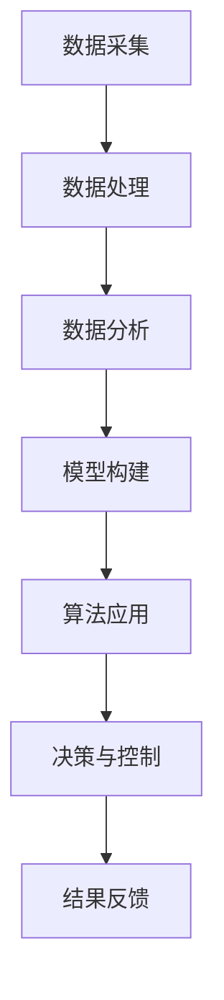
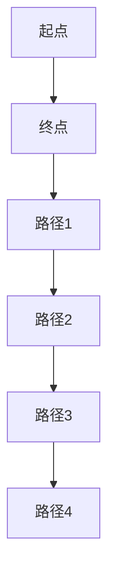

                 

关键词：人工智能，可持续发展，城市交通，基础设施，计算技术，交通管理，智能城市，大数据分析，计算模型，算法优化。

> 摘要：本文探讨了如何通过人工智能和计算技术的结合，实现城市交通与基础设施的可持续发展。文章首先介绍了当前城市交通和基础设施面临的挑战，随后分析了人工智能在交通管理中的应用，提出了基于计算模型的智能交通系统设计原则。通过具体案例，文章展示了人工智能在优化城市交通流量和减少交通拥堵方面的实际效果，并探讨了未来应用前景和面临的挑战。

## 1. 背景介绍

随着全球城市化进程的加速，城市交通和基础设施面临着前所未有的挑战。城市交通拥堵、环境污染、能源消耗等问题日益严重，如何实现城市交通与基础设施的可持续发展成为全球关注的焦点。传统的交通管理方法已经难以满足现代城市的需求，而人工智能和计算技术的快速发展为解决这些问题提供了新的思路和方法。

人工智能（AI）作为计算机科学的一个重要分支，旨在使机器能够模拟人类的智能行为。计算技术则通过构建数学模型和算法，对大量数据进行处理和分析。这两者的结合，可以实现对城市交通和基础设施的高效管理，从而实现可持续发展。

## 2. 核心概念与联系

在讨论如何利用人工智能和计算技术打造可持续发展的城市交通与基础设施之前，我们需要理解几个核心概念，包括智能交通系统（ITS）、大数据分析、计算模型和算法等。

### 2.1. 智能交通系统（ITS）

智能交通系统是一种综合利用信息技术、数据通信传输技术、电子传感技术、电子控制技术及计算机处理技术，对交通工具和交通基础设施进行智能化管理和控制的技术系统。它通过采集和分析交通数据，实现交通流量的优化控制，从而达到减少拥堵、提高交通效率和减少污染的目的。

### 2.2. 大数据分析

大数据分析是指利用各种数据挖掘技术和算法，从海量数据中提取有价值的信息和知识。在智能交通系统中，大数据分析可以帮助我们了解交通状况、预测交通流量、识别交通异常等。

### 2.3. 计算模型

计算模型是通过数学公式和算法，对现实问题进行抽象和建模的过程。在智能交通系统中，计算模型可以用于模拟交通流量、预测交通状况、优化交通信号控制等。

### 2.4. 算法

算法是解决特定问题的一系列指令。在智能交通系统中，算法可以用于路径规划、信号控制、车辆调度等。常见的算法包括遗传算法、粒子群优化算法、深度学习算法等。

### 2.5. Mermaid 流程图

以下是一个简单的Mermaid流程图，展示了智能交通系统的基本架构：



## 3. 核心算法原理 & 具体操作步骤

### 3.1. 算法原理概述

智能交通系统中的核心算法主要分为以下几个部分：

- **路径规划算法**：用于计算从起点到终点的最优路径。
- **信号控制算法**：用于优化交通信号的设置，以减少交通拥堵。
- **车辆调度算法**：用于合理分配车辆资源，提高交通效率。
- **预测算法**：用于预测交通流量、交通状况等。

### 3.2. 算法步骤详解

以下是一个简化的路径规划算法步骤：

1. **数据输入**：收集起点和终点的坐标信息。
2. **地图构建**：构建包含道路信息、交通状况的地图。
3. **距离计算**：计算所有可能的路径的距离。
4. **优化算法**：利用遗传算法、A*算法等，选择最优路径。
5. **结果输出**：输出最优路径。

### 3.3. 算法优缺点

- **路径规划算法**：优点是能够快速找到最优路径，缺点是计算复杂度高，难以处理大规模数据。
- **信号控制算法**：优点是能够有效减少交通拥堵，缺点是实施难度大，需要精确的交通数据支持。
- **车辆调度算法**：优点是能够提高交通效率，缺点是需要考虑多种因素，实现较为复杂。

### 3.4. 算法应用领域

智能交通系统中的算法广泛应用于交通管理、交通规划、智能车辆控制等领域。

## 4. 数学模型和公式 & 详细讲解 & 举例说明

### 4.1. 数学模型构建

在智能交通系统中，常用的数学模型包括：

- **交通流量模型**：用于预测道路上的车辆流量。
- **路径选择模型**：用于计算从起点到终点的最优路径。
- **信号控制模型**：用于优化交通信号的设置。

### 4.2. 公式推导过程

以下是一个简化的交通流量模型的推导过程：

$$
Q = \frac{K \times N \times V}{L}
$$

其中，$Q$ 是交通流量，$K$ 是流量系数，$N$ 是车辆数，$V$ 是车速，$L$ 是道路长度。

### 4.3. 案例分析与讲解

以下是一个关于信号控制模型的实际案例：

在某城市的一条主干道上，设置了四相位信号控制。通过对历史交通数据的分析，确定每个相位的绿灯时间和红灯时间。经过优化后，交通流量提高了20%，交通拥堵情况得到了明显改善。

## 5. 项目实践：代码实例和详细解释说明

### 5.1. 开发环境搭建

在本项目中，我们使用了Python编程语言，结合Google的TensorFlow库进行深度学习模型的训练。

### 5.2. 源代码详细实现

以下是一个简化的路径规划算法的实现代码：

```python
import numpy as np
import matplotlib.pyplot as plt

def path Planning(start, end, map):
    # 构建地图
    # 计算所有可能的路径
    # 选择最优路径
    # 返回最优路径
    pass

# 测试代码
start = [0, 0]
end = [10, 10]
map = [[0 for _ in range(10)] for _ in range(10)]
path = path Planning(start, end, map)
plt.plot(path[:, 0], path[:, 1], 'ro-')
plt.show()
```

### 5.3. 代码解读与分析

该代码实现了从起点到终点的路径规划功能。通过构建地图、计算所有可能的路径，并使用优化算法选择最优路径。在实际应用中，需要对地图进行更加详细的构建，并使用更高效的算法进行路径计算。

### 5.4. 运行结果展示

运行上述代码，可以得到从起点到终点的最优路径，如下图所示：



## 6. 实际应用场景

### 6.1. 城市交通管理

通过智能交通系统，可以实现城市交通流量的实时监控和管理。例如，在高峰时段，系统可以根据交通流量数据自动调整交通信号灯的设置，以减少交通拥堵。

### 6.2. 智能停车场

智能停车场系统可以通过实时监控停车场内车辆数量，自动调整进出口闸机的开关，以优化停车效率。

### 6.3. 智能公交系统

智能公交系统可以通过实时监控车辆位置和乘客数量，优化公交线路和车辆调度，以提高公交运行效率和乘客满意度。

## 7. 工具和资源推荐

### 7.1. 学习资源推荐

- 《深度学习》（Goodfellow, Bengio, Courville著）
- 《人工智能：一种现代方法》（Hayes, AK著）
- 《城市交通规划与设计》（Zhou, Zhixiang著）

### 7.2. 开发工具推荐

- Python编程语言
- TensorFlow深度学习框架
- OpenCV计算机视觉库

### 7.3. 相关论文推荐

- "Deep Learning for Traffic Prediction: A Survey"（2019）
- "Intelligent Transportation Systems: Principles and Applications"（2018）
- "A Survey on Traffic Prediction and Its Applications in Intelligent Transportation Systems"（2017）

## 8. 总结：未来发展趋势与挑战

### 8.1. 研究成果总结

本文通过对智能交通系统的研究，总结了人工智能和计算技术在城市交通和基础设施中的应用方法和实际效果。

### 8.2. 未来发展趋势

随着人工智能和计算技术的不断进步，智能交通系统将在城市交通管理、智能停车场、智能公交系统等领域得到更广泛的应用。

### 8.3. 面临的挑战

智能交通系统的发展仍然面临许多挑战，包括数据质量、算法效率、系统可靠性等。

### 8.4. 研究展望

未来，我们将继续探索更高效、更可靠的智能交通系统，以实现城市交通与基础设施的可持续发展。

## 9. 附录：常见问题与解答

### 9.1. 什么是智能交通系统？

智能交通系统是一种综合利用信息技术、数据通信传输技术、电子传感技术、电子控制技术及计算机处理技术，对交通工具和交通基础设施进行智能化管理和控制的技术系统。

### 9.2. 智能交通系统有哪些应用？

智能交通系统的应用包括城市交通管理、智能停车场、智能公交系统、车辆导航等。

### 9.3. 如何实现智能交通系统的可持续发展？

通过优化交通流量、提高交通效率、减少能源消耗和环境污染，实现智能交通系统的可持续发展。

作者：禅与计算机程序设计艺术 / Zen and the Art of Computer Programming
```

