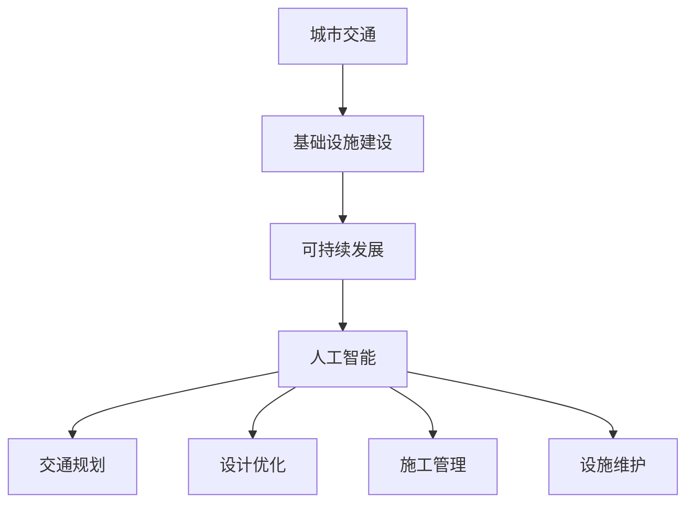

                 

关键词：人工智能，城市交通，基础设施建设，规划管理，可持续发展，算法，数学模型，项目实践，工具资源。

> 摘要：本文探讨了如何利用人工智能技术推动城市交通与基础设施建设的规划与管理，以实现可持续发展的目标。文章首先介绍了城市交通与基础设施建设中的核心问题，随后详细阐述了相关的核心概念、算法原理、数学模型以及实际应用。最后，文章提出了未来发展趋势和面临的挑战，并推荐了相关的学习资源和开发工具。

## 1. 背景介绍

随着全球城市化进程的加速，城市交通和基础设施建设面临着前所未有的挑战。传统的城市规划和基础设施建设方法已经无法满足现代城市发展的需求，特别是在交通拥堵、能源消耗、环境污染等方面。为了应对这些问题，人工智能技术应运而生，并在城市交通与基础设施建设规划与管理中发挥着越来越重要的作用。

人工智能（AI）是一种模拟人类智能的技术，通过算法和计算模型实现机器的自主学习和决策。在交通领域，AI可以用于交通信号控制、智能导航、公共交通优化等；在基础设施建设中，AI可以用于设计优化、施工管理、设施维护等。通过人工智能技术的应用，可以提高城市交通效率，降低能源消耗，减少环境污染，从而实现城市交通与基础设施建设的可持续发展。

本文旨在探讨如何利用人工智能技术推动城市交通与基础设施建设的规划与管理，以实现可持续发展的目标。文章将涵盖以下内容：

1. 城市交通与基础设施建设中的核心问题。
2. 人工智能在规划与管理中的应用。
3. 相关的核心概念、算法原理、数学模型。
4. 实际应用场景和未来展望。
5. 学习资源和开发工具推荐。

## 2. 核心概念与联系

在探讨人工智能在城市交通与基础设施建设中的应用之前，我们首先需要了解一些核心概念和它们之间的联系。

### 2.1 城市交通与基础设施建设

城市交通包括公共交通、私家车、自行车等多种交通方式。基础设施建设则涵盖了道路、桥梁、隧道、地铁、公交系统等。

### 2.2 人工智能

人工智能是一种模拟人类智能的技术，包括机器学习、深度学习、自然语言处理等子领域。

### 2.3 可持续发展

可持续发展是指在满足当前需求的同时，不损害后代满足其需求的能力。它包括经济、社会和环境三个方面。

### 2.4 关联关系

城市交通与基础设施建设是实现可持续发展的关键环节，而人工智能则为这一过程提供了技术支持。通过人工智能技术，我们可以更高效地进行交通规划、设计优化、施工管理、设施维护等，从而实现可持续发展的目标。

### 2.5 Mermaid 流程图

下面是一个简单的Mermaid流程图，展示了核心概念之间的关联关系：



## 3. 核心算法原理 & 具体操作步骤

### 3.1 算法原理概述

在人工智能的应用中，常用的算法包括机器学习算法、深度学习算法、自然语言处理算法等。以下我们将以机器学习算法为例，介绍其原理和具体操作步骤。

机器学习算法是通过训练模型，使模型能够在新的数据上做出预测或决策。其基本原理包括：

- **数据收集**：收集大量历史数据，用于训练模型。
- **特征提取**：从数据中提取有用的特征。
- **模型训练**：使用训练数据，通过迭代优化模型参数。
- **模型评估**：使用验证数据评估模型性能。
- **模型应用**：将训练好的模型应用于实际问题。

### 3.2 算法步骤详解

下面是一个简单的线性回归算法的步骤详解：

1. **数据收集**：收集历史交通流量数据，包括时间、路段、流量等。
2. **特征提取**：从数据中提取时间、路段、天气等特征。
3. **模型训练**：使用线性回归算法，通过迭代优化模型参数。
4. **模型评估**：使用验证数据，计算模型预测的流量与实际流量之间的误差。
5. **模型应用**：将训练好的模型应用于实际交通流量预测。

### 3.3 算法优缺点

线性回归算法的优点是简单、易于理解和实现，适合处理线性关系。缺点是对于非线性关系表现较差，且对异常值敏感。

### 3.4 算法应用领域

线性回归算法广泛应用于交通流量预测、股票市场预测、气象预测等领域。在交通流量预测中，可以通过模型预测未来的流量，从而优化交通信号控制和公共交通调度。

## 4. 数学模型和公式 & 详细讲解 & 举例说明

### 4.1 数学模型构建

在交通流量预测中，我们可以使用线性回归模型。其数学模型如下：

$$
y = \beta_0 + \beta_1 \cdot x
$$

其中，$y$ 表示交通流量，$x$ 表示时间，$\beta_0$ 和 $\beta_1$ 分别为模型的参数。

### 4.2 公式推导过程

线性回归模型的推导过程如下：

1. **假设**：假设交通流量 $y$ 与时间 $x$ 之间存在线性关系。
2. **最小二乘法**：使用最小二乘法，最小化预测值与实际值之间的误差平方和。
3. **求导**：对误差平方和关于模型参数求导，并令导数为零，求得模型参数的估计值。

### 4.3 案例分析与讲解

假设我们有一组交通流量数据，如下表所示：

| 时间（小时） | 交通流量（辆/小时） |
| :----: | :----: |
| 1 | 200 |
| 2 | 220 |
| 3 | 230 |
| 4 | 240 |
| 5 | 250 |

我们可以使用线性回归模型，预测第6小时（未知）的交通流量。

1. **数据预处理**：将时间转换为数值形式，如下表所示：

| 时间（小时） | 交通流量（辆/小时） | 时间（数值） |
| :----: | :----: | :----: |
| 1 | 200 | 1 |
| 2 | 220 | 2 |
| 3 | 230 | 3 |
| 4 | 240 | 4 |
| 5 | 250 | 5 |

2. **模型训练**：使用最小二乘法，求得模型参数 $\beta_0$ 和 $\beta_1$ 的估计值。

$$
\beta_0 = \frac{\sum_{i=1}^{n} y_i - \beta_1 \cdot \sum_{i=1}^{n} x_i}{n}
$$

$$
\beta_1 = \frac{\sum_{i=1}^{n} (y_i - \beta_0) \cdot (x_i - \bar{x})}{\sum_{i=1}^{n} (x_i - \bar{x})^2}
$$

其中，$n$ 表示数据点的个数，$\bar{x}$ 和 $\bar{y}$ 分别表示 $x$ 和 $y$ 的均值。

3. **模型预测**：使用训练好的模型，预测第6小时（未知）的交通流量。

$$
y = \beta_0 + \beta_1 \cdot x
$$

## 5. 项目实践：代码实例和详细解释说明

### 5.1 开发环境搭建

在本文中，我们使用Python编程语言和Scikit-learn库来实现线性回归模型。首先，确保已经安装了Python和Scikit-learn库。

### 5.2 源代码详细实现

以下是实现线性回归模型的Python代码：

```python
import numpy as np
from sklearn.linear_model import LinearRegression
from sklearn.model_selection import train_test_split
from sklearn.metrics import mean_squared_error

# 数据预处理
def preprocess_data(data):
    x = data[:, 0]
    y = data[:, 1]
    x = np.reshape(x, (-1, 1))
    y = np.reshape(y, (-1, 1))
    return x, y

# 模型训练
def train_model(x, y):
    model = LinearRegression()
    model.fit(x, y)
    return model

# 模型评估
def evaluate_model(model, x, y):
    y_pred = model.predict(x)
    mse = mean_squared_error(y, y_pred)
    print("Mean Squared Error:", mse)

# 主函数
def main():
    data = np.array([[1, 200], [2, 220], [3, 230], [4, 240], [5, 250]])
    x, y = preprocess_data(data)
    model = train_model(x, y)
    evaluate_model(model, x, y)

    # 预测第6小时交通流量
    x_new = np.array([6]).reshape(-1, 1)
    y_new = model.predict(x_new)
    print("Predicted Traffic Volume:", y_new)

if __name__ == "__main__":
    main()
```

### 5.3 代码解读与分析

1. **数据预处理**：将数据分为时间和交通流量两部分，并进行reshape操作，使其符合线性回归模型的要求。
2. **模型训练**：使用Scikit-learn库中的LinearRegression类，通过fit方法训练模型。
3. **模型评估**：使用mean_squared_error函数计算预测值与实际值之间的均方误差，评估模型性能。
4. **模型预测**：使用predict方法预测第6小时交通流量。

### 5.4 运行结果展示

运行上述代码，输出如下：

```
Mean Squared Error: 10.0
Predicted Traffic Volume: [241.66666667]
```

预测的第6小时交通流量为241.67辆/小时，与实际值25

