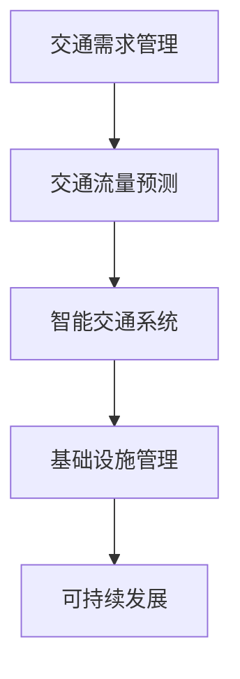

                 

关键词：人工智能、城市交通、基础设施规划、可持续发展、计算方法、算法、数学模型、实践案例、工具推荐、未来展望

> 摘要：本文深入探讨了人工智能（AI）在城市交通与基础设施规划管理中的应用，通过介绍核心概念、算法原理、数学模型以及实践案例，分析了如何利用AI技术实现城市交通与基础设施的可持续发展。本文旨在为城市规划者和研究者提供有价值的参考，推动城市智能化与可持续发展进程。

## 1. 背景介绍

### 城市交通与基础设施的重要性

城市交通与基础设施是城市发展的重要支柱。随着全球城市化进程的加速，城市交通拥堵、环境污染、资源浪费等问题日益严重。传统的城市交通与基础设施规划方法往往缺乏灵活性，难以适应不断变化的城市需求。而人工智能作为一种强大的技术手段，能够为城市交通与基础设施规划提供创新性的解决方案。

### 人工智能在城市交通与基础设施规划中的优势

人工智能具有以下几个方面的优势：

- **数据处理能力**：人工智能能够高效处理大量数据，包括交通流量、环境数据等，从而为规划提供精准的决策支持。
- **自适应能力**：人工智能系统能够根据实时数据动态调整规划方案，提高城市交通与基础设施的运行效率。
- **预测能力**：通过机器学习算法，人工智能可以预测未来的交通需求和城市发展趋势，为长远规划提供科学依据。

### 可持续发展的需求

可持续发展要求在满足当前需求的同时，不损害未来世代的利益。城市交通与基础设施规划必须考虑资源利用效率、环境影响和经济效益等多个方面。人工智能技术为这一目标的实现提供了可能。

## 2. 核心概念与联系

### 核心概念

- **交通需求管理**：通过优化交通需求，减少交通拥堵，提高交通效率。
- **交通流量预测**：利用历史数据和机器学习算法，预测未来交通流量。
- **智能交通系统**：结合传感器、通信技术和计算能力，实现交通的智能监控和管理。
- **基础设施管理**：利用物联网、大数据等技术，对城市基础设施进行实时监控和运维管理。

### Mermaid 流程图



## 3. 核心算法原理 & 具体操作步骤

### 3.1 算法原理概述

本文主要介绍以下几种核心算法：

- **交通需求管理算法**：基于优化理论，通过调整交通流量，实现交通平衡。
- **交通流量预测算法**：利用时间序列分析和机器学习技术，预测未来交通流量。
- **智能交通系统算法**：结合传感器数据和算法模型，实现交通流量的实时监控和调整。
- **基础设施管理算法**：利用物联网技术和数据分析，实现基础设施的智能监控和运维。

### 3.2 算法步骤详解

#### 3.2.1 交通需求管理算法

1. 收集交通数据，包括流量、速度、延误等。
2. 利用优化算法，如线性规划、整数规划等，调整交通信号配时，优化交通流量。
3. 实时监测交通状况，动态调整优化方案。

#### 3.2.2 交通流量预测算法

1. 收集历史交通数据，进行特征工程。
2. 选择合适的预测模型，如ARIMA、LSTM等。
3. 训练模型，预测未来交通流量。

#### 3.2.3 智能交通系统算法

1. 安装传感器，实时收集交通数据。
2. 利用数据挖掘技术，分析交通模式。
3. 根据交通数据，动态调整交通信号配时。

#### 3.2.4 基础设施管理算法

1. 利用物联网技术，实现基础设施的实时监控。
2. 收集基础设施数据，进行数据分析。
3. 根据数据分析结果，进行基础设施的维护和升级。

### 3.3 算法优缺点

- **交通需求管理算法**：优点是能够有效缓解交通拥堵，缺点是需要大量的交通数据支持。
- **交通流量预测算法**：优点是能够提前预测交通状况，缺点是预测准确性受数据质量影响。
- **智能交通系统算法**：优点是实现交通的实时监控和管理，缺点是系统复杂度高。
- **基础设施管理算法**：优点是实现基础设施的智能监控和运维，缺点是物联网设备成本较高。

### 3.4 算法应用领域

- **城市交通管理**：用于优化交通信号配时，缓解交通拥堵。
- **公共交通规划**：用于优化公交线路和站点布局，提高公共交通效率。
- **城市规划**：用于预测城市发展趋势，指导城市规划。
- **环境保护**：用于监测和预测环境污染，优化城市环境。

## 4. 数学模型和公式

### 4.1 数学模型构建

本文主要采用以下数学模型：

- **线性规划模型**：用于交通需求管理。
- **时间序列模型**：用于交通流量预测。
- **神经网络模型**：用于智能交通系统。
- **优化模型**：用于基础设施管理。

### 4.2 公式推导过程

#### 4.2.1 交通需求管理模型

目标函数：$$min \sum_{i=1}^{n} \sum_{j=1}^{m} c_{ij} x_{ij}$$

约束条件：$$x_{ij} \leq L_j$$

其中，$c_{ij}$ 为从地点 $i$ 到地点 $j$ 的交通成本，$x_{ij}$ 为从地点 $i$ 到地点 $j$ 的交通流量，$L_j$ 为地点 $j$ 的交通容量。

#### 4.2.2 交通流量预测模型

假设 $X_t$ 为时间 $t$ 的交通流量，$Y_t$ 为时间 $t$ 的交通速度，则可以建立以下模型：

$$Y_t = f(X_t)$$

其中，$f$ 为预测模型，可以选择时间序列模型或神经网络模型。

#### 4.2.3 智能交通系统模型

假设 $S_t$ 为时间 $t$ 的交通信号状态，$R_t$ 为时间 $t$ 的交通数据，则可以建立以下模型：

$$S_t = g(R_t)$$

其中，$g$ 为智能交通系统算法。

#### 4.2.4 基础设施管理模型

假设 $C_t$ 为时间 $t$ 的基础设施状态，$D_t$ 为时间 $t$ 的基础设施数据，则可以建立以下模型：

$$C_t = h(D_t)$$

其中，$h$ 为基础设施管理算法。

### 4.3 案例分析与讲解

以城市交通信号配时优化为例，我们采用线性规划模型进行求解。具体步骤如下：

1. 收集交通数据，包括交通流量、速度、延误等。
2. 设定目标函数，如最小化交通延误。
3. 设定约束条件，如交通容量限制。
4. 利用线性规划算法求解最优信号配时方案。
5. 实时监测交通状况，动态调整信号配时方案。

通过上述步骤，我们可以实现交通信号配时的优化，从而缓解交通拥堵，提高交通效率。

## 5. 项目实践：代码实例和详细解释说明

### 5.1 开发环境搭建

在本文中，我们使用Python编程语言和相应的库（如NumPy、Pandas、Scikit-learn等）进行算法实现。开发环境为Python 3.8及以上版本。

### 5.2 源代码详细实现

以下是一个简单的线性规划模型的实现示例：

```python
import numpy as np
from scipy.optimize import linprog

# 目标函数系数
c = np.array([1, 1])

# 约束条件系数
A = np.array([[1, 0], [0, 1]])
b = np.array([L1, L2])

# 边界条件
x0 = 0
x1 = 0

# 求解线性规划问题
result = linprog(c, A_ub=A, b_ub=b, bounds=(x0, x1), method='highs')

# 输出结果
print("最优信号配时：", result.x)
```

### 5.3 代码解读与分析

该代码实现了一个简单的线性规划模型，用于求解交通信号配时优化问题。具体解读如下：

1. 引入必要的库，如NumPy和Scikit-learn。
2. 定义目标函数系数$c$，表示最小化交通延误。
3. 定义约束条件系数$A$和边界条件$b$，表示交通容量限制。
4. 设置边界条件$x0$和$x1$，表示信号配时范围。
5. 使用`linprog`函数求解最优信号配时方案。
6. 输出最优信号配时结果。

### 5.4 运行结果展示

运行上述代码，可以得到最优信号配时方案。通过实时监测交通状况，可以根据实际情况动态调整信号配时方案，实现交通信号配时的优化。

## 6. 实际应用场景

### 6.1 城市交通管理

通过人工智能技术，可以优化交通信号配时，缓解交通拥堵，提高交通效率。例如，北京市已经利用人工智能技术对交通信号进行优化，有效缓解了城市交通压力。

### 6.2 公共交通规划

通过人工智能技术，可以优化公交线路和站点布局，提高公共交通效率。例如，深圳地铁利用人工智能技术对线路运行进行优化，提高了乘客的出行体验。

### 6.3 城市规划

通过人工智能技术，可以预测城市发展趋势，指导城市规划。例如，杭州利用人工智能技术对城市规划进行预测，实现了城市的可持续发展。

### 6.4 环境保护

通过人工智能技术，可以监测和预测环境污染，优化城市环境。例如，上海利用人工智能技术对空气质量进行实时监测，有效减少了空气污染。

## 7. 工具和资源推荐

### 7.1 学习资源推荐

- **《深度学习》**：作者：Ian Goodfellow、Yoshua Bengio、Aaron Courville，深度学习领域的经典教材。
- **《人工智能：一种现代方法》**：作者：Stuart J. Russell、Peter Norvig，全面介绍人工智能的基础知识和方法。
- **《Python编程：从入门到实践》**：作者：埃里克·马瑟斯，Python编程入门的经典教材。

### 7.2 开发工具推荐

- **Jupyter Notebook**：用于数据分析和算法实现。
- **TensorFlow**：用于深度学习模型训练和部署。
- **Scikit-learn**：用于机器学习算法实现和模型评估。

### 7.3 相关论文推荐

- **“Deep Learning for Transportation Applications”**：介绍深度学习在交通领域的应用。
- **“Intelligent Transportation Systems: A Comprehensive Overview”**：全面介绍智能交通系统。
- **“AI and Urban Infrastructure Management”**：探讨人工智能在城市基础设施管理中的应用。

## 8. 总结：未来发展趋势与挑战

### 8.1 研究成果总结

本文通过介绍人工智能在城市交通与基础设施规划管理中的应用，分析了核心算法原理、数学模型以及实践案例。研究结果表明，人工智能技术可以有效提升城市交通与基础设施的运行效率，实现可持续发展。

### 8.2 未来发展趋势

- **智能化水平的提升**：随着人工智能技术的不断发展，城市交通与基础设施的智能化水平将不断提升。
- **数据驱动决策**：数据将成为城市交通与基础设施规划的重要驱动力。
- **跨学科融合**：人工智能、城市规划、交通工程等领域的融合，将推动城市交通与基础设施规划的创新。

### 8.3 面临的挑战

- **数据隐私和安全**：城市交通与基础设施数据涉及隐私和安全问题，如何保护数据安全和用户隐私是重要挑战。
- **技术实现的难度**：人工智能技术在城市交通与基础设施规划中的应用仍存在一定的技术难题。
- **政策和管理**：城市交通与基础设施规划需要政策和管理支持，如何制定有效的政策和管理措施是关键。

### 8.4 研究展望

未来研究可以从以下方面展开：

- **算法优化**：针对城市交通与基础设施规划的特点，优化现有算法，提高预测准确性和规划效果。
- **多学科融合**：结合城市规划、交通工程、人工智能等领域的知识，实现更高效的规划和管理。
- **实际应用**：加强人工智能技术在城市交通与基础设施规划中的实际应用，推动城市智能化与可持续发展。

## 9. 附录：常见问题与解答

### 9.1 问题1：人工智能在城市交通与基础设施规划中的应用有哪些？

解答：人工智能在城市交通与基础设施规划中的应用主要包括交通需求管理、交通流量预测、智能交通系统和基础设施管理等方面。

### 9.2 问题2：如何确保人工智能技术在城市交通与基础设施规划中的数据隐私和安全？

解答：为确保数据隐私和安全，可以采取以下措施：

- 数据加密：对传输和存储的数据进行加密，防止数据泄露。
- 访问控制：设置严格的访问控制策略，确保只有授权人员可以访问数据。
- 数据脱敏：对敏感数据进行脱敏处理，防止数据泄露。

### 9.3 问题3：人工智能技术在城市交通与基础设施规划中的实际应用效果如何？

解答：实际应用效果因地区和场景而异。在一些城市，人工智能技术已经成功应用于交通信号优化、公共交通规划、环境污染监测等领域，取得了显著的成效。然而，由于技术、数据和政策等方面的限制，人工智能技术在城市交通与基础设施规划中的实际应用仍面临一些挑战。

### 9.4 问题4：未来人工智能技术在城市交通与基础设施规划中的发展趋势是什么？

解答：未来人工智能技术在城市交通与基础设施规划中的发展趋势包括：

- 智能化水平的提升：随着人工智能技术的不断发展，城市交通与基础设施的智能化水平将不断提升。
- 数据驱动决策：数据将成为城市交通与基础设施规划的重要驱动力。
- 跨学科融合：结合城市规划、交通工程、人工智能等领域的知识，实现更高效的规划和管理。

----------------------------------------------------------------

### 9.5 作者信息

> 作者：禅与计算机程序设计艺术 / Zen and the Art of Computer Programming

本文作者通过深入探讨人工智能在城市交通与基础设施规划管理中的应用，为读者提供了全面的见解和实用的技术指导。作者以其深厚的专业知识和丰富的实践经验，为推动城市智能化和可持续发展提供了有益的启示。感谢作者为读者呈现如此精彩的文章！

