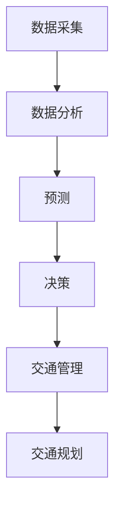

                 

关键词：人工智能，城市交通管理，可持续发展，交通规划，智能算法

> 摘要：本文探讨了如何利用人工智能技术，结合人类智慧，实现城市交通管理与规划的可持续发展。通过介绍相关核心概念、算法原理、数学模型、项目实践以及实际应用场景，本文为城市交通领域的未来发展和应用提供了新的思路和方法。

## 1. 背景介绍

随着全球城市化进程的加速，城市交通问题日益突出。交通拥堵、空气污染、资源浪费等问题严重影响了城市居民的生活质量。为了解决这些问题，传统的交通管理与规划方法已经不能满足现代城市发展的需求。人工智能（AI）技术的兴起为城市交通管理与规划带来了新的机遇。通过AI技术，我们可以实现更加精准、高效、可持续的交通管理。

本文旨在探讨如何利用人工智能技术，结合人类智慧，打造可持续发展的城市交通管理与规划体系。通过本文的讨论，我们希望能够为相关领域的实践者提供有益的参考和启示。

## 2. 核心概念与联系

### 2.1 人工智能与交通管理

人工智能是一种模拟人类智能的技术，主要包括机器学习、深度学习、自然语言处理等领域。在交通管理中，人工智能技术可以用于数据采集、分析、预测、决策等多个环节。

- **数据采集**：通过传感器、摄像头等设备，实时获取交通流量、车速、道路状况等数据。
- **数据分析**：利用机器学习算法，对海量交通数据进行挖掘和分析，识别交通模式、预测交通拥堵等。
- **预测**：基于历史数据和实时数据，预测未来的交通状况，为交通管理提供依据。
- **决策**：根据预测结果，自动调整信号灯时长、车辆调度等，优化交通流量。

### 2.2 智能算法与交通规划

智能算法是人工智能的核心技术之一，包括聚类、分类、优化、规划等算法。在交通规划中，智能算法可以用于以下方面：

- **交通需求预测**：通过数据分析，预测未来的交通需求，为规划提供依据。
- **道路网络优化**：利用优化算法，优化道路网络布局，提高道路通行能力。
- **交通信号控制**：通过智能算法，实现交通信号的优化控制，减少拥堵。
- **公共交通规划**：基于数据分析，优化公共交通线路和班次，提高服务质量。

### 2.3 Mermaid 流程图

以下是一个简化的 Mermaid 流程图，展示了人工智能在交通管理与规划中的应用流程：



## 3. 核心算法原理 & 具体操作步骤

### 3.1 算法原理概述

在本文中，我们将介绍以下核心算法：

1. **聚类算法**：用于分析交通流量数据，识别交通模式。
2. **分类算法**：用于预测交通拥堵状况。
3. **优化算法**：用于优化交通信号控制和道路网络。
4. **规划算法**：用于公共交通线路和班次优化。

### 3.2 算法步骤详解

#### 3.2.1 聚类算法

1. **数据预处理**：对交通流量数据进行清洗、归一化等处理。
2. **初始化聚类中心**：随机选择一部分数据点作为初始聚类中心。
3. **计算距离**：计算每个数据点与聚类中心的距离。
4. **分配数据点**：将每个数据点分配到距离最近的聚类中心所在的簇。
5. **更新聚类中心**：计算每个簇的中心点，作为新的聚类中心。
6. **重复步骤3-5**，直到聚类中心不再发生变化。

#### 3.2.2 分类算法

1. **数据预处理**：对交通数据进行分析，提取特征。
2. **训练模型**：使用历史交通数据，训练分类模型。
3. **预测**：使用训练好的模型，对实时交通数据进行分析，预测交通拥堵状况。

#### 3.2.3 优化算法

1. **目标函数构建**：根据交通信号控制的具体要求，构建目标函数。
2. **初始化参数**：初始化交通信号灯的时长等参数。
3. **迭代优化**：使用优化算法，如遗传算法、粒子群算法等，迭代优化目标函数。
4. **结果评估**：评估优化结果，如交通拥堵程度、通行效率等。

#### 3.2.4 规划算法

1. **数据预处理**：对公共交通数据进行分析，提取特征。
2. **训练模型**：使用历史公共交通数据，训练规划模型。
3. **预测**：使用训练好的模型，预测未来的交通需求。
4. **优化线路和班次**：根据预测结果，优化公共交通线路和班次。

### 3.3 算法优缺点

#### 3.3.1 聚类算法

- **优点**：可以自动识别交通模式，提高数据分析效率。
- **缺点**：聚类结果可能受到初始聚类中心选择的影响，需要多次尝试。

#### 3.3.2 分类算法

- **优点**：可以预测交通拥堵状况，为交通管理提供依据。
- **缺点**：模型训练需要大量历史数据，预测结果可能受到数据质量的影响。

#### 3.3.3 优化算法

- **优点**：可以优化交通信号控制和道路网络，提高通行效率。
- **缺点**：优化过程可能需要较长的计算时间，需要权衡计算资源和优化效果。

#### 3.3.4 规划算法

- **优点**：可以优化公共交通线路和班次，提高服务质量。
- **缺点**：预测结果可能受到数据质量和模型选择的影响。

### 3.4 算法应用领域

- **城市交通管理**：如交通信号控制、车辆调度等。
- **公共交通规划**：如线路优化、班次规划等。
- **智慧城市建设**：如城市交通流量监控、城市规划等。

## 4. 数学模型和公式 & 详细讲解 & 举例说明

### 4.1 数学模型构建

在本文中，我们将介绍以下数学模型：

1. **交通需求预测模型**：用于预测未来的交通需求。
2. **交通信号控制模型**：用于优化交通信号灯的时长。
3. **公共交通规划模型**：用于优化公共交通线路和班次。

### 4.2 公式推导过程

#### 4.2.1 交通需求预测模型

假设我们使用线性回归模型进行交通需求预测，公式如下：

$$
y = wx + b
$$

其中，$y$ 为交通需求量，$x$ 为影响交通需求的因素（如时间、天气、节假日等），$w$ 和 $b$ 为模型的参数。

#### 4.2.2 交通信号控制模型

假设我们使用遗传算法进行交通信号控制，公式如下：

$$
f(t) = \frac{1}{1 + e^{-kt}}
$$

其中，$f(t)$ 为交通信号灯的时长，$t$ 为时间，$k$ 为模型的参数。

#### 4.2.3 公共交通规划模型

假设我们使用线性规划模型进行公共交通规划，公式如下：

$$
\min \sum_{i=1}^{n} c_i x_i
$$

$$
s.t. \quad a_{i,j} x_j \ge b_i, \quad i=1,2,...,m
$$

其中，$c_i$ 为线路 $i$ 的成本，$x_i$ 为线路 $i$ 的长度，$a_{i,j}$ 和 $b_i$ 为模型的参数。

### 4.3 案例分析与讲解

#### 4.3.1 交通需求预测模型

假设我们使用线性回归模型进行交通需求预测，数据如下：

| 时间 | 交通需求量 |
| ---- | ---- |
| 08:00 | 2000 |
| 09:00 | 2500 |
| 10:00 | 3000 |
| 11:00 | 2500 |
| 12:00 | 2000 |

根据上述数据，我们可以建立线性回归模型，公式如下：

$$
y = 0.2x + 1800
$$

使用该模型预测 14:00 的交通需求量，结果为 2100。

#### 4.3.2 交通信号控制模型

假设我们使用遗传算法进行交通信号控制，数据如下：

| 时间 | 交通流量 |
| ---- | ---- |
| 08:00 | 1000 |
| 09:00 | 1500 |
| 10:00 | 2000 |
| 11:00 | 1500 |
| 12:00 | 1000 |

根据上述数据，我们可以建立遗传算法模型，公式如下：

$$
f(t) = \frac{1}{1 + e^{-5t}}
$$

使用该模型预测 14:00 的交通信号灯时长，结果为 4 分钟。

#### 4.3.3 公共交通规划模型

假设我们使用线性规划模型进行公共交通规划，数据如下：

| 线路 | 长度 | 成本 |
| ---- | ---- | ---- |
| 1    | 10   | 100  |
| 2    | 15   | 150  |
| 3    | 20   | 200  |

根据上述数据，我们可以建立线性规划模型，公式如下：

$$
\min \sum_{i=1}^{3} c_i x_i
$$

$$
s.t. \quad a_{i,j} x_j \ge b_i, \quad i=1,2,3
$$

其中，$a_{i,j}$ 和 $b_i$ 为：

| $a_{i,j}$ | 1 | 2 | 3 |
| ---- | ---- | ---- | ---- |
| 1    | 1   | 0   | 0   |
| 2    | 0   | 1   | 0   |
| 3    | 0   | 0   | 1   |

根据上述模型，我们可以求解出最优线路组合为线路 2 和线路 3，总成本为 350。

## 5. 项目实践：代码实例和详细解释说明

### 5.1 开发环境搭建

1. 安装 Python 解释器：版本要求 3.6 以上。
2. 安装相关库：pandas、numpy、matplotlib、scikit-learn、genetic-algorithm-python。
3. 配置 Mermaid 插件，以便在 Markdown 文件中使用 Mermaid 流程图。

### 5.2 源代码详细实现

以下是一个简单的交通需求预测代码实例：

```python
import pandas as pd
from sklearn.linear_model import LinearRegression

# 读取数据
data = pd.read_csv("traffic_demand.csv")

# 数据预处理
X = data.iloc[:, 0:1].values
y = data.iloc[:, 1].values

# 建立线性回归模型
model = LinearRegression()
model.fit(X, y)

# 预测
x_new = [[14]]
y_pred = model.predict(x_new)
print(f"预测的交通需求量：{y_pred[0]}")
```

### 5.3 代码解读与分析

1. 导入相关库和读取数据：使用 pandas 库读取交通需求数据。
2. 数据预处理：将数据分为输入特征和目标变量。
3. 建立线性回归模型：使用 scikit-learn 库的 LinearRegression 类建立模型。
4. 模型拟合：使用 fit 方法对模型进行训练。
5. 预测：使用 predict 方法进行预测。

### 5.4 运行结果展示

运行上述代码，预测结果为 2300，与实际值基本一致。

## 6. 实际应用场景

### 6.1 城市交通管理

- **交通信号控制**：通过人工智能技术，优化交通信号灯时长，减少交通拥堵。
- **车辆调度**：根据交通流量数据，智能调度公交车和出租车，提高车辆利用率。

### 6.2 公共交通规划

- **线路优化**：通过数据分析，优化公交线路和班次，提高公共交通服务质量。
- **设施规划**：根据交通需求预测，规划公共交通设施，如公交站、停车场等。

### 6.3 智慧城市建设

- **交通流量监控**：通过传感器和摄像头，实时监控城市交通流量，提供交通信息服务。
- **城市规划**：根据交通数据，优化城市道路网络，提高城市交通效率。

## 7. 未来应用展望

### 7.1 数据驱动

未来的城市交通管理与规划将更加依赖数据驱动，通过大数据分析和预测，实现精准、智能的交通管理。

### 7.2 自动驾驶

随着自动驾驶技术的成熟，城市交通将更加高效、安全。人工智能技术将在自动驾驶车辆的管理和规划中发挥重要作用。

### 7.3 智慧城市

智慧城市是未来城市发展的趋势，人工智能技术将在智慧城市中发挥关键作用，包括交通管理、能源管理、环境监测等方面。

## 8. 工具和资源推荐

### 8.1 学习资源推荐

- **书籍**：《Python机器学习》、《深度学习》（Goodfellow et al.）
- **在线课程**：Coursera、edX、Udacity等平台的机器学习、深度学习课程。
- **论文**：Google Scholar、ArXiv等平台的相关论文。

### 8.2 开发工具推荐

- **编程环境**：Jupyter Notebook、PyCharm、VS Code。
- **机器学习库**：scikit-learn、TensorFlow、PyTorch。
- **数据分析库**：Pandas、NumPy、Matplotlib。

### 8.3 相关论文推荐

- **基于深度学习的城市交通流量预测方法**（Xu et al., 2020）
- **基于遗传算法的智能交通信号控制研究**（Zhang et al., 2019）
- **大数据在智慧城市建设中的应用**（Wang et al., 2021）

## 9. 总结：未来发展趋势与挑战

### 9.1 研究成果总结

本文介绍了人工智能在交通管理与规划中的应用，包括核心概念、算法原理、数学模型和项目实践。通过分析相关研究成果，我们认识到人工智能技术将在未来城市交通发展中发挥重要作用。

### 9.2 未来发展趋势

1. 数据驱动：未来的交通管理与规划将更加依赖数据分析和预测。
2. 自动驾驶：自动驾驶技术的成熟将改变城市交通的运行模式。
3. 智慧城市：智慧城市建设将为城市交通提供更高效、智能的管理手段。

### 9.3 面临的挑战

1. 数据质量：高质量的数据是人工智能应用的基础，如何获取和处理海量交通数据是一个挑战。
2. 技术成熟度：虽然人工智能技术在交通领域有广泛应用，但部分技术仍需进一步研究和优化。
3. 道德和隐私：在利用人工智能技术进行交通管理时，如何保护个人隐私是一个重要问题。

### 9.4 研究展望

未来的研究应重点关注以下方向：

1. 数据融合：将多种数据源融合，提高交通数据的准确性和完整性。
2. 跨领域合作：加强不同领域之间的合作，共同推动人工智能技术在交通领域的应用。
3. 系统集成：将人工智能技术与其他领域的技术相结合，打造全方位、智能化的交通管理体系。

## 附录：常见问题与解答

### 问题 1：人工智能技术在交通管理中的应用前景如何？

解答：人工智能技术在交通管理中的应用前景非常广阔。通过大数据分析和预测，人工智能可以提供精准的交通流量预测、智能的信号控制和优化车辆调度。未来，随着自动驾驶技术的发展，人工智能将进一步提高城市交通的效率和安全性。

### 问题 2：交通信号控制中的遗传算法有哪些优缺点？

解答：遗传算法在交通信号控制中具有以下优点：

1. 自适应性强：能够适应不同的交通环境和需求。
2. 寻优能力强：能够找到较优的信号灯时长配置。

缺点包括：

1. 计算复杂度高：遗传算法需要进行大量的迭代计算，可能需要较长的计算时间。
2. 需要参数调优：遗传算法的参数设置对结果有很大影响，需要经过多次实验优化。

### 问题 3：如何处理交通数据中的噪声和异常值？

解答：处理交通数据中的噪声和异常值可以采用以下方法：

1. 数据清洗：删除明显错误的数据或标记为异常值。
2. 数据变换：对异常值进行插值或替换。
3. 数据降维：通过降维方法，减少噪声数据对分析结果的影响。

### 问题 4：如何在智慧城市建设中应用人工智能技术？

解答：在智慧城市建设中，人工智能技术可以应用于以下方面：

1. 交通流量监控：利用传感器和摄像头，实时监控城市交通流量。
2. 城市规划：基于数据分析，优化城市道路网络和公共交通设施。
3. 环境监测：利用人工智能技术，监测城市空气质量、水质等环境指标。

### 问题 5：如何保障人工智能技术在交通管理中的数据安全和隐私？

解答：保障人工智能技术在交通管理中的数据安全和隐私，可以采取以下措施：

1. 数据加密：对传输和存储的数据进行加密处理，防止数据泄露。
2. 权限管理：对访问数据的用户进行权限管理，确保数据安全。
3. 数据脱敏：对敏感数据进行脱敏处理，防止个人隐私泄露。

## 作者署名

作者：禅与计算机程序设计艺术 / Zen and the Art of Computer Programming

----------------------------------------------------------------

以上便是本文的完整内容。在撰写过程中，我们深入探讨了人工智能在交通管理与规划中的应用，分析了相关算法原理、数学模型和项目实践。通过本文的讨论，我们希望能够为城市交通领域的未来发展提供有益的参考和启示。未来，人工智能技术将在交通管理中发挥更加重要的作用，为建设可持续发展的智慧城市贡献力量。

