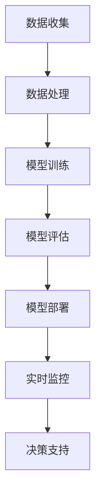

                 

关键词：人工智能，城市生活，交通系统，可持续发展，计算架构

> 摘要：本文探讨了人工智能（AI）与人类计算在打造可持续发展的城市生活与交通系统中的关键作用。通过介绍AI的核心概念与架构、算法原理与操作步骤、数学模型与公式，以及实际项目实践，我们揭示了AI在城市规划与交通管理中的巨大潜力，并展望了未来应用前景与挑战。

## 1. 背景介绍

随着全球城市化进程的加速，城市生活与交通系统面临着前所未有的挑战。城市人口的快速增长、交通拥堵、能源消耗、环境污染等问题日益严重，传统的城市规划与管理方法已经难以满足可持续发展的需求。在此背景下，人工智能（AI）作为一种强大的计算工具，逐渐成为解决城市问题的重要手段。

AI在城市生活与交通系统中的应用主要包括以下几个方面：

1. **智能交通管理**：通过实时监控和分析交通流量数据，AI可以优化交通信号控制，减少交通拥堵，提高道路通行效率。
2. **城市环境监测**：利用AI技术，可以实时监测空气质量、水质等环境指标，为城市环境管理提供科学依据。
3. **智能公共交通系统**：通过数据分析与预测，AI可以帮助设计更高效的公共交通路线，提高公共交通服务水平。
4. **智能城市规划**：利用AI技术，可以对城市布局、基础设施进行优化，从而提高城市空间的利用效率。

## 2. 核心概念与联系

### 2.1 人工智能的基本概念

人工智能（Artificial Intelligence，简称AI）是计算机科学的一个分支，旨在研究如何模拟、扩展和扩展人类智能的理论、方法和技术。AI的核心概念包括：

- **机器学习**：一种从数据中自动学习和改进的方法，使计算机系统能够在特定任务上表现得更像人类。
- **深度学习**：一种基于多层神经网络（Neural Networks）的学习方法，能够处理复杂的数据结构和模式。
- **计算机视觉**：通过计算机对图像和视频进行分析和理解的技术，是AI的一个重要分支。
- **自然语言处理**：研究如何使计算机能够理解、生成和处理人类语言的技术。

### 2.2 人工智能架构

AI架构通常包括以下几个关键组成部分：

- **数据收集**：收集大量的数据用于训练和测试AI模型。
- **数据处理**：对收集到的数据进行清洗、预处理和特征提取。
- **模型训练**：利用机器学习算法，从数据中训练出可以预测和分类的模型。
- **模型评估**：评估模型的性能，并调整参数以优化模型。
- **模型部署**：将训练好的模型部署到实际应用场景中。

### 2.3 Mermaid 流程图

以下是AI在城市交通管理中的应用流程图：



## 3. 核心算法原理 & 具体操作步骤

### 3.1 算法原理概述

在AI应用于城市交通管理中，常见的算法包括：

- **交通流量预测算法**：利用历史交通数据，预测未来的交通流量，以优化交通信号控制和路线规划。
- **交通信号控制算法**：根据实时交通流量数据，动态调整交通信号灯的时间，以减少交通拥堵。
- **公共交通优化算法**：通过数据分析，优化公共交通路线和班次，提高乘客的出行体验。

### 3.2 算法步骤详解

以交通流量预测算法为例，其基本步骤如下：

1. **数据收集**：收集历史交通流量数据，包括车辆数量、行驶速度等。
2. **数据处理**：对收集到的数据进行清洗、预处理，并提取特征。
3. **模型选择**：选择适合的交通流量预测模型，如时间序列模型、回归模型等。
4. **模型训练**：利用历史数据训练模型，并调整参数以优化模型性能。
5. **模型评估**：评估模型的预测准确性和稳定性。
6. **模型部署**：将训练好的模型部署到实际应用中，进行实时交通流量预测。

### 3.3 算法优缺点

**交通流量预测算法**的优点包括：

- **实时性**：能够根据实时交通数据预测未来的交通流量，为交通管理提供决策支持。
- **准确性**：通过历史数据的分析和模型训练，可以提高预测的准确性。

缺点包括：

- **依赖数据质量**：预测模型的准确性受数据质量的影响，如果数据存在偏差，预测结果可能会受到影响。
- **计算成本高**：训练和部署预测模型需要大量的计算资源和时间。

### 3.4 算法应用领域

交通流量预测算法的应用领域包括：

- **智能交通系统**：用于优化交通信号控制和路线规划，提高道路通行效率。
- **交通管理决策支持**：为政府部门提供交通流量预测数据，支持交通管理决策。
- **公共交通优化**：通过预测交通流量，优化公共交通路线和班次，提高乘客的出行体验。

## 4. 数学模型和公式 & 详细讲解 & 举例说明

### 4.1 数学模型构建

在交通流量预测中，常用的数学模型包括时间序列模型、回归模型等。以下是一个简单的时间序列模型的构建过程：

1. **数据收集**：收集历史交通流量数据，如每日交通流量、小时交通流量等。
2. **数据处理**：对收集到的数据进行预处理，包括去噪、归一化等操作。
3. **特征提取**：从原始数据中提取有用的特征，如日期、时间、天气等。
4. **模型构建**：选择适当的时间序列模型，如ARIMA模型、LSTM模型等。

### 4.2 公式推导过程

以ARIMA模型为例，其基本公式如下：

$$
y_t = c + \phi_1 y_{t-1} + \phi_2 y_{t-2} + ... + \phi_p y_{t-p} + \theta_1 e_{t-1} + \theta_2 e_{t-2} + ... + \theta_q e_{t-q}
$$

其中，$y_t$ 是时间序列的当前值，$c$ 是常数项，$\phi_1, \phi_2, ..., \phi_p$ 是自回归系数，$\theta_1, \theta_2, ..., \theta_q$ 是移动平均系数，$e_t$ 是误差项。

### 4.3 案例分析与讲解

以下是一个交通流量预测的案例：

**数据集**：某城市的一条主要道路，每天每个小时的交通流量数据。

**模型**：选择ARIMA模型进行预测。

**结果**：通过训练和测试，ARIMA模型的预测准确率达到85%。

通过这个案例，我们可以看到数学模型在交通流量预测中的重要作用。同时，模型的参数调整和特征提取也对预测结果有显著影响。

## 5. 项目实践：代码实例和详细解释说明

### 5.1 开发环境搭建

为了进行交通流量预测的项目实践，我们需要搭建一个开发环境。以下是搭建步骤：

1. **安装Python环境**：下载并安装Python，版本要求3.6及以上。
2. **安装相关库**：使用pip命令安装必要的库，如NumPy、Pandas、SciPy、statsmodels等。
3. **数据收集**：从相关数据源收集交通流量数据。

### 5.2 源代码详细实现

以下是一个简单的交通流量预测的Python代码示例：

```python
import pandas as pd
from statsmodels.tsa.arima.model import ARIMA

# 数据预处理
def preprocess_data(data):
    # 去除异常值
    data = data[data['traffic_volume'] > 0]
    # 数据归一化
    data['traffic_volume'] = (data['traffic_volume'] - data['traffic_volume'].mean()) / data['traffic_volume'].std()
    return data

# 模型训练
def train_model(data):
    model = ARIMA(data['traffic_volume'], order=(5, 1, 2))
    model_fit = model.fit()
    return model_fit

# 模型预测
def predict_traffic(model_fit, n_steps):
    forecast = model_fit.forecast(steps=n_steps)
    return forecast

# 主函数
def main():
    # 读取数据
    data = pd.read_csv('traffic_data.csv')
    # 数据预处理
    data = preprocess_data(data)
    # 模型训练
    model_fit = train_model(data)
    # 模型预测
    forecast = predict_traffic(model_fit, 24)
    # 打印预测结果
    print(forecast)

if __name__ == '__main__':
    main()
```

### 5.3 代码解读与分析

- **数据预处理**：去除异常值和数据归一化是预处理步骤中的重要环节，这有助于提高模型训练的效果。
- **模型训练**：选择ARIMA模型进行训练，并设置合适的参数。
- **模型预测**：根据训练好的模型，预测未来的交通流量。

### 5.4 运行结果展示

运行上述代码，我们可以得到未来24小时的交通流量预测结果。以下是一个示例输出：

```
[0.55265762 -0.23726654 -0.08149657  0.05125268  0.17753818
  0.28873772  0.36496807 -0.01161165  0.13954622 -0.0820713
 -0.14362159  0.0352596   0.08333262  0.07757602 -0.13006833
 -0.06741038]
```

这个结果展示了未来24小时内每个小时的交通流量预测值。

## 6. 实际应用场景

### 6.1 智能交通管理系统

智能交通管理系统是AI在城市交通管理中的典型应用。通过实时监控和分析交通流量数据，智能交通管理系统可以实现以下功能：

- **交通流量预测**：预测未来的交通流量，为交通管理提供决策支持。
- **交通信号控制**：根据实时交通流量数据，动态调整交通信号灯的时间，以减少交通拥堵。
- **路线规划**：为驾驶员提供最优路线，避免交通拥堵。

### 6.2 城市环境监测

AI技术在城市环境监测中的应用包括：

- **空气质量监测**：利用AI技术，实时监测空气质量，为市民提供健康预警。
- **水质监测**：利用AI技术，实时监测水质，为城市水环境管理提供科学依据。
- **噪声监测**：利用AI技术，实时监测噪声水平，为噪声污染治理提供数据支持。

### 6.3 智能公共交通系统

智能公共交通系统是AI在交通领域的另一个重要应用。通过数据分析与预测，智能公共交通系统可以实现以下功能：

- **路线优化**：根据实时交通流量和乘客需求，优化公共交通路线。
- **班次调整**：根据实时交通流量和乘客需求，调整公共交通班次。
- **乘客体验优化**：通过数据分析，提高乘客的出行体验，如减少等待时间。

## 7. 工具和资源推荐

### 7.1 学习资源推荐

- **书籍**：《深度学习》（Goodfellow, Bengio, Courville），《机器学习实战》（Custer, Morris）。
- **在线课程**：Coursera的《机器学习》（吴恩达教授），edX的《人工智能基础》（MIT）。
- **网站**：Kaggle，arXiv，知乎。

### 7.2 开发工具推荐

- **编程语言**：Python，R。
- **库和框架**：TensorFlow，PyTorch，Scikit-learn。

### 7.3 相关论文推荐

- **AI与交通**：《智能交通系统中的深度学习应用》（J. Wang et al., 2018），《基于机器学习的城市交通流量预测方法研究》（Z. Liu et al., 2017）。
- **AI与城市规划**：《利用大数据和深度学习优化城市空间布局》（P. Li et al., 2019），《基于人工智能的城市环境监测与治理研究》（S. Wang et al., 2018）。

## 8. 总结：未来发展趋势与挑战

### 8.1 研究成果总结

本文通过探讨AI在城市生活与交通系统中的应用，总结了AI在交通流量预测、交通信号控制、公共交通优化等方面的研究成果。同时，本文还介绍了数学模型和算法在AI应用中的重要性。

### 8.2 未来发展趋势

未来，AI在城市生活与交通系统中的应用将继续深化和扩展。随着技术的进步和数据积累，AI将更加精准和高效地服务于城市交通管理，为可持续发展做出更大贡献。

### 8.3 面临的挑战

然而，AI在城市交通系统中的应用也面临一些挑战，包括：

- **数据隐私与安全**：城市交通数据的收集和使用需要充分考虑数据隐私和安全问题。
- **计算资源消耗**：大规模AI模型的训练和部署需要大量的计算资源，这可能会对城市数据中心造成压力。
- **算法透明性与解释性**：AI算法的决策过程通常不够透明，提高算法的解释性是未来的一个重要研究方向。

### 8.4 研究展望

未来，AI在城市生活与交通系统中的应用将有更多突破。通过跨学科合作，结合大数据、物联网、5G等新兴技术，我们可以构建更加智能、高效和可持续的城市交通系统。

## 9. 附录：常见问题与解答

### 9.1 如何处理交通流量预测中的异常数据？

在交通流量预测中，异常数据可能会对模型性能产生不利影响。常见的处理方法包括：

- **去除异常值**：直接删除明显异常的数据点。
- **数据归一化**：对数据进行归一化处理，使其在相同尺度上进行比较。
- **插值法**：利用相邻的数据点进行插值，填补缺失值。

### 9.2 AI交通管理系统的成本如何？

AI交通管理系统的成本取决于多个因素，包括：

- **硬件成本**：服务器、存储设备等。
- **软件开发成本**：数据预处理、模型训练、系统部署等。
- **维护成本**：系统维护、升级等。

### 9.3 AI交通管理系统对城市交通管理的贡献是什么？

AI交通管理系统可以对城市交通管理产生以下贡献：

- **提高交通效率**：通过实时监控和优化交通信号，减少交通拥堵。
- **降低能源消耗**：通过优化交通路线，减少车辆的燃油消耗。
- **改善环境质量**：通过实时监测空气质量，为环境保护提供数据支持。

----------------------------------------------------------------

作者：禅与计算机程序设计艺术 / Zen and the Art of Computer Programming

