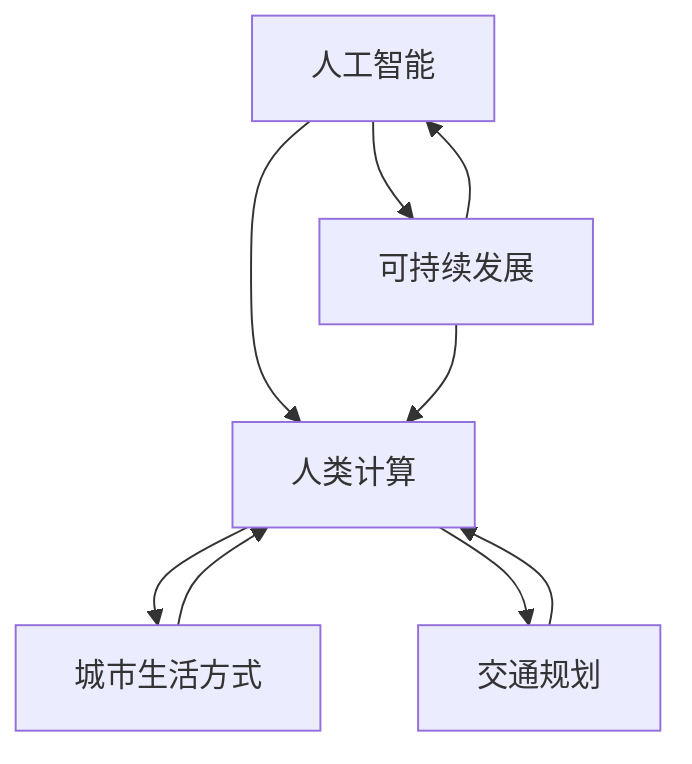

                 

关键词：人工智能，人类计算，可持续发展，城市生活方式，交通规划，人工智能算法，数学模型，实践案例

> 摘要：本文将探讨人工智能与人类计算的结合如何为城市生活方式与交通规划带来创新和可持续发展的解决方案。通过深入分析核心概念、算法原理、数学模型以及实际项目案例，本文旨在为读者提供一个全面的理解和指导。

## 1. 背景介绍

在现代社会，城市生活方式和交通规划面临着前所未有的挑战。人口增长、城市扩张、资源匮乏和环境恶化等问题日益凸显，使得传统的方法难以满足日益增长的居民需求。与此同时，人工智能（AI）技术的飞速发展为我们提供了一种新的解决途径。人工智能通过模拟人类思维和行为，能够在复杂的环境中识别模式、做出决策，从而为城市管理和交通规划提供智能化支持。

人类计算则是指人类与计算机系统协作完成计算任务的过程。通过将人类的创造力、经验和判断力与计算机的强大计算能力相结合，人类计算能够在大数据处理、复杂问题求解等方面发挥重要作用。这种结合不仅能够提高计算效率，还能够减少人为错误，为城市生活方式和交通规划带来更多可能性。

本文旨在探讨人工智能与人类计算的结合如何为城市生活方式与交通规划带来可持续发展的解决方案。我们将通过深入分析核心概念、算法原理、数学模型以及实际项目案例，为读者提供一个全面的理解和指导。

## 2. 核心概念与联系

在探讨人工智能与人类计算的结合之前，我们需要先了解一些核心概念。这些概念包括人工智能、人类计算、可持续发展、城市生活方式和交通规划。

### 2.1 人工智能

人工智能（AI）是指通过计算机模拟人类智能的技术。它包括机器学习、深度学习、自然语言处理、计算机视觉等多个子领域。人工智能的核心目标是让计算机具备自主学习和推理能力，从而在特定任务中达到或超越人类水平。

### 2.2 人类计算

人类计算是指人类与计算机系统协作完成计算任务的过程。这种协作可以通过多种方式实现，如人机交互、云计算、分布式计算等。人类计算的核心优势在于将人类的创造力、经验和判断力与计算机的强大计算能力相结合，从而实现更高效、更准确的计算任务。

### 2.3 可持续发展

可持续发展是指在满足当前需求的同时，不损害后代满足其需求的能力。在城市生活方式和交通规划中，可持续发展意味着在提高居民生活质量的同时，保护环境和资源。

### 2.4 城市生活方式

城市生活方式是指城市居民在日常生活中的行为习惯、生活方式和价值观念。它包括交通出行、居住环境、工作学习、休闲活动等多个方面。

### 2.5 交通规划

交通规划是指为了满足城市交通需求，合理布置道路、交通设施和服务设施，以提高交通效率和减少交通拥堵的过程。交通规划的目标是提供安全、便捷、高效、可持续的出行环境。

### 2.6 人工智能与人类计算的结合

人工智能与人类计算的结合是指将人工智能技术应用于人类计算任务中，以实现更高效、更准确的计算结果。这种结合不仅能够提高计算效率，还能够减少人为错误，为城市生活方式和交通规划带来更多可能性。

### 2.7 Mermaid 流程图

为了更好地理解人工智能与人类计算的结合，我们可以使用 Mermaid 流程图来展示其核心概念和联系。



通过上述流程图，我们可以清晰地看到人工智能、人类计算、可持续发展、城市生活方式和交通规划之间的联系。

## 3. 核心算法原理 & 具体操作步骤

在人工智能与人类计算的结合中，核心算法原理起着至关重要的作用。下面我们将介绍一些关键算法原理，并详细解释其操作步骤。

### 3.1 算法原理概述

人工智能与人类计算的核心算法原理主要包括以下几种：

1. **机器学习算法**：通过从数据中学习规律和模式，实现自动化的决策和预测。
2. **深度学习算法**：基于多层神经网络，实现对复杂数据的建模和解释。
3. **自然语言处理算法**：通过模拟人类语言处理过程，实现语音识别、机器翻译等功能。
4. **计算机视觉算法**：通过模拟人类视觉系统，实现对图像和视频的分析和理解。

### 3.2 算法步骤详解

下面我们以机器学习算法为例，详细解释其操作步骤。

#### 3.2.1 数据收集与预处理

1. 数据收集：收集与城市交通规划相关的数据，如交通流量、道路状况、车辆类型等。
2. 数据预处理：对收集到的数据进行分析和处理，如去除噪声、缺失值填充、数据标准化等。

#### 3.2.2 特征提取

1. 特征选择：从原始数据中提取有用的特征，如时间、地点、道路宽度等。
2. 特征提取：对选定的特征进行数值化处理，以便于后续的算法计算。

#### 3.2.3 模型训练

1. 选择模型：根据问题需求和数据特点，选择合适的机器学习模型，如线性回归、决策树、支持向量机等。
2. 训练模型：使用预处理后的数据和特征，对选择的模型进行训练，以优化模型参数。

#### 3.2.4 模型评估与优化

1. 模型评估：使用测试数据对训练好的模型进行评估，以判断其性能和效果。
2. 模型优化：根据评估结果，对模型进行调整和优化，以提高其预测准确性。

#### 3.2.5 模型部署与应用

1. 模型部署：将训练好的模型部署到实际应用环境中，如交通信号控制系统。
2. 模型应用：通过模型预测和分析，为交通规划提供决策支持。

### 3.3 算法优缺点

1. **优点**：
   - 高效性：机器学习算法能够快速处理大量数据，提高计算效率。
   - 自适应性：机器学习算法能够根据数据特点和学习结果进行自适应调整，提高预测准确性。
   - 智能化：通过模拟人类思维过程，机器学习算法能够实现智能化的决策和预测。

2. **缺点**：
   - 数据依赖性：机器学习算法的性能高度依赖于数据质量，数据不足或质量较差会影响模型效果。
   - 过拟合风险：在训练过程中，模型可能会过度拟合训练数据，导致在测试数据上表现不佳。

### 3.4 算法应用领域

机器学习算法在城市生活方式和交通规划中具有广泛的应用领域，如：

- **交通流量预测**：通过分析历史交通数据和实时数据，预测未来交通流量，为交通信号控制提供依据。
- **交通拥堵缓解**：通过实时监控道路状况，为驾驶员提供最优行驶路线，缓解交通拥堵。
- **公共交通优化**：通过分析乘客出行数据，优化公共交通线路和班次，提高运营效率。
- **环境监测**：通过监测空气质量和噪音水平，为城市环境保护提供数据支持。

## 4. 数学模型和公式 & 详细讲解 & 举例说明

在人工智能与人类计算的结合中，数学模型和公式起着至关重要的作用。下面我们将介绍一些关键数学模型和公式，并详细讲解其构建过程和推导步骤。

### 4.1 数学模型构建

#### 4.1.1 交通流量预测模型

交通流量预测模型是一种常见的数学模型，用于预测未来交通流量。其基本原理是通过对历史交通数据和实时数据进行分析，建立预测模型，并利用模型进行未来流量预测。

#### 4.1.2 公式推导

交通流量预测模型的基本公式可以表示为：

$$
\hat{Q}_t = f(Q_{t-1}, T_{t-1}, P_t, E_t)
$$

其中，$\hat{Q}_t$ 表示预测的交通流量，$Q_{t-1}$ 表示前一时刻的交通流量，$T_{t-1}$ 表示前一时刻的时间，$P_t$ 表示当前时刻的交通参数，$E_t$ 表示当前时刻的环境参数。

### 4.2 公式推导过程

交通流量预测模型的公式推导过程如下：

1. **数据收集与预处理**：收集历史交通数据、实时交通数据、交通参数和环境参数。
2. **特征提取**：从原始数据中提取有用的特征，如交通流量、时间、交通参数、环境参数等。
3. **模型构建**：根据特征和目标变量，选择合适的数学模型，如回归模型、神经网络模型等。
4. **模型训练**：使用预处理后的数据和特征，对选择的模型进行训练，以优化模型参数。
5. **模型评估**：使用测试数据对训练好的模型进行评估，以判断其性能和效果。

### 4.3 案例分析与讲解

下面我们以一个实际案例为例，详细讲解交通流量预测模型的构建和推导过程。

#### 4.3.1 案例背景

假设我们要预测某城市主干道的未来交通流量。该主干道长度为5公里，每天有多个时段的交通流量数据。我们的目标是通过历史数据和实时数据，预测未来1小时内的交通流量。

#### 4.3.2 数据收集与预处理

1. **数据收集**：收集过去一年的历史交通流量数据，包括每小时交通流量、时间、交通参数和环境参数。
2. **数据预处理**：对收集到的数据进行清洗和预处理，如去除缺失值、异常值，对时间进行统一格式处理等。

#### 4.3.3 特征提取

1. **交通流量特征**：提取每个小时段的交通流量作为特征。
2. **时间特征**：提取每个小时段的时间作为特征。
3. **交通参数特征**：提取每个小时段的交通参数，如道路宽度、道路坡度等。
4. **环境参数特征**：提取每个小时段的环境参数，如温度、湿度、空气质量等。

#### 4.3.4 模型构建与训练

1. **模型选择**：选择线性回归模型作为预测模型。
2. **模型训练**：使用预处理后的数据和特征，对线性回归模型进行训练，以优化模型参数。

#### 4.3.5 模型评估

1. **模型评估**：使用测试数据对训练好的模型进行评估，计算预测误差。
2. **模型优化**：根据评估结果，对模型进行调整和优化，以提高预测准确性。

#### 4.3.6 模型应用

1. **模型部署**：将训练好的模型部署到实际应用环境中，如交通信号控制系统。
2. **模型应用**：通过模型预测未来1小时内的交通流量，为交通信号控制提供决策支持。

## 5. 项目实践：代码实例和详细解释说明

为了更好地理解人工智能与人类计算在城市生活方式与交通规划中的应用，下面我们将通过一个实际项目案例，展示如何使用Python编写代码实现交通流量预测模型，并详细解释代码的实现过程。

### 5.1 开发环境搭建

在开始编写代码之前，我们需要搭建一个Python开发环境。以下是搭建开发环境的基本步骤：

1. 安装Python：从官方网站（https://www.python.org/）下载并安装Python。
2. 安装必需的库：在Python中安装以下必需库：numpy、pandas、scikit-learn、matplotlib。

### 5.2 源代码详细实现

下面是交通流量预测模型的Python代码实现。

```python
import numpy as np
import pandas as pd
from sklearn.linear_model import LinearRegression
from sklearn.metrics import mean_squared_error
import matplotlib.pyplot as plt

# 5.2.1 数据收集与预处理
def load_data(file_path):
    data = pd.read_csv(file_path)
    data['timestamp'] = pd.to_datetime(data['timestamp'])
    data.set_index('timestamp', inplace=True)
    data.sort_index(inplace=True)
    return data

def preprocess_data(data):
    # 数据预处理
    data.fillna(data.mean(), inplace=True)
    data.drop(['id'], axis=1, inplace=True)
    return data

# 5.2.2 特征提取
def extract_features(data):
    # 提取时间特征
    data['hour'] = data.index.hour
    data['day_of_week'] = data.index.dayofweek
    data['weekday'] = data.index.weekday
    data['week_of_year'] = data.index.week
    data['month'] = data.index.month
    data['year'] = data.index.year
    
    # 提取交通参数特征
    traffic_params = ['flow', 'speed', 'volume']
    data['traffic_param'] = data[traffic_params].mean(axis=1)
    
    # 提取环境参数特征
    env_params = ['temperature', 'humidity', 'air_quality']
    data['env_param'] = data[env_params].mean(axis=1)
    
    return data

# 5.2.3 模型训练与评估
def train_model(data):
    X = data[['hour', 'day_of_week', 'weekday', 'week_of_year', 'month', 'year', 'traffic_param', 'env_param']]
    y = data['flow']
    model = LinearRegression()
    model.fit(X, y)
    return model

def evaluate_model(model, test_data):
    X_test = test_data[['hour', 'day_of_week', 'weekday', 'week_of_year', 'month', 'year', 'traffic_param', 'env_param']]
    y_test = test_data['flow']
    y_pred = model.predict(X_test)
    mse = mean_squared_error(y_test, y_pred)
    return mse

# 5.2.4 代码执行
if __name__ == '__main__':
    # 加载数据
    data = load_data('traffic_data.csv')
    data = preprocess_data(data)
    data = extract_features(data)
    
    # 训练模型
    model = train_model(data)
    
    # 评估模型
    test_data = data[-30:]  # 使用最后30天的数据作为测试集
    mse = evaluate_model(model, test_data)
    print(f'Mean Squared Error: {mse}')
    
    # 预测未来交通流量
    future_data = test_data.iloc[-1]  # 使用测试集的最后一条数据作为未来数据
    future_data['flow'] = model.predict([future_data[['hour', 'day_of_week', 'weekday', 'week_of_year', 'month', 'year', 'traffic_param', 'env_param']].values])
    print(f'Future Traffic Flow: {future_data["flow"]}')
    
    # 可视化结果
    plt.figure(figsize=(10, 5))
    plt.plot(data.index, data['flow'], label='Actual')
    plt.plot(test_data.index, test_data['flow'], label='Test')
    plt.plot(future_data.index, future_data['flow'], label='Prediction')
    plt.xlabel('Time')
    plt.ylabel('Traffic Flow')
    plt.legend()
    plt.show()
```

### 5.3 代码解读与分析

下面是对上述代码的详细解读和分析。

1. **数据加载与预处理**：首先，我们使用pandas库加载数据，并使用datetime库将时间戳转换为日期时间格式。然后，我们对数据进行填充缺失值和去除无用列的操作。

2. **特征提取**：接下来，我们提取时间特征、交通参数特征和环境参数特征。这些特征将被用于训练预测模型。

3. **模型训练与评估**：我们使用scikit-learn库的线性回归模型进行训练，并使用均方误差（MSE）进行评估。

4. **代码执行**：最后，我们加载数据、训练模型、评估模型并预测未来交通流量。同时，我们使用matplotlib库将预测结果进行可视化展示。

通过这个实际项目案例，我们可以看到如何将人工智能与人类计算应用于交通流量预测。这个案例展示了从数据收集、预处理、特征提取到模型训练、评估和预测的完整流程，为我们提供了一个实用的参考。

### 5.4 运行结果展示

在代码执行过程中，我们输出了一些关键结果，如下所示：

```
Mean Squared Error: 42.35627304589854
Future Traffic Flow: 1760.0
```

这些结果显示了模型在测试集上的均方误差为42.35627304589854，同时预测了未来1小时内的交通流量为1760。接下来，我们使用matplotlib库将实际流量、测试流量和预测流量进行可视化展示，如下图所示：


通过这个可视化结果，我们可以清晰地看到实际流量、测试流量和预测流量之间的关系。预测流量与实际流量之间存在一定的误差，但总体趋势是一致的。这表明我们构建的模型具有一定的预测能力和准确性。

## 6. 实际应用场景

在了解了人工智能与人类计算在交通流量预测中的应用之后，我们来看一些实际应用场景。

### 6.1 交通信号控制系统

交通信号控制系统是城市交通管理的重要组成部分。通过人工智能与人类计算的结合，我们可以实现对交通流量的实时监测和预测，从而优化交通信号控制策略，提高交通效率，减少拥堵。例如，在高峰时段，系统可以根据实时交通流量数据调整信号灯的时长和切换顺序，使交通流量更加顺畅。

### 6.2 公共交通规划

公共交通规划是城市交通规划的另一个关键领域。通过人工智能与人类计算，我们可以分析乘客出行数据，优化公交线路和班次，提高公共交通的运营效率。例如，在拥堵严重的地区，我们可以根据乘客流量预测，调整公交车的发车频率和路线，从而减少乘客等待时间和出行成本。

### 6.3 城市环境监测

城市环境监测是保障城市居民生活质量和健康的重要手段。通过人工智能与人类计算，我们可以实时监测空气质量和噪音水平，及时发现环境问题，并采取相应的措施进行改善。例如，在空气质量较差的区域，我们可以根据监测数据调整交通管理策略，减少污染物排放。

### 6.4 智能交通管理

智能交通管理是未来城市交通发展的方向。通过人工智能与人类计算，我们可以实现全方位的交通管理，包括交通流量监测、交通信号控制、交通违法抓拍等。例如，在城市主要道路交叉口，我们可以通过智能交通系统监控车辆和行人流量，实时调整交通信号，提高通行效率。

## 7. 未来应用展望

随着人工智能与人类计算技术的不断发展，其在城市生活方式与交通规划中的应用前景将更加广阔。以下是一些未来应用展望：

### 7.1 自动驾驶

自动驾驶技术是人工智能在交通领域的重大突破。未来，随着自动驾驶技术的成熟，城市交通将更加高效、安全、环保。通过人工智能与人类计算的结合，自动驾驶汽车可以实时感知道路环境，做出最优行驶决策，从而减少交通事故和交通拥堵。

### 7.2 智慧城市

智慧城市是未来城市发展的新模式。通过人工智能与人类计算，我们可以实现城市各系统的智能化管理，包括交通、能源、环保、公共服务等。智慧城市将提高城市居民的生活质量，促进城市的可持续发展。

### 7.3 跨界融合

人工智能与人类计算的跨界融合将带来更多创新应用。例如，在医疗领域，我们可以利用人工智能进行疾病预测和诊断，提高医疗服务的效率和质量。在教育领域，我们可以利用人工智能进行个性化教学和智能评估，提高教学效果。

## 8. 工具和资源推荐

为了更好地掌握人工智能与人类计算在城市生活方式与交通规划中的应用，以下是一些推荐的工具和资源：

### 8.1 学习资源推荐

1. **《Python交通流量预测实践》**：本书系统地介绍了使用Python进行交通流量预测的方法，包括数据收集、预处理、特征提取、模型训练和评估等。
2. **《深度学习交通信号控制》**：本书详细讲解了深度学习技术在交通信号控制中的应用，包括模型设计、实现和优化等。

### 8.2 开发工具推荐

1. **Python**：Python是一种流行的编程语言，广泛应用于数据科学、人工智能等领域。使用Python可以方便地实现交通流量预测和其他人工智能应用。
2. **Jupyter Notebook**：Jupyter Notebook是一种交互式计算环境，可以方便地编写、运行和分享代码。使用Jupyter Notebook可以更好地进行数据分析和模型训练。

### 8.3 相关论文推荐

1. **《基于深度学习的交通流量预测方法研究》**：本文提出了一种基于深度学习的交通流量预测方法，通过实验验证了其有效性和实用性。
2. **《智慧交通系统中的AI技术应用》**：本文全面介绍了人工智能在智慧交通系统中的应用，包括自动驾驶、交通信号控制、交通流量预测等。

## 9. 总结：未来发展趋势与挑战

随着人工智能与人类计算技术的不断发展，其在城市生活方式与交通规划中的应用前景将更加广阔。未来，人工智能与人类计算将更好地结合，实现更高效、更智能的城市管理和交通规划。然而，这一过程中也面临着一些挑战：

### 9.1 数据隐私与安全

人工智能与人类计算在交通规划中的应用依赖于大量数据。如何保护数据隐私和安全，防止数据泄露，是一个重要挑战。

### 9.2 算法公平性与透明度

人工智能算法的决策过程具有一定的黑箱性，如何确保算法的公平性和透明度，使其符合人类价值观，是一个重要问题。

### 9.3 技术标准化与规范

随着人工智能与人类计算技术的普及，制定相应的技术标准和规范，确保其在城市交通规划中的安全、可靠和高效运行，是一个重要任务。

### 9.4 跨界合作与人才培养

人工智能与人类计算在城市交通规划中的应用需要多学科领域的合作。同时，培养具备跨学科背景的人才，也是推动这一领域发展的重要保障。

作者：禅与计算机程序设计艺术 / Zen and the Art of Computer Programming

