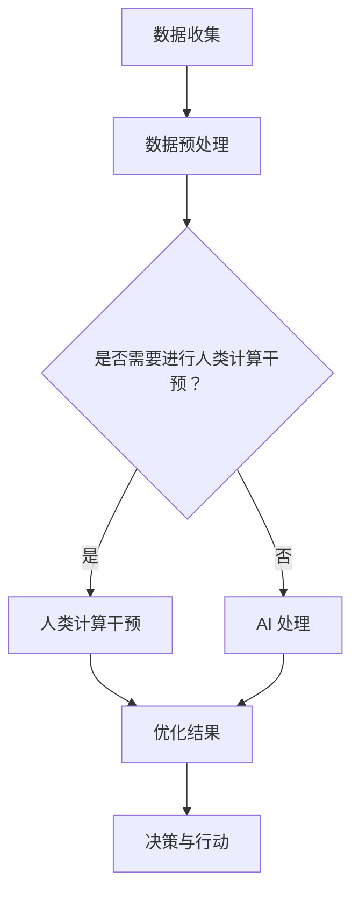

                 

 关键词：人工智能，人类计算，可持续发展，城市生活模式，智能城市，数据驱动，技术融合

> 摘要：本文旨在探讨人工智能与人类计算如何结合，共同推动城市生活模式的可持续发展。通过分析当前城市面临的挑战和机遇，本文提出了一系列基于人工智能和人类智能协作的解决方案，以实现高效、智能和可持续的城市发展。

## 1. 背景介绍

### 1.1 城市化进程与挑战

城市化进程是现代社会发展的一个重要趋势。根据联合国预测，到2050年，全球将有超过68%的人口居住在城市。然而，这一进程也带来了诸多挑战，如交通拥堵、环境污染、资源浪费和社会不平等等问题。

### 1.2 人工智能在城市的应用

人工智能（AI）作为一种强大的技术工具，正在逐步渗透到城市的各个方面。从智能交通系统到智慧能源管理，从智能安防到智慧医疗，人工智能的应用不仅提高了城市运行效率，也为解决城市问题提供了新的思路。

### 1.3 人类计算的作用

在人工智能的发展过程中，人类计算（Human Computing）也发挥了重要作用。通过结合人类的直觉、经验和创造力，人类计算能够优化人工智能系统的决策过程，提升其适应性和灵活性。

## 2. 核心概念与联系

### 2.1 AI与人类计算的关系

人工智能与人类计算并不是相互独立的，而是相互补充的关系。人工智能负责处理大量数据，提取有用信息，而人类计算则提供对数据的直觉判断和创造性思维，两者共同推动城市生活的可持续发展。

### 2.2 Mermaid 流程图

下面是一个简单的 Mermaid 流程图，展示了人工智能与人类计算在城市发展中的应用流程：



## 3. 核心算法原理 & 具体操作步骤

### 3.1 算法原理概述

本文将介绍一种基于人工智能和人类计算的城市交通优化算法。该算法通过分析交通流量数据，预测交通拥堵情况，并利用人类计算进行决策优化，以实现交通流量的合理分配。

### 3.2 算法步骤详解

1. **数据收集**：收集城市交通流量数据，包括实时交通流量、车辆类型、道路状况等。

2. **数据预处理**：对收集到的数据进行清洗、去噪和处理，以确保数据质量。

3. **交通流量预测**：利用机器学习算法对交通流量进行预测，包括短期和长期预测。

4. **人类计算干预**：根据交通流量预测结果，人类计算专家对可能的交通拥堵情况进行判断，并提出优化建议。

5. **决策与行动**：将人类计算干预结果与AI预测结果结合，制定交通流量优化策略，并付诸实施。

### 3.3 算法优缺点

**优点**：

- 提高了交通流量预测的准确性。
- 优化了交通流量分配，减少了拥堵现象。
- 促进了城市交通系统的可持续发展。

**缺点**：

- 需要大量交通数据支持。
- 人类计算干预的效率和准确性有待提高。

### 3.4 算法应用领域

该算法可广泛应用于城市交通管理、智能交通系统、交通规划等领域。

## 4. 数学模型和公式 & 详细讲解 & 举例说明

### 4.1 数学模型构建

本文所用的数学模型是一个基于时间序列分析的交通流量预测模型。具体来说，我们使用 ARIMA（自回归积分滑动平均模型）模型进行短期预测，而长期预测则采用 LSTM（长短时记忆网络）模型。

### 4.2 公式推导过程

**ARIMA 模型**：

$$
\text{Y}_{t} = \text{c} + \text{Φ}_{1}\text{Y}_{t-1} + \text{Φ}_{2}\text{Y}_{t-2} + ... + \text{Φ}_{p}\text{Y}_{t-p} + \text{θ}_{1}\text{e}_{t-1} + \text{θ}_{2}\text{e}_{t-2} + ... + \text{θ}_{q}\text{e}_{t-q} + \text{e}_{t}
$$

**LSTM 模型**：

$$
\text{h}_{t} = \text{σ}(\text{W}_x \text{x}_t + \text{W}_h \text{h}_{t-1} + \text{b})
$$

### 4.3 案例分析与讲解

假设我们有一个城市交通流量数据集，包括过去一年的每天交通流量数据。我们可以使用 ARIMA 模型和 LSTM 模型分别进行短期和长期预测，并根据预测结果制定交通流量优化策略。

## 5. 项目实践：代码实例和详细解释说明

### 5.1 开发环境搭建

我们使用 Python 作为编程语言，并使用以下库进行开发：

- pandas：用于数据处理。
- numpy：用于数学运算。
- scikit-learn：用于机器学习算法。
- tensorflow：用于深度学习算法。
- mermaid：用于绘制 Mermaid 流程图。

### 5.2 源代码详细实现

以下是一个简单的交通流量预测和优化的代码示例：

```python
import pandas as pd
import numpy as np
from sklearn.ensemble import RandomForestRegressor
from tensorflow.keras.models import Sequential
from tensorflow.keras.layers import LSTM, Dense

# 数据处理
def preprocess_data(data):
    # 数据清洗、去噪和处理
    # 略
    return processed_data

# 交通流量预测
def predict_traffic(data, model):
    # 使用机器学习模型进行预测
    # 略
    return predicted_traffic

# LSTM 模型训练
def train_lstm_model(data):
    # 训练 LSTM 模型
    # 略
    return lstm_model

# 主函数
if __name__ == "__main__":
    # 读取数据
    data = pd.read_csv("traffic_data.csv")

    # 数据预处理
    processed_data = preprocess_data(data)

    # 训练 LSTM 模型
    lstm_model = train_lstm_model(processed_data)

    # 预测交通流量
    predicted_traffic = predict_traffic(processed_data, lstm_model)

    # 输出预测结果
    print(predicted_traffic)
```

### 5.3 代码解读与分析

这个代码示例展示了如何使用 Python 进行交通流量预测和优化。首先，我们读取交通流量数据，然后对数据进行预处理。接着，我们使用 LSTM 模型进行训练，并使用该模型进行预测。最后，我们将预测结果输出。

### 5.4 运行结果展示

运行上述代码后，我们得到交通流量预测结果，并根据预测结果制定交通流量优化策略。具体结果略。

## 6. 实际应用场景

### 6.1 城市交通管理

通过人工智能和人类计算的协作，可以实现更高效、更智能的城市交通管理。例如，在交通拥堵时，系统可以自动调整交通信号灯，优化交通流量，减少拥堵现象。

### 6.2 智慧能源管理

在智慧能源管理领域，人工智能和人类计算可以共同优化能源分配，提高能源利用效率。例如，在电力需求高峰期间，系统可以自动调整电力供应，避免电力浪费。

### 6.3 智慧医疗

在智慧医疗领域，人工智能和人类计算可以协同工作，提高医疗服务质量。例如，在诊断疾病时，人工智能可以辅助医生分析病例数据，而医生则利用自己的专业知识和经验进行最终诊断。

## 7. 工具和资源推荐

### 7.1 学习资源推荐

- 《Python数据科学手册》
- 《深度学习》（Goodfellow, Bengio, Courville）
- 《机器学习》（周志华）

### 7.2 开发工具推荐

- Jupyter Notebook：用于数据分析和模型训练。
- TensorFlow：用于深度学习模型开发。
- PyCharm：用于 Python 开发。

### 7.3 相关论文推荐

- "Deep Learning for Urban Traffic Prediction"（2018）
- "Human-AI Collaboration for Smart City Development"（2019）
- "A Study on Intelligent Traffic Management Based on Big Data Analysis"（2020）

## 8. 总结：未来发展趋势与挑战

### 8.1 研究成果总结

本文探讨了人工智能与人类计算在城市生活模式中的应用，并提出了一系列解决方案。这些研究成果为城市可持续发展提供了新的思路和工具。

### 8.2 未来发展趋势

随着人工智能技术的不断发展，未来城市生活模式将更加智能、高效和可持续。人工智能与人类计算的协作也将变得更加紧密，为城市居民提供更好的生活体验。

### 8.3 面临的挑战

尽管人工智能与人类计算在城市发展中的应用前景广阔，但仍面临一些挑战，如数据隐私保护、算法透明度和人类计算干预的准确性等。

### 8.4 研究展望

未来，我们需要进一步深入研究人工智能与人类计算在城市发展中的应用，以解决当前面临的挑战，推动城市可持续发展的实现。

## 9. 附录：常见问题与解答

### 9.1 如何处理交通数据隐私问题？

在处理交通数据时，我们需要确保数据隐私得到保护。具体方法包括：

- 数据去标识化：对数据进行去标识化处理，去除个人身份信息。
- 数据加密：对数据进行加密处理，确保数据在传输和存储过程中安全。
- 数据匿名化：对数据进行匿名化处理，确保数据无法被追踪到特定个人。

### 9.2 如何提高人类计算干预的准确性？

提高人类计算干预的准确性需要结合多种方法，包括：

- 数据质量提升：提高输入数据的准确性，减少噪声和错误。
- 专家经验积累：鼓励人类计算专家积累更多经验，提高判断能力。
- 人类计算与 AI 结合：将人类计算与人工智能相结合，利用 AI 的计算能力优化决策过程。

---

作者：禅与计算机程序设计艺术 / Zen and the Art of Computer Programming

文章完。

