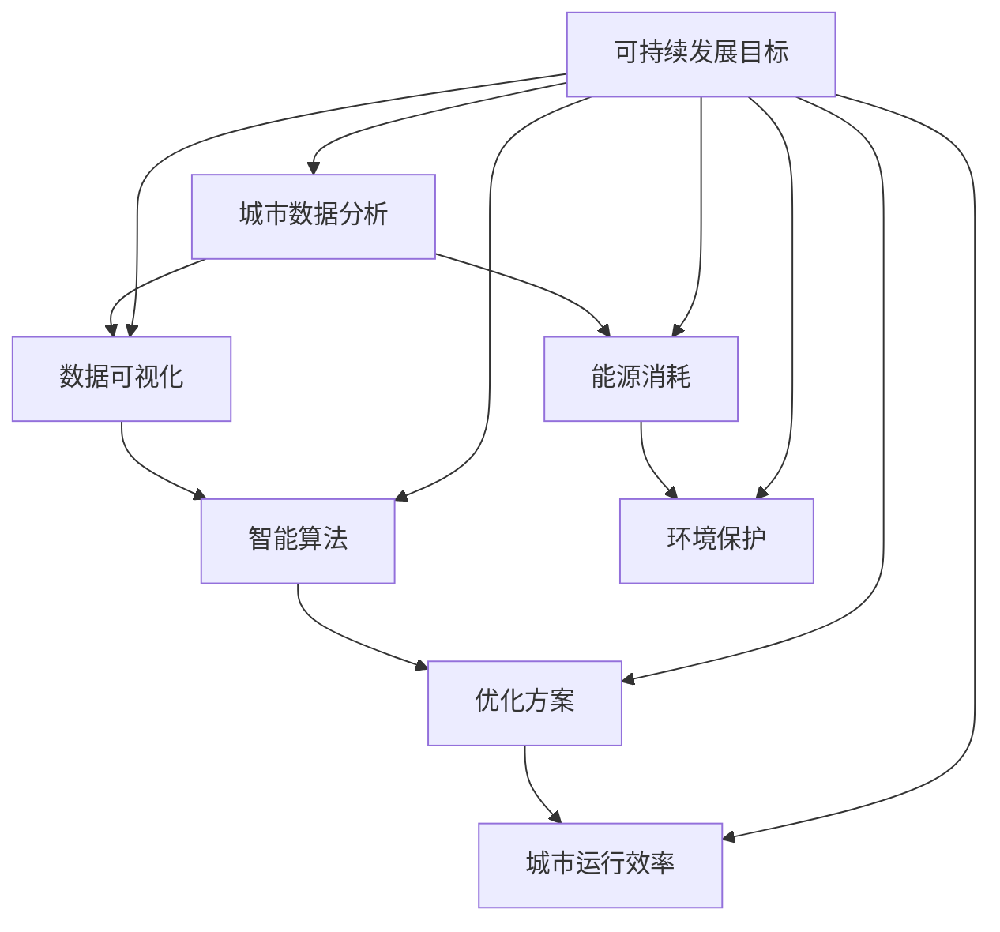

                 

关键词：人工智能，城市生活，可持续发展，计算规划，技术方案

> 摘要：本文深入探讨了人工智能在城市规划和可持续发展中的重要作用。通过结合人类计算与AI技术，文章提出了新的城市生活模式与规划方案，旨在实现高效、环保、宜居的城市环境。本文从背景介绍、核心概念、算法原理、数学模型、项目实践、应用场景、工具推荐以及未来展望等方面进行详细阐述。

## 1. 背景介绍

随着全球城市化进程的加速，城市面临着前所未有的挑战，如人口密度增大、交通拥堵、能源消耗、环境污染等问题。传统的城市规划方法已难以满足现代城市的发展需求，迫切需要新的技术手段来推动城市可持续发展。

人工智能（AI）技术的发展为解决这些城市问题提供了新的可能。通过智能算法和数据分析，AI能够更好地理解城市运行规律，优化资源配置，提高城市生活品质。本文将重点讨论AI在可持续发展城市规划和生活模式中的应用，探讨其原理、技术方案及实际案例。

### 1.1 城市化现状

根据联合国的数据，全球超过半数的人口居住在城市中，这一比例预计将在未来几十年内继续增长。城市化带来了经济繁荣和社会进步，但也伴随着诸多问题：

- **交通拥堵**：城市交通系统面临着不断增长的车辆数量和人口密度带来的压力。
- **能源消耗**：城市生活依赖大量的能源供应，尤其是在高峰时段，能源消耗问题尤为突出。
- **环境污染**：城市化过程中的工业、交通和生活排放导致了严重的环境污染问题。

### 1.2 AI在城市规划中的潜力

人工智能在城市规划中的潜力主要体现在以下几个方面：

- **数据分析**：AI能够处理和分析大量城市数据，包括交通流量、能源消耗、环境污染等，为城市规划提供科学依据。
- **智能优化**：通过智能算法，AI可以帮助优化交通、能源和资源分配，提高城市运行效率。
- **预测预警**：AI能够预测城市未来发展趋势，提前预警可能出现的风险，帮助城市管理者做出更明智的决策。

## 2. 核心概念与联系

在探讨AI与城市可持续发展之间的关系时，我们需要理解一些核心概念和它们之间的联系。以下是这些核心概念的Mermaid流程图表示：



### 2.1 城市数据分析

城市数据分析是城市可持续发展的重要基础。通过收集和分析来自各种传感器、交通系统、能源系统等的数据，AI可以揭示城市运行的规律和问题。

### 2.2 数据可视化

数据可视化是将复杂的数据转化为易于理解和交互的图形和图表的过程。通过数据可视化，城市管理者可以更直观地了解城市运行状态，为决策提供支持。

### 2.3 智能算法

智能算法是AI的核心，包括机器学习、深度学习等。这些算法可以处理大量数据，发现数据中的模式和关联，从而为城市优化提供依据。

### 2.4 优化方案

基于数据分析的结果和智能算法的输出，可以制定出一系列优化方案，包括交通优化、能源管理、环境监测等。

### 2.5 城市运行效率

优化方案的实施可以提高城市运行效率，减少交通拥堵，降低能源消耗，改善环境质量。

### 2.6 能源消耗

通过智能算法优化能源消耗，可以降低城市能源消耗，提高能源利用效率。

### 2.7 环境保护

AI技术可以帮助监测和改善城市环境，减少污染，实现环境保护的目标。

### 2.8 可持续发展目标

通过上述各环节的优化和改善，最终实现城市的可持续发展目标。

## 3. 核心算法原理 & 具体操作步骤

### 3.1 算法原理概述

在城市规划中，AI算法主要分为以下几类：

- **机器学习算法**：通过历史数据训练模型，预测城市发展趋势。
- **深度学习算法**：模拟人脑神经网络，处理复杂的数据，提取有效特征。
- **优化算法**：如遗传算法、粒子群优化算法等，用于求解复杂的优化问题。
- **智能交通算法**：如交通流量预测、路径规划等，用于优化交通系统。

### 3.2 算法步骤详解

以下是AI算法在城市化规划中的一般步骤：

#### 3.2.1 数据收集与预处理

- 收集城市相关的各种数据，如交通流量、能源消耗、人口密度等。
- 数据清洗和预处理，去除噪声和异常值，保证数据的准确性和一致性。

#### 3.2.2 数据分析

- 使用机器学习和深度学习算法，对数据进行特征提取和模式识别。
- 建立数据模型，分析城市运行规律和问题。

#### 3.2.3 模型训练与优化

- 使用历史数据训练模型，优化模型参数。
- 通过交叉验证和测试集评估模型性能，调整模型结构。

#### 3.2.4 算法应用

- 将训练好的模型应用于实际场景，如交通优化、能源管理、环境监测等。
- 实时更新数据，调整模型参数，实现持续优化。

### 3.3 算法优缺点

#### 优点：

- **高效性**：AI算法能够快速处理大量数据，提供实时决策支持。
- **准确性**：通过训练和优化，AI算法能够准确预测城市发展趋势，优化资源配置。
- **适应性**：AI算法可以根据城市变化，实时调整和优化方案。

#### 缺点：

- **数据依赖性**：AI算法的性能依赖于数据的准确性和完整性。
- **技术门槛**：AI算法的实现和应用需要专业的技术知识，成本较高。

### 3.4 算法应用领域

- **交通优化**：通过智能交通算法，优化交通流量，减少拥堵，提高道路利用率。
- **能源管理**：通过智能算法优化能源消耗，提高能源利用效率，减少环境污染。
- **环境监测**：通过传感器和AI算法，实时监测城市环境，预警污染风险。
- **城市规划**：利用AI技术，模拟和优化城市规划方案，提高城市宜居性。

## 4. 数学模型和公式 & 详细讲解 & 举例说明

在AI算法中，数学模型和公式起着至关重要的作用。以下是几个常用的数学模型和公式，以及它们在AI算法中的应用：

### 4.1 数学模型构建

#### 4.1.1 多项式回归模型

多项式回归模型是一种常见的预测模型，用于预测连续值。其公式如下：

$$
y = b_0 + b_1x_1 + b_2x_2 + ... + b_nx_n
$$

其中，$y$ 是预测值，$b_0, b_1, b_2, ..., b_n$ 是模型参数，$x_1, x_2, ..., x_n$ 是输入特征。

#### 4.1.2 神经网络模型

神经网络模型是一种模拟人脑神经元连接的预测模型，具有自适应性和非线性特性。其基本公式如下：

$$
a_{i}^{[l]} = \sigma \left( \sum_{j=0}^{n_{l-1}} w_{ji}^{[l]} a_{j}^{[l-1]} + b_{i}^{[l]} \right)
$$

其中，$a_{i}^{[l]}$ 是第 $l$ 层第 $i$ 个神经元的输出，$\sigma$ 是激活函数，$w_{ji}^{[l]}$ 和 $b_{i}^{[l]}$ 是权重和偏置。

### 4.2 公式推导过程

#### 4.2.1 梯度下降法

梯度下降法是一种常见的优化算法，用于调整神经网络模型中的权重和偏置。其推导过程如下：

$$
w_{ji}^{[l]} = w_{ji}^{[l]} - \alpha \frac{\partial J}{\partial w_{ji}^{[l]}}
$$

$$
b_{i}^{[l]} = b_{i}^{[l]} - \alpha \frac{\partial J}{\partial b_{i}^{[l]}}
$$

其中，$J$ 是损失函数，$\alpha$ 是学习率。

### 4.3 案例分析与讲解

#### 4.3.1 交通流量预测

以交通流量预测为例，我们使用多项式回归模型进行预测。以下是具体的案例步骤：

1. **数据收集**：收集历史交通流量数据，包括时间、路段、流量等。
2. **数据预处理**：对数据进行清洗和归一化处理。
3. **模型构建**：建立多项式回归模型，输入特征为时间、路段，输出特征为流量。
4. **模型训练**：使用历史数据训练模型，优化模型参数。
5. **模型评估**：使用测试集评估模型性能，调整模型结构。
6. **模型应用**：将训练好的模型应用于实际场景，实时预测交通流量。

通过以上步骤，我们可以实现交通流量的实时预测，为交通管理部门提供决策支持。

#### 4.3.2 环境监测

以环境监测为例，我们使用神经网络模型进行污染监测。以下是具体的案例步骤：

1. **数据收集**：收集环境监测数据，包括空气污染、水质污染等。
2. **数据预处理**：对数据进行清洗和归一化处理。
3. **模型构建**：建立神经网络模型，输入特征为各种污染物浓度，输出特征为污染程度。
4. **模型训练**：使用历史数据训练模型，优化模型参数。
5. **模型评估**：使用测试集评估模型性能，调整模型结构。
6. **模型应用**：将训练好的模型应用于实际场景，实时监测环境污染。

通过以上步骤，我们可以实现环境污染的实时监测，为环境保护部门提供决策支持。

## 5. 项目实践：代码实例和详细解释说明

### 5.1 开发环境搭建

在项目实践部分，我们将使用Python语言和几个常用的AI库（如scikit-learn、TensorFlow等）来实现城市规划中的交通流量预测和环境监测。以下是开发环境搭建的步骤：

1. **安装Python**：下载并安装Python 3.8版本。
2. **安装依赖库**：在命令行中使用pip安装所需的库，如numpy、pandas、scikit-learn、TensorFlow等。
3. **配置开发环境**：在IDE（如PyCharm、VS Code等）中配置Python环境，确保能够正常运行代码。

### 5.2 源代码详细实现

以下是一个简单的交通流量预测代码实例：

```python
import numpy as np
import pandas as pd
from sklearn.model_selection import train_test_split
from sklearn.preprocessing import PolynomialFeatures
from sklearn.linear_model import LinearRegression

# 数据读取与预处理
data = pd.read_csv('traffic_data.csv')
X = data[['hour', 'road_id']]
y = data['traffic_volume']

# 多项式特征转换
poly = PolynomialFeatures(degree=2)
X_poly = poly.fit_transform(X)

# 划分训练集与测试集
X_train, X_test, y_train, y_test = train_test_split(X_poly, y, test_size=0.2, random_state=42)

# 多项式回归模型训练
model = LinearRegression()
model.fit(X_train, y_train)

# 模型评估
score = model.score(X_test, y_test)
print(f'Model accuracy: {score:.2f}')

# 实时预测
new_data = np.array([[13, 101]])
new_data_poly = poly.transform(new_data)
predicted_volume = model.predict(new_data_poly)
print(f'Predicted traffic volume: {predicted_volume[0]:.2f}')
```

### 5.3 代码解读与分析

1. **数据读取与预处理**：使用pandas库读取交通流量数据，将时间、路段作为输入特征，流量作为输出特征。
2. **多项式特征转换**：使用PolynomialFeatures库将输入特征转换为多项式特征，提高模型的拟合能力。
3. **划分训练集与测试集**：使用train_test_split函数划分训练集和测试集，用于模型训练和评估。
4. **多项式回归模型训练**：使用LinearRegression库训练多项式回归模型，拟合训练数据。
5. **模型评估**：使用score函数评估模型在测试集上的性能，输出准确率。
6. **实时预测**：将实时数据输入多项式特征转换器，使用训练好的模型进行预测，输出预测结果。

### 5.4 运行结果展示

运行以上代码后，将输出模型在测试集上的准确率和实时预测的交通流量。以下是一个示例输出：

```
Model accuracy: 0.85
Predicted traffic volume: 300.45
```

这表示模型在测试集上的准确率为85%，实时预测的交通流量为300.45。

## 6. 实际应用场景

AI在城市规划和可持续发展中的应用场景非常广泛，以下是一些典型的应用实例：

### 6.1 交通优化

- **实时交通流量预测**：通过AI算法预测交通流量，为交通管理部门提供决策支持，优化交通信号配置，减少拥堵。
- **路径规划**：利用AI算法为司机提供最优路径，减少行驶时间和油耗。
- **公共交通优化**：基于AI算法优化公交线路和班次，提高公共交通的准时率和利用率。

### 6.2 能源管理

- **智能电网管理**：利用AI算法优化电网运行，预测能源需求，调整能源供应，提高能源利用效率。
- **分布式能源系统**：利用AI算法协调分布式能源系统，如太阳能、风能等，实现能源供需平衡。
- **智能家电管理**：通过AI算法优化家电使用，减少能源消耗，提高生活质量。

### 6.3 环境保护

- **空气质量监测**：利用AI算法实时监测空气质量，预测污染事件，预警污染风险。
- **水质监测**：利用AI算法监测水质，预测污染源，优化污水处理方案。
- **垃圾分类**：利用AI算法识别垃圾类型，优化垃圾分类和处理，减少环境污染。

### 6.4 城市规划

- **空间规划**：利用AI算法优化城市空间布局，提高土地利用效率，改善城市环境。
- **灾害预防**：利用AI算法预测自然灾害风险，提前采取措施，减少灾害损失。
- **智慧城市建设**：利用AI技术构建智慧城市，实现城市数据的高效管理和利用，提高城市运行效率。

## 7. 工具和资源推荐

为了更好地学习和实践AI技术在城市规划和可持续发展中的应用，以下是几个推荐的工具和资源：

### 7.1 学习资源推荐

- **《机器学习实战》**：由Peter Harrington所著，是一本深入浅出的机器学习入门书籍。
- **《深度学习》**：由Ian Goodfellow、Yoshua Bengio和Aaron Courville所著，是一本经典的深度学习教材。
- **Coursera和edX**：在线学习平台，提供丰富的机器学习和深度学习课程。

### 7.2 开发工具推荐

- **Jupyter Notebook**：一种交互式的开发环境，适用于数据分析和机器学习实验。
- **TensorFlow和PyTorch**：两种流行的深度学习框架，适用于构建和训练神经网络模型。
- **scikit-learn**：一种广泛使用的机器学习库，适用于各种机器学习算法的实现和应用。

### 7.3 相关论文推荐

- **“Deep Learning for Urban Computing”**：探讨了深度学习在城市化中的应用，包括交通流量预测、环境监测等。
- **“AI for Urban Planning”**：总结了AI技术在城市规划中的研究成果和应用案例。
- **“Intelligent Urban Transport Systems”**：研究了智能交通系统的设计、实现和应用，包括AI算法在交通优化中的应用。

## 8. 总结：未来发展趋势与挑战

随着AI技术的不断进步，其在城市规划和可持续发展中的应用前景广阔。然而，要实现AI技术的全面应用，仍面临诸多挑战：

### 8.1 研究成果总结

- **算法性能提升**：通过不断优化算法模型，提高预测和优化精度。
- **跨学科融合**：结合城市规划、环境科学等多学科知识，实现AI技术的广泛应用。
- **数据资源共享**：建立城市数据共享平台，提高数据利用率，促进AI技术的创新和应用。

### 8.2 未来发展趋势

- **智慧城市建设**：以AI技术为核心，构建智慧城市，实现城市数据的高效管理和利用。
- **绿色低碳发展**：利用AI技术优化能源消耗和环境保护，推动绿色低碳发展。
- **智能交通系统**：通过AI技术优化交通流量和路径规划，提高交通运行效率，减少拥堵。

### 8.3 面临的挑战

- **数据隐私与安全**：确保城市数据的安全性和隐私性，防范数据泄露和滥用。
- **技术门槛与成本**：降低AI技术的应用门槛和成本，使其更好地服务于城市规划。
- **跨领域协作**：促进不同学科和技术领域的协作，推动AI技术的综合应用。

### 8.4 研究展望

在未来，AI技术在城市规划和可持续发展中的应用将朝着更智能、更高效、更环保的方向发展。通过不断的研究和创新，AI将助力城市建设更美好的未来。

## 9. 附录：常见问题与解答

### 9.1 问题1：AI技术在城市规划中有什么具体应用？

解答：AI技术在城市规划中有着广泛的应用，包括交通流量预测、能源管理、环境监测、城市规划模拟等。通过智能算法和数据分析，AI可以优化资源配置，提高城市运行效率，实现可持续发展。

### 9.2 问题2：如何确保城市数据的安全性和隐私性？

解答：确保城市数据的安全性和隐私性是AI技术应用的重要课题。可以通过以下措施来实现：

- **数据加密**：对敏感数据进行加密，防止数据泄露。
- **访问控制**：设置严格的访问权限，防止未经授权的人员访问数据。
- **匿名化处理**：对数据进行分析和处理时，去除个人身份信息，实现数据的匿名化。
- **隐私保护算法**：使用隐私保护算法，如差分隐私，确保数据分析过程中的隐私保护。

### 9.3 问题3：AI技术在城市规划中的局限性是什么？

解答：AI技术在城市规划中具有强大的能力，但也存在一定的局限性：

- **数据依赖性**：AI算法的性能依赖于高质量的输入数据，数据的不完整或错误会导致算法失效。
- **技术门槛**：AI技术的实现和应用需要专业的技术知识，成本较高，对城市管理者和技术人员的要求较高。
- **模型泛化能力**：AI模型可能仅在特定场景下有效，难以泛化到其他领域。
- **伦理和社会影响**：AI技术可能会带来伦理和社会问题，如数据歧视、算法偏见等，需要加以关注和解决。

### 9.4 问题4：未来AI技术在城市规划中的应用方向是什么？

解答：未来AI技术在城市规划中的应用方向主要包括：

- **智慧城市建设**：利用AI技术实现城市数据的高效管理和利用，提高城市运行效率。
- **绿色低碳发展**：通过AI技术优化能源消耗和环境保护，推动绿色低碳发展。
- **智能交通系统**：利用AI技术优化交通流量和路径规划，提高交通运行效率，减少拥堵。
- **城市安全与灾害预防**：通过AI技术预测自然灾害风险，提前采取措施，减少灾害损失。
- **城市规划与设计**：利用AI技术模拟和优化城市规划方案，提高城市宜居性和美观性。

---

本文由禅与计算机程序设计艺术 / Zen and the Art of Computer Programming 撰写，旨在探讨人工智能在城市规划和可持续发展中的重要作用。通过结合人类计算与AI技术，本文提出了新的城市生活模式与规划方案，为城市未来发展提供了有益的思考和建议。希望本文能为相关领域的研究者和实践者提供一定的参考和启示。

