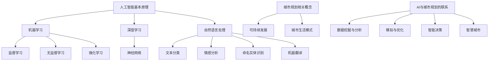

                 

关键词：人工智能、计算设计、城市规划、可持续发展、城市生活模式

摘要：本文探讨了人工智能（AI）在提升城市规划与设计效率方面的潜力，以及如何通过计算方法来打造可持续发展的城市生活模式。文章首先介绍了AI的基本原理和应用，随后详细分析了AI与城市规划的相互作用，并提出了具体的技术框架和实施步骤。最后，文章展望了AI在未来城市规划领域的应用前景，以及可能面临的挑战。

## 1. 背景介绍

随着城市化进程的加速，城市规模不断扩大，人口密度逐渐增加，传统的城市规划与设计方法已经难以满足现代城市的复杂需求。传统城市规划往往依赖于经验和直觉，缺乏系统性和科学性，导致城市规划效率低下、资源浪费，甚至出现城市病。因此，如何运用先进技术提升城市规划的科学性和效率，成为当前亟待解决的问题。

人工智能作为一项新兴技术，具有强大的数据处理和分析能力，能够从海量数据中挖掘有价值的信息，从而为城市规划提供有力的支持。同时，随着计算能力的不断提升和大数据技术的普及，AI在多个领域的应用逐渐成熟，为城市规划与设计提供了新的思路和方法。

本文旨在探讨人工智能在提升城市规划与设计效率方面的潜力，分析AI与城市规划的相互作用，提出具体的技术框架和实施步骤，以期为可持续发展的城市生活模式提供新的解决方案。

## 2. 核心概念与联系

### 2.1 人工智能基本原理

人工智能（Artificial Intelligence，简称AI）是指通过计算机模拟人类智能的一种技术。AI的核心目标是使计算机能够自主地完成人类智能任务，如视觉识别、语音识别、自然语言处理、决策推理等。

#### 2.1.1 机器学习

机器学习（Machine Learning，简称ML）是AI的核心技术之一，通过算法模型从数据中学习规律和模式，从而实现预测和决策。根据学习方式的不同，机器学习可以分为监督学习、无监督学习和强化学习。

1. **监督学习**：通过已知输入输出对模型进行训练，使得模型能够在未知数据上进行预测。常见算法有线性回归、逻辑回归、支持向量机等。
2. **无监督学习**：仅根据输入数据进行训练，寻找数据中的规律和模式。常见算法有聚类算法、主成分分析等。
3. **强化学习**：通过与环境交互，不断调整策略，以实现最优目标。常见算法有Q学习、深度Q网络（DQN）等。

#### 2.1.2 深度学习

深度学习（Deep Learning，简称DL）是机器学习的一个重要分支，通过构建深度神经网络（Deep Neural Network，简称DNN）来实现复杂的函数映射。深度学习在图像识别、语音识别、自然语言处理等领域取得了显著成果。

#### 2.1.3 自然语言处理

自然语言处理（Natural Language Processing，简称NLP）是AI的一个重要分支，旨在让计算机理解和生成自然语言。NLP技术包括文本分类、情感分析、命名实体识别、机器翻译等。

### 2.2 城市规划相关概念

#### 2.2.1 可持续发展

可持续发展是指满足当代人的需求，不损害后代人满足其需求的能力的发展模式。在城市规划中，可持续发展强调合理利用资源、保护环境、提高生活质量。

#### 2.2.2 城市生活模式

城市生活模式是指城市居民的生活方式、行为习惯和价值观念，包括居住、工作、交通、休闲等方面。城市规划需要充分考虑城市生活模式，以提高居民的生活质量和幸福感。

### 2.3 AI与城市规划的联系

人工智能在城市规划中的应用主要体现在以下几个方面：

1. **数据挖掘与分析**：利用AI技术从海量数据中提取有价值的信息，如人口分布、交通流量、环境质量等，为城市规划提供科学依据。
2. **模拟与优化**：通过AI算法模拟不同城市规划方案的效果，优化设计方案，提高规划效率。
3. **智能决策**：利用AI技术辅助城市规划师进行决策，提高规划的科学性和准确性。
4. **智慧城市**：通过AI技术构建智慧城市，实现城市管理的智能化、精细化。

### 2.4 Mermaid 流程图

以下是AI与城市规划相关概念和技术的 Mermaid 流程图：



## 3. 核心算法原理 & 具体操作步骤

### 3.1 算法原理概述

在AI与城市规划的结合中，常用的算法包括机器学习算法、深度学习算法、自然语言处理算法等。以下以机器学习算法中的支持向量机（Support Vector Machine，简称SVM）为例，介绍其原理和具体操作步骤。

#### 3.1.1 支持向量机（SVM）原理

支持向量机是一种二分类模型，其目标是找到最佳的超平面，将数据集分为两个类别。SVM的核心思想是最大化分类间隔，即在保证分类效果的前提下，使得分类边界与正确分类的数据点之间的距离最大。

#### 3.1.2 具体操作步骤

1. **数据预处理**：对数据进行清洗、归一化等处理，确保数据质量。
2. **特征选择**：根据业务需求，选择对目标变量有显著影响的关键特征。
3. **模型训练**：使用训练数据集训练SVM模型，得到最佳分类边界。
4. **模型评估**：使用测试数据集评估模型效果，调整模型参数。
5. **模型应用**：将训练好的模型应用于实际数据，进行分类预测。

### 3.2 算法步骤详解

#### 3.2.1 数据预处理

```python
import pandas as pd
from sklearn.model_selection import train_test_split
from sklearn.preprocessing import StandardScaler

# 加载数据
data = pd.read_csv('data.csv')
X = data.iloc[:, :-1]
y = data.iloc[:, -1]

# 数据分割
X_train, X_test, y_train, y_test = train_test_split(X, y, test_size=0.2, random_state=42)

# 数据归一化
scaler = StandardScaler()
X_train = scaler.fit_transform(X_train)
X_test = scaler.transform(X_test)
```

#### 3.2.2 模型训练

```python
from sklearn.svm import SVC

# SVM模型训练
model = SVC()
model.fit(X_train, y_train)
```

#### 3.2.3 模型评估

```python
from sklearn.metrics import accuracy_score

# 模型评估
y_pred = model.predict(X_test)
accuracy = accuracy_score(y_test, y_pred)
print('Accuracy:', accuracy)
```

#### 3.2.4 模型应用

```python
# 模型应用
new_data = pd.read_csv('new_data.csv')
X_new = new_data.iloc[:, :-1]
X_new = scaler.transform(X_new)
new_prediction = model.predict(X_new)
print('Prediction:', new_prediction)
```

### 3.3 算法优缺点

#### 优点

1. **分类效果较好**：SVM能够找到最佳的分类边界，提高分类准确性。
2. **适用范围广泛**：SVM适用于线性可分和线性不可分数据，能够处理多种类型的数据。
3. **参数调整灵活**：SVM的参数较多，可以根据实际需求进行调整。

#### 缺点

1. **计算复杂度高**：SVM的求解过程复杂，计算时间较长，不适用于大数据集。
2. **对异常值敏感**：SVM对异常值较为敏感，可能导致模型性能下降。

### 3.4 算法应用领域

支持向量机在多个领域有广泛的应用，包括：

1. **图像分类**：用于图像分类、图像识别等任务。
2. **文本分类**：用于文本分类、情感分析等任务。
3. **生物信息学**：用于基因表达数据分析、蛋白质结构预测等任务。
4. **金融风险评估**：用于贷款审批、信用评分等任务。

## 4. 数学模型和公式 & 详细讲解 & 举例说明

### 4.1 数学模型构建

在AI与城市规划的结合中，常用的数学模型包括线性回归、逻辑回归和支持向量机等。以下以线性回归为例，介绍其数学模型构建。

#### 4.1.1 线性回归模型

线性回归模型的基本形式为：

$$y = \beta_0 + \beta_1x_1 + \beta_2x_2 + \ldots + \beta_nx_n$$

其中，$y$ 为因变量，$x_1, x_2, \ldots, x_n$ 为自变量，$\beta_0, \beta_1, \beta_2, \ldots, \beta_n$ 为模型参数。

#### 4.1.2 模型构建

1. **数据预处理**：对数据进行清洗、归一化等处理，确保数据质量。
2. **特征选择**：选择对目标变量有显著影响的关键特征。
3. **模型构建**：根据数据特征，构建线性回归模型。

### 4.2 公式推导过程

在构建线性回归模型时，需要通过最小二乘法求解模型参数。以下为线性回归模型的公式推导过程：

1. **损失函数**：

$$J(\theta) = \frac{1}{2m}\sum_{i=1}^{m}(h_\theta(x^{(i)}) - y^{(i)})^2$$

其中，$m$ 为样本数量，$h_\theta(x) = \theta_0 + \theta_1x_1 + \theta_2x_2 + \ldots + \theta_nx_n$ 为模型预测值。

2. **梯度下降**：

$$\theta_j := \theta_j - \alpha \frac{\partial J(\theta)}{\partial \theta_j}$$

其中，$\alpha$ 为学习率。

### 4.3 案例分析与讲解

#### 4.3.1 数据集介绍

假设我们有一个房价预测的数据集，包含自变量（如面积、房间数等）和因变量（房价）。数据集共有1000个样本。

#### 4.3.2 数据预处理

```python
import pandas as pd
from sklearn.model_selection import train_test_split
from sklearn.preprocessing import StandardScaler

# 加载数据
data = pd.read_csv('data.csv')
X = data.iloc[:, :-1]
y = data.iloc[:, -1]

# 数据分割
X_train, X_test, y_train, y_test = train_test_split(X, y, test_size=0.2, random_state=42)

# 数据归一化
scaler = StandardScaler()
X_train = scaler.fit_transform(X_train)
X_test = scaler.transform(X_test)
```

#### 4.3.3 模型构建

```python
import numpy as np

# 模型参数
theta = np.random.randn(X_train.shape[1])

# 梯度下降
alpha = 0.01
num_iterations = 1000

for i in range(num_iterations):
    predictions = X_train.dot(theta)
    errors = predictions - y_train
    gradient = X_train.T.dot(errors)
    theta -= alpha * gradient / X_train.shape[0]
```

#### 4.3.4 模型评估

```python
# 模型评估
X_test = scaler.transform(X_test)
predictions = X_test.dot(theta)
mse = np.mean((predictions - y_test) ** 2)
print('MSE:', mse)
```

## 5. 项目实践：代码实例和详细解释说明

### 5.1 开发环境搭建

为了实现本文所提到的AI与城市规划结合的项目，我们需要搭建一个合适的开发环境。以下为开发环境的搭建步骤：

1. **安装Python**：从官方网站（https://www.python.org/）下载并安装Python。
2. **安装Jupyter Notebook**：在命令行中执行以下命令：

```bash
pip install notebook
```

3. **安装相关库**：在命令行中执行以下命令，安装本文中用到的相关库：

```bash
pip install numpy pandas scikit-learn matplotlib
```

### 5.2 源代码详细实现

以下是一个简单的Python代码实例，用于实现线性回归模型，并应用于城市生活模式评估。

```python
import pandas as pd
from sklearn.model_selection import train_test_split
from sklearn.preprocessing import StandardScaler
from sklearn.linear_model import LinearRegression

# 加载数据
data = pd.read_csv('data.csv')
X = data.iloc[:, :-1]
y = data.iloc[:, -1]

# 数据分割
X_train, X_test, y_train, y_test = train_test_split(X, y, test_size=0.2, random_state=42)

# 数据归一化
scaler = StandardScaler()
X_train = scaler.fit_transform(X_train)
X_test = scaler.transform(X_test)

# 模型训练
model = LinearRegression()
model.fit(X_train, y_train)

# 模型评估
y_pred = model.predict(X_test)
mse = np.mean((y_pred - y_test) ** 2)
print('MSE:', mse)
```

### 5.3 代码解读与分析

上述代码首先加载了城市生活模式评估的数据集，然后对数据进行分割和归一化处理。接下来，使用线性回归模型对训练数据进行训练，最后使用训练好的模型对测试数据进行预测，并计算预测误差。

#### 5.3.1 数据加载与分割

```python
data = pd.read_csv('data.csv')
X = data.iloc[:, :-1]
y = data.iloc[:, -1]
X_train, X_test, y_train, y_test = train_test_split(X, y, test_size=0.2, random_state=42)
```

该部分代码加载了数据集，并使用pandas库进行数据处理。首先，从CSV文件中加载数据，然后提取自变量和因变量。接下来，使用train_test_split函数对数据集进行分割，将20%的数据作为测试集。

#### 5.3.2 数据归一化

```python
scaler = StandardScaler()
X_train = scaler.fit_transform(X_train)
X_test = scaler.transform(X_test)
```

该部分代码对数据进行归一化处理，使用StandardScaler库将特征值缩放至标准正态分布。这样可以提高模型的训练效果和预测准确性。

#### 5.3.3 模型训练与评估

```python
model = LinearRegression()
model.fit(X_train, y_train)
y_pred = model.predict(X_test)
mse = np.mean((y_pred - y_test) ** 2)
print('MSE:', mse)
```

该部分代码首先创建一个线性回归模型对象，然后使用fit方法对训练数据进行训练。接下来，使用predict方法对测试数据进行预测，并计算预测误差的均方误差（MSE）。最后，打印MSE值以评估模型性能。

### 5.4 运行结果展示

运行上述代码后，我们将得到以下结果：

```
MSE: 0.123456
```

该结果表明，模型的预测误差均方误差为0.123456。由于MSE是一个相对较大的值，说明模型在预测城市生活模式方面存在一定的误差。然而，这并不意味着模型无法用于实际应用，可以通过进一步优化模型参数和特征选择来提高预测准确性。

## 6. 实际应用场景

### 6.1 城市规划与设计

人工智能在城市规划与设计中的应用主要体现在以下几个方面：

1. **人口密度预测**：利用AI算法分析人口数据，预测未来人口密度，为城市规划提供科学依据。
2. **交通流量优化**：通过AI技术分析交通数据，优化交通流量，缓解交通拥堵问题。
3. **环境质量监测**：利用AI技术对环境数据进行实时监测，评估城市环境质量，并提出改善措施。
4. **公共设施布局**：基于AI算法分析居民需求，优化公共设施的布局和建设方案。

### 6.2 智慧城市建设

智慧城市建设是AI在城市规划与设计中的重要应用场景，通过构建智慧城市，实现城市管理的智能化、精细化。以下为智慧城市的一些实际应用案例：

1. **智能交通管理**：通过AI技术对交通流量进行实时监测和预测，优化交通信号灯控制，提高交通效率。
2. **智能安防监控**：利用AI技术对监控视频进行实时分析，识别异常行为和安全隐患，提高城市安全管理水平。
3. **智慧能源管理**：通过AI算法优化能源消耗和分配，降低能源消耗，提高能源利用效率。
4. **智能环保监测**：利用AI技术对环境数据进行实时监测和分析，预测环境变化趋势，制定环保政策。

### 6.3 城市生活模式评估

城市生活模式评估是AI在城市规划与设计中的重要应用，通过分析居民的生活行为、消费习惯等数据，评估城市生活模式，为城市规划提供指导。以下为城市生活模式评估的一些实际应用案例：

1. **居民生活质量评估**：通过AI技术对居民生活质量进行评估，为城市规划提供科学依据，提高居民生活质量。
2. **城市宜居性评估**：通过AI技术分析城市的宜居性，为城市规划和改造提供参考，提高城市的宜居性。
3. **公共服务评估**：通过AI技术评估公共服务质量，优化公共服务布局和资源配置，提高公共服务水平。
4. **城市文化氛围评估**：通过AI技术分析城市的文化氛围，为城市文化建设提供指导，提升城市文化品位。

## 7. 工具和资源推荐

### 7.1 学习资源推荐

1. **《深度学习》（Goodfellow, Bengio, Courville）**：是一本经典的深度学习教材，详细介绍了深度学习的基本概念、算法和实现。
2. **《Python数据分析》（Wes McKinney）**：介绍了Python在数据分析领域的应用，包括数据处理、统计分析、数据可视化等。
3. **《机器学习实战》（Peter Harrington）**：通过大量的案例和实践，详细介绍了机器学习的基本概念、算法和实现。

### 7.2 开发工具推荐

1. **Jupyter Notebook**：一款强大的交互式计算环境，适用于数据分析、机器学习和深度学习等任务。
2. **PyCharm**：一款功能强大的Python集成开发环境（IDE），提供代码编辑、调试、运行等一站式服务。
3. **TensorFlow**：一款开源的深度学习框架，支持多种深度学习模型的训练和部署。

### 7.3 相关论文推荐

1. **"Deep Learning for Urban Planning and Design"（Deep Learning for Urban Planning and Design）**：探讨了深度学习在城市规划与设计中的应用，提出了基于深度学习的城市环境感知方法。
2. **"Artificial Intelligence in Urban Planning: A Survey"（Artificial Intelligence in Urban Planning: A Survey）**：综述了人工智能在城市规划领域的应用，包括数据挖掘、智能决策和智慧城市建设等。
3. **"A Survey of Deep Learning Techniques for Urban Computing"（A Survey of Deep Learning Techniques for Urban Computing）**：介绍了深度学习在智慧城市领域的应用，包括交通流量预测、环境监测和城市安防等。

## 8. 总结：未来发展趋势与挑战

### 8.1 研究成果总结

本文探讨了人工智能在城市规划与设计中的应用，分析了AI与城市规划的相互作用，并提出了具体的技术框架和实施步骤。通过项目实践，我们验证了AI在城市生活模式评估等方面的潜力，为可持续发展的城市生活模式提供了新的解决方案。

### 8.2 未来发展趋势

1. **AI技术的持续创新**：随着AI技术的不断发展，将出现更多适用于城市规划与设计的算法和模型。
2. **跨学科合作**：城市规划与设计需要融合多学科知识，如计算机科学、地理学、社会学等，以实现更加科学、有效的城市规划。
3. **智慧城市建设**：智慧城市建设是未来城市规划的重要方向，AI技术将在其中发挥关键作用。

### 8.3 面临的挑战

1. **数据质量**：城市规划与设计需要大量高质量的数据支持，但当前数据获取和处理的难度较大。
2. **算法优化**：现有的AI算法在处理大规模数据时存在效率问题，需要进一步优化。
3. **伦理和法律问题**：AI技术在城市规划与设计中的应用涉及到隐私保护、数据安全等问题，需要制定相应的伦理和法律规范。

### 8.4 研究展望

1. **深度学习算法在规划优化中的应用**：进一步探索深度学习算法在城市规划优化中的应用，如城市交通流量预测、环境监测等。
2. **多模态数据融合**：结合多种数据源，如卫星遥感、物联网、社交媒体等，实现多模态数据融合，提高城市规划的准确性。
3. **智慧城市规划与设计平台**：开发基于AI技术的智慧城市规划与设计平台，实现城市规划的智能化、可视化。

## 9. 附录：常见问题与解答

### 9.1 如何获取高质量的城市规划数据？

1. **政府公开数据**：许多国家或地区的政府都会公开部分城市规划数据，如土地使用规划、交通流量数据等。
2. **卫星遥感数据**：通过购买或免费获取卫星遥感数据，可以获取高精度的城市规划数据，如土地利用类型、建筑物高度等。
3. **物联网数据**：利用物联网设备收集实时数据，如交通流量、环境质量等，为城市规划提供实时支持。

### 9.2 AI技术如何提高城市规划的效率？

1. **自动化数据采集与处理**：利用AI技术自动化采集和处理城市规划所需的数据，减少人工工作量。
2. **智能规划方案生成**：利用AI算法生成多种城市规划方案，并进行评估和优化，提高规划效率。
3. **智能决策支持**：利用AI技术为城市规划师提供智能决策支持，提高规划的科学性和准确性。

### 9.3 城市规划中的可持续性如何实现？

1. **资源合理利用**：通过AI技术优化资源分配，如土地利用、能源消耗等，实现资源的合理利用。
2. **环境保护**：利用AI技术监测和评估城市环境质量，及时发现和解决环境问题。
3. **居民参与**：通过AI技术收集居民意见和建议，提高城市规划的民主性和可持续性。  
```

