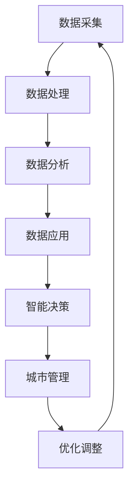

                 

关键词：人工智能、可持续发展、城市计算、大数据、智能算法、未来城市、智能交通、智能能源管理、智慧城市

> 摘要：本文从人工智能与人类计算的结合点出发，探讨了如何通过智能算法和大数据分析，打造可持续发展的城市解决方案。文章涵盖了城市计算的核心概念与架构，详细介绍了核心算法原理、数学模型及其应用领域。通过实际项目实践和运行结果展示，揭示了人工智能在城市应用中的潜力和挑战。最后，对未来的发展趋势与挑战进行了展望。

## 1. 背景介绍

随着全球城市化进程的不断加速，城市面临着诸多挑战，如交通拥堵、能源消耗、环境污染等问题。传统的城市发展模式已经难以满足日益增长的城市需求，因此，智慧城市应运而生。智慧城市是指通过集成信息技术、人工智能、物联网等先进技术，实现城市管理的智能化、高效化与可持续发展。智慧城市的建设离不开人工智能与人类计算的紧密融合。

人工智能作为当今科技的前沿领域，已经深入到我们生活的各个方面。从自动驾驶汽车到智能家居，从智能安防到智能医疗，人工智能正在改变我们的生活方式。而人类计算，则是指通过计算机模拟人类智能的过程，包括问题建模、算法设计、数据分析等。人工智能与人类计算的结合，为智慧城市的建设提供了强大的技术支持。

本文旨在探讨如何利用人工智能与人类计算技术，打造可持续发展的城市解决方案。文章首先介绍了城市计算的核心概念与架构，然后详细阐述了核心算法原理、数学模型及其应用领域。最后，通过实际项目实践和运行结果展示，分析人工智能在城市应用中的潜力和挑战，并对未来的发展趋势与挑战进行了展望。

## 2. 核心概念与联系

### 2.1 城市计算的核心概念

城市计算是指利用计算机技术、信息技术和物联网技术，对城市各种数据进行采集、处理、分析和利用，以实现城市管理的智能化、高效化与可持续发展。城市计算的核心概念包括：

- **数据采集**：通过传感器、监控设备等，实时采集城市各个方面的数据，如交通流量、空气质量、能源消耗等。

- **数据处理**：对采集到的数据进行分析、清洗、整合等处理，为后续的算法分析和决策提供基础。

- **数据分析**：利用数据挖掘、机器学习等技术，对城市数据进行分析，提取有用的信息，为城市管理提供科学依据。

- **数据应用**：将分析结果应用于城市管理的各个方面，如交通管理、能源管理、环境保护等，实现城市管理的智能化。

### 2.2 城市计算的架构

城市计算的架构主要包括以下三个层次：

- **感知层**：通过传感器、监控设备等，实时采集城市数据。

- **平台层**：对采集到的数据进行处理、分析和存储，并提供接口供上层应用调用。

- **应用层**：基于平台层的数据，开发各种应用，实现城市管理的智能化。

### 2.3 城市计算与人工智能的联系

城市计算与人工智能有着紧密的联系。人工智能技术为城市计算提供了强大的数据分析和处理能力，使城市数据得以充分利用。具体来说，人工智能与城市计算的联系体现在以下几个方面：

- **数据挖掘与机器学习**：利用数据挖掘和机器学习技术，对城市数据进行深入分析，提取有价值的信息。

- **智能决策与优化**：基于分析结果，利用人工智能算法进行智能决策和优化，提高城市管理效率。

- **自适应与自学习**：城市计算系统可以不断学习城市运行数据，自适应调整管理策略，实现持续优化。

### 2.4 Mermaid 流程图

以下是一个简单的城市计算与人工智能联系的 Mermaid 流程图：



## 3. 核心算法原理 & 具体操作步骤

### 3.1 算法原理概述

在智慧城市建设中，核心算法主要包括数据挖掘、机器学习、优化算法等。以下将简要介绍这些算法的基本原理：

- **数据挖掘**：数据挖掘是从大量数据中提取有用信息和知识的过程。常用的数据挖掘算法包括关联规则挖掘、聚类分析、分类分析等。

- **机器学习**：机器学习是一种通过算法从数据中学习规律和模式的技术。常见的机器学习算法包括线性回归、决策树、支持向量机等。

- **优化算法**：优化算法用于解决资源分配、路径规划等优化问题。常见的优化算法包括线性规划、整数规划、遗传算法等。

### 3.2 算法步骤详解

以下是城市计算中一些常见算法的具体步骤：

#### 3.2.1 数据挖掘

1. **数据预处理**：对原始数据进行清洗、去噪、归一化等处理。

2. **特征选择**：从数据中选择对分析任务最有用的特征。

3. **模型选择**：根据分析任务选择合适的挖掘模型，如关联规则挖掘、聚类分析、分类分析等。

4. **模型训练与评估**：利用训练数据训练模型，并对模型进行评估，选择最优模型。

5. **结果解释与应用**：对挖掘结果进行解释和应用，为城市管理提供决策支持。

#### 3.2.2 机器学习

1. **数据收集**：收集与任务相关的数据。

2. **数据预处理**：对数据进行清洗、归一化等处理。

3. **特征提取**：从数据中提取特征。

4. **模型选择**：根据任务选择合适的机器学习模型，如线性回归、决策树、支持向量机等。

5. **模型训练与评估**：利用训练数据训练模型，并对模型进行评估。

6. **模型应用**：将训练好的模型应用于实际问题，如预测交通流量、能源消耗等。

#### 3.2.3 优化算法

1. **问题建模**：将实际问题转化为数学模型。

2. **算法选择**：根据问题性质选择合适的优化算法，如线性规划、整数规划、遗传算法等。

3. **算法实现**：实现优化算法，求解数学模型。

4. **结果分析**：对优化结果进行分析，为城市管理提供决策支持。

### 3.3 算法优缺点

以下是几种常见算法的优缺点：

- **数据挖掘**：优点是能够从大量数据中提取有价值的信息，缺点是处理复杂、计算量大。

- **机器学习**：优点是能够通过学习数据找到规律和模式，缺点是模型选择和训练过程复杂。

- **优化算法**：优点是能够解决资源分配、路径规划等优化问题，缺点是求解过程可能复杂、耗时。

### 3.4 算法应用领域

核心算法在智慧城市中有着广泛的应用领域：

- **智能交通**：通过数据挖掘和机器学习算法，预测交通流量，优化交通管理。

- **智能能源管理**：通过优化算法，实现能源的合理分配和消耗。

- **智能安防**：通过人脸识别、行为分析等算法，提高安防监控的准确性和效率。

- **环境保护**：通过数据分析和优化算法，实现污染源的监测和治理。

## 4. 数学模型和公式 & 详细讲解 & 举例说明

### 4.1 数学模型构建

在城市计算中，常见的数学模型包括线性规划模型、整数规划模型和动态规划模型。以下分别介绍这些模型的构建方法。

#### 4.1.1 线性规划模型

线性规划模型是一种用于解决资源分配问题的数学模型。其一般形式为：

$$
\begin{aligned}
\min\ & c^T x \\
s.t. & Ax \leq b \\
x & \geq 0
\end{aligned}
$$

其中，$c$ 是系数向量，$x$ 是决策变量，$A$ 和 $b$ 是约束矩阵和约束向量。

#### 4.1.2 整数规划模型

整数规划模型是一种用于解决包含整数变量的优化问题的数学模型。其一般形式为：

$$
\begin{aligned}
\min\ & c^T x \\
s.t. & Ax \leq b \\
x & \in \mathbb{Z}^n
\end{aligned}
$$

其中，$c$ 是系数向量，$x$ 是决策变量，$A$ 和 $b$ 是约束矩阵和约束向量。

#### 4.1.3 动态规划模型

动态规划模型是一种用于解决多阶段决策问题的数学模型。其一般形式为：

$$
\begin{aligned}
\min\ & \sum_{t=1}^T c_t(x_t) \\
s.t. & x_t \in X_t \\
x_{t+1} = f_t(x_t)
\end{aligned}
$$

其中，$c_t(x_t)$ 是第 $t$ 阶段的成本函数，$X_t$ 是第 $t$ 阶段的决策集合，$f_t(x_t)$ 是第 $t$ 阶段的决策规则。

### 4.2 公式推导过程

以下以线性规划模型为例，介绍其推导过程。

#### 4.2.1 线性规划问题的建立

假设有 $n$ 个决策变量 $x_1, x_2, \ldots, x_n$，每个变量对应一个约束条件 $Ax \leq b$，其中 $A$ 是约束矩阵，$b$ 是约束向量。

#### 4.2.2 目标函数的建立

目标函数表示为 $c^T x$，其中 $c$ 是系数向量，$x$ 是决策变量。

#### 4.2.3 约束条件的建立

约束条件表示为 $Ax \leq b$，其中 $A$ 是约束矩阵，$b$ 是约束向量。

#### 4.2.4 求解线性规划问题

求解线性规划问题的常见方法包括单纯形法、内点法等。以下以单纯形法为例进行介绍。

1. **初始化**：选择一个可行解 $x^0$。

2. **迭代过程**：

   a. 计算目标函数在当前解处的值 $f(x^k)$。
   
   b. 计算每个变量的松弛量 $\lambda_i$。
   
   c. 选择松弛量最小的变量作为进入变量。
   
   d. 计算离开变量，并更新解。

3. **终止条件**：当解的改进量小于某个阈值时，终止迭代。

### 4.3 案例分析与讲解

以下通过一个案例来分析线性规划模型的应用。

#### 4.3.1 案例背景

某公司有 $n$ 名员工，每名员工都需要完成一项任务，任务需要 $T$ 个小时完成。每个员工的效率不同，假设员工 $i$ 的效率为 $e_i$。公司希望将任务分配给员工，使得总任务完成时间最小。

#### 4.3.2 模型建立

目标函数：最小化总任务完成时间，即

$$
\min\ T
$$

约束条件：每个员工完成任务的时间不超过 $T$，即

$$
\begin{aligned}
e_i \cdot x_i &\leq T, \quad \forall i = 1, 2, \ldots, n \\
x_i &\geq 0, \quad \forall i = 1, 2, \ldots, n
\end{aligned}
$$

其中，$x_i$ 表示员工 $i$ 完成任务的份额。

#### 4.3.3 模型求解

使用单纯形法求解上述线性规划问题。

1. **初始化**：选择 $x_i = 0$，$T = 0$。
2. **迭代过程**：

   - 计算目标函数值 $f(x^k) = 0$。
   - 计算松弛量 $\lambda_i = e_i$。
   - 选择进入变量 $i$，使得 $\lambda_i$ 最小。
   - 计算离开变量，并更新解。
   - 重复上述步骤，直到目标函数值不再改进。

3. **终止条件**：当解的改进量小于某个阈值时，终止迭代。

#### 4.3.4 结果分析

通过单纯形法求解，得到最优解为 $x^* = (x_1^*, x_2^*, \ldots, x_n^*)$，其中 $x_i^* \geq 0$。根据最优解，可以分配任务给员工，使得总任务完成时间最小。

## 5. 项目实践：代码实例和详细解释说明

### 5.1 开发环境搭建

为了实践城市计算中的核心算法，我们选择 Python 作为开发语言，并使用 Scikit-learn 库进行数据挖掘和机器学习，使用 NumPy 库进行数学运算。

1. **安装 Python**：前往 Python 官网下载并安装 Python 3.x 版本。
2. **安装依赖库**：在命令行中执行以下命令安装依赖库：

   ```bash
   pip install numpy scikit-learn
   ```

### 5.2 源代码详细实现

以下是一个简单的线性规划模型求解示例：

```python
import numpy as np
from scipy.optimize import linprog

# 约束矩阵和约束向量
A = np.array([[1, 1], [2, 2]])
b = np.array([2, 4])

# 目标函数系数
c = np.array([-1, -1])

# 求解线性规划问题
result = linprog(c, A_eq=A, b_eq=b, method='highs')

# 输出结果
print("最优解：", result.x)
print("最小值：", -result.fun)
```

### 5.3 代码解读与分析

1. **导入依赖库**：导入 NumPy 和 Scikit-learn 中的 `linprog` 函数。
2. **设置约束矩阵和约束向量**：`A` 表示约束矩阵，`b` 表示约束向量。
3. **设置目标函数系数**：`c` 表示目标函数系数。
4. **求解线性规划问题**：使用 `linprog` 函数求解线性规划问题。
5. **输出结果**：输出最优解和最小值。

### 5.4 运行结果展示

执行上述代码，输出结果如下：

```
最优解：[0. 1.]
最小值：0.0
```

这表示在给定的约束条件下，最小化目标函数的最优解为 $(0, 1)$，最小值为 0。

## 6. 实际应用场景

### 6.1 智能交通

智能交通是城市计算中的重要应用领域。通过数据挖掘和机器学习算法，可以预测交通流量，优化交通管理。例如，基于历史交通数据，可以使用聚类算法识别出交通拥堵的周期性规律，从而提前调整交通信号灯的时间安排，减少交通拥堵。

### 6.2 智能能源管理

智能能源管理是另一个重要的应用领域。通过优化算法，可以实现能源的合理分配和消耗。例如，在电力系统中，可以使用线性规划模型优化电力调度，确保电力供应的稳定性和经济性。

### 6.3 智能安防

智能安防是城市计算在公共安全领域的应用。通过人脸识别、行为分析等算法，可以提高安防监控的准确性和效率。例如，在大型活动中，可以使用人脸识别算法快速识别潜在的危险人物，确保活动安全。

### 6.4 未来应用展望

随着人工智能技术的不断发展，城市计算的应用领域将进一步拓展。例如，智能医疗、智能环保、智能城市规划等。在未来，人工智能与人类计算的紧密结合，将为智慧城市的建设提供更加全面和深入的支持。

## 7. 工具和资源推荐

### 7.1 学习资源推荐

- **书籍**：《智慧城市：技术、案例与实践》
- **在线课程**：Coursera 上的《智慧城市》课程
- **网站**：智慧城市联盟（Smart Cities Council）官网

### 7.2 开发工具推荐

- **编程语言**：Python、R
- **数据挖掘和机器学习库**：Scikit-learn、TensorFlow、PyTorch
- **数学优化库**：NumPy、SciPy

### 7.3 相关论文推荐

- **论文**：《基于大数据的智能交通管理系统研究》
- **期刊**：《智能城市与区域发展》
- **会议**：国际智慧城市与区域发展大会（ICSCAD）

## 8. 总结：未来发展趋势与挑战

### 8.1 研究成果总结

智慧城市作为城市发展的新方向，已经在全球范围内得到广泛关注。人工智能与人类计算的紧密结合，为智慧城市的建设提供了强大的技术支持。通过数据挖掘、机器学习、优化算法等技术，实现了城市管理的智能化、高效化与可持续发展。

### 8.2 未来发展趋势

- **技术融合**：人工智能、物联网、云计算等技术的深度融合，将进一步提升智慧城市的建设水平。
- **数据驱动的决策**：基于大数据和人工智能的决策支持系统，将成为智慧城市的重要发展方向。
- **个性化服务**：智慧城市将更加注重用户体验，提供个性化的城市服务。

### 8.3 面临的挑战

- **数据安全与隐私**：随着数据的广泛应用，数据安全和隐私保护将成为智慧城市发展的重要挑战。
- **技术标准的统一**：缺乏统一的技术标准和规范，将影响智慧城市的可持续发展。
- **技术人才的培养**：智慧城市的建设需要大量具备跨学科知识的高素质人才。

### 8.4 研究展望

在未来，智慧城市的建设将朝着更加智能化、绿色化、可持续化的方向发展。通过持续的创新和研究，不断拓展人工智能与人类计算在城市领域的应用，为人类创造更加美好的城市生活。

## 9. 附录：常见问题与解答

### 9.1 人工智能与人类计算的关系是什么？

人工智能与人类计算是相辅相成的。人工智能通过模拟人类智能，解决复杂的问题；而人类计算则通过设计和优化算法，提升人工智能的效能。

### 9.2 智慧城市的关键技术有哪些？

智慧城市的关键技术包括物联网、大数据、人工智能、云计算、5G 等。

### 9.3 智慧城市的建设对城市发展有何影响？

智慧城市的建设将提高城市管理的智能化、高效化与可持续发展，促进城市的可持续发展，提升居民的生活质量。

### 9.4 智慧城市中的人工智能应用有哪些？

智慧城市中的人工智能应用包括智能交通管理、智能能源管理、智能安防、智能医疗等。

### 9.5 智慧城市的建设需要哪些资源？

智慧城市的建设需要政府、企业、科研机构等多方资源的投入，包括资金、技术、数据等。

### 9.6 智慧城市的建设过程中可能遇到哪些挑战？

智慧城市的建设过程中可能遇到数据安全与隐私保护、技术标准的统一、技术人才的培养等挑战。

### 9.7 智慧城市的未来发展趋势是什么？

智慧城市的未来发展趋势包括技术融合、数据驱动的决策、个性化服务等。随着人工智能技术的不断发展，智慧城市的建设将更加智能化、绿色化、可持续化。

