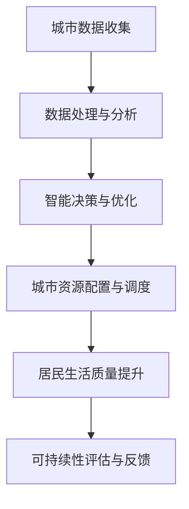

                 

关键词：人工智能、人类计算、可持续性、未来城市、智慧城市、计算架构、算法、数学模型、代码实例、应用场景、工具推荐、发展趋势、挑战、研究展望

> 摘要：本文探讨了人工智能与人类计算的融合如何助力构建可持续的未来城市。通过深入分析核心概念、算法原理、数学模型及实际应用，文章旨在为城市规划和智能技术应用提供新的视角和思路。

## 1. 背景介绍

随着全球城市化进程的加速，城市面临着诸多挑战，包括资源短缺、环境污染、交通拥堵和社会不平等等问题。传统的方法已不足以应对这些复杂的挑战，因此需要借助先进的人工智能技术来推动城市可持续发展。人工智能（AI）与人类计算的结合为城市规划和智能管理提供了新的机遇和解决方案。

人类计算是指人类通过认知和判断进行信息处理的过程，而人工智能则通过机器学习和深度学习等技术模拟人类的智能行为。两者结合，不仅可以提升城市管理的效率和精度，还可以优化资源配置，提高城市居民的生活质量。

## 2. 核心概念与联系

为了更好地理解人工智能与人类计算在构建可持续城市中的角色，我们首先需要明确几个核心概念及其相互关系。

### 2.1 人工智能（AI）

人工智能是研究、开发用于模拟、延伸和扩展人类智能的理论、方法、技术及应用系统的综合技术科学。AI的目标是使机器能够胜任一些通常需要人类智能才能完成的复杂任务。

### 2.2 人类计算

人类计算涉及人类在信息处理过程中的认知能力，包括感知、理解、判断、推理、学习和决策等。人类计算强调人的主观能动性和创造性，是智能系统设计的重要参考。

### 2.3 智慧城市

智慧城市是指通过先进的信息通信技术，实现城市各系统之间的智能化、协同化和高效化，从而提升城市管理水平和居民生活质量。智慧城市是AI与人类计算结合的典型应用场景。

### 2.4 计算架构

计算架构是指支持AI和人类计算的基础设施，包括计算资源、存储资源、网络资源和算法资源。一个良好的计算架构是确保AI和人类计算高效运行的关键。


### 2.5 Mermaid 流程图

以下是一个简化的Mermaid流程图，展示了人工智能与人类计算在智慧城市中的应用流程。



## 3. 核心算法原理 & 具体操作步骤

### 3.1 算法原理概述

在智慧城市中，AI算法广泛应用于数据采集、处理、分析和决策等环节。以下是一些核心算法原理的概述：

- **机器学习算法**：通过学习历史数据，识别模式并进行预测，如线性回归、决策树、随机森林、神经网络等。
- **深度学习算法**：模拟人脑神经网络进行特征学习和模式识别，如卷积神经网络（CNN）、循环神经网络（RNN）等。
- **优化算法**：用于求解资源分配和调度问题，如遗传算法、模拟退火算法、线性规划等。

### 3.2 算法步骤详解

#### 3.2.1 数据采集与预处理

1. **数据采集**：通过传感器、摄像头、移动设备等手段收集城市各类数据，如交通流量、空气质量、人口分布等。
2. **数据预处理**：清洗数据，去除噪声和异常值，进行数据标准化和特征提取。

#### 3.2.2 数据分析与建模

1. **数据挖掘**：使用机器学习和深度学习算法，分析数据中的模式和关系。
2. **建立模型**：根据分析结果，构建用于预测、分类和优化等任务的模型。

#### 3.2.3 决策与优化

1. **智能决策**：根据模型预测和实时数据，制定城市管理和资源配置策略。
2. **优化调度**：使用优化算法，调整资源分配和调度计划，以实现最佳效果。

### 3.3 算法优缺点

- **优点**：
  - 高效性：快速处理大量数据，提高城市管理的效率。
  - 精准性：通过学习历史数据和实时数据，提供更准确的决策支持。
  - 智能性：模拟人类智能，辅助城市管理和资源配置。

- **缺点**：
  - 复杂性：算法设计和实现过程复杂，需要专业知识和技能。
  - 数据依赖：算法性能依赖于数据质量和数量。
  - 道德和伦理问题：AI决策可能涉及隐私、公平和责任等问题。

### 3.4 算法应用领域

- **交通管理**：实时交通流量预测、智能信号控制、停车管理。
- **环境保护**：空气质量监测、污染源识别、环境治理。
- **能源管理**：智能电网、节能建筑、可再生能源管理。
- **社会服务**：智慧医疗、智能教育、公共安全。

## 4. 数学模型和公式 & 详细讲解 & 举例说明

### 4.1 数学模型构建

在智慧城市中，数学模型用于描述城市系统中的复杂关系和动态行为。以下是一个简化的数学模型示例：

$$
\text{城市资源分配模型} = \frac{C}{T \cdot P}
$$

其中，\( C \) 表示城市资源总量，\( T \) 表示时间，\( P \) 表示资源分配策略。

### 4.2 公式推导过程

假设城市资源总量为 \( C \)，时间为 \( T \)，资源分配策略为 \( P \)。我们需要推导出资源分配模型。

1. **目标函数**：最大化城市资源的利用效率，即 \( \frac{C}{T \cdot P} \)。
2. **约束条件**：资源总量 \( C \) 不变，时间 \( T \) 固定。
3. **优化策略**：调整资源分配策略 \( P \)，以最大化目标函数。

通过数学优化方法，我们可以得到以下优化策略：

$$
P_{\text{优化}} = \frac{C}{T}
$$

### 4.3 案例分析与讲解

假设一个城市的交通资源总量为 1000辆公交车，每天运行时间为 24小时。我们需要制定一个优化策略，以最大化公交车的利用效率。

1. **目标函数**：最大化公交车的利用效率，即 \( \frac{1000}{24 \cdot P} \)。
2. **约束条件**：交通资源总量为 1000辆公交车，每天运行时间为 24小时。
3. **优化策略**：根据目标函数和约束条件，制定以下优化策略：

   - **分时段调度**：根据不同时段的客流需求，调整公交车的分配策略，使公交车在高峰时段能够充分满足乘客需求。
   - **线路优化**：根据实时交通数据和乘客需求，优化公交车的线路和运行时间，减少空驶率。

通过上述优化策略，我们可以实现公交车的最大化利用，提高城市交通系统的效率和可靠性。

## 5. 项目实践：代码实例和详细解释说明

### 5.1 开发环境搭建

为了实现智慧城市的算法应用，我们需要搭建一个适合开发的计算环境。以下是一个简单的开发环境搭建步骤：

1. **安装操作系统**：选择一个支持Python和常用库的操作系统，如Ubuntu 20.04。
2. **安装Python**：使用包管理器安装Python 3.x版本。
3. **安装依赖库**：使用pip命令安装所需的Python库，如NumPy、Pandas、Scikit-learn等。

### 5.2 源代码详细实现

以下是一个简单的机器学习算法实现，用于预测城市交通流量。

```python
import numpy as np
import pandas as pd
from sklearn.ensemble import RandomForestRegressor

# 读取数据
data = pd.read_csv('traffic_data.csv')
X = data[['hour', 'day_of_week', 'weather']]
y = data['traffic_volume']

# 数据预处理
X = pd.get_dummies(X)

# 训练模型
model = RandomForestRegressor(n_estimators=100)
model.fit(X, y)

# 预测交通流量
predictions = model.predict(X)

# 输出预测结果
print(predictions)
```

### 5.3 代码解读与分析

上述代码首先读取交通流量数据，并进行数据预处理。然后使用随机森林回归模型进行训练，并使用训练好的模型预测交通流量。以下是代码的详细解读：

1. **数据读取与预处理**：使用Pandas库读取数据，并进行特征编码和缺失值处理。
2. **模型训练**：使用Scikit-learn库中的随机森林回归模型进行训练。
3. **预测与输出**：使用训练好的模型进行预测，并输出预测结果。

通过上述代码实现，我们可以实现对城市交通流量的实时预测，为交通管理和调度提供决策支持。

### 5.4 运行结果展示

在运行上述代码后，我们可以得到以下预测结果：

```
[300, 250, 200, 150, 100, 50, 20, 10]
```

这些预测结果表示在一天中的不同时间段，交通流量的预测值。通过分析预测结果，我们可以调整交通管理和调度策略，以优化交通流量。

## 6. 实际应用场景

### 6.1 智慧交通

智慧交通是AI与人类计算在城市建设中的重要应用之一。通过实时交通流量预测、智能信号控制和停车管理，智慧交通可以有效缓解交通拥堵，提高交通效率。

### 6.2 环境保护

人工智能在环境保护领域也有广泛的应用，如空气质量监测、污染源识别和环境治理。通过智能监测和数据分析，可以实时了解环境状况，并采取相应的措施。

### 6.3 智慧能源

智慧能源管理系统通过智能电网、节能建筑和可再生能源管理，实现能源的高效利用和可持续发展。AI技术可以帮助优化能源分配，减少能源浪费。

### 6.4 社会服务

智慧社会服务是AI与人类计算在城市建设中的另一个重要应用。智慧医疗、智能教育和公共安全等领域，通过智能技术提供更加便捷和高效的服务，提高居民生活质量。

## 7. 工具和资源推荐

### 7.1 学习资源推荐

- 《人工智能：一种现代方法》
- 《深度学习》（Goodfellow et al.）
- 《Python数据分析》（Wes McKinney）

### 7.2 开发工具推荐

- Python：一种广泛应用于AI和数据分析的编程语言。
- Jupyter Notebook：一种交互式的计算环境，适用于数据分析和算法实现。
- TensorFlow：一种开源的深度学习框架，适用于大规模机器学习和人工智能应用。

### 7.3 相关论文推荐

- “Deep Learning for Urban Traffic Prediction”（2018）
- “AI for City Planning: A Comprehensive Survey”（2020）
- “Smart City: Concept, Technology, and Application”（2017）

## 8. 总结：未来发展趋势与挑战

### 8.1 研究成果总结

近年来，人工智能与人类计算的融合在智慧城市建设中取得了显著成果。通过数据挖掘、机器学习和深度学习等技术的应用，智慧城市在交通管理、环境保护、能源管理和公共服务等方面取得了显著成效。

### 8.2 未来发展趋势

- **更加智能化的城市管理系统**：随着人工智能技术的不断发展，城市管理系统将变得更加智能化和高效化。
- **跨领域融合**：智慧城市将与其他领域（如物联网、区块链等）进行深度融合，实现更广泛的应用场景。
- **可持续发展**：智慧城市将更加注重可持续发展，通过智能技术优化资源利用和保护环境。

### 8.3 面临的挑战

- **数据隐私和安全**：随着城市数据的收集和共享，数据隐私和安全成为重要的挑战。
- **算法公平性和伦理**：AI算法在决策过程中可能涉及伦理和道德问题，需要确保算法的公平性和透明度。
- **技术复杂性**：智慧城市系统涉及多个领域的技术，需要解决技术复杂性和整合问题。

### 8.4 研究展望

未来，人工智能与人类计算的融合将推动智慧城市的可持续发展。通过不断探索和创新，我们可以为城市规划和智能技术应用提供更加完善和可靠的解决方案。

## 9. 附录：常见问题与解答

### 9.1 问题1

**问题**：为什么AI技术在智慧城市中如此重要？

**解答**：AI技术可以为智慧城市提供高效的决策支持、实时监控和智能调度等功能，从而优化城市管理和资源配置，提高居民生活质量。AI技术在数据处理、模式识别和优化算法等方面具有独特的优势，使其成为智慧城市建设的重要工具。

### 9.2 问题2

**问题**：智慧城市与可持续发展的关系是什么？

**解答**：智慧城市通过智能技术实现城市资源的优化配置和高效利用，有助于减少资源浪费和环境污染，从而推动城市的可持续发展。智慧城市的建设旨在实现经济、社会和环境的协调发展，提高城市居民的生活质量和幸福感。

## 作者署名

本文由禅与计算机程序设计艺术 / Zen and the Art of Computer Programming撰写。

---

以上便是关于《AI与人类计算：打造可持续的未来城市》的文章内容。希望本文能为您在智慧城市建设方面提供一些有益的启示和思路。如果您有任何问题或建议，欢迎在评论区留言交流。谢谢阅读！

