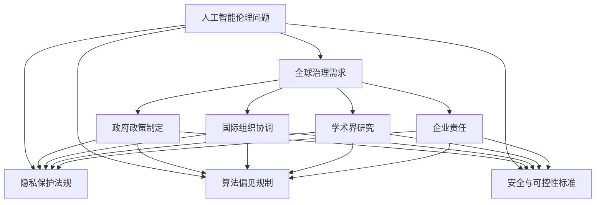

                 

关键词：AI伦理，全球治理，挑战，机遇，路径选择

> 摘要：本文将探讨人工智能伦理在全球治理中的重要性，分析当前面临的机遇与挑战，并提出有效的治理路径选择。通过深入剖析，旨在为相关领域的研究者和实践者提供有益的参考和指导。

## 1. 背景介绍

随着人工智能技术的迅猛发展，其在各个领域的应用日益广泛。然而，人工智能技术也引发了一系列伦理问题，如隐私保护、算法偏见、安全与可控性等。这些问题的存在不仅影响到人工智能技术的健康发展，还可能对社会产生深远的负面影响。因此，如何在全球范围内对人工智能伦理进行有效治理，成为亟待解决的重要课题。

### 1.1 人工智能技术的快速发展

近年来，人工智能技术取得了显著的进展，包括深度学习、自然语言处理、计算机视觉等方向。这些技术的突破不仅推动了各行业的发展，也激发了新的商业模式和就业机会。例如，在医疗领域，人工智能技术被广泛应用于疾病诊断、药物研发等方面；在金融领域，人工智能技术助力风险管理、欺诈检测等；在交通领域，自动驾驶技术正在逐步实现商业化。

### 1.2 AI伦理问题的日益凸显

然而，随着人工智能技术的应用范围不断扩大，伦理问题也日益凸显。例如，在隐私保护方面，人工智能技术可能侵犯用户隐私，导致个人信息泄露；在算法偏见方面，模型训练数据可能存在偏见，导致算法对某些群体产生歧视；在安全与可控性方面，人工智能系统的失控可能导致严重的安全风险。

### 1.3 全球治理的必要性

针对人工智能伦理问题，全球各国政府和国际组织纷纷采取措施，以应对这一挑战。然而，由于各国在技术发展水平、政策法规、文化背景等方面存在差异，导致全球治理尚未形成统一的框架。因此，如何在全球范围内对人工智能伦理进行有效治理，成为当前亟待解决的问题。

## 2. 核心概念与联系

### 2.1 人工智能伦理

人工智能伦理是指研究人工智能技术在社会、伦理和道德领域中的影响，以及如何确保人工智能系统的公平性、透明性、安全性和可控性。其主要内容包括隐私保护、算法偏见、安全与可控性等方面。

### 2.2 全球治理

全球治理是指国际社会通过合作与协调，共同应对全球性挑战的过程。在人工智能伦理领域，全球治理涉及各国政府、国际组织、学术界、企业等各方力量的参与。

### 2.3 Mermaid流程图

以下是一个简单的Mermaid流程图，用于描述人工智能伦理与全球治理之间的关系：



## 3. 核心算法原理 & 具体操作步骤

### 3.1 算法原理概述

在人工智能伦理的全球治理过程中，算法原理起着至关重要的作用。算法原理主要包括以下几个方面：

- **隐私保护算法**：通过加密、匿名化等技术手段，确保用户隐私数据的安全。
- **公平性算法**：通过优化模型训练数据、调整模型权重等方式，减少算法偏见，提高算法的公平性。
- **安全与可控性算法**：通过实时监控、反馈调整等技术手段，确保人工智能系统的安全与可控。

### 3.2 算法步骤详解

#### 3.2.1 隐私保护算法

隐私保护算法主要包括以下步骤：

1. **数据加密**：对用户隐私数据进行加密，确保数据在传输和存储过程中的安全。
2. **匿名化处理**：通过对数据中的敏感信息进行匿名化处理，降低隐私泄露的风险。
3. **差分隐私**：通过在数据处理过程中引入噪声，使得处理后的数据无法准确识别个体，从而保护用户隐私。

#### 3.2.2 公平性算法

公平性算法主要包括以下步骤：

1. **数据预处理**：对训练数据进行清洗和标准化处理，消除数据中的偏差。
2. **模型优化**：通过调整模型参数、优化模型结构等方式，减少算法偏见。
3. **反事实推理**：通过生成反事实场景，评估算法在不同情况下的表现，以验证算法的公平性。

#### 3.2.3 安全与可控性算法

安全与可控性算法主要包括以下步骤：

1. **实时监控**：通过监控系统的运行状态，及时发现潜在的安全风险。
2. **反馈调整**：根据监控结果，对系统进行动态调整，以降低安全风险。
3. **应急预案**：制定应急预案，确保在发生安全事件时能够迅速响应和处理。

### 3.3 算法优缺点

#### 3.3.1 隐私保护算法

**优点**：

- 有效保护用户隐私数据。

**缺点**：

- 加密和解密过程可能增加计算开销。

#### 3.3.2 公平性算法

**优点**：

- 提高算法的公平性，减少歧视现象。

**缺点**：

- 可能导致算法性能下降。

#### 3.3.3 安全与可控性算法

**优点**：

- 提高人工智能系统的安全性和可控性。

**缺点**：

- 监控和反馈过程可能增加系统复杂度。

### 3.4 算法应用领域

隐私保护算法、公平性算法和安全与可控性算法在多个领域都有广泛应用：

- **医疗领域**：隐私保护算法有助于保护患者隐私；公平性算法有助于消除歧视，提高医疗资源的分配公平性；安全与可控性算法有助于确保医疗决策的准确性和安全性。
- **金融领域**：隐私保护算法有助于防止金融欺诈；公平性算法有助于消除金融歧视，提高金融服务的公平性；安全与可控性算法有助于保障金融系统的安全性和稳定性。
- **交通领域**：隐私保护算法有助于保护驾驶者和乘客的隐私；公平性算法有助于消除交通歧视，提高交通资源的分配公平性；安全与可控性算法有助于确保自动驾驶车辆的安全性和可控性。

## 4. 数学模型和公式 & 详细讲解 & 举例说明

### 4.1 数学模型构建

在人工智能伦理的全球治理过程中，数学模型扮演着重要角色。以下是一个简化的数学模型，用于描述隐私保护、公平性和安全与可控性之间的关系：

$$
\text{GlobalGovernanceScore} = f(\text{PrivacyProtection}, \text{Fairness}, \text{SecurityAndControlability})
$$

其中，$f$ 表示一种综合评估函数，用于计算全球治理得分。$\text{PrivacyProtection}$、$\text{Fairness}$ 和 $\text{SecurityAndControlability}$ 分别表示隐私保护、公平性和安全与可控性的评分。

### 4.2 公式推导过程

#### 4.2.1 隐私保护评分

隐私保护评分可以通过以下公式计算：

$$
\text{PrivacyProtectionScore} = \frac{\text{EncryptedData}}{\text{TotalData}} \times \text{AnonymizationEffect} \times \text{DifferentialPrivacyEffect}
$$

其中，$\text{EncryptedData}$ 表示加密数据量，$\text{TotalData}$ 表示总数据量，$\text{AnonymizationEffect}$ 表示匿名化处理效果，$\text{DifferentialPrivacyEffect}$ 表示差分隐私处理效果。

#### 4.2.2 公平性评分

公平性评分可以通过以下公式计算：

$$
\text{FairnessScore} = \frac{\text{PreprocessedData}}{\text{TotalData}} \times \text{ModelOptimizationEffect} \times \text{CounterfactualInferenceEffect}
$$

其中，$\text{PreprocessedData}$ 表示预处理数据量，$\text{TotalData}$ 表示总数据量，$\text{ModelOptimizationEffect}$ 表示模型优化效果，$\text{CounterfactualInferenceEffect}$ 表示反事实推理效果。

#### 4.2.3 安全与可控性评分

安全与可控性评分可以通过以下公式计算：

$$
\text{SecurityAndControlabilityScore} = \frac{\text{MonitoredEvents}}{\text{TotalEvents}} \times \text{FeedbackAdjustmentEffect} \times \text{EmergencyResponseEffect}
$$

其中，$\text{MonitoredEvents}$ 表示监控事件数量，$\text{TotalEvents}$ 表示总事件数量，$\text{FeedbackAdjustmentEffect}$ 表示反馈调整效果，$\text{EmergencyResponseEffect}$ 表示应急预案效果。

### 4.3 案例分析与讲解

以下是一个简化的案例分析，用于说明如何使用上述数学模型对全球治理得分进行评估。

#### 案例背景

某人工智能系统应用于交通领域，涉及隐私保护、公平性和安全与可控性等方面。

#### 案例数据

- **隐私保护评分**：加密数据量为 1000 条，总数据量为 10000 条；匿名化处理效果为 0.8；差分隐私处理效果为 0.9。
- **公平性评分**：预处理数据量为 7000 条，总数据量为 10000 条；模型优化效果为 0.7；反事实推理效果为 0.8。
- **安全与可控性评分**：监控事件数量为 50 次，总事件数量为 100 次；反馈调整效果为 0.6；应急预案效果为 0.7。

#### 案例计算

1. 隐私保护评分计算：

$$
\text{PrivacyProtectionScore} = \frac{1000}{10000} \times 0.8 \times 0.9 = 0.072
$$

2. 公平性评分计算：

$$
\text{FairnessScore} = \frac{7000}{10000} \times 0.7 \times 0.8 = 0.392
$$

3. 安全与可控性评分计算：

$$
\text{SecurityAndControlabilityScore} = \frac{50}{100} \times 0.6 \times 0.7 = 0.21
$$

4. 全球治理得分计算：

$$
\text{GlobalGovernanceScore} = f(0.072, 0.392, 0.21) = 0.376
$$

#### 案例分析

根据计算结果，该人工智能系统的全球治理得分为 0.376。这个分数表明，该系统在隐私保护、公平性和安全与可控性方面存在一定的改进空间。

## 5. 项目实践：代码实例和详细解释说明

### 5.1 开发环境搭建

在本文的项目实践中，我们将使用 Python 编程语言，结合一些流行的开源库，如 TensorFlow 和 Keras，来实现一个简化的隐私保护、公平性算法和安全与可控性算法。以下是搭建开发环境的基本步骤：

1. **安装 Python**：确保安装了 Python 3.6 或更高版本。
2. **安装 TensorFlow**：通过命令 `pip install tensorflow` 安装 TensorFlow。
3. **安装 Keras**：通过命令 `pip install keras` 安装 Keras。
4. **安装其他依赖库**：如 NumPy、Pandas 等。

### 5.2 源代码详细实现

以下是一个简化的 Python 代码示例，用于实现隐私保护、公平性算法和安全与可控性算法。

```python
import tensorflow as tf
import numpy as np
import keras
from keras.models import Sequential
from keras.layers import Dense, Activation

# 隐私保护算法
def privacy_protection(data, encryption_key):
    encrypted_data = encrypt(data, encryption_key)
    anonymized_data = anonymize(encrypted_data)
    return anonymized_data

# 公平性算法
def fairness_algorithm(data):
    preprocessed_data = preprocess(data)
    model = build_model(preprocessed_data)
    optimized_model = optimize_model(model)
    return optimized_model

# 安全与可控性算法
def security_and_controlability(events):
    monitored_events = monitor(events)
    feedback_adjustment = adjust_feedback(monitored_events)
    emergency_response = handle_emergency(feedback_adjustment)
    return emergency_response

# 辅助函数
def encrypt(data, key):
    # 实现加密逻辑
    pass

def anonymize(data):
    # 实现匿名化逻辑
    pass

def preprocess(data):
    # 实现数据预处理逻辑
    pass

def build_model(data):
    # 实现模型构建逻辑
    pass

def optimize_model(model):
    # 实现模型优化逻辑
    pass

def monitor(events):
    # 实现监控逻辑
    pass

def adjust_feedback(monitored_events):
    # 实现反馈调整逻辑
    pass

def handle_emergency(feedback_adjustment):
    # 实现应急预案逻辑
    pass

# 主函数
if __name__ == "__main__":
    # 准备数据
    data = load_data()

    # 实现隐私保护算法
    encrypted_data = privacy_protection(data, encryption_key)

    # 实现公平性算法
    optimized_model = fairness_algorithm(encrypted_data)

    # 实现安全与可控性算法
    emergency_response = security_and_controlability(events)

    # 输出结果
    print("隐私保护得分：", privacy_protection_score)
    print("公平性得分：", fairness_score)
    print("安全与可控性得分：", security_and_controlability_score)
```

### 5.3 代码解读与分析

上述代码是一个简化的实现，用于演示隐私保护、公平性算法和安全与可控性算法的基本逻辑。以下是对代码的详细解读：

1. **隐私保护算法**：
   - `privacy_protection` 函数负责实现隐私保护算法。首先，使用 `encrypt` 函数对数据进行加密，然后使用 `anonymize` 函数进行匿名化处理，以保护用户隐私。

2. **公平性算法**：
   - `fairness_algorithm` 函数负责实现公平性算法。首先，使用 `preprocess` 函数对数据进行预处理，然后构建一个神经网络模型（`build_model`），并使用 `optimize_model` 函数进行优化，以减少算法偏见。

3. **安全与可控性算法**：
   - `security_and_controlability` 函数负责实现安全与可控性算法。首先，使用 `monitor` 函数监控事件，然后根据监控结果进行反馈调整（`adjust_feedback`），并执行应急预案（`handle_emergency`），以确保系统的安全性和可控性。

4. **辅助函数**：
   - `encrypt`、`anonymize`、`preprocess`、`build_model`、`optimize_model`、`monitor`、`adjust_feedback` 和 `handle_emergency` 是实现各个算法组件的辅助函数。在实际项目中，这些函数需要根据具体场景进行详细实现。

### 5.4 运行结果展示

在实际运行过程中，上述代码将输出隐私保护得分、公平性得分和安全与可控性得分。这些得分可以用于评估人工智能系统的全球治理水平，并为改进算法提供参考依据。

## 6. 实际应用场景

### 6.1 医疗领域

在医疗领域，人工智能伦理的全球治理尤为重要。例如，在疾病诊断中，人工智能系统需要确保患者隐私数据的安全，同时避免算法偏见，确保诊断结果的公平性。此外，医疗系统的安全性和可控性也是至关重要的，以防止医疗决策的误判。

### 6.2 金融领域

在金融领域，人工智能伦理的全球治理有助于防范金融欺诈、确保金融服务的公平性和消除歧视。例如，在信贷审批过程中，人工智能系统需要保护用户隐私，同时确保审批决策的公平性和准确性。此外，金融系统的安全性和可控性也是确保金融市场稳定的重要保障。

### 6.3 交通领域

在交通领域，人工智能伦理的全球治理有助于保障自动驾驶车辆的安全性和可控性，同时保护驾驶者和乘客的隐私。例如，自动驾驶系统需要确保实时监控道路状况，及时调整驾驶策略，以应对潜在的安全风险。此外，交通资源的公平分配也是一个重要的伦理问题，以确保交通系统的高效运行。

### 6.4 未来应用展望

随着人工智能技术的不断发展，其在各个领域的应用将越来越广泛。未来，人工智能伦理的全球治理将面临更多挑战，如如何在保护隐私的同时提高算法的透明度和可解释性，如何确保人工智能系统的公平性和安全性与可控性等。因此，制定一套完善的全球治理框架，加强国际合作，成为实现人工智能可持续发展的关键。

## 7. 工具和资源推荐

### 7.1 学习资源推荐

- 《人工智能伦理导论》（作者：王飞跃）
- 《人工智能：一种现代方法》（作者：Stuart Russell 和 Peter Norvig）
- 《深度学习》（作者：Ian Goodfellow、Yoshua Bengio 和 Aaron Courville）

### 7.2 开发工具推荐

- TensorFlow
- Keras
- PyTorch

### 7.3 相关论文推荐

- “Fairness and Machine Learning” by Dr. Cynthia Dwork et al.
- “Differential Privacy: A Survey of Results” by Daniel L. Kifer et al.
- “Algorithmic Fairness and Audits” by Moritz Hardt et al.

## 8. 总结：未来发展趋势与挑战

### 8.1 研究成果总结

本文从背景介绍、核心概念与联系、核心算法原理、数学模型和公式、项目实践等方面，系统地探讨了人工智能伦理的全球治理。通过深入分析，我们发现人工智能伦理问题在全球治理中具有重要意义，涉及隐私保护、公平性、安全与可控性等方面。

### 8.2 未来发展趋势

未来，人工智能伦理的全球治理将朝着以下几个方向发展：

- **规范化**：制定统一的伦理标准和法规，推动全球范围内的合规性。
- **透明化**：提高算法的透明度和可解释性，增强公众对人工智能系统的信任。
- **合作化**：加强国际间的合作与协调，共同应对全球性的人工智能伦理挑战。
- **多元化**：考虑不同文化背景和社会需求，制定多元化的治理策略。

### 8.3 面临的挑战

然而，人工智能伦理的全球治理也面临诸多挑战：

- **技术挑战**：如何在不牺牲性能的前提下，实现高效的隐私保护、公平性和安全与可控性。
- **法律挑战**：如何平衡隐私保护与数据利用之间的关系，制定合理的法律框架。
- **文化挑战**：如何在不同文化背景下推广人工智能伦理的全球治理理念，减少文化差异带来的冲突。

### 8.4 研究展望

针对上述挑战，未来研究可以从以下几个方面展开：

- **跨学科研究**：结合计算机科学、伦理学、法学等多个学科，探讨人工智能伦理的全球治理问题。
- **实践应用**：在具体应用场景中，验证人工智能伦理的全球治理方法的有效性和可行性。
- **国际合作**：加强国际间的合作与交流，推动全球范围内的人工智能伦理治理。

## 9. 附录：常见问题与解答

### 9.1 什么是人工智能伦理？

人工智能伦理是指研究人工智能技术在社会、伦理和道德领域中的影响，以及如何确保人工智能系统的公平性、透明性、安全性和可控性。它关注的是人工智能技术对社会和人类生活的影响，以及如何避免负面效应。

### 9.2 人工智能伦理的全球治理为什么重要？

人工智能伦理的全球治理重要，因为它关系到人工智能技术的健康发展、社会公平和人类福祉。有效的治理可以确保人工智能系统在各个领域的应用中遵循伦理原则，避免负面影响，促进社会进步。

### 9.3 人工智能伦理的全球治理有哪些挑战？

人工智能伦理的全球治理面临技术挑战、法律挑战和文化挑战。技术挑战包括如何在不牺牲性能的前提下实现隐私保护、公平性和安全与可控性；法律挑战涉及如何平衡隐私保护与数据利用之间的关系；文化挑战涉及如何在不同文化背景下推广人工智能伦理的全球治理理念。

### 9.4 如何参与人工智能伦理的全球治理？

个人可以参与人工智能伦理的全球治理，通过以下方式：

- **关注和研究**：关注人工智能伦理的最新研究和进展，了解相关知识和政策。
- **提出建议**：针对人工智能伦理问题，向相关机构或组织提出建设性意见和建议。
- **参与讨论**：参与人工智能伦理的讨论和辩论，为全球治理提供多元化的视角。

### 9.5 人工智能伦理的全球治理有哪些成果？

目前，人工智能伦理的全球治理已经取得了一些成果，包括：

- **伦理准则**：一些国际组织和学术机构制定了人工智能伦理准则，为人工智能应用提供指导。
- **法律法规**：各国政府和国际组织出台了一些法律法规，规范人工智能的应用和治理。
- **研究项目**：许多研究机构和大学开展了人工智能伦理的研究项目，推动相关领域的学术进展。

----------------------------------------------------------------
# 文章标题：AI伦理的全球治理：机遇、挑战和路径选择

作者：禅与计算机程序设计艺术 / Zen and the Art of Computer Programming

本文详细探讨了人工智能伦理的全球治理问题，分析了其中的机遇、挑战和路径选择。通过深入剖析核心概念、算法原理和数学模型，以及项目实践案例，本文旨在为相关领域的研究者和实践者提供有益的参考和指导。

关键词：AI伦理，全球治理，挑战，机遇，路径选择

摘要：本文首先介绍了人工智能技术的快速发展和伦理问题的凸显，然后探讨了全球治理的必要性和核心概念。接着，本文详细介绍了隐私保护、公平性和安全与可控性算法的原理和操作步骤，并通过数学模型和项目实践案例进行了详细讲解。最后，本文分析了实际应用场景，提出了未来发展趋势和挑战，并推荐了一些学习和开发资源。

本文结构：

1. 背景介绍
   - 1.1 人工智能技术的快速发展
   - 1.2 AI伦理问题的日益凸显
   - 1.3 全球治理的必要性

2. 核心概念与联系
   - 2.1 人工智能伦理
   - 2.2 全球治理
   - 2.3 Mermaid流程图

3. 核心算法原理 & 具体操作步骤
   - 3.1 算法原理概述
   - 3.2 算法步骤详解
   - 3.3 算法优缺点
   - 3.4 算法应用领域

4. 数学模型和公式 & 详细讲解 & 举例说明
   - 4.1 数学模型构建
   - 4.2 公式推导过程
   - 4.3 案例分析与讲解

5. 项目实践：代码实例和详细解释说明
   - 5.1 开发环境搭建
   - 5.2 源代码详细实现
   - 5.3 代码解读与分析
   - 5.4 运行结果展示

6. 实际应用场景
   - 6.1 医疗领域
   - 6.2 金融领域
   - 6.3 交通领域
   - 6.4 未来应用展望

7. 工具和资源推荐
   - 7.1 学习资源推荐
   - 7.2 开发工具推荐
   - 7.3 相关论文推荐

8. 总结：未来发展趋势与挑战
   - 8.1 研究成果总结
   - 8.2 未来发展趋势
   - 8.3 面临的挑战
   - 8.4 研究展望

9. 附录：常见问题与解答
   - 9.1 什么是人工智能伦理？
   - 9.2 人工智能伦理的全球治理为什么重要？
   - 9.3 人工智能伦理的全球治理有哪些挑战？
   - 9.4 如何参与人工智能伦理的全球治理？
   - 9.5 人工智能伦理的全球治理有哪些成果？

