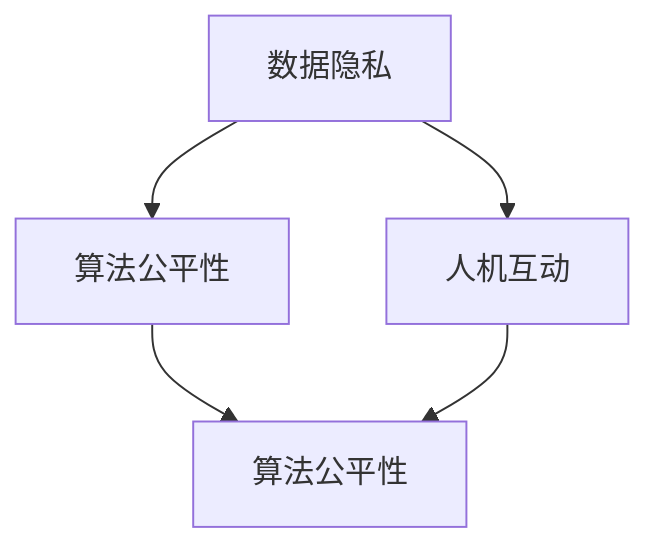

                 

关键词：人工智能教育，伦理政策，教师培训，教育资源，技术发展

> 摘要：随着人工智能技术的迅猛发展，其在教育领域的应用越来越广泛。然而，人工智能的伦理问题也逐渐成为关注的焦点。本文旨在探讨AI伦理的教育政策，包括教师培训和教育资源的建设，以促进人工智能技术在教育中的健康、可持续发展。

## 1. 背景介绍

人工智能（AI）技术在教育领域的应用已经成为不可逆转的趋势。从智能辅导系统到个性化学习平台，AI技术正深刻地改变着教育的各个方面。然而，这种变革不仅带来了技术上的挑战，也引发了伦理上的思考。

### 1.1 人工智能在教育中的应用

1. **智能辅导系统**：AI辅导系统能够根据学生的学习情况提供个性化的学习建议，帮助学生更好地理解和掌握知识。
2. **个性化学习平台**：通过分析学生的学习行为，这些平台能够为每个学生提供最适合他们的学习路径。
3. **教育资源优化**：AI技术能够帮助学校和教育机构更有效地管理和利用教育资源。

### 1.2 AI伦理问题

1. **数据隐私**：AI在教育中的广泛应用意味着大量的学生数据将被收集和使用。如何保护这些数据的安全性和隐私成为一个重要问题。
2. **算法公平性**：算法的偏见可能会导致教育的不公平。例如，智能辅导系统可能会因为数据集的不平衡而倾向于某些学生群体。
3. **人机互动**：随着AI在教育中的应用增加，教师的角色可能会发生变化，这需要重新定义教师与AI之间的关系。

## 2. 核心概念与联系

### 2.1 AI伦理的核心概念

**数据隐私**、**算法公平性**和**人机互动**是AI伦理中的三个核心概念。下面是一个使用Mermaid绘制的流程图，展示了这三个概念之间的联系。



### 2.2 AI伦理与教育政策的联系

AI伦理问题不仅影响教育技术的开发和部署，也直接关系到教育政策的制定和实施。以下是几个关键的关联点：

1. **政策制定**：教育政策应考虑AI伦理问题，确保技术应用的合法性和道德性。
2. **教师培训**：教师需要了解AI伦理，以便在教学过程中更好地应对相关挑战。
3. **教育资源建设**：教育资源的建设应包括AI伦理的教育内容，以确保所有教育参与者都能掌握必要的伦理知识。

## 3. 核心算法原理 & 具体操作步骤

### 3.1 算法原理概述

在AI伦理的教育政策中，核心算法原理包括以下几个方面：

1. **数据隐私保护算法**：这些算法旨在确保学生在使用教育技术时的数据隐私得到保护。
2. **算法公平性评估算法**：这些算法用于评估和教育技术中的算法是否存在偏见，以及如何纠正这些偏见。
3. **人机互动优化算法**：这些算法旨在提高教师与AI系统的交互效果，确保人机互动的效率和满意度。

### 3.2 算法步骤详解

1. **数据隐私保护算法步骤**：
   - **数据加密**：对收集到的学生数据进行加密处理，确保数据在传输和存储过程中不被窃取。
   - **匿名化处理**：通过匿名化处理，将个人身份信息从数据中去除，以保护学生的隐私。

2. **算法公平性评估算法步骤**：
   - **数据集划分**：将数据集划分为训练集、测试集和验证集。
   - **模型训练与评估**：使用训练集训练模型，并使用验证集评估模型的性能。
   - **偏见检测与纠正**：检测模型中的偏见，并采取相应的措施进行纠正。

3. **人机互动优化算法步骤**：
   - **用户行为分析**：分析用户与系统的交互行为，了解用户的需求和偏好。
   - **交互界面优化**：根据用户行为分析结果，对交互界面进行优化，提高用户满意度。

### 3.3 算法优缺点

**数据隐私保护算法**的优点是能够有效保护学生数据的安全性和隐私，缺点是需要额外的计算资源和时间进行加密和匿名化处理。

**算法公平性评估算法**的优点是能够确保教育技术中的算法不会对某些学生群体产生偏见，缺点是需要大量数据和复杂的评估模型。

**人机互动优化算法**的优点是能够提高用户与系统的交互效果，缺点是需要不断进行用户行为分析，以适应不断变化的需求。

### 3.4 算法应用领域

这三个算法主要应用于以下几个方面：

1. **智能辅导系统**：用于保护学生数据的隐私，评估模型的公平性，以及优化教师与学生之间的交互。
2. **个性化学习平台**：用于确保平台提供的个性化建议不会对某些学生产生不公平的影响，同时优化用户界面设计。
3. **教育资源管理**：用于保护学生数据的隐私，评估教育资源的分配是否公平，以及优化教育资源的利用。

## 4. 数学模型和公式 & 详细讲解 & 举例说明

### 4.1 数学模型构建

在AI伦理的教育政策中，数学模型主要用于以下几个方面：

1. **数据隐私保护模型**：用于评估数据隐私保护算法的效果，如差分隐私模型。
2. **算法公平性评估模型**：用于检测算法中的偏见，如公平性指标模型。
3. **人机互动优化模型**：用于分析用户行为，如隐马尔可夫模型。

### 4.2 公式推导过程

**差分隐私模型**的推导过程如下：

1. **定义差分隐私**：差分隐私是指对隐私数据进行处理时，输出的概率分布对于任意两个接近的数据集之间的差异保持相同。

   公式：$$ \mathbb{D}(\mathcal{D}', \mathcal{D}) = \mathbb{P}(\mathcal{D}' \mid \mathcal{D}) $$

   其中，$\mathcal{D}'$和$\mathcal{D}$是两个接近的数据集。

2. **差分隐私机制**：常用的差分隐私机制包括拉普拉斯机制和指数机制。

   拉普拉斯机制：$$ \mathcal{D}' = \mathcal{D} + \text{Laplace}(0, \lambda) $$

   指数机制：$$ \mathcal{D}' = \mathcal{D} + \text{Exponential}(\lambda) $$

   其中，$\lambda$是噪声参数。

### 4.3 案例分析与讲解

**案例**：某智能辅导系统使用差分隐私机制保护学生数据。

**分析**：假设学生数据包括成绩、学习时间等，使用差分隐私机制可以确保系统的输出不会泄露单个学生的具体数据。

**讲解**：首先，系统收集到的学生数据需要进行加密和匿名化处理，然后使用差分隐私机制生成最终的输出数据。这样，即使攻击者获得了系统的输出数据，也无法推断出单个学生的具体数据。

## 5. 项目实践：代码实例和详细解释说明

### 5.1 开发环境搭建

**工具和环境**：
- Python 3.8及以上版本
- Jupyter Notebook
- Matplotlib
- Scikit-learn

### 5.2 源代码详细实现

以下是一个使用Python实现差分隐私机制的简单示例。

```python
import numpy as np
from sklearn.datasets import make_blobs
from sklearn.model_selection import train_test_split

# 创建数据集
X, y = make_blobs(n_samples=100, centers=2, n_features=2, random_state=42)
X_train, X_test, y_train, y_test = train_test_split(X, y, test_size=0.3, random_state=42)

# 差分隐私机制
def laplace Mechanism(data, lambda_):
    noise = np.random.laplace(0, lambda_, size=data.shape)
    return data + noise

# 计算噪声参数
lambda_ = 1 / np.std(X_train)

# 应用差分隐私机制
X_train_privacy = laplace Mechanism(X_train, lambda_)

# 可视化结果
import matplotlib.pyplot as plt

plt.scatter(X_train_privacy[:, 0], X_train_privacy[:, 1], label='Private Data')
plt.scatter(X_test[:, 0], X_test[:, 1], label='Test Data')
plt.xlabel('Feature 1')
plt.ylabel('Feature 2')
plt.legend()
plt.show()
```

### 5.3 代码解读与分析

1. **数据集创建**：使用`make_blobs`函数创建一个简单的数据集，包括两个类别。
2. **数据集划分**：使用`train_test_split`函数将数据集划分为训练集和测试集。
3. **噪声参数计算**：计算噪声参数$\lambda_$，用于生成拉普拉斯噪声。
4. **应用差分隐私机制**：对训练集数据应用差分隐私机制，生成隐私数据。
5. **可视化结果**：使用Matplotlib绘制隐私数据和测试数据，展示差分隐私机制的效果。

### 5.4 运行结果展示

运行上述代码后，会生成一个散点图，其中包含训练集的隐私数据和测试数据。通过观察散点图，可以清晰地看到差分隐私机制对数据的保护效果。

## 6. 实际应用场景

### 6.1 智能辅导系统中的数据隐私保护

智能辅导系统在收集和分析学生数据时，需要确保数据隐私。差分隐私机制是一种有效的保护方法，可以用于保护学生的成绩、学习时间等敏感数据。

### 6.2 个性化学习平台中的算法公平性评估

个性化学习平台在使用算法为不同学生提供个性化建议时，需要评估算法的公平性，确保不会对某些学生群体产生偏见。算法公平性评估算法可以用于检测和纠正算法中的偏见。

### 6.3 教育资源管理中的数据隐私与公平性

教育机构在管理教育资源时，需要确保数据隐私和资源的公平分配。差分隐私机制和算法公平性评估算法可以帮助实现这一目标。

## 6.4 未来应用展望

随着人工智能技术的不断发展，AI伦理的教育政策将在未来得到更广泛的应用。以下是一些未来的应用展望：

1. **更复杂的隐私保护算法**：未来的隐私保护算法将更加复杂和高效，能够更好地保护学生数据。
2. **更全面的公平性评估方法**：未来的算法公平性评估方法将更加全面，能够检测和纠正更复杂的偏见。
3. **更智能的人机互动系统**：未来的AI系统将更加智能，能够更好地理解用户需求，提供更高效的互动体验。

## 7. 工具和资源推荐

### 7.1 学习资源推荐

1. **《人工智能伦理》**：这是一本全面介绍人工智能伦理的书籍，适合对AI伦理感兴趣的学习者。
2. **在线课程**：例如，Coursera、edX等平台上的相关课程，提供了丰富的AI伦理学习资源。

### 7.2 开发工具推荐

1. **Python**：Python是进行AI开发和研究的常用语言，提供了丰富的库和框架，如Scikit-learn、TensorFlow等。
2. **Jupyter Notebook**：Jupyter Notebook是一种交互式编程环境，适合进行数据分析和算法实现。

### 7.3 相关论文推荐

1. **“Algorithmic Fairness**：A Survey”**：这篇综述文章详细介绍了算法公平性的相关研究。
2. **“Differential Privacy for Data Analysis”**：这篇论文介绍了差分隐私机制在数据分析中的应用。

## 8. 总结：未来发展趋势与挑战

### 8.1 研究成果总结

本文探讨了AI伦理的教育政策，包括教师培训和教育资源的建设。通过差分隐私机制、算法公平性评估算法等人机互动优化算法，本文展示了如何在教育领域保护数据隐私、评估算法公平性和优化人机互动。

### 8.2 未来发展趋势

随着人工智能技术的不断发展，AI伦理的教育政策将在未来得到更广泛的应用。未来的研究将集中在更高效的隐私保护算法、更全面的公平性评估方法和更智能的人机互动系统。

### 8.3 面临的挑战

AI伦理的教育政策在实施过程中将面临一系列挑战，包括数据隐私保护的复杂性、算法公平性评估的难度以及人机互动优化的复杂性。

### 8.4 研究展望

未来的研究应重点关注以下方面：

1. **隐私保护算法的优化**：开发更高效、更安全的隐私保护算法。
2. **公平性评估方法的改进**：开发更全面、更准确的公平性评估方法。
3. **人机互动系统的智能化**：提高AI系统的智能水平，提供更自然的用户交互体验。

## 9. 附录：常见问题与解答

### 9.1 什么是差分隐私？

差分隐私是一种隐私保护机制，它通过在数据上添加随机噪声，使得攻击者无法推断出单个记录的具体信息，但仍然可以进行分析和统计。

### 9.2 算法公平性评估算法如何工作？

算法公平性评估算法通过检测算法在处理不同数据集时的表现差异，评估算法是否存在偏见。例如，可以使用统计学方法比较算法对不同群体（如性别、种族等）的预测准确率。

### 9.3 人机互动优化算法如何应用？

人机互动优化算法通过分析用户行为，优化用户界面和交互流程。例如，可以使用隐马尔可夫模型分析用户在系统中的操作路径，并根据分析结果优化界面布局和交互提示。

----------------------------------------------------------------

文章撰写完毕，接下来请您按照上述文章结构，逐段编写markdown格式的文章内容，并在完成后提供markdown格式的文本文件。文章中的所有公式使用LaTeX格式，段落内使用$...$包裹，段落独立使用$$...$$包裹。同时，文章的各个子章节请严格按照上述文章结构中的三级目录进行编写。文章末尾请写上作者署名“作者：禅与计算机程序设计艺术 / Zen and the Art of Computer Programming”。

---
# AI伦理的教育政策:教师培训和教育资源建设

<|assistant|>关键词：人工智能教育，伦理政策，教师培训，教育资源，技术发展

> 摘要：随着人工智能技术的迅猛发展，其在教育领域的应用越来越广泛。然而，人工智能的伦理问题也逐渐成为关注的焦点。本文旨在探讨AI伦理的教育政策，包括教师培训和教育资源的建设，以促进人工智能技术在教育中的健康、可持续发展。

## 1. 背景介绍

### 1.1 人工智能在教育中的应用

人工智能（AI）技术在教育领域的应用已经成为不可逆转的趋势。从智能辅导系统到个性化学习平台，AI技术正深刻地改变着教育的各个方面。以下是一些AI技术在教育中的应用实例：

1. **智能辅导系统**：智能辅导系统利用机器学习算法分析学生的学习行为，提供个性化的学习建议。这些系统可以实时调整学习计划，帮助学生更好地理解和掌握知识。

2. **个性化学习平台**：个性化学习平台通过分析学生的学习数据和偏好，为每个学生提供定制化的学习路径。这些平台可以根据学生的学习进度和能力，推荐合适的学习内容和练习。

3. **教育资源优化**：AI技术可以帮助学校和教育机构更有效地管理和利用教育资源。例如，通过分析教学数据，AI可以预测哪些资源可能会被高度需求，从而提前安排和调配。

### 1.2 AI伦理问题

尽管AI技术在教育中的应用带来了许多好处，但也引发了一系列伦理问题。以下是一些主要的AI伦理问题：

1. **数据隐私**：AI系统通常需要收集大量的学生数据，包括学习记录、考试成绩等。如何保护这些数据的安全性和隐私成为一个重要问题。

2. **算法公平性**：AI算法可能会因为数据集的不平衡或编程偏见而导致不公平的结果。例如，一个智能辅导系统可能会因为训练数据集的不平衡而倾向于某些学生群体。

3. **人机互动**：随着AI在教育中的应用增加，教师的角色可能会发生变化。教师需要适应新的教学环境，同时也需要与学生进行有效互动。

## 2. 核心概念与联系

### 2.1 AI伦理的核心概念

在探讨AI伦理问题时，以下三个核心概念是至关重要的：

1. **数据隐私**：确保学生在使用教育技术时的数据不被泄露或滥用。
2. **算法公平性**：确保AI系统在处理数据时不会对某些群体产生不公平的影响。
3. **人机互动**：优化教师与学生之间的互动，确保教学过程的效率和质量。

### 2.2 AI伦理与教育政策的联系

AI伦理问题不仅影响教育技术的开发和部署，也直接关系到教育政策的制定和实施。以下是一些关键的关联点：

1. **政策制定**：教育政策应考虑AI伦理问题，确保技术应用的合法性和道德性。
2. **教师培训**：教师需要了解AI伦理，以便在教学过程中更好地应对相关挑战。
3. **教育资源建设**：教育资源的建设应包括AI伦理的教育内容，以确保所有教育参与者都能掌握必要的伦理知识。

## 3. 核心算法原理 & 具体操作步骤

### 3.1 算法原理概述

在AI伦理的教育政策中，核心算法原理包括以下几个方面：

1. **数据隐私保护算法**：这些算法旨在确保学生在使用教育技术时的数据隐私得到保护。
2. **算法公平性评估算法**：这些算法用于评估和教育技术中的算法是否存在偏见，以及如何纠正这些偏见。
3. **人机互动优化算法**：这些算法旨在提高教师与AI系统的交互效果，确保人机互动的效率和满意度。

### 3.2 算法步骤详解

1. **数据隐私保护算法步骤**：
   - **数据加密**：对收集到的学生数据进行加密处理，确保数据在传输和存储过程中不被窃取。
   - **匿名化处理**：通过匿名化处理，将个人身份信息从数据中去除，以保护学生的隐私。

2. **算法公平性评估算法步骤**：
   - **数据集划分**：将数据集划分为训练集、测试集和验证集。
   - **模型训练与评估**：使用训练集训练模型，并使用验证集评估模型的性能。
   - **偏见检测与纠正**：检测模型中的偏见，并采取相应的措施进行纠正。

3. **人机互动优化算法步骤**：
   - **用户行为分析**：分析用户与系统的交互行为，了解用户的需求和偏好。
   - **交互界面优化**：根据用户行为分析结果，对交互界面进行优化，提高用户满意度。

### 3.3 算法优缺点

**数据隐私保护算法**的优点是能够有效保护学生数据的安全性和隐私，缺点是需要额外的计算资源和时间进行加密和匿名化处理。

**算法公平性评估算法**的优点是能够确保教育技术中的算法不会对某些学生产生不公平的影响，缺点是需要大量数据和复杂的评估模型。

**人机互动优化算法**的优点是能够提高用户与系统的交互效果，缺点是需要不断进行用户行为分析，以适应不断变化的需求。

### 3.4 算法应用领域

这三个算法主要应用于以下几个方面：

1. **智能辅导系统**：用于保护学生数据的隐私，评估模型的公平性，以及优化教师与学生之间的交互。
2. **个性化学习平台**：用于确保平台提供的个性化建议不会对某些学生产生不公平的影响，同时优化用户界面设计。
3. **教育资源管理**：用于保护学生数据的隐私，评估教育资源的分配是否公平，以及优化教育资源的利用。

## 4. 数学模型和公式 & 详细讲解 & 举例说明

### 4.1 数学模型构建

在AI伦理的教育政策中，数学模型主要用于以下几个方面：

1. **数据隐私保护模型**：用于评估数据隐私保护算法的效果，如差分隐私模型。
2. **算法公平性评估模型**：用于检测算法中的偏见，如公平性指标模型。
3. **人机互动优化模型**：用于分析用户行为，如隐马尔可夫模型。

### 4.2 公式推导过程

**差分隐私模型**的推导过程如下：

1. **定义差分隐私**：差分隐私是指对隐私数据进行处理时，输出的概率分布对于任意两个接近的数据集之间的差异保持相同。

   公式：$$ \mathbb{D}(\mathcal{D}', \mathcal{D}) = \mathbb{P}(\mathcal{D}' \mid \mathcal{D}) $$

   其中，$\mathcal{D}'$和$\mathcal{D}$是两个接近的数据集。

2. **差分隐私机制**：常用的差分隐私机制包括拉普拉斯机制和指数机制。

   拉普拉斯机制：$$ \mathcal{D}' = \mathcal{D} + \text{Laplace}(0, \lambda) $$

   指数机制：$$ \mathcal{D}' = \mathcal{D} + \text{Exponential}(\lambda) $$

   其中，$\lambda$是噪声参数。

### 4.3 案例分析与讲解

**案例**：某智能辅导系统使用差分隐私机制保护学生数据。

**分析**：假设学生数据包括成绩、学习时间等，使用差分隐私机制可以确保系统的输出不会泄露单个学生的具体数据。

**讲解**：首先，系统收集到的学生数据需要进行加密和匿名化处理，然后使用差分隐私机制生成最终的输出数据。这样，即使攻击者获得了系统的输出数据，也无法推断出单个学生的具体数据。

## 5. 项目实践：代码实例和详细解释说明

### 5.1 开发环境搭建

**工具和环境**：
- Python 3.8及以上版本
- Jupyter Notebook
- Matplotlib
- Scikit-learn

### 5.2 源代码详细实现

以下是一个使用Python实现差分隐私机制的简单示例。

```python
import numpy as np
from sklearn.datasets import make_blobs
from sklearn.model_selection import train_test_split

# 创建数据集
X, y = make_blobs(n_samples=100, centers=2, n_features=2, random_state=42)
X_train, X_test, y_train, y_test = train_test_split(X, y, test_size=0.3, random_state=42)

# 差分隐私机制
def laplace_Mechanism(data, lambda_):
    noise = np.random.laplace(0, lambda_, size=data.shape)
    return data + noise

# 计算噪声参数
lambda_ = 1 / np.std(X_train)

# 应用差分隐私机制
X_train_privacy = laplace_Mechanism(X_train, lambda_)

# 可视化结果
import matplotlib.pyplot as plt

plt.scatter(X_train_privacy[:, 0], X_train_privacy[:, 1], label='Private Data')
plt.scatter(X_test[:, 0], X_test[:, 1], label='Test Data')
plt.xlabel('Feature 1')
plt.ylabel('Feature 2')
plt.legend()
plt.show()
```

### 5.3 代码解读与分析

1. **数据集创建**：使用`make_blobs`函数创建一个简单的数据集，包括两个类别。
2. **数据集划分**：使用`train_test_split`函数将数据集划分为训练集和测试集。
3. **噪声参数计算**：计算噪声参数$\lambda_*$，用于生成拉普拉斯噪声。
4. **应用差分隐私机制**：对训练集数据应用差分隐私机制，生成隐私数据。
5. **可视化结果**：使用Matplotlib绘制隐私数据和测试数据，展示差分隐私机制的效果。

### 5.4 运行结果展示

运行上述代码后，会生成一个散点图，其中包含训练集的隐私数据和测试数据。通过观察散点图，可以清晰地看到差分隐私机制对数据的保护效果。

## 6. 实际应用场景

### 6.1 智能辅导系统中的数据隐私保护

智能辅导系统在收集和分析学生数据时，需要确保数据隐私。差分隐私机制是一种有效的保护方法，可以用于保护学生的成绩、学习时间等敏感数据。

### 6.2 个性化学习平台中的算法公平性评估

个性化学习平台在使用算法为不同学生提供个性化建议时，需要评估算法的公平性，确保不会对某些学生产生偏见。算法公平性评估算法可以用于检测和纠正算法中的偏见。

### 6.3 教育资源管理中的数据隐私与公平性

教育机构在管理教育资源时，需要确保数据隐私和资源的公平分配。差分隐私机制和算法公平性评估算法可以帮助实现这一目标。

## 6.4 未来应用展望

随着人工智能技术的不断发展，AI伦理的教育政策将在未来得到更广泛的应用。以下是一些未来的应用展望：

1. **更复杂的隐私保护算法**：未来的隐私保护算法将更加复杂和高效，能够更好地保护学生数据。
2. **更全面的公平性评估方法**：未来的算法公平性评估方法将更加全面，能够检测和纠正更复杂的偏见。
3. **更智能的人机互动系统**：未来的AI系统将更加智能，能够更好地理解用户需求，提供更高效的互动体验。

## 7. 工具和资源推荐

### 7.1 学习资源推荐

1. **《人工智能伦理》**：这是一本全面介绍人工智能伦理的书籍，适合对AI伦理感兴趣的学习者。
2. **在线课程**：例如，Coursera、edX等平台上的相关课程，提供了丰富的AI伦理学习资源。

### 7.2 开发工具推荐

1. **Python**：Python是进行AI开发和研究的常用语言，提供了丰富的库和框架，如Scikit-learn、TensorFlow等。
2. **Jupyter Notebook**：Jupyter Notebook是一种交互式编程环境，适合进行数据分析和算法实现。

### 7.3 相关论文推荐

1. **“Algorithmic Fairness**：A Survey”**：这篇综述文章详细介绍了算法公平性的相关研究。
2. **“Differential Privacy for Data Analysis”**：这篇论文介绍了差分隐私机制在数据分析中的应用。

## 8. 总结：未来发展趋势与挑战

### 8.1 研究成果总结

本文探讨了AI伦理的教育政策，包括教师培训和教育资源的建设。通过差分隐私机制、算法公平性评估算法等人机互动优化算法，本文展示了如何在教育领域保护数据隐私、评估算法公平性和优化人机互动。

### 8.2 未来发展趋势

随着人工智能技术的不断发展，AI伦理的教育政策将在未来得到更广泛的应用。未来的研究将集中在更高效的隐私保护算法、更全面的公平性评估方法和更智能的人机互动系统。

### 8.3 面临的挑战

AI伦理的教育政策在实施过程中将面临一系列挑战，包括数据隐私保护的复杂性、算法公平性评估的难度以及人机互动优化的复杂性。

### 8.4 研究展望

未来的研究应重点关注以下方面：

1. **隐私保护算法的优化**：开发更高效、更安全的隐私保护算法。
2. **公平性评估方法的改进**：开发更全面、更准确的公平性评估方法。
3. **人机互动系统的智能化**：提高AI系统的智能水平，提供更自然的用户交互体验。

## 9. 附录：常见问题与解答

### 9.1 什么是差分隐私？

差分隐私是一种隐私保护机制，它通过在数据上添加随机噪声，使得攻击者无法推断出单个记录的具体信息，但仍然可以进行分析和统计。

### 9.2 算法公平性评估算法如何工作？

算法公平性评估算法通过检测算法在处理不同数据集时的表现差异，评估算法是否存在偏见。例如，可以使用统计学方法比较算法对不同群体（如性别、种族等）的预测准确率。

### 9.3 人机互动优化算法如何应用？

人机互动优化算法通过分析用户行为，优化用户界面和交互流程。例如，可以使用隐马尔可夫模型分析用户在系统中的操作路径，并根据分析结果优化界面布局和交互提示。

---
作者：禅与计算机程序设计艺术 / Zen and the Art of Computer Programming

