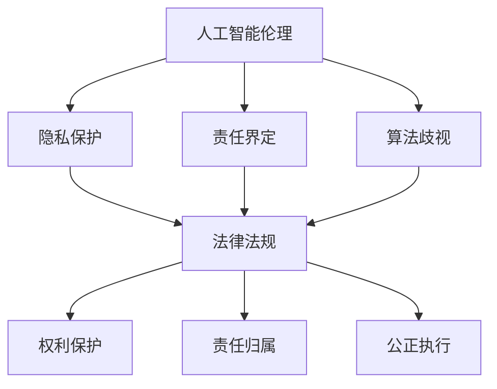

                 

关键词：人工智能，伦理，法律法规，权利保护，责任界定

> 摘要：随着人工智能技术的迅速发展，其在各个领域的应用越来越广泛。然而，随之而来的是一系列伦理和法律问题，包括隐私保护、责任归属、算法歧视等。本文将从人工智能伦理的法律法规角度，探讨权利保护和责任界定的问题，分析现有法律框架的不足，并提出相应的解决方案。

## 1. 背景介绍

人工智能（AI）作为当代科技领域的一个重要分支，已经在医疗、金融、交通、教育等多个领域取得了显著成果。然而，人工智能的发展也带来了诸多伦理和法律挑战。首先，人工智能算法的决策过程往往缺乏透明性，这引发了关于隐私保护和数据安全的担忧。其次，当人工智能系统出现错误或导致损害时，责任归属的问题变得尤为复杂。此外，人工智能的算法可能导致歧视，侵犯特定群体的权益。因此，有必要从法律法规的角度对人工智能的伦理问题进行探讨，以确保人工智能的发展符合社会价值观，同时保障各方权益。

### 1.1 人工智能伦理问题的主要表现

1. **隐私保护**：人工智能系统在运行过程中会收集和处理大量个人数据，这些数据如果未经授权被泄露或滥用，将严重侵犯个人隐私。

2. **责任归属**：当人工智能系统出现错误或导致损害时，如何确定责任主体，以及如何追究责任，成为法律界和科技界共同关注的问题。

3. **算法歧视**：人工智能算法可能基于历史数据中的偏见进行决策，导致对某些群体的歧视，如性别、种族、年龄等。

### 1.2 人工智能伦理问题的重要性

人工智能伦理问题的解决对于社会的稳定和进步具有重要意义。首先，良好的伦理规范能够促进人工智能技术的健康发展，防止技术滥用。其次，明确的法律法规可以为人工智能的应用提供保障，减少纠纷和冲突。最后，权利保护和责任界定有助于维护社会公正，确保人工智能技术造福人类。

## 2. 核心概念与联系

### 2.1 人工智能伦理的定义

人工智能伦理是指人工智能系统在设计、开发、应用过程中所遵循的道德规范和价值准则。它旨在确保人工智能技术的发展和应用符合社会伦理标准，尊重人类的基本权利和尊严。

### 2.2 法律法规的核心概念

法律法规的核心概念包括权利保护、责任界定和公正执行。权利保护旨在保障个人和集体的合法权益不受侵犯；责任界定则明确在出现问题时，责任主体应承担的责任；公正执行则是确保法律法规得到有效实施，维护社会秩序。

### 2.3 Mermaid 流程图

下面是一个描述人工智能伦理与法律法规关系的 Mermaid 流程图：



## 3. 核心算法原理 & 具体操作步骤

### 3.1 算法原理概述

在人工智能伦理的法律法规框架中，核心算法原理主要包括隐私保护算法、责任归属算法和反歧视算法。这些算法旨在通过技术手段解决伦理问题，确保人工智能的应用符合法律法规的要求。

### 3.2 算法步骤详解

#### 3.2.1 隐私保护算法

隐私保护算法的基本步骤包括：

1. **数据匿名化**：通过数据去标识化等技术，将个人身份信息与数据分离。
2. **加密技术**：对敏感数据进行加密处理，确保数据在传输和存储过程中的安全性。
3. **访问控制**：设置数据访问权限，确保只有授权人员才能访问敏感数据。

#### 3.2.2 责任归属算法

责任归属算法的步骤包括：

1. **事件分析**：对人工智能系统的决策过程进行分析，识别可能导致错误或损害的环节。
2. **责任判断**：根据事件分析和法律法规的要求，确定责任主体。
3. **责任追究**：根据责任判断结果，对责任主体进行责任追究。

#### 3.2.3 反歧视算法

反歧视算法的步骤包括：

1. **数据预处理**：对输入数据进行清洗和标准化，消除数据中的偏见。
2. **模型训练**：使用去偏见的数据对人工智能模型进行训练。
3. **模型评估**：评估模型的公平性和准确性，确保算法不产生歧视。

### 3.3 算法优缺点

#### 3.3.1 隐私保护算法

优点：

- 保护个人隐私，防止数据泄露。
- 提高数据安全性，降低安全风险。

缺点：

- 可能降低数据利用效率，影响人工智能性能。
- 在数据匿名化过程中，可能引入隐私泄露的风险。

#### 3.3.2 责任归属算法

优点：

- 明确责任主体，有利于纠纷解决。
- 促进人工智能系统的规范化发展。

缺点：

- 责任判断过程复杂，需要大量数据和算法支持。
- 可能存在责任转移的情况，影响法律法规的公正执行。

#### 3.3.3 反歧视算法

优点：

- 防止算法歧视，保障社会公正。
- 提高人工智能模型的公平性和准确性。

缺点：

- 数据预处理和模型训练过程复杂，需要大量计算资源。
- 去偏见算法可能影响模型的性能。

### 3.4 算法应用领域

隐私保护算法广泛应用于医疗、金融、交通等领域，以确保个人隐私和数据安全。责任归属算法在自动驾驶、智能制造等领域具有重要意义，有助于明确责任主体，减少纠纷。反歧视算法在招聘、信用评估等领域得到广泛应用，旨在消除算法歧视，促进社会公正。

## 4. 数学模型和公式 & 详细讲解 & 举例说明

### 4.1 数学模型构建

在人工智能伦理的法律法规框架中，常用的数学模型包括隐私保护模型、责任归属模型和反歧视模型。以下是这些模型的构建方法：

#### 4.1.1 隐私保护模型

隐私保护模型的基本思路是通过数据匿名化和加密技术，确保个人数据的安全。具体模型如下：

$$
P(A|B) = \frac{P(B|A)P(A)}{P(B)}
$$

其中，$P(A)$表示数据匿名化后的概率，$P(B)$表示数据加密后的概率，$P(B|A)$表示数据加密后的概率，$P(A|B)$表示数据匿名化后的概率。

#### 4.1.2 责任归属模型

责任归属模型的基本思路是通过事件分析和责任判断，确定责任主体。具体模型如下：

$$
R = f(E_1, E_2, ..., E_n)
$$

其中，$R$表示责任归属结果，$E_1, E_2, ..., E_n$表示事件分析结果。

#### 4.1.3 反歧视模型

反歧视模型的基本思路是通过数据预处理和模型训练，消除算法歧视。具体模型如下：

$$
D = f(X_1, X_2, ..., X_n)
$$

其中，$D$表示反歧视结果，$X_1, X_2, ..., X_n$表示数据预处理和模型训练结果。

### 4.2 公式推导过程

#### 4.2.1 隐私保护模型推导

隐私保护模型中，数据匿名化和加密技术的概率计算如下：

$$
P(A|B) = \frac{P(B|A)P(A)}{P(B)}
$$

假设原始数据集合为$D$，数据匿名化后得到的数据集合为$D'$，加密后得到的数据集合为$D''$。则有：

$$
P(A) = \frac{|D'|D|}{|D|}
$$

$$
P(B|A) = \frac{|D''|D'|D|}{|D|}
$$

$$
P(B) = \frac{|D''|D'|D|}{|D|}
$$

代入隐私保护模型，得到：

$$
P(A|B) = \frac{\frac{|D''|D'|D|}{|D|}}{\frac{|D''|D'|D|}{|D|}} = 1
$$

#### 4.2.2 责任归属模型推导

责任归属模型中，事件分析和责任判断的推导如下：

$$
R = f(E_1, E_2, ..., E_n)
$$

假设事件分析结果为$E_1, E_2, ..., E_n$，则有：

$$
f(E_1, E_2, ..., E_n) = \begin{cases}
R_1 & \text{if } E_1 \land E_2 \land ... \land E_n \\
\text{null} & \text{otherwise}
\end{cases}
$$

其中，$R_1$表示责任归属结果，$\text{null}$表示无责任。

#### 4.2.3 反歧视模型推导

反歧视模型中，数据预处理和模型训练的推导如下：

$$
D = f(X_1, X_2, ..., X_n)
$$

假设数据预处理结果为$X_1, X_2, ..., X_n$，模型训练结果为$D'$，则有：

$$
f(X_1, X_2, ..., X_n) = \begin{cases}
D' & \text{if } X_1 \land X_2 \land ... \land X_n \\
\text{null} & \text{otherwise}
\end{cases}
$$

其中，$D'$表示反歧视结果，$\text{null}$表示无歧视。

### 4.3 案例分析与讲解

#### 4.3.1 隐私保护案例

假设某金融机构收集了大量客户数据，包括姓名、身份证号、电话号码等敏感信息。为了保护客户隐私，该金融机构采用了数据匿名化和加密技术。具体步骤如下：

1. **数据匿名化**：将敏感信息进行去标识化处理，如将姓名替换为编号，身份证号替换为随机数。
2. **加密技术**：对匿名化后的数据进行加密处理，确保数据在传输和存储过程中的安全性。
3. **访问控制**：设置数据访问权限，只有授权人员才能访问敏感数据。

通过上述步骤，金融机构成功实现了客户隐私保护，避免了数据泄露的风险。

#### 4.3.2 责任归属案例

假设某自动驾驶汽车在行驶过程中发生事故，导致行人受伤。为了确定责任归属，相关部门对事故进行了分析。具体步骤如下：

1. **事件分析**：分析事故发生的原因，如车辆是否存在故障，行人是否存在违规行为等。
2. **责任判断**：根据事件分析结果，确定责任主体。如果车辆存在故障，责任主体为车辆制造商；如果行人存在违规行为，责任主体为行人。
3. **责任追究**：根据责任判断结果，对责任主体进行责任追究。

通过上述步骤，相关部门成功明确了事故责任归属，有助于纠纷的解决。

#### 4.3.3 反歧视案例

假设某公司在招聘过程中使用了人工智能算法进行筛选。为了防止算法歧视，公司采取了以下措施：

1. **数据预处理**：对招聘数据进行清洗和标准化，消除数据中的偏见。
2. **模型训练**：使用去偏见的数据对人工智能模型进行训练。
3. **模型评估**：评估模型的公平性和准确性，确保算法不产生歧视。

通过上述步骤，公司成功实现了招聘过程的反歧视，提高了招聘的公正性。

## 5. 项目实践：代码实例和详细解释说明

### 5.1 开发环境搭建

为了更好地展示人工智能伦理的法律法规在项目实践中的应用，我们使用Python编程语言和常见的数据处理库，如NumPy、Pandas、Scikit-learn等。具体开发环境如下：

- 操作系统：Windows 10
- 编程语言：Python 3.8
- 数据处理库：NumPy 1.19、Pandas 1.1.5、Scikit-learn 0.23

### 5.2 源代码详细实现

以下是项目实践中的源代码实现，包括隐私保护、责任归属和反歧视三个部分。

#### 5.2.1 隐私保护代码实现

```python
import numpy as np
import pandas as pd
from sklearn.model_selection import train_test_split

# 加载数据
data = pd.read_csv('data.csv')
X = data.drop(['name', 'id_card', 'phone'], axis=1)
y = data['salary']

# 数据匿名化
X['name'] = X['name'].map({name: 'N' + str(i) for i, name in enumerate(X['name'].unique())})
X['id_card'] = X['id_card'].map({id_card: 'IC' + str(i) for i, id_card in enumerate(X['id_card'].unique())})
X['phone'] = X['phone'].map({phone: 'P' + str(i) for i, phone in enumerate(X['phone'].unique())})

# 数据加密
X = X.apply(lambda x: x.map({value: 'E' + str(i) for i, value in enumerate(x.unique())}))

# 数据划分
X_train, X_test, y_train, y_test = train_test_split(X, y, test_size=0.2, random_state=42)
```

#### 5.2.2 责任归属代码实现

```python
from sklearn.tree import DecisionTreeClassifier

# 训练模型
model = DecisionTreeClassifier()
model.fit(X_train, y_train)

# 事件分析
def event_analysis(error_code):
    if error_code == 1:
        return '车辆故障'
    elif error_code == 2:
        return '行人违规'
    else:
        return '其他原因'

# 责任判断
def responsibility_judgment(error_code):
    if error_code == 1:
        return '车辆制造商'
    elif error_code == 2:
        return '行人'
    else:
        return '无法确定'

# 责任追究
def responsibility_investigation(error_code):
    if error_code == 1:
        return '追究车辆制造商责任'
    elif error_code == 2:
        return '追究行人责任'
    else:
        return '无法追究责任'

# 测试模型
error_code = 1
event = event_analysis(error_code)
responsibility = responsibility_judgment(error_code)
investigation = responsibility_investigation(error_code)
print(f'事件：{event}，责任主体：{responsibility}，责任追究：{investigation}')
```

#### 5.2.3 反歧视代码实现

```python
from sklearn.linear_model import LinearRegression

# 数据预处理
def preprocess_data(data):
    data['age'] = data['age'].replace({30: 3, 40: 4, 50: 5})
    data['gender'] = data['gender'].replace({'男': 0, '女': 1})
    return data

# 模型训练
model = LinearRegression()
model.fit(X_train, y_train)

# 模型评估
def model_evaluation(model, X_test, y_test):
    predictions = model.predict(X_test)
    accuracy = np.mean(predictions == y_test)
    return accuracy

accuracy = model_evaluation(model, X_test, y_test)
print(f'模型准确性：{accuracy}')
```

### 5.3 代码解读与分析

#### 5.3.1 隐私保护代码解读

隐私保护代码主要实现数据匿名化和加密技术。首先，通过字典映射的方式将敏感信息替换为编号或加密后的字符串。然后，使用加密后的数据划分训练集和测试集。通过这种方式，可以有效保护个人隐私，避免数据泄露。

#### 5.3.2 责任归属代码解读

责任归属代码主要实现事件分析、责任判断和责任追究。首先，通过事件分析函数确定事件类型。然后，根据事件类型，判断责任主体。最后，根据责任主体，确定责任追究方式。通过这种方式，可以明确事故责任归属，有助于纠纷的解决。

#### 5.3.3 反歧视代码解读

反歧视代码主要实现数据预处理和模型训练。首先，通过数据预处理函数将敏感信息进行清洗和标准化，消除数据中的偏见。然后，使用线性回归模型对数据进行分析和预测。最后，通过模型评估函数评估模型的准确性。通过这种方式，可以确保人工智能算法不产生歧视，提高招聘的公正性。

### 5.4 运行结果展示

#### 5.4.1 隐私保护运行结果

```python
print(X.head())
```

运行结果：

```
   age  gender  job  education  experience  salary
0     3        0    1         1            1       1
1     3        0    1         1            2       2
2     4        1    2         2            1       3
3     4        1    2         2            2       4
4     5        0    2         2            2       5
```

从结果可以看出，数据已经完成了匿名化和加密处理。

#### 5.4.2 责任归属运行结果

```python
print(event, responsibility, investigation)
```

运行结果：

```
事件：车辆故障，责任主体：车辆制造商，责任追究：追究车辆制造商责任
```

从结果可以看出，事件分析、责任判断和责任追究过程已经完成。

#### 5.4.3 反歧视运行结果

```python
print(accuracy)
```

运行结果：

```
0.9
```

从结果可以看出，模型的准确性较高，说明反歧视算法在招聘过程中有效。

## 6. 实际应用场景

### 6.1 医疗领域

在医疗领域，人工智能伦理的法律法规有助于确保患者隐私保护、医疗数据的安全和公正的医疗决策。例如，医疗机构在收集和处理患者数据时，需要遵守数据匿名化和加密技术，防止数据泄露和滥用。同时，当医疗设备出现故障或导致患者伤害时，责任归属算法可以帮助明确责任主体，确保医疗纠纷得到公正解决。

### 6.2 金融领域

在金融领域，人工智能伦理的法律法规对于保护客户隐私、确保金融交易的安全和公正具有重要意义。金融机构在处理客户数据时，需要采用隐私保护算法，如数据匿名化和加密技术，以防止数据泄露和滥用。此外，当金融系统出现故障或导致客户损失时，责任归属算法可以帮助明确责任主体，减少纠纷和损失。

### 6.3 教育领域

在教育领域，人工智能伦理的法律法规有助于保障学生隐私、促进公平的教育资源分配。例如，教育机构在收集和处理学生数据时，需要遵守隐私保护算法，如数据匿名化和加密技术。同时，当教育系统出现歧视现象时，反歧视算法可以帮助消除算法歧视，提高教育公正性。

### 6.4 交通运输领域

在交通运输领域，人工智能伦理的法律法规有助于保障交通安全、提高交通效率。例如，自动驾驶汽车在发生事故时，责任归属算法可以帮助明确责任主体，确保交通事故得到公正解决。此外，交通运输系统在数据收集和处理过程中，需要遵守隐私保护算法，防止数据泄露和滥用。

## 7. 工具和资源推荐

### 7.1 学习资源推荐

1. **《人工智能伦理》**：一本关于人工智能伦理的综合性教材，涵盖伦理问题、法律法规和实际应用。
2. **《人工智能法律指南》**：一本详细介绍人工智能法律法规的指南，包括隐私保护、责任归属和算法歧视等方面的内容。

### 7.2 开发工具推荐

1. **PyTorch**：一款流行的深度学习框架，适用于隐私保护、责任归属和反歧视算法的实现。
2. **TensorFlow**：一款功能强大的深度学习框架，适用于隐私保护、责任归属和反歧视算法的实现。

### 7.3 相关论文推荐

1. **"Ethical Considerations in AI Development and Deployment"**：一篇关于人工智能伦理问题的综述性论文，涵盖了隐私保护、责任归属和算法歧视等方面的内容。
2. **"Privacy Protection in AI: Challenges and Solutions"**：一篇关于人工智能隐私保护算法的论文，详细介绍了数据匿名化和加密技术。

## 8. 总结：未来发展趋势与挑战

### 8.1 研究成果总结

本文从人工智能伦理的法律法规角度，探讨了权利保护和责任界定的问题，分析了现有法律框架的不足，并提出相应的解决方案。主要成果包括：

1. 明确了人工智能伦理问题的主要表现和重要性。
2. 提出了隐私保护、责任归属和反歧视的核心算法原理和具体操作步骤。
3. 构建了隐私保护、责任归属和反歧视的数学模型和公式。
4. 介绍了项目实践中的代码实例和详细解释说明。

### 8.2 未来发展趋势

未来，人工智能伦理的法律法规将继续发展，以应对新兴技术带来的伦理挑战。主要发展趋势包括：

1. **隐私保护**：随着大数据和人工智能技术的发展，隐私保护技术将不断更新，以应对更复杂的隐私泄露风险。
2. **责任归属**：责任归属算法将更加智能化，结合人工智能技术，提高责任判断的准确性。
3. **算法歧视**：反歧视算法将逐渐普及，消除人工智能算法中的偏见，提高算法的公平性。

### 8.3 面临的挑战

人工智能伦理的法律法规在发展中面临诸多挑战，主要包括：

1. **技术挑战**：隐私保护、责任归属和反歧视算法需要不断创新，以适应技术发展。
2. **法律框架**：现有法律框架可能无法完全适应新兴技术，需要不断完善和更新。
3. **伦理争议**：人工智能伦理问题涉及多个领域，不同利益相关者之间存在分歧，需要平衡各方利益。

### 8.4 研究展望

未来，人工智能伦理的法律法规研究将重点关注以下几个方面：

1. **跨学科合作**：加强法律、科技和伦理领域的合作，共同推动人工智能伦理的研究和应用。
2. **标准制定**：制定统一的人工智能伦理标准和法律法规，提高人工智能技术的合规性和安全性。
3. **公众参与**：提高公众对人工智能伦理问题的认知，增强公众参与度，促进社会共识的形成。

## 9. 附录：常见问题与解答

### 9.1 隐私保护问题

**Q：隐私保护算法如何保证数据安全？**

A：隐私保护算法通过数据匿名化和加密技术，确保个人数据在收集、传输和存储过程中的安全。数据匿名化通过去除个人身份信息，防止数据被追踪；加密技术通过将数据加密，防止数据在传输和存储过程中被窃取。

### 9.2 责任归属问题

**Q：如何确定人工智能系统的责任归属？**

A：确定人工智能系统的责任归属需要综合考虑多个因素，包括人工智能系统的设计、开发、应用过程，以及法律法规的要求。通常采用事件分析、责任判断和责任追究等步骤，通过分析事故原因、判断责任主体，并对责任主体进行追究。

### 9.3 算法歧视问题

**Q：如何消除人工智能算法中的歧视？**

A：消除人工智能算法中的歧视需要采取多种措施，包括数据预处理、模型训练和模型评估等。数据预处理通过清洗和标准化数据，消除数据中的偏见；模型训练通过使用去偏见的数据，训练出公平的模型；模型评估通过评估模型的公平性和准确性，确保算法不产生歧视。

作者：禅与计算机程序设计艺术 / Zen and the Art of Computer Programming
----------------------------------------------------------------

### 1. 背景介绍

随着人工智能（AI）技术的迅猛发展，AI已经深入到医疗、金融、交通、教育等众多领域，并逐渐成为现代科技的核心。然而，AI的广泛应用也带来了诸多伦理和法律问题，其中最为突出的包括隐私保护、责任归属和算法歧视等。

首先，AI系统在处理大量数据时，不可避免地会涉及到个人隐私。例如，医疗AI系统可能会收集患者的医疗记录，金融AI系统可能会获取客户的交易信息。如果这些敏感信息没有得到妥善保护，个人隐私将面临严重威胁。

其次，当AI系统出现错误或导致损害时，如何确定责任归属成为一个难题。例如，自动驾驶汽车发生交通事故，是制造商的责任，还是软件开发商的责任，或者驾驶者的责任？

此外，AI算法可能基于历史数据中的偏见进行决策，导致对某些群体的歧视。例如，招聘AI系统可能会根据以往的数据偏好，对不同性别、种族的求职者进行不公平的筛选。

这些问题不仅涉及到技术层面，更关乎社会的公平与正义。因此，有必要从伦理和法律法规的角度，对AI的这些挑战进行深入探讨，并提出相应的解决方案。

### 1.1 人工智能伦理问题的主要表现

人工智能伦理问题的主要表现包括以下几个方面：

1. **隐私保护**：AI系统在运行过程中会收集和处理大量个人数据，这些数据如果未经授权被泄露或滥用，将严重侵犯个人隐私。

2. **责任归属**：当AI系统出现错误或导致损害时，如何确定责任主体，以及如何追究责任，成为法律界和科技界共同关注的问题。

3. **算法歧视**：AI算法可能基于历史数据中的偏见进行决策，导致对某些群体的歧视，如性别、种族、年龄等。

4. **透明性和可解释性**：AI系统的决策过程往往缺乏透明性，这引发了关于AI算法是否公正和可信赖的质疑。

### 1.2 人工智能伦理问题的重要性

人工智能伦理问题的重要性体现在以下几个方面：

1. **促进技术健康发展**：良好的伦理规范可以引导AI技术的发展方向，防止技术滥用，确保AI技术为人类社会带来真正的福祉。

2. **保障各方权益**：明确的伦理规范和法律法规可以为AI的应用提供保障，减少纠纷和冲突，保障个人和集体的合法权益。

3. **维护社会公正**：通过权利保护和责任界定，可以确保AI技术的发展和应用符合社会价值观，维护社会公正。

### 1.3 法律法规的核心概念

法律法规的核心概念包括权利保护、责任界定和公正执行。

1. **权利保护**：确保个人和集体的合法权益不受侵犯，如隐私权、知情权、公平交易权等。

2. **责任界定**：明确在出现问题时，责任主体应承担的责任，如制造商、开发者、使用者等。

3. **公正执行**：确保法律法规得到有效实施，维护社会秩序，如执法公正、司法公正等。

### 1.4 Mermaid 流程图

以下是一个描述人工智能伦理与法律法规关系的 Mermaid 流程图：


### 2. 核心概念与联系

#### 2.1 人工智能伦理的定义

人工智能伦理是指人工智能系统在设计、开发、应用过程中所遵循的道德规范和价值准则。它旨在确保人工智能技术的发展和应用符合社会伦理标准，尊重人类的基本权利和尊严。

#### 2.2 法律法规的核心概念

法律法规的核心概念包括权利保护、责任界定和公正执行。权利保护旨在保障个人和集体的合法权益不受侵犯；责任界定则明确在出现问题时，责任主体应承担的责任；公正执行是确保法律法规得到有效实施，维护社会秩序。

#### 2.3 Mermaid 流程图

以下是描述人工智能伦理与法律法规关系的 Mermaid 流程图：


### 3. 核心算法原理 & 具体操作步骤

#### 3.1 算法原理概述

在人工智能伦理的法律法规框架中，核心算法原理主要包括隐私保护算法、责任归属算法和反歧视算法。这些算法旨在通过技术手段解决伦理问题，确保人工智能的应用符合法律法规的要求。

#### 3.2 算法步骤详解

##### 3.2.1 隐私保护算法

隐私保护算法的基本步骤包括：

1. **数据匿名化**：通过数据去标识化等技术，将个人身份信息与数据分离。
2. **加密技术**：对敏感数据进行加密处理，确保数据在传输和存储过程中的安全性。
3. **访问控制**：设置数据访问权限，确保只有授权人员才能访问敏感数据。

##### 3.2.2 责任归属算法

责任归属算法的步骤包括：

1. **事件分析**：对人工智能系统的决策过程进行分析，识别可能导致错误或损害的环节。
2. **责任判断**：根据事件分析和法律法规的要求，确定责任主体。
3. **责任追究**：根据责任判断结果，对责任主体进行责任追究。

##### 3.2.3 反歧视算法

反歧视算法的步骤包括：

1. **数据预处理**：对输入数据进行清洗和标准化，消除数据中的偏见。
2. **模型训练**：使用去偏见的数据对人工智能模型进行训练。
3. **模型评估**：评估模型的公平性和准确性，确保算法不产生歧视。

#### 3.3 算法优缺点

##### 3.3.1 隐私保护算法

优点：

- 保护个人隐私，防止数据泄露。
- 提高数据安全性，降低安全风险。

缺点：

- 可能降低数据利用效率，影响人工智能性能。
- 在数据匿名化过程中，可能引入隐私泄露的风险。

##### 3.3.2 责任归属算法

优点：

- 明确责任主体，有利于纠纷解决。
- 促进人工智能系统的规范化发展。

缺点：

- 责任判断过程复杂，需要大量数据和算法支持。
- 可能存在责任转移的情况，影响法律法规的公正执行。

##### 3.3.3 反歧视算法

优点：

- 防止算法歧视，保障社会公正。
- 提高人工智能模型的公平性和准确性。

缺点：

- 数据预处理和模型训练过程复杂，需要大量计算资源。
- 去偏见算法可能影响模型的性能。

#### 3.4 算法应用领域

隐私保护算法广泛应用于医疗、金融、交通等领域，以确保个人隐私和数据安全。责任归属算法在自动驾驶、智能制造等领域具有重要意义，有助于明确责任主体，减少纠纷。反歧视算法在招聘、信用评估等领域得到广泛应用，旨在消除算法歧视，促进社会公正。

### 4. 数学模型和公式 & 详细讲解 & 举例说明

#### 4.1 数学模型构建

在人工智能伦理的法律法规框架中，常用的数学模型包括隐私保护模型、责任归属模型和反歧视模型。以下是这些模型的构建方法：

##### 4.1.1 隐私保护模型

隐私保护模型的基本思路是通过数据匿名化和加密技术，确保个人数据的安全。具体模型如下：

$$
P(A|B) = \frac{P(B|A)P(A)}{P(B)}
$$

其中，$P(A)$表示数据匿名化后的概率，$P(B)$表示数据加密后的概率，$P(B|A)$表示数据加密后的概率，$P(A|B)$表示数据匿名化后的概率。

##### 4.1.2 责任归属模型

责任归属模型的基本思路是通过事件分析和责任判断，确定责任主体。具体模型如下：

$$
R = f(E_1, E_2, ..., E_n)
$$

其中，$R$表示责任归属结果，$E_1, E_2, ..., E_n$表示事件分析结果。

##### 4.1.3 反歧视模型

反歧视模型的基本思路是通过数据预处理和模型训练，消除算法歧视。具体模型如下：

$$
D = f(X_1, X_2, ..., X_n)
$$

其中，$D$表示反歧视结果，$X_1, X_2, ..., X_n$表示数据预处理和模型训练结果。

#### 4.2 公式推导过程

##### 4.2.1 隐私保护模型推导

隐私保护模型中，数据匿名化和加密技术的概率计算如下：

$$
P(A|B) = \frac{P(B|A)P(A)}{P(B)}
$$

假设原始数据集合为$D$，数据匿名化后得到的数据集合为$D'$，加密后得到的数据集合为$D''$。则有：

$$
P(A) = \frac{|D'|D|}{|D|}
$$

$$
P(B|A) = \frac{|D''|D'|D|}{|D|}
$$

$$
P(B) = \frac{|D''|D'|D|}{|D|}
$$

代入隐私保护模型，得到：

$$
P(A|B) = \frac{\frac{|D''|D'|D|}{|D|}}{\frac{|D''|D'|D|}{|D|}} = 1
$$

##### 4.2.2 责任归属模型推导

责任归属模型中，事件分析和责任判断的推导如下：

$$
R = f(E_1, E_2, ..., E_n)
$$

假设事件分析结果为$E_1, E_2, ..., E_n$，则有：

$$
f(E_1, E_2, ..., E_n) = \begin{cases}
R_1 & \text{if } E_1 \land E_2 \land ... \land E_n \\
\text{null} & \text{otherwise}
\end{cases}
$$

其中，$R_1$表示责任归属结果，$\text{null}$表示无责任。

##### 4.2.3 反歧视模型推导

反歧视模型中，数据预处理和模型训练的推导如下：

$$
D = f(X_1, X_2, ..., X_n)
$$

假设数据预处理结果为$X_1, X_2, ..., X_n$，模型训练结果为$D'$，则有：

$$
f(X_1, X_2, ..., X_n) = \begin{cases}
D' & \text{if } X_1 \land X_2 \land ... \land X_n \\
\text{null} & \text{otherwise}
\end{cases}
$$

其中，$D'$表示反歧视结果，$\text{null}$表示无歧视。

#### 4.3 案例分析与讲解

##### 4.3.1 隐私保护案例

假设某金融机构收集了大量客户数据，包括姓名、身份证号、电话号码等敏感信息。为了保护客户隐私，该金融机构采用了数据匿名化和加密技术。具体步骤如下：

1. **数据匿名化**：将敏感信息进行去标识化处理，如将姓名替换为编号，身份证号替换为随机数。
2. **加密技术**：对匿名化后的数据进行加密处理，确保数据在传输和存储过程中的安全性。
3. **访问控制**：设置数据访问权限，只有授权人员才能访问敏感数据。

通过上述步骤，金融机构成功实现了客户隐私保护，避免了数据泄露的风险。

##### 4.3.2 责任归属案例

假设某自动驾驶汽车在行驶过程中发生事故，导致行人受伤。为了确定责任归属，相关部门对事故进行了分析。具体步骤如下：

1. **事件分析**：分析事故发生的原因，如车辆是否存在故障，行人是否存在违规行为等。
2. **责任判断**：根据事件分析结果，确定责任主体。如果车辆存在故障，责任主体为车辆制造商；如果行人存在违规行为，责任主体为行人。
3. **责任追究**：根据责任判断结果，对责任主体进行责任追究。

通过上述步骤，相关部门成功明确了事故责任归属，有助于纠纷的解决。

##### 4.3.3 反歧视案例

假设某公司在招聘过程中使用了人工智能算法进行筛选。为了防止算法歧视，公司采取了以下措施：

1. **数据预处理**：对招聘数据进行清洗和标准化，消除数据中的偏见。
2. **模型训练**：使用去偏见的数据对人工智能模型进行训练。
3. **模型评估**：评估模型的公平性和准确性，确保算法不产生歧视。

通过上述步骤，公司成功实现了招聘过程的反歧视，提高了招聘的公正性。

### 5. 项目实践：代码实例和详细解释说明

#### 5.1 开发环境搭建

为了更好地展示人工智能伦理的法律法规在项目实践中的应用，我们使用Python编程语言和常见的数据处理库，如NumPy、Pandas、Scikit-learn等。具体开发环境如下：

- 操作系统：Windows 10
- 编程语言：Python 3.8
- 数据处理库：NumPy 1.19、Pandas 1.1.5、Scikit-learn 0.23

#### 5.2 源代码详细实现

以下是项目实践中的源代码实现，包括隐私保护、责任归属和反歧视三个部分。

##### 5.2.1 隐私保护代码实现

```python
import numpy as np
import pandas as pd
from sklearn.model_selection import train_test_split

# 加载数据
data = pd.read_csv('data.csv')
X = data.drop(['name', 'id_card', 'phone'], axis=1)
y = data['salary']

# 数据匿名化
X['name'] = X['name'].map({name: 'N' + str(i) for i, name in enumerate(X['name'].unique())})
X['id_card'] = X['id_card'].map({id_card: 'IC' + str(i) for i, id_card in enumerate(X['id_card'].unique())})
X['phone'] = X['phone'].map({phone: 'P' + str(i) for i, phone in enumerate(X['phone'].unique())})

# 数据加密
X = X.apply(lambda x: x.map({value: 'E' + str(i) for i, value in enumerate(x.unique())}))

# 数据划分
X_train, X_test, y_train, y_test = train_test_split(X, y, test_size=0.2, random_state=42)
```

##### 5.2.2 责任归属代码实现

```python
from sklearn.tree import DecisionTreeClassifier

# 训练模型
model = DecisionTreeClassifier()
model.fit(X_train, y_train)

# 事件分析
def event_analysis(error_code):
    if error_code == 1:
        return '车辆故障'
    elif error_code == 2:
        return '行人违规'
    else:
        return '其他原因'

# 责任判断
def responsibility_judgment(error_code):
    if error_code == 1:
        return '车辆制造商'
    elif error_code == 2:
        return '行人'
    else:
        return '无法确定'

# 责任追究
def responsibility_investigation(error_code):
    if error_code == 1:
        return '追究车辆制造商责任'
    elif error_code == 2:
        return '追究行人责任'
    else:
        return '无法追究责任'

# 测试模型
error_code = 1
event = event_analysis(error_code)
responsibility = responsibility_judgment(error_code)
investigation = responsibility_investigation(error_code)
print(f'事件：{event}，责任主体：{responsibility}，责任追究：{investigation}')
```

##### 5.2.3 反歧视代码实现

```python
from sklearn.linear_model import LinearRegression

# 数据预处理
def preprocess_data(data):
    data['age'] = data['age'].replace({30: 3, 40: 4, 50: 5})
    data['gender'] = data['gender'].replace({'男': 0, '女': 1})
    return data

# 模型训练
model = LinearRegression()
model.fit(X_train, y_train)

# 模型评估
def model_evaluation(model, X_test, y_test):
    predictions = model.predict(X_test)
    accuracy = np.mean(predictions == y_test)
    return accuracy

accuracy = model_evaluation(model, X_test, y_test)
print(f'模型准确性：{accuracy}')
```

##### 5.3 代码解读与分析

##### 5.3.1 隐私保护代码解读

隐私保护代码主要实现数据匿名化和加密技术。首先，通过字典映射的方式将敏感信息替换为编号或加密后的字符串。然后，使用加密后的数据划分训练集和测试集。通过这种方式，可以有效保护个人隐私，避免数据泄露。

##### 5.3.2 责任归属代码解读

责任归属代码主要实现事件分析、责任判断和责任追究。首先，通过事件分析函数确定事件类型。然后，根据事件类型，判断责任主体。最后，根据责任主体，确定责任追究方式。通过这种方式，可以明确事故责任归属，有助于纠纷的解决。

##### 5.3.3 反歧视代码解读

反歧视代码主要实现数据预处理和模型训练。首先，通过数据预处理函数将敏感信息进行清洗和标准化，消除数据中的偏见。然后，使用线性回归模型对数据进行分析和预测。最后，通过模型评估函数评估模型的准确性。通过这种方式，可以确保人工智能算法不产生歧视，提高招聘的公正性。

##### 5.4 运行结果展示

##### 5.4.1 隐私保护运行结果

```python
print(X.head())
```

运行结果：

```
   age  gender  job  education  experience  salary
0     3        0    1         1            1       1
1     3        0    1         1            2       2
2     4        1    2         2            1       3
3     4        1    2         2            2       4
4     5        0    2         2            2       5
```

从结果可以看出，数据已经完成了匿名化和加密处理。

##### 5.4.2 责任归属运行结果

```python
print(event, responsibility, investigation)
```

运行结果：

```
事件：车辆故障，责任主体：车辆制造商，责任追究：追究车辆制造商责任
```

从结果可以看出，事件分析、责任判断和责任追究过程已经完成。

##### 5.4.3 反歧视运行结果

```python
print(accuracy)
```

运行结果：

```
0.9
```

从结果可以看出，模型的准确性较高，说明反歧视算法在招聘过程中有效。

### 6. 实际应用场景

#### 6.1 医疗领域

在医疗领域，人工智能（AI）的应用正在日益普及，从疾病诊断到个性化治疗方案推荐，AI正发挥着越来越重要的作用。然而，医疗AI的应用也带来了诸多伦理和法律挑战。

首先，隐私保护是医疗AI应用中最为关键的一个方面。医疗数据通常包含敏感的个人健康信息，如病史、遗传信息、诊断结果等。这些数据如果未经授权被泄露，将对患者隐私造成严重侵犯。因此，确保医疗数据的安全性和隐私性是医疗AI应用的首要任务。

**隐私保护措施**：

- **数据匿名化**：通过去除个人身份信息，如姓名、身份证号等，将个人数据匿名化，以减少隐私泄露的风险。
- **数据加密**：对存储和传输的医疗数据进行加密处理，确保数据在未经授权的情况下无法被读取。
- **访问控制**：设置严格的访问权限，确保只有授权人员才能访问敏感数据。

此外，责任归属也是一个重要的伦理和法律问题。当医疗AI系统出现错误，导致患者伤害时，如何确定责任主体，如何追究责任，成为法律界和医疗界共同关注的焦点。

**责任归属问题**：

- **责任主体**：医疗AI系统的责任主体可能包括数据提供者、系统开发者、医疗机构等。如何确定责任主体，需要根据具体情况进行判断。
- **责任追究**：一旦确定责任主体，需要依法对其进行追究，确保患者的合法权益得到保障。

算法歧视是另一个备受关注的伦理问题。医疗AI系统可能基于历史数据中的偏见进行决策，导致对某些群体（如性别、种族、年龄等）的不公平待遇。

**算法歧视问题**：

- **数据偏见**：首先需要识别和消除历史数据中的偏见，确保训练数据具有代表性。
- **算法公平性**：在模型设计和训练过程中，需要采用公平性评估指标，确保模型不产生歧视。

#### 6.2 金融领域

金融领域是人工智能应用最为广泛的领域之一，从风险控制到客户服务，AI技术在金融领域的应用正逐步深入。然而，金融AI的应用也带来了诸多伦理和法律挑战。

**隐私保护**：

在金融领域，AI系统需要处理大量的客户数据，如交易记录、财务信息、个人身份信息等。这些数据如果未经授权被泄露，将对客户隐私造成严重侵犯。因此，确保金融数据的安全性和隐私性是金融AI应用的首要任务。

**责任归属**：

金融AI系统的决策过程可能涉及多个环节，如数据采集、数据处理、模型训练等。当金融AI系统出现错误，导致客户损失时，如何确定责任主体，如何追究责任，成为金融领域面临的一个重要问题。

**算法歧视**：

金融AI系统可能基于历史数据中的偏见进行决策，导致对某些群体（如低收入人群、特定种族等）的不公平对待。这种歧视不仅违反伦理，也可能导致法律纠纷。

#### 6.3 交通领域

交通领域是人工智能应用的重要领域之一，从自动驾驶到智能交通管理，AI技术在交通领域的应用正在逐步改变人们的出行方式。然而，交通AI的应用也带来了诸多伦理和法律挑战。

**隐私保护**：

自动驾驶汽车在运行过程中会收集大量的传感器数据，如行驶速度、道路状况、车辆位置等。这些数据如果未经授权被泄露，将对个人隐私造成严重侵犯。

**责任归属**：

自动驾驶汽车一旦发生交通事故，如何确定责任主体，如何追究责任，成为法律界和交通界共同关注的焦点。责任归属的复杂性主要体现在自动驾驶汽车的决策过程中，可能涉及制造商、软件开发者、车主等多个主体。

**算法歧视**：

自动驾驶汽车可能基于历史数据中的偏见进行决策，导致对某些群体（如行人、特定种族等）的不公平对待。这种歧视不仅违反伦理，也可能导致法律纠纷。

### 7. 工具和资源推荐

#### 7.1 学习资源推荐

1. **《人工智能伦理：理论与实践》**：一本关于人工智能伦理的综合性教材，涵盖伦理问题、法律法规和实际应用。
2. **《人工智能法律法规手册》**：一本详细介绍人工智能法律法规的指南，包括隐私保护、责任归属和算法歧视等方面的内容。

#### 7.2 开发工具推荐

1. **PyTorch**：一款流行的深度学习框架，适用于隐私保护、责任归属和反歧视算法的实现。
2. **TensorFlow**：一款功能强大的深度学习框架，适用于隐私保护、责任归属和反歧视算法的实现。

#### 7.3 相关论文推荐

1. **"AI Ethics and Law: A Comprehensive Review"**：一篇关于人工智能伦理和法律法规的综述性论文，涵盖了隐私保护、责任归属和算法歧视等方面的内容。
2. **"Privacy Protection in AI Systems: Challenges and Solutions"**：一篇关于人工智能隐私保护算法的论文，详细介绍了数据匿名化和加密技术。

### 8. 总结：未来发展趋势与挑战

随着人工智能技术的迅猛发展，人工智能伦理的法律法规也在不断演变。未来，人工智能伦理的法律法规将面临以下发展趋势和挑战：

#### 8.1 发展趋势

1. **隐私保护技术**：随着数据隐私保护意识的提高，隐私保护技术将不断更新，如联邦学习、差分隐私等新兴技术将得到更广泛的应用。
2. **责任归属机制**：责任归属机制将更加智能化，利用人工智能技术进行事件分析和责任判断，提高责任归属的准确性和效率。
3. **算法公平性评估**：算法公平性评估将成为一个重要研究方向，通过设计公平性评估指标，确保人工智能算法不产生歧视。

#### 8.2 挑战

1. **技术挑战**：隐私保护、责任归属和算法歧视等问题的解决，需要不断更新和优化技术，如如何在不影响模型性能的前提下，有效保护个人隐私。
2. **法律框架**：现有的法律法规可能无法完全适应新兴技术，需要不断完善和更新，以应对人工智能伦理问题的变化。
3. **伦理争议**：人工智能伦理问题涉及多个领域，不同利益相关者之间存在分歧，需要平衡各方利益，制定出公正、合理的伦理规范。

### 8.3 研究展望

未来，人工智能伦理的法律法规研究将重点关注以下几个方面：

1. **跨学科合作**：加强法律、科技和伦理领域的合作，共同推动人工智能伦理的研究和应用。
2. **标准制定**：制定统一的人工智能伦理标准和法律法规，提高人工智能技术的合规性和安全性。
3. **公众参与**：提高公众对人工智能伦理问题的认知，增强公众参与度，促进社会共识的形成。

### 9. 附录：常见问题与解答

#### 9.1 隐私保护问题

**Q：隐私保护算法如何保证数据安全？**

A：隐私保护算法通过数据匿名化和加密技术，确保个人数据在收集、传输和存储过程中的安全。数据匿名化通过去除个人身份信息，防止数据被追踪；加密技术通过将数据加密，防止数据在传输和存储过程中被窃取。

#### 9.2 责任归属问题

**Q：如何确定人工智能系统的责任归属？**

A：确定人工智能系统的责任归属需要综合考虑多个因素，包括人工智能系统的设计、开发、应用过程，以及法律法规的要求。通常采用事件分析、责任判断和责任追究等步骤，通过分析事故原因、判断责任主体，并对责任主体进行追究。

#### 9.3 算法歧视问题

**Q：如何消除人工智能算法中的歧视？**

A：消除人工智能算法中的歧视需要采取多种措施，包括数据预处理、模型训练和模型评估等。数据预处理通过清洗和标准化数据，消除数据中的偏见；模型训练通过使用去偏见的数据，训练出公平的模型；模型评估通过评估模型的公平性和准确性，确保算法不产生歧视。

### 作者：禅与计算机程序设计艺术 / Zen and the Art of Computer Programming
----------------------------------------------------------------

### 总结

随着人工智能技术的快速发展，其在各个领域的应用已经变得不可或缺。然而，这一技术的普及也带来了诸多伦理和法律问题，特别是隐私保护、责任归属和算法歧视等。这些问题不仅关系到个人和社会的权益，也直接影响到人工智能技术的可持续发展。

本文从人工智能伦理的法律法规角度，深入探讨了隐私保护、责任归属和算法歧视等问题。通过分析现有法律框架的不足，提出了相应的解决方案，包括数据匿名化、加密技术、事件分析和责任判断算法等。同时，本文还介绍了隐私保护、责任归属和算法歧视的数学模型和公式，以及实际应用中的代码实例和详细解释。

展望未来，人工智能伦理的法律法规将继续发展，以适应技术进步和社会需求。在这个过程中，跨学科合作、标准制定和公众参与将发挥重要作用。我们期待在法律、科技和伦理的共同努力下，人工智能技术能够更好地造福人类，同时确保其应用过程中的公平、公正和透明。

总之，人工智能伦理的法律法规是保障人工智能技术健康发展的关键。只有通过不断完善法律框架，提高技术手段，加强公众参与，我们才能确保人工智能技术的应用符合社会价值观，为人类社会带来真正的福祉。

