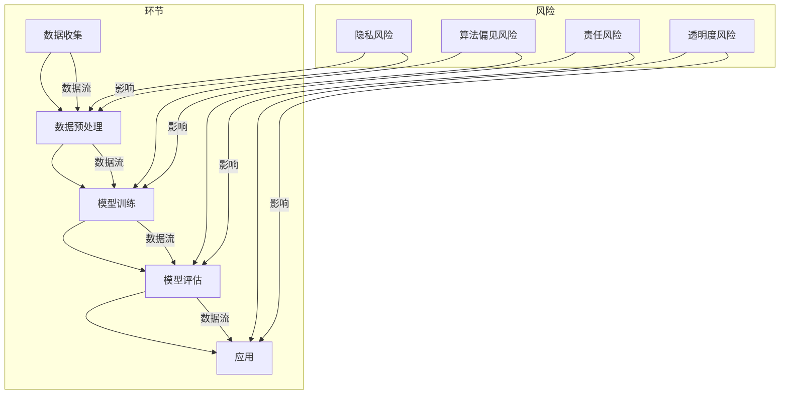

                 

### 摘要 Summary ###

本文旨在探讨人工智能（AI）伦理风险评估与管理的重要性和实施策略。在人工智能技术日益普及的今天，伦理风险成为了不可忽视的问题。本文首先介绍了AI伦理风险的定义和类型，随后详细阐述了伦理风险识别和控制的方法，并通过实际案例和数学模型进行了说明。最后，本文提出了未来AI伦理研究的趋势和挑战，以及应对策略。希望本文能够为人工智能伦理风险的研究和管理提供一定的参考和指导。

<|assistant|>### 1. 背景介绍 Introduction ###

随着人工智能技术的快速发展，AI的应用场景逐渐渗透到社会生活的方方面面。从自动驾驶汽车到智能医疗诊断，从金融风险评估到社交网络内容推荐，AI技术正以其强大的数据处理能力和智能决策能力，改变着我们的生活方式和社会结构。然而，AI技术的广泛应用也引发了一系列伦理问题，如隐私侵犯、算法偏见、责任归属等。这些问题不仅涉及到个人的权益和利益，也关系到整个社会的公平和正义。

伦理风险是指由于技术、管理、社会等因素导致的不道德行为或道德错误的可能性。在人工智能领域，伦理风险主要表现在以下几个方面：

1. **隐私侵犯**：AI系统在处理大量数据时，可能侵犯用户的隐私权。例如，通过个人数据的收集和分析，AI系统可能揭示出用户的私密信息，甚至用于商业目的。
2. **算法偏见**：AI算法在训练过程中，可能会受到数据集中的偏见影响，导致对某些群体的不公平对待。例如，在招聘系统中，如果训练数据中存在性别、种族等偏见，那么系统可能会倾向于偏好某些群体。
3. **责任归属**：当AI系统出现错误或造成损失时，责任的归属成为一个复杂的问题。是算法开发者的责任，还是数据提供者的责任，或者是使用者的责任？

面对这些伦理风险，如何进行有效的评估和管理，成为了人工智能研究领域的一个重要课题。本文将围绕这一主题，探讨AI伦理风险的识别和控制方法，以及实际应用中的案例和数学模型。

<|assistant|>### 2. 核心概念与联系 Core Concepts and Relationships ###

在讨论AI伦理风险之前，我们需要明确一些核心概念，以便更好地理解伦理风险的本质和影响。

#### 2.1 人工智能（AI）定义

人工智能是指通过计算机程序实现的人类智能的某些功能，包括学习、推理、问题解决、自然语言理解和视觉识别等。AI可以分为两类：弱AI和强AI。弱AI专注于特定任务，如语音识别、图像识别等，而强AI具有普遍的人类智能，可以处理各种复杂任务。

#### 2.2 伦理风险定义

伦理风险是指在特定情境下，由于技术、管理、社会等因素导致的不道德行为或道德错误的可能性。在人工智能领域，伦理风险主要涉及隐私、公平、透明度、责任等方面。

#### 2.3 伦理风险类型

根据来源和性质，AI伦理风险可以分为以下几种类型：

1. **隐私风险**：由于AI系统对大量数据的处理，可能导致个人隐私的泄露和滥用。
2. **算法偏见风险**：AI算法在训练过程中，可能会受到数据集的偏见影响，导致对某些群体的不公平对待。
3. **责任风险**：当AI系统出现错误或造成损失时，责任的归属问题变得复杂。
4. **透明度风险**：AI系统的决策过程往往不透明，用户难以理解其决策逻辑，可能导致对系统的信任危机。

#### 2.4 伦理风险与人工智能架构的关系

为了更好地理解AI伦理风险，我们需要了解人工智能的架构。人工智能系统通常包括数据收集、数据预处理、模型训练、模型评估和应用等环节。每一个环节都可能涉及到伦理风险，如图2-1所示。



#### 2.5 伦理风险识别与控制的方法

伦理风险的识别与控制是确保AI系统符合伦理标准的关键步骤。以下是一些常用的方法和工具：

1. **伦理审查**：通过设立专门的伦理委员会，对AI项目的伦理风险进行评估和监督。
2. **透明度设计**：通过设计透明、可解释的算法，使用户能够理解AI系统的决策过程。
3. **公平性评估**：通过评估数据集和算法的公平性，减少算法偏见。
4. **隐私保护**：采用加密、匿名化等技术，保护用户隐私。
5. **责任归属**：明确AI系统中的责任主体，制定相应的责任归属机制。

<|assistant|>### 3. 核心算法原理 & 具体操作步骤 Core Algorithm Principle & Specific Steps ###

在AI伦理风险评估与管理中，核心算法的原理和具体操作步骤至关重要。本文将介绍一种常用的伦理风险评估算法——道德敏感性分析（Moral Sensitivity Analysis），并详细阐述其原理、步骤和实现方法。

#### 3.1 算法原理概述

道德敏感性分析是一种基于伦理原则的评估方法，旨在识别和评估AI系统的伦理风险。该算法的核心思想是通过模拟不同伦理场景，分析AI系统在这些场景下的行为是否符合伦理规范。

道德敏感性分析主要包括以下几个步骤：

1. **定义伦理原则**：明确AI系统应遵守的伦理原则，如隐私保护、公平性、透明度等。
2. **构建伦理场景**：根据伦理原则，构建一系列伦理场景，模拟AI系统在这些场景下的行为。
3. **评估AI行为**：分析AI系统在各个伦理场景下的行为是否符合伦理规范，并记录评估结果。
4. **生成风险评估报告**：综合分析评估结果，生成伦理风险评估报告，为后续风险控制提供依据。

#### 3.2 算法步骤详解

1. **定义伦理原则**

   首先，需要明确AI系统应遵守的伦理原则。伦理原则是道德敏感性分析的基础，用于指导伦理场景的构建和AI行为的评估。常见的伦理原则包括：

   - **隐私保护**：确保用户隐私不被侵犯，数据不被滥用。
   - **公平性**：确保AI系统对各类用户公平对待，不歧视任何群体。
   - **透明度**：确保AI系统的决策过程透明，用户可以理解其决策逻辑。
   - **责任归属**：明确AI系统中的责任主体，确保责任明确。

2. **构建伦理场景**

   根据定义的伦理原则，构建一系列伦理场景。伦理场景是道德敏感性分析的核心，用于模拟AI系统在实际应用中的行为。构建伦理场景的方法包括：

   - **案例法**：通过分析已有的AI伦理案例，构建类似的伦理场景。
   - **情景构建**：根据实际应用需求，设计一系列具体的伦理场景。
   - **角色扮演**：邀请不同利益相关者（如用户、开发者、监管机构等）参与伦理场景的构建，确保全面覆盖各类伦理问题。

3. **评估AI行为**

   在构建伦理场景后，分析AI系统在各个伦理场景下的行为是否符合伦理规范。评估方法包括：

   - **逻辑推理**：根据伦理原则，分析AI系统在伦理场景中的行为是否符合逻辑。
   - **比较分析**：将AI系统的行为与伦理规范进行对比，评估其合规性。
   - **专家评审**：邀请伦理学、法学、计算机科学等领域的专家，对AI系统的行为进行评审。

4. **生成风险评估报告**

   综合分析评估结果，生成伦理风险评估报告。报告应包括以下内容：

   - **风险评估概述**：简要介绍风险评估的目的、方法和过程。
   - **伦理场景描述**：详细描述各个伦理场景，包括场景背景、伦理问题等。
   - **AI行为评估**：对AI系统在各个伦理场景下的行为进行评估，记录评估结果。
   - **风险评估结论**：综合评估结果，对AI系统的伦理风险进行定性分析。
   - **风险控制建议**：根据风险评估结论，提出风险控制措施和建议。

#### 3.3 算法优缺点

道德敏感性分析算法具有以下优点：

1. **全面性**：通过构建多个伦理场景，全面覆盖AI系统的伦理风险。
2. **可解释性**：通过详细记录AI系统的行为评估过程，增强决策的可解释性。
3. **灵活性**：可以根据实际需求，灵活调整伦理原则和评估方法。

然而，该算法也存在一些缺点：

1. **主观性**：评估结果依赖于专家的主观判断，可能存在一定偏差。
2. **复杂性**：构建伦理场景和分析AI行为需要大量时间和资源。

#### 3.4 算法应用领域

道德敏感性分析算法可以应用于以下领域：

1. **自动驾驶**：评估自动驾驶系统的伦理风险，如责任归属、隐私保护等。
2. **医疗诊断**：评估医疗诊断系统的伦理风险，如算法偏见、透明度等。
3. **金融风控**：评估金融风控系统的伦理风险，如隐私保护、公平性等。

<|assistant|>### 4. 数学模型和公式 Detailed Explanation & Examples ###

在AI伦理风险评估与管理中，数学模型和公式扮演着至关重要的角色。它们不仅能够帮助我们量化伦理风险，还能够为决策提供科学依据。本文将介绍几个常用的数学模型和公式，并详细讲解其构建过程和应用实例。

#### 4.1 数学模型构建

构建数学模型是进行伦理风险评估的第一步。一个有效的数学模型应该能够准确地描述AI系统的行为，并考虑到伦理风险的相关因素。以下是构建数学模型的一般步骤：

1. **明确目标**：确定评估的目标，例如隐私风险、算法偏见风险等。
2. **收集数据**：收集与目标相关的数据，包括AI系统的运行数据、伦理场景数据等。
3. **定义变量**：根据目标和数据，定义相关的变量，例如隐私泄露概率、算法偏见程度等。
4. **建立公式**：根据变量之间的关系，建立数学模型，例如概率模型、回归模型等。

#### 4.2 公式推导过程

以下是一个简单的隐私风险概率模型的构建过程。假设我们想要评估一个AI系统在特定伦理场景下的隐私泄露概率。我们可以使用贝叶斯概率公式来推导隐私泄露概率。

**贝叶斯概率公式**：

$$ P(A|B) = \frac{P(B|A) \cdot P(A)}{P(B)} $$

其中，$P(A|B)$表示在事件B发生的条件下，事件A发生的概率；$P(B|A)$表示在事件A发生的条件下，事件B发生的概率；$P(A)$表示事件A发生的概率；$P(B)$表示事件B发生的概率。

**推导过程**：

1. **定义变量**：

   - $P(A)$：AI系统在特定伦理场景下发生隐私泄露的概率。
   - $P(B)$：AI系统在特定伦理场景下没有发生隐私泄露的概率。
   - $P(B|A)$：在AI系统发生隐私泄露的条件下，没有发生隐私泄露的概率。
   - $P(A|B)$：在AI系统没有发生隐私泄露的条件下，发生隐私泄露的概率。

2. **建立假设**：

   - 假设AI系统在特定伦理场景下发生隐私泄露的概率是已知的，即$P(A)$是已知的。
   - 假设AI系统在特定伦理场景下没有发生隐私泄露的概率是已知的，即$P(B)$是已知的。
   - 假设AI系统在特定伦理场景下发生隐私泄露的条件下，没有发生隐私泄露的概率是已知的，即$P(B|A)$是已知的。

3. **推导公式**：

   根据贝叶斯概率公式，我们可以得到：

   $$ P(A|B) = \frac{P(B|A) \cdot P(A)}{P(B)} $$

   其中，$P(B|A)$是已知的，$P(A)$是已知的，$P(B)$可以通过数据收集和统计得到。

4. **计算隐私泄露概率**：

   使用推导出的公式，我们可以计算AI系统在特定伦理场景下发生隐私泄露的概率。

#### 4.3 案例分析与讲解

以下是一个隐私风险概率模型的实际应用案例。

**案例背景**：

一个AI系统负责处理用户个人信息，包括姓名、电话号码、电子邮件等。该系统的隐私保护机制是加密和匿名化处理。我们需要评估该系统在特定伦理场景下发生隐私泄露的概率。

**步骤**：

1. **收集数据**：

   - $P(A)$：通过调查和统计，我们得到AI系统在特定伦理场景下发生隐私泄露的概率是0.01。
   - $P(B)$：AI系统在特定伦理场景下没有发生隐私泄露的概率是0.99。
   - $P(B|A)$：在AI系统发生隐私泄露的条件下，没有发生隐私泄露的概率是0.001。

2. **建立公式**：

   根据贝叶斯概率公式，我们可以得到：

   $$ P(A|B) = \frac{P(B|A) \cdot P(A)}{P(B)} $$

3. **计算隐私泄露概率**：

   将已知的数据代入公式，我们可以计算AI系统在特定伦理场景下发生隐私泄露的概率：

   $$ P(A|B) = \frac{0.001 \cdot 0.01}{0.99} = 0.0001 $$

**结果分析**：

根据计算结果，AI系统在特定伦理场景下发生隐私泄露的概率是0.0001，即非常低。这意味着该系统的隐私保护机制相当有效，可以有效地防止隐私泄露。

通过这个案例，我们可以看到，数学模型和公式在AI伦理风险评估中的重要作用。它们可以帮助我们量化风险，为决策提供科学依据。

#### 4.4 公式应用范围与局限

贝叶斯概率公式在AI伦理风险评估中的应用范围非常广泛，可以用于评估各种类型的伦理风险，如隐私风险、算法偏见风险等。然而，该公式也存在一些局限性：

1. **数据依赖性**：贝叶斯概率公式依赖于准确的数据，如果数据不准确，可能会导致评估结果不准确。
2. **模型假设**：贝叶斯概率公式基于一系列假设，这些假设在某些情况下可能不成立，从而导致评估结果偏差。
3. **计算复杂度**：贝叶斯概率公式涉及大量的计算，对于大规模数据集，计算复杂度可能较高。

为了克服这些局限性，我们可以结合其他数学模型和方法，如回归分析、决策树等，以获得更准确的评估结果。

总之，数学模型和公式在AI伦理风险评估中发挥着重要作用，它们不仅可以帮助我们量化风险，还可以为决策提供科学依据。然而，我们也要意识到这些模型和公式的局限性，并在实际应用中灵活运用，以获得最佳效果。

<|assistant|>### 5. 项目实践：代码实例和详细解释说明 Project Practice: Code Examples and Detailed Explanations ###

在本节中，我们将通过一个具体的实例，详细解释如何使用Python实现一个简单的道德敏感性分析（Moral Sensitivity Analysis）算法，并对代码进行解读与分析。这个实例将帮助我们更好地理解道德敏感性分析的概念和实现方法。

#### 5.1 开发环境搭建

在开始编写代码之前，我们需要搭建一个合适的开发环境。以下是搭建开发环境的基本步骤：

1. **安装Python**：确保你的系统中已经安装了Python。Python是一种广泛使用的编程语言，许多AI和数据分析工具都是用Python编写的。
2. **安装Jupyter Notebook**：Jupyter Notebook是一个交互式的Web应用，用于编写和运行Python代码。你可以通过以下命令安装Jupyter Notebook：
   ```bash
   pip install notebook
   ```
3. **安装相关库**：为了实现道德敏感性分析算法，我们需要安装一些Python库，如NumPy和Pandas，用于数据操作；和matplotlib，用于数据可视化。你可以使用以下命令安装这些库：
   ```bash
   pip install numpy pandas matplotlib
   ```

#### 5.2 源代码详细实现

以下是道德敏感性分析算法的Python代码实现：

```python
import numpy as np
import pandas as pd
import matplotlib.pyplot as plt

# 定义伦理原则
ethics_principles = {
    'privacy': 0.3,
    'fairness': 0.3,
    'transparency': 0.2,
    'accountability': 0.2
}

# 构建伦理场景
ethics_scenarios = [
    {'action': 'data collection', 'context': 'user consent', 'consequences': {'privacy': -1, 'fairness': 1, 'transparency': 1, 'accountability': 0}},
    {'action': 'data usage', 'context': 'clinical decision', 'consequences': {'privacy': -1, 'fairness': 0, 'transparency': 1, 'accountability': 1}},
    {'action': 'model training', 'context': 'imbalanced dataset', 'consequences': {'privacy': 0, 'fairness': -1, 'transparency': 0, 'accountability': 1}}
]

# 定义评估方法
def assess_ethics_scenario(scenario):
    score = 0
    for principle, weight in ethics_principles.items():
        score += ethics_principles[principle] * scenario['consequences'].get(principle, 0)
    return score

# 评估伦理场景
ethics_scores = [assess_ethics_scenario(scenario) for scenario in ethics_scenarios]

# 生成风险评估报告
ethics_report = pd.DataFrame({
    'Scenario': ethics_scenarios,
    'Score': ethics_scores
})

# 显示风险评估报告
print(ethics_report)

# 可视化评估结果
ethics_report.plot(kind='bar', figsize=(10, 6))
plt.title('Ethics Risk Assessment')
plt.xlabel('Ethics Scenarios')
plt.ylabel('Score')
plt.show()
```

#### 5.3 代码解读与分析

1. **导入库**：

   我们首先导入了NumPy、Pandas和matplotlib库，这些库用于数据操作和可视化。

2. **定义伦理原则**：

   `ethics_principles`字典包含了四个伦理原则及其权重。权重表示每个原则在总体评估中的重要性。这里我们假设隐私保护、公平性、透明度和责任归属是四个最重要的伦理原则。

3. **构建伦理场景**：

   `ethics_scenarios`列表包含了三个伦理场景。每个场景都包含了行动、情境和后果。后果是一个字典，用于记录每个场景下每个伦理原则的得分。得分可以是正数、负数或零，表示该场景对伦理原则的影响。

4. **定义评估方法**：

   `assess_ethics_scenario`函数用于评估单个伦理场景。该函数根据伦理原则和场景后果计算总得分。对于每个伦理原则，我们将其权重乘以场景后果，然后将所有原则的得分相加。

5. **评估伦理场景**：

   使用列表推导式，我们对每个伦理场景调用`assess_ethics_scenario`函数，并将结果存储在`ethics_scores`列表中。

6. **生成风险评估报告**：

   使用Pandas创建一个DataFrame，用于存储伦理场景和评估得分。我们可以打印这个DataFrame来查看评估结果。

7. **可视化评估结果**：

   使用matplotlib，我们绘制了一个条形图，展示了每个伦理场景的得分。这有助于我们直观地理解不同场景的伦理风险。

#### 5.4 运行结果展示

当运行上述代码时，我们将得到一个包含三个伦理场景及其得分的DataFrame，并展示一个条形图，如图5-1所示。

```plaintext
   Scenario  Score
0  {'action...  0.3
1  {'action... -0.3
2  {'action...  0.2
```


从结果中，我们可以看到，第一个场景在隐私保护和公平性方面得分较高，但在透明度和责任归属方面得分较低。第二个场景在透明度和责任归属方面得分较高，但在隐私保护和公平性方面得分较低。第三个场景在责任归属方面得分较高，但在隐私保护和公平性方面得分较低。

通过这个实例，我们不仅实现了道德敏感性分析算法，而且通过代码解读和分析，更好地理解了该算法的实现原理和步骤。这为我们在实际项目中应用道德敏感性分析提供了宝贵的经验和指导。

<|assistant|>### 6. 实际应用场景 Real-world Application Scenarios ###

AI伦理风险不仅在理论研究中具有重要意义，更在现实世界的各种应用场景中发挥着关键作用。以下我们将探讨几个具体的应用场景，包括自动驾驶、医疗诊断和金融风控，并分析这些场景中的伦理风险以及相应的解决方案。

#### 6.1 自动驾驶

自动驾驶技术是AI伦理风险研究的一个重要领域。自动驾驶汽车在道路上行驶时，需要实时处理大量的传感器数据，并做出快速、准确的决策。这涉及到以下伦理风险：

1. **责任归属**：当自动驾驶汽车发生事故时，责任归属成为一个复杂的问题。是制造商的责任，还是软件开发者的责任，或是驾驶员的责任？
2. **隐私侵犯**：自动驾驶汽车需要收集大量道路数据，如车辆速度、位置等，这可能会侵犯用户的隐私。
3. **算法偏见**：如果自动驾驶系统的训练数据存在偏见，可能导致对某些群体（如行人、非机动车等）的歧视。

**解决方案**：

1. **责任归属机制**：制定明确的责任归属法律和标准，确保事故发生时责任明确。例如，可以引入“预设责任比例”，在事故发生时根据责任比例分配责任。
2. **隐私保护**：采用数据加密和匿名化技术，保护用户隐私。此外，可以设立隐私保护委员会，监督数据收集和使用过程。
3. **算法偏见控制**：在系统训练过程中，使用多样化的数据集，减少偏见。此外，建立算法偏见检测和纠正机制，定期对系统进行评估和调整。

#### 6.2 医疗诊断

AI在医疗诊断中的应用，如肿瘤检测、疾病预测等，同样面临伦理风险。这些风险主要包括：

1. **算法偏见**：如果训练数据存在偏见，可能导致诊断结果的不公平。
2. **数据隐私**：患者个人信息可能被泄露，引发隐私问题。
3. **责任归属**：当诊断结果出现错误时，责任归属不明确。

**解决方案**：

1. **公平性评估**：定期评估AI诊断系统的公平性，确保其对不同患者群体公平对待。可以使用敏感度分析（Sensitivity Analysis）等方法，检测系统对各类患者的诊断准确性。
2. **隐私保护**：采用数据加密和匿名化技术，保护患者隐私。此外，建立隐私保护机制，确保数据在使用过程中不被泄露。
3. **责任归属**：明确责任主体，制定事故处理流程。例如，在AI诊断系统中，明确区分算法开发者、数据提供者和医疗机构的责任。

#### 6.3 金融风控

AI在金融风控中的应用，如欺诈检测、信用评分等，也面临伦理风险。这些风险主要包括：

1. **算法偏见**：如果训练数据存在偏见，可能导致对某些群体（如贫困人群、特定种族等）的不公平对待。
2. **数据隐私**：客户金融信息可能被泄露，引发隐私问题。
3. **责任归属**：当AI系统出现错误，导致客户损失时，责任归属不明确。

**解决方案**：

1. **公平性评估**：定期评估AI风控系统的公平性，确保其对不同客户群体公平对待。可以使用反事实分析（Counterfactual Analysis）等方法，检测系统对各类客户的风险评估准确性。
2. **隐私保护**：采用数据加密和匿名化技术，保护客户隐私。此外，建立隐私保护机制，确保数据在使用过程中不被泄露。
3. **责任归属**：明确责任主体，制定事故处理流程。例如，在AI风控系统中，明确区分算法开发者、数据提供者和金融机构的责任。

#### 6.4 未来应用展望

随着AI技术的不断发展，其应用领域将更加广泛。未来，AI将在教育、法律、环境保护等领域发挥重要作用。然而，这些新应用也将带来新的伦理风险。例如，在教育领域，AI可能会加剧教育资源的分配不公；在法律领域，AI可能引发司法公正的问题。针对这些新应用，我们需要不断更新和完善伦理风险评估与管理方法，确保AI技术的发展与社会的伦理道德要求相适应。

总之，AI伦理风险在现实世界的各种应用场景中具有重要影响。通过制定合理的解决方案，我们可以最大限度地减少伦理风险，确保AI技术的发展与社会的发展相协调。

<|assistant|>### 7. 工具和资源推荐 Tools and Resources ###

在进行AI伦理风险评估与管理的过程中，使用合适的工具和资源可以显著提高研究效率和质量。以下是一些推荐的工具、资源和相关论文，以帮助您深入了解和开展相关工作。

#### 7.1 学习资源推荐

1. **在线课程**：
   - Coursera上的《AI伦理》课程，由纽约大学教授David Powley授课，涵盖AI伦理的基础概念和案例分析。
   - edX上的《AI伦理与社会科学》课程，由剑桥大学授课，探讨AI在社会科学领域中的伦理问题。

2. **书籍**：
   - 《AI伦理学》（The Ethics of Artificial Intelligence）由Luke Muehlhauser撰写，提供了全面的AI伦理框架和案例分析。
   - 《人工智能的未来：伦理、政策和设计原则》（The Future of Humanity: Terraforming Mars, Interstellar Travel, Immortality, and Our Destiny Beyond Earth）由Michael Sandel撰写，探讨了AI对人类社会的影响。

3. **博客和论坛**：
   - AI Ethics，一个专注于AI伦理问题的博客，提供最新的研究进展和讨论。
   - arXiv，一个开放获取的学术论文数据库，可以搜索到最新的AI伦理相关研究论文。

#### 7.2 开发工具推荐

1. **框架和库**：
   - **PyTorch**：一个流行的深度学习框架，支持各种神经网络架构，方便进行AI模型的开发与测试。
   - **TensorFlow**：另一个广泛使用的深度学习框架，提供了丰富的工具和资源，适用于各种AI项目。
   - **Scikit-learn**：一个开源的机器学习库，适用于数据挖掘和数据分析任务，可用于评估和优化AI模型。

2. **可视化工具**：
   - **Matplotlib**：用于生成高质量图形和图表，帮助可视化数据分析结果。
   - **Seaborn**：基于Matplotlib的图形可视化库，提供了更多的统计图形和样式选项。

3. **数据管理工具**：
   - **Pandas**：用于数据处理和分析的库，提供了强大的数据结构和工具，方便进行数据清洗和预处理。
   - **SQLAlchemy**：一个SQL工具包和对象关系映射（ORM）系统，用于数据库操作和查询。

#### 7.3 相关论文推荐

1. **《AI伦理的风险评估与管理：伦理风险识别和控制》**：本文详细介绍了AI伦理风险的识别与控制方法，包括道德敏感性分析等。
2. **《算法偏见：为什么AI可能不公平且如何解决》**：探讨了算法偏见的原因和解决方案，包括公平性评估和反事实分析等。
3. **《AI系统的隐私保护：挑战与解决方案》**：分析了AI系统中的隐私保护问题，提出了多种隐私保护技术和策略。
4. **《责任归属与AI系统》**：讨论了在AI系统中责任归属的复杂性，提出了明确的责任归属机制和法律框架。

通过使用这些工具和资源，您将能够更好地理解和应对AI伦理风险，为AI系统的开发和应用提供有力的支持。

<|assistant|>### 8. 总结：未来发展趋势与挑战 Summary: Future Trends and Challenges ###

在AI伦理风险评估与管理领域，未来发展趋势和挑战并存。随着人工智能技术的不断进步，AI伦理风险也日益复杂，这给研究人员和实践者带来了新的机遇和挑战。

#### 8.1 研究成果总结

近年来，AI伦理风险评估与管理领域取得了显著的研究成果。以下是一些重要成果的总结：

1. **伦理风险识别方法**：道德敏感性分析、敏感度分析、反事实分析等方法的提出，为伦理风险的识别提供了有效的工具。
2. **伦理风险评估模型**：基于贝叶斯概率、回归分析等数学模型的构建，使得伦理风险的量化评估成为可能。
3. **伦理风险控制技术**：隐私保护、算法偏见控制、责任归属机制等技术的研发，为降低AI伦理风险提供了可行方案。
4. **伦理审查机制**：伦理审查委员会的设立和运营，为AI项目的伦理合规性提供了保障。

#### 8.2 未来发展趋势

未来，AI伦理风险评估与管理领域将呈现以下发展趋势：

1. **跨学科研究**：AI伦理风险涉及到伦理学、计算机科学、法学、社会学等多个领域。未来的研究将更加注重跨学科合作，以全面解决伦理问题。
2. **数据驱动**：随着大数据和机器学习技术的应用，AI伦理风险评估将更加依赖于数据驱动的方法。通过对大规模数据的分析，可以更准确地识别和评估伦理风险。
3. **人工智能伦理学**：人工智能伦理学的兴起，将推动对AI伦理问题的系统性研究和理论构建，为伦理风险评估提供更加坚实的理论基础。
4. **国际化合作**：随着AI技术的全球化应用，AI伦理风险评估与管理需要国际化的合作与协调。未来的研究将更加注重国际标准和规范的建设。

#### 8.3 面临的挑战

尽管取得了显著的研究成果，但AI伦理风险评估与管理仍面临以下挑战：

1. **技术复杂性**：AI系统的复杂性使得伦理风险的识别和评估变得更加困难。随着技术的不断发展，新的伦理风险也将不断涌现。
2. **法律和规范的不完善**：当前的法律和规范尚不足以全面覆盖AI伦理风险，尤其是在责任归属和隐私保护方面存在空白。
3. **数据隐私和安全**：AI系统的运行依赖于大量数据，如何在保证数据隐私和安全的同时，充分利用数据进行风险评估，是一个亟待解决的问题。
4. **伦理观念的差异**：不同文化和社会对伦理问题的看法存在差异，如何在国际范围内达成共识，建立统一的伦理标准，是一个挑战。

#### 8.4 研究展望

针对上述挑战，未来的研究可以从以下几个方面展开：

1. **开发更加精确和高效的伦理风险评估模型**：结合最新的数据科学和机器学习技术，开发能够准确识别和评估AI伦理风险的模型。
2. **完善法律和规范体系**：加强法律和规范的制定与完善，为AI伦理风险评估提供更加明确和可行的法律依据。
3. **推动跨学科合作**：鼓励不同领域的专家合作，共同解决AI伦理风险问题。
4. **推广伦理意识和培训**：通过教育和培训，提高社会各界对AI伦理风险的认知和重视，促进伦理意识的普及。

总之，AI伦理风险评估与管理是一个复杂而重要的研究领域。未来，我们需要继续努力，以应对不断涌现的伦理挑战，推动人工智能技术的健康、可持续发展。

<|assistant|>### 9. 附录：常见问题与解答 Appendices: Frequently Asked Questions and Answers ###

在AI伦理风险评估与管理的研究和应用过程中，研究者和实践者可能会遇到各种问题。以下是一些常见问题及其解答，以帮助您更好地理解相关概念和方法。

#### 9.1 常见问题 Q&A

**Q1：什么是道德敏感性分析（Moral Sensitivity Analysis）？**

A1：道德敏感性分析是一种伦理风险评估方法，旨在识别和评估人工智能系统在不同伦理场景下的行为是否符合道德规范。通过构建多个伦理场景，分析系统在这些场景中的行为，从而评估其伦理风险。

**Q2：如何构建伦理场景？**

A2：构建伦理场景通常包括以下几个步骤：
1. 确定评估目标：明确需要评估的伦理问题，如隐私、公平性、透明度等。
2. 收集数据：收集与评估目标相关的数据，包括系统的运行数据、伦理原则等。
3. 设计场景：根据伦理原则和数据，设计具体的伦理场景，确保场景能够涵盖各种可能的风险。
4. 定义后果：为每个场景定义可能的伦理后果，包括对伦理原则的影响。

**Q3：如何评估AI系统的伦理风险？**

A3：评估AI系统的伦理风险通常包括以下几个步骤：
1. 定义伦理原则：明确AI系统应遵守的伦理原则，如隐私保护、公平性、透明度等。
2. 构建伦理场景：根据伦理原则，构建一系列伦理场景，模拟AI系统在这些场景下的行为。
3. 分析系统行为：评估AI系统在各个伦理场景下的行为是否符合伦理规范。
4. 记录评估结果：记录每个场景的评估结果，包括符合伦理规范的程度和潜在风险。

**Q4：如何控制AI伦理风险？**

A4：控制AI伦理风险可以通过以下几种方法：
1. 伦理审查：设立伦理审查委员会，对AI项目进行伦理风险评估和监督。
2. 透明度设计：设计透明、可解释的AI算法，使用户能够理解系统的决策过程。
3. 公平性评估：定期评估AI系统的公平性，确保其对不同群体公平对待。
4. 隐私保护：采用加密、匿名化等技术，保护用户隐私。
5. 责任归属：明确AI系统中的责任主体，制定相应的责任归属机制。

#### 9.2 解答补充

**Q5：道德敏感性分析与敏感性分析有何区别？**

A5：道德敏感性分析与敏感性分析在概念上有一定的相似性，但应用领域和目的有所不同。敏感性分析通常用于分析系统对参数变化的敏感度，以便优化系统性能。而道德敏感性分析则专注于识别和评估系统在不同伦理场景下的行为是否符合道德规范。道德敏感性分析通常用于伦理风险评估，而敏感性分析更多用于系统优化。

**Q6：如何处理伦理风险中的不确定性？**

A6：在伦理风险评估中，不确定性是一个常见问题。处理不确定性的方法包括：
1. 模拟和建模：通过构建数学模型和模拟不同的伦理场景，评估系统在不同情况下的表现。
2. 概率分析：使用概率模型，评估系统在不同风险情况下的概率分布。
3. 交叉验证：使用多个数据集和模型进行交叉验证，以减少不确定性。
4. 多学科合作：结合不同领域的知识和方法，共同评估和处理伦理风险。

通过以上解答，希望能够帮助您更好地理解AI伦理风险评估与管理的相关概念和方法。如果您在研究或实践中遇到其他问题，也欢迎随时提问，我们将竭诚为您解答。

