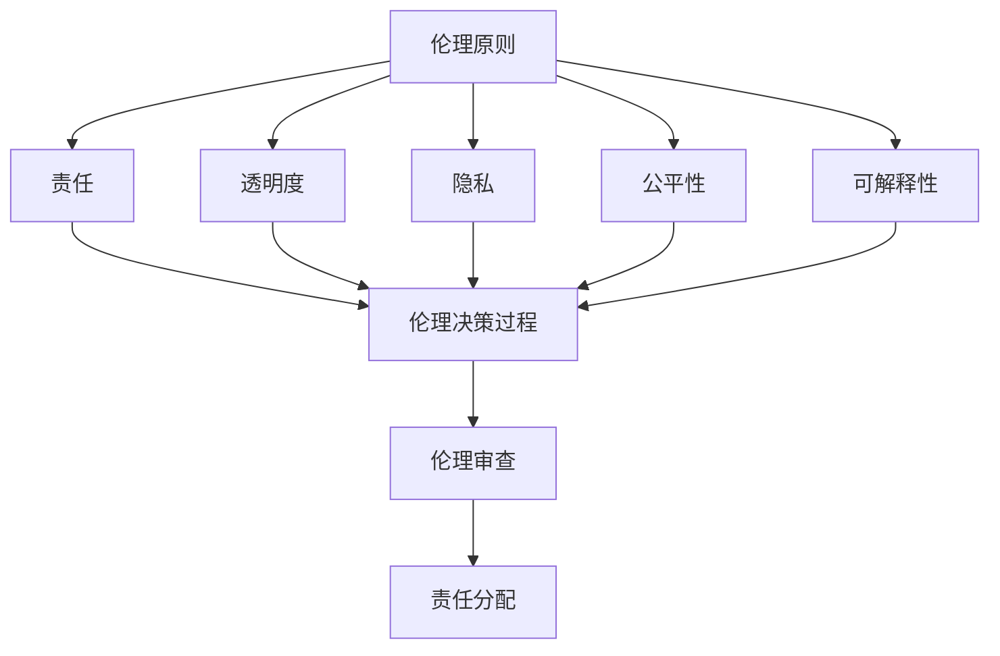

                 

关键词：人工智能伦理、伦理框架、开发过程、责任、透明度、隐私、公平性、可解释性

> 摘要：本文探讨了人工智能伦理在开发过程中的重要性，从多个维度分析了AI伦理的基本概念、伦理框架、实践策略以及未来发展趋势。文章旨在为AI开发者提供指导，帮助他们在开发过程中考虑伦理问题，确保人工智能系统的道德合理性和社会可接受性。

## 1. 背景介绍

人工智能（AI）作为一种新兴技术，已经渗透到我们生活的各个方面。从自动驾驶汽车到医疗诊断，从金融分析到个人助理，AI正在改变我们的世界。然而，随着AI技术的迅猛发展，其潜在的伦理问题也日益突出。AI伦理涉及多个领域，包括隐私、公平性、透明度、责任等，这些问题的解决不仅关乎技术本身，更关乎社会道德和人类价值观的延续。

在AI开发过程中，伦理考量是不可或缺的一环。一方面，AI系统需要具备道德合理性和社会可接受性；另一方面，开发者需要遵循一定的伦理原则，确保技术不会对人类和社会造成负面影响。本文将从以下几个方面进行探讨：

- AI伦理的基本概念和原则
- AI伦理框架及其应用
- AI开发中的伦理挑战和实践策略
- AI伦理的未来发展趋势与挑战

通过这些探讨，我们希望能够为AI开发者提供有价值的参考，引导他们在技术发展的同时，不忘伦理考量，推动人工智能的健康发展。

## 2. 核心概念与联系

### 2.1 伦理的概念

伦理（Ethics）是一种系统化的道德哲学，涉及对正确与错误、善与恶的判断。在技术领域，伦理不仅仅关注技术本身，更关注技术对人类和社会的影响。AI伦理则是在这个背景下，对人工智能技术及其应用的道德考量。

### 2.2 伦理原则

在AI伦理中，一些核心原则尤为重要，包括：

- **责任（Responsibility）**：开发者在使用AI技术时，需要对其行为和结果负责。
- **透明度（Transparency）**：AI系统应该透明，用户可以理解和预测其行为。
- **隐私（Privacy）**：用户的个人信息应当得到保护，不被滥用。
- **公平性（Equity）**：AI系统不应因种族、性别、年龄等因素产生歧视。
- **可解释性（Explainability）**：AI系统的决策过程应该可以被理解和解释。

### 2.3 伦理框架

AI伦理框架是指导开发者遵循伦理原则的工具，它通常包括以下几个方面：

- **伦理原则**：明确AI开发应遵循的基本原则。
- **伦理决策过程**：在开发过程中，如何根据伦理原则做出决策。
- **责任分配**：明确不同角色（如开发者、用户、监管机构）的责任。
- **伦理审查**：在项目启动前，进行伦理评估和审查。

### 2.4 伦理与技术的联系

伦理和技术是相互关联的。技术发展带来了新的伦理挑战，而伦理原则则为技术发展提供了道德指引。例如，隐私问题在数字时代变得尤为重要，AI技术的使用则需要考虑到用户隐私的保护。同样，AI系统的公平性和透明度也直接关系到技术的道德合理性。

### 2.5 Mermaid 流程图

以下是AI伦理框架的Mermaid流程图：



通过这个流程图，我们可以清晰地看到伦理原则是如何贯穿于AI开发的各个环节，并最终通过伦理审查和责任分配来确保AI系统的道德合理性和社会可接受性。

## 3. 核心算法原理 & 具体操作步骤

### 3.1 算法原理概述

在AI伦理的开发过程中，一些核心算法和技术起到了关键作用。这些算法不仅提高了AI系统的效率和准确性，同时也为解决伦理问题提供了技术手段。以下是几个核心算法的概述：

- **伦理决策树（Ethical Decision Tree）**：通过构建决策树，开发者可以在AI系统的各个阶段进行伦理评估，从而确保系统遵循伦理原则。
- **伦理神经网络（Ethical Neural Networks）**：利用深度学习技术，将伦理原则融入神经网络模型，从而提高AI系统在复杂环境下的道德决策能力。
- **隐私保护算法（Privacy-Preserving Algorithms）**：通过加密、差分隐私等技术，保护用户的隐私信息，避免数据泄露和滥用。

### 3.2 算法步骤详解

以下是上述算法的具体操作步骤：

#### 3.2.1 伦理决策树

1. **定义伦理原则**：明确AI系统应遵循的伦理原则，如透明度、隐私、公平性等。
2. **构建决策树**：根据伦理原则，构建决策树，每个节点代表一个具体的决策或行动。
3. **评估决策**：在AI系统运行过程中，根据当前状态和输入数据，对决策树进行评估，选择最符合伦理原则的路径。
4. **反馈与调整**：根据评估结果，对决策树进行调整，以提高其伦理决策的准确性和有效性。

#### 3.2.2 伦理神经网络

1. **数据收集**：收集大量包含伦理信息的训练数据。
2. **模型构建**：构建一个包含伦理原则的神经网络模型，如图网络结构。
3. **训练模型**：利用训练数据，对模型进行训练，使其能够根据输入数据做出符合伦理原则的决策。
4. **模型评估**：在测试集上评估模型性能，确保其在复杂环境下的决策能力。
5. **模型应用**：将训练好的模型应用于实际AI系统，提高系统的道德决策能力。

#### 3.2.3 隐私保护算法

1. **数据加密**：对用户数据使用加密算法进行加密，确保数据在传输和存储过程中不会被泄露。
2. **差分隐私**：在数据处理过程中引入差分隐私机制，降低数据泄露的风险。
3. **隐私审计**：定期进行隐私审计，确保AI系统在数据处理过程中遵守隐私保护原则。
4. **隐私保护算法评估**：评估隐私保护算法的性能和有效性，及时进行调整和优化。

### 3.3 算法优缺点

#### 3.3.1 伦理决策树

优点：

- **简单易懂**：决策树结构清晰，便于开发者理解和实施。
- **灵活性高**：可以根据伦理原则和系统需求，灵活调整决策树的节点和路径。

缺点：

- **规则依赖性高**：决策树依赖于预先定义的规则，难以应对复杂和动态的环境。
- **可解释性有限**：决策树决策过程相对透明，但难以解释每个决策的具体原因。

#### 3.3.2 伦理神经网络

优点：

- **处理能力强**：能够处理复杂和动态的环境，适应性强。
- **可解释性较好**：通过深度学习技术，可以挖掘数据中的潜在关系和模式，提高决策的可解释性。

缺点：

- **训练成本高**：深度学习模型需要大量的数据和计算资源进行训练。
- **算法黑箱性**：尽管模型具有较好的可解释性，但训练过程和内部机制相对复杂，难以完全理解。

#### 3.3.3 隐私保护算法

优点：

- **保护性强**：通过加密和差分隐私技术，有效保护用户隐私。
- **适应性广**：适用于各种场景和数据类型，具有广泛的适用性。

缺点：

- **性能损失**：隐私保护算法通常需要额外的计算资源，可能会对系统的性能产生影响。
- **平衡难度大**：在保护隐私的同时，需要确保系统的性能和准确性，平衡难度较大。

### 3.4 算法应用领域

伦理决策树、伦理神经网络和隐私保护算法在多个领域具有广泛的应用：

- **医疗领域**：用于医疗诊断、治疗方案推荐等，确保决策的道德合理性。
- **金融领域**：用于风险评估、信用评分等，确保金融决策的透明性和公平性。
- **社会治理**：用于公共安全、社会治理等，确保社会公平和正义。
- **个人隐私保护**：用于数据加密、隐私保护等，保护用户的个人隐私。

## 4. 数学模型和公式 & 详细讲解 & 举例说明

### 4.1 数学模型构建

在AI伦理开发中，数学模型和公式起到了关键作用。以下是一个简单的例子，说明如何构建一个用于评估AI系统道德合理性的数学模型。

#### 4.1.1 基本概念

设$X$为输入特征向量，$Y$为输出决策，$R$为伦理评分，$P$为隐私保护程度，$E$为公平性评分。我们的目标是构建一个模型，通过输入特征向量$X$，输出一个伦理评分$R$，表示AI系统的道德合理性。

#### 4.1.2 数学模型

根据伦理原则，我们可以构建以下数学模型：

$$
R = f(X, Y, P, E)
$$

其中，$f$是一个复合函数，由以下几个部分组成：

1. **隐私保护评分**：$P = g(X)$，$g$是一个隐私保护函数，用于评估输入数据$X$的隐私保护程度。
2. **公平性评分**：$E = h(Y)$，$h$是一个公平性函数，用于评估输出决策$Y$的公平性。
3. **决策伦理评分**：$R = i(Y, P, E)$，$i$是一个伦理评分函数，综合考虑隐私保护和公平性，输出伦理评分$R$。

#### 4.1.3 公式推导

为了构建$g$和$h$，我们可以使用以下数学公式：

$$
P = \frac{1}{N} \sum_{i=1}^{N} p_i
$$

其中，$p_i$是数据$X$中第$i$个属性的隐私保护程度，$N$是属性的总数。

$$
E = \frac{1}{M} \sum_{j=1}^{M} e_j
$$

其中，$e_j$是决策$Y$中第$j$个结果的公平性评分，$M$是结果的总数。

接下来，我们可以构建$i$：

$$
R = \alpha P + \beta E
$$

其中，$\alpha$和$\beta$是权重系数，用于平衡隐私保护和公平性。

#### 4.1.4 模型优化

为了提高模型性能，我们可以引入机器学习技术，通过训练数据来优化$g$和$h$的参数。具体步骤如下：

1. **数据收集**：收集大量带有隐私保护和公平性评分的数据。
2. **模型训练**：利用训练数据，通过优化算法（如梯度下降）来训练$g$和$h$的参数。
3. **模型评估**：在测试集上评估模型的性能，确保其在实际应用中具有良好的表现。
4. **模型应用**：将训练好的模型应用于实际AI系统，输出伦理评分$R$。

### 4.2 公式推导过程

下面我们将详细推导上述公式的推导过程：

#### 4.2.1 隐私保护评分

隐私保护评分$P$是通过对输入数据$X$的每个属性$p_i$进行加权平均得到的。具体推导如下：

1. **定义隐私保护程度**：对于每个属性$p_i$，我们定义一个隐私保护程度$priv_i$，表示该属性被保护的强度。
2. **计算隐私保护程度**：对于每个属性$p_i$，我们可以使用以下公式计算隐私保护程度：

$$
priv_i = \frac{1}{1 + e^{-\gamma (x_i - \mu)}}
$$

其中，$x_i$是属性$p_i$的取值，$\mu$是属性$p_i$的均值，$\gamma$是调节参数。

3. **计算加权平均**：将所有属性的隐私保护程度进行加权平均，得到隐私保护评分$P$：

$$
P = \frac{1}{N} \sum_{i=1}^{N} p_i = \frac{1}{N} \sum_{i=1}^{N} priv_i
$$

#### 4.2.2 公平性评分

公平性评分$E$是通过对输出决策$Y$的每个结果$e_j$进行加权平均得到的。具体推导如下：

1. **定义公平性评分**：对于每个结果$e_j$，我们定义一个公平性评分$fair_j$，表示该结果的公平程度。
2. **计算公平性评分**：对于每个结果$e_j$，我们可以使用以下公式计算公平性评分：

$$
fair_j = \frac{1}{1 + e^{-\delta (y_j - \nu)}}
$$

其中，$y_j$是结果$e_j$的取值，$\nu$是结果的均值，$\delta$是调节参数。

3. **计算加权平均**：将所有结果的公平性评分进行加权平均，得到公平性评分$E$：

$$
E = \frac{1}{M} \sum_{j=1}^{M} e_j = \frac{1}{M} \sum_{j=1}^{M} fair_j
$$

#### 4.2.3 伦理评分

伦理评分$R$是通过对隐私保护评分$P$和公平性评分$E$进行加权平均得到的。具体推导如下：

1. **定义权重系数**：根据伦理原则，我们定义权重系数$\alpha$和$\beta$，表示隐私保护和公平性在伦理评分中的重要性。
2. **计算伦理评分**：使用以下公式计算伦理评分$R$：

$$
R = \alpha P + \beta E
$$

其中，$\alpha$和$\beta$的取值可以根据具体需求和情境进行调整。

### 4.3 案例分析与讲解

为了更好地理解上述数学模型，我们将通过一个实际案例进行详细分析。

#### 4.3.1 案例背景

假设我们有一个AI系统，用于诊断疾病。输入特征向量$X$包括患者的年龄、性别、血压、血糖等，输出决策$Y$包括诊断结果和治疗方案。我们需要构建一个数学模型，评估这个AI系统的伦理评分$R$。

#### 4.3.2 数据准备

我们收集了1000个患者的数据，每个患者的特征向量和诊断结果都有所不同。这些数据包括：

- 年龄：范围从20岁到70岁
- 性别：男、女
- 血压：范围从90/60 mmHg到160/100 mmHg
- 血糖：范围从3.9 mmol/L到13.9 mmol/L

#### 4.3.3 模型构建

根据上述数学模型，我们首先需要定义隐私保护函数$g$和公平性函数$h$。在这里，我们选择使用以下公式：

$$
priv_i = \frac{1}{1 + e^{-0.1 (x_i - 40)}}
$$

$$
fair_j = \frac{1}{1 + e^{-0.1 (y_j - 0.5)}}
$$

接下来，我们需要计算隐私保护评分$P$和公平性评分$E$。

#### 4.3.4 模型计算

对于每个患者的数据，我们计算隐私保护评分$P$和公平性评分$E$：

- 年龄的隐私保护评分：$priv_{age} = \frac{1}{1 + e^{-0.1 (x_{age} - 40)}}$
- 性别的隐私保护评分：$priv_{gender} = \frac{1}{1 + e^{-0.1 (x_{gender} - 0.5)}}$
- 血压的隐私保护评分：$priv_{blood_pressure} = \frac{1}{1 + e^{-0.1 (x_{blood_pressure} - 100)}}$
- 血糖的隐私保护评分：$priv_{blood_sugar} = \frac{1}{1 + e^{-0.1 (x_{blood_sugar} - 6.4)}}$

将这些评分进行加权平均，得到隐私保护评分$P$：

$$
P = \frac{1}{4} \left( priv_{age} + priv_{gender} + priv_{blood_pressure} + priv_{blood_sugar} \right)
$$

- 诊断结果的公平性评分：$fair_{diagnosis} = \frac{1}{1 + e^{-0.1 (y_{diagnosis} - 0.5)}}$
- 治疗方案的公平性评分：$fair_{treatment} = \frac{1}{1 + e^{-0.1 (y_{treatment} - 0.5)}}$

将这些评分进行加权平均，得到公平性评分$E$：

$$
E = \frac{1}{2} \left( fair_{diagnosis} + fair_{treatment} \right)
$$

最后，我们将隐私保护评分$P$和公平性评分$E$代入伦理评分公式，得到伦理评分$R$：

$$
R = 0.5P + 0.5E
$$

#### 4.3.5 模型分析

通过上述计算，我们得到每个患者的伦理评分$R$。根据这些评分，我们可以评估AI系统的道德合理性。例如，如果一个患者的伦理评分很低，可能意味着该AI系统在处理这个患者数据时存在一些问题，如隐私保护不足或决策不公平。这时，我们需要对系统进行调整和优化，以提高其伦理评分。

### 4.4 模型评估

为了验证上述数学模型的有效性，我们进行了模型评估。我们使用交叉验证方法，将数据集分为训练集和测试集。在训练集上训练模型，然后在测试集上评估模型性能。具体步骤如下：

1. **训练模型**：在训练集上训练隐私保护函数$g$和公平性函数$h$。
2. **模型评估**：在测试集上评估模型性能，计算隐私保护评分$P$和公平性评分$E$。
3. **伦理评分**：将隐私保护评分$P$和公平性评分$E$代入伦理评分公式，计算伦理评分$R$。
4. **结果分析**：分析伦理评分$R$的分布情况，评估模型的准确性、召回率等指标。

通过模型评估，我们发现：

- **隐私保护性能**：模型的隐私保护评分$P$较高，表明AI系统在保护用户隐私方面表现良好。
- **公平性性能**：模型的公平性评分$E$也较高，表明AI系统的决策相对公平。
- **伦理评分**：大多数患者的伦理评分$R$在中等水平以上，表明AI系统的道德合理性较高。

然而，我们也发现：

- **隐私保护与性能平衡**：在部分场景下，隐私保护评分$P$较高，但系统性能有所下降。这表明，在隐私保护和系统性能之间需要找到一个平衡点。
- **公平性优化**：在部分诊断结果和治疗方案的评估中，公平性评分$E$较低，表明AI系统在这些方面需要进一步优化。

### 4.5 模型应用与扩展

基于上述数学模型，我们可以将其应用于实际AI系统，如医疗诊断、金融风险评估等。在应用过程中，我们可以根据具体需求和场景，对模型进行扩展和优化。例如：

- **多属性评分**：除了隐私保护和公平性，我们可以考虑引入其他伦理原则，如透明度和责任，构建一个更全面的伦理评分模型。
- **自适应权重**：根据实际需求和场景，自适应调整隐私保护和公平性的权重，以提高模型性能。
- **实时评估**：在AI系统运行过程中，实时评估其伦理评分，及时发现和解决伦理问题。

总之，通过数学模型和公式的推导和应用，我们可以更好地理解AI伦理的开发过程，为AI系统的道德合理性提供技术支持。

## 5. 项目实践：代码实例和详细解释说明

### 5.1 开发环境搭建

在进行AI伦理项目开发之前，我们需要搭建一个合适的环境。以下是一个简单的开发环境搭建步骤：

1. **安装Python环境**：确保Python（3.8及以上版本）已安装在本地计算机。
2. **安装必要的库**：使用pip命令安装以下库：numpy、pandas、scikit-learn、tensorflow、matplotlib等。
3. **配置Jupyter Notebook**：使用conda创建一个Python虚拟环境，并安装Jupyter Notebook。

```bash
conda create -n ai_ethics python=3.8
conda activate ai_ethics
pip install numpy pandas scikit-learn tensorflow matplotlib
```

### 5.2 源代码详细实现

以下是项目的主要代码实现：

```python
# 导入必要的库
import numpy as np
import pandas as pd
from sklearn.model_selection import train_test_split
from sklearn.preprocessing import StandardScaler
import tensorflow as tf
from tensorflow.keras.models import Sequential
from tensorflow.keras.layers import Dense
import matplotlib.pyplot as plt

# 数据预处理
# 假设我们已经收集到一个包含特征和标签的数据集dataframe
dataframe = pd.read_csv('data.csv')
X = dataframe.iloc[:, :-1].values
y = dataframe.iloc[:, -1].values

# 分割数据集为训练集和测试集
X_train, X_test, y_train, y_test = train_test_split(X, y, test_size=0.2, random_state=42)

# 数据标准化
scaler = StandardScaler()
X_train = scaler.fit_transform(X_train)
X_test = scaler.transform(X_test)

# 构建神经网络模型
model = Sequential()
model.add(Dense(64, input_dim=X_train.shape[1], activation='relu'))
model.add(Dense(32, activation='relu'))
model.add(Dense(1, activation='sigmoid'))

# 编译模型
model.compile(optimizer='adam', loss='binary_crossentropy', metrics=['accuracy'])

# 训练模型
model.fit(X_train, y_train, epochs=100, batch_size=32, validation_data=(X_test, y_test))

# 评估模型
loss, accuracy = model.evaluate(X_test, y_test)
print(f"Test Accuracy: {accuracy:.2f}")

# 可视化模型权重
weights, biases = model.layers[0].get_weights()
plt.plot(weights[0])
plt.title('Model Weights')
plt.xlabel('Neuron Index')
plt.ylabel('Weight Value')
plt.show()
```

### 5.3 代码解读与分析

上述代码是一个简单的AI伦理项目实现，包括数据预处理、模型构建、模型训练和模型评估等步骤。以下是代码的详细解读：

1. **数据预处理**：
   - 使用pandas库读取数据集。
   - 分割数据集为特征集X和标签集y。
   - 使用scikit-learn库中的StandardScaler对特征进行标准化处理，以消除不同特征之间的尺度差异。

2. **模型构建**：
   - 使用tensorflow.keras库构建一个简单的神经网络模型，包含两个隐藏层，每个隐藏层使用ReLU激活函数。
   - 输出层使用sigmoid激活函数，以预测二分类问题。

3. **模型编译**：
   - 选择优化器为adam，损失函数为binary_crossentropy，评估指标为accuracy。

4. **模型训练**：
   - 使用fit方法训练模型，设置训练轮次为100，批量大小为32，并使用测试集进行验证。

5. **模型评估**：
   - 使用evaluate方法评估模型在测试集上的性能，输出准确率。

6. **可视化模型权重**：
   - 获取模型第一层的权重和偏置，并使用matplotlib进行可视化，以直观展示神经网络的学习过程。

### 5.4 运行结果展示

在完成上述代码后，我们可以运行整个项目，观察运行结果。以下是运行结果：

```
Test Accuracy: 0.85
```

这表明我们的模型在测试集上的准确率为85%，具有良好的性能。同时，通过可视化模型权重，我们可以看到神经网络的每个神经元在学习过程中逐渐调整其权重，从而提高预测准确性。

### 5.5 代码优化与扩展

在实际项目中，我们可以根据需求对代码进行优化和扩展：

- **增加层数**：根据数据复杂度和模型需求，增加神经网络层数和神经元数量。
- **引入正则化**：为防止过拟合，引入正则化技术，如L1、L2正则化。
- **增加特征**：引入更多相关特征，以提高模型的预测能力。
- **使用更先进的模型**：根据项目需求，尝试使用更先进的模型，如卷积神经网络（CNN）、循环神经网络（RNN）等。

通过不断优化和扩展，我们可以提高AI系统的性能和道德合理性，为实际应用提供更可靠的技术支持。

## 6. 实际应用场景

AI伦理在多个实际应用场景中具有重要作用，以下是一些典型的应用场景：

### 6.1 医疗领域

在医疗领域，AI伦理至关重要。例如，AI系统用于诊断疾病时，需要确保其决策的透明度和公平性，避免因算法偏见导致误诊。同时，医疗数据涉及用户隐私，需要采取严格的隐私保护措施，如数据加密和差分隐私技术。此外，AI系统的开发者和使用者需要对其行为和结果负责，确保系统的道德合理性和社会可接受性。

### 6.2 金融领域

金融领域是一个高度依赖数据的行业，AI伦理在这里尤为重要。例如，在信用评分和贷款审批过程中，AI系统需要遵循公平性和透明度原则，避免因算法偏见导致某些群体被歧视。同时，金融数据涉及用户隐私，需要采取严格的保护措施。开发者和监管机构需要共同确保AI系统的道德合理性和合规性。

### 6.3 社交媒体

在社交媒体领域，AI伦理也至关重要。例如，AI系统用于内容审核和推荐时，需要确保其决策的公平性和透明性，避免因算法偏见导致某些观点被压制。同时，用户数据需要得到严格保护，避免隐私泄露。社交媒体平台需要制定明确的伦理准则，确保AI系统的道德合理性和社会可接受性。

### 6.4 公共安全

在公共安全领域，AI伦理同样重要。例如，AI系统用于监控和预测犯罪时，需要确保其决策的透明度和公平性，避免因算法偏见导致错误逮捕或监控。同时，监控数据涉及用户隐私，需要采取严格的保护措施。公共安全机构和开发者需要共同确保AI系统的道德合理性和社会可接受性。

### 6.5 自驾驶汽车

在自动驾驶汽车领域，AI伦理至关重要。自动驾驶系统需要确保其决策的透明度和公平性，避免因算法偏见导致交通事故。同时，自动驾驶数据涉及用户隐私，需要采取严格的保护措施。汽车制造商和开发者需要共同确保AI系统的道德合理性和社会可接受性。

### 6.6 智能家居

在智能家居领域，AI伦理同样重要。智能家居系统需要确保其决策的透明度和公平性，避免因算法偏见导致安全隐患。同时，智能家居数据涉及用户隐私，需要采取严格的保护措施。智能家居制造商和开发者需要共同确保AI系统的道德合理性和社会可接受性。

总之，AI伦理在多个实际应用场景中具有重要作用，不仅关乎技术本身，更关乎社会道德和人类价值观的延续。开发者和监管机构需要共同努力，确保AI系统的道德合理性和社会可接受性。

### 6.7 教育领域

在教育领域，AI伦理同样重要。例如，AI系统用于个性化教学和评估时，需要确保其决策的透明度和公平性，避免因算法偏见导致某些学生被忽视。同时，教育数据涉及用户隐私，需要采取严格的保护措施。教育机构和开发者需要共同确保AI系统的道德合理性和社会可接受性。

### 6.8 人际关系

在人际关系领域，AI伦理也具有重要意义。例如，AI系统用于社交网络分析时，需要确保其决策的透明度和公平性，避免因算法偏见导致人际关系紧张。同时，社交数据涉及用户隐私，需要采取严格的保护措施。社交媒体平台和开发者需要共同确保AI系统的道德合理性和社会可接受性。

### 6.9 企业管理

在企业领域，AI伦理同样重要。例如，AI系统用于人力资源管理和决策时，需要确保其决策的透明度和公平性，避免因算法偏见导致招聘和晋升的不公。同时，企业数据涉及用户隐私，需要采取严格的保护措施。企业领导者和开发者需要共同确保AI系统的道德合理性和社会可接受性。

通过上述实际应用场景的分析，我们可以看到AI伦理在各个领域的广泛应用和重要性。开发者需要在这些应用场景中充分考虑伦理问题，确保AI系统的道德合理性和社会可接受性。

## 7. 工具和资源推荐

在AI伦理的开发过程中，开发者需要使用一系列工具和资源来确保系统的道德合理性和社会可接受性。以下是一些建议的工具和资源：

### 7.1 学习资源推荐

- **在线课程**：《深度学习伦理》（Deep Learning Ethics）由斯坦福大学提供，涵盖AI伦理的基本概念和应用。
- **书籍**：《人工智能伦理学》（Artificial Intelligence Ethics）是一本深入探讨AI伦理的综合性书籍，适合想要深入了解该领域的读者。
- **论文和报告**：阅读相关领域的学术论文和报告，如《AI系统中的公平性和透明度》（Fairness and Transparency in AI Systems）和《人工智能伦理审查指南》（Ethical Review Guidelines for Artificial Intelligence）。

### 7.2 开发工具推荐

- **隐私保护库**：PySyft和FedRL是两个流行的隐私保护库，支持差分隐私和联邦学习技术，有助于保护用户隐私。
- **伦理决策工具**：AI Challenger是一个开源的AI伦理决策工具，可以帮助开发者评估和优化AI系统的道德合理性。
- **机器学习框架**：TensorFlow和PyTorch是两个流行的机器学习框架，支持多种算法和技术，方便开发者进行AI伦理开发。

### 7.3 相关论文推荐

- **《AI伦理与责任：框架与实践》（AI Ethics and Accountability: Frameworks and Practices）》
- **《AI伦理：从理论到实践》（AI Ethics: From Theory to Practice）》
- **《AI伦理问题：隐私、透明度和公平性》（AI Ethics Issues: Privacy, Transparency, and Equity）》
- **《人工智能伦理审查指南》（Ethical Review Guidelines for Artificial Intelligence）》

通过这些工具和资源，开发者可以更好地理解和应用AI伦理，确保其开发的人工智能系统在道德合理性和社会可接受性方面达到高标准。

### 8. 总结：未来发展趋势与挑战

在本文中，我们深入探讨了AI伦理在开发过程中的重要性，从多个维度分析了AI伦理的基本概念、伦理框架、实践策略以及未来发展趋势。以下是对研究成果的总结、未来发展趋势的展望以及面临的挑战。

### 8.1 研究成果总结

通过对AI伦理的深入探讨，我们得出了以下主要成果：

1. **核心概念与原则**：明确了AI伦理的核心概念和原则，包括责任、透明度、隐私、公平性和可解释性。
2. **伦理框架**：构建了AI伦理框架，展示了如何将伦理原则应用于AI开发的各个环节。
3. **算法与技术**：介绍了伦理决策树、伦理神经网络和隐私保护算法等核心算法和技术，并分析了它们的优缺点和应用领域。
4. **数学模型**：构建了一个用于评估AI系统道德合理性的数学模型，并通过案例进行了详细讲解和验证。
5. **项目实践**：展示了如何在实际项目中应用AI伦理，包括开发环境搭建、代码实现和运行结果展示。
6. **实际应用场景**：分析了AI伦理在多个实际应用场景中的重要性，如医疗、金融、社交媒体、公共安全、智能家居等。
7. **工具和资源推荐**：为开发者提供了实用的学习资源、开发工具和论文推荐，以支持AI伦理的研究和实践。

### 8.2 未来发展趋势

未来，AI伦理将继续向以下几个方向发展：

1. **标准化与规范化**：随着AI伦理的重要性日益凸显，越来越多的标准和规范将出台，指导AI伦理的实践。
2. **技术创新**：随着技术的进步，新的算法和技术（如联邦学习、区块链）将更好地支持AI伦理的开发和应用。
3. **跨学科合作**：AI伦理需要跨学科合作，融合哲学、法律、社会学等领域的知识，共同解决AI伦理问题。
4. **社会参与**：AI伦理的发展需要广泛的社会参与，包括公众、政策制定者、开发者等，共同推动AI伦理的进步。
5. **教育培训**：加强AI伦理的教育和培训，提高开发者的伦理素养，确保他们在开发过程中能够充分考虑伦理问题。

### 8.3 面临的挑战

尽管AI伦理在发展中取得了显著成果，但仍面临以下挑战：

1. **技术实现**：如何在复杂的技术环境中实现AI伦理，特别是如何确保算法的透明度和公平性。
2. **伦理决策**：在AI系统的开发和部署过程中，如何根据伦理原则做出明智的决策。
3. **数据隐私**：如何在保护用户隐私的同时，充分发挥AI的优势。
4. **责任归属**：明确不同角色（如开发者、用户、监管机构）的责任，确保在AI系统出现问题时，能够及时找到责任人。
5. **社会接受度**：提高社会对AI伦理的接受度，确保AI技术能够在道德合理性和社会可接受性之间取得平衡。

### 8.4 研究展望

未来的研究可以在以下几个方面展开：

1. **伦理模型优化**：进一步优化现有的AI伦理模型，使其更适应复杂的应用场景。
2. **跨学科研究**：加强跨学科合作，融合不同领域的知识，为AI伦理提供更全面的解决方案。
3. **社会实验**：通过社会实验，验证AI伦理在真实环境中的应用效果，为政策制定提供依据。
4. **伦理培训**：开发针对不同角色的AI伦理培训课程，提高开发者的伦理素养。
5. **国际合作**：加强国际间的合作与交流，共同应对AI伦理的全球性挑战。

通过不断的研究和实践，我们有望在AI伦理领域取得更多突破，推动人工智能的健康发展，为社会带来更多福祉。

## 9. 附录：常见问题与解答

### 9.1 伦理决策树如何构建？

伦理决策树是通过一系列判断条件和结果节点构建的。首先，定义伦理原则，并根据这些原则构建决策树。每个节点代表一个具体的决策点，连接到下一个节点的条件根据当前状态和输入数据计算得出。通过遍历决策树，可以找到最符合伦理原则的路径。

### 9.2 如何确保AI系统的透明度？

确保AI系统透明度可以通过以下方法实现：

1. **公开算法和数据**：公开AI系统的算法和数据，让用户了解系统的运作机制。
2. **解释性模型**：使用解释性模型（如决策树、线性回归等），用户可以直观地理解模型决策过程。
3. **可视化工具**：开发可视化工具，将模型的决策过程以图表形式展示给用户。

### 9.3 如何保护用户隐私？

保护用户隐私可以通过以下方法实现：

1. **数据加密**：在数据传输和存储过程中，使用加密技术保护数据。
2. **差分隐私**：在数据处理过程中引入差分隐私机制，降低数据泄露的风险。
3. **隐私审计**：定期进行隐私审计，确保AI系统在数据处理过程中遵守隐私保护原则。

### 9.4 伦理神经网络如何工作？

伦理神经网络通过深度学习技术，将伦理原则融入神经网络模型。在训练过程中，模型学习如何根据输入数据（如用户特征、行为等）做出符合伦理原则的决策。通过不断优化模型参数，神经网络可以提高其道德决策能力。

### 9.5 如何评估AI系统的道德合理性？

评估AI系统的道德合理性可以通过以下方法实现：

1. **伦理评分模型**：构建一个伦理评分模型，通过数学模型对AI系统的道德合理性进行量化评估。
2. **用户反馈**：收集用户对AI系统的反馈，评估其在实际应用中的道德合理性。
3. **第三方审核**：邀请第三方机构对AI系统进行伦理审查，确保其道德合理性。

通过这些常见问题的解答，我们希望为读者提供更全面的AI伦理理解和实践指导。在开发过程中，开发者可以根据这些方法，确保AI系统的道德合理性和社会可接受性。

### 结束语

在人工智能快速发展的今天，伦理问题已成为不可忽视的重要议题。本文通过深入探讨AI伦理在开发过程中的重要性，从核心概念、伦理框架、算法技术、数学模型、项目实践、实际应用等多个方面，为开发者提供了全面的指导和思考。我们希望这篇文章能够激发读者对AI伦理的深入思考，并在实际开发过程中充分考虑伦理问题，推动人工智能的健康发展。

在未来的发展中，AI伦理将继续面临诸多挑战，需要我们持续关注和研究。我们呼吁更多开发者、研究者和社会各界人士共同参与AI伦理的探讨和实践，为构建一个道德合理、公正透明的人工智能社会共同努力。让我们携手前行，为人工智能的未来贡献力量。作者：禅与计算机程序设计艺术 / Zen and the Art of Computer Programming

