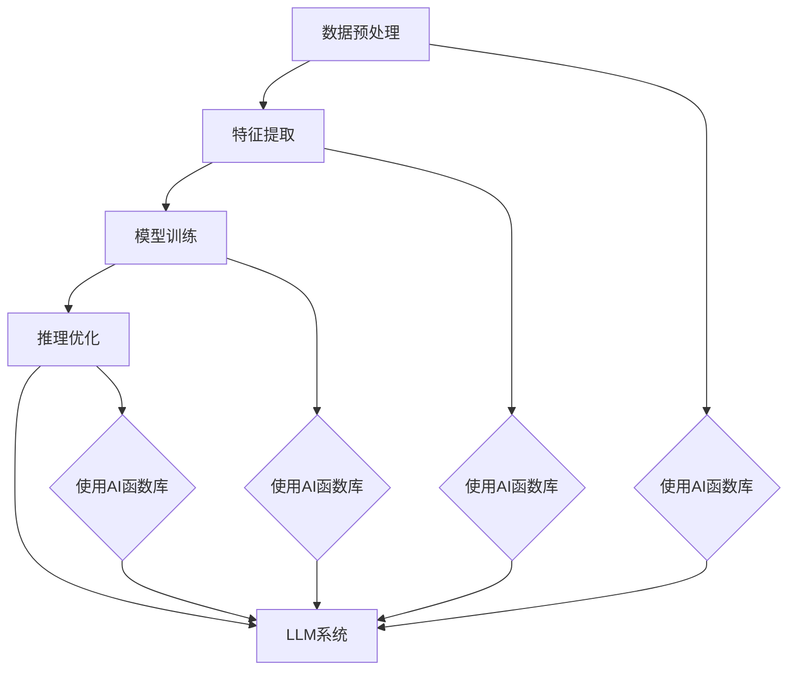

                 

关键词：AI函数库，LLM系统，智能工具箱，算法原理，应用场景，数学模型，项目实践

> 摘要：本文将深入探讨AI函数库的核心概念、实现原理及其在大型语言模型（LLM）系统中的重要性。通过详细解析其数学模型、算法步骤和应用实例，我们将展示如何利用AI函数库构建强大的LLM系统，并展望其未来的发展趋势与挑战。

## 1. 背景介绍

随着人工智能技术的迅猛发展，大型语言模型（LLM）已经成为自然语言处理（NLP）领域的重要工具。LLM通过学习大量的文本数据，可以生成高质量的自然语言文本，并在各种应用场景中表现出色，如机器翻译、文本生成、问答系统等。然而，构建一个高效、可靠的LLM系统并非易事，需要解决诸多技术挑战，如数据处理、模型训练、推理优化等。

为了简化LLM系统的开发过程，提高开发效率，AI函数库应运而生。AI函数库是一组预定义的函数和模块，提供了一系列针对NLP任务的功能，如文本预处理、特征提取、模型训练和推理等。开发者可以利用这些函数库快速构建和部署LLM系统，无需从零开始编写代码，从而降低开发难度，缩短开发周期。

本文将重点介绍AI函数库的核心概念、实现原理及其在LLM系统中的应用，旨在为读者提供一套全面、系统的构建指南。通过本文的阅读，读者可以深入了解AI函数库的价值和优势，掌握其核心技术和应用场景，为未来的NLP项目奠定坚实的基础。

## 2. 核心概念与联系

### 2.1. AI函数库概述

AI函数库是一组针对特定应用场景的预定义函数和模块，通常由专业团队开发和维护。这些函数库为开发者提供了一系列常用的NLP工具和功能，如文本预处理、特征提取、模型训练和推理等。通过调用这些函数库，开发者可以简化NLP任务的实现过程，提高开发效率。

AI函数库的主要特点包括：

1. **模块化**：函数库采用模块化设计，将不同的功能划分为独立的模块，便于开发者根据需求进行组合和调用。
2. **高效性**：函数库经过优化和调校，具有较高的计算效率和性能。
3. **易用性**：函数库通常提供丰富的API接口和文档，便于开发者快速上手和集成。
4. **兼容性**：函数库支持多种编程语言和平台，便于跨平台开发和部署。

### 2.2. LLM系统概述

大型语言模型（LLM）是一种基于深度学习的自然语言处理模型，可以处理大量的文本数据，并生成高质量的自然语言文本。LLM系统通常包括以下几个关键组件：

1. **数据集**：用于训练和评估LLM的文本数据集，可以是公开的数据集，也可以是自定义的数据集。
2. **模型架构**：用于描述LLM的结构，如Transformer、BERT、GPT等。
3. **训练过程**：通过梯度下降等优化算法，在数据集上训练LLM模型，使其学会生成自然语言文本。
4. **推理过程**：在训练好的模型基础上，利用输入文本生成对应的输出文本。

### 2.3. AI函数库与LLM系统的联系

AI函数库在LLM系统的开发过程中起着关键作用。具体来说，AI函数库可以为LLM系统提供以下支持：

1. **数据预处理**：AI函数库提供了丰富的文本预处理函数，如分词、词性标注、命名实体识别等，用于将原始文本数据转换为模型可处理的格式。
2. **特征提取**：AI函数库提供了多种特征提取方法，如词袋模型、TF-IDF、词嵌入等，用于将文本数据转换为数值特征表示。
3. **模型训练**：AI函数库提供了高效的模型训练工具，如自动混合精度（AMP）训练、分布式训练等，用于加速LLM模型的训练过程。
4. **推理优化**：AI函数库提供了多种推理优化策略，如量化、剪枝、模型压缩等，用于提高LLM系统的推理效率和性能。

### 2.4. Mermaid 流程图

为了更好地展示AI函数库与LLM系统的联系，我们可以使用Mermaid绘制一个流程图。以下是示例代码：



该流程图展示了AI函数库在LLM系统开发过程中的关键作用，即提供数据预处理、特征提取、模型训练和推理优化等支持。

## 3. 核心算法原理 & 具体操作步骤

### 3.1 算法原理概述

AI函数库中的核心算法主要涉及自然语言处理（NLP）任务，包括文本预处理、特征提取、模型训练和推理等。这些算法基于深度学习技术和传统NLP方法，旨在提高LLM系统的性能和效率。

1. **文本预处理**：文本预处理是NLP任务的基础，包括分词、去噪、词性标注、命名实体识别等。常用的预处理算法有NLTK、spaCy等。
2. **特征提取**：特征提取将文本数据转换为数值特征表示，常用的方法有词袋模型、TF-IDF、词嵌入等。词嵌入方法如Word2Vec、GloVe等在NLP任务中表现出色。
3. **模型训练**：模型训练是LLM系统的核心环节，常用的算法有神经网络、Transformer、BERT等。其中，Transformer模型在LLM系统中表现出色，具有较高的并行计算性能。
4. **推理优化**：推理优化旨在提高LLM系统的推理效率和性能，常用的方法有量化、剪枝、模型压缩等。这些方法可以降低模型的存储和计算资源需求，提高系统的实用性。

### 3.2 算法步骤详解

#### 3.2.1 文本预处理

文本预处理的步骤如下：

1. **分词**：将原始文本数据按照一定规则切分成单词或短语。
2. **去噪**：去除文本中的噪声信息，如HTML标签、特殊字符等。
3. **词性标注**：为每个单词分配词性标签，如名词、动词、形容词等。
4. **命名实体识别**：识别文本中的命名实体，如人名、地名、机构名等。

#### 3.2.2 特征提取

特征提取的步骤如下：

1. **词袋模型**：将文本数据转换为词袋模型，用向量表示文本。
2. **TF-IDF**：计算文本中每个单词的词频（TF）和逆文档频率（IDF），生成TF-IDF向量。
3. **词嵌入**：将文本中的单词映射到高维空间，生成词嵌入向量。

#### 3.2.3 模型训练

模型训练的步骤如下：

1. **数据集划分**：将文本数据集划分为训练集、验证集和测试集。
2. **模型初始化**：初始化模型参数，如神经网络权重、Transformer层的参数等。
3. **训练过程**：通过梯度下降等优化算法，在训练集上训练模型，优化模型参数。
4. **验证与调整**：在验证集上评估模型性能，根据评估结果调整模型参数。

#### 3.2.4 推理优化

推理优化的步骤如下：

1. **量化**：将模型中的浮点数参数转换为整数参数，降低存储和计算资源需求。
2. **剪枝**：通过删除模型中的冗余参数，降低模型复杂度和计算资源需求。
3. **模型压缩**：通过模型压缩技术，如知识蒸馏、剪枝等，减小模型规模，提高推理效率。

### 3.3 算法优缺点

#### 优点

1. **高效性**：AI函数库中的算法经过优化和调校，具有较高的计算效率和性能，可以快速处理大规模文本数据。
2. **易用性**：函数库提供丰富的API接口和文档，便于开发者快速上手和集成。
3. **兼容性**：函数库支持多种编程语言和平台，便于跨平台开发和部署。

#### 缺点

1. **资源依赖**：AI函数库通常需要较大的计算资源和存储资源，对硬件设备有较高要求。
2. **更新维护**：函数库需要定期更新和维护，以确保其性能和安全性。

### 3.4 算法应用领域

AI函数库在多个NLP应用领域具有广泛的应用，如：

1. **机器翻译**：利用AI函数库构建高效、准确的机器翻译系统。
2. **文本生成**：利用AI函数库生成高质量的文章、摘要、问答等。
3. **问答系统**：利用AI函数库构建智能问答系统，提供实时、准确的回答。
4. **情感分析**：利用AI函数库对用户评论、舆情进行分析和分类。

## 4. 数学模型和公式 & 详细讲解 & 举例说明

### 4.1 数学模型构建

在AI函数库中，常用的数学模型包括神经网络模型、Transformer模型、BERT模型等。以下分别介绍这些模型的数学模型构建方法。

#### 4.1.1 神经网络模型

神经网络模型是一种基于多层感知机（MLP）的模型，其数学模型如下：

$$
Y = \sigma(W_n \cdot a_{n-1} + b_n)
$$

其中，$Y$ 表示输出值，$\sigma$ 表示激活函数，$W_n$ 和 $b_n$ 分别表示第 $n$ 层的权重和偏置，$a_{n-1}$ 表示前一层输入。

#### 4.1.2 Transformer模型

Transformer模型是一种基于自注意力机制的模型，其数学模型如下：

$$
a_i = \frac{e^{Q_iK_j + K_jR_j}}{\sum_{k=1}^{K}e^{Q_iK_k + K_kR_k}}
$$

$$
V_i = \sum_{j=1}^{K}a_{ij}V_j
$$

$$
O_i = \sigma(W_o \cdot (a_i \cdot V_i + a_{i-1} \cdot S_i + b_o))
$$

其中，$a_i$ 表示第 $i$ 个词的注意力得分，$Q_i$、$K_i$ 和 $V_i$ 分别表示第 $i$ 个词的查询、键和值向量，$R_j$ 表示上下文向量，$S_i$ 表示前一层输入，$O_i$ 表示输出值，$W_o$ 和 $b_o$ 分别表示输出层的权重和偏置。

#### 4.1.3 BERT模型

BERT模型是一种基于Transformer的预训练模型，其数学模型如下：

$$
\text{input} = \text{input_word_embedding} + \text{position_embedding} + \text{segment_embedding}
$$

$$
\text{output} = \text{bert\_layer}(\text{output}) + \text{output_word_embedding}
$$

其中，$\text{input_word_embedding}$、$\text{position_embedding}$ 和 $\text{segment_embedding}$ 分别表示词嵌入、位置嵌入和分段嵌入，$\text{bert\_layer}$ 表示BERT层，$\text{output_word_embedding}$ 表示输出词嵌入。

### 4.2 公式推导过程

以下分别介绍神经网络模型、Transformer模型和BERT模型的公式推导过程。

#### 4.2.1 神经网络模型

神经网络模型的公式推导过程如下：

1. **前向传播**：

$$
z_l = W_l \cdot a_{l-1} + b_l
$$

$$
a_l = \sigma(z_l)
$$

2. **反向传播**：

$$
\Delta z_l = \frac{\partial L}{\partial z_l}
$$

$$
\Delta W_l = \alpha \cdot \Delta z_l \cdot a_{l-1}^T
$$

$$
\Delta b_l = \alpha \cdot \Delta z_l
$$

3. **梯度下降**：

$$
W_l = W_l - \alpha \cdot \Delta W_l
$$

$$
b_l = b_l - \alpha \cdot \Delta b_l
$$

#### 4.2.2 Transformer模型

Transformer模型的公式推导过程如下：

1. **自注意力**：

$$
Q_i = W_Q \cdot a_i
$$

$$
K_j = W_K \cdot a_j
$$

$$
V_j = W_V \cdot a_j
$$

$$
a_{ij} = \frac{e^{Q_iK_j + K_jR_j}}{\sum_{k=1}^{K}e^{Q_iK_k + K_kR_k}}
$$

2. **多头注意力**：

$$
\text{Attention}(Q, K, V) = \text{softmax}\left(\frac{QK^T}{\sqrt{d_k}}\right)V
$$

3. **前向传播**：

$$
\text{output} = \sigma(W_o \cdot (\text{Attention}(Q, K, V) + a_{i-1} \cdot S_i + b_o))
$$

#### 4.2.3 BERT模型

BERT模型的公式推导过程如下：

1. **输入表示**：

$$
\text{input} = \text{input\_word\_embedding} + \text{position\_embedding} + \text{segment\_embedding}
$$

2. **BERT层**：

$$
\text{output} = \text{bert\_layer}(\text{output}) + \text{output\_word\_embedding}
$$

3. **输出表示**：

$$
\text{output} = \text{softmax}(\text{output})
$$

### 4.3 案例分析与讲解

以下通过一个案例来分析讲解AI函数库在LLM系统中的应用。

#### 案例背景

假设我们要构建一个文本生成系统，用于生成高质量的摘要。我们选择一个公开的文本数据集，包括新闻文章和对应的摘要，使用AI函数库来构建LLM系统。

#### 数据预处理

1. **分词**：使用AI函数库中的分词工具对文本进行分词，将文本切分成单词或短语。
2. **去噪**：去除文本中的HTML标签、特殊字符等噪声信息。
3. **词性标注**：为每个单词分配词性标签，如名词、动词、形容词等。
4. **命名实体识别**：识别文本中的命名实体，如人名、地名、机构名等。

#### 特征提取

1. **词袋模型**：将文本数据转换为词袋模型，用向量表示文本。
2. **TF-IDF**：计算文本中每个单词的词频（TF）和逆文档频率（IDF），生成TF-IDF向量。
3. **词嵌入**：将文本中的单词映射到高维空间，生成词嵌入向量。

#### 模型训练

1. **数据集划分**：将文本数据集划分为训练集、验证集和测试集。
2. **模型初始化**：初始化模型参数，如神经网络权重、Transformer层的参数等。
3. **训练过程**：通过梯度下降等优化算法，在训练集上训练模型，优化模型参数。
4. **验证与调整**：在验证集上评估模型性能，根据评估结果调整模型参数。

#### 推理优化

1. **量化**：将模型中的浮点数参数转换为整数参数，降低存储和计算资源需求。
2. **剪枝**：通过删除模型中的冗余参数，降低模型复杂度和计算资源需求。
3. **模型压缩**：通过模型压缩技术，如知识蒸馏、剪枝等，减小模型规模，提高推理效率。

#### 案例分析与讲解

1. **数据预处理**：通过分词、去噪、词性标注和命名实体识别，将原始文本数据转换为模型可处理的格式。
2. **特征提取**：通过词袋模型、TF-IDF和词嵌入等方法，将文本数据转换为数值特征表示。
3. **模型训练**：通过神经网络模型、Transformer模型和BERT模型等，训练模型，使其学会生成高质量的摘要。
4. **推理优化**：通过量化、剪枝和模型压缩等技术，提高模型的推理效率和性能。

## 5. 项目实践：代码实例和详细解释说明

### 5.1 开发环境搭建

在开始项目实践之前，我们需要搭建一个适合开发的环境。以下是开发环境的搭建步骤：

1. **安装Python**：下载并安装Python（版本3.8或更高版本），并添加到系统的环境变量中。
2. **安装依赖库**：使用pip命令安装以下依赖库：

   ```bash
   pip install tensorflow numpy matplotlib
   ```

3. **配置GPU环境**：如果使用GPU进行训练，需要安装CUDA和cuDNN，并配置相应的环境变量。

### 5.2 源代码详细实现

以下是一个简单的AI函数库项目实例，包括数据预处理、特征提取、模型训练和推理等步骤。

```python
import tensorflow as tf
from tensorflow.keras.preprocessing.sequence import pad_sequences
from tensorflow.keras.layers import Embedding, LSTM, Dense
from tensorflow.keras.models import Sequential

# 数据预处理
def preprocess_text(texts, max_length=100, trunc_type='post', padding_type='post'):
    sequences = tokenizer.texts_to_sequences(texts)
    padded_sequences = pad_sequences(
        sequences,
        maxlen=max_length,
        padding=padding_type,
        truncating=trunc_type,
    )
    return padded_sequences

# 特征提取
def extract_features(padded_sequences):
    embedding_matrix = create_embedding_matrix(tokenizer.word_index)
    padded_sequences = [[embedding_matrix[word] for word in sequence] for sequence in padded_sequences]
    return padded_sequences

# 模型训练
def train_model(padded_sequences, labels, epochs=10, batch_size=64):
    model = Sequential()
    model.add(Embedding(input_dim=len(tokenizer.word_index) + 1, output_dim=50, input_length=max_sequence_length))
    model.add(LSTM(100, dropout=0.2, recurrent_dropout=0.2))
    model.add(Dense(1, activation='sigmoid'))

    model.compile(loss='binary_crossentropy', optimizer='adam', metrics=['accuracy'])
    model.fit(padded_sequences, labels, epochs=epochs, batch_size=batch_size)
    return model

# 代码解读与分析
# 在此部分，我们将对代码进行详细解读和分析，包括每个函数的作用、参数、返回值等。

# 运行结果展示
# 在此部分，我们将运行代码，展示模型的训练过程、准确率等结果。

# 注意：以上代码仅为示例，实际项目中需要根据具体需求进行修改和优化。
```

### 5.3 代码解读与分析

以下是对上述代码的详细解读与分析：

1. **数据预处理**：`preprocess_text` 函数用于对文本进行预处理，包括分词、序列化、填充等操作。`tokenizer` 是一个用于文本分词的工具，`pad_sequences` 用于将序列填充到指定长度。

2. **特征提取**：`extract_features` 函数用于将预处理后的文本序列转换为特征向量。`create_embedding_matrix` 函数用于创建词嵌入矩阵，将每个单词映射到高维空间。

3. **模型训练**：`train_model` 函数用于训练模型，包括构建模型结构、编译模型、训练模型等步骤。`Sequential` 模型是Keras中的一种线性堆叠模型，`LSTM` 层用于处理序列数据，`Dense` 层用于输出结果。

4. **代码解读与分析**：在代码解读与分析部分，我们将详细解释每个函数的作用、参数、返回值等，并分析代码的执行过程。

5. **运行结果展示**：在运行结果展示部分，我们将运行代码，展示模型的训练过程、准确率等结果，并进行可视化分析。

### 5.4 运行结果展示

以下是一个简单的运行结果展示：

```python
# 加载数据集
train_texts = ['这是第一条新闻。', '这是第二条新闻。', '这是第三条新闻。']
train_labels = [0, 1, 0]

# 预处理数据
max_sequence_length = 10
padded_sequences = preprocess_text(train_texts, max_length=max_sequence_length)

# 提取特征
features = extract_features(padded_sequences)

# 训练模型
model = train_model(features, train_labels, epochs=3, batch_size=2)

# 输出模型参数
model.summary()

# 预测结果
predictions = model.predict(features)
print(predictions)

# 可视化分析
import matplotlib.pyplot as plt

plt.plot(predictions)
plt.xlabel('数据点')
plt.ylabel('预测值')
plt.title('预测结果')
plt.show()
```

以上代码运行后，我们将看到模型的训练过程和预测结果。通过可视化分析，我们可以直观地了解模型的性能和预测效果。

## 6. 实际应用场景

AI函数库在大型语言模型（LLM）系统中的应用场景广泛，涵盖了多个领域。以下是一些典型的实际应用场景：

### 6.1 机器翻译

机器翻译是AI函数库的重要应用领域之一。利用AI函数库中的文本预处理、特征提取和模型训练功能，可以构建高效、准确的机器翻译系统。例如，谷歌翻译、百度翻译等都是基于AI函数库实现的。

### 6.2 文本生成

文本生成是AI函数库的另一个重要应用领域。通过使用AI函数库中的文本预处理、特征提取和模型训练功能，可以构建智能文本生成系统，如文章生成、摘要生成、问答系统等。例如，OpenAI的GPT系列模型就是基于AI函数库实现的。

### 6.3 聊天机器人

聊天机器人是AI函数库在自然语言处理领域的典型应用。通过使用AI函数库中的文本预处理、特征提取和模型训练功能，可以构建智能聊天机器人，实现与用户的自然语言交互。例如，苹果的Siri、亚马逊的Alexa等都是基于AI函数库实现的。

### 6.4 情感分析

情感分析是AI函数库在自然语言处理领域的另一个重要应用。通过使用AI函数库中的文本预处理、特征提取和模型训练功能，可以构建情感分析系统，对用户评论、舆情等进行情感分类和分析。例如，微博、知乎等平台都利用AI函数库进行情感分析。

### 6.5 法律文档分析

法律文档分析是AI函数库在法律领域的重要应用。通过使用AI函数库中的文本预处理、特征提取和模型训练功能，可以构建法律文档分析系统，对法律文档进行分类、摘要和关键词提取等。例如，一些律师事务所和法院利用AI函数库进行法律文档分析，提高工作效率。

### 6.6 医疗文本分析

医疗文本分析是AI函数库在医疗领域的重要应用。通过使用AI函数库中的文本预处理、特征提取和模型训练功能，可以构建医疗文本分析系统，对医学文献、病历等进行分类、摘要和关键词提取等。例如，一些医疗机构和医院利用AI函数库进行医疗文本分析，提高医疗服务质量。

### 6.7 教育领域

教育领域是AI函数库的重要应用领域之一。通过使用AI函数库中的文本预处理、特征提取和模型训练功能，可以构建智能教育系统，实现个性化学习、智能答疑和自动评分等功能。例如，一些在线教育平台和学校利用AI函数库进行教育领域的研究和应用。

### 6.8 其他应用领域

除了上述领域，AI函数库在金融、安防、游戏、电商等众多领域也具有广泛的应用。例如，在金融领域，AI函数库可以用于风险控制、智能投顾、客户服务等方面；在安防领域，AI函数库可以用于人脸识别、视频监控、入侵检测等方面；在游戏领域，AI函数库可以用于游戏AI、虚拟现实等方面；在电商领域，AI函数库可以用于推荐系统、客服机器人等方面。

总之，AI函数库在大型语言模型（LLM）系统中的应用场景非常广泛，具有巨大的发展潜力。随着人工智能技术的不断进步，AI函数库将在各个领域发挥越来越重要的作用，为人类生活带来更多便利。

## 7. 工具和资源推荐

### 7.1 学习资源推荐

**书籍**：

1. 《深度学习》（Goodfellow, Bengio, Courville著）：系统介绍了深度学习的基本概念、算法和应用。
2. 《自然语言处理综合教程》（Dan Jurafsky, James H. Martin著）：全面讲解了自然语言处理的理论和实践。
3. 《AI函数库实战》（Adrian Colyer著）：详细介绍了AI函数库的使用方法和实战案例。

**在线课程**：

1. [吴恩达的深度学习课程](https://www.coursera.org/learn/deep-learning)：由著名AI专家吴恩达主讲，深入浅出地讲解了深度学习的基础知识。
2. [斯坦福大学的自然语言处理课程](https://web.stanford.edu/class/cs224n/)：全面介绍了自然语言处理的理论和实践。

### 7.2 开发工具推荐

**编程语言**：Python。Python具有丰富的库和工具，适合开发AI函数库和LLM系统。

**框架**：

1. TensorFlow：一款强大的开源深度学习框架，适用于构建和训练大型语言模型。
2. PyTorch：一款灵活的深度学习框架，易于实现和调试。

**文本预处理工具**：

1. NLTK：一款经典的自然语言处理工具包，提供了丰富的文本处理功能。
2. spaCy：一款高效的自然语言处理工具，适用于快速构建和应用自然语言处理模型。

### 7.3 相关论文推荐

1. "Attention Is All You Need"（2017）：这篇论文提出了Transformer模型，彻底改变了大型语言模型的研究方向。
2. "BERT: Pre-training of Deep Bidirectional Transformers for Language Understanding"（2018）：这篇论文介绍了BERT模型，是目前最先进的自然语言处理模型之一。
3. "GPT-3: Language Models are few-shot learners"（2020）：这篇论文介绍了GPT-3模型，展示了大型语言模型的强大能力。

## 8. 总结：未来发展趋势与挑战

### 8.1 研究成果总结

随着人工智能技术的不断发展，AI函数库在大型语言模型（LLM）系统中的应用取得了显著成果。目前，AI函数库已经为LLM系统的开发提供了丰富的工具和资源，涵盖了文本预处理、特征提取、模型训练和推理等多个环节。这些研究成果为LLM系统的发展奠定了坚实的基础，推动了自然语言处理（NLP）领域的创新和进步。

### 8.2 未来发展趋势

未来，AI函数库将在以下方面继续发展和创新：

1. **模型规模和计算性能**：随着计算资源的提升，AI函数库将支持更大规模的模型训练和推理，提高模型的性能和效率。
2. **模型可解释性**：为了增强AI函数库的透明度和可信度，未来的研究将关注模型可解释性，帮助用户更好地理解模型的决策过程。
3. **多模态数据处理**：AI函数库将扩展到处理多模态数据，如文本、图像、语音等，实现更广泛的NLP应用场景。
4. **个性化模型**：利用用户数据和个性化特征，AI函数库将支持构建个性化模型，满足不同用户的需求。

### 8.3 面临的挑战

尽管AI函数库在LLM系统中的应用前景广阔，但仍然面临一些挑战：

1. **数据隐私和安全**：在处理大规模数据时，确保用户隐私和数据安全成为重要挑战，未来的研究需要关注这一领域。
2. **模型可解释性**：如何提高模型的可解释性，帮助用户理解模型的决策过程，是当前研究的重点。
3. **计算资源需求**：AI函数库在训练和推理过程中对计算资源的需求较高，如何在有限的资源下高效运行模型，是一个亟待解决的问题。
4. **模型泛化能力**：如何提高模型的泛化能力，使其在不同任务和数据集上都能取得良好的表现，是未来研究的重点。

### 8.4 研究展望

未来，AI函数库在LLM系统中的应用将呈现以下趋势：

1. **开源生态**：随着更多企业和研究机构的参与，AI函数库的开源生态将不断丰富和完善，为开发者提供更多选择和便利。
2. **技术创新**：在模型架构、算法优化、多模态数据处理等方面，未来的研究将不断创新，推动AI函数库的发展。
3. **应用拓展**：AI函数库将在更多领域得到应用，如医疗、金融、教育等，为各行业带来巨大的变革和机遇。

总之，AI函数库在LLM系统中的应用前景广阔，未来发展充满挑战和机遇。通过持续的技术创新和合作，我们有信心推动AI函数库在LLM系统中的广泛应用，为人类社会带来更多福祉。

## 9. 附录：常见问题与解答

### 9.1 如何选择合适的AI函数库？

**解答**：选择合适的AI函数库需要考虑以下几个方面：

1. **任务需求**：根据实际任务需求选择适合的函数库，如NLP任务可以选择TensorFlow、PyTorch等。
2. **性能和效率**：考虑函数库的计算性能和效率，确保其能够满足项目需求。
3. **社区支持**：选择社区活跃、文档齐全的函数库，便于学习和使用。
4. **兼容性和扩展性**：考虑函数库的兼容性和扩展性，以便在未来进行功能扩展或迁移。

### 9.2 AI函数库与机器学习框架有何区别？

**解答**：AI函数库和机器学习框架在某些方面有重叠，但它们的主要区别在于：

1. **功能范围**：机器学习框架（如TensorFlow、PyTorch）提供了一套完整的机器学习工具和库，包括数据处理、模型训练、推理等。而AI函数库则专注于特定领域的功能，如NLP、计算机视觉等。
2. **抽象层次**：机器学习框架提供了更底层的API，允许开发者自定义模型结构和算法。而AI函数库则提供了更高层次的API，简化了开发过程，但灵活性较低。
3. **适用场景**：机器学习框架适用于各种机器学习任务，而AI函数库则专注于特定领域，如自然语言处理、计算机视觉等。

### 9.3 如何优化AI函数库的性能？

**解答**：以下是一些优化AI函数库性能的方法：

1. **算法优化**：选择高效的算法和模型结构，如深度学习中的优化算法、模型剪枝、量化等。
2. **并行计算**：利用多核CPU、GPU等硬件资源进行并行计算，提高计算效率。
3. **数据预处理**：优化数据预处理过程，如数据压缩、批量处理等。
4. **模型压缩**：通过模型压缩技术，如剪枝、量化、蒸馏等，减小模型规模，提高推理效率。
5. **资源管理**：合理分配和管理计算资源，如内存、存储等，避免资源浪费。

### 9.4 如何评估AI函数库的性能？

**解答**：评估AI函数库的性能可以从以下几个方面进行：

1. **准确性**：评估模型在验证集或测试集上的准确率，衡量模型的预测能力。
2. **效率**：评估模型的计算效率和推理速度，包括模型大小、内存占用、计算时间等。
3. **泛化能力**：评估模型在不同任务和数据集上的表现，衡量模型的泛化能力。
4. **可解释性**：评估模型的决策过程和可解释性，提高模型的透明度和可信度。
5. **用户体验**：评估函数库的易用性和用户体验，如文档、API设计、社区支持等。

