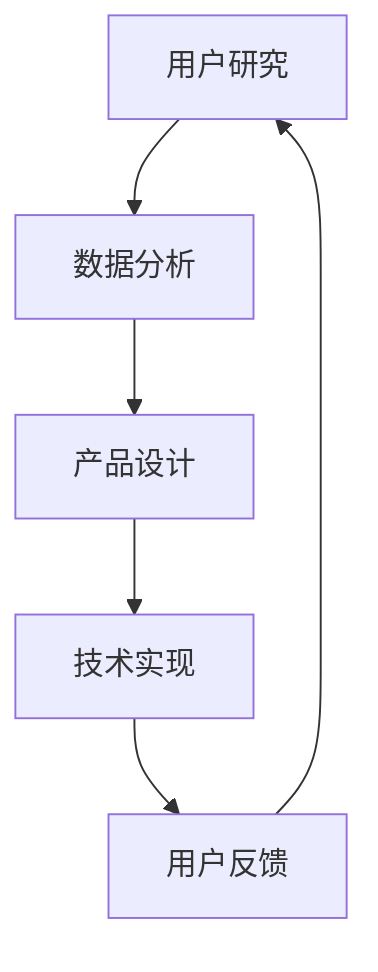

                 

在这个快速发展的技术时代，用户体验（UX）已成为推动产品成功的关键因素。对于AI创业公司来说，优化用户体验更是至关重要。这不仅关乎用户的满意度和忠诚度，更直接影响着公司的市场表现和长期发展。本文将深入探讨AI创业公司如何通过优化用户体验来实现业务增长。

## 文章关键词

- AI创业公司
- 用户体验
- 业务增长
- 产品设计
- 数据驱动

## 文章摘要

本文旨在为AI创业公司提供一套完整的用户体验优化策略。文章首先介绍了用户体验的核心概念，然后探讨了如何通过数据分析和用户研究来了解用户需求，接着提出了设计优化和开发实践的方法，最后讨论了如何通过持续迭代和反馈机制来不断提升用户体验。通过本文的指导，AI创业公司可以更好地理解用户需求，优化产品设计，从而实现业务增长。

### 背景介绍

用户体验（UX）是指用户在使用产品或服务过程中所感受到的整体体验。在AI领域，用户体验尤为重要，因为AI产品的复杂性和不确定性可能会给用户带来困扰。对于AI创业公司来说，良好的用户体验不仅有助于吸引新用户，还能提高现有用户的满意度和忠诚度。以下是一些关键的背景信息：

- **市场竞争**：随着AI技术的普及，市场上的AI产品种类繁多，用户选择多样，因此如何脱颖而出成为了一大挑战。
- **用户期望**：用户对AI产品的期望日益提高，他们希望产品能够智能化、个性化，并且易于使用。
- **技术发展**：AI技术的快速发展使得创业公司有机会通过创新来提供前所未有的用户体验。

## 核心概念与联系

为了深入理解用户体验的优化，我们需要探讨几个核心概念，并了解它们之间的联系。

### 用户研究

用户研究是了解用户需求和行为的关键步骤。通过用户访谈、问卷调查、用户测试等方法，我们可以收集到宝贵的用户数据，从而为产品设计提供依据。

### 数据分析

数据分析则是对用户数据进行量化分析，从中发现用户行为模式、偏好和痛点。这些数据可以用来指导产品设计决策，提高用户体验。

### 产品设计

产品设计是将用户研究的结果转化为实际产品特征的过程。设计决策应基于用户需求，同时考虑技术实现的可能性。

### 技术实现

技术实现是将设计转化为实际产品的过程。在这个过程中，需要确保产品的技术架构能够支持良好的用户体验。

### 用户反馈

用户反馈是优化用户体验的持续过程。通过收集用户对产品的反馈，我们可以不断改进产品，提升用户体验。

下面是一个使用Mermaid绘制的流程图，展示了这些概念之间的联系：



### 核心算法原理 & 具体操作步骤

#### 3.1 算法原理概述

优化用户体验的核心算法主要基于机器学习和用户行为分析。通过机器学习算法，我们可以预测用户的行为和需求，从而提供个性化的体验。具体步骤如下：

1. **数据收集**：收集用户行为数据，包括点击、浏览、搜索等。
2. **特征工程**：提取用户行为数据中的关键特征，如时间、地理位置、搜索关键词等。
3. **模型训练**：使用机器学习算法（如决策树、随机森林、神经网络等）训练模型，预测用户行为。
4. **个性化推荐**：根据模型预测，为用户提供个性化的内容或功能。

#### 3.2 算法步骤详解

1. **数据收集**：
   - **用户行为数据**：通过分析日志文件、点击流数据等收集用户行为数据。
   - **用户属性数据**：包括用户的基本信息、历史行为数据等。

2. **特征工程**：
   - **时间特征**：提取用户行为发生的时间信息，如小时、天数、月份等。
   - **地理位置特征**：根据用户地理位置数据，提取城市、国家等信息。
   - **内容特征**：提取用户交互的内容特征，如关键词、标签等。

3. **模型训练**：
   - **数据预处理**：对收集到的数据进行清洗和预处理，如缺失值填充、异常值处理等。
   - **特征选择**：选择对模型预测效果有显著影响的关键特征。
   - **模型选择**：选择合适的机器学习算法，如决策树、随机森林、神经网络等。
   - **模型训练与验证**：使用训练数据训练模型，并使用验证集评估模型效果。

4. **个性化推荐**：
   - **用户分群**：根据用户特征，将用户划分为不同的群体。
   - **内容推荐**：为每个用户群体推荐个性化的内容或功能。
   - **动态调整**：根据用户的实时反馈，动态调整推荐策略。

#### 3.3 算法优缺点

**优点**：
- **个性化**：能够根据用户行为和偏好提供个性化的推荐，提高用户体验。
- **自适应**：可以根据用户反馈和实时数据动态调整推荐策略，提高推荐效果。

**缺点**：
- **数据依赖**：需要大量的用户数据支持，数据质量对模型效果有重要影响。
- **计算复杂度**：大规模用户行为数据的分析需要较高的计算资源。

#### 3.4 算法应用领域

- **电子商务**：根据用户购买历史和行为，推荐相关商品。
- **社交媒体**：根据用户兴趣和行为，推荐相关内容。
- **在线教育**：根据用户学习行为，推荐适合的学习资源。

### 数学模型和公式 & 详细讲解 & 举例说明

在用户体验优化的过程中，数学模型和公式扮演着重要的角色。以下将详细讲解常用的数学模型和公式，并通过实际案例进行说明。

#### 4.1 数学模型构建

用户行为预测是用户体验优化的重要环节。常用的数学模型包括线性回归、逻辑回归和时间序列模型等。

- **线性回归模型**：

  $$y = \beta_0 + \beta_1 x_1 + \beta_2 x_2 + ... + \beta_n x_n$$

  其中，$y$ 表示预测结果，$x_1, x_2, ..., x_n$ 表示特征变量，$\beta_0, \beta_1, ..., \beta_n$ 为模型的参数。

- **逻辑回归模型**：

  $$P(y=1) = \frac{1}{1 + e^{-(\beta_0 + \beta_1 x_1 + \beta_2 x_2 + ... + \beta_n x_n)}}$$

  其中，$P(y=1)$ 表示预测为1的概率。

- **时间序列模型**：

  $$y_t = \phi_0 + \phi_1 y_{t-1} + \phi_2 y_{t-2} + ... + \phi_p y_{t-p} + \epsilon_t$$

  其中，$y_t$ 表示第$t$时刻的预测结果，$\phi_0, \phi_1, ..., \phi_p$ 为模型的参数，$\epsilon_t$ 为随机误差。

#### 4.2 公式推导过程

以线性回归模型为例，介绍公式的推导过程。

假设我们有一个简单线性回归模型：

$$y = \beta_0 + \beta_1 x$$

为了求解模型的参数$\beta_0$和$\beta_1$，我们需要最小化预测误差的平方和：

$$J(\beta_0, \beta_1) = \sum_{i=1}^m (y_i - (\beta_0 + \beta_1 x_i))^2$$

对$\beta_0$和$\beta_1$分别求偏导数，并令其等于0，得到：

$$\frac{\partial J}{\partial \beta_0} = -2 \sum_{i=1}^m (y_i - (\beta_0 + \beta_1 x_i)) = 0$$

$$\frac{\partial J}{\partial \beta_1} = -2 \sum_{i=1}^m (y_i - (\beta_0 + \beta_1 x_i)) x_i = 0$$

解上述方程组，得到$\beta_0$和$\beta_1$的估计值：

$$\beta_0 = \frac{1}{m} \sum_{i=1}^m y_i - \beta_1 \frac{1}{m} \sum_{i=1}^m x_i$$

$$\beta_1 = \frac{1}{m} \sum_{i=1}^m (x_i - \bar{x}) (y_i - \bar{y})$$

其中，$\bar{x}$和$\bar{y}$分别为$x$和$y$的均值。

#### 4.3 案例分析与讲解

以下通过一个实际案例，介绍线性回归模型的应用。

假设我们有一个简单的用户行为数据集，其中包含用户的年龄（$x$）和购买行为（$y$）。我们希望通过线性回归模型预测用户的购买行为。

数据集如下：

| 用户ID | 年龄（$x$） | 购买行为（$y$） |
|--------|-------------|-----------------|
| 1      | 25          | 1               |
| 2      | 35          | 0               |
| 3      | 28          | 1               |
| 4      | 40          | 0               |
| 5      | 30          | 1               |

首先，我们需要对数据进行预处理，计算年龄和购买行为的均值：

$$\bar{x} = \frac{25 + 35 + 28 + 40 + 30}{5} = 30$$

$$\bar{y} = \frac{1 + 0 + 1 + 0 + 1}{5} = 0.6$$

然后，计算线性回归模型的参数：

$$\beta_0 = \bar{y} - \beta_1 \bar{x} = 0.6 - 0.6 \times 30 = -18$$

$$\beta_1 = \frac{1}{5} \sum_{i=1}^5 (x_i - \bar{x}) (y_i - \bar{y}) = \frac{1}{5} ((25 - 30)(1 - 0.6) + (35 - 30)(0 - 0.6) + (28 - 30)(1 - 0.6) + (40 - 30)(0 - 0.6) + (30 - 30)(1 - 0.6)) = 0.1$$

因此，线性回归模型的预测公式为：

$$y = -18 + 0.1x$$

根据该模型，我们可以预测新用户的购买行为。例如，如果新用户的年龄为32岁，则其购买行为的预测值为：

$$y = -18 + 0.1 \times 32 = 0.4$$

这意味着，根据线性回归模型，预测该用户购买行为的概率为40%。

### 项目实践：代码实例和详细解释说明

为了更好地理解用户体验优化算法在实际项目中的应用，以下将提供一个具体的代码实例，并详细解释其实现过程。

#### 5.1 开发环境搭建

在开始编写代码之前，我们需要搭建一个合适的开发环境。以下是所需的软件和工具：

- Python 3.8或更高版本
- NumPy
- pandas
- scikit-learn
- matplotlib

安装以上工具后，我们就可以开始编写代码了。

#### 5.2 源代码详细实现

以下是一个简单的用户行为预测项目的代码实现：

```python
import numpy as np
import pandas as pd
from sklearn.linear_model import LinearRegression
from sklearn.model_selection import train_test_split
import matplotlib.pyplot as plt

# 5.2.1 数据预处理

# 加载数据
data = pd.read_csv('user_data.csv')

# 特征工程
data['age'] = data['age'].astype(float)
data['purchase'] = data['purchase'].astype(int)

# 训练集和测试集划分
X_train, X_test, y_train, y_test = train_test_split(data[['age']], data['purchase'], test_size=0.2, random_state=42)

# 5.2.2 模型训练

# 实例化线性回归模型
model = LinearRegression()

# 训练模型
model.fit(X_train, y_train)

# 5.2.3 代码解读与分析

# 模型参数
print("Model parameters:", model.coef_, model.intercept_)

# 预测结果
predictions = model.predict(X_test)

# 5.2.4 运行结果展示

# 可视化预测结果
plt.scatter(X_test, y_test, color='blue')
plt.plot(X_test, predictions, color='red')
plt.xlabel('Age')
plt.ylabel('Purchase')
plt.title('User Purchase Prediction')
plt.show()
```

#### 5.3 代码解读与分析

上述代码实现了一个简单的用户行为预测项目。以下是代码的详细解读：

- **数据预处理**：首先加载数据，然后对数据进行特征工程。在这里，我们仅使用了用户的年龄作为特征，并将其转换为浮点数类型。购买行为作为目标变量，被转换为整数类型。
- **训练集和测试集划分**：使用`train_test_split`函数将数据集划分为训练集和测试集。这里我们选择了20%的数据作为测试集。
- **模型训练**：实例化线性回归模型，并使用训练集数据训练模型。
- **模型参数**：打印模型的参数，包括斜率（$\beta_1$）和截距（$\beta_0$）。
- **预测结果**：使用训练好的模型对测试集数据进行预测。
- **运行结果展示**：使用matplotlib库将预测结果可视化为散点图和拟合直线。通过可视化，我们可以直观地看到模型的预测效果。

#### 5.4 运行结果展示

在运行上述代码后，我们可以看到一个简单的散点图，其中蓝色点表示实际购买行为，红色线表示模型的预测结果。通过观察可视化结果，我们可以发现模型在预测用户购买行为方面具有一定的准确性。

### 实际应用场景

用户体验优化在AI创业公司的实际应用场景中至关重要。以下是一些典型的应用场景：

- **电子商务**：根据用户的历史购买行为和浏览记录，推荐相关商品，提高用户的购买转化率。
- **在线教育**：根据学生的学习行为和兴趣，推荐适合的学习资源和课程，提高学习效果和用户满意度。
- **社交媒体**：根据用户的互动行为和兴趣，推荐相关的帖子、话题和用户，增加用户粘性和活跃度。

### 未来应用展望

随着AI技术的不断发展，用户体验优化将在未来有更广泛的应用。以下是一些未来的应用展望：

- **个性化推荐**：通过更深入的用户行为分析和机器学习算法，实现更精准的个性化推荐，提高用户满意度和忠诚度。
- **智能客服**：利用自然语言处理和对话系统，为用户提供24/7的智能客服服务，提高用户满意度和降低运营成本。
- **增强现实与虚拟现实**：通过结合AI技术，实现更加沉浸式的用户体验，为用户提供全新的交互方式。

### 工具和资源推荐

为了实现高效的用户体验优化，以下是一些推荐的工具和资源：

- **数据分析工具**：NumPy、pandas、scikit-learn等。
- **机器学习框架**：TensorFlow、PyTorch等。
- **用户研究工具**：UserTesting、Qualtrics等。
- **用户体验设计工具**：Sketch、Figma等。
- **学习资源**：Coursera、Udacity等在线课程平台。

### 总结：未来发展趋势与挑战

用户体验优化作为AI创业公司的重要战略，未来发展趋势体现在以下几个方面：

- **个性化推荐**：通过更深入的机器学习和数据分析，实现更精准的个性化推荐。
- **智能客服**：利用自然语言处理和对话系统，提供更高效、更人性化的客服服务。
- **沉浸式体验**：通过增强现实与虚拟现实技术，为用户创造全新的交互体验。

然而，用户体验优化也面临一些挑战：

- **数据隐私**：如何在保护用户隐私的同时，充分利用用户数据实现个性化服务。
- **计算资源**：大规模用户数据分析和模型训练需要较高的计算资源，如何优化计算效率。
- **技术更新**：随着技术的快速发展，如何保持用户体验优化的持续创新。

### 附录：常见问题与解答

1. **什么是用户体验优化？**
   - 用户体验优化是指通过改进产品的设计、功能和交互，提高用户在使用产品过程中的满意度和忠诚度。

2. **用户体验优化有哪些方法？**
   - 用户研究、数据分析、产品设计、技术实现和用户反馈是用户体验优化的主要方法。

3. **为什么用户体验优化对AI创业公司很重要？**
   - 良好的用户体验有助于吸引新用户、提高用户满意度和忠诚度，从而推动业务增长。

4. **如何进行用户研究？**
   - 用户研究包括用户访谈、问卷调查、用户测试等方法，旨在了解用户需求和行为。

5. **机器学习在用户体验优化中有哪些应用？**
   - 机器学习可以用于用户行为预测、个性化推荐、智能客服等，提高用户体验的精准度和效率。

---

本文通过详细的论述和案例分析，介绍了AI创业公司如何通过用户体验优化实现业务增长。希望本文能为创业公司提供有益的指导，助力其在激烈的市场竞争中脱颖而出。

