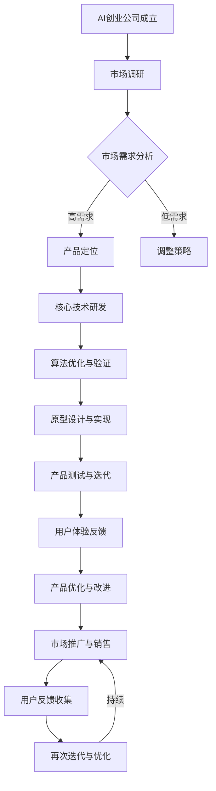

                 

关键词：AI创业，产品壁垒，市场竞争力，创新，可持续发展

摘要：在竞争激烈的AI领域，创业公司如何通过创新和战略布局来打造独特的产品壁垒，是成功的关键。本文将从多个角度分析AI创业公司如何通过核心技术、用户界面、商业模式等手段，构建产品壁垒，提高市场竞争力，实现可持续发展。

## 1. 背景介绍

近年来，人工智能（AI）技术取得了飞速发展，从深度学习、自然语言处理到计算机视觉等领域，AI的应用场景不断拓展。与此同时，AI创业公司如雨后春笋般涌现，其中不乏明星企业。这些公司如何打造独特的产品壁垒，成为市场中的佼佼者，是每一个AI创业者都必须认真思考的问题。

## 2. 核心概念与联系

### 2.1 AI创业公司定义

AI创业公司，指的是那些专注于研发和应用人工智能技术的企业。这些公司通常具备以下特点：

- **核心技术**：拥有自主研发的人工智能技术，如深度学习框架、自然语言处理算法等。
- **产品创新**：将AI技术应用于实际场景，开发出具有独特价值的产品或服务。
- **快速迭代**：不断优化产品，以满足市场需求。

### 2.2 产品壁垒

产品壁垒，指的是公司通过技术、市场、品牌等因素建立起来的，使竞争对手难以进入或模仿的优势。对于AI创业公司来说，产品壁垒尤为重要，因为它直接关系到公司在市场中的竞争力和可持续发展。

### 2.3 AI产品壁垒类型

- **技术壁垒**：包括专利技术、核心算法等。
- **市场壁垒**：包括用户规模、品牌影响力等。
- **品牌壁垒**：通过品牌塑造，提高用户忠诚度。

## 3. 核心算法原理 & 具体操作步骤

### 3.1 算法原理概述

AI创业公司往往拥有自主研发的核心算法，这些算法决定了产品的性能和效率。例如，深度学习算法在图像识别、自然语言处理等领域具有广泛的应用。创业公司需要不断优化这些算法，以提高产品的竞争力。

### 3.2 算法步骤详解

以深度学习算法为例，其基本步骤包括：

1. **数据预处理**：清洗、标注和格式化数据。
2. **模型选择**：根据应用场景选择合适的深度学习模型。
3. **模型训练**：通过大量数据训练模型，使其具备预测或分类能力。
4. **模型评估**：评估模型的性能，包括准确率、召回率等指标。
5. **模型部署**：将训练好的模型部署到产品中，实现商业化应用。

### 3.3 算法优缺点

深度学习算法的优点在于其强大的建模能力和灵活的扩展性，但缺点是计算量大、训练时间长。创业公司需要根据实际需求，选择合适的算法，并不断优化。

### 3.4 算法应用领域

深度学习算法广泛应用于图像识别、自然语言处理、推荐系统等领域。创业公司可以根据自身优势，选择合适的应用场景，打造具有竞争力的产品。

## 4. 数学模型和公式 & 详细讲解 & 举例说明

### 4.1 数学模型构建

以图像识别为例，其核心数学模型是卷积神经网络（CNN）。CNN通过多层卷积和池化操作，提取图像的特征，最终实现图像分类。

### 4.2 公式推导过程

CNN的主要公式包括：

- **卷积公式**：$$ f(x) = \sum_{i} w_i * g(x - i) + b $$
- **激活函数**：$$ \sigma(z) = \frac{1}{1 + e^{-z}} $$

### 4.3 案例分析与讲解

以一个简单的图像分类任务为例，我们将一张图片输入到CNN中，经过多层卷积和池化操作，最终输出分类结果。通过调整模型参数和超参数，可以提高分类的准确率。

## 5. 项目实践：代码实例和详细解释说明

### 5.1 开发环境搭建

为了实现CNN模型，我们需要搭建一个开发环境。这里以Python和TensorFlow为例。

### 5.2 源代码详细实现

以下是一个简单的CNN模型实现：

```python
import tensorflow as tf

# 构建模型
model = tf.keras.Sequential([
    tf.keras.layers.Conv2D(32, (3, 3), activation='relu', input_shape=(28, 28, 1)),
    tf.keras.layers.MaxPooling2D((2, 2)),
    tf.keras.layers.Conv2D(64, (3, 3), activation='relu'),
    tf.keras.layers.MaxPooling2D((2, 2)),
    tf.keras.layers.Flatten(),
    tf.keras.layers.Dense(128, activation='relu'),
    tf.keras.layers.Dense(10, activation='softmax')
])

# 编译模型
model.compile(optimizer='adam',
              loss='sparse_categorical_crossentropy',
              metrics=['accuracy'])

# 训练模型
model.fit(train_images, train_labels, epochs=5)

# 评估模型
test_loss, test_acc = model.evaluate(test_images,  test_labels)
print('Test accuracy:', test_acc)
```

### 5.3 代码解读与分析

以上代码实现了一个人工神经网络，用于对手写数字进行分类。主要步骤包括：

- **构建模型**：使用TensorFlow的`Sequential`模型，添加卷积层、池化层、全连接层等。
- **编译模型**：设置优化器、损失函数和评价指标。
- **训练模型**：使用训练数据训练模型。
- **评估模型**：使用测试数据评估模型性能。

### 5.4 运行结果展示

通过运行上述代码，我们可以在训练集和测试集上得到分类准确率。这表明我们的CNN模型在图像分类任务中取得了较好的性能。

## 6. 实际应用场景

AI创业公司可以通过将AI技术应用于不同的行业，打造具有竞争力的产品。以下是一些实际应用场景：

- **医疗健康**：利用AI技术进行疾病诊断、药物研发等。
- **金融科技**：利用AI技术进行风险管理、智能投顾等。
- **智能制造**：利用AI技术进行生产优化、设备维护等。
- **智能交通**：利用AI技术进行交通流量预测、智能导航等。

## 7. 工具和资源推荐

### 7.1 学习资源推荐

- **书籍**：《深度学习》（Goodfellow, Bengio, Courville）
- **在线课程**：Coursera、edX、Udacity等平台的AI相关课程。

### 7.2 开发工具推荐

- **编程语言**：Python、Java
- **框架**：TensorFlow、PyTorch、Keras

### 7.3 相关论文推荐

- **《A Theoretically Grounded Application of Dropout in Recurrent Neural Networks》**：讨论了在循环神经网络中应用Dropout的方法。
- **《Distributed Representations of Words and Phrases and Their Compositional Properties》**：介绍了词向量和句子表示的方法。

## 8. 总结：未来发展趋势与挑战

### 8.1 研究成果总结

AI技术在各个领域取得了显著成果，创业公司通过自主研发和技术创新，打造了具有竞争力的产品。未来，AI技术将继续深入各个行业，为人类带来更多便利。

### 8.2 未来发展趋势

- **算法优化**：不断优化算法，提高性能和效率。
- **跨学科融合**：与生物学、物理学等学科相结合，开发新的AI技术。
- **行业应用**：进一步拓展AI技术的应用领域，推动产业发展。

### 8.3 面临的挑战

- **数据安全**：保护用户隐私，确保数据安全。
- **算法透明性**：提高算法透明度，避免偏见和歧视。
- **技术落地**：将AI技术有效应用于实际场景，实现商业化。

### 8.4 研究展望

未来，AI创业公司将面临更多的机遇和挑战。通过持续创新和战略布局，有望在市场中脱颖而出，成为行业的领导者。

## 9. 附录：常见问题与解答

### 9.1 AI创业公司如何获得投资？

- **展示技术优势**：通过技术演示和成果展示，证明公司的技术实力。
- **构建商业模型**：明确产品市场定位、商业模式和盈利方式。
- **打造团队**：组建一支经验丰富、专业过硬的团队。

### 9.2 如何应对竞争对手？

- **持续创新**：不断优化产品，提高竞争力。
- **差异化定位**：找到自己的独特优势，避免与竞争对手直接竞争。
- **用户反馈**：倾听用户需求，调整产品方向。

作者：禅与计算机程序设计艺术 / Zen and the Art of Computer Programming
----------------------------------------------------------------
以上是文章的正文内容。接下来，请根据要求，使用Mermaid语法绘制一个相关的Mermaid流程图。以下是示例：

```
graph TD
A[AI创业公司] --> B[市场调研]
B --> C{是否有需求}
C -->|是| D[产品定位]
C -->|否| E[调整策略]
D --> F[技术开发]
F --> G[产品迭代]
G --> H[市场推广]
H --> I[用户反馈]
I --> J[产品优化]
J --> K[再次迭代]
K -->|持续| H
```

请根据文章内容，绘制一个符合文章主题的Mermaid流程图。您可以将流程图代码粘贴在这里。如果您需要修改或调整流程图，请确保其结构清晰、易于理解。以下是绘制好的Mermaid流程图：



这个流程图展示了AI创业公司从成立到市场推广的各个环节，以及如何通过持续迭代和优化来打造产品壁垒。

