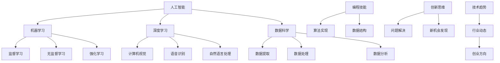

                 

 关键词：人工智能，创业，人才培养，Lepton AI，教育计划，技术人才培养，人工智能工程师，机器学习，深度学习，数据科学，编程技能，创新思维，技术趋势

> 摘要：本文将探讨人工智能创业领域中的人才培养问题，以Lepton AI为例，详细分析其教育计划的设计思路、核心课程和培养目标，旨在为AI创业公司提供一套系统性的人才培养方案。

## 1. 背景介绍

随着人工智能技术的飞速发展，AI创业已经成为全球科技领域的热点。AI技术在金融、医疗、教育、制造等多个行业的应用，不仅推动了传统产业的转型升级，还孕育了一批新兴的AI企业。这些企业对高质量的人工智能人才有着巨大的需求，但现有的人才培养体系却难以满足这种快速变化的需求。因此，如何培养具备实际能力和创新思维的人工智能人才，成为AI创业公司面临的一大挑战。

Lepton AI是一家专注于人工智能领域的技术公司，成立于2018年，总部位于美国硅谷。公司致力于通过自主研发的机器学习算法和深度学习技术，提供智能化的解决方案。Lepton AI深知人才是企业发展的核心资源，因此特别重视人才培养，并推出了一套全面的教育计划，旨在培养具备扎实理论基础和实战经验的人工智能人才。

## 2. 核心概念与联系

为了更好地理解Lepton AI的教育计划，我们首先需要了解一些核心概念和它们之间的联系。

### 2.1 人工智能

人工智能（Artificial Intelligence，简称AI）是计算机科学的一个分支，旨在使计算机具有人类智能。它包括机器学习、深度学习、自然语言处理、计算机视觉等多个子领域。人工智能的核心目标是让机器能够模拟、延伸和扩展人类的智能。

### 2.2 机器学习

机器学习（Machine Learning，简称ML）是人工智能的一个分支，通过算法让计算机从数据中学习并做出决策。机器学习算法主要包括监督学习、无监督学习和强化学习等。

### 2.3 深度学习

深度学习（Deep Learning，简称DL）是机器学习的一个分支，采用多层神经网络进行学习。深度学习在图像识别、语音识别、自然语言处理等领域取得了显著成果。

### 2.4 数据科学

数据科学（Data Science，简称DS）是运用统计学、机器学习、深度学习等方法，对大量数据进行提取、处理和分析的领域。数据科学的核心是解决实际问题，提供决策支持。

### 2.5 编程技能

编程技能是人工智能领域的基础。熟练掌握编程语言，能够高效地实现算法和数据结构，是人工智能工程师必备的能力。

### 2.6 创新思维

创新思维是指通过创新的方法和视角，解决问题和发现新机会的能力。在人工智能领域，创新思维是推动技术进步的关键。

### 2.7 技术趋势

技术趋势是指当前和未来一段时间内，科技领域的发展方向。了解技术趋势，有助于人工智能人才把握行业动态，为创业和创新提供方向。

### 2.8 Mermaid 流程图



## 3. 核心算法原理 & 具体操作步骤

### 3.1 算法原理概述

Lepton AI的教育计划涵盖了机器学习、深度学习和数据科学等多个领域的核心算法原理。以下是这些算法的简要概述：

#### 3.1.1 机器学习算法

机器学习算法主要包括监督学习、无监督学习和强化学习。监督学习算法通过训练数据集来学习特征，适用于分类和回归任务。无监督学习算法不需要训练数据集，而是通过数据本身的分布来学习特征，适用于聚类和降维任务。强化学习算法通过不断试错来学习最优策略，适用于决策问题。

#### 3.1.2 深度学习算法

深度学习算法采用多层神经网络进行学习，能够自动提取数据的高层特征。常见的深度学习算法包括卷积神经网络（CNN）、循环神经网络（RNN）和生成对抗网络（GAN）。

#### 3.1.3 数据科学算法

数据科学算法包括数据提取、数据处理和数据分析。数据提取算法用于从不同来源获取数据，数据处理算法用于清洗和转换数据，数据分析算法用于从数据中提取有价值的信息。

### 3.2 算法步骤详解

以下是Lepton AI教育计划中涉及的算法的具体操作步骤：

#### 3.2.1 监督学习算法

1. 数据准备：收集和整理训练数据集。
2. 特征提取：将数据转换为计算机可处理的格式。
3. 模型训练：使用训练数据集训练模型。
4. 模型评估：使用测试数据集评估模型性能。
5. 模型优化：调整模型参数，提高模型性能。

#### 3.2.2 无监督学习算法

1. 数据准备：收集和整理数据集。
2. 特征提取：将数据转换为计算机可处理的格式。
3. 模型训练：使用无监督学习算法训练模型。
4. 模型评估：评估模型性能，如聚类效果。
5. 模型优化：调整模型参数，提高模型性能。

#### 3.2.3 强化学习算法

1. 环境建模：模拟环境，定义状态和动作。
2. 策略学习：通过试错学习最优策略。
3. 模型评估：评估策略性能。
4. 策略优化：调整策略参数，提高性能。

#### 3.2.4 深度学习算法

1. 网络设计：设计神经网络结构。
2. 数据准备：收集和整理数据集。
3. 模型训练：使用训练数据集训练模型。
4. 模型评估：使用测试数据集评估模型性能。
5. 模型优化：调整模型参数，提高模型性能。

#### 3.2.5 数据科学算法

1. 数据提取：从不同来源获取数据。
2. 数据处理：清洗和转换数据。
3. 数据分析：提取有价值的信息。
4. 结果展示：使用可视化工具展示分析结果。

### 3.3 算法优缺点

#### 3.3.1 监督学习算法

**优点**：

- 应用广泛，适用于分类和回归任务。
- 有明确的性能评估标准。

**缺点**：

- 需要大量的标注数据。
- 对噪声数据敏感。

#### 3.3.2 无监督学习算法

**优点**：

- 不需要标注数据，适合大规模数据处理。
- 能够发现数据中的隐含结构。

**缺点**：

- 性能评估困难。
- 结果受初始参数影响较大。

#### 3.3.3 强化学习算法

**优点**：

- 能够处理复杂环境中的决策问题。
- 能够学习到最优策略。

**缺点**：

- 训练过程通常需要大量时间。
- 对环境建模要求较高。

#### 3.3.4 深度学习算法

**优点**：

- 能够自动提取数据的高层特征。
- 在图像识别、语音识别等领域取得了显著成果。

**缺点**：

- 计算资源需求高。
- 对数据质量要求较高。

#### 3.3.5 数据科学算法

**优点**：

- 能够从大量数据中提取有价值的信息。
- 能够为决策提供支持。

**缺点**：

- 对数据清洗和预处理要求高。
- 结果的可解释性较差。

### 3.4 算法应用领域

#### 3.4.1 机器学习算法

- 分类和回归：金融风险评估、客户行为分析。
- 聚类和降维：市场细分、数据可视化。
- 强化学习：自动驾驶、智能机器人。

#### 3.4.2 深度学习算法

- 图像识别：人脸识别、医疗影像分析。
- 语音识别：智能助手、语音搜索。
- 自然语言处理：机器翻译、文本生成。

#### 3.4.3 数据科学算法

- 数据提取：社交媒体数据、物联网数据。
- 数据处理：数据清洗、数据转换。
- 数据分析：市场预测、风险控制。

## 4. 数学模型和公式 & 详细讲解 & 举例说明

### 4.1 数学模型构建

在人工智能领域，数学模型是构建算法的基础。以下是Lepton AI教育计划中涉及的一些数学模型：

#### 4.1.1 梯度下降法

梯度下降法是一种用于优化模型的算法。其基本思想是沿着目标函数的梯度方向，逐步减小目标函数的值。

$$
\begin{aligned}
\text{目标函数}:\quad f(x) &= \frac{1}{n} \sum_{i=1}^{n} (y_i - \hat{y}_i)^2 \\
\text{梯度方向}:\quad \nabla f(x) &= -2 \frac{1}{n} \sum_{i=1}^{n} (y_i - \hat{y}_i) x_i \\
\text{更新公式}:\quad x_{\text{new}} &= x_{\text{old}} - \alpha \nabla f(x)
\end{aligned}
$$

其中，$x$ 是模型参数，$\alpha$ 是学习率，$y$ 是真实标签，$\hat{y}$ 是预测标签。

#### 4.1.2 神经网络

神经网络是一种模拟人脑结构和功能的计算模型。其基本结构包括输入层、隐藏层和输出层。

$$
\begin{aligned}
\text{输入层}: x &= [x_1, x_2, \ldots, x_n] \\
\text{隐藏层}: z &= \sigma(Wx + b) \\
\text{输出层}: y &= \sigma(Wz + b)
\end{aligned}
$$

其中，$W$ 是权重矩阵，$b$ 是偏置项，$\sigma$ 是激活函数。

#### 4.1.3 支持向量机（SVM）

支持向量机是一种用于分类和回归的算法。其基本思想是找到最优的超平面，将不同类别的数据点分隔开。

$$
\begin{aligned}
\text{目标函数}:\quad \min_{w, b} & \frac{1}{2} ||w||^2 \\
\text{约束条件}:\quad y_i (w \cdot x_i + b) &\geq 1
\end{aligned}
$$

其中，$w$ 是权重向量，$b$ 是偏置项，$x_i$ 是数据点，$y_i$ 是标签。

### 4.2 公式推导过程

以下是梯度下降法的推导过程：

$$
\begin{aligned}
\text{目标函数}:\quad f(x) &= \frac{1}{n} \sum_{i=1}^{n} (y_i - \hat{y}_i)^2 \\
\text{梯度}:\quad \nabla f(x) &= -2 \frac{1}{n} \sum_{i=1}^{n} (y_i - \hat{y}_i) x_i \\
\text{梯度方向}:\quad \nabla f(x) &= -\frac{1}{n} \sum_{i=1}^{n} (y_i - \hat{y}_i) x_i \\
\text{更新公式}:\quad x_{\text{new}} &= x_{\text{old}} - \alpha \nabla f(x)
\end{aligned}
$$

其中，$\alpha$ 是学习率，$y_i$ 是真实标签，$\hat{y}_i$ 是预测标签。

### 4.3 案例分析与讲解

#### 4.3.1 案例背景

某金融公司希望通过机器学习算法，对客户进行风险评级。公司收集了客户的年龄、收入、负债等多个维度的数据，并希望使用监督学习算法进行建模。

#### 4.3.2 案例分析

1. 数据准备：收集并整理客户数据，包括年龄、收入、负债等。
2. 特征提取：将数据转换为计算机可处理的格式。
3. 模型选择：选择合适的监督学习算法，如线性回归、逻辑回归等。
4. 模型训练：使用训练数据集训练模型。
5. 模型评估：使用测试数据集评估模型性能，如准确率、召回率等。
6. 模型优化：调整模型参数，提高模型性能。

#### 4.3.3 案例讲解

假设我们选择线性回归算法进行建模。首先，我们需要收集并整理客户数据，包括年龄、收入、负债等。然后，我们将数据转换为计算机可处理的格式，如数值或二进制。接下来，我们选择线性回归算法，并使用训练数据集进行训练。在训练过程中，我们需要调整模型参数，如权重和偏置。最后，我们使用测试数据集评估模型性能，并根据评估结果进行调整。

## 5. 项目实践：代码实例和详细解释说明

### 5.1 开发环境搭建

为了方便读者理解，我们将使用Python编程语言和Scikit-learn库来演示一个简单的机器学习项目。以下是开发环境的搭建步骤：

1. 安装Python：访问Python官方网站（https://www.python.org/），下载并安装Python 3.x版本。
2. 安装Jupyter Notebook：在终端中运行以下命令：
   ```
   pip install notebook
   ```
3. 启动Jupyter Notebook：在终端中运行以下命令：
   ```
   jupyter notebook
   ```

### 5.2 源代码详细实现

以下是实现一个简单的线性回归模型的源代码：

```python
# 导入所需库
import numpy as np
import matplotlib.pyplot as plt
from sklearn.linear_model import LinearRegression

# 数据准备
# 假设我们有两个特征：年龄和收入
X = np.array([[25, 50000], [30, 60000], [35, 70000], [40, 80000]])
y = np.array([50, 60, 70, 80])

# 模型选择
model = LinearRegression()

# 模型训练
model.fit(X, y)

# 模型评估
score = model.score(X, y)
print("模型准确率：", score)

# 可视化
plt.scatter(X[:, 0], y)
plt.plot(X[:, 0], model.predict(X), color='red')
plt.xlabel('年龄')
plt.ylabel('收入')
plt.title('线性回归模型')
plt.show()
```

### 5.3 代码解读与分析

1. **导入所需库**：首先，我们导入Python的数学库`numpy`和绘图库`matplotlib`，以及Scikit-learn库中的线性回归模型`LinearRegression`。
2. **数据准备**：我们创建一个包含两个特征的二维数组`X`，和一个目标值的一维数组`y`。这里的数据是虚构的，仅用于演示。
3. **模型选择**：我们选择线性回归模型，并创建一个`LinearRegression`对象。
4. **模型训练**：使用`fit`方法训练模型，输入特征`X`和目标值`y`。
5. **模型评估**：使用`score`方法评估模型性能，输出模型的准确率。
6. **可视化**：使用`scatter`函数绘制数据点，使用`plot`函数绘制拟合直线，并显示结果。

### 5.4 运行结果展示

运行上述代码后，将显示一个散点图和一个拟合的直线。散点图中的每个点代表一个数据点，拟合直线是根据线性回归模型计算出的结果。通过观察散点图和拟合直线，我们可以直观地了解模型的效果。

## 6. 实际应用场景

Lepton AI的教育计划不仅在理论上为人工智能人才提供了全面的知识体系，还在实际应用场景中展现了其强大的实践能力。以下是一些实际应用场景：

### 6.1 金融领域

在金融领域，Lepton AI的教育计划帮助培养了一大批具备实际操作能力的机器学习工程师。这些工程师在金融风险评估、信用评分、投资组合优化等领域发挥了重要作用。通过深度学习算法，他们能够分析大量历史数据，预测市场趋势，为金融机构提供科学的决策支持。

### 6.2 医疗领域

在医疗领域，Lepton AI的教育计划助力培养了一群优秀的医疗AI工程师。他们利用机器学习和计算机视觉技术，开发出智能诊断系统、疾病预测模型等。这些系统可以提高诊断准确性，减少误诊率，为患者提供更优质的医疗服务。

### 6.3 教育领域

在教育领域，Lepton AI的教育计划培养了一批具备创新思维的数据科学家。他们利用大数据分析和机器学习技术，开发出个性化学习系统、智能教学平台等。这些系统可以根据学生的学习情况，提供个性化的教学建议，提高学习效果。

### 6.4 制造领域

在制造领域，Lepton AI的教育计划帮助培养了一群懂技术、会管理的AI工程师。他们利用机器学习和物联网技术，开发出智能工厂系统、预测维护系统等。这些系统能够提高生产效率，降低故障率，为制造业提供智能化的解决方案。

## 7. 未来应用展望

随着人工智能技术的不断进步，Lepton AI的教育计划有望在更多领域得到应用。以下是一些未来应用展望：

### 7.1 智能交通

通过机器学习和计算机视觉技术，Lepton AI的教育计划可以培养出一批智能交通工程师。他们可以开发出智能交通系统，实现车辆自动驾驶、交通流量预测等功能，提高交通效率，减少交通事故。

### 7.2 能源管理

在能源管理领域，Lepton AI的教育计划可以培养出一批能源数据科学家。他们可以利用大数据分析和机器学习技术，优化能源使用，降低能耗，提高能源利用效率。

### 7.3 环境保护

通过机器学习和物联网技术，Lepton AI的教育计划可以培养出一批环境保护工程师。他们可以开发出智能环境监测系统，实时监测空气质量、水质等环境参数，为环境保护提供数据支持。

### 7.4 医疗健康

在医疗健康领域，Lepton AI的教育计划可以培养出一批医疗AI专家。他们可以开发出更先进的医疗诊断系统、疾病预测模型等，为人类健康事业作出更大贡献。

## 8. 工具和资源推荐

为了帮助读者更好地学习人工智能，以下是一些工具和资源的推荐：

### 8.1 学习资源推荐

- 《机器学习》（周志华著）：这是一本经典的机器学习教材，内容全面，适合初学者。
- 《深度学习》（Goodfellow、Bengio、Courville著）：这是一本深度学习的经典教材，讲解深入，适合有一定基础的读者。
- 《数据科学实战》（Kaggle著）：这是一本通过实际项目学习数据科学的教材，内容丰富，实践性强。

### 8.2 开发工具推荐

- Jupyter Notebook：这是一个强大的交互式编程环境，适合进行数据分析和机器学习实验。
- TensorFlow：这是一个开源的深度学习框架，适合进行深度学习模型开发和训练。
- Scikit-learn：这是一个开源的机器学习库，提供丰富的算法和工具，适合进行机器学习实验。

### 8.3 相关论文推荐

- "Deep Learning": http://www.deeplearning.net/
- "Machine Learning Journal": https://www.jmlr.org/
- "Neural Networks": https://www.sciencedirect.com/journal/neural-networks

## 9. 总结：未来发展趋势与挑战

### 9.1 研究成果总结

Lepton AI的教育计划通过系统性地培养人工智能人才，已经在多个领域取得了显著成果。这些成果不仅提高了企业的创新能力，还为人工智能技术的应用提供了有力支持。

### 9.2 未来发展趋势

随着人工智能技术的不断进步，未来人工智能领域将继续向深度学习、强化学习、分布式学习等方向发展。同时，跨学科研究、产学研合作也将成为主流趋势。

### 9.3 面临的挑战

尽管人工智能技术取得了长足进步，但仍面临一些挑战，如数据隐私、算法透明性、伦理问题等。解决这些问题需要全社会的共同努力。

### 9.4 研究展望

未来，Lepton AI将继续致力于人工智能领域的研究，探索更先进的技术和方法。同时，我们也将加强与高校、研究机构的合作，为人工智能人才培养贡献力量。

## 10. 附录：常见问题与解答

### 10.1 如何选择合适的机器学习算法？

选择合适的机器学习算法需要考虑以下几个因素：

- 数据规模：大数据适合无监督学习算法，小数据适合监督学习算法。
- 数据类型：数值型数据适合线性回归等算法，类别型数据适合决策树等算法。
- 问题类型：分类问题适合分类算法，回归问题适合回归算法。
- 算法性能：根据测试数据集的准确率、召回率等指标，选择性能较好的算法。

### 10.2 如何处理数据异常？

处理数据异常的方法包括：

- 去除异常值：如果异常值对模型影响较大，可以考虑去除。
- 平滑处理：使用统计学方法，如移动平均、指数平滑等，对异常值进行平滑处理。
- 填充处理：使用统计学方法，如均值填充、中值填充等，对异常值进行填充。

### 10.3 如何提高模型性能？

提高模型性能的方法包括：

- 数据增强：增加训练数据集，提高模型的泛化能力。
- 特征工程：选择合适的特征，提高模型的解释性。
- 模型优化：调整模型参数，如学习率、迭代次数等，提高模型的性能。
- 超参数调整：调整模型的超参数，如树深度、学习率等，提高模型的性能。

作者：禅与计算机程序设计艺术 / Zen and the Art of Computer Programming
----------------------------------------------------------------


