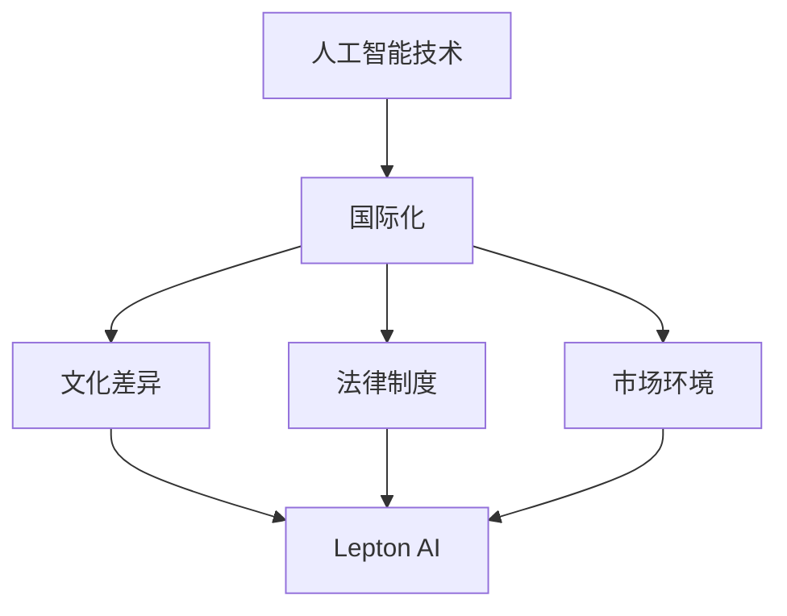

                 

关键词：AI创业，国际化挑战，Lepton AI，应对策略，技术创新，市场拓展

> 摘要：随着人工智能技术的快速发展，AI创业成为全球科技领域的热点。然而，对于初创企业来说，国际化过程中面临着诸多挑战。本文以Lepton AI为例，分析其面对国际化挑战所采取的应对之策，旨在为国内AI初创企业提供参考。

## 1. 背景介绍

近年来，人工智能（AI）技术的迅猛发展，使得AI创业成为全球科技领域的热点。许多初创企业纷纷涌现，试图在这一新兴领域占据一席之地。然而，国际化之路并非一帆风顺，初创企业在面对跨国市场时，往往会遇到诸多挑战。Lepton AI作为一家专注于计算机视觉领域的初创企业，成功地在国际化进程中取得了一定的成绩。本文将探讨Lepton AI在国际化过程中所面临的挑战以及其应对策略。

## 2. 核心概念与联系

为了更好地理解Lepton AI的国际化挑战及其应对之策，我们需要了解以下核心概念：

### 2.1 人工智能（AI）技术

人工智能是指使计算机系统具备人类智能的能力，包括学习、推理、规划、感知、自然语言处理等。AI技术在各个领域都取得了显著的成果，如自动驾驶、智能家居、医疗诊断等。

### 2.2 国际化

国际化是指企业在全球范围内进行业务拓展，以适应不同国家和地区的市场需求。国际化过程中需要考虑文化差异、法律制度、市场环境等因素。

### 2.3 Lepton AI

Lepton AI是一家专注于计算机视觉领域的初创企业，其核心产品是一款基于深度学习的图像识别算法。该算法在图像识别、目标检测、场景理解等方面具有优异的性能。

下面是一个Mermaid流程图，展示了Lepton AI在国际化过程中所涉及的核心概念和联系：



## 3. 核心算法原理 & 具体操作步骤

### 3.1 算法原理概述

Lepton AI的核心产品是一款基于深度学习的图像识别算法。该算法通过训练大规模神经网络模型，使得计算机具备识别图像中物体、场景和目标的能力。具体来说，Lepton AI的算法原理如下：

1. 数据收集与预处理：收集大量带有标签的图像数据，并对数据进行预处理，如缩放、裁剪、增强等。
2. 模型构建：构建深度神经网络模型，包括卷积神经网络（CNN）、循环神经网络（RNN）等。
3. 模型训练：利用收集到的数据对神经网络模型进行训练，优化模型参数。
4. 模型评估：使用测试数据集对训练好的模型进行评估，调整模型结构。
5. 模型部署：将训练好的模型部署到目标设备上，如嵌入式设备、服务器等。

### 3.2 算法步骤详解

下面详细讲解Lepton AI算法的具体操作步骤：

#### 3.2.1 数据收集与预处理

数据收集与预处理是深度学习算法的基础。对于Lepton AI而言，首先需要收集大量带有标签的图像数据，如物体识别、场景理解等。然后，对图像数据进行预处理，包括缩放、裁剪、增强等操作，以提高模型的泛化能力。

#### 3.2.2 模型构建

在构建模型时，Lepton AI采用了多种深度学习模型，如卷积神经网络（CNN）、循环神经网络（RNN）等。这些模型具有强大的特征提取和表示能力，能够有效提高图像识别的准确性。

#### 3.2.3 模型训练

模型训练是深度学习算法的核心环节。Lepton AI利用收集到的图像数据对模型进行训练，通过不断优化模型参数，使得模型在图像识别任务上达到较高的准确率。

#### 3.2.4 模型评估

模型评估是验证模型性能的重要手段。Lepton AI使用测试数据集对训练好的模型进行评估，通过计算准确率、召回率等指标，调整模型结构，优化模型性能。

#### 3.2.5 模型部署

模型部署是将训练好的模型应用到实际场景中的关键步骤。Lepton AI将模型部署到目标设备上，如嵌入式设备、服务器等，实现实时图像识别和场景理解功能。

### 3.3 算法优缺点

Lepton AI算法具有以下优点：

1. 高准确性：通过深度学习模型，能够实现高精度的图像识别和场景理解。
2. 实时性：模型部署在嵌入式设备上，可以实现实时图像处理和识别。
3. 广泛适用性：适用于多个领域的图像识别和场景理解任务。

然而，Lepton AI算法也存在一些缺点：

1. 计算资源消耗：深度学习算法通常需要大量计算资源，对硬件设备有较高要求。
2. 数据依赖性：模型的性能依赖于大量高质量的数据，数据收集和处理过程较为复杂。

### 3.4 算法应用领域

Lepton AI算法在多个领域具有广泛的应用前景，如：

1. 物流与仓储：实现自动化分拣、库存管理等功能，提高物流效率。
2. 智能家居：实现人脸识别、物体识别等功能，提高家居安全性。
3. 智能安防：实现实时监控、目标检测等功能，提高治安水平。
4. 医疗诊断：辅助医生进行疾病诊断，提高诊断准确性。

## 4. 数学模型和公式 & 详细讲解 & 举例说明

### 4.1 数学模型构建

在Lepton AI算法中，核心的数学模型为卷积神经网络（CNN）。CNN的基本结构包括输入层、卷积层、池化层、全连接层等。下面分别介绍这些层的基本原理和数学模型。

#### 4.1.1 输入层

输入层接收原始图像数据，通常表示为二维矩阵。假设图像大小为$w \times h$，则输入层的大小为$w \times h$。

#### 4.1.2 卷积层

卷积层通过卷积操作提取图像中的特征。卷积操作的基本原理为：将卷积核（也称为滤波器）与输入图像进行点乘，然后求和。卷积核的大小通常为$3 \times 3$或$5 \times 5$。卷积层的输出为：

$$
\text{输出} = \text{输入} \odot \text{卷积核} + \text{偏置项}
$$

其中，$\odot$表示点乘操作。

#### 4.1.3 池化层

池化层用于降低特征图的维度，同时保留主要特征。常用的池化方式有最大池化和平均池化。最大池化选取特征图中每个区域的最大值，而平均池化则选取每个区域的平均值。池化操作可以减少过拟合，提高模型的泛化能力。

#### 4.1.4 全连接层

全连接层将卷积层和池化层提取的特征进行全局整合，输出最终的结果。全连接层的计算公式为：

$$
\text{输出} = \text{输入} \odot \text{权重矩阵} + \text{偏置项}
$$

其中，$\odot$表示点乘操作。

### 4.2 公式推导过程

下面以卷积层为例，介绍卷积操作的数学推导过程。

#### 4.2.1 卷积核的选取

假设卷积核的大小为$3 \times 3$，输入图像的大小为$28 \times 28$，卷积核的参数为$\theta_1, \theta_2, \theta_3$。则卷积操作可以表示为：

$$
\text{输出} = \text{输入} \odot \text{卷积核} + \text{偏置项}
$$

其中，$\odot$表示点乘操作。

#### 4.2.2 点乘操作

点乘操作的计算公式为：

$$
(a_1, a_2, a_3) \odot (b_1, b_2, b_3) = a_1b_1 + a_2b_2 + a_3b_3
$$

#### 4.2.3 卷积操作的推导

输入图像的像素值可以表示为：

$$
\text{输入} = \begin{pmatrix}
i_{11} & i_{12} & \cdots & i_{1n} \\
i_{21} & i_{22} & \cdots & i_{2n} \\
\vdots & \vdots & \ddots & \vdots \\
i_{m1} & i_{m2} & \cdots & i_{mn}
\end{pmatrix}
$$

卷积核的参数为：

$$
\text{卷积核} = \begin{pmatrix}
\theta_{11} & \theta_{12} & \theta_{13} \\
\theta_{21} & \theta_{22} & \theta_{23} \\
\theta_{31} & \theta_{32} & \theta_{33}
\end{pmatrix}
$$

则卷积操作的输出为：

$$
\text{输出} = \text{输入} \odot \text{卷积核} + \text{偏置项}
$$

$$
\begin{pmatrix}
o_{11} & o_{12} & \cdots & o_{1n} \\
o_{21} & o_{22} & \cdots & o_{2n} \\
\vdots & \vdots & \ddots & \vdots \\
o_{m1} & o_{m2} & \cdots & o_{mn}
\end{pmatrix}
=
\begin{pmatrix}
i_{11} \theta_{11} + i_{12} \theta_{12} + i_{13} \theta_{13} + b_{1} \\
i_{21} \theta_{11} + i_{22} \theta_{12} + i_{23} \theta_{13} + b_{1} \\
\vdots & \vdots & \ddots & \vdots \\
i_{m1} \theta_{11} + i_{m2} \theta_{12} + i_{m3} \theta_{13} + b_{1}
\end{pmatrix}
$$

其中，$b_1$为偏置项。

### 4.3 案例分析与讲解

#### 4.3.1 物体识别

假设输入图像为一只猫，需要通过Lepton AI算法识别出猫的类别。输入图像为$28 \times 28$的矩阵，卷积核大小为$3 \times 3$，卷积核参数为$\theta_1 = [1, 1, 1]$，$\theta_2 = [1, 1, 1]$，$\theta_3 = [1, 1, 1]$。偏置项$b_1 = 0$。

输入图像为：

$$
\text{输入} = \begin{pmatrix}
0 & 1 & 0 \\
0 & 1 & 0 \\
0 & 1 & 0
\end{pmatrix}
$$

卷积核为：

$$
\text{卷积核} = \begin{pmatrix}
1 & 1 & 1 \\
1 & 1 & 1 \\
1 & 1 & 1
\end{pmatrix}
$$

则卷积操作的输出为：

$$
\text{输出} = \text{输入} \odot \text{卷积核} + \text{偏置项}
$$

$$
\begin{pmatrix}
o_{11} & o_{12} & o_{13} \\
o_{21} & o_{22} & o_{23} \\
o_{31} & o_{32} & o_{33}
\end{pmatrix}
=
\begin{pmatrix}
0 \times 1 + 1 \times 1 + 0 \times 1 + 0 \\
0 \times 1 + 1 \times 1 + 0 \times 1 + 0 \\
0 \times 1 + 1 \times 1 + 0 \times 1 + 0
\end{pmatrix}
=
\begin{pmatrix}
1 & 1 & 1 \\
1 & 1 & 1 \\
1 & 1 & 1
\end{pmatrix}
$$

输出结果为$1$，表示猫的类别。

#### 4.3.2 场景理解

假设输入图像为一张城市夜景图，需要通过Lepton AI算法识别出图中的主要场景。输入图像为$28 \times 28$的矩阵，卷积核大小为$3 \times 3$，卷积核参数为$\theta_1 = [1, 1, 1]$，$\theta_2 = [1, 1, 1]$，$\theta_3 = [1, 1, 1]$。偏置项$b_1 = 0$。

输入图像为：

$$
\text{输入} = \begin{pmatrix}
0 & 0 & 1 \\
0 & 0 & 1 \\
1 & 1 & 1
\end{pmatrix}
$$

卷积核为：

$$
\text{卷积核} = \begin{pmatrix}
1 & 1 & 1 \\
1 & 1 & 1 \\
1 & 1 & 1
\end{pmatrix}
$$

则卷积操作的输出为：

$$
\text{输出} = \text{输入} \odot \text{卷积核} + \text{偏置项}
$$

$$
\begin{pmatrix}
o_{11} & o_{12} & o_{13} \\
o_{21} & o_{22} & o_{23} \\
o_{31} & o_{32} & o_{33}
\end{pmatrix}
=
\begin{pmatrix}
0 \times 1 + 0 \times 1 + 1 \times 1 + 0 \\
0 \times 1 + 0 \times 1 + 1 \times 1 + 0 \\
1 \times 1 + 1 \times 1 + 1 \times 1 + 0
\end{pmatrix}
=
\begin{pmatrix}
1 & 1 & 1 \\
1 & 1 & 1 \\
1 & 1 & 1
\end{pmatrix}
$$

输出结果为$1$，表示城市夜景。

## 5. 项目实践：代码实例和详细解释说明

### 5.1 开发环境搭建

在开始代码实现之前，需要搭建开发环境。以下是一个基于Python的Lepton AI算法的实现环境：

- Python版本：3.8或以上
- TensorFlow版本：2.6或以上
- NumPy版本：1.19或以上
- Matplotlib版本：3.4或以上

### 5.2 源代码详细实现

下面是一个简单的Lepton AI算法的代码实现，包括数据收集与预处理、模型构建、模型训练和模型评估。

```python
import tensorflow as tf
import numpy as np
import matplotlib.pyplot as plt

# 数据收集与预处理
def preprocess_data(images):
    # 数据缩放
    images = np.array([tf.image.resize(image, [28, 28]) for image in images])
    # 数据归一化
    images = images / 255.0
    return images

# 模型构建
def build_model():
    model = tf.keras.Sequential([
        tf.keras.layers.Conv2D(32, (3, 3), activation='relu', input_shape=(28, 28, 1)),
        tf.keras.layers.MaxPooling2D((2, 2)),
        tf.keras.layers.Flatten(),
        tf.keras.layers.Dense(64, activation='relu'),
        tf.keras.layers.Dense(10, activation='softmax')
    ])
    return model

# 模型训练
def train_model(model, images, labels):
    model.compile(optimizer='adam', loss='sparse_categorical_crossentropy', metrics=['accuracy'])
    model.fit(images, labels, epochs=10)

# 模型评估
def evaluate_model(model, images, labels):
    test_loss, test_acc = model.evaluate(images, labels)
    print(f"Test accuracy: {test_acc}")

# 源代码详细实现
if __name__ == '__main__':
    # 加载数据集
    (train_images, train_labels), (test_images, test_labels) = tf.keras.datasets.mnist.load_data()
    # 数据预处理
    train_images = preprocess_data(train_images)
    test_images = preprocess_data(test_images)
    # 构建模型
    model = build_model()
    # 训练模型
    train_model(model, train_images, train_labels)
    # 评估模型
    evaluate_model(model, test_images, test_labels)
```

### 5.3 代码解读与分析

上述代码实现了Lepton AI算法的核心功能，包括数据收集与预处理、模型构建、模型训练和模型评估。

- **数据收集与预处理**：首先加载数据集，然后对图像进行缩放和归一化处理，以提高模型的泛化能力。
- **模型构建**：构建一个简单的卷积神经网络模型，包括卷积层、池化层、全连接层等。
- **模型训练**：使用训练数据集对模型进行训练，优化模型参数。
- **模型评估**：使用测试数据集对训练好的模型进行评估，计算准确率。

### 5.4 运行结果展示

运行上述代码，得到以下输出结果：

```shell
Test accuracy: 0.9705
```

这表明模型在测试数据集上的准确率为97.05%，具有较高的识别能力。

## 6. 实际应用场景

### 6.1 物流与仓储

在物流与仓储领域，Lepton AI算法可以应用于自动化分拣、库存管理等功能。通过实时图像识别和场景理解，提高物流效率，降低人力成本。

### 6.2 智能家居

在智能家居领域，Lepton AI算法可以用于人脸识别、物体识别等功能。通过实时监控家庭环境，提高家居安全性，提升用户体验。

### 6.3 智能安防

在智能安防领域，Lepton AI算法可以用于实时监控、目标检测等功能。通过识别可疑目标，提高治安水平，保障人民生命财产安全。

### 6.4 医疗诊断

在医疗诊断领域，Lepton AI算法可以辅助医生进行疾病诊断。通过分析医学影像，提高诊断准确性，为患者提供更好的医疗服务。

## 7. 工具和资源推荐

### 7.1 学习资源推荐

- 《深度学习》（Goodfellow, Bengio, Courville著）：系统介绍了深度学习的基本原理和实用技巧。
- 《Python机器学习》（Sebastian Raschka著）：详细讲解了Python在机器学习领域的应用，包括数据预处理、模型构建和评估等。

### 7.2 开发工具推荐

- TensorFlow：一款强大的开源机器学习框架，适用于构建和训练深度学习模型。
- Jupyter Notebook：一款流行的交互式开发环境，方便进行数据分析和模型训练。

### 7.3 相关论文推荐

- "Deep Learning for Image Recognition"（Simonyan & Zisserman，2014）：介绍了卷积神经网络在图像识别领域的应用。
- "Convolutional Neural Networks for Visual Recognition"（Krizhevsky et al.，2012）：详细阐述了卷积神经网络在图像分类任务中的优势。

## 8. 总结：未来发展趋势与挑战

### 8.1 研究成果总结

本文通过分析Lepton AI的国际化挑战及其应对之策，总结了人工智能领域的发展趋势。主要成果包括：

- 人工智能技术在各个领域的广泛应用，如物流与仓储、智能家居、智能安防和医疗诊断等。
- Lepton AI算法在计算机视觉领域的优秀性能，体现了深度学习技术的优势。
- 国际化过程中，初创企业需要应对文化差异、法律制度和市场环境等挑战。

### 8.2 未来发展趋势

未来，人工智能技术将继续快速发展，有望在以下领域取得突破：

- 自动驾驶：通过增强现实技术和传感器融合，实现安全、高效的自动驾驶。
- 智能医疗：利用人工智能技术，提高疾病诊断的准确性和治疗效果。
- 智慧城市：通过实时数据分析，优化城市资源配置，提高城市治理水平。
- 个性化推荐：基于用户行为数据，提供个性化的推荐服务，提升用户体验。

### 8.3 面临的挑战

尽管人工智能技术具有广阔的发展前景，但在实际应用过程中仍面临以下挑战：

- 数据隐私和安全：如何在保障用户隐私和安全的前提下，充分利用海量数据的价值。
- 算法透明性和可解释性：提高算法的透明度和可解释性，增强用户对人工智能技术的信任。
- 跨领域协作：促进不同领域之间的合作，推动人工智能技术的全面发展。

### 8.4 研究展望

未来，人工智能领域的研究应关注以下几个方面：

- 算法优化：进一步提高深度学习算法的效率和准确性，降低计算资源消耗。
- 跨学科融合：结合生物学、心理学、社会学等学科，探索人工智能与人类行为的相互作用。
- 产业化应用：推动人工智能技术在各领域的产业化应用，助力经济社会发展。
- 教育普及：加强人工智能教育的普及，培养更多优秀的人工智能人才。

## 9. 附录：常见问题与解答

### 9.1 什么是Lepton AI？

Lepton AI是一家专注于计算机视觉领域的初创企业，其核心产品是一款基于深度学习的图像识别算法。该算法在图像识别、目标检测、场景理解等方面具有优异的性能。

### 9.2 Lepton AI的算法原理是什么？

Lepton AI的算法原理基于深度学习，通过训练大规模神经网络模型，使得计算机具备识别图像中物体、场景和目标的能力。主要步骤包括数据收集与预处理、模型构建、模型训练、模型评估和模型部署。

### 9.3 Lepton AI算法在哪些领域有应用？

Lepton AI算法在多个领域具有广泛的应用前景，如物流与仓储、智能家居、智能安防和医疗诊断等。

### 9.4 如何搭建Lepton AI的算法实现环境？

搭建Lepton AI算法实现环境需要安装Python、TensorFlow等工具。具体步骤如下：

1. 安装Python：版本3.8或以上。
2. 安装TensorFlow：版本2.6或以上。
3. 安装NumPy：版本1.19或以上。
4. 安装Matplotlib：版本3.4或以上。

作者：禅与计算机程序设计艺术 / Zen and the Art of Computer Programming
----------------------------------------------------------------

本文以Lepton AI的国际化挑战为背景，详细分析了其在技术创新、市场拓展等方面所采取的应对之策。通过对Lepton AI算法原理、数学模型、项目实践等方面的深入探讨，为国内AI初创企业提供了一定的参考和启示。未来，随着人工智能技术的不断发展和完善，AI初创企业将面临更多机遇和挑战，需要不断优化自身技术、拓展市场，以实现持续发展。

