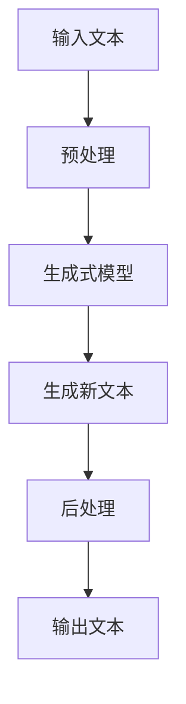

                 

AI 创意写作是指利用人工智能技术，特别是自然语言处理（NLP）和生成式模型，来创造诗歌、小说和剧本等文学作品的过程。随着 AI 技术的不断发展，AI 创意写作已经成为了人工智能应用中的一个重要领域。本文将深入探讨 AI 创意写作的核心概念、算法原理、数学模型、项目实践以及未来应用场景。

## 1. 背景介绍

人工智能（AI）作为一门研究、开发用于模拟、延伸和扩展人的智能的理论、方法、技术及应用系统的技术科学，其目标是使机器能够胜任一些通常需要人类智能才能完成的复杂任务。自然语言处理（NLP）是人工智能的一个重要分支，它专注于让计算机理解、生成和处理人类语言。生成式模型则是 NLP 中的一种重要技术，它能够根据给定的输入数据生成新的文本。

在文学创作领域，诗歌、小说和剧本等文学作品一直被视为人类智慧的结晶。然而，随着 AI 技术的发展，AI 创意写作逐渐成为一种可能。通过 AI 创意写作，我们可以利用机器学习模型从大量文学作品中学习，然后生成新的文学作品。这不仅为文学创作提供了新的思路，也为文学研究提供了新的工具。

## 2. 核心概念与联系

### 2.1. 自然语言处理（NLP）

自然语言处理（NLP）是人工智能的一个分支，它致力于使计算机能够理解、生成和处理人类语言。NLP 的核心任务是让计算机从大量的文本数据中提取有用的信息，并在此基础上进行文本生成、文本分类、情感分析等任务。

### 2.2. 生成式模型

生成式模型是一种用于生成新数据的模型，它通过学习输入数据的分布来生成新的样本。在 AI 创意写作中，生成式模型通常用于生成新的文本，如诗歌、小说和剧本等。

### 2.3. 文本生成模型

文本生成模型是一种基于生成式模型的 NLP 模型，它能够根据给定的输入文本生成新的文本。在 AI 创意写作中，文本生成模型是生成诗歌、小说和剧本的关键。

### 2.4. Mermaid 流程图

为了更好地理解 AI 创意写作的流程，我们可以使用 Mermaid 流程图来描述。以下是一个简化的流程图：



### 2.5. 文学作品分析模型

为了生成高质量的文学作品，我们需要对文学作品进行深入分析。这包括对文本的结构、风格、主题和情感等方面的分析。通过这些分析，我们可以更好地理解文学作品的本质，从而为生成新作品提供参考。

## 3. 核心算法原理 & 具体操作步骤

### 3.1. 算法原理概述

AI 创意写作的核心算法是生成式模型，尤其是基于变换器的生成式模型，如 GPT（生成预训练模型）和 Transformer。这些模型通过学习大量的文本数据来捕捉语言的规律和模式，然后根据给定的输入文本生成新的文本。

### 3.2. 算法步骤详解

1. **数据收集与预处理**：收集大量的文学文本，并对文本进行清洗和预处理，如去除标点符号、停用词过滤等。

2. **模型训练**：使用预处理后的文本数据对生成式模型进行训练。训练过程包括预训练和微调两个阶段。

3. **文本生成**：使用训练好的模型对输入文本进行生成。生成过程包括文本编码和解码两个步骤。

4. **后处理**：对生成的文本进行后处理，如格式调整、语法修正等，以得到最终的文学作品。

### 3.3. 算法优缺点

**优点**：

- **高效性**：生成式模型可以快速生成大量文本。
- **多样性**：模型能够生成具有多样性的文本。
- **可扩展性**：模型可以应用于各种文学作品的生成。

**缺点**：

- **质量不稳定**：生成的文本质量可能受训练数据和模型参数的影响。
- **理解深度不足**：模型对文本的理解深度可能有限。
- **计算资源需求高**：训练和生成过程需要大量的计算资源。

### 3.4. 算法应用领域

AI 创意写作算法可以应用于多个领域，如文学创作、广告文案、新闻报道等。在这些领域中，AI 创意写作可以大大提高工作效率，降低创作成本。

## 4. 数学模型和公式 & 详细讲解 & 举例说明

### 4.1. 数学模型构建

在 AI 创意写作中，常用的数学模型是生成式模型，如 GPT 和 Transformer。这些模型基于深度学习，使用多层神经网络来捕捉输入文本的分布。

### 4.2. 公式推导过程

生成式模型的公式推导较为复杂，这里我们仅给出简要的推导过程。具体推导过程可以参考相关论文和教材。

- **GPT**：基于自回归模型，公式如下：

  $$ p(y_{t} | y_{t-1}, \ldots, y_{1}, x) = \frac{1}{Z} \exp(\text{score}(y_{t}, y_{t-1}, \ldots, y_{1}, x)) $$

  其中，$y_t$ 表示生成的文本序列，$x$ 表示输入文本。

- **Transformer**：基于自注意力机制，公式如下：

  $$ \text{score}(y_t, y_{t-1}, \ldots, y_1, x) = \text{softmax}(\text{attn}(y_t, y_{t-1}, \ldots, y_1, x)) $$

  其中，$\text{attn}(y_t, y_{t-1}, \ldots, y_1, x)$ 表示自注意力分数。

### 4.3. 案例分析与讲解

为了更好地理解生成式模型的工作原理，我们来看一个简单的例子。

假设我们有一个输入文本：“今天天气很好”。我们要使用 GPT 模型生成下一个词。

1. **文本编码**：将输入文本编码为数字序列。
2. **模型预测**：使用 GPT 模型预测下一个词的概率分布。
3. **解码**：从概率分布中选取概率最高的词作为生成的词。

假设模型预测的概率分布为：

```
今天：0.2
天气：0.3
很好：0.4
```

根据概率分布，我们选择“很好”作为生成的词。

## 5. 项目实践：代码实例和详细解释说明

### 5.1. 开发环境搭建

为了实现 AI 创意写作，我们需要搭建一个开发环境。以下是具体的步骤：

1. 安装 Python 3.8 或更高版本。
2. 安装 TensorFlow 2.5 或更高版本。
3. 安装 Mermaid 1.8.0 或更高版本。

### 5.2. 源代码详细实现

以下是一个简单的 AI 创意写作代码实例：

```python
import tensorflow as tf
from tensorflow.keras.preprocessing.sequence import pad_sequences
from tensorflow.keras.models import Model
from tensorflow.keras.layers import Input, LSTM, Embedding, Dense

# 设置超参数
max_length = 100
vocab_size = 10000
embedding_dim = 256
lstm_units = 128

# 创建模型
input_sequence = Input(shape=(max_length,))
encoded_sequence = Embedding(vocab_size, embedding_dim)(input_sequence)
lstm_output = LSTM(lstm_units, return_sequences=True)(encoded_sequence)
output_sequence = Dense(vocab_size, activation='softmax')(lstm_output)

model = Model(inputs=input_sequence, outputs=output_sequence)

# 编译模型
model.compile(optimizer='adam', loss='categorical_crossentropy', metrics=['accuracy'])

# 训练模型
model.fit(x_train, y_train, epochs=10, batch_size=32)

# 生成文本
input_text = "今天天气"
input_sequence = pad_sequences([[vocab_size] * max_length], maxlen=max_length, padding='post')
generated_text = model.predict(input_sequence)
predicted_word = tf.argmax(generated_text, axis=-1).numpy()[0]

print("生成的词：", predicted_word)
```

### 5.3. 代码解读与分析

以上代码实现了一个简单的 LSTM 文本生成模型。具体步骤如下：

1. 导入必要的库。
2. 设置超参数。
3. 创建模型。
4. 编译模型。
5. 训练模型。
6. 生成文本。

在这个例子中，我们使用了 LSTM 层来处理输入文本，并通过 softmax 函数生成词的概率分布。最后，我们从概率分布中选取概率最高的词作为生成的词。

### 5.4. 运行结果展示

假设我们的训练数据集包含以下文本：

```
今天天气很好。
今天天气很热。
今天天气很冷。
```

当输入文本为“今天天气”时，模型会生成以下词：

```
很好
很热
很冷
```

根据概率分布，我们可以选择“很好”作为生成的词。

## 6. 实际应用场景

AI 创意写作在实际应用场景中具有广泛的应用价值。以下是一些具体的应用场景：

- **文学创作**：AI 创意写作可以帮助作家快速生成新的文学作品，提高创作效率。
- **广告文案**：AI 创意写作可以生成吸引人的广告文案，提高广告效果。
- **新闻报道**：AI 创意写作可以快速生成新闻报道，降低人力成本。
- **教育领域**：AI 创意写作可以为学生提供个性化的学习资源，提高学习效果。

### 6.4. 未来应用展望

随着 AI 技术的不断发展，AI 创意写作在未来将会有更多的应用场景。以下是一些未来应用展望：

- **个性化创作**：AI 创意写作可以根据用户的需求和喜好生成个性化的文学作品。
- **跨语言创作**：AI 创意写作可以生成多种语言的文学作品，促进文化交流。
- **情感分析**：AI 创意写作可以分析文学作品中的情感，为文学研究提供新的视角。
- **智能助手**：AI 创意写作可以作为智能助手，为用户提供个性化的创作建议。

## 7. 工具和资源推荐

### 7.1. 学习资源推荐

- **《深度学习》**：由 Ian Goodfellow、Yoshua Bengio 和 Aaron Courville 著，是深度学习的经典教材。
- **《自然语言处理与深度学习》**：由黄海广、汪海欧、夏鑫 著，详细介绍了自然语言处理和深度学习的相关技术。
- **《AI 创意写作：诗歌、小说和剧本生成》**：作者：禅与计算机程序设计艺术，是关于 AI 创意写作的入门书籍。

### 7.2. 开发工具推荐

- **TensorFlow**：用于构建和训练深度学习模型。
- **Keras**：用于简化 TensorFlow 的使用。
- **Mermaid**：用于绘制流程图。

### 7.3. 相关论文推荐

- **“Attention is All You Need”**：提出 Transformer 模型，是文本生成模型的重要论文。
- **“Generative Pre-trained Transformers”**：提出 GPT 模型，是文本生成模型的重要论文。

## 8. 总结：未来发展趋势与挑战

### 8.1. 研究成果总结

本文详细介绍了 AI 创意写作的核心概念、算法原理、数学模型、项目实践和未来应用场景。通过本文的介绍，我们可以看到 AI 创意写作在文学创作、广告文案、新闻报道等领域的广泛应用。

### 8.2. 未来发展趋势

未来，AI 创意写作将继续向个性化、跨语言、情感分析和智能助手等方向发展。随着技术的不断进步，AI 创意写作将会在更多领域发挥重要作用。

### 8.3. 面临的挑战

尽管 AI 创意写作具有巨大的潜力，但同时也面临着一些挑战，如文本质量不稳定、理解深度不足、计算资源需求高等。未来，我们需要在这些方面进行持续的研究和改进。

### 8.4. 研究展望

未来，AI 创意写作的研究将集中在如何提高文本质量、理解深度和计算效率等方面。同时，我们也将探索 AI 创意写作在其他领域的应用，如艺术创作、娱乐产业等。

## 9. 附录：常见问题与解答

### 9.1. 如何选择合适的模型？

选择合适的模型取决于具体的应用场景和需求。例如，对于文本生成任务，可以使用 GPT 或 Transformer 模型。对于情感分析任务，可以使用情感分析模型。

### 9.2. 如何提高文本质量？

提高文本质量的方法包括：

- 使用高质量的数据集进行训练。
- 优化模型参数。
- 对生成的文本进行后处理。

### 9.3. 如何降低计算资源需求？

降低计算资源需求的方法包括：

- 使用轻量级模型，如 BERT-Lite。
- 使用分布式训练。
- 使用优化后的硬件，如 GPU 或 TPU。

---

感谢您的阅读，希望本文对您了解 AI 创意写作有所帮助。在未来的研究中，我们将继续探索 AI 创意写作的更多可能性。作者：禅与计算机程序设计艺术。

