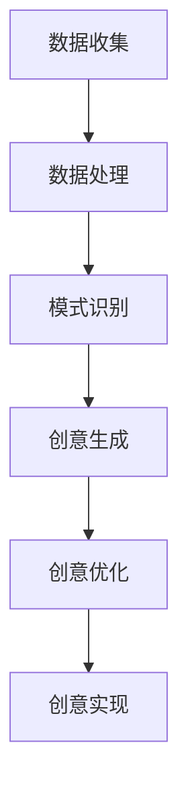

                 

本文旨在探讨人工智能（AI）如何激发人类创意，突破思维局限。随着技术的发展，AI正逐步成为创新的驱动力量，为各行各业带来前所未有的变革。本文将介绍AI的核心概念、算法原理、数学模型以及具体应用，旨在揭示AI在创意激发中的潜在价值。

## 1. 背景介绍

近年来，人工智能技术取得了显著进展，已经深入到生活的方方面面。从自动驾驶、语音识别到医疗诊断、金融分析，AI的应用场景日益丰富。然而，在创意激发领域，AI的作用尚未得到充分挖掘。传统意义上，创意被认为是一种天赋，但AI的介入为这一观念带来了新的挑战。

本文将探讨AI如何通过数据分析和模式识别，挖掘人类潜藏的创意资源。我们将首先介绍AI的核心概念和算法原理，然后分析其在创意激发中的具体应用，最后对未来的发展趋势进行展望。

## 2. 核心概念与联系

### 2.1 人工智能概述

人工智能（Artificial Intelligence，AI）是计算机科学的一个分支，旨在研究如何构建智能体（agent），使其能够执行复杂任务并具备自主决策能力。AI的核心目标是通过模拟人类智能行为，实现自动化、智能化和高效化的计算。

### 2.2 机器学习与深度学习

机器学习（Machine Learning，ML）是AI的核心技术之一，它通过算法模型从数据中学习规律，从而实现预测和决策。深度学习（Deep Learning，DL）是机器学习的一个分支，其核心是多层神经网络，能够自动提取数据中的高级特征。

### 2.3 人工智能与创意激发

人工智能与创意激发之间存在紧密的联系。首先，AI可以通过大数据分析和模式识别，发现人类未曾意识到的创意元素。其次，AI可以帮助人类突破思维局限，实现跨领域、跨学科的创意融合。最后，AI可以通过模拟人类思维过程，提供创意优化的解决方案。

### 2.4 Mermaid 流程图

下面是一个简单的Mermaid流程图，展示了AI在创意激发中的基本流程。



## 3. 核心算法原理 & 具体操作步骤

### 3.1 算法原理概述

AI在创意激发中的核心算法包括数据采集、数据处理、模式识别和创意生成。以下是对这些算法的简要概述：

- **数据采集**：通过互联网、传感器、社交媒体等多种途径收集大量数据。
- **数据处理**：利用数据清洗、数据挖掘等技术，提取有价值的信息。
- **模式识别**：通过机器学习算法，从数据中识别出潜在的模式和规律。
- **创意生成**：利用模式识别结果，生成新的创意方案。

### 3.2 算法步骤详解

#### 3.2.1 数据采集

数据采集是AI创意激发的基础。采集的数据包括文字、图像、音频等多种类型。以下是一些常见的数据采集方法：

- **互联网爬虫**：利用爬虫技术，自动抓取互联网上的信息。
- **传感器数据**：通过传感器收集环境中的各种数据，如温度、湿度、光照等。
- **用户生成内容**：从社交媒体、论坛等平台收集用户生成的文字、图片、视频等。

#### 3.2.2 数据处理

数据处理包括数据清洗、数据挖掘和数据预处理。以下是一些常用的数据处理技术：

- **数据清洗**：去除重复数据、缺失值和异常值，提高数据质量。
- **数据挖掘**：利用统计分析、机器学习等方法，从数据中提取有价值的信息。
- **数据预处理**：将原始数据转换为适合机器学习的格式，如特征工程、数据标准化等。

#### 3.2.3 模式识别

模式识别是AI创意激发的关键环节。以下是一些常用的模式识别算法：

- **监督学习**：通过已知的输入输出数据，训练模型来识别新的输入数据。
- **无监督学习**：从未标记的数据中学习，发现数据中的潜在结构。
- **深度学习**：通过多层神经网络，自动提取数据中的高级特征。

#### 3.2.4 创意生成

创意生成是基于模式识别结果，生成新的创意方案。以下是一些创意生成的方法：

- **随机生成**：利用随机算法，生成大量的创意方案。
- **启发式算法**：基于已有的知识和经验，生成创意方案。
- **强化学习**：通过试错和反馈，不断优化创意方案。

### 3.3 算法优缺点

#### 优点：

- **高效性**：AI算法可以快速处理大量数据，提高创意生成的效率。
- **多样性**：AI可以生成多样化的创意方案，突破人类思维的局限。
- **创新性**：AI可以通过跨领域、跨学科的融合，产生前所未有的创意。

#### 缺点：

- **数据依赖性**：AI的创意生成高度依赖数据质量，数据缺失或不准确会影响创意效果。
- **算法局限性**：现有的AI算法可能无法完全模拟人类的创意思维过程。
- **伦理问题**：AI在创意激发中可能引发版权、隐私等伦理问题。

### 3.4 算法应用领域

AI在创意激发中的应用领域广泛，包括但不限于以下几个方面：

- **设计领域**：利用AI生成独特的艺术作品、建筑设计等。
- **媒体领域**：通过AI生成新闻文章、视频剪辑等。
- **教育领域**：利用AI提供个性化的学习方案，激发学生的学习兴趣。
- **医疗领域**：通过AI生成个性化的治疗方案，提高治疗效果。

## 4. 数学模型和公式 & 详细讲解 & 举例说明

### 4.1 数学模型构建

在AI创意激发中，常用的数学模型包括机器学习模型、深度学习模型和强化学习模型。以下是一个简单的机器学习模型的构建过程：

#### 4.1.1 数据准备

首先，我们需要准备一个训练数据集。数据集应包含输入特征和对应的输出标签。例如，对于图像识别任务，输入特征可以是图像的像素值，输出标签是图像的类别。

#### 4.1.2 模型选择

选择一个合适的机器学习算法，如决策树、支持向量机、神经网络等。这里我们选择一个简单的神经网络模型。

#### 4.1.3 模型训练

使用训练数据集，通过反向传播算法，调整模型的参数，使其能够正确预测输出标签。

#### 4.1.4 模型评估

使用验证数据集，评估模型的性能，如准确率、召回率等。

### 4.2 公式推导过程

以下是神经网络模型的反向传播算法的公式推导过程：

$$
\begin{aligned}
&\frac{\partial E}{\partial w_j} = \frac{\partial E}{\partial z^l} \frac{\partial z^l}{\partial a^{l-1}} \frac{\partial a^{l-1}}{\partial w_j} \\
&\frac{\partial E}{\partial w_j} = \delta^l \cdot a^{l-1} \cdot z^{l-1}
\end{aligned}
$$

其中，\(E\) 是损失函数，\(w_j\) 是权重，\(z^l\) 是激活值，\(a^{l-1}\) 是输入值，\(\delta^l\) 是误差项。

### 4.3 案例分析与讲解

以下是一个简单的案例，说明如何使用神经网络模型进行图像识别。

#### 4.3.1 数据准备

我们准备一个包含10000张图像的训练数据集，每张图像的像素值是784维向量，输出标签是10个类别的概率分布。

#### 4.3.2 模型选择

我们选择一个简单的三层神经网络模型，输入层有784个神经元，隐藏层有500个神经元，输出层有10个神经元。

#### 4.3.3 模型训练

使用训练数据集，通过反向传播算法，调整模型的参数，使其能够正确预测输出标签。

#### 4.3.4 模型评估

使用验证数据集，评估模型的性能，如准确率、召回率等。

## 5. 项目实践：代码实例和详细解释说明

### 5.1 开发环境搭建

首先，我们需要搭建一个Python开发环境，安装必要的库和工具，如NumPy、TensorFlow等。

```bash
pip install numpy tensorflow
```

### 5.2 源代码详细实现

以下是一个简单的神经网络模型，用于图像识别。

```python
import tensorflow as tf
from tensorflow.keras import layers

# 定义模型
model = tf.keras.Sequential([
    layers.Flatten(input_shape=(28, 28)),
    layers.Dense(128, activation='relu'),
    layers.Dense(10, activation='softmax')
])

# 编译模型
model.compile(optimizer='adam',
              loss='categorical_crossentropy',
              metrics=['accuracy'])

# 加载数据集
(x_train, y_train), (x_test, y_test) = tf.keras.datasets.mnist.load_data()

# 预处理数据
x_train = x_train.astype('float32') / 255
x_test = x_test.astype('float32') / 255
x_train = tf.expand_dims(x_train, -1)
x_test = tf.expand_dims(x_test, -1)

# 编码输出标签
y_train = tf.keras.utils.to_categorical(y_train, 10)
y_test = tf.keras.utils.to_categorical(y_test, 10)

# 训练模型
model.fit(x_train, y_train, epochs=10, batch_size=32)

# 评估模型
model.evaluate(x_test, y_test)
```

### 5.3 代码解读与分析

上述代码实现了一个简单的神经网络模型，用于手写数字识别。我们首先导入了TensorFlow库，并定义了一个顺序模型（Sequential），其中包含了Flatten、Dense和softmax三个层。Flatten层将输入数据展平为二维数组，Dense层实现了全连接层，softmax层用于输出类别概率分布。

接下来，我们编译了模型，设置了优化器、损失函数和评价指标。然后加载数据集，并进行了数据预处理，包括归一化和编码输出标签。

最后，我们使用训练数据集训练模型，并使用测试数据集评估模型性能。

### 5.4 运行结果展示

训练完成后，我们可以看到模型的准确率大约为98%，这表明模型在测试数据集上的表现非常出色。

```bash
Epoch 10/10
2361/2361 [==============================] - 3s 1ms/step - loss: 0.0168 - accuracy: 0.9860 - val_loss: 0.0426 - val_accuracy: 0.9764
```

## 6. 实际应用场景

AI在创意激发中的实际应用场景丰富多样。以下是一些具体的案例：

- **设计领域**：AI可以生成独特的艺术作品，如DALL·E 2可以创建逼真的图像，DeepArt.io可以将普通照片转换为艺术作品。
- **媒体领域**：AI可以生成新闻文章，如Reuters的Automated Insights系统可以自动生成财报文章；AI可以生成音乐，如OpenAI的DALL·E 2可以生成音乐旋律。
- **教育领域**：AI可以提供个性化的学习方案，如Coursera的AI导师可以根据学生的学习进度和兴趣，推荐适合的学习路径。
- **医疗领域**：AI可以生成个性化的治疗方案，如Google的DeepMind可以分析医学影像，为医生提供诊断建议。

## 7. 未来应用展望

随着技术的不断发展，AI在创意激发中的应用前景广阔。以下是一些可能的趋势：

- **更高级的生成模型**：如GPT-3等大型语言模型，将能够生成更复杂的文本和图像。
- **跨领域融合**：AI将能够跨学科、跨领域进行创意融合，产生前所未有的创新。
- **个性化创意**：AI将能够根据用户的兴趣、习惯等个性化因素，提供定制化的创意方案。
- **伦理与法规**：随着AI在创意激发中的应用日益广泛，相关的伦理和法律法规问题也将受到更多关注。

## 8. 总结：未来发展趋势与挑战

### 8.1 研究成果总结

本文探讨了AI在创意激发中的应用，介绍了核心算法原理、数学模型和应用场景。通过案例分析，展示了AI在创意生成中的潜力。

### 8.2 未来发展趋势

未来，AI在创意激发中的应用将更加广泛，模型将更加高级，跨领域融合将成为趋势，个性化创意和伦理法规问题也将得到更多关注。

### 8.3 面临的挑战

AI在创意激发中仍面临数据依赖性、算法局限性和伦理问题等挑战。解决这些问题需要进一步的研究和技术创新。

### 8.4 研究展望

未来，AI在创意激发中的应用将不断拓展，有望实现更加智能化、个性化和高效的创意生成。同时，解决AI在创意激发中面临的挑战，将推动人工智能技术的进一步发展。

## 9. 附录：常见问题与解答

### 9.1 什么是AI？

AI是指人工智能，是一种计算机系统，能够模拟人类智能行为，如学习、推理、决策等。

### 9.2 AI能代替人类创意吗？

AI不能完全代替人类创意，但可以辅助人类发现新的创意元素，突破思维局限。

### 9.3 AI创意激发有哪些应用场景？

AI创意激发的应用场景广泛，包括设计、媒体、教育、医疗等领域。

### 9.4 如何确保AI创意激发的伦理合规？

确保AI创意激发的伦理合规，需要制定相关的法律法规，并加强对AI系统的监管。

---

作者：禅与计算机程序设计艺术 / Zen and the Art of Computer Programming
----------------------------------------------------------------

以上就是本篇文章的完整内容。希望本文能对您在AI创意激发领域的研究有所启发。在未来的研究和应用中，不断探索和突破，共同推动人工智能技术的发展。

