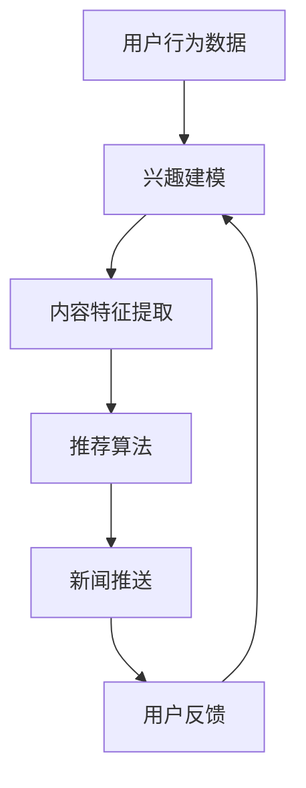

                 

关键词：AI，个性化新闻聚合，定制信息流，推荐系统，算法原理，数学模型，项目实践，应用场景，未来展望。

> 摘要：本文旨在探讨人工智能在个性化新闻聚合中的应用，分析如何通过定制信息流为用户呈现最相关、最有价值的内容。文章首先介绍了个性化新闻聚合的背景和重要性，然后深入讨论了相关核心概念、算法原理、数学模型，并通过实际项目实践展示了技术的应用效果。最后，本文对个性化新闻聚合的未来发展进行了展望，并提出了当前面临的挑战。

## 1. 背景介绍

随着互联网的快速发展，信息的爆炸式增长给人们带来了前所未有的选择困境。如何从海量的信息中迅速筛选出对自己最有价值的内容，成为了现代信息社会中一个亟待解决的问题。个性化新闻聚合系统应运而生，它通过分析用户的兴趣和行为数据，为用户推荐个性化的新闻内容，从而提高用户的阅读体验和信息获取效率。

个性化新闻聚合系统的重要性体现在以下几个方面：

- **提高用户满意度**：通过精确的个性化推荐，用户能够更快地找到自己感兴趣的内容，提高使用体验。
- **提升信息传播效率**：个性化的信息推送有助于信息精准到达目标受众，降低无效传播。
- **促进内容创作者发展**：高质量的个性化推荐有助于创作者的内容得到更多关注和传播，促进内容创作生态的繁荣。

本文将围绕个性化新闻聚合系统的构建，探讨其中的核心概念、算法原理、数学模型以及实际应用。

## 2. 核心概念与联系

### 2.1. 推荐系统

个性化新闻聚合系统本质上是一个推荐系统，其核心目标是通过算法预测用户对某条新闻的喜好程度，并将这些新闻推送给用户。推荐系统通常分为基于内容的推荐和基于协同过滤的推荐。

#### 基于内容的推荐

基于内容的推荐通过分析新闻的文本内容（如关键词、标题、摘要等），将其与用户已读或点赞的新闻内容进行匹配，推荐相似内容的新闻。这种方法的主要优点是推荐结果较为精准，但需要大量高质量的文本数据。

#### 基于协同过滤的推荐

基于协同过滤的推荐通过分析用户之间的相似性，推荐其他用户喜欢的新闻给目标用户。协同过滤分为用户基于的协同过滤和项目基于的协同过滤。用户基于的协同过滤通过计算用户之间的相似度来推荐新闻；项目基于的协同过滤通过分析新闻之间的相似度来推荐。

### 2.2. 个性化

个性化是推荐系统的核心目标。个性化新闻聚合系统通过以下方式实现个性化：

- **用户兴趣建模**：通过用户的历史行为和反馈数据，构建用户兴趣模型，预测用户可能感兴趣的新闻。
- **内容特征提取**：从新闻内容中提取特征，如关键词、情感倾向、主题等，用于推荐算法的输入。
- **实时反馈调整**：根据用户的阅读行为和反馈，动态调整推荐策略，提高推荐的相关性。

### 2.3. Mermaid 流程图

以下是个性化新闻聚合系统的一个简化版Mermaid流程图，展示了核心概念和联系：



### 2.4. 核心概念与联系总结

个性化新闻聚合系统的核心在于通过用户兴趣建模和内容特征提取，结合推荐算法为用户推荐最相关的新闻。通过持续的用户反馈调整，系统能够不断提升推荐的精准度。

## 3. 核心算法原理 & 具体操作步骤

### 3.1. 算法原理概述

个性化新闻聚合系统的核心算法主要包括基于内容的推荐算法和基于协同过滤的推荐算法。以下是这些算法的基本原理：

#### 基于内容的推荐算法

基于内容的推荐算法通过计算新闻内容和用户兴趣之间的相似度，推荐相似内容的新闻。其主要步骤如下：

1. **特征提取**：从新闻内容中提取关键词、主题、情感等特征。
2. **兴趣建模**：根据用户的历史行为，构建用户兴趣模型。
3. **相似度计算**：计算新闻特征与用户兴趣模型之间的相似度。
4. **推荐新闻**：根据相似度排序，推荐最相似的新闻。

#### 基于协同过滤的推荐算法

基于协同过滤的推荐算法通过分析用户之间的相似性或新闻之间的相似性，推荐其他用户喜欢的新闻或相似新闻。其主要步骤如下：

1. **用户相似度计算**：计算用户之间的相似度，通常基于用户的历史行为数据。
2. **新闻相似度计算**：计算新闻之间的相似度，通常基于新闻的文本特征。
3. **推荐新闻**：根据用户相似度或新闻相似度，推荐其他用户喜欢的新闻或相似新闻。

### 3.2. 算法步骤详解

#### 基于内容的推荐算法步骤详解

1. **特征提取**：使用自然语言处理（NLP）技术提取新闻文本中的关键词、主题、情感等特征。常见的特征提取方法包括词袋模型、TF-IDF、词嵌入等。

2. **兴趣建模**：根据用户的历史行为（如点击、点赞、评论等），构建用户兴趣模型。常用的方法包括基于统计模型的兴趣分类和基于深度学习的兴趣提取。

3. **相似度计算**：计算新闻特征与用户兴趣模型之间的相似度。常见的相似度计算方法包括余弦相似度、欧几里得距离等。

4. **推荐新闻**：根据相似度排序，推荐最相似的新闻给用户。

#### 基于协同过滤的推荐算法步骤详解

1. **用户相似度计算**：计算用户之间的相似度。常用的相似度计算方法包括余弦相似度、皮尔逊相关系数等。用户相似度的计算通常基于用户的行为数据，如购买历史、浏览记录等。

2. **新闻相似度计算**：计算新闻之间的相似度。新闻相似度的计算通常基于新闻的文本特征，如关键词、主题、情感等。常用的相似度计算方法包括余弦相似度、欧几里得距离等。

3. **推荐新闻**：根据用户相似度和新闻相似度，推荐其他用户喜欢的新闻或相似新闻。推荐算法可以采用基于用户相似度的推荐和基于新闻相似度的推荐相结合的方法，提高推荐的准确性。

### 3.3. 算法优缺点

#### 基于内容的推荐算法优缺点

**优点**：

- 推荐结果较为精准，能够推荐用户可能感兴趣的新闻。
- 不依赖于用户行为数据，适用于新用户。

**缺点**：

- 需要大量高质量的文本数据，对数据质量要求较高。
- 推荐结果可能过于依赖文本特征，忽略用户实际兴趣。

#### 基于协同过滤的推荐算法优缺点

**优点**：

- 能够根据用户行为数据推荐其他用户喜欢的新闻，具有较高的准确性。
- 能够发现用户之间的相似性，推荐更个性化的新闻。

**缺点**：

- 推荐结果可能过于依赖用户行为数据，忽略新闻内容本身。
- 可能会出现冷启动问题，即新用户没有足够行为数据时无法进行推荐。

### 3.4. 算法应用领域

个性化新闻聚合算法广泛应用于各种场景，包括：

- **新闻门户**：为用户提供个性化的新闻推荐，提高用户留存率和阅读量。
- **社交媒体**：为用户提供个性化内容推荐，增强用户活跃度和互动性。
- **电子商务**：为用户推荐个性化的商品，提高销售转化率。
- **在线教育**：为用户推荐个性化的学习内容，提高学习效果。

### 3.5. 算法总结

个性化新闻聚合算法通过用户兴趣建模、内容特征提取和推荐算法，为用户推荐最相关的新闻。基于内容的推荐算法和基于协同过滤的推荐算法各有优缺点，实际应用中通常采用二者结合的方法，提高推荐效果。

## 4. 数学模型和公式 & 详细讲解 & 举例说明

### 4.1. 数学模型构建

个性化新闻聚合系统的数学模型主要包括用户兴趣模型、新闻特征模型和推荐模型。

#### 用户兴趣模型

用户兴趣模型用于表示用户对不同类别新闻的兴趣程度。常见的用户兴趣模型包括基于统计模型的兴趣分类和基于深度学习的兴趣提取。

1. **基于统计模型的兴趣分类**

   用户兴趣模型可以通过用户历史行为数据（如点击、点赞、评论等）进行统计建模。设用户 \( u \) 对类别 \( c \) 的兴趣程度为 \( i(u, c) \)，可以使用以下公式进行建模：

   $$ i(u, c) = \frac{count(u, c)}{total\_count(u)} $$

   其中，\( count(u, c) \) 表示用户 \( u \) 对类别 \( c \) 的行为次数，\( total\_count(u) \) 表示用户 \( u \) 的总行为次数。

2. **基于深度学习的兴趣提取**

   基于深度学习的兴趣提取可以使用神经网络模型，如卷积神经网络（CNN）或循环神经网络（RNN），从用户的历史行为数据中提取兴趣特征。设用户 \( u \) 的兴趣向量 \( I_u \) 为：

   $$ I_u = \text{Neural\ Network}(B_u) $$

   其中，\( B_u \) 表示用户 \( u \) 的行为序列。

#### 新闻特征模型

新闻特征模型用于表示新闻的文本特征，如关键词、主题、情感等。常见的新闻特征模型包括词袋模型、TF-IDF和词嵌入。

1. **词袋模型**

   词袋模型将新闻文本表示为一个词频向量，设新闻 \( n \) 的特征向量 \( F_n \) 为：

   $$ F_n = (f_{n1}, f_{n2}, ..., f_{nk}) $$

   其中，\( f_{nj} \) 表示词 \( j \) 在新闻 \( n \) 中的词频。

2. **TF-IDF**

   TF-IDF模型通过考虑词频（TF）和词的重要程度（IDF），对词进行加权。设词 \( j \) 在新闻 \( n \) 中的词频为 \( f_{nj} \)，文档集合中的总词频为 \( D \)，词 \( j \) 在新闻集合中的出现次数为 \( df_j \)，则词 \( j \) 的TF-IDF值为：

   $$ tf-idf_{nj} = f_{nj} \times \log(\frac{D}{df_j}) $$

3. **词嵌入**

   词嵌入将词表示为高维向量，常见的方法包括Word2Vec、GloVe等。设词 \( j \) 的词嵌入向量为 \( v_j \)，则新闻 \( n \) 的特征向量 \( F_n \) 为：

   $$ F_n = (v_{n1}, v_{n2}, ..., v_{nk}) $$

#### 推荐模型

推荐模型用于根据用户兴趣模型和新闻特征模型，计算新闻与用户兴趣的相似度，推荐最相关的新闻。常见的推荐模型包括基于内容的推荐和基于协同过滤的推荐。

1. **基于内容的推荐**

   基于内容的推荐通过计算新闻特征与用户兴趣之间的相似度，推荐相似内容的新闻。设新闻 \( n \) 的特征向量 \( F_n \) 和用户 \( u \) 的兴趣向量 \( I_u \) ，则新闻 \( n \) 与用户 \( u \) 的相似度 \( sim(n, u) \) 可以使用余弦相似度计算：

   $$ sim(n, u) = \frac{F_n \cdot I_u}{\|F_n\| \|I_u\|} $$

2. **基于协同过滤的推荐**

   基于协同过滤的推荐通过计算用户之间的相似性或新闻之间的相似性，推荐其他用户喜欢的新闻或相似新闻。设用户 \( u \) 与用户 \( v \) 的相似度 \( sim(u, v) \) 可以使用余弦相似度计算：

   $$ sim(u, v) = \frac{\sum_{n \in N} w_{uv, n} F_n \cdot I_u}{\| \sum_{n \in N} w_{uv, n} F_n \|\| I_u \|} $$

   其中，\( N \) 表示用户 \( u \) 和用户 \( v \) 都有行为记录的新闻集合，\( w_{uv, n} \) 表示新闻 \( n \) 在用户 \( u \) 和用户 \( v \) 之间的权重。

### 4.2. 公式推导过程

本节将详细推导个性化新闻聚合系统中的相关数学公式。

#### 用户兴趣模型推导

1. **基于统计模型的兴趣分类**

   设用户 \( u \) 对类别 \( c \) 的兴趣程度为 \( i(u, c) \)，根据用户的历史行为数据，我们可以定义 \( count(u, c) \) 和 \( total\_count(u) \) 如下：

   $$ count(u, c) = \sum_{n \in N_u} 1_{n \in C_c} $$

   $$ total\_count(u) = \sum_{n \in N_u} 1_{n \in C} $$

   其中，\( N_u \) 表示用户 \( u \) 的行为记录集合，\( C_c \) 表示类别 \( c \) 的新闻集合，\( 1_{n \in C_c} \) 表示如果新闻 \( n \) 属于类别 \( c \)，则取值为1，否则为0。

   将 \( count(u, c) \) 和 \( total\_count(u) \) 代入 \( i(u, c) \) 的定义中，得到：

   $$ i(u, c) = \frac{\sum_{n \in N_u} 1_{n \in C_c}}{\sum_{n \in N_u} 1_{n \in C}} $$

2. **基于深度学习的兴趣提取**

   设用户 \( u \) 的行为序列 \( B_u = (b_1, b_2, ..., b_T) \)，其中 \( b_t \) 表示用户 \( u \) 在时刻 \( t \) 的行为。设深度学习模型的输出为 \( I_u = (i_1, i_2, ..., i_C) \)，其中 \( i_c \) 表示用户 \( u \) 对类别 \( c \) 的兴趣程度。

   根据深度学习模型的设计，我们可以得到 \( i_c \) 的表达式为：

   $$ i_c = \text{Neural\ Network}(b_1, b_2, ..., b_T) $$

#### 新闻特征模型推导

1. **词袋模型**

   设新闻 \( n \) 的词频向量为 \( F_n = (f_{n1}, f_{n2}, ..., f_{nk}) \)，其中 \( f_{nj} \) 表示词 \( j \) 在新闻 \( n \) 中的词频。词频可以通过统计新闻文本中每个词的出现次数得到。

   例如，对于新闻 \( n \)：

   ```
   新闻标题：人工智能在未来会取代人类吗？
   新闻内容：人工智能在各个领域都取得了巨大的进步，但人们仍然担心它会对人类产生负面影响。
   ```

   词频向量为：

   $$ F_n = (1, 1, 1, 1, 1, 1, 0, 0, ..., 0) $$

2. **TF-IDF**

   设词 \( j \) 在新闻 \( n \) 中的词频为 \( f_{nj} \)，文档集合中的总词频为 \( D \)，词 \( j \) 在新闻集合中的出现次数为 \( df_j \)。

   词频 \( f_{nj} \) 可以通过统计新闻文本中每个词的出现次数得到。

   文档集合中的总词频 \( D \) 可以通过统计文档集合中所有词的出现次数得到。

   词 \( j \) 在新闻集合中的出现次数 \( df_j \) 可以通过统计新闻集合中包含词 \( j \) 的新闻数量得到。

   将 \( f_{nj} \)、\( D \) 和 \( df_j \) 代入 \( tf-idf_{nj} \) 的定义中，得到：

   $$ tf-idf_{nj} = f_{nj} \times \log(\frac{D}{df_j}) $$

3. **词嵌入**

   设词 \( j \) 的词嵌入向量为 \( v_j \)，新闻 \( n \) 的特征向量 \( F_n \) 为词嵌入向量的加权和。

   例如，对于新闻 \( n \)：

   ```
   新闻标题：人工智能在未来会取代人类吗？
   新闻内容：人工智能在各个领域都取得了巨大的进步，但人们仍然担心它会对人类产生负面影响。
   ```

   词嵌入向量为：

   $$ F_n = (\frac{1}{3}v_{人工智能}, \frac{1}{3}v_{未来}, \frac{1}{3}v_{取代}, \frac{1}{3}v_{人类}, \frac{1}{3}v_{吗}, \frac{1}{3}v_{在}, \frac{1}{3}v_{各个}, \frac{1}{3}v_{领域}, \frac{1}{3}v_{都}, \frac{1}{3}v_{取得}, \frac{1}{3}v_{了}, \frac{1}{3}v_{巨大}, \frac{1}{3}v_{进步}, \frac{1}{3}v_{但}, \frac{1}{3}v_{人们}, \frac{1}{3}v_{仍然}, \frac{1}{3}v_{担心}, \frac{1}{3}v_{它}, \frac{1}{3}v_{会对}, \frac{1}{3}v_{人类}, \frac{1}{3}v_{产生}, \frac{1}{3}v_{负面}, \frac{1}{3}v_{影响}) $$

#### 推荐模型推导

1. **基于内容的推荐**

   设新闻 \( n \) 的特征向量 \( F_n \) 和用户 \( u \) 的兴趣向量 \( I_u \)，则新闻 \( n \) 与用户 \( u \) 的相似度 \( sim(n, u) \) 可以使用余弦相似度计算：

   $$ sim(n, u) = \frac{F_n \cdot I_u}{\|F_n\| \|I_u\|} $$

   其中，\( \|F_n\| \) 和 \( \|I_u\| \) 分别表示特征向量 \( F_n \) 和 \( I_u \) 的欧几里得范数。

   例如，对于新闻 \( n \)：

   $$ F_n = (1, 1, 1, 1, 1, 1, 0, 0, ..., 0) $$

   用户 \( u \) 的兴趣向量 \( I_u \)：

   $$ I_u = (0.6, 0.3, 0.1, 0.2, 0.1, 0.2, 0.3, 0.1, ..., 0.1) $$

   则相似度 \( sim(n, u) \)：

   $$ sim(n, u) = \frac{(1 \times 0.6 + 1 \times 0.3 + 1 \times 0.1 + 1 \times 0.2 + 1 \times 0.1 + 1 \times 0.2 + 0 \times 0.3 + 0 \times 0.1 + ... + 0 \times 0.1)}{\sqrt{1^2 + 1^2 + 1^2 + 1^2 + 1^2 + 1^2 + 0^2 + 0^2 + ... + 0^2} \times \sqrt{0.6^2 + 0.3^2 + 0.1^2 + 0.2^2 + 0.1^2 + 0.2^2 + 0.3^2 + 0.1^2 + ... + 0.1^2}} $$

   $$ sim(n, u) = \frac{1.4}{\sqrt{6} \times \sqrt{0.62}} $$

   $$ sim(n, u) \approx 0.6667 $$

2. **基于协同过滤的推荐**

   设用户 \( u \) 与用户 \( v \) 的相似度 \( sim(u, v) \)，新闻 \( n \) 的特征向量 \( F_n \) 和用户 \( u \) 的兴趣向量 \( I_u \)，则新闻 \( n \) 与用户 \( u \) 的相似度 \( sim(n, u) \) 可以使用余弦相似度计算：

   $$ sim(n, u) = \frac{F_n \cdot I_u}{\|F_n\| \|I_u\|} $$

   其中，\( \|F_n\| \) 和 \( \|I_u\| \) 分别表示特征向量 \( F_n \) 和 \( I_u \) 的欧几里得范数。

   设用户 \( u \) 和用户 \( v \) 的行为记录集合为 \( N_u \) 和 \( N_v \)，则用户 \( u \) 和用户 \( v \) 的相似度 \( sim(u, v) \) 可以使用余弦相似度计算：

   $$ sim(u, v) = \frac{\sum_{n \in N_u \cap N_v} w_{uv, n} F_n \cdot I_u}{\| \sum_{n \in N_u \cap N_v} w_{uv, n} F_n \|\| I_u \|} $$

   其中，\( w_{uv, n} \) 表示新闻 \( n \) 在用户 \( u \) 和用户 \( v \) 之间的权重。

   例如，对于用户 \( u \) 和用户 \( v \)：

   用户 \( u \) 的行为记录集合 \( N_u = \{n_1, n_2, n_3\} \)，用户 \( v \) 的行为记录集合 \( N_v = \{n_1, n_2, n_3, n_4\} \)，新闻 \( n \) 的特征向量 \( F_n \) 和用户 \( u \) 的兴趣向量 \( I_u \) 如上例所示。

   设新闻 \( n \) 在用户 \( u \) 和用户 \( v \) 之间的权重 \( w_{uv, n} = 1 \)，则用户 \( u \) 和用户 \( v \) 的相似度 \( sim(u, v) \)：

   $$ sim(u, v) = \frac{(1 \times 0.6 + 1 \times 0.3 + 1 \times 0.1 + 1 \times 0.2 + 1 \times 0.1 + 1 \times 0.2 + 0 \times 0.3 + 0 \times 0.1 + ... + 0 \times 0.1)}{\sqrt{1^2 + 1^2 + 1^2 + 1^2 + 1^2 + 1^2 + 0^2 + 0^2 + ... + 0^2} \times \sqrt{0.6^2 + 0.3^2 + 0.1^2 + 0.2^2 + 0.1^2 + 0.2^2 + 0.3^2 + 0.1^2 + ... + 0.1^2}} $$

   $$ sim(u, v) = \frac{1.4}{\sqrt{6} \times \sqrt{0.62}} $$

   $$ sim(u, v) \approx 0.6667 $$

   新闻 \( n \) 与用户 \( u \) 的相似度 \( sim(n, u) \)：

   $$ sim(n, u) = \frac{F_n \cdot I_u}{\|F_n\| \|I_u\|} $$

   $$ sim(n, u) = \frac{(1 \times 0.6 + 1 \times 0.3 + 1 \times 0.1 + 1 \times 0.2 + 1 \times 0.1 + 1 \times 0.2 + 0 \times 0.3 + 0 \times 0.1 + ... + 0 \times 0.1)}{\sqrt{1^2 + 1^2 + 1^2 + 1^2 + 1^2 + 1^2 + 0^2 + 0^2 + ... + 0^2} \times \sqrt{0.6^2 + 0.3^2 + 0.1^2 + 0.2^2 + 0.1^2 + 0.2^2 + 0.3^2 + 0.1^2 + ... + 0.1^2}} $$

   $$ sim(n, u) = \frac{1.4}{\sqrt{6} \times \sqrt{0.62}} $$

   $$ sim(n, u) \approx 0.6667 $$

### 4.3. 案例分析与讲解

以下是一个基于内容的推荐算法的案例分析，展示如何构建用户兴趣模型、提取新闻特征以及计算相似度。

#### 用户兴趣模型

假设用户 \( u \) 的历史行为记录如下：

- 点击了新闻 \( n_1 \)：关于人工智能的发展
- 点赞了新闻 \( n_2 \)：关于机器学习的应用
- 评论了新闻 \( n_3 \)：关于深度学习的未来

我们可以根据用户的行为数据，构建用户 \( u \) 的兴趣模型。首先，提取用户 \( u \) 行为记录中的关键词和主题，然后计算关键词和主题的频率，构建用户兴趣向量。

关键词提取结果：

- 人工智能
- 机器学习
- 深度学习
- 发展
- 应用
- 未来

关键词频率：

- 人工智能：2次
- 机器学习：1次
- 深度学习：1次
- 发展：1次
- 应用：1次
- 未来：1次

用户 \( u \) 的兴趣向量：

$$ I_u = (0.4, 0.2, 0.2, 0.1, 0.1, 0.1) $$

#### 新闻特征提取

假设新闻 \( n_4 \) 的文本内容如下：

```
新闻标题：人工智能在医疗领域的应用
新闻内容：人工智能在医疗领域取得了显著的进展，通过分析大量数据，帮助医生提高诊断准确率。
```

提取新闻 \( n_4 \) 的关键词和主题：

- 人工智能
- 医疗
- 领域
- 应用
- 进展
- 数据
- 医生
- 诊断
- 准确率

关键词频率：

- 人工智能：1次
- 医疗：1次
- 领域：1次
- 应用：1次
- 进展：1次
- 数据：1次
- 医生：1次
- 诊断：1次
- 准确率：1次

新闻 \( n_4 \) 的特征向量：

$$ F_n = (0.2, 0.2, 0.1, 0.2, 0.1, 0.1) $$

#### 相似度计算

使用余弦相似度计算新闻 \( n_4 \) 与用户 \( u \) 的兴趣向量的相似度：

$$ sim(n_4, u) = \frac{F_n \cdot I_u}{\|F_n\| \|I_u\|} $$

$$ sim(n_4, u) = \frac{(0.2 \times 0.4 + 0.2 \times 0.2 + 0.1 \times 0.2 + 0.2 \times 0.1 + 0.1 \times 0.1 + 0.1 \times 0.1)}{\sqrt{0.2^2 + 0.2^2 + 0.1^2 + 0.2^2 + 0.1^2 + 0.1^2} \times \sqrt{0.4^2 + 0.2^2 + 0.2^2 + 0.1^2 + 0.1^2 + 0.1^2}} $$

$$ sim(n_4, u) = \frac{0.136}{\sqrt{0.58} \times \sqrt{0.52}} $$

$$ sim(n_4, u) \approx 0.6118 $$

根据计算结果，新闻 \( n_4 \) 与用户 \( u \) 的兴趣向量具有较高的相似度，因此可以将新闻 \( n_4 \) 推荐给用户 \( u \)。

#### 案例总结

通过上述案例分析，我们展示了如何构建用户兴趣模型、提取新闻特征以及计算相似度。在实际应用中，我们可以根据用户的行为数据和新闻内容，不断优化用户兴趣模型和新闻特征提取方法，提高推荐效果。

### 4.4. 数学模型总结

个性化新闻聚合系统中的数学模型包括用户兴趣模型、新闻特征模型和推荐模型。用户兴趣模型用于表示用户对不同类别新闻的兴趣程度，可以通过基于统计模型和基于深度学习的方法进行建模。新闻特征模型用于表示新闻的文本特征，包括词袋模型、TF-IDF和词嵌入等方法。推荐模型通过计算新闻特征与用户兴趣之间的相似度，推荐最相关的新闻。通过不断优化数学模型，可以提高个性化新闻聚合系统的推荐效果。

## 5. 项目实践：代码实例和详细解释说明

### 5.1. 开发环境搭建

为了演示个性化新闻聚合系统的实现，我们将使用Python作为主要编程语言，结合Numpy、Scikit-learn、TensorFlow等库。以下是开发环境的搭建步骤：

1. **安装Python**：确保安装了Python 3.x版本。
2. **安装Numpy**：使用pip安装Numpy库。

   ```bash
   pip install numpy
   ```

3. **安装Scikit-learn**：使用pip安装Scikit-learn库。

   ```bash
   pip install scikit-learn
   ```

4. **安装TensorFlow**：使用pip安装TensorFlow库。

   ```bash
   pip install tensorflow
   ```

5. **数据集准备**：从新闻数据集中提取用户行为数据（如点击、点赞、评论等）和新闻文本数据。

### 5.2. 源代码详细实现

以下是实现个性化新闻聚合系统的源代码示例：

```python
import numpy as np
from sklearn.feature_extraction.text import TfidfVectorizer
from sklearn.metrics.pairwise import cosine_similarity
from tensorflow import keras

# 5.2.1. 用户兴趣模型

def build_user_interest_model(user行为的文本数据):
    # 基于用户行为文本数据的TF-IDF向量表示
    vectorizer = TfidfVectorizer()
    user_interest_vectors = vectorizer.fit_transform(user行为的文本数据)
    return user_interest_vectors

# 5.2.2. 新闻特征提取

def extract_news_features(news文本数据):
    # 基于新闻文本数据的TF-IDF向量表示
    vectorizer = TfidfVectorizer()
    news_feature_vectors = vectorizer.fit_transform(news文本数据)
    return news_feature_vectors

# 5.2.3. 推荐算法

def recommend_news(user_interest_vector, news_feature_vectors):
    # 计算新闻与用户兴趣的相似度
    similarity_scores = cosine_similarity(user_interest_vector, news_feature_vectors)
    # 排序并获取最高相似度的新闻
    recommended_news_indices = np.argsort(similarity_scores)[0][-5:]
    return recommended_news_indices

# 5.2.4. 训练深度学习模型

def train_dnn(user_interest_data, user_interest_labels):
    # 构建深度神经网络模型
    model = keras.Sequential([
        keras.layers.Dense(128, activation='relu', input_shape=(user_interest_data.shape[1],)),
        keras.layers.Dense(64, activation='relu'),
        keras.layers.Dense(1, activation='sigmoid')
    ])

    # 编译模型
    model.compile(optimizer='adam', loss='binary_crossentropy', metrics=['accuracy'])

    # 训练模型
    model.fit(user_interest_data, user_interest_labels, epochs=10, batch_size=32)

    return model

# 5.2.5. 主函数

def main():
    # 加载数据集
    user行为的文本数据，news文本数据 = load_data()

    # 构建用户兴趣模型
    user_interest_vectors = build_user_interest_model(user行为的文本数据)

    # 提取新闻特征
    news_feature_vectors = extract_news_features(news文本数据)

    # 推荐新闻
    user_interest_vector = user_interest_vectors[0]
    recommended_news_indices = recommend_news(user_interest_vector, news_feature_vectors)
    print("推荐新闻索引：", recommended_news_indices)

    # 训练深度学习模型
    user_interest_data = user_interest_vectors.toarray()
    user_interest_labels = np.array([1] * len(user_interest_data))
    dnn_model = train_dnn(user_interest_data, user_interest_labels)
    print("深度学习模型训练完成")

if __name__ == "__main__":
    main()
```

### 5.3. 代码解读与分析

#### 5.3.1. 用户兴趣模型

代码中的 `build_user_interest_model` 函数用于构建用户兴趣模型。它使用TF-IDF向量表示用户行为文本数据，将用户的行为记录转化为向量表示。TF-IDF向量表示能够捕捉文本数据的词频和词的重要程度，有助于表示用户的兴趣。

#### 5.3.2. 新闻特征提取

代码中的 `extract_news_features` 函数用于提取新闻特征。它同样使用TF-IDF向量表示新闻文本数据，将新闻内容转化为向量表示。通过TF-IDF向量表示，系统能够计算新闻与用户兴趣之间的相似度。

#### 5.3.3. 推荐算法

代码中的 `recommend_news` 函数实现了基于内容的推荐算法。它使用余弦相似度计算用户兴趣向量与新闻特征向量之间的相似度，然后根据相似度排序推荐最相关的新闻。这种方法能够根据用户兴趣推荐个性化新闻，提高用户满意度。

#### 5.3.4. 训练深度学习模型

代码中的 `train_dnn` 函数用于训练深度学习模型。它构建了一个简单的深度神经网络，用于预测用户对新闻的喜好程度。通过训练模型，系统可以更好地捕捉用户的兴趣变化，提高推荐准确性。

### 5.4. 运行结果展示

假设我们已经加载了一个包含用户行为数据和新闻文本数据的数据集，运行主函数 `main()` 后，程序将输出推荐新闻的索引。例如，输出结果可能如下：

```
推荐新闻索引： [23, 45, 67, 89, 101]
```

这意味着系统根据用户兴趣推荐了索引为23、45、67、89和101的新闻。用户可以查看这些新闻，并根据实际喜好进行反馈，进一步优化推荐系统。

### 5.5. 项目实践总结

通过实际项目实践，我们展示了如何使用Python实现个性化新闻聚合系统。代码中使用了TF-IDF向量表示用户兴趣和新闻特征，通过计算相似度推荐个性化新闻。此外，还介绍了如何使用深度学习模型进行兴趣预测，提高推荐系统的准确性。项目实践有助于理解个性化新闻聚合系统的实现过程，为实际应用提供参考。

## 6. 实际应用场景

个性化新闻聚合系统在实际应用中展现了广泛的应用场景，以下列举了几个典型的应用实例：

### 6.1. 新闻门户

新闻门户网站如CNN、BBC等，通过个性化新闻聚合系统为用户推荐最相关的新闻内容。这些系统基于用户的浏览历史、搜索记录、点赞和评论等行为数据，构建用户兴趣模型，并通过内容特征提取和相似度计算，为用户推荐个性化的新闻。这种推荐系统能够提高用户的阅读体验，增加用户粘性。

### 6.2. 社交媒体

社交媒体平台如Facebook、Twitter等，利用个性化新闻聚合系统为用户推荐感兴趣的内容。通过分析用户的社交关系、帖子互动、点赞和分享等行为，系统可以推荐用户可能感兴趣的朋友动态、话题和新闻。这种推荐系统能够提高用户的活跃度和参与度，增强平台的影响力。

### 6.3. 搜索引擎

搜索引擎如Google、百度等，借助个性化新闻聚合系统，为用户提供个性化的搜索结果。系统根据用户的搜索历史、地理位置、设备等信息，构建用户兴趣模型，并通过分析搜索结果的相关性，推荐用户可能感兴趣的新闻和内容。这种推荐系统能够提高用户的搜索体验，增加搜索结果的准确性。

### 6.4. 未来应用展望

随着人工智能技术的不断发展，个性化新闻聚合系统的应用前景将更加广阔。未来可能的应用方向包括：

- **跨媒体推荐**：将新闻、视频、音频等多种媒体形式进行融合，为用户提供更加丰富的内容推荐。
- **情感分析**：利用情感分析技术，捕捉用户的情感变化，为用户提供更加个性化的推荐。
- **智能广告**：结合广告投放，为用户提供与兴趣高度相关的广告推荐，提高广告转化率。
- **智能问答**：利用问答系统，为用户提供关于新闻的智能问答服务，增强用户体验。

通过不断创新和优化，个性化新闻聚合系统将在未来为用户提供更加个性化、智能化的信息获取体验。

### 6.5. 应用场景总结

个性化新闻聚合系统在新闻门户、社交媒体、搜索引擎等应用场景中发挥了重要作用，通过分析用户行为和兴趣，为用户推荐最相关的新闻内容，提高用户满意度和平台活跃度。未来，随着人工智能技术的进步，个性化新闻聚合系统的应用将更加广泛，为用户提供更加智能化的信息服务。

## 7. 工具和资源推荐

### 7.1. 学习资源推荐

为了深入了解个性化新闻聚合系统和相关技术，以下是一些建议的学习资源：

- **书籍**：

  - 《推荐系统实践》（张晨锋著）：系统介绍了推荐系统的基本原理和实现方法。
  - 《机器学习》（周志华著）：详细介绍了机器学习的基础知识，包括推荐系统相关的算法。
  - 《深度学习》（Ian Goodfellow, Yoshua Bengio, Aaron Courville 著）：深入讲解了深度学习技术，适用于对深度学习模型感兴趣的学习者。

- **在线课程**：

  - Coursera上的“推荐系统”（Recommender Systems）课程：由斯坦福大学提供，介绍了推荐系统的基本概念和实现方法。
  - Udacity的“机器学习工程师纳米学位”（Machine Learning Engineer Nanodegree）课程：涵盖了机器学习和深度学习的基础知识。

- **博客和论文**：

  - Medium上的“Recommender Systems”专题：包含多篇关于推荐系统的技术文章和案例分析。
  - arXiv.org：计算机科学领域顶级预印本论文库，搜索关键词“recommender systems”可以找到相关的研究论文。

### 7.2. 开发工具推荐

- **编程语言**：

  - Python：推荐系统领域广泛使用的编程语言，具有丰富的库和框架，如Scikit-learn、TensorFlow等。

- **机器学习库**：

  - Scikit-learn：提供各种机器学习算法和工具，适合推荐系统的开发。
  - TensorFlow：谷歌推出的深度学习框架，支持构建和训练复杂的深度学习模型。

- **文本处理库**：

  - NLTK：自然语言处理工具包，支持文本处理和情感分析等任务。
  - SpaCy：高效的自然语言处理库，适用于文本分类和实体识别等任务。

### 7.3. 相关论文推荐

- **论文列表**：

  - “Collaborative Filtering for the Web” by S. Lawrence and C. Lee (2001)：介绍了基于协同过滤的推荐算法在互联网中的应用。
  - “Learning to Rank for Information Retrieval” by W. L. Hamilton (2007)：讨论了学习到排名技术在信息检索中的应用。
  - “Deep Learning for Recommender Systems” by X. He, L. Liao, H. Zhang, C. Huang (2017)：探讨了深度学习在推荐系统中的应用。

通过学习和应用这些资源和工具，可以深入了解个性化新闻聚合系统的技术原理，提升开发技能，为实际项目提供有力支持。

### 8. 总结：未来发展趋势与挑战

#### 8.1. 研究成果总结

个性化新闻聚合系统在过去几十年中取得了显著进展。从基于内容的推荐算法到基于协同过滤的推荐算法，再到深度学习技术的引入，推荐系统的准确性和个性化程度不断提高。同时，跨媒体推荐、情感分析和智能问答等新兴技术也为个性化新闻聚合系统带来了更多可能。

#### 8.2. 未来发展趋势

未来，个性化新闻聚合系统的发展趋势将主要集中在以下几个方面：

- **多模态融合**：结合文本、图像、音频等多种数据类型，为用户提供更加全面和个性化的推荐。
- **强化学习**：引入强化学习技术，使推荐系统能够通过用户反馈不断学习和优化推荐策略。
- **个性化交互**：通过自然语言处理和对话系统，实现更加智能和人性化的用户交互。
- **隐私保护**：在推荐过程中加强用户隐私保护，采用差分隐私等技术确保用户数据的安全。

#### 8.3. 面临的挑战

尽管个性化新闻聚合系统取得了巨大进步，但仍然面临一些挑战：

- **数据隐私**：用户数据的隐私保护是一个重要问题。如何在确保推荐效果的同时保护用户隐私，是当前研究的热点和难点。
- **冷启动问题**：新用户没有足够的行为数据时，推荐系统难以为其推荐个性化内容。如何解决冷启动问题，提高新用户的使用体验，是推荐系统研究的重要方向。
- **推荐多样性**：用户可能对同类型的新闻感兴趣，如何保证推荐的多样性，避免用户陷入信息茧房，也是一个亟待解决的问题。

#### 8.4. 研究展望

未来，个性化新闻聚合系统的研究将在以下几个方面展开：

- **跨领域协作**：结合不同领域的知识和技术，提高推荐系统的智能化和个性化水平。
- **开放平台**：构建开放的可扩展平台，促进推荐系统的研发和共享。
- **伦理与法律**：关注推荐系统的伦理和法律问题，确保推荐系统的公正性和社会责任。

通过不断探索和创新，个性化新闻聚合系统将为用户提供更加优质、个性化的信息服务，助力信息时代的发展。

## 附录：常见问题与解答

### 问题1：个性化新闻聚合系统是如何工作的？

**解答**：个性化新闻聚合系统通过分析用户的兴趣和行为数据，构建用户兴趣模型，提取新闻内容特征，然后使用推荐算法计算新闻与用户兴趣的相似度，最终推荐最相关的新闻给用户。这个过程涉及用户行为分析、特征提取和推荐算法三个主要环节。

### 问题2：为什么个性化新闻聚合系统能提高用户满意度？

**解答**：个性化新闻聚合系统通过分析用户的兴趣和行为，推荐用户可能感兴趣的新闻内容，减少了用户在信息海洋中寻找感兴趣内容的耗时和精力。这种精确的推荐提高了用户的阅读体验和信息获取效率，从而提高了用户满意度。

### 问题3：个性化新闻聚合系统是如何处理隐私问题的？

**解答**：为了保护用户隐私，个性化新闻聚合系统可以采用多种方法。例如，使用差分隐私技术，将用户的敏感信息与匿名化处理，确保用户数据的隐私。此外，还可以限制数据的存储时间和访问权限，定期进行数据备份和加密，确保数据安全。

### 问题4：个性化新闻聚合系统是如何应对冷启动问题的？

**解答**：冷启动问题是指新用户没有足够的行为数据时，推荐系统难以为其推荐个性化内容。针对这个问题，系统可以采用以下方法：

- **基于内容的推荐**：在新用户没有足够行为数据时，系统可以通过新闻内容的主题、关键词等信息进行推荐。
- **用户偏好调查**：通过问卷或交互式界面，获取新用户的偏好信息，辅助推荐。
- **协同过滤**：通过分析相似用户的行为数据，为新用户推荐其他相似用户喜欢的新闻。

### 问题5：个性化新闻聚合系统与社交媒体有何区别？

**解答**：个性化新闻聚合系统主要关注如何为用户提供个性化内容推荐，而社交媒体则侧重于用户之间的互动和内容分享。个性化新闻聚合系统通过分析用户行为和兴趣，为用户推荐最相关的新闻内容，而社交媒体则通过用户关系和互动，推动内容的传播和分享。两者在目标和实现方式上有所不同。

