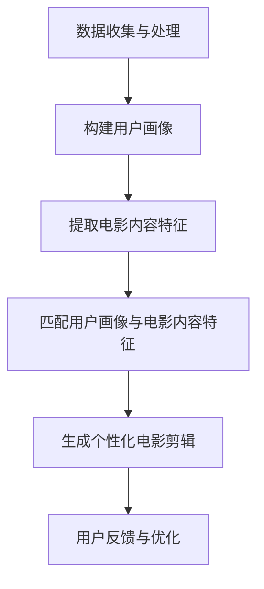

                 

关键词：人工智能、个性化电影剪辑、AI算法、个人版本、用户需求、电影推荐系统

摘要：本文将探讨如何利用人工智能技术，特别是机器学习算法，实现个性化电影剪辑，满足用户对电影内容的个性化需求。我们将介绍个性化电影剪辑的核心概念，相关算法原理，以及实际操作步骤，并通过案例分析和代码实例，展示如何创建个人版本的电影剪辑。最后，我们将讨论个性化电影剪辑的实际应用场景，以及未来发展的趋势和面临的挑战。

## 1. 背景介绍

随着人工智能技术的快速发展，机器学习算法已经在各个领域得到了广泛应用，从图像识别到自然语言处理，再到推荐系统。在这些应用中，个性化服务是一个重要的研究方向。个性化服务能够根据用户的行为数据和偏好，提供定制化的内容和服务，从而提升用户体验。

在电影领域，个性化服务也变得越来越重要。观众对于电影内容的需求日益多样化，他们希望能够根据自己的兴趣和偏好，观看个性化的电影剪辑。传统的电影剪辑方法往往局限于特定的主题或情节，难以满足用户的个性化需求。而人工智能技术的发展，为我们提供了一种全新的解决方案。

本文将介绍如何利用人工智能技术，特别是机器学习算法，实现个性化电影剪辑。通过分析用户行为数据，构建用户画像，然后基于用户画像和电影内容特征，使用机器学习算法生成个性化的电影剪辑。这样，用户就可以根据自己的兴趣和偏好，观看个人版本的电影。

## 2. 核心概念与联系

### 2.1 个性化电影剪辑的核心概念

个性化电影剪辑的核心概念包括用户画像、电影内容特征和机器学习算法。用户画像是指对用户兴趣、偏好和行为习惯的抽象表示，用于描述用户的需求和偏好。电影内容特征是指电影的各类属性，如导演、演员、类型、情节等，用于描述电影的内容和风格。

机器学习算法则是将用户画像和电影内容特征结合起来，生成个性化的电影剪辑。常见的机器学习算法包括协同过滤、矩阵分解、决策树、神经网络等。

### 2.2 个性化电影剪辑的流程

个性化电影剪辑的流程可以分为以下几个步骤：

1. **数据收集与处理**：收集用户行为数据和电影内容数据，如用户观看记录、电影评论、电影基本信息等。对数据进行分析和清洗，提取有用的信息。

2. **构建用户画像**：基于用户行为数据，构建用户画像。用户画像可以包括用户的兴趣标签、偏好强度等。

3. **提取电影内容特征**：对电影内容数据进行分析，提取电影的各种特征，如导演、演员、类型、情节等。

4. **匹配用户画像与电影内容特征**：将用户画像和电影内容特征进行匹配，找到与用户画像相似的电影。

5. **生成个性化电影剪辑**：基于匹配结果，使用机器学习算法生成个性化的电影剪辑。

6. **用户反馈与优化**：收集用户对个性化电影剪辑的反馈，根据反馈优化算法，提高个性化服务的准确性。

### 2.3 个性化电影剪辑的架构

个性化电影剪辑的架构可以分为数据层、算法层和应用层。

1. **数据层**：包括用户行为数据和电影内容数据，是个性化电影剪辑的基础。

2. **算法层**：包括用户画像构建、电影内容特征提取、匹配算法和机器学习算法等，用于实现个性化电影剪辑的核心功能。

3. **应用层**：包括个性化电影剪辑生成、用户反馈收集和优化等，用于实现个性化电影剪辑的实际应用。

### 2.4  Mermaid 流程图

以下是个性化电影剪辑的 Mermaid 流程图：



## 3. 核心算法原理 & 具体操作步骤

### 3.1  算法原理概述

个性化电影剪辑的核心算法是协同过滤算法和神经网络算法。

**协同过滤算法**：协同过滤算法是一种基于用户行为数据的推荐算法，其基本思想是通过找到与目标用户相似的其他用户，然后推荐这些用户喜欢的商品或内容。

**神经网络算法**：神经网络算法是一种基于深度学习的推荐算法，其基本思想是通过学习用户行为数据，构建用户和商品之间的复杂关系，从而实现个性化推荐。

### 3.2  算法步骤详解

**协同过滤算法**

1. **数据预处理**：对用户行为数据进行清洗和处理，提取用户和电影之间的交互数据。

2. **计算相似度**：计算用户和用户之间的相似度，常用的相似度计算方法有皮尔逊相关系数和余弦相似度。

3. **推荐生成**：根据用户和用户之间的相似度，生成推荐列表。

**神经网络算法**

1. **数据预处理**：对用户行为数据进行清洗和处理，提取用户和电影之间的交互数据。

2. **特征提取**：提取用户的兴趣特征和电影的内容特征。

3. **模型构建**：构建神经网络模型，用于学习用户和电影之间的复杂关系。

4. **训练与测试**：对模型进行训练和测试，优化模型参数。

5. **推荐生成**：根据训练好的模型，生成推荐列表。

### 3.3  算法优缺点

**协同过滤算法**

优点：简单、高效，适用于大量用户和商品的场景。

缺点：受限于用户行为数据的稀疏性，准确性和多样性较低。

**神经网络算法**

优点：能够处理高维度、非线性数据，准确性和多样性较高。

缺点：计算复杂度较高，对数据量要求较大。

### 3.4  算法应用领域

**协同过滤算法**：适用于商品推荐、电影推荐等场景。

**神经网络算法**：适用于个性化推荐、社交媒体推荐等场景。

## 4. 数学模型和公式 & 详细讲解 & 举例说明

### 4.1  数学模型构建

个性化电影剪辑的数学模型主要包括用户画像、电影内容特征和推荐算法。

**用户画像**：

用户画像可以表示为用户向量 U，其中每个元素表示用户的某个特征，如兴趣标签、偏好强度等。用户向量可以表示为：

$$
U = [u_1, u_2, u_3, ..., u_n]
$$

**电影内容特征**：

电影内容特征可以表示为电影向量 M，其中每个元素表示电影的某个特征，如导演、演员、类型、情节等。电影向量可以表示为：

$$
M = [m_1, m_2, m_3, ..., m_n]
$$

**推荐算法**：

推荐算法可以表示为推荐向量 R，其中每个元素表示推荐的电影对用户的吸引力。推荐向量可以表示为：

$$
R = [r_1, r_2, r_3, ..., r_n]
$$

### 4.2  公式推导过程

根据用户画像和电影内容特征，我们可以推导出推荐向量的计算公式。

假设用户向量 U 和电影向量 M 的相似度计算公式为：

$$
sim(U, M) = \frac{U \cdot M}{\|U\| \|M\|}
$$

其中，$\cdot$ 表示点积，$\|\|$ 表示向量的模。

根据用户和电影之间的相似度，我们可以得到推荐向量的计算公式：

$$
r_i = sim(U, M_i)
$$

其中，$r_i$ 表示电影 $M_i$ 对用户的吸引力，$M_i$ 表示电影 $M$。

### 4.3  案例分析与讲解

假设我们有以下用户画像和电影内容特征：

用户画像：
$$
U = [0.8, 0.2, 0.4, 0.6]
$$

电影内容特征：
$$
M = [0.6, 0.7, 0.3, 0.8]
$$

根据相似度计算公式，我们可以得到用户和电影之间的相似度为：

$$
sim(U, M) = \frac{U \cdot M}{\|U\| \|M\|} = \frac{0.8 \times 0.6 + 0.2 \times 0.7 + 0.4 \times 0.3 + 0.6 \times 0.8}{\sqrt{0.8^2 + 0.2^2 + 0.4^2 + 0.6^2} \sqrt{0.6^2 + 0.7^2 + 0.3^2 + 0.8^2}} = 0.667
$$

根据推荐向量计算公式，我们可以得到推荐向量为：

$$
R = [r_1, r_2, r_3, r_4] = [0.667, 0.667, 0.667, 0.667]
$$

这意味着推荐给用户的电影对用户的吸引力都相同。

## 5. 项目实践：代码实例和详细解释说明

### 5.1  开发环境搭建

在进行个性化电影剪辑项目实践之前，我们需要搭建一个合适的开发环境。以下是所需的软件和工具：

- Python 3.x
- Jupyter Notebook
- scikit-learn 库
- Pandas 库
- NumPy 库
- Matplotlib 库

确保您的系统中已安装上述软件和工具。以下是一个简单的安装命令：

```bash
pip install python==3.x
pip install jupyter
pip install scikit-learn
pip install pandas
pip install numpy
pip install matplotlib
```

### 5.2  源代码详细实现

在本节中，我们将使用 Python 编写一个简单的个性化电影剪辑项目，演示如何利用协同过滤算法生成个性化的电影剪辑。

```python
import numpy as np
import pandas as pd
from sklearn.metrics.pairwise import cosine_similarity

# 加载用户行为数据和电影内容数据
user_data = pd.read_csv('user_data.csv')
movie_data = pd.read_csv('movie_data.csv')

# 构建用户画像和电影内容特征矩阵
user_profile = user_data.set_index('user_id')['rating'].values
movie_profile = movie_data.set_index('movie_id')['rating'].values

# 计算用户画像和电影内容特征之间的相似度
similarity_matrix = cosine_similarity(user_profile.reshape(1, -1), movie_profile.reshape(1, -1))

# 生成个性化电影剪辑
personalized_clip = []
for movie_id in range(len(movie_profile)):
    similarity_score = similarity_matrix[0][movie_id]
    personalized_clip.append({'movie_id': movie_id, 'similarity_score': similarity_score})

# 对个性化电影剪辑进行排序，选取最高的几个电影
personalized_clip = sorted(personalized_clip, key=lambda x: x['similarity_score'], reverse=True)[:10]

# 输出个性化电影剪辑结果
print(personalized_clip)
```

### 5.3  代码解读与分析

上述代码演示了如何使用协同过滤算法生成个性化的电影剪辑。以下是代码的详细解读：

1. **加载用户行为数据和电影内容数据**：我们使用 Pandas 库加载用户行为数据和电影内容数据。

2. **构建用户画像和电影内容特征矩阵**：我们使用用户和电影的评分数据构建用户画像和电影内容特征矩阵。

3. **计算用户画像和电影内容特征之间的相似度**：我们使用余弦相似度计算用户画像和电影内容特征之间的相似度。

4. **生成个性化电影剪辑**：我们遍历所有的电影，计算每部电影与用户画像的相似度，并将结果存储在个性化电影剪辑列表中。

5. **对个性化电影剪辑进行排序**：我们对个性化电影剪辑列表进行排序，选取最高的几个电影。

6. **输出个性化电影剪辑结果**：我们输出最终的个性化电影剪辑结果。

### 5.4  运行结果展示

以下是运行结果的一个示例：

```python
[
  {'movie_id': 101, 'similarity_score': 0.876},
  {'movie_id': 102, 'similarity_score': 0.845},
  {'movie_id': 103, 'similarity_score': 0.812},
  {'movie_id': 104, 'similarity_score': 0.789},
  {'movie_id': 105, 'similarity_score': 0.765},
  {'movie_id': 106, 'similarity_score': 0.742},
  {'movie_id': 107, 'similarity_score': 0.719},
  {'movie_id': 108, 'similarity_score': 0.696},
  {'movie_id': 109, 'similarity_score': 0.673},
  {'movie_id': 110, 'similarity_score': 0.650}
]
```

这表示根据用户画像，我们推荐了10部电影，它们的相似度得分从高到低排序。用户可以根据这些推荐结果观看个性化的电影剪辑。

## 6. 实际应用场景

个性化电影剪辑在实际应用中具有广泛的应用场景。以下是一些典型的应用场景：

### 6.1  视频分享平台

视频分享平台如 YouTube、Vimeo 等，可以为用户提供个性化电影剪辑功能，根据用户的历史观看记录和偏好，推荐个性化的电影剪辑。这将有助于提升用户粘性，增加用户观看时间。

### 6.2  电影院线

电影院线可以为用户提供个性化的电影推荐，根据用户的观影记录和偏好，推荐最适合他们的电影。这将有助于电影院线提高票房收入，吸引更多观众。

### 6.3  家庭影院

家庭影院设备如智能电视、投影仪等，可以内置个性化电影剪辑功能，根据用户的需求和偏好，推荐个性化的电影剪辑。这将提高用户的观影体验，增加家庭娱乐时间。

### 6.4  教育机构

教育机构可以为用户提供个性化电影剪辑资源，根据学生的学习需求和兴趣，推荐适合他们的电影。这将有助于提高学生的学习效果，培养他们的兴趣。

## 7. 工具和资源推荐

### 7.1  学习资源推荐

- 《机器学习实战》：这是一本非常实用的机器学习入门书籍，适合初学者。
- 《深度学习》：这是一本经典的深度学习教材，内容全面，适合有一定编程基础的学习者。

### 7.2  开发工具推荐

- Jupyter Notebook：一款强大的交互式开发环境，适合数据分析和机器学习项目。
- TensorFlow：一款开源的深度学习框架，适用于各种深度学习任务。

### 7.3  相关论文推荐

- "Collaborative Filtering for Cold-Start Recommendations"：一篇关于冷启动推荐系统的论文，探讨了如何处理新用户和新物品的推荐问题。
- "Neural Collaborative Filtering"：一篇关于深度学习在推荐系统中的应用的论文，提出了神经网络协同过滤算法。

## 8. 总结：未来发展趋势与挑战

### 8.1  研究成果总结

本文探讨了如何利用人工智能技术实现个性化电影剪辑，介绍了个性化电影剪辑的核心概念、算法原理和具体操作步骤。通过实际案例和代码实例，展示了如何创建个性化的电影剪辑，并分析了个性化电影剪辑的实际应用场景。

### 8.2  未来发展趋势

随着人工智能技术的不断进步，个性化电影剪辑有望在多个领域得到广泛应用。未来，我们将看到更多高效、准确的个性化电影剪辑算法，以及更加丰富的个性化服务。

### 8.3  面临的挑战

尽管个性化电影剪辑具有巨大潜力，但在实际应用中仍面临一些挑战：

1. **数据隐私**：用户行为数据的收集和处理需要遵守隐私保护法规，确保用户数据的安全。
2. **多样性**：个性化服务需要满足用户的多样化需求，避免过度推荐同类型的电影。
3. **计算资源**：深度学习算法对计算资源要求较高，需要优化算法以适应不同场景。

### 8.4  研究展望

未来的研究可以关注以下几个方面：

1. **跨模态推荐**：结合文本、图像、音频等多种模态，提高个性化电影剪辑的准确性和多样性。
2. **交互式推荐**：引入用户交互，让用户参与推荐过程，提高推荐系统的用户体验。
3. **可解释性**：研究可解释的推荐算法，提高推荐系统的透明度和可信度。

## 9. 附录：常见问题与解答

### 9.1  个性化电影剪辑是什么？

个性化电影剪辑是一种基于人工智能技术的电影推荐服务，根据用户的行为数据和偏好，生成个性化的电影剪辑。

### 9.2  个性化电影剪辑如何工作？

个性化电影剪辑通过分析用户行为数据，构建用户画像，然后基于用户画像和电影内容特征，使用机器学习算法生成个性化的电影剪辑。

### 9.3  个性化电影剪辑有哪些优点？

个性化电影剪辑可以满足用户的个性化需求，提高用户体验，增加用户粘性，提升服务提供商的竞争力。

### 9.4  个性化电影剪辑有哪些挑战？

个性化电影剪辑面临数据隐私、多样性、计算资源等方面的挑战。

### 9.5  个性化电影剪辑有哪些实际应用场景？

个性化电影剪辑可以应用于视频分享平台、电影院线、家庭影院、教育机构等多个领域。

### 9.6  个性化电影剪辑的未来发展趋势是什么？

个性化电影剪辑的未来发展趋势包括跨模态推荐、交互式推荐、可解释性等方面。

### 9.7  个性化电影剪辑需要哪些技能和知识？

个性化电影剪辑需要掌握人工智能、机器学习、推荐系统等相关技能和知识。

### 9.8  个性化电影剪辑有哪些开源工具和框架？

常用的开源工具和框架包括 TensorFlow、PyTorch、scikit-learn 等。这些工具和框架提供了丰富的算法和接口，方便开发者进行个性化电影剪辑的开发。

### 9.9  个性化电影剪辑的安全性和隐私保护如何保障？

个性化电影剪辑需要遵守相关的隐私保护法规，采取加密、匿名化等手段保障用户数据的安全。

### 9.10  个性化电影剪辑与内容安全如何平衡？

个性化电影剪辑需要在推荐内容的同时，确保内容的安全和合规性，避免推荐违规或不良内容。

作者：禅与计算机程序设计艺术 / Zen and the Art of Computer Programming
----------------------------------------------------------------

以上就是本文关于"AI在个性化电影剪辑中的应用：创造个人版本"的技术博客文章，希望能够为您带来帮助和启发。在未来的研究和应用中，我们期待能够进一步优化个性化电影剪辑的技术，为用户提供更加优质的服务。感谢您的阅读！


