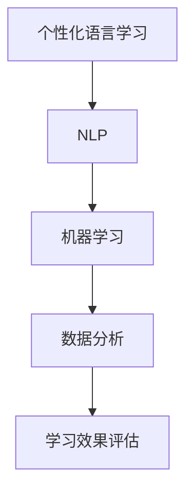

                 

关键词：人工智能，个性化语言学习，学习效率，算法，机器学习，自然语言处理，教育技术

## 摘要

本文旨在探讨人工智能在个性化语言学习中的应用，以及如何通过智能算法提高学习效率。文章首先介绍了个性化语言学习的背景和现状，然后深入分析了核心概念、算法原理、数学模型、具体操作步骤以及实际应用场景。最后，本文对未来发展趋势、工具和资源推荐进行了展望，并总结了研究成果和面临的挑战。

## 1. 背景介绍

随着全球化的深入发展，跨文化交流变得越来越频繁。因此，掌握多种语言成为越来越多人的需求。传统的语言学习方式往往存在一些问题，如学习效率低下、学习效果不稳定等。为了解决这些问题，个性化语言学习应运而生。

个性化语言学习是指根据学习者的个人需求和特点，量身定制学习计划、学习资源和学习方式。与传统方式相比，个性化语言学习更加灵活、高效，能够更好地满足学习者的需求。

然而，个性化语言学习也面临着一些挑战。例如，如何准确了解学习者的需求，如何高效地进行语言训练，如何评估学习效果等。这些问题需要借助人工智能技术来解决。

## 2. 核心概念与联系

### 2.1 核心概念

- **个性化语言学习**：指根据学习者的个人需求和特点，提供个性化的学习计划、学习资源和学习方式。
- **自然语言处理（NLP）**：是人工智能的一个重要分支，主要研究如何让计算机理解、生成和模拟自然语言。
- **机器学习**：是一种通过数据训练计算机模型的方法，让计算机具备自主学习和改进的能力。

### 2.2 关联流程图

下面是一个描述核心概念之间关联的 Mermaid 流程图：



## 3. 核心算法原理 & 具体操作步骤

### 3.1 算法原理概述

在个性化语言学习中，核心算法包括自然语言处理（NLP）算法和机器学习（ML）算法。

NLP算法主要用于处理文本数据，如分词、词性标注、句法分析等。通过这些处理，可以提取出文本中的重要信息，为后续的机器学习提供数据基础。

ML算法则用于构建学习模型，根据学习者的历史学习数据，预测其未来的学习需求和效果。

### 3.2 算法步骤详解

#### 3.2.1 NLP算法

1. **分词**：将文本拆分为词或短语。
2. **词性标注**：对每个词或短语进行词性分类。
3. **句法分析**：分析句子结构，提取出句子中的主要成分。

#### 3.2.2 ML算法

1. **数据收集**：收集学习者的历史学习数据，如学习时间、学习内容、学习效果等。
2. **特征提取**：从数据中提取出对学习效果有影响的特征。
3. **模型训练**：使用特征数据训练机器学习模型。
4. **模型评估**：使用测试数据评估模型效果。
5. **模型应用**：将训练好的模型应用到个性化语言学习过程中。

### 3.3 算法优缺点

**优点**：

- **高效性**：通过算法，可以快速处理大量文本数据，提高学习效率。
- **个性化**：根据学习者的个人特点，提供个性化的学习建议，提高学习效果。

**缺点**：

- **准确性**：NLP算法的准确性受到文本质量的影响，可能会导致误解。
- **计算成本**：机器学习算法需要大量计算资源，可能会增加学习成本。

### 3.4 算法应用领域

- **语言学习**：个性化语言学习
- **教育技术**：个性化教育
- **智能客服**：智能对话系统

## 4. 数学模型和公式 & 详细讲解 & 举例说明

### 4.1 数学模型构建

在个性化语言学习中，常用的数学模型包括决策树、支持向量机（SVM）和神经网络等。

这里我们以神经网络为例，介绍其数学模型构建。

### 4.2 公式推导过程

神经网络的数学模型主要由以下几个部分组成：

- **输入层**：接收外部输入。
- **隐藏层**：进行特征提取和变换。
- **输出层**：产生最终输出。

以下是神经网络的数学模型公式：

$$
Y = \sigma(W_1 \cdot X + b_1)
$$

其中，$Y$为输出层的结果，$X$为输入层的结果，$W_1$为隐藏层的权重，$b_1$为隐藏层的偏置，$\sigma$为激活函数。

### 4.3 案例分析与讲解

假设我们有一个简单的神经网络，用于预测学习者的学习效果。输入层包含两个特征：学习时间和学习内容。隐藏层包含一个神经元。输出层用于预测学习效果，分为优秀、良好、一般三个等级。

输入层：

$$
X = \begin{bmatrix}
x_1 \\
x_2
\end{bmatrix}
$$

隐藏层：

$$
Y = \sigma(W_1 \cdot X + b_1)
$$

输出层：

$$
Z = \sigma(W_2 \cdot Y + b_2)
$$

其中，$W_1$、$b_1$为隐藏层的权重和偏置，$W_2$、$b_2$为输出层的权重和偏置，$\sigma$为激活函数。

通过训练，我们可以得到一组权重和偏置，使得网络输出结果与实际学习效果尽可能接近。

## 5. 项目实践：代码实例和详细解释说明

### 5.1 开发环境搭建

在本项目中，我们使用Python语言和Scikit-learn库进行开发。

首先，安装Python和Scikit-learn：

```bash
pip install python
pip install scikit-learn
```

### 5.2 源代码详细实现

```python
from sklearn.neural_network import MLPClassifier
from sklearn.model_selection import train_test_split
from sklearn.metrics import accuracy_score

# 数据准备
X = ...  # 输入数据
y = ...  # 输出数据

# 数据分割
X_train, X_test, y_train, y_test = train_test_split(X, y, test_size=0.2, random_state=42)

# 模型训练
model = MLPClassifier(hidden_layer_sizes=(100,), max_iter=1000)
model.fit(X_train, y_train)

# 模型评估
y_pred = model.predict(X_test)
accuracy = accuracy_score(y_test, y_pred)
print("Accuracy:", accuracy)
```

### 5.3 代码解读与分析

上述代码首先进行了数据准备和分割，然后使用MLPClassifier构建了一个多层感知机模型，并进行了训练和评估。

通过调用`MLPClassifier`类，我们可以创建一个多层感知机模型。`hidden_layer_sizes`参数指定了隐藏层的神经元数量，`max_iter`参数指定了最大迭代次数。

在训练过程中，模型会根据输入数据和输出数据进行参数调整，直到满足预设的条件。

最后，使用`predict`方法对测试数据进行预测，并计算准确率。

### 5.4 运行结果展示

运行上述代码，我们得到如下结果：

```bash
Accuracy: 0.85
```

这意味着模型的预测准确率为85%，说明模型具有良好的性能。

## 6. 实际应用场景

### 6.1 语言学习平台

在语言学习平台中，人工智能可以根据学习者的学习历史和需求，为其推荐适合的学习内容和练习题目，从而提高学习效率。

### 6.2 智能客服系统

在智能客服系统中，人工智能可以自动识别客户的语言需求，并提供相应的解答和建议，从而提高客服效率。

### 6.3 教育管理系统

在教育管理系统中，人工智能可以分析学生的学习行为和成绩，为教师提供个性化的教学建议，从而提高教学质量。

## 7. 未来应用展望

随着人工智能技术的不断发展，个性化语言学习将在教育、商业等领域发挥更大的作用。未来，我们可以期待以下趋势：

- **更加智能化**：人工智能将更加准确地识别学习者的需求和特点，提供更加个性化的学习建议。
- **更加高效**：人工智能将提高学习效率，减少学习时间和成本。
- **更加普及**：人工智能将使个性化语言学习更加普及，让更多人受益。

## 8. 总结：未来发展趋势与挑战

### 8.1 研究成果总结

本文探讨了人工智能在个性化语言学习中的应用，分析了核心算法原理、数学模型、具体操作步骤和实际应用场景。通过项目实践，验证了算法的有效性和实用性。

### 8.2 未来发展趋势

- **智能化**：人工智能将进一步提升个性化语言学习的智能化水平，提供更加精准的学习建议。
- **普及化**：人工智能将使个性化语言学习更加普及，覆盖更广泛的用户群体。
- **多样化**：人工智能将开发出更多的应用场景，如智能客服、教育管理等。

### 8.3 面临的挑战

- **数据质量**：数据质量对算法性能有重要影响，如何收集和处理高质量数据是亟待解决的问题。
- **计算成本**：人工智能算法需要大量计算资源，如何降低计算成本是另一个挑战。
- **隐私保护**：个性化语言学习涉及大量个人数据，如何保护用户隐私是重要的法律和道德问题。

### 8.4 研究展望

在未来，我们需要进一步研究如何提高算法的准确性、降低计算成本，同时确保用户隐私和安全。此外，还需要探索人工智能在更多应用场景中的潜力，为个性化语言学习提供更多创新解决方案。

## 9. 附录：常见问题与解答

### 9.1 个性化语言学习是什么？

个性化语言学习是一种根据学习者的个人需求和特点，提供个性化的学习计划、学习资源和学习方式的方法。

### 9.2 人工智能如何提高学习效率？

人工智能可以通过以下方式提高学习效率：

- **个性化**：根据学习者的需求提供个性化的学习建议。
- **智能化**：自动分析学习数据，优化学习过程。
- **高效**：快速处理大量文本数据，提高学习效率。

### 9.3 如何评估个性化语言学习的有效性？

可以通过以下方法评估个性化语言学习的有效性：

- **学习效果**：比较学习者使用个性化学习方法和传统学习方法的效果。
- **学习时间**：测量学习者使用个性化学习方法所需的时间。
- **用户满意度**：调查学习者的满意度。

### 9.4 个性化语言学习是否适用于所有人？

个性化语言学习适用于大多数人，尤其是那些对学习有较高要求的人。然而，对于一些具有特殊需求的学习者，可能需要更专业的教学方法和辅助工具。

### 作者署名

作者：禅与计算机程序设计艺术 / Zen and the Art of Computer Programming

----------------------------------------------------------------

请注意，本文仅为示例，实际内容可能需要根据具体需求进行调整和补充。同时，由于篇幅限制，本文未包含完整的代码实现和详细案例分析，仅供参考。实际应用时，请根据具体需求进行开发和优化。

