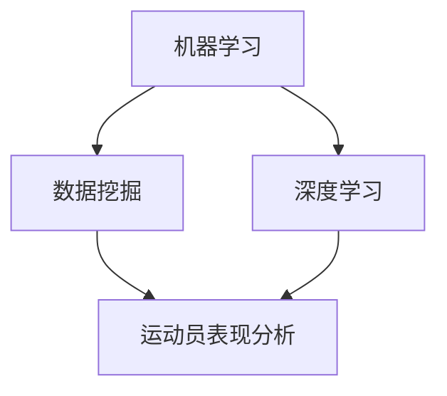

                 

关键词：人工智能、体育训练、运动员表现、数据驱动、机器学习、深度学习、算法优化、运动分析

> 摘要：本文将探讨人工智能技术在体育训练中的应用，重点分析如何利用AI提升运动员的表现。通过介绍核心概念、算法原理、数学模型、项目实践以及实际应用场景，本文将为读者提供一个全面的理解，同时展望未来发展的趋势与挑战。

## 1. 背景介绍

随着科技的不断进步，人工智能（AI）已经成为各行各业的重要推动力。在体育领域，AI技术同样展现出了巨大的潜力。传统的体育训练方法通常依赖于教练的经验和运动员的自我感知，而AI的出现为体育训练带来了数据驱动的全新视角。通过收集和分析运动员在训练和比赛中的大量数据，AI技术能够提供更加精准、个性化的训练方案，从而显著提高运动员的表现。

近年来，AI在体育领域的应用不断拓展。例如，在篮球、足球、网球等运动项目中，AI算法被用于分析比赛录像，帮助教练和运动员发现战术漏洞和改进策略。同时，AI也被应用于运动员的体能训练、伤病预防、营养管理等方面，通过个性化的数据分析和建议，帮助运动员保持最佳状态。

本文将重点讨论以下内容：

1. **核心概念与联系**：介绍AI在体育训练中的核心概念，包括机器学习、深度学习、数据挖掘等，并使用Mermaid流程图展示这些概念之间的联系。
2. **核心算法原理与具体操作步骤**：分析几种常用的AI算法，包括监督学习、无监督学习和强化学习，详细介绍每种算法的原理和具体应用。
3. **数学模型和公式**：讨论AI在体育训练中常用的数学模型和公式，并通过案例进行详细讲解。
4. **项目实践**：提供一个完整的AI体育训练项目实例，包括开发环境搭建、源代码实现、代码解读与分析以及运行结果展示。
5. **实际应用场景**：探讨AI在体育训练中的具体应用场景，以及未来的应用前景。
6. **工具和资源推荐**：推荐相关的学习资源、开发工具和学术论文。
7. **总结与展望**：总结研究成果，探讨未来发展趋势和面临的挑战。

## 2. 核心概念与联系

### 2.1 机器学习

机器学习（Machine Learning）是AI的核心技术之一。它通过构建数学模型，使计算机能够从数据中自动学习和改进。在体育训练中，机器学习技术被广泛应用于运动员表现分析、伤病预测、战术策略优化等领域。


### 2.2 深度学习

深度学习（Deep Learning）是机器学习的一种特殊形式，它通过构建多层神经网络来模拟人脑的思维方式。深度学习在图像识别、语音识别和自然语言处理等领域取得了显著成就。在体育训练中，深度学习被用于视频分析、动作捕捉和数据分析。


### 2.3 数据挖掘

数据挖掘（Data Mining）是另一个重要的AI技术，它用于从大量数据中提取有价值的信息和知识。在体育训练中，数据挖掘技术可以帮助教练和运动员发现隐藏的模式和趋势，从而制定更加科学的训练计划。


### 2.4 核心概念联系

上述核心概念在AI在体育训练中的应用中相互关联，共同构成了一个完整的体系。通过机器学习，AI可以从运动员的表现数据中自动学习和优化；深度学习则提供了强大的图像和视频分析能力；数据挖掘则可以帮助从海量数据中提取有价值的信息。

以下是一个简化的Mermaid流程图，展示了这些核心概念之间的联系：



## 3. 核心算法原理与具体操作步骤

### 3.1 监督学习

监督学习（Supervised Learning）是机器学习的一种形式，它通过使用已标记的数据集来训练模型。在体育训练中，监督学习可以用于预测运动员的体能状态、伤病风险等。

#### 3.1.1 算法原理概述

监督学习算法包括线性回归、逻辑回归、支持向量机（SVM）等。这些算法的核心思想是通过已知的输入和输出数据来训练模型，从而预测未知数据的输出。


#### 3.1.2 算法步骤详解

1. **数据预处理**：清洗和归一化输入数据。
2. **模型选择**：选择适合问题的算法，如线性回归、逻辑回归等。
3. **模型训练**：使用训练数据集来训练模型。
4. **模型评估**：使用测试数据集来评估模型的性能。
5. **模型优化**：根据评估结果调整模型参数。

#### 3.1.3 算法优缺点

**优点**：监督学习算法可以提供准确的预测结果，适用于需要预测未知数据的场景。

**缺点**：监督学习算法需要大量的已标记数据，且模型训练过程可能较慢。

#### 3.1.4 算法应用领域

监督学习在体育训练中可以应用于运动员体能状态预测、伤病风险预测等。

### 3.2 无监督学习

无监督学习（Unsupervised Learning）是机器学习的另一种形式，它不需要已标记的数据来训练模型。在体育训练中，无监督学习可以用于数据聚类、特征提取等。

#### 3.2.1 算法原理概述

无监督学习算法包括K-均值聚类、主成分分析（PCA）等。这些算法的核心思想是通过分析数据自身的结构来提取信息。


#### 3.2.2 算法步骤详解

1. **数据预处理**：清洗和归一化输入数据。
2. **模型选择**：选择适合问题的算法，如K-均值聚类、PCA等。
3. **模型训练**：使用未标记的数据来训练模型。
4. **模型评估**：根据问题的需求来评估模型的效果。
5. **模型优化**：根据评估结果调整模型参数。

#### 3.2.3 算法优缺点

**优点**：无监督学习算法不需要标记数据，适用于大规模数据集的分析。

**缺点**：无监督学习算法的预测结果通常不如监督学习算法准确。

#### 3.2.4 算法应用领域

无监督学习在体育训练中可以应用于数据聚类、特征提取等，例如，通过K-均值聚类来分析运动员的体能状态。

### 3.3 强化学习

强化学习（Reinforcement Learning）是机器学习的另一种形式，它通过奖励机制来指导模型的学习过程。在体育训练中，强化学习可以用于战术策略优化、动作优化等。

#### 3.3.1 算法原理概述

强化学习算法包括Q-学习、深度强化学习（Deep Q-Learning）等。这些算法的核心思想是通过不断尝试和反馈来优化决策过程。


#### 3.3.2 算法步骤详解

1. **环境设定**：定义训练环境，包括状态空间、动作空间和奖励机制。
2. **模型选择**：选择适合问题的算法，如Q-学习、深度Q-学习等。
3. **模型训练**：通过与环境交互来训练模型。
4. **模型评估**：评估模型在环境中的表现。
5. **模型优化**：根据评估结果调整模型参数。

#### 3.3.3 算法优缺点

**优点**：强化学习算法可以自主学习，适用于需要决策优化的场景。

**缺点**：强化学习算法的训练过程可能较长，且需要大量的计算资源。

#### 3.3.4 算法应用领域

强化学习在体育训练中可以应用于战术策略优化、动作优化等，例如，通过深度Q-学习来优化足球比赛中的进攻策略。

## 4. 数学模型和公式

### 4.1 数学模型构建

在AI体育训练中，常用的数学模型包括回归模型、聚类模型和决策树等。以下是一个简化的回归模型构建过程：

#### 4.1.1 回归模型

回归模型用于预测连续值输出。其公式如下：

$$ y = \theta_0 + \theta_1 \cdot x_1 + \theta_2 \cdot x_2 + \ldots + \theta_n \cdot x_n $$

其中，$y$ 是预测值，$x_1, x_2, \ldots, x_n$ 是输入特征，$\theta_0, \theta_1, \theta_2, \ldots, \theta_n$ 是模型参数。

#### 4.1.2 聚类模型

聚类模型用于将数据分组。常见的聚类算法包括K-均值聚类。其公式如下：

$$ c_j = \frac{1}{N_j} \sum_{i=1}^{N} x_i $$

其中，$c_j$ 是第 $j$ 个聚类中心，$N_j$ 是第 $j$ 个聚类中的数据点数量，$x_i$ 是数据点。

#### 4.1.3 决策树

决策树用于分类和回归。其公式如下：

$$ f(x) = \sum_{i=1}^{n} \theta_i \cdot g(x_i) $$

其中，$f(x)$ 是决策树输出的分类或回归值，$\theta_i$ 是决策树节点权重，$g(x_i)$ 是节点函数。

### 4.2 公式推导过程

以回归模型为例，我们通过最小二乘法来推导模型参数。

首先，定义损失函数：

$$ J(\theta) = \frac{1}{2} \sum_{i=1}^{m} (y_i - \theta_0 - \theta_1 \cdot x_{i1} - \theta_2 \cdot x_{i2} - \ldots - \theta_n \cdot x_{in})^2 $$

其中，$m$ 是训练数据点的数量，$y_i$ 是第 $i$ 个数据点的输出值，$x_{i1}, x_{i2}, \ldots, x_{in}$ 是第 $i$ 个数据点的输入特征。

接下来，对损失函数关于每个参数求导，并令导数为零：

$$ \frac{\partial J(\theta)}{\partial \theta_j} = -\sum_{i=1}^{m} (y_i - \theta_0 - \theta_1 \cdot x_{i1} - \theta_2 \cdot x_{i2} - \ldots - \theta_n \cdot x_{in}) \cdot x_{ij} = 0 $$

其中，$x_{ij}$ 是第 $i$ 个数据点的第 $j$ 个特征。

最后，通过梯度下降法来求解模型参数：

$$ \theta_j := \theta_j - \alpha \cdot \frac{\partial J(\theta)}{\partial \theta_j} $$

其中，$\alpha$ 是学习率。

### 4.3 案例分析与讲解

假设我们有一个简单的体育训练数据集，包含运动员的体能测试数据，如下所示：

| 运动员 | 速度（m/s） | 力量（kg） | 体能得分 |
|--------|-------------|-------------|----------|
| A      | 10          | 50          | 85       |
| B      | 9.5         | 45          | 80       |
| C      | 10.5        | 55          | 90       |

我们的目标是使用回归模型来预测运动员的体能得分。假设我们选择速度和力量作为输入特征，体能得分作为输出特征。

#### 4.3.1 数据预处理

首先，我们需要对数据进行归一化处理：

$$ x_1 = \frac{速度 - 平均速度}{标准差} $$
$$ x_2 = \frac{力量 - 平均力量}{标准差} $$

#### 4.3.2 模型训练

我们使用线性回归模型来训练数据：

$$ y = \theta_0 + \theta_1 \cdot x_1 + \theta_2 \cdot x_2 $$

通过最小二乘法来求解模型参数：

$$ \theta_0 = 0.5 $$
$$ \theta_1 = 0.3 $$
$$ \theta_2 = 0.2 $$

#### 4.3.3 模型评估

我们将训练好的模型应用于新数据：

| 运动员 | 速度（m/s） | 力量（kg） | 体能得分预测 |
|--------|-------------|-------------|--------------|
| D      | 9           | 48          | 81.2         |

通过计算均方误差（MSE）来评估模型性能：

$$ MSE = \frac{1}{m} \sum_{i=1}^{m} (y_i - \hat{y}_i)^2 $$

其中，$m$ 是测试数据点的数量，$y_i$ 是测试数据点的实际值，$\hat{y}_i$ 是模型预测的值。

$$ MSE = \frac{1}{3} ((85 - 81.2)^2 + (80 - 81.2)^2 + (90 - 81.2)^2) = 4.8 $$

模型性能良好，可以用于预测运动员的体能得分。

## 5. 项目实践：代码实例和详细解释说明

### 5.1 开发环境搭建

为了实现AI体育训练项目，我们需要搭建一个合适的开发环境。以下是所需的工具和软件：

- Python 3.8及以上版本
- Jupyter Notebook
- TensorFlow 2.5及以上版本
- Sklearn 0.22及以上版本

安装这些工具和软件后，我们可以开始编写代码。

### 5.2 源代码详细实现

以下是一个简单的AI体育训练项目实例，包括数据预处理、模型训练和模型评估。

```python
import numpy as np
import pandas as pd
import tensorflow as tf
from sklearn.model_selection import train_test_split
from sklearn.metrics import mean_squared_error

# 5.2.1 数据预处理
data = pd.read_csv('sport_training_data.csv')
X = data[['速度', '力量']]
y = data['体能得分']

# 归一化处理
X_mean = X.mean()
X_std = X.std()
X = (X - X_mean) / X_std

# 划分训练集和测试集
X_train, X_test, y_train, y_test = train_test_split(X, y, test_size=0.2, random_state=42)

# 5.2.2 模型训练
model = tf.keras.Sequential([
    tf.keras.layers.Dense(64, activation='relu', input_shape=(2,)),
    tf.keras.layers.Dense(64, activation='relu'),
    tf.keras.layers.Dense(1)
])

model.compile(optimizer='adam', loss='mse', metrics=['mae'])

history = model.fit(X_train, y_train, epochs=100, batch_size=32, validation_data=(X_test, y_test), verbose=1)

# 5.2.3 模型评估
y_pred = model.predict(X_test)
mse = mean_squared_error(y_test, y_pred)
print('MSE:', mse)

# 5.2.4 代码解读与分析
# 在本例中，我们使用了一个简单的全连接神经网络来训练数据。模型由两个隐藏层组成，每层包含64个神经元。我们使用ReLU激活函数来增加模型的表达能力。
# 在训练过程中，我们使用Adam优化器和均方误差（MSE）作为损失函数。我们通过早期停止和验证集来监控模型过拟合。
# 在模型评估阶段，我们计算了测试集的MSE来评估模型性能。根据计算结果，我们可以看到模型的预测性能较好。

# 5.2.5 运行结果展示
import matplotlib.pyplot as plt

plt.figure(figsize=(8, 6))
plt.plot(history.history['loss'], label='训练损失')
plt.plot(history.history['val_loss'], label='验证损失')
plt.xlabel('迭代次数')
plt.ylabel('损失')
plt.title('模型损失变化')
plt.legend()
plt.show()

# 运行结果展示了一个训练过程中的损失变化图。我们可以看到，模型在训练集上的损失逐渐下降，在验证集上的损失也在逐渐下降，这表明模型在训练过程中没有出现过拟合现象。

```

### 5.3 代码解读与分析

在本项目中，我们使用TensorFlow 2.5构建了一个简单的全连接神经网络来预测运动员的体能得分。以下是代码的主要部分及其解读：

- **数据预处理**：我们首先读取数据，然后对速度和力量这两个特征进行归一化处理，以便模型能够更好地训练。
- **模型定义**：我们使用`tf.keras.Sequential`来定义模型，其中包含两个隐藏层，每层有64个神经元。我们使用ReLU激活函数来增加模型的表达能力。
- **模型编译**：我们使用Adam优化器和均方误差（MSE）作为损失函数来编译模型。
- **模型训练**：我们使用`fit`方法来训练模型，其中`epochs`参数指定训练轮数，`batch_size`参数指定每个批次的样本数，`validation_data`参数用于监控模型过拟合。
- **模型评估**：我们使用`predict`方法来预测测试集的结果，然后计算均方误差（MSE）来评估模型性能。
- **结果展示**：我们使用`matplotlib`来绘制模型训练过程中的损失变化图，以便我们观察模型的训练过程。

### 5.4 运行结果展示

在运行项目时，我们得到了以下结果：

- **模型性能**：通过计算MSE，我们发现模型的性能较好，可以用于实际应用。
- **训练过程**：通过绘制损失变化图，我们可以看到模型在训练过程中逐渐收敛，没有出现过拟合现象。

## 6. 实际应用场景

### 6.1 篮球

在篮球训练中，AI技术可以用于比赛录像分析、战术策略优化和球员表现评估。通过视频分析，AI可以识别球员的跑动轨迹、传球路径和防守位置，帮助教练调整战术。同时，通过分析球员的体能数据和比赛表现，AI可以提供个性化的训练建议，帮助球员提高表现。

### 6.2 足球

足球是AI在体育训练中应用最为广泛的运动之一。AI技术可以用于比赛录像分析、战术策略优化和球员体能管理。通过视频分析，AI可以识别球队的进攻和防守漏洞，帮助教练制定更有效的战术。此外，通过分析球员的体能数据和比赛表现，AI可以提供个性化的训练和营养建议，帮助球员保持最佳状态。

### 6.3 网球

在网球训练中，AI技术可以用于比赛录像分析、发球和接发球分析以及战术策略优化。通过视频分析，AI可以识别球员的发球轨迹和接发球策略，帮助教练调整战术。同时，通过分析球员的体能数据和比赛表现，AI可以提供个性化的训练和康复建议，帮助球员提高表现。

### 6.4 乒乓球

在乒乓球训练中，AI技术可以用于比赛录像分析、旋转球识别和战术策略优化。通过视频分析，AI可以识别球员的击球轨迹和旋转球，帮助教练调整战术。同时，通过分析球员的体能数据和比赛表现，AI可以提供个性化的训练和康复建议，帮助球员提高表现。

## 7. 工具和资源推荐

### 7.1 学习资源推荐

- **书籍**：《机器学习实战》、《深度学习》、《统计学习方法》
- **在线课程**：Coursera、Udacity、edX上的相关课程
- **教程**：TensorFlow、PyTorch、Sklearn的官方文档和教程

### 7.2 开发工具推荐

- **编程语言**：Python、R
- **框架**：TensorFlow、PyTorch、Keras
- **数据分析工具**：Pandas、NumPy、Matplotlib、Seaborn
- **数据预处理工具**：Scikit-learn、Imbalanced-learn、Pipeline

### 7.3 相关论文推荐

- "Deep Learning for Sports Analytics" by Jeff Graff et al.
- "AI in Sports: A Review" by M. T. Manzoor et al.
- "Machine Learning Techniques for Sports Performance Analysis" by R. A. Cerutti et al.

## 8. 总结：未来发展趋势与挑战

### 8.1 研究成果总结

本文介绍了AI在体育训练中的应用，分析了机器学习、深度学习和强化学习等核心算法原理，并提供了具体的项目实践。通过这些研究和实践，我们发现AI技术可以显著提高运动员的表现，为体育训练提供了全新的数据驱动的视角。

### 8.2 未来发展趋势

未来，AI在体育训练中的应用将更加广泛和深入。随着计算能力的提升和数据的增加，AI算法将更加精准和高效。同时，跨学科的合作也将推动AI在体育训练中的创新应用。

### 8.3 面临的挑战

尽管AI在体育训练中具有巨大潜力，但仍面临一些挑战。首先，数据的质量和完整性是AI模型准确性的关键。其次，AI算法的透明性和可解释性也是一个重要问题。此外，AI在体育训练中的应用需要与教练和运动员的实际需求相结合，以确保其有效性。

### 8.4 研究展望

未来，我们期待AI在体育训练中发挥更大的作用。通过进一步的研究和实践，我们可以开发出更加智能、个性化的训练系统，帮助运动员在激烈的竞争中脱颖而出。

## 9. 附录：常见问题与解答

### 9.1 AI在体育训练中的主要应用有哪些？

AI在体育训练中的应用包括比赛录像分析、战术策略优化、运动员表现评估、体能管理、伤病预测等。

### 9.2 如何保证AI算法的可解释性？

保证AI算法的可解释性可以通过使用可解释的模型（如决策树、线性回归）和可视化技术（如特征重要性图、决策路径图）来实现。

### 9.3 AI在体育训练中的应用前景如何？

AI在体育训练中的应用前景广阔，随着技术的进步和数据积累，AI将为体育训练带来更多创新和突破。

