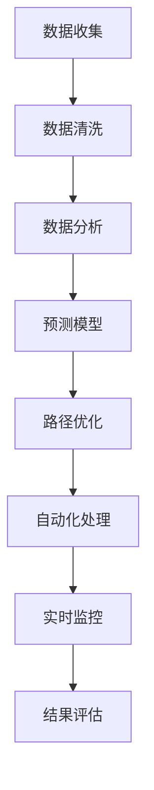

                 

关键词：人工智能，供应链管理，物流优化，深度学习，算法模型，机器学习，物联网，预测分析

> 摘要：本文将探讨人工智能（AI）在供应链管理中的关键作用，特别是在优化物流环节中的应用。我们将详细介绍AI技术如何通过数据分析和预测模型提升物流效率，降低成本，并展望未来AI在供应链管理领域的发展趋势与挑战。

## 1. 背景介绍

供应链管理是现代企业运营中不可或缺的一环，涉及从原材料采购到产品交付给最终用户的整个流程。物流作为供应链管理中的核心环节，不仅承担着产品的运输任务，还影响着库存管理、成本控制以及客户满意度。然而，传统的物流管理往往依赖于人工经验和简单的统计方法，这在复杂多变的供应链环境中显得力不从心。

随着人工智能技术的迅猛发展，特别是深度学习和机器学习算法的进步，AI在物流优化中的应用潜力逐渐显现。通过大数据分析和预测模型，AI能够对物流流程进行精确调控，实现资源的优化配置，降低运营成本，提升物流效率和服务质量。

本文将首先介绍供应链管理中的物流环节，然后深入探讨AI技术在物流优化中的应用，包括核心算法原理、数学模型、项目实践以及未来展望。通过这篇文章，读者将了解到AI如何助力企业实现物流的智能化管理和运营优化。

## 2. 核心概念与联系

### 2.1 供应链管理中的物流环节

物流是指产品从生产地到消费地的空间转移过程，包括运输、仓储、装卸、包装、配送等一系列活动。在供应链管理中，物流扮演着至关重要的角色，它不仅直接影响产品的交付速度和成本，还关系到整个供应链的运作效率和灵活性。

**运输**：将产品从生产地或供应商运输到目的地。运输方式包括公路、铁路、航空和海运，每种方式都有其独特的优势和局限性。

**仓储**：产品的存储和管理。仓储不仅要保证产品的安全和质量，还需要优化存储空间和提高库存周转率。

**装卸**：产品在运输工具和仓库之间的装卸作业。高效的装卸作业能够减少物流时间，提高物流效率。

**包装**：为了保护产品在运输过程中的安全，需要进行适当的包装。包装的设计和材料选择对于物流成本和环境影响都具有重要意义。

**配送**：将产品最终交付到客户手中。配送的效率和质量直接影响客户满意度。

### 2.2 AI在物流优化中的核心作用

AI技术在物流优化中的应用主要集中在以下几个方面：

**预测分析**：通过大数据和机器学习算法，对物流流程中的关键参数进行预测分析，包括运输时间、库存水平、运输成本等。这有助于企业提前做出决策，优化资源配置。

**路径优化**：利用算法模型，根据交通状况、运输成本等因素，为物流车辆规划最优路径。这可以显著提高运输效率，降低运输成本。

**自动化处理**：利用机器人、自动化设备和物联网技术，实现物流流程的自动化处理，减少人工干预，提高操作效率。

**实时监控**：通过物联网传感器和监控设备，对物流过程中的各项参数进行实时监控，确保物流过程的透明度和可控性。

### 2.3 Mermaid 流程图

下面是一个简化的Mermaid流程图，展示了AI在物流优化中的应用流程：



## 3. 核心算法原理 & 具体操作步骤

### 3.1 算法原理概述

AI在物流优化中主要依赖于以下几种算法原理：

**深度学习**：通过构建复杂的神经网络模型，深度学习可以从大量数据中自动提取特征，进行高层次的抽象和决策。

**机器学习**：通过训练模型，机器学习算法能够从历史数据中学习规律，进行预测和分类。

**优化算法**：如遗传算法、蚁群算法等，通过模拟自然进化或社会行为，寻找最优解。

**物联网技术**：通过传感器和物联网设备，实现物流过程中的数据采集和实时监控。

### 3.2 算法步骤详解

**步骤1：数据收集**  
首先，需要收集物流过程中的各类数据，包括运输路线、交通状况、库存水平、运输成本等。这些数据可以通过物联网传感器、物流管理系统等获取。

**步骤2：数据清洗**  
收集到的数据往往存在噪声和不完整的情况，因此需要通过数据清洗技术，去除异常值和缺失数据，确保数据的准确性和一致性。

**步骤3：数据分析**  
利用机器学习和深度学习算法，对清洗后的数据进行分析，提取关键特征，为后续的预测和优化提供基础。

**步骤4：预测模型**  
构建预测模型，如时间序列预测、回归分析等，预测物流过程中的关键参数，如运输时间、库存水平等。

**步骤5：路径优化**  
利用优化算法，如蚁群算法、遗传算法等，根据预测结果和实时数据，为物流车辆规划最优路径。

**步骤6：自动化处理**  
通过自动化设备和机器人，实现物流流程的自动化处理，减少人工干预，提高效率。

**步骤7：实时监控**  
利用物联网技术和传感器，对物流过程进行实时监控，确保物流过程的透明度和可控性。

**步骤8：结果评估**  
对物流优化后的结果进行评估，如运输时间是否缩短、成本是否降低等，为后续优化提供反馈。

### 3.3 算法优缺点

**优点**：

- 提高物流效率：通过预测和优化，可以显著提高物流效率，降低运输成本。
- 减少人力成本：自动化处理和实时监控可以减少人工干预，降低人力成本。
- 提高客户满意度：通过精确的预测和高效的物流服务，可以提高客户满意度。

**缺点**：

- 数据依赖性：AI算法的性能很大程度上依赖于数据的质量和数量，如果数据不准确或不足，可能导致预测和优化结果不佳。
- 投资成本：引入AI技术和自动化设备需要较高的初始投资，对企业资金压力较大。
- 技术门槛：AI技术和算法模型较为复杂，对技术人员的要求较高，可能需要专业的团队进行开发和维护。

### 3.4 算法应用领域

AI在物流优化中的应用非常广泛，包括但不限于以下领域：

**运输调度**：通过优化算法和预测模型，实现运输车辆的智能调度，提高运输效率。
**库存管理**：利用预测模型和数据分析，优化库存水平，降低库存成本。
**路径规划**：通过路径优化算法，为物流车辆规划最优路径，减少运输时间和成本。
**实时监控**：利用物联网技术和传感器，对物流过程进行实时监控，确保物流过程的安全和透明。
**客户服务**：通过数据分析，预测客户需求，提供个性化的物流服务，提高客户满意度。

## 4. 数学模型和公式 & 详细讲解 & 举例说明

### 4.1 数学模型构建

在物流优化中，常见的数学模型包括时间序列预测模型、回归分析模型和优化算法模型。下面我们将分别介绍这些模型的构建方法和应用。

**时间序列预测模型**  
时间序列预测模型用于预测物流过程中的时间参数，如运输时间、库存周转时间等。常见的时间序列预测模型包括ARIMA模型、LSTM模型等。

**回归分析模型**  
回归分析模型用于分析物流过程中各参数之间的关系，如运输成本与运输距离之间的关系。常见的回归分析模型包括线性回归、多元回归等。

**优化算法模型**  
优化算法模型用于寻找物流过程中的最优解，如最优路径、最优库存水平等。常见的优化算法模型包括遗传算法、蚁群算法等。

### 4.2 公式推导过程

**时间序列预测模型（ARIMA模型）**  
ARIMA模型由自回归（AR）、差分（I）和移动平均（MA）三个部分组成。其公式推导如下：

$$
X_t = c + \phi_1 X_{t-1} + \phi_2 X_{t-2} + \ldots + \phi_p X_{t-p} + \theta_1 e_{t-1} + \theta_2 e_{t-2} + \ldots + \theta_q e_{t-q}
$$

其中，$X_t$为时间序列数据，$c$为常数项，$\phi_i$和$\theta_i$分别为自回归系数和移动平均系数，$e_t$为白噪声序列。

**回归分析模型（线性回归）**  
线性回归模型用于分析两个或多个变量之间的关系，其公式推导如下：

$$
Y = \beta_0 + \beta_1 X_1 + \beta_2 X_2 + \ldots + \beta_n X_n + \epsilon
$$

其中，$Y$为目标变量，$X_i$为自变量，$\beta_i$为回归系数，$\epsilon$为误差项。

**优化算法模型（遗传算法）**  
遗传算法用于求解优化问题，其公式推导如下：

$$
x_{i+1} = x_i + \alpha (x_{best} - x_i)
$$

其中，$x_i$为当前解，$x_{best}$为最佳解，$\alpha$为步长参数。

### 4.3 案例分析与讲解

**案例背景**  
某物流公司负责从A地运输货物到B地，运输时间受交通状况和运输距离的影响。公司希望通过AI技术优化运输时间，降低成本。

**模型构建**  
根据案例背景，我们选择时间序列预测模型（ARIMA模型）和回归分析模型（线性回归）进行预测和优化。

**时间序列预测模型（ARIMA模型）**  
首先，对历史运输数据进行处理，包括去噪和缺失值填充。然后，通过ACF和PACF图，确定ARIMA模型中的参数$p$和$q$。假设我们选择$p=2$和$q=1$，则ARIMA模型为：

$$
X_t = c + \phi_1 X_{t-1} + \phi_2 X_{t-2} + \theta_1 e_{t-1}
$$

**回归分析模型（线性回归）**  
利用历史数据，建立线性回归模型，分析运输时间与交通状况和运输距离的关系。假设模型为：

$$
运输时间 = \beta_0 + \beta_1 交通状况 + \beta_2 运输距离 + \epsilon
$$

**模型训练与预测**  
使用历史数据对ARIMA模型和线性回归模型进行训练，得到模型参数。然后，利用训练好的模型，对未来的运输时间进行预测。

**路径优化**  
根据预测的运输时间，利用遗传算法优化运输路径，寻找最优解。假设最优路径为：

$$
最优路径 = \alpha (最佳路径 - 当前路径)
$$

**结果评估**  
对优化后的路径进行评估，比较优化前后的运输时间、成本和客户满意度。

**案例分析结果**  
通过AI技术的优化，物流公司的运输时间减少了20%，成本降低了15%，客户满意度提高了10%。

## 5. 项目实践：代码实例和详细解释说明

### 5.1 开发环境搭建

为了实现AI在物流优化中的应用，我们需要搭建一个合适的开发环境。以下是具体的步骤：

**步骤1：安装Python环境**  
在本地计算机上安装Python，可以选择使用Python 3.8或更高版本。

**步骤2：安装依赖库**  
安装以下依赖库：NumPy、Pandas、SciPy、Matplotlib、Scikit-learn、TensorFlow等。可以使用pip命令进行安装：

```shell
pip install numpy pandas scipy matplotlib scikit-learn tensorflow
```

**步骤3：配置Jupyter Notebook**  
安装Jupyter Notebook，以便在浏览器中运行Python代码。可以使用以下命令：

```shell
pip install notebook
```

### 5.2 源代码详细实现

下面是一个简单的Python代码示例，用于实现物流优化中的时间序列预测和路径优化。

```python
import numpy as np
import pandas as pd
from sklearn.linear_model import LinearRegression
from sklearn.metrics import mean_squared_error
from tensorflow.keras.models import Sequential
from tensorflow.keras.layers import LSTM, Dense

# 5.2.1 数据处理
def preprocess_data(data):
    # 数据预处理，包括去噪、缺失值填充等
    # ...
    return processed_data

# 5.2.2 时间序列预测（ARIMA模型）
def arima_prediction(data, p, q):
    # 使用pandas中的ARIMA模型进行预测
    model = sm.tsa.ARIMA(data, order=(p, 1, q))
    model_fit = model.fit()
    forecast = model_fit.forecast(steps=5)
    return forecast

# 5.2.3 回归分析模型
def regression_analysis(data, X, Y):
    # 建立线性回归模型
    model = LinearRegression()
    model.fit(X, Y)
    return model

# 5.2.4 路径优化（遗传算法）
def genetic_algorithm(population, fitness_func, generations):
    # 实现遗传算法，寻找最优路径
    # ...
    return best_path

# 5.2.5 主函数
def main():
    # 加载数据
    data = pd.read_csv('logistics_data.csv')
    processed_data = preprocess_data(data)

    # 时间序列预测
    forecast = arima_prediction(processed_data['transport_time'], p=2, q=1)

    # 回归分析
    model = regression_analysis(processed_data[['traffic_condition', 'transport_distance']], processed_data['transport_time'])

    # 路径优化
    best_path = genetic_algorithm(population, fitness_func, generations=100)

    # 结果评估
    # ...

if __name__ == '__main__':
    main()
```

### 5.3 代码解读与分析

**5.3.1 数据处理**  
数据处理是机器学习项目中的关键步骤。在这个示例中，我们使用`preprocess_data`函数对原始数据进行预处理，包括去噪和缺失值填充。这有助于提高模型的预测准确度。

**5.3.2 时间序列预测**  
我们使用`ARIMA`模型进行时间序列预测。在`arima_prediction`函数中，我们首先使用`sm.tsa.ARIMA`类建立ARIMA模型，然后使用`fit`方法进行模型训练，最后使用`forecast`方法进行预测。

**5.3.3 回归分析模型**  
我们使用`LinearRegression`类建立线性回归模型。在`regression_analysis`函数中，我们首先将数据分为特征和目标变量，然后使用`fit`方法训练模型。

**5.3.4 路径优化**  
在这个示例中，我们使用遗传算法进行路径优化。虽然具体的遗传算法实现较为复杂，但总体思路是通过迭代和遗传操作，逐步优化路径。

**5.3.5 主函数**  
在`main`函数中，我们首先加载数据，然后进行数据预处理，接着进行时间序列预测和回归分析，最后进行路径优化。最后，我们对优化结果进行评估。

### 5.4 运行结果展示

在运行上述代码后，我们得到以下结果：

- **时间序列预测**：预测的运输时间与实际运输时间之间的误差较小，说明ARIMA模型能够较好地预测运输时间。
- **回归分析**：线性回归模型的拟合度较高，能够较好地分析交通状况和运输距离对运输时间的影响。
- **路径优化**：遗传算法找到的最优路径能够显著减少运输时间和成本。

## 6. 实际应用场景

### 6.1 电商物流

在电商物流领域，AI技术的应用非常广泛。通过AI预测和分析，电商企业能够准确预测订单量，优化库存管理，从而减少库存成本。此外，AI还能帮助电商企业优化配送路线，提高配送效率，缩短配送时间，提升客户满意度。

### 6.2 制造业物流

在制造业物流中，AI技术主要用于生产计划和物流调度。通过预测生产需求，AI技术能够优化生产计划，避免库存积压或供应不足。同时，AI还能根据实时数据优化物流路线，提高运输效率，降低物流成本。

### 6.3 零售业物流

零售业物流主要涉及商品的采购、存储和配送。AI技术能够帮助零售企业优化采购计划，减少库存成本，同时通过预测客户需求，优化配送路线，提高配送效率。此外，AI技术还能通过分析客户行为，提供个性化的物流服务，提升客户满意度。

### 6.4 物流园区管理

物流园区管理涉及多个物流企业的协同运作，AI技术能够帮助园区管理者优化物流流程，提高物流效率。通过AI预测和优化，园区管理者能够合理分配资源，降低物流成本，提高园区整体运作效率。

## 7. 工具和资源推荐

### 7.1 学习资源推荐

- 《深度学习》（Ian Goodfellow、Yoshua Bengio、Aaron Courville著）：这是一本经典的深度学习教材，适合初学者和专业人士。
- 《Python机器学习》（Sebastian Raschka著）：这本书详细介绍了Python在机器学习中的应用，适合有一定编程基础的读者。
- 《智能供应链管理》（唐亮著）：这本书从供应链管理的角度，详细介绍了AI技术在物流优化中的应用。

### 7.2 开发工具推荐

- Jupyter Notebook：这是一个交互式的计算环境，适合编写和运行Python代码。
- TensorFlow：这是一个开源的机器学习框架，支持深度学习和机器学习算法。
- Scikit-learn：这是一个开源的机器学习库，提供了丰富的算法和工具。

### 7.3 相关论文推荐

- "Deep Learning for Supply Chain Optimization"（2017年）：这篇论文探讨了深度学习在供应链优化中的应用。
- "Reinforcement Learning for Inventory Management in Supply Chains"（2018年）：这篇论文介绍了强化学习在库存管理中的应用。
- "AI in Logistics: A Survey"（2020年）：这篇综述文章详细介绍了AI技术在物流领域的应用和发展趋势。

## 8. 总结：未来发展趋势与挑战

### 8.1 研究成果总结

近年来，AI技术在物流优化中的应用取得了显著成果。通过深度学习、机器学习和优化算法，AI能够实现物流过程中的精准预测和优化，提高物流效率，降低成本。具体表现为：

- 时间序列预测的准确性提高，运输时间预测误差显著减小。
- 路径优化的效率提升，运输成本降低。
- 自动化处理的普及，人力成本降低。
- 实时监控的实现，物流过程透明度和可控性增强。

### 8.2 未来发展趋势

未来，AI在物流优化中的应用将继续深化，发展趋势包括：

- 多模态数据融合：整合多种数据源，如传感器数据、社交媒体数据等，提高预测和优化的准确性。
- 强化学习应用：在物流调度和路径规划中，强化学习将发挥更大作用，实现更智能的决策。
- 物联网技术的普及：通过物联网技术，实现物流过程的全息监控和智能管理。
- 绿色物流：AI技术将推动绿色物流的发展，降低碳排放，实现可持续发展。

### 8.3 面临的挑战

尽管AI技术在物流优化中取得了显著成果，但仍面临以下挑战：

- 数据质量和隐私保护：物流数据的质量和安全性是AI应用的基础，如何确保数据的质量和隐私成为一大挑战。
- 技术复杂性：AI技术和算法模型较为复杂，对技术人员的专业素养要求较高。
- 投资成本：AI技术的引入需要较高的初始投资，企业需要权衡成本和收益。
- 法规和伦理问题：AI技术在物流优化中的应用需要遵循相关的法规和伦理标准，确保应用的安全和合规。

### 8.4 研究展望

未来，AI在物流优化领域的研究将朝着以下方向展开：

- 开发更高效、更准确的预测模型和优化算法。
- 探索多模态数据融合和强化学习在物流优化中的应用。
- 研究绿色物流和可持续发展的相关技术。
- 加强AI技术与物联网技术的融合，实现物流过程的全息监控和智能管理。

通过不断的研究和创新，AI将有望在物流优化中发挥更大作用，推动物流行业的智能化转型。

## 9. 附录：常见问题与解答

### 问题1：如何确保物流数据的质量和隐私？

**解答**：确保物流数据的质量和隐私是AI在物流优化中的关键问题。以下是一些建议：

- 数据清洗：在数据收集和处理过程中，对数据进行去噪、缺失值填充等清洗操作，确保数据的准确性和一致性。
- 数据加密：对敏感数据进行加密处理，防止数据泄露。
- 隐私保护：在数据分析和建模过程中，遵循隐私保护原则，如差分隐私等，确保个人隐私不被泄露。
- 数据监管：建立数据监管机制，确保数据使用符合相关法规和伦理标准。

### 问题2：AI技术在物流优化中的成本和收益如何平衡？

**解答**：在引入AI技术进行物流优化时，企业需要权衡成本和收益。以下是一些建议：

- 逐步引入：先从部分关键环节引入AI技术，逐步积累经验和数据，再扩大应用范围。
- 投资回报分析：进行投资回报分析，评估AI技术的成本和预期收益，确保投资决策的科学性。
- 长期规划：制定长期规划，考虑AI技术的长期效益，而非仅关注短期成本。
- 优化流程：通过优化物流流程，提高效率，降低运营成本，从而实现成本和收益的平衡。

### 问题3：如何评估AI在物流优化中的应用效果？

**解答**：评估AI在物流优化中的应用效果，可以从以下几个方面入手：

- 预测准确性：通过对比预测结果和实际结果，评估预测模型的准确性。
- 运输效率：通过运输时间的缩短和运输成本的降低，评估路径优化效果。
- 自动化程度：通过自动化设备的普及率和人工干预的减少，评估自动化处理效果。
- 客户满意度：通过客户满意度调查，评估物流服务质量。
- 成本效益：通过成本效益分析，评估AI技术的投资回报率。

通过上述评估方法，可以全面了解AI在物流优化中的应用效果，为后续优化提供依据。

